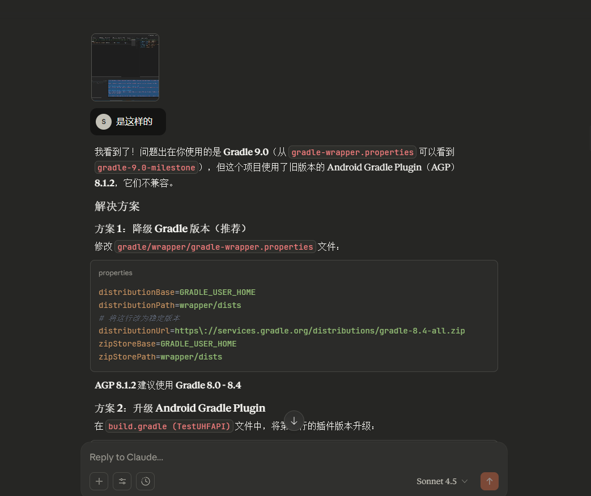

使用idel打开也是一样的


## 跑起来遇到的大坑



提供过来的版本是9.0版本的 

但是去

配置的build.gradle中查看到的版本是8.1.2

而gradle-wrapper.properties中的 
`#distributionUrl=https\://services.gradle.org/distributions/gradle-9.0-milestone-1-bin.zip`


需要改为适配的


## 修改为适配的版本后可算能够启动了

和鸿蒙开发时候有一丢丢类似


------

## 🧩 一、安装与准备环境

### 1️⃣ 安装 Android Studio

👉 [官方下载地址](https://developer.android.com/studio)

安装时保持默认选项，系统会自动安装：

- Android SDK
- Gradle
- AVD（Android 虚拟设备管理器）

> ⚠️ 注意：推荐使用 **Android Studio Giraffe（或更高）** 版本。

------

### 2️⃣ 安装 JDK（如果没装）

Android Studio 自带内置 JDK，一般不用单独安装。
 若项目报错找不到 JDK，可安装 **JDK 11** 并设置环境变量。

验证命令：

```bash
java -version
```

应该看到：

```
openjdk version "11.x.x"
```

------

## 🧭 二、导入你的项目

1. 打开 **Android Studio**

2. 在启动界面选择：

   > 🟢 **"Open an existing project"**

3. 选择你的项目目录：

   ```
   D:\gongxi_work\workspace\docking\TestUHFAPI
   ```

4. 点击 “OK”
    Studio 会自动识别并导入 Gradle 项目。

5. 等待构建（第一次会下载 Gradle 依赖，稍慢）

------

## ⚙️ 三、检查项目配置

打开左下角的 “Gradle” 面板，确认能看到：

```
app > Tasks > build > assembleDebug
```

如果右下角弹出：

> “Gradle sync finished successfully” ✅
>  说明导入成功。

------

## 🔧 四、选择运行设备

有两种方式运行：

### ✅ 方法 1：真机运行（推荐）

1. 用数据线连接你的 Android 设备

2. 在手机中开启：

   ```
   设置 → 开发者选项 → USB调试（打开）
   ```

3. Android Studio 会自动检测到设备
    → 顶部工具栏出现设备名，比如：

   ```
   HUAWEI P30 Pro
   ```

4. 点击 ▶️（Run）即可安装并运行。

------

### 🧪 方法 2：模拟器运行

1. 点击工具栏的 **“AVD Manager”**（小手机图标）
2. 新建一个虚拟设备（如 Pixel 5）
3. 选择系统镜像（Android 10 或更高）
4. 启动模拟器后，点击 ▶️ 运行项目。

------

## 📦 五、构建 APK

即使不运行，也可以手动打包 APK：

- 在右侧 **Gradle 面板** 中选择：

  ```
  app → Tasks → build → assembleDebug
  ```

- 构建完成后，APK 文件在：

  ```
  app/build/outputs/apk/debug/app-debug.apk
  ```

你可以直接把这个 APK 安装到真机测试。

------

## 🚨 六、常见问题与解决

| 问题                      | 原因                         | 解决方式                                                     |
| ------------------------- | ---------------------------- | ------------------------------------------------------------ |
| ❌ “Gradle sync failed”    | 网络问题或 Gradle 版本不匹配 | 编辑 `gradle-wrapper.properties` 改为阿里镜像                |
| ❌ “SDK not found”         | 没装 Android SDK             | 打开 “File → Settings → Appearance & Behavior → System Settings → Android SDK” 重新安装 |
| ⚠️ “Manifest merge failed” | SDK 版本不兼容               | 修改 `compileSdkVersion` / `targetSdkVersion` 保持一致       |

------

## 💡 七、关于你的项目（TestUHFAPI）

这是一个测试 **UHF RFID 模块（超高频读写模块）** 的 Android 应用。
 运行后可能需要连接 **具备 UHF 模块的手持终端设备**（如 Urovo、Chainway PDA），普通手机可能无法读到 RFID 标签。


