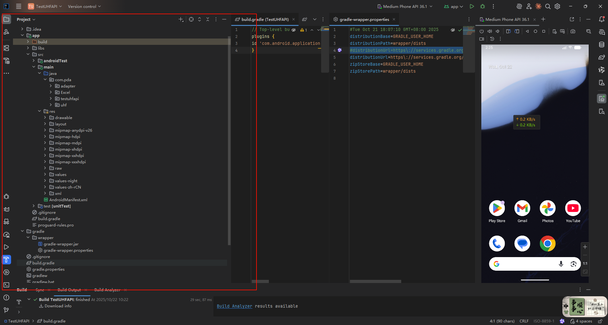

## 目录结构



### 主结构

> TestUHFAPI/
> ├── 📱 app/                    # 主应用模块
> ├── 🔧 gradle/                 # Gradle 配置文件
> ├── 📄 build.gradle            # 项目级构建配置
> ├── 📄 settings.gradle         # 项目设置
> └── 📄 gradle.properties       # Gradle 属性配置


### 模块详解   app

> app/
> ├── 📂 src/
> │   ├── 🎯 main/              # 主要代码和资源
> │   │   ├── ☕ java/          # Java/Kotlin 源代码
> │   │   │   └── com.pda/
> │   │   │       ├── adapter/      # 适配器（ListView/RecyclerView）
> │   │   │       ├── Excel/        # Excel 相关功能
> │   │   │       ├── testuhfapi/   # 主要功能代码
> │   │   │       └── uhf/          # UHF（超高频RFID）相关
> │   │   │
> │   │   ├── 🎨 res/           # 资源文件
> │   │   │   ├── drawable/     # 图片资源
> │   │   │   ├── layout/       # 界面布局文件（XML）
> │   │   │   ├── mipmap-*/     # 应用图标（不同分辨率）
> │   │   │   ├── values/       # 值资源
> │   │   │   │   ├── colors.xml    # 颜色定义
> │   │   │   │   ├── strings.xml   # 文本字符串
> │   │   │   │   └── styles.xml    # 样式定义
> │   │   │   └── xml/          # XML 配置文件
> │   │   │
> │   │   └── 📋 AndroidManifest.xml  # 应用清单文件（重要！）
> │   │
> │   └── 🧪 test/              # 单元测试
> │
> ├── 📄 build.gradle           # 模块级构建配置
> └── 📄 proguard-rules.pro     # 代码混淆规则

## 关键文件学习

### 1. **AndroidManifest.xml** ⭐⭐⭐

```xml
<!-- 应用的"身份证" -->
- 声明应用权限（网络、存储、相机等）
- 定义应用组件（Activity、Service等）
- 设置应用图标、名称
- 配置启动页面
```

### 2. **build.gradle (app)** ⭐⭐⭐

```gradle
// 应用的构建配置
- applicationId: 应用包名
- minSdk: 最低支持的 Android 版本
- targetSdk: 目标 Android 版本
- dependencies: 依赖的第三方库
```

### 3. **layout/\*.xml** ⭐⭐

```xml
<!-- 界面布局文件 -->
- activity_main.xml: 主界面布局
- 定义按钮、文本框、列表等UI组件
```

### 4. **Java 代码文件** ⭐⭐⭐

```java
// 业务逻辑代码
- Activity: 界面控制器
- Adapter: 数据适配器
- 工具类: 辅助功能
```

## 🎯 项目特点（UHF RFID 应用）

从目录结构看，这是一个 **UHF RFID 读写器应用**：
```
主要功能模块：
├── testuhfapi/     # RFID 读写主功能
├── uhf/            # UHF 硬件通信
├── adapter/        # 数据列表显示
└── Excel/          # Excel 数据导入导出
```


