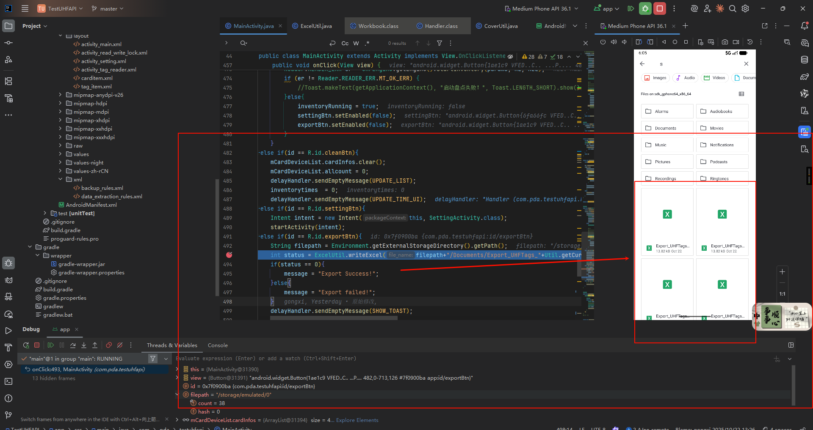

# RFID标签数据导出到外置SD卡详解

## 前言

前面我们谈到了RFID的读写操作，但是由于没有具体的RFID标签，所以只能模拟数据。但是呢，模拟出数据列表，对单条数据进行读写呢会有上电和下电等操作，也就导致了点击单条列表会出现运行错误，这里就先暂且搁置搁置。

暂且将读写中涉及到UHF引擎的地方给注释了。

### 修改后代码

```java
package com.pda.testuhfapi;

import androidx.appcompat.app.AppCompatActivity;

import android.annotation.SuppressLint;
import android.app.Activity;
import android.app.AlertDialog;
import android.content.DialogInterface;
import android.os.Bundle;
import android.util.Log;
import android.view.View;
import android.widget.AdapterView;
import android.widget.Button;
import android.widget.EditText;
import android.widget.Spinner;
import android.widget.TextView;
import android.widget.Toast;

import com.pda.uhf.UHFEngine;
import com.pda.uhf.UHFParamsOperator;
import com.pda.uhf.UHFUtils;
import com.pda.uhf.model.params.AntPowerConfResult;
import com.uhf.api.cls.Reader;

import java.util.Locale;

public class ReadWriteLockActivity extends Activity {

    private TextView rw_tid_text = null;
    private EditText rw_epc_edit = null;

    private Button rw_gettid_btn = null;

    private Button rw_read_btn = null;
    private Spinner rw_mem_bank_read_spinner = null;
    private TextView rw_address_read_edittext = null;
    private TextView rw_read_length_edittext = null;
    private TextView rw_password_read_edittext = null;
    private TextView rw_read_rsp_text = null;
    private Spinner filter_mem_bank_spinner = null;
    private EditText filter_address_edittext = null;
    private EditText filterdata_edittext = null;

    private Spinner rw_mem_bank_write_spinner = null;
    private Button rw_write_btn = null;
    private EditText rw_address_write_edittext = null;
    private EditText rw_password_write_edittext = null;
    private EditText rw_data_write_edittext = null;
    private TextView rw_write_rsp_text = null;

    private Spinner lock_item_spinner = null;
    private Spinner lock_type_spinner = null;
    private EditText rw_password_lock_edittext = null;
    private Button rw_lock_btn = null;

    private EditText rw_password_kill_edittext = null;
    private Button rw_kill_btn = null;

    @SuppressLint("WrongViewCast")
    @Override
    protected void onCreate(Bundle savedInstanceState) {
        super.onCreate(savedInstanceState);
        setContentView(R.layout.activity_read_write_lock);

        rw_tid_text = findViewById(R.id.rw_tid_text);
        rw_epc_edit = findViewById(R.id.rw_epc_edit);
        rw_epc_edit.setText(DefaultConfigure.currentEpc);

        rw_gettid_btn = findViewById(R.id.rw_gettid_btn);
        rw_gettid_btn.setOnClickListener(new View.OnClickListener() {
            @Override
            public void onClick(View view) {
                // TODO_UHF_RESTORE: 恢复真实设备时取消下面的注释
                /*
                //根据EPC数据读取TID
                byte[] rdata = new byte[12];//读取存放的存储空间
                byte[] rpaswd = {0x00,0x00,0x00,0x00};//密钥，如果标签有密钥填入自己的密钥，如果没有用全0
                Reader.TagFilter_ST g2tf = new Reader.TagFilter_ST();//创建过滤起
                //转换成EPC字节数组
                byte[] fdata = new byte[DefaultConfigure.currentEpc.length() / 2];
                UHFUtils.Str2Hex(DefaultConfigure.currentEpc, DefaultConfigure.currentEpc.length(), fdata);

                //Log.e("###",Util.bytes2hex(fdata));
                //Log.e("###",Util.bytes2hex(rpaswd));

                g2tf.fdata = fdata;
                g2tf.flen = fdata.length * 8;//长度单位是bit，所以用字节数乘以8
                g2tf.isInvert = 0;


                g2tf.bank = InventoryModeParams.BANK.EPC;//设置过滤的分区为EPC
                g2tf.startaddr = 32;//开始地址，EPC分区前32个bit是PC等数据，所以跳过前32个bit
                Reader.READER_ERR er = UHFParamsOperator.getInstance().setTagFilter(g2tf);//设置过滤条件
                if (er == Reader.READER_ERR.MT_OK_ERR) {
                    Log.e("###","设置过滤成功！");
                }
                //读tid （2），起始块 0  块数 6
                int rbank = InventoryModeParams.BANK.TID;//读取分区是TID
                int startblock = 0;//开始地址，TID的开始地址是0，如果要跳过前面的字节，设置这个数值，单位是bit
                int blockcount = 6;//设置读取的块数，读取是以块读取，每个块是2个字节，6个块就是12个字节，96个bit

                //最多循环读三次，如果三次都失败，认为读取失败
                for(int index = 0;index < 3;index++) {
                    er = UHFEngine.getEngine().getTagData(
                            1,//读取的天线，只有一个天线，设置为1
                            (char) rbank,
                            startblock,
                            blockcount,
                            rdata,
                            rpaswd,
                            (short) 1000//读取超时时间
                    );
                    if(er == Reader.READER_ERR.MT_OK_ERR)
                        break;
                }

                if (er == Reader.READER_ERR.MT_OK_ERR) {
                    //Log.e("###","TID:"+Util.bytes2hex(rdata));
                    ReadWriteLockActivity.this.runOnUiThread(new Runnable() {
                        @Override
                        public void run() {

                            rw_tid_text.setText(Util.bytes2hex(rdata).toUpperCase(Locale.ROOT));
                            Toast.makeText(getApplicationContext(),"Read TID success!",Toast.LENGTH_SHORT).show();
                        }
                    });

                }else{
                    ReadWriteLockActivity.this.runOnUiThread(new Runnable() {
                        @Override
                        public void run() {
                            Toast.makeText(getApplicationContext(),"Read TID failed!",Toast.LENGTH_SHORT).show();
                        }
                    });
                }
                UHFParamsOperator.getInstance().setTagFilter(null);//读取完毕，恢复过滤设置
                */

                // TODO_UHF_RESTORE: 模拟数据，有真实设备时删除下面的代码
                // 模拟读取TID成功
                ReadWriteLockActivity.this.runOnUiThread(new Runnable() {
                    @Override
                    public void run() {
                        // 模拟TID数据
                        rw_tid_text.setText("E200001234567890ABCDEF01");
                        Toast.makeText(getApplicationContext(),"Read TID success! (模拟数据)",Toast.LENGTH_SHORT).show();
                    }
                });
            }
        });


        rw_mem_bank_read_spinner = findViewById(R.id.rw_mem_bank_read_spinner);

        rw_mem_bank_read_spinner.setOnItemSelectedListener(new AdapterView.OnItemSelectedListener() {
            @Override
            public void onItemSelected(AdapterView<?> adapterView, View view, int i, long l) {
                if(i == 1)
                    rw_address_read_edittext.setText("2");
                else
                    rw_address_read_edittext.setText("0");
            }

            @Override
            public void onNothingSelected(AdapterView<?> adapterView) {

            }
        });
        rw_address_read_edittext = findViewById(R.id.rw_address_read_edittext);
        rw_read_length_edittext = findViewById(R.id.rw_read_length_edittext);
        rw_password_read_edittext = findViewById(R.id.rw_password_read_edittext);
        rw_read_btn = findViewById(R.id.rw_read_btn);
        rw_read_rsp_text = findViewById(R.id.rw_read_rsp_text);
        rw_read_btn.setOnClickListener(new View.OnClickListener() {
            @Override
            public void onClick(View view) {
                // TODO_UHF_RESTORE: 恢复真实设备时取消下面的注释
                /*
                int startaddr = Integer.valueOf(rw_address_read_edittext.getText().toString().trim());
                int blocks = Integer.valueOf(rw_read_length_edittext.getText().toString().trim());
                byte[] rpaswd = new byte[rw_password_read_edittext.getText().length()/2];
                UHFUtils.Str2Hex(rw_password_read_edittext.getText().toString(), rw_password_read_edittext.getText().toString().length(), rpaswd);
                byte[] rdata = new byte[blocks*2];//读取存放的存储空间
                Reader.READER_ERR er = null;

                if(!setFilter()){
                    Toast.makeText(getApplicationContext(),"设置过滤失败！",Toast.LENGTH_SHORT).show();
                    return;
                }
                int startblock = startaddr;//开始地址，TID的开始地址是0，如果要跳过前面的字节，设置这个数值，单位是bit
                int blockcount = blocks;//设置读取的块数，读取是以块读取，每个块是2个字节，6个块就是12个字节，96个bit
                int rbank = 0;
                switch (rw_mem_bank_read_spinner.getSelectedItemPosition()){
                    case 0://read reserved
                        rbank = InventoryModeParams.BANK.Reserved;//读取分区是reserved(保留区)
                        break;
                    case 1://read epc
                        //读epc （1），起始块 2  块数 6
                        rbank = InventoryModeParams.BANK.EPC;//读取分区是EPC
                        break;
                    case 2://read tid
                        //读tid （2），起始块 0  块数 6
                        rbank = InventoryModeParams.BANK.TID;//读取分区是TID
                        break;
                    case 3://read user
                        //读user （3），起始块 0  块数 6
                        rbank = InventoryModeParams.BANK.USER;//读取分区是USER
                        break;
                }
                //最多循环读三次，如果三次都失败，认为读取失败
                for(int index = 0;index < 3;index++) {
                    er = UHFEngine.getEngine().getTagData(
                            1,//读取的天线，只有一个天线，设置为1
                            (char) rbank,
                            startblock,
                            blockcount,
                            rdata,
                            rpaswd,
                            (short) 1000//读取超时时间
                    );
                    if(er == Reader.READER_ERR.MT_OK_ERR)
                        break;
                }
                if (er == Reader.READER_ERR.MT_OK_ERR) {
                    //Log.e("###","TID:"+Util.bytes2hex(rdata));
                    ReadWriteLockActivity.this.runOnUiThread(new Runnable() {
                        @Override
                        public void run() {
                            rw_read_rsp_text.setText(Util.bytes2hex(rdata).toUpperCase(Locale.ROOT));
                            Toast.makeText(getApplicationContext(),"Read success!",Toast.LENGTH_SHORT).show();
                        }
                    });

                }else{
                    ReadWriteLockActivity.this.runOnUiThread(new Runnable() {
                        @Override
                        public void run() {
                            Toast.makeText(getApplicationContext(),"Read failed!",Toast.LENGTH_SHORT).show();
                        }
                    });
                }
                //UHFParamsOperator.getInstance().setTagFilter(null);//读取完毕，恢复过滤设置为null
                resetFilter();
                */

                // TODO_UHF_RESTORE: 模拟数据，有真实设备时删除下面的代码
                // 模拟读取成功
                ReadWriteLockActivity.this.runOnUiThread(new Runnable() {
                    @Override
                    public void run() {
                        String mockData = "";
                        switch (rw_mem_bank_read_spinner.getSelectedItemPosition()){
                            case 0: // Reserved
                                mockData = "00000000";
                                break;
                            case 1: // EPC
                                mockData = DefaultConfigure.currentEpc;
                                break;
                            case 2: // TID
                                mockData = "E200001234567890ABCDEF01";
                                break;
                            case 3: // USER
                                mockData = "1234567890ABCDEF";
                                break;
                        }
                        rw_read_rsp_text.setText(mockData);
                        Toast.makeText(getApplicationContext(),"Read success! (模拟数据)",Toast.LENGTH_SHORT).show();
                    }
                });
            }
        });

        filter_mem_bank_spinner = findViewById(R.id.filter_mem_bank_spinner);
        filter_address_edittext = findViewById(R.id.filter_address_edittext);
        filterdata_edittext = findViewById(R.id.filterdata_edittext);
        filterdata_edittext.setText(DefaultConfigure.currentEpc);
        filter_mem_bank_spinner.setSelection(1);//默认EPC
        filter_address_edittext.setText("2");
        filter_mem_bank_spinner.setOnItemSelectedListener(new AdapterView.OnItemSelectedListener() {
            @Override
            public void onItemSelected(AdapterView<?> adapterView, View view, int i, long l) {
                if(i == 1)
                    filter_address_edittext.setText("2");
                else
                    filter_address_edittext.setText("0");
            }

            @Override
            public void onNothingSelected(AdapterView<?> adapterView) {

            }
        });


        rw_mem_bank_write_spinner = findViewById(R.id.rw_mem_bank_write_spinner);
        rw_mem_bank_write_spinner.setSelection(1);//默认选择EPC
        rw_password_write_edittext = findViewById(R.id.rw_password_write_edittext);
        rw_address_write_edittext = findViewById(R.id.rw_address_write_edittext);
        rw_data_write_edittext = findViewById(R.id.rw_data_write_edittext);
        rw_write_rsp_text = findViewById(R.id.rw_write_rsp_text);
        rw_write_btn = findViewById(R.id.rw_write_btn);

        rw_mem_bank_write_spinner.setOnItemSelectedListener(new AdapterView.OnItemSelectedListener() {
            @Override
            public void onItemSelected(AdapterView<?> adapterView, View view, int i, long l) {
                if(i == 1)
                    rw_address_write_edittext.setText("2");
                else
                    rw_address_write_edittext.setText("0");
            }

            @Override
            public void onNothingSelected(AdapterView<?> adapterView) {

            }
        });

        rw_write_btn.setOnClickListener(new View.OnClickListener() {
            @Override
            public void onClick(View view) {
                // TODO_UHF_RESTORE: 恢复真实设备时取消下面的注释
                /*
                if(!setFilter()){
                    ReadWriteLockActivity.this.runOnUiThread(new Runnable() {
                        @Override
                        public void run() {
                            Toast.makeText(getApplicationContext(),"设置过滤失败！",Toast.LENGTH_SHORT).show();
                        }
                    });

                    return;
                }

                int wbank = 0;//要写的分区
                switch (rw_mem_bank_write_spinner.getSelectedItemPosition()){
                    case 0://write reserved
                        wbank = InventoryModeParams.BANK.Reserved;//写入分区是reserved(保留区)
                        break;
                    case 1://write epc
                        //写epc （1），起始块 2  块数 6
                        wbank = InventoryModeParams.BANK.EPC;//写入分区是EPC
                        break;
                    case 2://write user.because tid cannot be writed,so skip tip
                        //写user （3），起始块 0  块数 6
                        wbank = InventoryModeParams.BANK.USER;//写入分区是USER,由于TID不能写，所以列表中没有TID
                        break;
                }
                int write_startaddr = Integer.valueOf(rw_address_write_edittext.getText().toString().trim());
                byte[] wpaswd = new byte[rw_password_write_edittext.getText().length()/2];
                UHFUtils.Str2Hex(rw_password_write_edittext.getText().toString(), rw_password_write_edittext.getText().toString().length(), wpaswd);
                String wdataString = rw_data_write_edittext.getText().toString();
                byte[] wdata = new byte[wdataString.length()/2];//写入存放的存储空间
                UHFUtils.Str2Hex(wdataString, wdataString.length(), wdata);
                int trycount = 3;
                Reader.READER_ERR er = null;
                do {
                    er = UHFEngine.getEngine().writeTagData(1,
                            (char) wbank,
                            write_startaddr,
                            wdata,
                            wdata.length,
                            wpaswd,
                            (short) 1000);

                    trycount--;
                    if (trycount < 1)
                        break;
                } while (er != Reader.READER_ERR.MT_OK_ERR);
                resetFilter();//恢复过滤
                if (er == Reader.READER_ERR.MT_OK_ERR) {
                    //Log.e("###","TID:"+Util.bytes2hex(rdata));
                    ReadWriteLockActivity.this.runOnUiThread(new Runnable() {
                        @Override
                        public void run() {
                            //rw_read_rsp_text.setText(Util.bytes2hex(rdata).toUpperCase(Locale.ROOT));
                            Toast.makeText(getApplicationContext(),"Write success!",Toast.LENGTH_SHORT).show();
                        }
                    });

                }else{
                    ReadWriteLockActivity.this.runOnUiThread(new Runnable() {
                        @Override
                        public void run() {
                            Toast.makeText(getApplicationContext(),"Write failed!",Toast.LENGTH_SHORT).show();
                        }
                    });
                }
                */

                // TODO_UHF_RESTORE: 模拟数据，有真实设备时删除下面的代码
                // 模拟写入成功
                ReadWriteLockActivity.this.runOnUiThread(new Runnable() {
                    @Override
                    public void run() {
                        Toast.makeText(getApplicationContext(),"Write success! (模拟操作)",Toast.LENGTH_SHORT).show();
                    }
                });
            }

        });

        lock_item_spinner = findViewById(R.id.lock_item_spinner);

        lock_type_spinner = findViewById(R.id.lock_type_spinner);

        rw_password_lock_edittext = findViewById(R.id.rw_password_lock_edittext);
        rw_lock_btn = findViewById(R.id.rw_lock_btn);
        rw_lock_btn.setOnClickListener(new View.OnClickListener() {
            @Override
            public void onClick(View view) {

                AlertDialog.Builder builder = new AlertDialog.Builder(ReadWriteLockActivity.this);
                builder.setTitle(R.string.warning); // 设置对话框标题
                builder.setMessage(R.string.lockwarning); // 设置对话框内容
                builder.setPositiveButton(R.string.commit, new DialogInterface.OnClickListener() {
                    @Override
                    public void onClick(DialogInterface dialog, int which) {
                        // TODO_UHF_RESTORE: 恢复真实设备时取消下面的注释
                        /*
                        Reader.Lock_Obj lobj = null;
                        Reader.Lock_Type ltyp = null;
                        int lbank = lock_item_spinner.getSelectedItemPosition();
                        int ltype = lock_type_spinner.getSelectedItemPosition();
                        if (lbank == 0) {
                            lobj = Reader.Lock_Obj.LOCK_OBJECT_ACCESS_PASSWD;
                            if (ltype == 0)
                                ltyp = Reader.Lock_Type.ACCESS_PASSWD_UNLOCK;
                            else if (ltype == 1)
                                ltyp = Reader.Lock_Type.ACCESS_PASSWD_LOCK;
                            else if (ltype == 2)
                                ltyp = Reader.Lock_Type.ACCESS_PASSWD_PERM_LOCK;

                        } else if (lbank == 1) {
                            lobj = Reader.Lock_Obj.LOCK_OBJECT_KILL_PASSWORD;
                            if (ltype == 0)
                                ltyp = Reader.Lock_Type.KILL_PASSWORD_UNLOCK;
                            else if (ltype == 1)
                                ltyp = Reader.Lock_Type.KILL_PASSWORD_LOCK;
                            else if (ltype == 2)
                                ltyp = Reader.Lock_Type.KILL_PASSWORD_PERM_LOCK;
                        } else if (lbank == 2) {
                            lobj = Reader.Lock_Obj.LOCK_OBJECT_BANK1;
                            if (ltype == 0)
                                ltyp = Reader.Lock_Type.BANK1_UNLOCK;
                            else if (ltype == 1)
                                ltyp = Reader.Lock_Type.BANK1_LOCK;
                            else if (ltype == 2)
                                ltyp = Reader.Lock_Type.BANK1_PERM_LOCK;
                        } else if (lbank == 3) {
                            lobj = Reader.Lock_Obj.LOCK_OBJECT_BANK2;
                            if (ltype == 0)
                                ltyp = Reader.Lock_Type.BANK2_UNLOCK;
                            else if (ltype == 1)
                                ltyp = Reader.Lock_Type.BANK2_LOCK;
                            else if (ltype == 2)
                                ltyp = Reader.Lock_Type.BANK2_PERM_LOCK;
                        } else if (lbank == 4) {
                            lobj = Reader.Lock_Obj.LOCK_OBJECT_BANK3;
                            if (ltype == 0)
                                ltyp = Reader.Lock_Type.BANK3_UNLOCK;
                            else if (ltype == 1)
                                ltyp = Reader.Lock_Type.BANK3_LOCK;
                            else if (ltype == 2)
                                ltyp = Reader.Lock_Type.BANK3_PERM_LOCK;
                        }

                        byte[] lockpaswd = new byte[4];

                        if (!rw_password_lock_edittext.getText().toString().equals("")) {
                            UHFUtils.Str2Hex(rw_password_lock_edittext.getText().toString(),
                                    rw_password_lock_edittext.getText().toString().length(), lockpaswd);
                        }
                        if(!setFilter()){
                            ReadWriteLockActivity.this.runOnUiThread(new Runnable() {
                                @Override
                                public void run() {
                                    Toast.makeText(getApplicationContext(),"设置过滤失败！",Toast.LENGTH_SHORT).show();
                                }
                            });

                            return;
                        }
                        Reader.READER_ERR er = UHFEngine.getEngine().lockTag(
                                1,
                                (byte) lobj.value(),
                                (short) ltyp.value(),
                                lockpaswd,
                                (short) 1000);
                        if (er == Reader.READER_ERR.MT_OK_ERR) {
                            ReadWriteLockActivity.this.runOnUiThread(new Runnable() {
                                @Override
                                public void run() {
                                    Toast.makeText(getApplicationContext(),"Lock Success!",Toast.LENGTH_SHORT).show();
                                }
                            });

                        } else {
                            ReadWriteLockActivity.this.runOnUiThread(new Runnable() {
                                @Override
                                public void run() {
                                    Toast.makeText(getApplicationContext(),"Lock failed!",Toast.LENGTH_SHORT).show();
                                }
                            });
                        }
                        resetFilter();
                        */

                        // TODO_UHF_RESTORE: 模拟数据，有真实设备时删除下面的代码
                        // 模拟锁定成功
                        ReadWriteLockActivity.this.runOnUiThread(new Runnable() {
                            @Override
                            public void run() {
                                Toast.makeText(getApplicationContext(),"Lock Success! (模拟操作)",Toast.LENGTH_SHORT).show();
                            }
                        });
                    }
                });
                builder.setNegativeButton(R.string.cancel, new DialogInterface.OnClickListener() {
                    @Override
                    public void onClick(DialogInterface dialog, int which) {
                        dialog.cancel();
                    }
                });

                AlertDialog alertDialog = builder.create();
                alertDialog.show(); // 显示对话框


            }
        });

        rw_password_kill_edittext = findViewById(R.id.rw_password_kill_edittext);
        rw_kill_btn = findViewById(R.id.rw_kill_btn);
        rw_kill_btn.setOnClickListener(new View.OnClickListener() {
            @Override
            public void onClick(View view) {


                AlertDialog.Builder builder = new AlertDialog.Builder(ReadWriteLockActivity.this);
                builder.setTitle(R.string.warning); // 设置对话框标题
                builder.setMessage(R.string.killwarning); // 设置对话框内容
                builder.setPositiveButton(R.string.commit, new DialogInterface.OnClickListener() {
                    @Override
                    public void onClick(DialogInterface dialog, int which) {
                        // TODO_UHF_RESTORE: 恢复真实设备时取消下面的注释
                            /*
                            byte[] killpaswd = new byte[4];

                            if (!rw_password_kill_edittext.getText().toString().equals("")) {
                                UHFUtils.Str2Hex(rw_password_kill_edittext.getText().toString(),
                                        rw_password_kill_edittext.getText().toString().length(), killpaswd);
                            }
                            if(!setFilter()){
                                ReadWriteLockActivity.this.runOnUiThread(new Runnable() {
                                    @Override
                                    public void run() {
                                        Toast.makeText(getApplicationContext(),"设置过滤失败！",Toast.LENGTH_SHORT).show();
                                    }
                                });

                                return;
                            }
                            Reader.READER_ERR er = UHFEngine.getEngine().killTag(
                                    1,
                                    killpaswd,
                                    (short) 1000);

                            if (er == Reader.READER_ERR.MT_OK_ERR) {
                                ReadWriteLockActivity.this.runOnUiThread(new Runnable() {
                                    @Override
                                    public void run() {
                                        Toast.makeText(getApplicationContext(),"Kill success!",Toast.LENGTH_SHORT).show();
                                    }
                                });
                            } else {
                                ReadWriteLockActivity.this.runOnUiThread(new Runnable() {
                                    @Override
                                    public void run() {
                                        Toast.makeText(getApplicationContext(),"Kill failed!",Toast.LENGTH_SHORT).show();
                                    }
                                });
                            }
                            resetFilter();
                            */

                        // TODO_UHF_RESTORE: 模拟数据，有真实设备时删除下面的代码
                        // 模拟销毁成功
                        ReadWriteLockActivity.this.runOnUiThread(new Runnable() {
                            @Override
                            public void run() {
                                Toast.makeText(getApplicationContext(),"Kill success! (模拟操作)",Toast.LENGTH_SHORT).show();
                            }
                        });
                    }
                });
                builder.setNegativeButton(R.string.cancel, new DialogInterface.OnClickListener() {
                    @Override
                    public void onClick(DialogInterface dialog, int which) {
                        dialog.cancel();
                    }
                });

                AlertDialog alertDialog = builder.create();
                alertDialog.show(); // 显示对话框
            }

        });
    }

    private boolean setFilter(){
        // TODO_UHF_RESTORE: 恢复真实设备时取消下面的注释
        /*
        //int readlength = Integer.valueOf(rw_read_length_edittext.getText().toString().trim());
        //int startaddr = Integer.valueOf(rw_address_read_edittext.getText().toString().trim());
        int blocks = Integer.valueOf(rw_read_length_edittext.getText().toString().trim());
        //byte[] rpaswd = new byte[rw_password_read_edittext.getText().length()/2];
        //UHFUtils.Str2Hex(rw_password_read_edittext.getText().toString(), rw_password_read_edittext.getText().toString().length(), rpaswd);

        byte[] rdata = new byte[blocks*2];//读取存放的存储空间

        Reader.TagFilter_ST g2tf = new Reader.TagFilter_ST();//创建过滤器
        //转换成字节数组
        if(filterdata_edittext.getText().toString().length() == 0 || filterdata_edittext.getText().toString().length()%2 != 0){
            return false;
        }
        byte[] fdata = new byte[filterdata_edittext.getText().toString().length() / 2];
        UHFUtils.Str2Hex(filterdata_edittext.getText().toString(), filterdata_edittext.getText().toString().length(), fdata);

        g2tf.fdata = fdata;
        g2tf.flen = fdata.length * 8;//长度单位是bit，所以用字节数乘以8
        g2tf.isInvert = 0;

        //g2tf.bank = InventoryModeParams.BANK.EPC;//设置过滤的分区为EPC
        g2tf.bank = filter_mem_bank_spinner.getSelectedItemPosition();
        //g2tf.startaddr = 32;//开始地址，EPC分区前32个bit是PC等数据，所以跳过前32个bit

        g2tf.startaddr = Integer.valueOf(filter_address_edittext.getText().toString())*2*8;//一个块2个字节，每个字节8个bit


        Reader.READER_ERR er = UHFParamsOperator.getInstance().setTagFilter(g2tf);//设置过滤条件
        if (er == Reader.READER_ERR.MT_OK_ERR) {
            Log.e("###","设置过滤成功！");
            return true;
        }
        return false;
        */

        // TODO_UHF_RESTORE: 模拟数据，有真实设备时删除下面的代码
        // 模拟设置过滤成功
        Log.e("###","设置过滤成功！(模拟)");
        return true;
    }

    private void resetFilter(){
        // TODO_UHF_RESTORE: 恢复真实设备时取消下面的注释
        /*
        UHFParamsOperator.getInstance().setTagFilter(null);//读取完毕，恢复过滤设置为null
        */

        // TODO_UHF_RESTORE: 模拟数据，有真实设备时删除下面的代码
        // 模拟重置过滤
        Log.e("###","重置过滤！(模拟)");
    }

    protected void onResume() {
        // TODO_UHF_RESTORE: 恢复真实设备时取消下面的注释
        /*
        //上电
        UHFEngine.getEngine().powerOn();
        //连接模块
        Reader.READER_ERR er = UHFEngine.getEngine().connectModule(DefaultConfigure.UART_DEV_PATH, 1);
        if(er == Reader.READER_ERR.MT_OK_ERR){
            DefaultConfigure.defaultInitModule();
            //AntPowerConfResult result = UHFParamsOperator.getInstance().getAntPowerConf();
            Log.e("####","connect success!");
        }else{
            Log.e("####","connect failed!");

        }
        */

        // TODO_UHF_RESTORE: 模拟数据，有真实设备时删除下面的代码
        Log.e("####","模拟连接成功！");

        super.onResume();
    }

    @Override
    protected void onPause() {
        // TODO_UHF_RESTORE: 恢复真实设备时取消下面的注释
        /*
        //断开连接
        UHFEngine.getEngine().disconnectModule();
        //下电
        UHFEngine.getEngine().powerOff();
        */

        // TODO_UHF_RESTORE: 模拟数据，有真实设备时删除下面的代码
        Log.e("####","模拟断开连接！");

        super.onPause();
    }

}
```

### 原始代码

```java
package com.pda.testuhfapi;

import androidx.appcompat.app.AppCompatActivity;

import android.annotation.SuppressLint;
import android.app.Activity;
import android.app.AlertDialog;
import android.content.DialogInterface;
import android.os.Bundle;
import android.util.Log;
import android.view.View;
import android.widget.AdapterView;
import android.widget.Button;
import android.widget.EditText;
import android.widget.Spinner;
import android.widget.TextView;
import android.widget.Toast;

import com.pda.uhf.UHFEngine;
import com.pda.uhf.UHFParamsOperator;
import com.pda.uhf.UHFUtils;
import com.pda.uhf.model.params.AntPowerConfResult;
import com.uhf.api.cls.Reader;

import java.util.Locale;

public class ReadWriteLockActivity extends Activity {

    private TextView rw_tid_text = null;
    private EditText rw_epc_edit = null;

    private Button rw_gettid_btn = null;

    private Button rw_read_btn = null;
    private Spinner rw_mem_bank_read_spinner = null;
    private TextView rw_address_read_edittext = null;
    private TextView rw_read_length_edittext = null;
    private TextView rw_password_read_edittext = null;
    private TextView rw_read_rsp_text = null;
    private Spinner filter_mem_bank_spinner = null;
    private EditText filter_address_edittext = null;
    private EditText filterdata_edittext = null;

    private Spinner rw_mem_bank_write_spinner = null;
    private Button rw_write_btn = null;
    private EditText rw_address_write_edittext = null;
    private EditText rw_password_write_edittext = null;
    private EditText rw_data_write_edittext = null;
    private TextView rw_write_rsp_text = null;

    private Spinner lock_item_spinner = null;
    private Spinner lock_type_spinner = null;
    private EditText rw_password_lock_edittext = null;
    private Button rw_lock_btn = null;

    private EditText rw_password_kill_edittext = null;
    private Button rw_kill_btn = null;

    @SuppressLint("WrongViewCast")
    @Override
    protected void onCreate(Bundle savedInstanceState) {
        super.onCreate(savedInstanceState);
        setContentView(R.layout.activity_read_write_lock);

        rw_tid_text = findViewById(R.id.rw_tid_text);
        rw_epc_edit = findViewById(R.id.rw_epc_edit);
        rw_epc_edit.setText(DefaultConfigure.currentEpc);

        rw_gettid_btn = findViewById(R.id.rw_gettid_btn);
        rw_gettid_btn.setOnClickListener(new View.OnClickListener() {
            @Override
            public void onClick(View view) {
                //根据EPC数据读取TID
                byte[] rdata = new byte[12];//读取存放的存储空间
                byte[] rpaswd = {0x00,0x00,0x00,0x00};//密钥，如果标签有密钥填入自己的密钥，如果没有用全0
                Reader.TagFilter_ST g2tf = new Reader.TagFilter_ST();//创建过滤起
                //转换成EPC字节数组
                byte[] fdata = new byte[DefaultConfigure.currentEpc.length() / 2];
                UHFUtils.Str2Hex(DefaultConfigure.currentEpc, DefaultConfigure.currentEpc.length(), fdata);

                //Log.e("###",Util.bytes2hex(fdata));
                //Log.e("###",Util.bytes2hex(rpaswd));

                g2tf.fdata = fdata;
                g2tf.flen = fdata.length * 8;//长度单位是bit，所以用字节数乘以8
                g2tf.isInvert = 0;


                g2tf.bank = InventoryModeParams.BANK.EPC;//设置过滤的分区为EPC
                g2tf.startaddr = 32;//开始地址，EPC分区前32个bit是PC等数据，所以跳过前32个bit
                Reader.READER_ERR er = UHFParamsOperator.getInstance().setTagFilter(g2tf);//设置过滤条件
                if (er == Reader.READER_ERR.MT_OK_ERR) {
                    Log.e("###","设置过滤成功！");
                }
                //读tid （2），起始块 0  块数 6
                int rbank = InventoryModeParams.BANK.TID;//读取分区是TID
                int startblock = 0;//开始地址，TID的开始地址是0，如果要跳过前面的字节，设置这个数值，单位是bit
                int blockcount = 6;//设置读取的块数，读取是以块读取，每个块是2个字节，6个块就是12个字节，96个bit

                //最多循环读三次，如果三次都失败，认为读取失败
                for(int index = 0;index < 3;index++) {
                    er = UHFEngine.getEngine().getTagData(
                            1,//读取的天线，只有一个天线，设置为1
                            (char) rbank,
                            startblock,
                            blockcount,
                            rdata,
                            rpaswd,
                            (short) 1000//读取超时时间
                    );
                    if(er == Reader.READER_ERR.MT_OK_ERR)
                        break;
                }

                if (er == Reader.READER_ERR.MT_OK_ERR) {
                    //Log.e("###","TID:"+Util.bytes2hex(rdata));
                    ReadWriteLockActivity.this.runOnUiThread(new Runnable() {
                        @Override
                        public void run() {

                            rw_tid_text.setText(Util.bytes2hex(rdata).toUpperCase(Locale.ROOT));
                            Toast.makeText(getApplicationContext(),"Read TID success!",Toast.LENGTH_SHORT).show();
                        }
                    });

                }else{
                    ReadWriteLockActivity.this.runOnUiThread(new Runnable() {
                        @Override
                        public void run() {
                            Toast.makeText(getApplicationContext(),"Read TID failed!",Toast.LENGTH_SHORT).show();
                        }
                    });
                }
                UHFParamsOperator.getInstance().setTagFilter(null);//读取完毕，恢复过滤设置
            }
        });


        rw_mem_bank_read_spinner = findViewById(R.id.rw_mem_bank_read_spinner);

        rw_mem_bank_read_spinner.setOnItemSelectedListener(new AdapterView.OnItemSelectedListener() {
            @Override
            public void onItemSelected(AdapterView<?> adapterView, View view, int i, long l) {
                if(i == 1)
                    rw_address_read_edittext.setText("2");
                else
                    rw_address_read_edittext.setText("0");
            }

            @Override
            public void onNothingSelected(AdapterView<?> adapterView) {

            }
        });
        rw_address_read_edittext = findViewById(R.id.rw_address_read_edittext);
        rw_read_length_edittext = findViewById(R.id.rw_read_length_edittext);
        rw_password_read_edittext = findViewById(R.id.rw_password_read_edittext);
        rw_read_btn = findViewById(R.id.rw_read_btn);
        rw_read_rsp_text = findViewById(R.id.rw_read_rsp_text);
        rw_read_btn.setOnClickListener(new View.OnClickListener() {
            @Override
            public void onClick(View view) {
                int startaddr = Integer.valueOf(rw_address_read_edittext.getText().toString().trim());
                int blocks = Integer.valueOf(rw_read_length_edittext.getText().toString().trim());
                byte[] rpaswd = new byte[rw_password_read_edittext.getText().length()/2];
                UHFUtils.Str2Hex(rw_password_read_edittext.getText().toString(), rw_password_read_edittext.getText().toString().length(), rpaswd);
                byte[] rdata = new byte[blocks*2];//读取存放的存储空间
                Reader.READER_ERR er = null;
                /*
                int readlength = Integer.valueOf(rw_read_length_edittext.getText().toString().trim());


                Reader.TagFilter_ST g2tf = new Reader.TagFilter_ST();//创建过滤器
                //转换成字节数组
                byte[] fdata = new byte[DefaultConfigure.currentEpc.length() / 2];
                UHFUtils.Str2Hex(filterdata_edittext.getText().toString(), filterdata_edittext.getText().toString().length(), fdata);

                g2tf.fdata = fdata;
                g2tf.flen = fdata.length * 8;//长度单位是bit，所以用字节数乘以8
                g2tf.isInvert = 0;

                //g2tf.bank = InventoryModeParams.BANK.EPC;//设置过滤的分区为EPC
                g2tf.bank = filter_mem_bank_spinner.getSelectedItemPosition();
                //g2tf.startaddr = 32;//开始地址，EPC分区前32个bit是PC等数据，所以跳过前32个bit

                g2tf.startaddr = Integer.valueOf(filter_address_edittext.getText().toString())*2*8;//一个块2个字节，每个字节8个bit


                Reader.READER_ERR er = UHFParamsOperator.getInstance().setTagFilter(g2tf);//设置过滤条件
                if (er == Reader.READER_ERR.MT_OK_ERR) {
                    Log.e("###","设置过滤成功！");
                }

                 */
                if(!setFilter()){
                    Toast.makeText(getApplicationContext(),"设置过滤失败！",Toast.LENGTH_SHORT).show();
                    return;
                }
                int startblock = startaddr;//开始地址，TID的开始地址是0，如果要跳过前面的字节，设置这个数值，单位是bit
                int blockcount = blocks;//设置读取的块数，读取是以块读取，每个块是2个字节，6个块就是12个字节，96个bit
                int rbank = 0;
                switch (rw_mem_bank_read_spinner.getSelectedItemPosition()){
                    case 0://read reserved
                        rbank = InventoryModeParams.BANK.Reserved;//读取分区是reserved(保留区)
                        break;
                    case 1://read epc
                        //读epc （1），起始块 2  块数 6
                        rbank = InventoryModeParams.BANK.EPC;//读取分区是EPC
                        break;
                    case 2://read tid
                        //读tid （2），起始块 0  块数 6
                        rbank = InventoryModeParams.BANK.TID;//读取分区是TID
                        break;
                    case 3://read user
                        //读user （3），起始块 0  块数 6
                        rbank = InventoryModeParams.BANK.USER;//读取分区是USER
                        break;
                }
                //最多循环读三次，如果三次都失败，认为读取失败
                for(int index = 0;index < 3;index++) {
                    er = UHFEngine.getEngine().getTagData(
                            1,//读取的天线，只有一个天线，设置为1
                            (char) rbank,
                            startblock,
                            blockcount,
                            rdata,
                            rpaswd,
                            (short) 1000//读取超时时间
                    );
                    if(er == Reader.READER_ERR.MT_OK_ERR)
                        break;
                }
                if (er == Reader.READER_ERR.MT_OK_ERR) {
                    //Log.e("###","TID:"+Util.bytes2hex(rdata));
                    ReadWriteLockActivity.this.runOnUiThread(new Runnable() {
                        @Override
                        public void run() {
                            rw_read_rsp_text.setText(Util.bytes2hex(rdata).toUpperCase(Locale.ROOT));
                            Toast.makeText(getApplicationContext(),"Read success!",Toast.LENGTH_SHORT).show();
                        }
                    });

                }else{
                    ReadWriteLockActivity.this.runOnUiThread(new Runnable() {
                        @Override
                        public void run() {
                            Toast.makeText(getApplicationContext(),"Read failed!",Toast.LENGTH_SHORT).show();
                        }
                    });
                }
                //UHFParamsOperator.getInstance().setTagFilter(null);//读取完毕，恢复过滤设置为null
                resetFilter();
            }
        });

        filter_mem_bank_spinner = findViewById(R.id.filter_mem_bank_spinner);
        filter_address_edittext = findViewById(R.id.filter_address_edittext);
        filterdata_edittext = findViewById(R.id.filterdata_edittext);
        filterdata_edittext.setText(DefaultConfigure.currentEpc);
        filter_mem_bank_spinner.setSelection(1);//默认EPC
        filter_address_edittext.setText("2");
        filter_mem_bank_spinner.setOnItemSelectedListener(new AdapterView.OnItemSelectedListener() {
            @Override
            public void onItemSelected(AdapterView<?> adapterView, View view, int i, long l) {
                if(i == 1)
                    filter_address_edittext.setText("2");
                else
                    filter_address_edittext.setText("0");
            }

            @Override
            public void onNothingSelected(AdapterView<?> adapterView) {

            }
        });


        rw_mem_bank_write_spinner = findViewById(R.id.rw_mem_bank_write_spinner);
        rw_mem_bank_write_spinner.setSelection(1);//默认选择EPC
        rw_password_write_edittext = findViewById(R.id.rw_password_write_edittext);
        rw_address_write_edittext = findViewById(R.id.rw_address_write_edittext);
        rw_data_write_edittext = findViewById(R.id.rw_data_write_edittext);
        rw_write_rsp_text = findViewById(R.id.rw_write_rsp_text);
        rw_write_btn = findViewById(R.id.rw_write_btn);

        rw_mem_bank_write_spinner.setOnItemSelectedListener(new AdapterView.OnItemSelectedListener() {
            @Override
            public void onItemSelected(AdapterView<?> adapterView, View view, int i, long l) {
                if(i == 1)
                    rw_address_write_edittext.setText("2");
                else
                    rw_address_write_edittext.setText("0");
            }

            @Override
            public void onNothingSelected(AdapterView<?> adapterView) {

            }
        });

        rw_write_btn.setOnClickListener(new View.OnClickListener() {
            @Override
            public void onClick(View view) {
                if(!setFilter()){
                    ReadWriteLockActivity.this.runOnUiThread(new Runnable() {
                        @Override
                        public void run() {
                            Toast.makeText(getApplicationContext(),"设置过滤失败！",Toast.LENGTH_SHORT).show();
                        }
                    });

                    return;
                }

                int wbank = 0;//要写的分区
                switch (rw_mem_bank_write_spinner.getSelectedItemPosition()){
                    case 0://write reserved
                        wbank = InventoryModeParams.BANK.Reserved;//写入分区是reserved(保留区)
                        break;
                    case 1://write epc
                        //写epc （1），起始块 2  块数 6
                        wbank = InventoryModeParams.BANK.EPC;//写入分区是EPC
                        break;
                    case 2://write user.because tid cannot be writed,so skip tip
                        //写user （3），起始块 0  块数 6
                        wbank = InventoryModeParams.BANK.USER;//写入分区是USER,由于TID不能写，所以列表中没有TID
                        break;
                }
                int write_startaddr = Integer.valueOf(rw_address_write_edittext.getText().toString().trim());
                byte[] wpaswd = new byte[rw_password_write_edittext.getText().length()/2];
                UHFUtils.Str2Hex(rw_password_write_edittext.getText().toString(), rw_password_write_edittext.getText().toString().length(), wpaswd);
                String wdataString = rw_data_write_edittext.getText().toString();
                byte[] wdata = new byte[wdataString.length()/2];//写入存放的存储空间
                UHFUtils.Str2Hex(wdataString, wdataString.length(), wdata);
                int trycount = 3;
                Reader.READER_ERR er = null;
                do {
                    er = UHFEngine.getEngine().writeTagData(1,
                            (char) wbank,
                            write_startaddr,
                            wdata,
                            wdata.length,
                            wpaswd,
                            (short) 1000);

                    trycount--;
                    if (trycount < 1)
                        break;
                } while (er != Reader.READER_ERR.MT_OK_ERR);
                resetFilter();//恢复过滤
                if (er == Reader.READER_ERR.MT_OK_ERR) {
                    //Log.e("###","TID:"+Util.bytes2hex(rdata));
                    ReadWriteLockActivity.this.runOnUiThread(new Runnable() {
                        @Override
                        public void run() {
                            //rw_read_rsp_text.setText(Util.bytes2hex(rdata).toUpperCase(Locale.ROOT));
                            Toast.makeText(getApplicationContext(),"Write success!",Toast.LENGTH_SHORT).show();
                        }
                    });

                }else{
                    ReadWriteLockActivity.this.runOnUiThread(new Runnable() {
                        @Override
                        public void run() {
                            Toast.makeText(getApplicationContext(),"Write failed!",Toast.LENGTH_SHORT).show();
                        }
                    });
                }
            }

        });

        lock_item_spinner = findViewById(R.id.lock_item_spinner);

        lock_type_spinner = findViewById(R.id.lock_type_spinner);

        rw_password_lock_edittext = findViewById(R.id.rw_password_lock_edittext);
        rw_lock_btn = findViewById(R.id.rw_lock_btn);
        rw_lock_btn.setOnClickListener(new View.OnClickListener() {
            @Override
            public void onClick(View view) {

                AlertDialog.Builder builder = new AlertDialog.Builder(ReadWriteLockActivity.this);
                builder.setTitle(R.string.warning); // 设置对话框标题
                builder.setMessage(R.string.lockwarning); // 设置对话框内容
                builder.setPositiveButton(R.string.commit, new DialogInterface.OnClickListener() {
                    @Override
                    public void onClick(DialogInterface dialog, int which) {
                        Reader.Lock_Obj lobj = null;
                        Reader.Lock_Type ltyp = null;
                        int lbank = lock_item_spinner.getSelectedItemPosition();
                        int ltype = lock_type_spinner.getSelectedItemPosition();
                        if (lbank == 0) {
                            lobj = Reader.Lock_Obj.LOCK_OBJECT_ACCESS_PASSWD;
                            if (ltype == 0)
                                ltyp = Reader.Lock_Type.ACCESS_PASSWD_UNLOCK;
                            else if (ltype == 1)
                                ltyp = Reader.Lock_Type.ACCESS_PASSWD_LOCK;
                            else if (ltype == 2)
                                ltyp = Reader.Lock_Type.ACCESS_PASSWD_PERM_LOCK;

                        } else if (lbank == 1) {
                            lobj = Reader.Lock_Obj.LOCK_OBJECT_KILL_PASSWORD;
                            if (ltype == 0)
                                ltyp = Reader.Lock_Type.KILL_PASSWORD_UNLOCK;
                            else if (ltype == 1)
                                ltyp = Reader.Lock_Type.KILL_PASSWORD_LOCK;
                            else if (ltype == 2)
                                ltyp = Reader.Lock_Type.KILL_PASSWORD_PERM_LOCK;
                        } else if (lbank == 2) {
                            lobj = Reader.Lock_Obj.LOCK_OBJECT_BANK1;
                            if (ltype == 0)
                                ltyp = Reader.Lock_Type.BANK1_UNLOCK;
                            else if (ltype == 1)
                                ltyp = Reader.Lock_Type.BANK1_LOCK;
                            else if (ltype == 2)
                                ltyp = Reader.Lock_Type.BANK1_PERM_LOCK;
                        } else if (lbank == 3) {
                            lobj = Reader.Lock_Obj.LOCK_OBJECT_BANK2;
                            if (ltype == 0)
                                ltyp = Reader.Lock_Type.BANK2_UNLOCK;
                            else if (ltype == 1)
                                ltyp = Reader.Lock_Type.BANK2_LOCK;
                            else if (ltype == 2)
                                ltyp = Reader.Lock_Type.BANK2_PERM_LOCK;
                        } else if (lbank == 4) {
                            lobj = Reader.Lock_Obj.LOCK_OBJECT_BANK3;
                            if (ltype == 0)
                                ltyp = Reader.Lock_Type.BANK3_UNLOCK;
                            else if (ltype == 1)
                                ltyp = Reader.Lock_Type.BANK3_LOCK;
                            else if (ltype == 2)
                                ltyp = Reader.Lock_Type.BANK3_PERM_LOCK;
                        }

                        byte[] lockpaswd = new byte[4];

                        if (!rw_password_lock_edittext.getText().toString().equals("")) {
                            UHFUtils.Str2Hex(rw_password_lock_edittext.getText().toString(),
                                    rw_password_lock_edittext.getText().toString().length(), lockpaswd);
                        }
                        if(!setFilter()){
                            ReadWriteLockActivity.this.runOnUiThread(new Runnable() {
                                @Override
                                public void run() {
                                    Toast.makeText(getApplicationContext(),"设置过滤失败！",Toast.LENGTH_SHORT).show();
                                }
                            });

                            return;
                        }
                        Reader.READER_ERR er = UHFEngine.getEngine().lockTag(
                                1,
                                (byte) lobj.value(),
                                (short) ltyp.value(),
                                lockpaswd,
                                (short) 1000);
                        if (er == Reader.READER_ERR.MT_OK_ERR) {
                            ReadWriteLockActivity.this.runOnUiThread(new Runnable() {
                                @Override
                                public void run() {
                                    Toast.makeText(getApplicationContext(),"Lock Success!",Toast.LENGTH_SHORT).show();
                                }
                            });

                        } else {
                            ReadWriteLockActivity.this.runOnUiThread(new Runnable() {
                                @Override
                                public void run() {
                                    Toast.makeText(getApplicationContext(),"Lock failed!",Toast.LENGTH_SHORT).show();
                                }
                            });
                        }
                        resetFilter();
                    }
                });
                builder.setNegativeButton(R.string.cancel, new DialogInterface.OnClickListener() {
                    @Override
                    public void onClick(DialogInterface dialog, int which) {
                        dialog.cancel();
                    }
                });

                AlertDialog alertDialog = builder.create();
                alertDialog.show(); // 显示对话框


            }
        });

        rw_password_kill_edittext = findViewById(R.id.rw_password_kill_edittext);
        rw_kill_btn = findViewById(R.id.rw_kill_btn);
        rw_kill_btn.setOnClickListener(new View.OnClickListener() {
            @Override
            public void onClick(View view) {


                    AlertDialog.Builder builder = new AlertDialog.Builder(ReadWriteLockActivity.this);
                    builder.setTitle(R.string.warning); // 设置对话框标题
                    builder.setMessage(R.string.killwarning); // 设置对话框内容
                    builder.setPositiveButton(R.string.commit, new DialogInterface.OnClickListener() {
                        @Override
                        public void onClick(DialogInterface dialog, int which) {
                            byte[] killpaswd = new byte[4];

                            if (!rw_password_kill_edittext.getText().toString().equals("")) {
                                UHFUtils.Str2Hex(rw_password_kill_edittext.getText().toString(),
                                        rw_password_kill_edittext.getText().toString().length(), killpaswd);
                            }
                            if(!setFilter()){
                                ReadWriteLockActivity.this.runOnUiThread(new Runnable() {
                                    @Override
                                    public void run() {
                                        Toast.makeText(getApplicationContext(),"设置过滤失败！",Toast.LENGTH_SHORT).show();
                                    }
                                });

                                return;
                            }
                            Reader.READER_ERR er = UHFEngine.getEngine().killTag(
                                    1,
                                    killpaswd,
                                    (short) 1000);

                            if (er == Reader.READER_ERR.MT_OK_ERR) {
                                ReadWriteLockActivity.this.runOnUiThread(new Runnable() {
                                    @Override
                                    public void run() {
                                        Toast.makeText(getApplicationContext(),"Kill success!",Toast.LENGTH_SHORT).show();
                                    }
                                });
                            } else {
                                ReadWriteLockActivity.this.runOnUiThread(new Runnable() {
                                    @Override
                                    public void run() {
                                        Toast.makeText(getApplicationContext(),"Kill failed!",Toast.LENGTH_SHORT).show();
                                    }
                                });
                            }
                            resetFilter();
                        }
                    });
                    builder.setNegativeButton(R.string.cancel, new DialogInterface.OnClickListener() {
                        @Override
                        public void onClick(DialogInterface dialog, int which) {
                            dialog.cancel();
                        }
                    });

                    AlertDialog alertDialog = builder.create();
                    alertDialog.show(); // 显示对话框
                }

        });
    }

    private boolean setFilter(){
        //int readlength = Integer.valueOf(rw_read_length_edittext.getText().toString().trim());
        //int startaddr = Integer.valueOf(rw_address_read_edittext.getText().toString().trim());
        int blocks = Integer.valueOf(rw_read_length_edittext.getText().toString().trim());
        //byte[] rpaswd = new byte[rw_password_read_edittext.getText().length()/2];
        //UHFUtils.Str2Hex(rw_password_read_edittext.getText().toString(), rw_password_read_edittext.getText().toString().length(), rpaswd);

        byte[] rdata = new byte[blocks*2];//读取存放的存储空间

        Reader.TagFilter_ST g2tf = new Reader.TagFilter_ST();//创建过滤器
        //转换成字节数组
        if(filterdata_edittext.getText().toString().length() == 0 || filterdata_edittext.getText().toString().length()%2 != 0){
            return false;
        }
        byte[] fdata = new byte[filterdata_edittext.getText().toString().length() / 2];
        UHFUtils.Str2Hex(filterdata_edittext.getText().toString(), filterdata_edittext.getText().toString().length(), fdata);

        g2tf.fdata = fdata;
        g2tf.flen = fdata.length * 8;//长度单位是bit，所以用字节数乘以8
        g2tf.isInvert = 0;

        //g2tf.bank = InventoryModeParams.BANK.EPC;//设置过滤的分区为EPC
        g2tf.bank = filter_mem_bank_spinner.getSelectedItemPosition();
        //g2tf.startaddr = 32;//开始地址，EPC分区前32个bit是PC等数据，所以跳过前32个bit

        g2tf.startaddr = Integer.valueOf(filter_address_edittext.getText().toString())*2*8;//一个块2个字节，每个字节8个bit


        Reader.READER_ERR er = UHFParamsOperator.getInstance().setTagFilter(g2tf);//设置过滤条件
        if (er == Reader.READER_ERR.MT_OK_ERR) {
            Log.e("###","设置过滤成功！");
            return true;
        }
        return false;
    }
    private void resetFilter(){
        UHFParamsOperator.getInstance().setTagFilter(null);//读取完毕，恢复过滤设置为null
    }

    protected void onResume() {
        //上电
        UHFEngine.getEngine().powerOn();
        //连接模块
        Reader.READER_ERR er = UHFEngine.getEngine().connectModule(DefaultConfigure.UART_DEV_PATH, 1);
        if(er == Reader.READER_ERR.MT_OK_ERR){
            DefaultConfigure.defaultInitModule();
            //AntPowerConfResult result = UHFParamsOperator.getInstance().getAntPowerConf();
            Log.e("####","connect success!");
        }else{
            Log.e("####","connect failed!");

        }
        super.onResume();
    }

    @Override
    protected void onPause() {
        //断开连接
        UHFEngine.getEngine().disconnectModule();
        //下电
        UHFEngine.getEngine().powerOff();
        super.onPause();
    }

}
```

## 核心功能：导出Excel到外置SD卡

### 一、整体架构分析

本项目实现Excel导出功能涉及三个核心类：

1. **MainActivity.java** - 主界面，处理导出按钮点击事件
2. **ExcelUtil.java** - Excel文件生成工具类
3. **SDCardScanner.java** - SD卡路径获取和文件操作工具类

------

## 二、实现原理详解

### 2.1 MainActivity中的导出触发

在MainActivity中，当用户点击导出按钮时：

```java
else if(id == R.id.exportBtn){
    // 获取外部存储目录路径
    String filepath = Environment.getExternalStorageDirectory().getPath();
    
    // 调用ExcelUtil生成Excel文件
    // 文件名格式：Export_UHFTags_时间戳.xls
    int status = ExcelUtil.writeExcel(
        filepath + "/Documents/Export_UHFTags_" + Util.getCurrentTimeFormat() + ".xls",
        mCardDeviceList.cardInfos
    );
    
    // 根据返回状态显示提示
    if(status == 0){
        message = "Export Success!";
    }else{
        message = "Export failed!";
    }
    delayHandler.sendEmptyMessage(SHOW_TOAST);
}
```

**关键点：**

- 使用 `Environment.getExternalStorageDirectory()` 获取外部存储路径
- 默认导出到 `/Documents/` 目录下
- 文件名包含时间戳，避免重复覆盖

------

### 2.2 ExcelUtil - Excel文件生成

ExcelUtil类使用 **jxl库** 来创建Excel文件：

```java
public static int writeExcel(String file_name, List<UHFCardInfo> data_list) {
    try {
        // 1. 创建工作簿
        WritableWorkbook book = Workbook.createWorkbook(new File(file_name));
        
        // 2. 创建工作表，名称为"UHF Tags"，索引为0
        WritableSheet sheet1 = book.createSheet("UHF Tags", 0);
        
        // 3. 设置列宽
        sheet1.setColumnView(1, 50); // EPC列宽度
        sheet1.setColumnView(2, 50); // TID列宽度
        
        // 4. 写入表头
        Label label = null;
        label = new Label(0, 0, "No.");      // 第0列：序号
        sheet1.addCell(label);
        label = new Label(1, 0, "EPC");      // 第1列：EPC数据
        sheet1.addCell(label);
        label = new Label(2, 0, "TID");      // 第2列：TID数据
        sheet1.addCell(label);
        
        // 5. 循环写入数据行
        for (int r = 0; r < data_list.size(); r++){
            UHFCardInfo info = data_list.get(r);
            
            // 序号列
            label = new Label(0, r+1, (r+1)+"");
            sheet1.addCell(label);
            
            // EPC数据列
            label = new Label(1, r+1, info.epc);
            sheet1.addCell(label);
            
            // TID数据列
            label = new Label(2, r+1, info.tid);
            sheet1.addCell(label);
        }
        
        // 6. 写入文件并关闭
        book.write();
        book.close();
        
    } catch (Exception e) {
        e.printStackTrace();
        return -1;  // 失败返回-1
    }
    return 0;  // 成功返回0
}
```

**Excel文件结构：**

| No.  | EPC                          | TID                      |
| ---- | ---------------------------- | ------------------------ |
| 1    | E280116060000207001234567890 | E200001234567890ABCDEF01 |
| 2    | E280116060000207001234567891 | E200001234567890ABCDEF02 |
| ...  | ...                          | ...                      |

------

### 2.3 SDCardScanner - 外置SD卡路径获取

这是整个导出功能的核心类，解决了如何区分内置存储和外置SD卡的问题。

#### 2.3.1 获取存储路径核心方法

```java
public static String getStoragePath(Context mContext, boolean is_removale) {
    StorageManager mStorageManager = (StorageManager) mContext.getSystemService(Context.STORAGE_SERVICE);
    Class<?> storageVolumeClazz = null;
    String path="";
    
    try {
        // 1. 通过反射获取StorageVolume类
        storageVolumeClazz = Class.forName("android.os.storage.StorageVolume");
        
        // 2. 获取所有存储卷的方法
        Method getVolumeList = mStorageManager.getClass().getMethod("getVolumeList");
        Method getPath = storageVolumeClazz.getMethod("getPath");
        Method isRemovable = storageVolumeClazz.getMethod("isRemovable");
        
        // 3. 调用getVolumeList获取存储卷列表
        Object result = getVolumeList.invoke(mStorageManager);
        final int length = Array.getLength(result);
        
        // 4. 遍历所有存储卷
        for (int i = 0; i < length; i++) {
            Object storageVolumeElement = Array.get(result, i);
            
            // 获取存储路径
            path = (String) getPath.invoke(storageVolumeElement);
            
            // 判断是否可移除（外置SD卡为true，内置存储为false）
            boolean removable = (Boolean) isRemovable.invoke(storageVolumeElement);
            
            // 如果匹配需求的存储类型，返回路径
            if (is_removale == removable) {
                return path;
            }
        }
    } catch (Exception e) {
        e.printStackTrace();
    }
    return path;
}
```

**工作原理：**

1. 使用反射调用Android隐藏API `StorageVolume`
2. 获取系统所有存储卷列表
3. 通过 `isRemovable()` 方法区分内置存储和外置SD卡
4. 返回对应类型的存储路径

**参数说明：**

- `is_removale = false`: 返回内置存储路径（如 `/storage/emulated/0`）
- `is_removale = true`: 返回外置SD卡路径（如 `/storage/sdcard1`）

------

#### 2.3.2 创建目录方法

```java
public static boolean CreateDir(Context mContext, String path, boolean is_removale){
    // 1. 获取存储根路径
    String filepath = getStoragePath(mContext, is_removale);
    if(filepath.equals(""))
        return false;
    
    // 2. 拼接完整路径
    filepath = filepath + "/" + path;
    
    // 3. 创建File对象
    File dirFile = new File(filepath);
    
    // 4. 如果目录不存在，创建目录
    if (!dirFile.exists()) {
        return dirFile.mkdirs();  // 创建多级目录
    }
    return true;
}
```

**使用示例：**

```java
// 在外置SD卡创建Documents目录
SDCardScanner.CreateDir(context, "Documents", true);

// 在内置存储创建Documents目录
SDCardScanner.CreateDir(context, "Documents", false);
```

------

#### 2.3.3 创建文件方法

```java
public static boolean CreateFile(Context mContext, String path, boolean is_removale){
    String filepath = getStoragePath(mContext, is_removale);
    if(filepath.equals(""))
        return false;
        
    filepath = filepath + "/" + path;
    File file = new File(filepath);
    
    if (!file.exists()) {
        try {
            return file.createNewFile();
        } catch (IOException e) {
            e.printStackTrace();
        }
    }
    return true;
}
```

------

#### 2.3.4 写入文件方法

```java
public static boolean writeFile(Context mContext, String path, boolean is_removale, String content){
    // 1. 获取存储路径
    String filepath = getStoragePath(mContext, is_removale);
    if(filepath.equals(""))
        return false;
        
    filepath = filepath + "/" + path;
    File file = new File(filepath);
    
    // 2. 如果文件不存在，先创建
    if (!file.exists()) {
        try {
            file.createNewFile();
        } catch (IOException e) {
            e.printStackTrace();
            return false;
        }
    }
    
    // 3. 写入内容
    try {
        FileOutputStream stream = new FileOutputStream(file);
        stream.write(content.getBytes(StandardCharsets.UTF_8));
        stream.close();
        return true;
    } catch (Exception e){
        e.printStackTrace();
    }
    return false;
}
```

------

#### 2.3.5 读取文件方法

```java
public static String readFile(Context mContext, String path, boolean is_removale){
    String filepath = getStoragePath(mContext, is_removale);
    if(filepath.equals(""))
        return null;
        
    filepath = filepath + "/" + path;
    File file = new File(filepath);
    
    try{
        InputStream istream = new FileInputStream(file);
        byte[] message = new byte[1024];
        int len = istream.read(message);
        if(len > 0)
            return new String(message);
        return null;
    } catch (Exception e){
        e.printStackTrace();
    }
    return null;
}
```

------

## 三、如何修改为导出到外置SD卡

### 3.1 当前实现（内置存储）

```java
// MainActivity.java 当前代码
String filepath = Environment.getExternalStorageDirectory().getPath();
int status = ExcelUtil.writeExcel(
    filepath + "/Documents/Export_UHFTags_" + Util.getCurrentTimeFormat() + ".xls",
    mCardDeviceList.cardInfos
);
```

#### 效果



### 3.2 修改为外置SD卡导出

**方案一：直接使用SDCardScanner获取路径**

```java
else if(id == R.id.exportBtn){
    // 获取外置SD卡路径
    String filepath = SDCardScanner.getStoragePath(this, true);
    
    if(filepath.equals("")){
        message = "未检测到外置SD卡！";
        delayHandler.sendEmptyMessage(SHOW_TOAST);
        return;
    }
    
    // 确保Documents目录存在
    SDCardScanner.CreateDir(this, "Documents", true);
    
    // 生成Excel文件
    int status = ExcelUtil.writeExcel(
        filepath + "/Documents/Export_UHFTags_" + Util.getCurrentTimeFormat() + ".xls",
        mCardDeviceList.cardInfos
    );
    
    if(status == 0){
        message = "导出成功！文件保存在外置SD卡: " + filepath + "/Documents/";
    }else{
        message = "导出失败！";
    }
    delayHandler.sendEmptyMessage(SHOW_TOAST);
}
```

**方案二：让用户选择存储位置**

```java
else if(id == R.id.exportBtn){
    // 弹出对话框让用户选择
    AlertDialog.Builder builder = new AlertDialog.Builder(this);
    builder.setTitle("选择存储位置")
           .setItems(new String[]{"内置存储", "外置SD卡"}, new DialogInterface.OnClickListener() {
               @Override
               public void onClick(DialogInterface dialog, int which) {
                   boolean isExternal = (which == 1);
                   String filepath = SDCardScanner.getStoragePath(MainActivity.this, isExternal);
                   
                   if(filepath.equals("")){
                       Toast.makeText(MainActivity.this, "存储路径获取失败！", Toast.LENGTH_SHORT).show();
                       return;
                   }
                   
                   SDCardScanner.CreateDir(MainActivity.this, "Documents", isExternal);
                   
                   int status = ExcelUtil.writeExcel(
                       filepath + "/Documents/Export_UHFTags_" + Util.getCurrentTimeFormat() + ".xls",
                       mCardDeviceList.cardInfos
                   );
                   
                   String location = isExternal ? "外置SD卡" : "内置存储";
                   if(status == 0){
                       message = "导出成功！保存在" + location;
                   }else{
                       message = "导出失败！";
                   }
                   delayHandler.sendEmptyMessage(SHOW_TOAST);
               }
           })
           .show();
}
```

------

## 四、权限配置

### 4.1 AndroidManifest.xml权限声明

```xml
<!-- 读写外部存储权限 -->
<uses-permission android:name="android.permission.READ_EXTERNAL_STORAGE" />
<uses-permission android:name="android.permission.WRITE_EXTERNAL_STORAGE" />

<!-- Android 11+ 需要管理所有文件权限 -->
<uses-permission android:name="android.permission.MANAGE_EXTERNAL_STORAGE" />
```

### 4.2 运行时权限申请（Android 6.0+）

```java
private void requestStoragePermission() {
    if (Build.VERSION.SDK_INT >= Build.VERSION_CODES.M) {
        if (checkSelfPermission(Manifest.permission.WRITE_EXTERNAL_STORAGE) 
            != PackageManager.PERMISSION_GRANTED) {
            requestPermissions(
                new String[]{Manifest.permission.WRITE_EXTERNAL_STORAGE},
                REQUEST_CODE_STORAGE
            );
        }
    }
}
```

------

## 五、技术要点总结

### 5.1 为什么要使用反射？

Android系统出于安全考虑，没有直接提供获取外置SD卡路径的公开API。`StorageVolume` 类是隐藏API，只能通过反射调用。

### 5.2 内置存储 vs 外置SD卡

| 特性        | 内置存储            | 外置SD卡         |
| ----------- | ------------------- | ---------------- |
| isRemovable | false               | true             |
| 典型路径    | /storage/emulated/0 | /storage/sdcard1 |
| 可靠性      | 高                  | 中（可能被移除） |
| 速度        | 快                  | 相对慢           |

### 5.3 注意事项

1. **检查SD卡是否存在**：导出前先检查 `getStoragePath()` 返回值是否为空
2. **创建目录**：确保目标目录存在，否则文件创建会失败
3. **权限检查**：Android 6.0+ 需要运行时申请存储权限
4. **异常处理**：文件操作必须捕获IOException
5. **文件命名**：使用时间戳避免文件覆盖

------

## 六、完整流程图

```
用户点击导出按钮
    ↓
选择存储位置（内置/外置）
    ↓
SDCardScanner.getStoragePath() 获取路径
    ↓
检查路径是否有效
    ↓
SDCardScanner.CreateDir() 创建目录
    ↓
ExcelUtil.writeExcel() 生成Excel
    ↓
显示导出结果提示
```

------

## 七、实际应用建议

1. **默认优先内置存储**：更可靠，用户不会移除
2. **提供选项让用户选择**：满足不同需求
3. **添加导出历史记录**：方便用户查找已导出的文件
4. **支持自定义文件名**：提高用户体验

------

## 八、扩展：使用Storage Access Framework（推荐）

从Android 4.4开始，Google推荐使用SAF来访问存储：

```java
private void exportWithSAF() {
    Intent intent = new Intent(Intent.ACTION_CREATE_DOCUMENT);
    intent.addCategory(Intent.CATEGORY_OPENABLE);
    intent.setType("application/vnd.ms-excel");
    intent.putExtra(Intent.EXTRA_TITLE, "Export_UHFTags_" + Util.getCurrentTimeFormat() + ".xls");
    startActivityForResult(intent, CREATE_FILE_REQUEST_CODE);
}

@Override
protected void onActivityResult(int requestCode, int resultCode, Intent data) {
    if (requestCode == CREATE_FILE_REQUEST_CODE && resultCode == RESULT_OK) {
        Uri uri = data.getData();
        // 使用uri写入文件
    }
}
```

这种方式更符合Android最新的存储策略，但需要用户手动选择位置。

------

## 总结

通过 `SDCardScanner` 工具类，我们可以灵活地将RFID标签数据导出到内置存储或外置SD卡。核心技术是使用反射调用Android隐藏API，通过 `isRemovable()` 方法区分不同的存储设备。配合 `ExcelUtil` 类生成规范的Excel文件，实现了完整的数据导出功能。


我们实现了导出RFID表格，这里有个问题，

手持机展示的列表肯定是有上限的

假如一批货物经过三次excel表格，手持机虽然能够去重，但是excel表格不能，导入到数据库的是需要先查看是否存在数据存在，存在如果信息不相同存谁的？是否需要去重，

或者就是查询的是去重同一天数据呢，这样的话数据库的压力可能很大


