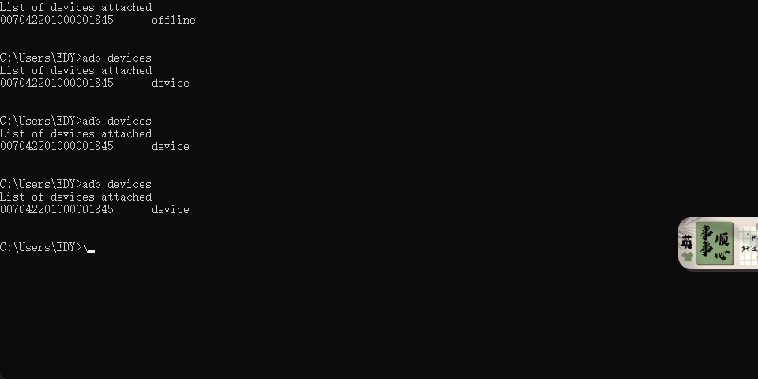

# E710手持机真机测试指南

## 文档说明

本文档记录E710手持机通过USB调试连接电脑进行真机测试的完整流程，包括环境配置、设备连接、APK打包与安装等操作步骤。

------

## 一、前置准备

### 1.1 所需工具

- E710手持机设备
- USB数据线
- Android Studio（已安装）
- ADB工具（Android SDK Platform-Tools）
- TestUHFAPI对接文档

### 1.2 项目说明

- 本地已有Android项目
- 需要测试TestUHFAPI接口功能

------

## 二、ADB环境配置

### 2.1 问题描述

在CMD中执行`adb`命令时提示：

```
'adb' 不是内部或外部命令，也不是可运行的程序或批处理文件。
```

### 2.2 解决方案：配置ADB环境变量

#### 步骤1：找到ADB工具路径

ADB工具通常位于Android SDK目录下：

```
C:\Users\[用户名]\AppData\Local\Android\Sdk\platform-tools
```


或者在Android Studio安装目录：

```
[Android Studio安装路径]\sdk\platform-tools
```

#### 步骤2：添加到系统环境变量

**方法一：通过系统设置**

1. 右键"此电脑" → 选择"属性"

2. 点击"高级系统设置"

3. 点击"环境变量"按钮

4. 在"系统变量"区域找到`Path`变量，双击编辑

5. 点击"新建"，添加ADB路径：

   ```
   C:\Users\[用户名]\AppData\Local\Android\Sdk\platform-tools
   ```

6. 点击"确定"保存所有设置


**方法二：通过CMD临时添加（当前会话有效 不使用了）**

```cmd
set PATH=%PATH%;C:\Users\[用户名]\AppData\Local\Android\Sdk\platform-tools
```

#### 步骤3：验证配置

重新打开CMD窗口，执行：

```cmd
adb version
```

如果显示ADB版本信息，说明配置成功。

------

## 三、E710手持机开发者模式配置

### 3.1 开启开发者选项

1. 在手持机上打开**设置**应用
2. 找到**关于手机**或**关于设备**
3. 连续点击**版本号**或**内核版本** 7次
4. 系统会提示"您已处于开发者模式"

### 3.2 启用USB调试

1. 返回设置主界面
2. 找到**开发者选项**（通常在"系统"或"更多设置"中）
3. 开启**开发者选项**总开关
4. 开启**USB调试**选项
5. （推荐）同时开启**USB安装**和**USB调试（安全设置）**

### 3.3 连接提示处理

- 首次通过USB连接电脑时，手持机会弹出"允许USB调试"提示
- 勾选"始终允许使用这台计算机进行调试"
- 点击"确定"授权

------

## 四、设备连接与测试

### 4.1 启动ADB服务

```cmd
adb start-server
```

预期输出 实际是没有输出的：

```
* daemon not running; starting now at tcp:5037
* daemon started successfully
```

### 4.2 检查设备连接状态

```cmd
adb devices
```

**正常输出示例：**

```
List of devices attached
ABC123456789    device
```



**常见状态说明：**

- `device`：**设备已正常连接且已授权**
- `unauthorized`：**设备未授权，需在手持机上确认USB调试授权**
- `offline`：**设备离线，尝试重新插拔USB或重启ADB**
- 无设备显示：检查USB线、驱动或USB调试是否开启

### 4.3 常见连接问题排查

#### 问题1：设备显示为unauthorized

**解决方案：**

1. 检查手持机是否弹出授权提示，点击"确定"

2. 如果没有弹出，执行：

   ```cmd
   adb kill-serveradb start-server
   ```

3. 重新插拔USB线

#### 问题2：设备列表为空

**解决方案：**

1. 确认USB调试已开启

2. 更换USB端口或数据线

3. 安装手持机驱动程序（如需要）

4. 尝试重启ADB服务：

   ```cmd
   adb kill-serveradb start-server
   ```

#### 问题3：多设备连接

如果连接了多个设备，需要指定设备ID：

```cmd
adb -s [设备ID] shell
```

------

## 五、Android项目打包APK

### 5.1 使用Android Studio打包

#### 方法一：生成未签名调试版APK

1. 在Android Studio中打开项目

2. 点击菜单栏：**Build** → **Build Bundle(s) / APK(s)** → **Build APK(s)**
   可能与实际不太相同 新版本的结构如图所示：

   **Build** → **Genertae App Bundles or APKS** →**Generate Bundle(s) / APK(s)** → **Build APK(s)**

   说明：选择Bundles的话 **得到的是aap格式的**   这是在谷歌平台发布的  所以选择打包为apk就行
   

3. 等待构建完成

4. **点击通知栏中的"locate"链接，查看APK位置**

5. APK通常位于：

   ```
   [项目目录]\app\build\outputs\apk\debug\app-debug.apk
   ```


#### 方法二：生成签名发布版APK

1. 点击菜单栏：**Build** → **Generate Signed Bundle / APK**
2. 选择**APK**，点击"Next"
3. 配置签名密钥（首次需创建密钥库）
4. 选择构建类型（release）
5. 点击"Finish"等待构建完成

### 5.2 使用Gradle命令打包

打开Android Studio底部的Terminal，执行：

**调试版APK：**

```bash
gradlew assembleDebug
```

**发布版APK：**

```bash
gradlew assembleRelease
```

生成的APK位置：

- Debug版：`app/build/outputs/apk/debug/app-debug.apk`
- Release版：`app/build/outputs/apk/release/app-release.apk`

------

## 六、安装APK到E710手持机

### 6.1 通过ADB安装

#### 基本安装命令

```cmd
adb install [APK文件路径]
```

**示例：**

```cmd
adb install D:\Projects\MyApp\app\build\outputs\apk\debug\app-debug.apk
```

#### 覆盖安装（保留数据）

如果应用已存在，使用`-r`参数覆盖安装：

```cmd
adb install -r app-debug.apk
```

#### 降级安装

如果需要安装低版本APK，使用`-d`参数：

```cmd
adb install -d app-debug.apk
```

### 6.2 安装成功标志

命令执行后，如果显示：

```
Success
```

表示安装成功。

### 6.3 常见安装错误

| 错误信息                              | 原因         | 解决方案                     |
| ------------------------------------- | ------------ | ---------------------------- |
| `INSTALL_FAILED_ALREADY_EXISTS`       | 应用已存在   | 使用`-r`参数覆盖安装或先卸载 |
| `INSTALL_FAILED_INSUFFICIENT_STORAGE` | 存储空间不足 | 清理手持机存储空间           |
| `INSTALL_FAILED_INVALID_APK`          | APK文件损坏  | 重新打包APK                  |
| `INSTALL_FAILED_UPDATE_INCOMPATIBLE`  | 签名不一致   | 卸载旧版本后重新安装         |

### 6.4 卸载应用

```cmd
adb uninstall [包名]
```

**示例：**

```cmd
adb uninstall com.example.testuhfapi
```

------

## 七、TestUHFAPI功能测试

### 7.1 启动应用

安装完成后，可以通过以下方式启动应用：

**方法一：在手持机上手动启动** 在应用列表中找到应用图标，点击启动

**方法二：通过ADB启动**

```cmd
adb shell am start -n [包名]/[Activity完整路径]
```

**示例：**

```cmd
adb shell am start -n com.example.testuhfapi/.MainActivity
```

### 7.2 查看日志

实时查看应用日志，便于调试：

```cmd
adb logcat
```

**过滤特定标签：**

```cmd
adb logcat -s [TAG名称]
```

**清空日志：**

```cmd
adb logcat -c
```

### 7.3 测试要点

- 根据TestUHFAPI对接文档测试各项功能
- 记录测试结果和异常情况
- 检查UHF读写功能是否正常
- 验证数据传输准确性

------

## 八、常用ADB命令速查

### 8.1 设备管理

```cmd
# 查看已连接设备
adb devices

# 重启设备
adb reboot

# 进入设备Shell
adb shell
```

### 8.2 文件传输

```cmd
# 从电脑复制文件到设备
adb push [本地文件路径] [设备路径]

# 从设备复制文件到电脑
adb pull [设备路径] [本地文件路径]
```

**示例：**

```cmd
# 推送文件到设备SD卡
adb push test.txt /sdcard/

# 从设备拉取文件
adb pull /sdcard/test.txt D:\
```

### 8.3 应用管理

```cmd
# 列出所有已安装应用包名
adb shell pm list packages

# 查看应用信息
adb shell pm path [包名]

# 清除应用数据
adb shell pm clear [包名]
```

### 8.4 截图和录屏

```cmd
# 截图
adb shell screencap -p /sdcard/screenshot.png
adb pull /sdcard/screenshot.png

# 录屏（最长3分钟）
adb shell screenrecord /sdcard/demo.mp4
```

------

## 九、故障排除

### 9.1 ADB连接问题

**问题：执行adb命令无响应**

```cmd
# 杀死ADB服务
adb kill-server

# 重启ADB服务
adb start-server

# 检查端口占用（5037端口）
netstat -ano | findstr "5037"
```

### 9.2 USB驱动问题

如果Windows无法识别设备：

1. 打开"设备管理器"
2. 查看是否有未识别设备
3. 下载安装E710手持机专用USB驱动
4. 或安装通用Android ADB驱动

### 9.3 手持机断开连接

- 检查USB线是否松动
- 关闭手持机的省电模式
- 保持手持机屏幕常亮
- 在开发者选项中设置"保持唤醒状态"

------

## 十、最佳实践

### 10.1 开发调试建议

1. 保持USB线质量良好，建议使用原装数据线
2. 开发期间在手持机上勾选"始终允许此电脑进行USB调试"
3. 使用`adb logcat`实时监控应用日志
4. 定期清理手持机存储空间，避免安装失败

### 10.2 版本管理

1. 打包APK时注意修改版本号（versionCode和versionName）
2. 保存签名密钥文件，用于发布版本
3. 区分Debug版和Release版APK文件名

### 10.3 安全注意事项

1. 测试完成后可关闭USB调试功能
2. 不要在公共电脑上勾选"始终允许"选项
3. 妥善保管签名密钥文件

------

## 十一、快速操作流程

### 日常测试快速流程

```cmd
# 1. 启动ADB服务
adb start-server

# 2. 检查设备连接
adb devices

# 3. 打包APK（在项目目录下）
gradlew assembleDebug

# 4. 安装到设备
adb install -r app\build\outputs\apk\debug\app-debug.apk

# 5. 启动应用
adb shell am start -n com.example.testuhfapi/.MainActivity

# 6. 查看日志
adb logcat -s YourTag
```

## 十二、使用Android Studio直接运行到手持机 开发常用

### 12.1 方法说明

使用Android Studio的Run功能可以直接将应用部署到已连接的E710手持机，自动完成编译、打包、安装和启动，**跳过手动打包和安装步骤**，大幅提升调试效率。

### 12.2 前置条件

确保以下条件已满足：

- ✅ E710手持机已通过USB连接到电脑
- ✅ USB调试已开启并授权
- ✅ 执行`adb devices`能看到设备处于`device`状态
- ✅ Android Studio已打开项目

### 12.3 直接运行步骤

#### 步骤1：选择目标设备

1. 在Android Studio顶部工具栏找到设备选择下拉框
2. 点击下拉框，应该能看到已连接的E710手持机
   - 设备名称通常显示为品牌型号，例如："E710"或设备序列号
   - 如果看不到设备，点击"Troubleshoot Device Connections"进行排查

通常连接到设备之后，一般就能找到了：


#### 步骤2：运行应用

有三种方式启动运行：

**方式一：点击Run按钮**

- 点击工具栏的绿色▶️运行按钮
- 或使用快捷键：`Shift + F10`（Windows/Linux）或 `Control + R`（Mac）

**方式二：菜单栏运行**

- 点击菜单栏：**Run** → **Run 'app'**

**方式三：右键运行**

- 在项目文件树中右键点击`app`模块
- 选择：**Run 'app'**

#### 步骤3：等待部署

Android Studio会自动执行以下操作：

1. ✓ 编译项目代码
2. ✓ 构建APK
3. ✓ 上传APK到设备
4. ✓ 安装应用（如已存在则覆盖安装）
5. ✓ 启动应用

可以在底部的"Run"窗口查看部署进度和日志。

#### 步骤4：查看运行日志

应用启动后，Android Studio底部会自动显示Logcat窗口，实时显示应用日志：

- 可以通过过滤器筛选日志级别（Verbose、Debug、Info、Warn、Error）
- 可以搜索特定标签或内容
- 支持暂停、清空日志等操作

### 12.4 Debug模式运行

如果需要调试代码，可以使用Debug模式：

#### 启动Debug模式

- 点击工具栏的🐛Debug按钮
- 或使用快捷键：`Shift + F9`（Windows/Linux）或 `Control + D`（Mac）

#### Debug模式优势

1. **断点调试**：在代码中设置断点，逐行调试
2. **变量查看**：实时查看变量值
3. **调用堆栈**：查看方法调用链
4. **表达式求值**：动态执行代码片段

#### 设置断点

- 在代码行号左侧单击即可设置/取消断点
- 红色圆点表示已设置断点
- 应用运行到断点时会自动暂停

### 12.5 实时修改与热部署

#### Apply Changes功能

Android Studio支持在不重启应用的情况下应用代码更改：

**Apply Changes and Restart Activity（⚡图标）**

- 快捷键：`Ctrl + F10`（Windows/Linux）或 `Control + Command + R`（Mac）
- 适用于：修改方法内部代码
- 效果：重启当前Activity，保留应用状态

**Apply Code Changes（⚡⚡图标）**

- 快捷键：`Ctrl + Alt + F10`（Windows/Linux）
- 适用于：小幅度代码修改
- 效果：不重启Activity，即时生效

**注意事项：**

- 不适用于修改资源文件、清单文件或添加新方法
- 复杂修改仍需完整重新运行

### 12.6 常见问题处理

#### 问题1：设备列表中看不到E710手持机

**解决方案：**

1. 检查USB连接和调试授权
2. 执行`adb devices`确认设备状态
3. 点击Android Studio中的"Refresh"按钮（设备下拉框旁）
4. 重启ADB：


cmd

```cmd
   adb kill-server
   adb start-server
```

1. 重启Android Studio

#### 问题2：应用安装失败

**错误示例：**


```
Installation failed with message Failed to finalize session
```

**解决方案：**

1. 手动卸载手持机上的旧版本应用
2. 在Android Studio中：**Build** → **Clean Project**
3. 再执行：**Build** → **Rebuild Project**
4. 重新运行应用

#### 问题3：应用安装成功但无法启动

**解决方案：**

1. 检查Logcat日志中的错误信息
2. 确认AndroidManifest.xml中的启动Activity配置正确
3. 检查是否有权限未授予（如存储、位置权限）
4. 尝试在手持机上手动启动应用

#### 问题4：运行速度慢

**优化建议：**

1. 使用Gradle守护进程：在`gradle.properties`中添加


properties

```properties
   org.gradle.daemon=true
   org.gradle.parallel=true
```

1. 启用增量编译
2. 减少不必要的依赖库
3. 使用更快的USB端口（USB 3.0）

### 12.7 对比：直接运行 vs 手动安装

```
特性直接运行手动打包安装
操作步骤一键完成多步操作
适用场景开发调试正式发布、分发测试
编译速度增量编译，较快完整编译
调试支持支持断点调试需额外配置
日志查看自动显示需手动执行logcat
热部署支持不支持
签名方式Debug签名可选Debug/Release
推荐用途日常开发测试交付测试、发布
```

### 12.8 最佳实践

#### 开发阶段

1. ✅ 

   优先使用Android Studio直接运行

   - 快速迭代，即时查看效果
   - 方便调试和问题定位

2. ✅ 

   合理使用Apply Changes

   - 小改动使用Apply Changes
   - 大改动或资源修改使用完整Run

3. ✅ 

   保持Logcat窗口打开

   - 实时监控应用运行状态
   - 及时发现异常和错误

#### 测试阶段

1. ✅ 

   阶段性使用手动打包

   - 验证完整构建流程
   - 确保发布版本正常

2. ✅ 

   测试不同构建变体

   - Debug版：开发调试
   - Release版：性能测试
   - 不同flavor：多渠道测试

### 12.9 快速开发流程


text

```text
【推荐的日常开发流程】

1. 连接设备
   ↓
2. 在Android Studio中选择E710设备
   ↓
3. 点击Run按钮（Shift + F10）
   ↓
4. 在手持机上测试功能
   ↓
5. 修改代码
   ↓
6. 使用Apply Changes（Ctrl + F10）或重新Run
   ↓
7. 重复步骤4-6直到功能完善
   ↓
8. 阶段性打包完整APK进行完整测试
```

### 12.10 关键优势总结

使用Android Studio直接运行到手持机的**核心优势**：

✨ **效率提升**

- 一键部署，省去多步操作
- 增量编译，节省时间
- 热部署支持，无需重启

🐛 **调试便利**

- 断点调试，精准定位问题
- 实时日志，即时反馈
- 变量监控，状态可视化

🔄 **快速迭代**

- 修改代码后立即测试
- 无需关心APK路径和安装命令
- 专注于功能开发

## 附录

### A. 相关资源链接

- Android Developer 官方文档: https://developer.android.com/
- ADB 命令参考: https://developer.android.com/tools/adb
- Gradle 构建指南: https://developer.android.com/build

### B. 文档更新记录

| 日期       | 版本 | 更新内容     |
| ---------- | ---- | ------------ |
| 2025-10-24 | 1.0  | 初始版本创建 |

