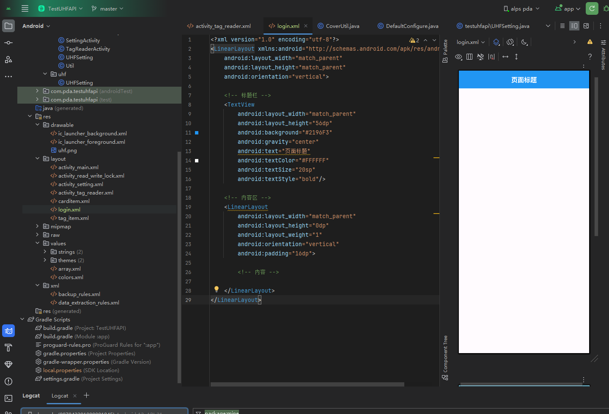
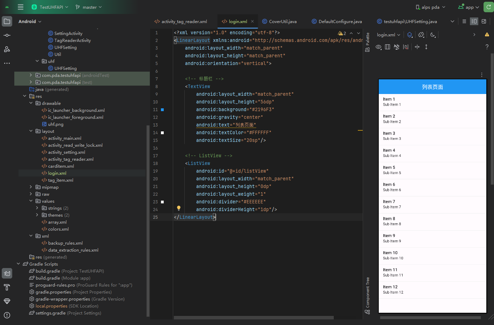
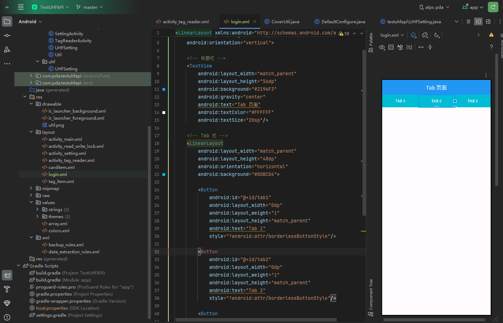
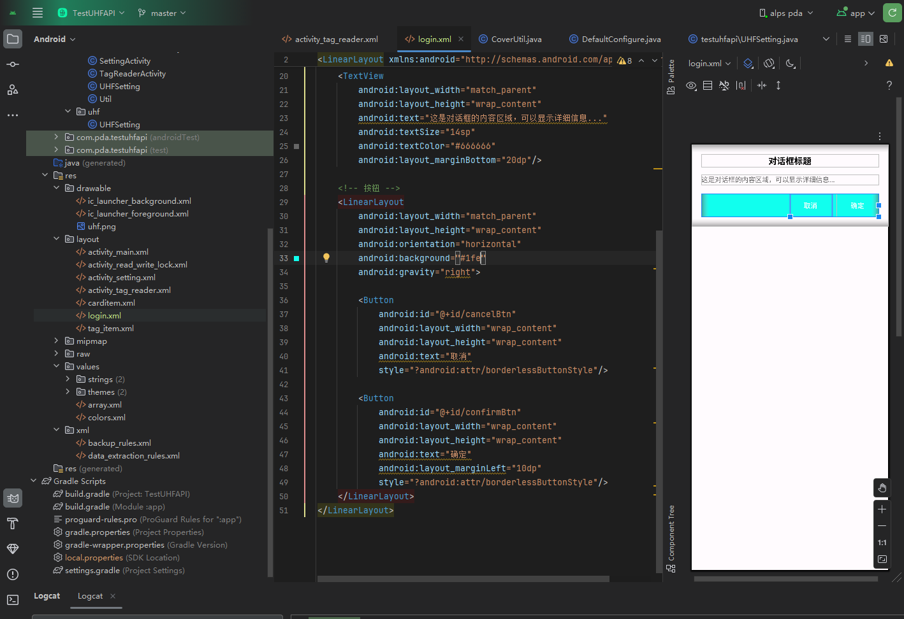
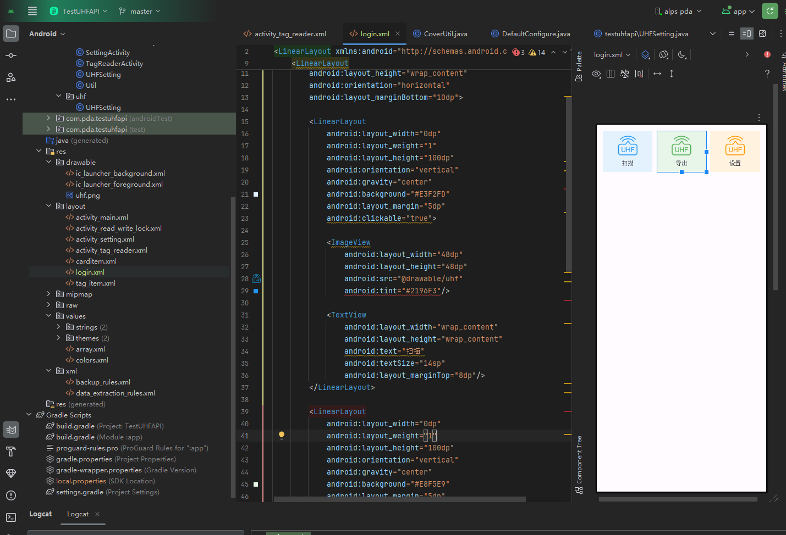

# Android 布局完全指南

> 从零基础到实战，一份文档搞定所有布局问题

------

## 📚 目录

[TOC]

------

## 入门必读

### 🎯 最重要的概念：容器 vs 控件

Android 中的所有元素分为两大类：

```
📦 容器（ViewGroup）- 可以包含其他元素的"盒子"
├─ LinearLayout        （线性布局）
├─ RelativeLayout      （相对布局）
├─ ConstraintLayout    （约束布局）
├─ FrameLayout         （帧布局）
├─ ScrollView          （滚动容器）
└─ ...

🔧 控件（View）- 具体的功能组件，不能包含其他元素
├─ TextView            （文本）
├─ Button              （按钮）
├─ EditText            （输入框）
├─ ImageView           （图片）
├─ ListView            （列表）
└─ ...
```

**记住这个，你就不会犯 90% 的错误！**

### 🚨 最常见的错误

```xml
<!-- ❌ 错误：TextView 是控件，不能有 orientation -->
<TextView
    android:orientation="horizontal"
    android:text="错误示范"/>

<!-- ✅ 正确：只有容器才能有 orientation -->
<LinearLayout
    android:orientation="horizontal">
    <TextView android:text="正确示范"/>
</LinearLayout>
```

### 📋 XML 基本结构

```xml
<?xml version="1.0" encoding="utf-8"?>
<容器类型 xmlns:android="http://schemas.android.com/apk/res/android"
    android:layout_width="宽度"
    android:layout_height="高度">
    
    <!-- 子元素 -->
    <控件或容器
        android:id="@+id/myView"
        android:layout_width="宽度"
        android:layout_height="高度"
        其他属性.../>
    
</容器类型>
```

**必须声明的命名空间：**

```xml
xmlns:android="http://schemas.android.com/apk/res/android"
```

------

## 基础知识

### 1️⃣ 宽高属性（layout_width / layout_height）

这是**每个元素都必须设置**的两个属性！

| 值             | 含义             | 效果                 | 使用场景       |
| -------------- | ---------------- | -------------------- | -------------- |
| `match_parent` | 填满父容器       | 宽度/高度等于父容器  | 全屏、占满整行 |
| `wrap_content` | 包裹内容         | 根据内容自动调整大小 | 按钮、文本等   |
| `100dp`        | 固定大小         | 固定为 100dp         | 需要精确控制时 |
| `0dp`          | 配合 weight 使用 | 由权重决定大小       | 按比例分配空间 |

**示例对比：**

```xml
<!-- 示例 1：填满父容器 -->
<TextView
    android:layout_width="match_parent"
    android:layout_height="match_parent"
    android:text="我会填满整个父容器"/>

<!-- 示例 2：根据内容自适应 -->
<Button
    android:layout_width="wrap_content"
    android:layout_height="wrap_content"
    android:text="按钮"/>
<!-- 按钮大小刚好包住"按钮"两个字 -->

<!-- 示例 3：固定大小 -->
<ImageView
    android:layout_width="100dp"
    android:layout_height="100dp"
    android:src="@drawable/icon"/>

<!-- 示例 4：权重分配（在 LinearLayout 中）-->
<TextView
    android:layout_width="0dp"
    android:layout_weight="1"
    android:layout_height="wrap_content"
    android:text="宽度由权重决定"/>
```

**决策树：**

```
选择宽高时问自己：
├─ 需要填满父容器？ → match_parent
├─ 需要按比例分配？ → 0dp + layout_weight
├─ 需要固定大小？   → 具体 dp 值
└─ 需要自适应内容？ → wrap_content
```

### 2️⃣ 单位说明

| 单位 | 说明         | 使用场景                     |
| ---- | ------------ | ---------------------------- |
| `dp` | 密度无关像素 | ✅ 布局尺寸（宽高、边距）     |
| `sp` | 可缩放像素   | ✅ 字体大小                   |
| `px` | 屏幕像素     | ❌ 避免使用（不同设备不一致） |

**常用尺寸参考：**

```xml
<!-- 字体大小 -->
android:textSize="12sp"    <!-- 小字 -->
android:textSize="14sp"    <!-- 正文 -->
android:textSize="16sp"    <!-- 副标题 -->
android:textSize="20sp"    <!-- 标题 -->
android:textSize="24sp"    <!-- 大标题 -->

<!-- 间距 -->
android:padding="4dp"      <!-- 紧凑 -->
android:padding="8dp"      <!-- 小间距 -->
android:padding="16dp"     <!-- 标准间距 -->
android:padding="24dp"     <!-- 大间距 -->
```

### 3️⃣ 间距：padding vs margin

```
完整的元素模型：

┌─────────────────────────────────┐
│  margin（外边距）                │
│  ↓ 与其他元素的距离               │
│  ┌───────────────────────────┐  │
│  │  border（边框）           │  │
│  │  ┌─────────────────────┐  │  │
│  │  │  padding（内边距）  │  │  │
│  │  │  ↓ 内容与边框的距离  │  │  │
│  │  │  ┌───────────────┐  │  │  │
│  │  │  │   Content     │  │  │  │
│  │  │  │   文字/图片   │  │  │  │
│  │  │  └───────────────┘  │  │  │
│  │  └─────────────────────┘  │  │
│  └───────────────────────────┘  │
└─────────────────────────────────┘
```

**padding（内边距）：**

```xml
<TextView
    android:layout_width="wrap_content"
    android:layout_height="wrap_content"
    android:padding="10dp"              <!-- 四周都是 10dp -->
    android:background="#CCCCCC"
    android:text="有内边距"/>

<!-- 分别设置四个方向 -->
android:paddingLeft="10dp"
android:paddingRight="10dp"
android:paddingTop="5dp"
android:paddingBottom="5dp"
```

- ✅ 背景色**包含** padding 区域
- 用于：增加点击区域、让文字不贴边

**margin（外边距）：**

```xml
<TextView
    android:layout_width="wrap_content"
    android:layout_height="wrap_content"
    android:layout_margin="10dp"        <!-- 四周都是 10dp -->
    android:background="#CCCCCC"
    android:text="有外边距"/>

<!-- 分别设置四个方向 -->
android:layout_marginLeft="10dp"
android:layout_marginRight="10dp"
android:layout_marginTop="5dp"
android:layout_marginBottom="5dp"
```

- ❌ 背景色**不包含** margin 区域
- 用于：元素之间的间距

**记忆口诀：**

- **padding** = 往里推（Push **IN**）
- **margin** = 往外推（Push **OUT**）

### 4️⃣ 颜色

```xml
<!-- 颜色格式 -->
#RGB          例如：#F00（红色）
#ARGB         例如：#8F00（半透明红色）
#RRGGBB       例如：#FF0000（红色）
#AARRGGBB     例如：#80FF0000（半透明红色）

<!-- 常用颜色 -->
#FFFFFF       白色
#000000       黑色
#FF0000       红色
#00FF00       绿色
#0000FF       蓝色
#CCCCCC       灰色

<!-- 使用 -->
android:background="#FFFFFF"     <!-- 背景色 -->
android:textColor="#000000"      <!-- 文字颜色 -->
```

### 5️⃣ ID 的定义和引用

```xml
<!-- 定义 ID -->
<TextView
    android:id="@+id/myTextView"
    android:text="我有 ID"/>

<!-- 引用 ID -->
<Button
    android:layout_below="@id/myTextView"
    android:text="我在 TextView 下方"/>

<!-- Java/Kotlin 中使用 -->
TextView textView = findViewById(R.id.myTextView);
```

**命名规范：**

- 使用小驼峰或下划线：`myTextView` 或 `my_text_view`
- 见名知意：`loginButton`、`userNameInput`

------

## LinearLayout 详解

LinearLayout 是**最常用**的布局，掌握它就能解决 80% 的布局需求。

### 基础：排列方向（orientation）

```xml
<!-- 垂直排列（默认）-->
<LinearLayout
    android:layout_width="match_parent"
    android:layout_height="wrap_content"
    android:orientation="vertical">
    
    <TextView android:text="第一行"/>
    <TextView android:text="第二行"/>
    <TextView android:text="第三行"/>
</LinearLayout>

结果：
┌──────────┐
│ 第一行    │
│ 第二行    │
│ 第三行    │
└──────────┘

<!-- 水平排列 -->
<LinearLayout
    android:layout_width="match_parent"
    android:layout_height="wrap_content"
    android:orientation="horizontal">
    
    <TextView android:text="左"/>
    <TextView android:text="中"/>
    <TextView android:text="右"/>
</LinearLayout>

结果：
┌──────────────┐
│ 左  中  右    │
└──────────────┘
```

### 核心：权重系统（layout_weight）

这是 LinearLayout 的**杀手级功能**！

**三大规则：**

1. weight 只在 LinearLayout 的**直接子元素**上有效
2. 使用 weight 时，对应方向的尺寸要设为 `0dp`
3. weight 表示**比例**，数字可以是任意正数

**规则详解：**

```xml
<!-- 水平方向使用 weight -->
<LinearLayout
    android:orientation="horizontal"
    android:layout_width="match_parent"
    android:layout_height="wrap_content">
    
    <Button
        android:layout_width="0dp"        ← 水平方向，所以宽度设为 0dp
        android:layout_weight="1"
        android:layout_height="wrap_content"
        android:text="按钮1"/>
</LinearLayout>

<!-- 垂直方向使用 weight -->
<LinearLayout
    android:orientation="vertical"
    android:layout_width="match_parent"
    android:layout_height="match_parent">
    
    <View
        android:layout_width="match_parent"
        android:layout_height="0dp"       ← 垂直方向，所以高度设为 0dp
        android:layout_weight="1"/>
</LinearLayout>
```

**场景 1：等分空间**

```xml
<!-- 三个按钮平分宽度 -->
<LinearLayout
    android:orientation="horizontal"
    android:layout_width="match_parent"
    android:layout_height="wrap_content">
    
    <Button
        android:layout_width="0dp"
        android:layout_weight="1"
        android:layout_height="wrap_content"
        android:text="按钮1"/>
    
    <Button
        android:layout_width="0dp"
        android:layout_weight="1"
        android:layout_height="wrap_content"
        android:text="按钮2"/>
    
    <Button
        android:layout_width="0dp"
        android:layout_weight="1"
        android:layout_height="wrap_content"
        android:text="按钮3"/>
</LinearLayout>

结果（每个占 1/3）：
┌─────────┬─────────┬─────────┐
│ 按钮1   │ 按钮2   │ 按钮3   │
└─────────┴─────────┴─────────┘
```

**场景 2：不等分空间**

```xml
<!-- 按 2:1 分配宽度 -->
<LinearLayout
    android:orientation="horizontal"
    android:layout_width="match_parent"
    android:layout_height="wrap_content">
    
    <TextView
        android:layout_width="0dp"
        android:layout_weight="2"
        android:layout_height="wrap_content"
        android:text="占 2/3 宽度"/>
    
    <TextView
        android:layout_width="0dp"
        android:layout_weight="1"
        android:layout_height="wrap_content"
        android:text="占 1/3"/>
</LinearLayout>

结果：
┌──────────────┬──────┐
│  占 2/3 宽度 │ 1/3  │
└──────────────┴──────┘
```

**场景 3：混合使用（固定 + 权重）**

```xml
<LinearLayout
    android:orientation="horizontal"
    android:layout_width="match_parent"
    android:layout_height="wrap_content">
    
    <TextView
        android:layout_width="100dp"
        android:layout_height="wrap_content"
        android:text="固定 100dp"/>
    
    <TextView
        android:layout_width="0dp"
        android:layout_weight="1"
        android:layout_height="wrap_content"
        android:text="占剩余空间"/>
    
    <Button
        android:layout_width="wrap_content"
        android:layout_height="wrap_content"
        android:text="自适应"/>
</LinearLayout>

结果：
┌──────┬─────────────────┬────────┐
│100dp │  占剩余空间       │自适应  │
└──────┴─────────────────┴────────┘
```

**场景 4：表格布局（重要！）**

```xml
<!-- 表头 -->
<LinearLayout
    android:orientation="horizontal"
    android:layout_width="match_parent"
    android:layout_height="wrap_content"
    android:background="#BBDEFB"
    android:padding="5dp">
    
    <TextView
        android:layout_width="0dp"
        android:layout_weight="3"
        android:layout_height="wrap_content"
        android:gravity="center_horizontal"
        android:text="EPC"
        android:textStyle="bold"/>
    
    <TextView
        android:layout_width="0dp"
        android:layout_weight="2"
        android:layout_height="wrap_content"
        android:gravity="center_horizontal"
        android:text="TID"
        android:textStyle="bold"/>
    
    <TextView
        android:layout_width="0dp"
        android:layout_weight="1"
        android:layout_height="wrap_content"
        android:gravity="center_horizontal"
        android:text="RSSI"
        android:textStyle="bold"/>
</LinearLayout>

<!-- 数据行（tag_item.xml）-->
<LinearLayout
    android:orientation="horizontal"
    android:layout_width="match_parent"
    android:layout_height="wrap_content"
    android:padding="10dp">
    
    <TextView
        android:id="@+id/itemEpc"
        android:layout_width="0dp"
        android:layout_weight="3"
        android:layout_height="wrap_content"
        android:gravity="center_horizontal"
        android:text="E2001126BD3B"/>
    
    <TextView
        android:id="@+id/itemTid"
        android:layout_width="0dp"
        android:layout_weight="2"
        android:layout_height="wrap_content"
        android:gravity="center_horizontal"
        android:text="..."/>
    
    <TextView
        android:id="@+id/itemRssi"
        android:layout_width="0dp"
        android:layout_weight="1"
        android:layout_height="wrap_content"
        android:gravity="center_horizontal"
        android:text="-29"/>
</LinearLayout>
```

**✅ 关键点：表头和数据行使用相同的 weight 比例（3:2:1），保证完美对齐！**

### 对齐：gravity 和 layout_gravity

这两个属性**最容易混淆**！

**gravity：控制内容的对齐方式**

```xml
<TextView
    android:layout_width="match_parent"
    android:layout_height="100dp"
    android:gravity="center"
    android:background="#CCCCCC"
    android:text="文字居中"/>

┌──────────────────┐
│                  │
│    文字居中      │  ← 文字在 TextView 内部居中
│                  │
└──────────────────┘
```

**layout_gravity：控制自己在父容器中的位置**

```xml
<LinearLayout
    android:layout_width="match_parent"
    android:layout_height="match_parent"
    android:orientation="vertical">
    
    <Button
        android:layout_width="wrap_content"
        android:layout_height="wrap_content"
        android:layout_gravity="center"
        android:text="按钮"/>
</LinearLayout>

┌──────────────────┐
│                  │
│     [按钮]       │  ← 按钮在 LinearLayout 内部居中
│                  │
└──────────────────┘
```

**记忆技巧：**

- `gravity` = 我的**内容**怎么放
- `layout_gravity` = **我**在父容器里怎么放

**常用 gravity 值：**

| 值                  | 效果            | 使用场景     |
| ------------------- | --------------- | ------------ |
| `center`            | 水平 + 垂直居中 | 最常用       |
| `center_horizontal` | 水平居中        | 文本居中     |
| `center_vertical`   | 垂直居中        | 按钮垂直居中 |
| `left` 或 `start`   | 左对齐          | 默认对齐     |
| `right` 或 `end`    | 右对齐          | 价格、数字   |
| `top`               | 顶部对齐        | -            |
| `bottom`            | 底部对齐        | -            |

**组合使用（用 `|` 分隔）：**

```xml
android:gravity="center_vertical|right"  <!-- 垂直居中 + 右对齐 -->
android:gravity="bottom|center_horizontal"  <!-- 底部 + 水平居中 -->
```

**LinearLayout 的 gravity 示例：**

```xml
<!-- 让所有子元素居中 -->
<LinearLayout
    android:layout_width="match_parent"
    android:layout_height="100dp"
    android:orientation="horizontal"
    android:gravity="center">  ← 所有子元素都会居中
    
    <Button android:text="按钮1"/>
    <Button android:text="按钮2"/>
</LinearLayout>
```

------

## 其他常用布局

### RelativeLayout（相对布局）

子元素可以相对于父容器或其他子元素定位。

**相对于父容器：**

```xml
<RelativeLayout
    android:layout_width="match_parent"
    android:layout_height="match_parent">
    
    <!-- 顶部居中 -->
    <TextView
        android:id="@+id/title"
        android:layout_width="wrap_content"
        android:layout_height="wrap_content"
        android:layout_alignParentTop="true"
        android:layout_centerHorizontal="true"
        android:text="标题"/>
    
    <!-- 完全居中 -->
    <Button
        android:layout_width="wrap_content"
        android:layout_height="wrap_content"
        android:layout_centerInParent="true"
        android:text="按钮"/>
    
    <!-- 右下角 -->
    <TextView
        android:layout_width="wrap_content"
        android:layout_height="wrap_content"
        android:layout_alignParentRight="true"
        android:layout_alignParentBottom="true"
        android:text="右下角"/>
</RelativeLayout>
```

**常用属性：**

| 属性                                      | 说明           |
| ----------------------------------------- | -------------- |
| `android:layout_alignParentTop="true"`    | 顶部对齐父容器 |
| `android:layout_alignParentBottom="true"` | 底部对齐父容器 |
| `android:layout_alignParentLeft="true"`   | 左侧对齐父容器 |
| `android:layout_alignParentRight="true"`  | 右侧对齐父容器 |
| `android:layout_centerInParent="true"`    | 在父容器中居中 |
| `android:layout_centerHorizontal="true"`  | 水平居中       |
| `android:layout_centerVertical="true"`    | 垂直居中       |

**相对于其他元素：**

```xml
<RelativeLayout
    android:layout_width="match_parent"
    android:layout_height="match_parent">
    
    <TextView
        android:id="@+id/label"
        android:layout_width="wrap_content"
        android:layout_height="wrap_content"
        android:text="用户名"/>
    
    <EditText
        android:layout_width="match_parent"
        android:layout_height="wrap_content"
        android:layout_below="@id/label"
        android:layout_toRightOf="@id/label"
        android:hint="请输入"/>
</RelativeLayout>
```

| 属性                                 | 说明         |
| ------------------------------------ | ------------ |
| `android:layout_below="@id/xxx"`     | 在某元素下方 |
| `android:layout_above="@id/xxx"`     | 在某元素上方 |
| `android:layout_toLeftOf="@id/xxx"`  | 在某元素左侧 |
| `android:layout_toRightOf="@id/xxx"` | 在某元素右侧 |

### FrameLayout（帧布局）

子元素叠加显示，后面的会覆盖前面的。

```xml
<FrameLayout
    android:layout_width="match_parent"
    android:layout_height="200dp">
    
    <!-- 背景图 -->
    <ImageView
        android:layout_width="match_parent"
        android:layout_height="match_parent"
        android:src="@drawable/background"
        android:scaleType="centerCrop"/>
    
    <!-- 覆盖在图片上的文字 -->
    <TextView
        android:layout_width="wrap_content"
        android:layout_height="wrap_content"
        android:layout_gravity="center"
        android:text="标题"
        android:textColor="#FFFFFF"
        android:textSize="24sp"/>
</FrameLayout>
```

### ScrollView（滚动布局）

内容超出屏幕时可以滚动。

**⚠️ 重要限制：ScrollView 只能包含一个直接子元素！**

```xml
<ScrollView
    android:layout_width="match_parent"
    android:layout_height="match_parent">
    
    <!-- 只能有一个直接子元素 -->
    <LinearLayout
        android:layout_width="match_parent"
        android:layout_height="wrap_content"
        android:orientation="vertical"
        android:padding="15dp">
        
        <!-- 很多内容 -->
        <TextView android:text="内容1"/>
        <TextView android:text="内容2"/>
        <TextView android:text="内容3"/>
        <!-- ... 更多内容 ... -->
        
    </LinearLayout>
</ScrollView>
```

### ConstraintLayout（约束布局）

现代化的布局方式，性能最好，但学习曲线较陡。

```xml
<androidx.constraintlayout.widget.ConstraintLayout
    android:layout_width="match_parent"
    android:layout_height="match_parent">
    
    <TextView
        android:id="@+id/text"
        android:layout_width="wrap_content"
        android:layout_height="wrap_content"
        android:text="居中文本"
        app:layout_constraintTop_toTopOf="parent"
        app:layout_constraintBottom_toBottomOf="parent"
        app:layout_constraintLeft_toLeftOf="parent"
        app:layout_constraintRight_toRightOf="parent"/>
</androidx.constraintlayout.widget.ConstraintLayout>
```

------

## 居中对齐大全

### 在 LinearLayout 中居中

```xml
<!-- 方法 1：使用 gravity -->
<LinearLayout
    android:layout_width="match_parent"
    android:layout_height="match_parent"
    android:gravity="center"
    android:orientation="vertical">
    
    <TextView android:text="我会居中"/>
    <Button android:text="我也会居中"/>
</LinearLayout>

<!-- 方法 2：使用 layout_gravity（单个元素）-->
<LinearLayout
    android:layout_width="match_parent"
    android:layout_height="match_parent"
    android:orientation="vertical">
    
    <Button
        android:layout_width="wrap_content"
        android:layout_height="wrap_content"
        android:layout_gravity="center"
        android:text="只有我居中"/>
</LinearLayout>

<!-- 方法 3：使用 weight -->
<LinearLayout
    android:layout_width="match_parent"
    android:layout_height="match_parent"
    android:orientation="vertical">
    
    <View
        android:layout_width="0dp"
        android:layout_height="0dp"
        android:layout_weight="1"/>
    
    <Button android:text="垂直居中"/>
    
    <View
        android:layout_width="0dp"
        android:layout_height="0dp"
        android:layout_weight="1"/>
</LinearLayout>
```

### 在 RelativeLayout 中居中

```xml
<RelativeLayout
    android:layout_width="match_parent"
    android:layout_height="match_parent">
    
    <!-- 完全居中 -->
    <Button
        android:layout_centerInParent="true"
        android:text="完全居中"/>
    
    <!-- 水平居中 -->
    <Button
        android:layout_centerHorizontal="true"
        android:text="水平居中"/>
    
    <!-- 垂直居中 -->
    <Button
        android:layout_centerVertical="true"
        android:text="垂直居中"/>
</RelativeLayout>
```

### TextView 文本居中

```xml
<TextView
    android:layout_width="match_parent"
    android:layout_height="50dp"
    android:gravity="center"
    android:text="文本居中"/>
```

------

## 实战案例

### 案例 1：登录界面

```xml
<?xml version="1.0" encoding="utf-8"?>
<LinearLayout xmlns:android="http://schemas.android.com/apk/res/android"
    android:layout_width="match_parent"
    android:layout_height="match_parent"
    android:orientation="vertical"
    android:padding="20dp"
    android:gravity="center">

    <!-- Logo -->
    <ImageView
        android:layout_width="100dp"
        android:layout_height="100dp"
        android:src="@drawable/logo"
        android:layout_marginBottom="30dp"/>

    <!-- 标题 -->
    <TextView
        android:layout_width="wrap_content"
        android:layout_height="wrap_content"
        android:text="用户登录"
        android:textSize="24sp"
        android:textStyle="bold"
        android:layout_marginBottom="30dp"/>

    <!-- 用户名 -->
    <EditText
        android:id="@+id/username"
        android:layout_width="match_parent"
        android:layout_height="wrap_content"
        android:hint="请输入用户名"
        android:padding="12dp"
        android:layout_marginBottom="15dp"/>

    <!-- 密码 -->
    <EditText
        android:id="@+id/password"
        android:layout_width="match_parent"
        android:layout_height="wrap_content"
        android:hint="请输入密码"
        android:inputType="textPassword"
        android:padding="12dp"
        android:layout_marginBottom="20dp"/>

    <!-- 登录按钮 -->
    <Button
        android:id="@+id/loginBtn"
        android:layout_width="match_parent"
        android:layout_height="wrap_content"
        android:text="登录"
        android:textSize="16sp"
        android:backgroundTint="#2196F3"/>

    <!-- 注册提示 -->
    <TextView
        android:layout_width="wrap_content"
        android:layout_height="wrap_content"
        android:text="还没有账号？立即注册"
        android:textColor="#2196F3"
        android:layout_marginTop="20dp"/>
</LinearLayout>
```

**关键点分析：**

- 外层 `LinearLayout` 使用 `gravity="center"` 让整体垂直居中
- 使用 `layout_marginBottom` 控制元素间距
- 输入框使用 `match_parent` 填满宽度
- 按钮使用 `backgroundTint` 设置颜色

### 案例 2：顶部标题栏 + 内容 + 底部按钮

```xml
<?xml version="1.0" encoding="utf-8"?>
<LinearLayout xmlns:android="http://schemas.android.com/apk/res/android"
    android:layout_width="match_parent"
    android:layout_height="match_parent"
    android:orientation="vertical">

    <!-- 顶部标题栏 -->
    <LinearLayout
        android:layout_width="match_parent"
        android:layout_height="56dp"
        android:orientation="horizontal"
        android:background="#2196F3"
        android:gravity="center_vertical"
        android:paddingLeft="16dp"
        android:paddingRight="16dp">

        <TextView
            android:layout_width="0dp"
            android:layout_weight="1"
            android:layout_height="wrap_content"
            android:text="RFID 标签读取器"
            android:textColor="#FFFFFF"
            android:textSize="20sp"
            android:textStyle="bold"/>

        <ImageView
            android:layout_width="24dp"
            android:layout_height="24dp"
            android:src="@drawable/ic_more"
            android:tint="#FFFFFF"/>
    </LinearLayout>

    <!-- 统计信息栏 -->
    <LinearLayout
        android:layout_width="match_parent"
        android:layout_height="wrap_content"
        android:orientation="horizontal"
        android:background="#E3F2FD"
        android:padding="12dp">

        <TextView
            android:id="@+id/tagCount"
            android:layout_width="0dp"
            android:layout_weight="1"
            android:layout_height="wrap_content"
            android:text="标签: 0"
            android:textSize="14sp"
            android:gravity="center"/>

        <TextView
            android:id="@+id/readCount"
            android:layout_width="0dp"
            android:layout_weight="1"
            android:layout_height="wrap_content"
            android:text="读取: 0"
            android:textSize="14sp"
            android:gravity="center"/>

        <TextView
            android:id="@+id/timeText"
            android:layout_width="0dp"
            android:layout_weight="1"
            android:layout_height="wrap_content"
            android:text="00:00:00"
            android:textSize="14sp"
            android:gravity="center"/>
    </LinearLayout>

    <!-- 内容区域（使用 weight=1 占据剩余空间）-->
    <ScrollView
        android:layout_width="match_parent"
        android:layout_height="0dp"
        android:layout_weight="1">

        <LinearLayout
            android:layout_width="match_parent"
            android:layout_height="wrap_content"
            android:orientation="vertical"
            android:padding="16dp">

            <!-- 这里放内容 -->
            <TextView
                android:layout_width="match_parent"
                android:layout_height="wrap_content"
                android:text="内容区域"
                android:textSize="16sp"/>

        </LinearLayout>
    </ScrollView>

    <!-- 底部按钮栏 -->
    <LinearLayout
        android:layout_width="match_parent"
        android:layout_height="wrap_content"
        android:orientation="horizontal"
        android:padding="10dp"
        android:background="#FFFFFF">

        <Button
            android:id="@+id/startBtn"
            android:layout_width="0dp"
            android:layout_weight="1"
            android:layout_height="wrap_content"
            android:text="开始"
            android:backgroundTint="#4CAF50"/>

        <Button
            android:id="@+id/stopBtn"
            android:layout_width="0dp"
            android:layout_weight="1"
            android:layout_height="wrap_content"
            android:text="停止"
            android:backgroundTint="#F44336"
            android:layout_marginLeft="8dp"/>

        <Button
            android:id="@+id/clearBtn"
            android:layout_width="0dp"
            android:layout_weight="1"
            android:layout_height="wrap_content"
            android:text="清空"
            android:layout_marginLeft="8dp"/>
    </LinearLayout>
</LinearLayout>
```

**关键点分析：**

- 三段式布局：标题栏（固定高度）+ 内容（weight=1）+ 按钮栏（固定高度）
- 标题栏使用 `gravity="center_vertical"` 让内容垂直居中
- 内容区使用 `weight=1` 占据所有剩余空间
- 底部按钮等分宽度，使用 `layout_marginLeft` 间隔

### 案例 3：表格布局（你的实际案例）

```xml
<?xml version="1.0" encoding="utf-8"?>
<LinearLayout xmlns:android="http://schemas.android.com/apk/res/android"
    android:layout_width="match_parent"
    android:layout_height="match_parent"
    android:orientation="vertical">

    <!-- 表头 -->
    <LinearLayout
        android:layout_width="match_parent"
        android:layout_height="wrap_content"
        android:orientation="horizontal"
        android:background="#BBDEFB"
        android:padding="8dp">

        <TextView
            android:layout_width="0dp"
            android:layout_weight="3"
            android:layout_height="wrap_content"
            android:gravity="center_horizontal"
            android:text="EPC"
            android:textStyle="bold"
            android:textSize="14sp"/>

        <TextView
            android:layout_width="0dp"
            android:layout_weight="2"
            android:layout_height="wrap_content"
            android:gravity="center_horizontal"
            android:text="TID"
            android:textStyle="bold"
            android:textSize="14sp"/>

        <TextView
            android:layout_width="0dp"
            android:layout_weight="1"
            android:layout_height="wrap_content"
            android:gravity="center_horizontal"
            android:text="RSSI"
            android:textStyle="bold"
            android:textSize="14sp"/>

        <TextView
            android:layout_width="0dp"
            android:layout_weight="1"
            android:layout_height="wrap_content"
            android:gravity="center_horizontal"
            android:text="次数"
            android:textStyle="bold"
            android:textSize="14sp"/>
    </LinearLayout>

    <!-- ListView -->
    <ListView
        android:id="@+id/listView"
        android:layout_width="match_parent"
        android:layout_height="0dp"
        android:layout_weight="1"
        android:divider="#CCCCCC"
        android:dividerHeight="1dp"/>
</LinearLayout>

<!-- 列表项布局（tag_item.xml）-->
<?xml version="1.0" encoding="utf-8"?>
<LinearLayout xmlns:android="http://schemas.android.com/apk/res/android"
    android:layout_width="match_parent"
    android:layout_height="wrap_content"
    android:orientation="horizontal"
    android:padding="12dp"
    android:background="#FFFFFF">

    <TextView
        android:id="@+id/itemEpc"
        android:layout_width="0dp"
        android:layout_weight="3"
        android:layout_height="wrap_content"
        android:gravity="center_horizontal"
        android:textColor="#000000"
        android:textSize="12sp"/>

    <TextView
        android:id="@+id/itemTid"
        android:layout_width="0dp"
        android:layout_weight="2"
        android:layout_height="wrap_content"
        android:gravity="center_horizontal"
        android:textColor="#000000"
        android:textSize="12sp"/>

    <TextView
        android:id="@+id/itemRssi"
        android:layout_width="0dp"
        android:layout_weight="1"
        android:layout_height="wrap_content"
        android:gravity="center_horizontal"
        android:textColor="#000000"
        android:textSize="12sp"/>

    <TextView
        android:id="@+id/itemCount"
        android:layout_width="0dp"
        android:layout_weight="1"
        android:layout_height="wrap_content"
        android:gravity="center_horizontal"
        android:textColor="#000000"
        android:textSize="12sp"/>
</LinearLayout>
```

**✅ 完美对齐的秘诀：**

1. 表头和数据行使用**完全相同的 weight 比例**（3:2:1:1）
2. 都使用 `gravity="center_horizontal"` 让文字居中
3. 不要使用固定宽度（如 `100dp`）
4. ❌ 不要在 TextView 上加 `orientation` 属性

### 案例 4：卡片列表

```xml
<!-- 单个卡片布局 -->
<?xml version="1.0" encoding="utf-8"?>
<LinearLayout xmlns:android="http://schemas.android.com/apk/res/android"
    android:layout_width="match_parent"
    android:layout_height="wrap_content"
    android:orientation="vertical"
    android:layout_margin="10dp"
    android:background="#FFFFFF"
    android:elevation="2dp"
    android:padding="16dp">

    <!-- 标题行 -->
    <LinearLayout
        android:layout_width="match_parent"
        android:layout_height="wrap_content"
        android:orientation="horizontal">

        <TextView
            android:id="@+id/title"
            android:layout_width="0dp"
            android:layout_weight="1"
            android:layout_height="wrap_content"
            android:text="标题"
            android:textSize="18sp"
            android:textStyle="bold"
            android:textColor="#000000"/>

        <TextView
            android:id="@+id/time"
            android:layout_width="wrap_content"
            android:layout_height="wrap_content"
            android:text="2分钟前"
            android:textSize="12sp"
            android:textColor="#999999"/>
    </LinearLayout>

    <!-- 内容 -->
    <TextView
        android:id="@+id/content"
        android:layout_width="match_parent"
        android:layout_height="wrap_content"
        android:text="这是内容区域，可以显示很多文字..."
        android:textSize="14sp"
        android:textColor="#666666"
        android:layout_marginTop="8dp"
        android:layout_marginBottom="8dp"
        android:maxLines="3"
        android:ellipsize="end"/>

    <!-- 底部操作栏 -->
    <LinearLayout
        android:layout_width="match_parent"
        android:layout_height="wrap_content"
        android:orientation="horizontal"
        android:gravity="right">

        <Button
            android:layout_width="wrap_content"
            android:layout_height="wrap_content"
            android:text="分享"
            android:textSize="12sp"
            style="?android:attr/borderlessButtonStyle"/>

        <Button
            android:layout_width="wrap_content"
            android:layout_height="wrap_content"
            android:text="评论"
            android:textSize="12sp"
            android:layout_marginLeft="8dp"
            style="?android:attr/borderlessButtonStyle"/>
    </LinearLayout>
</LinearLayout>
```

### 案例 5：表单布局（左右结构）

```xml
<?xml version="1.0" encoding="utf-8"?>
<LinearLayout xmlns:android="http://schemas.android.com/apk/res/android"
    android:layout_width="match_parent"
    android:layout_height="wrap_content"
    android:orientation="vertical"
    android:padding="16dp">

    <!-- 姓名 -->
    <LinearLayout
        android:layout_width="match_parent"
        android:layout_height="wrap_content"
        android:orientation="horizontal"
        android:gravity="center_vertical"
        android:layout_marginBottom="12dp">

        <TextView
            android:layout_width="80dp"
            android:layout_height="wrap_content"
            android:text="姓名："
            android:textSize="16sp"
            android:gravity="right"/>

        <EditText
            android:id="@+id/nameInput"
            android:layout_width="0dp"
            android:layout_weight="1"
            android:layout_height="wrap_content"
            android:hint="请输入姓名"
            android:layout_marginLeft="10dp"/>
    </LinearLayout>

    <!-- 性别 -->
    <LinearLayout
        android:layout_width="match_parent"
        android:layout_height="wrap_content"
        android:orientation="horizontal"
        android:gravity="center_vertical"
        android:layout_marginBottom="12dp">

        <TextView
            android:layout_width="80dp"
            android:layout_height="wrap_content"
            android:text="性别："
            android:textSize="16sp"
            android:gravity="right"/>

        <RadioGroup
            android:layout_width="0dp"
            android:layout_weight="1"
            android:layout_height="wrap_content"
            android:orientation="horizontal"
            android:layout_marginLeft="10dp">

            <RadioButton
                android:id="@+id/male"
                android:layout_width="wrap_content"
                android:layout_height="wrap_content"
                android:text="男"
                android:checked="true"/>

            <RadioButton
                android:id="@+id/female"
                android:layout_width="wrap_content"
                android:layout_height="wrap_content"
                android:text="女"
                android:layout_marginLeft="20dp"/>
        </RadioGroup>
    </LinearLayout>

    <!-- 年龄 -->
    <LinearLayout
        android:layout_width="match_parent"
        android:layout_height="wrap_content"
        android:orientation="horizontal"
        android:gravity="center_vertical"
        android:layout_marginBottom="12dp">

        <TextView
            android:layout_width="80dp"
            android:layout_height="wrap_content"
            android:text="年龄："
            android:textSize="16sp"
            android:gravity="right"/>

        <EditText
            android:id="@+id/ageInput"
            android:layout_width="0dp"
            android:layout_weight="1"
            android:layout_height="wrap_content"
            android:hint="请输入年龄"
            android:inputType="number"
            android:layout_marginLeft="10dp"/>
    </LinearLayout>

    <!-- 提交按钮 -->
    <Button
        android:id="@+id/submitBtn"
        android:layout_width="match_parent"
        android:layout_height="wrap_content"
        android:text="提交"
        android:layout_marginTop="20dp"/>
</LinearLayout>
```

**关键点：**

- 标签固定宽度（80dp），输入框使用 weight=1 占剩余空间
- 使用 `gravity="right"` 让标签右对齐
- 使用 `gravity="center_vertical"` 让每行垂直居中对齐

------

## 常见错误

### ❌ 错误 1：在控件上使用容器属性

```xml
<!-- 错误 -->
<TextView
    android:orientation="horizontal"  ← TextView 是控件，不能有这个
    android:text="错误"/>

<Button
    android:orientation="vertical"    ← Button 也是控件
    android:text="错误"/>

<ListView
    android:orientation="horizontal"  ← ListView 也不能有
    android:id="@+id/list"/>
```

**✅ 正确：只有容器才能有 orientation**

```xml
<LinearLayout
    android:orientation="horizontal">
    <TextView android:text="正确"/>
</LinearLayout>
```

### ❌ 错误 2：使用 weight 时忘记设置 0dp

```xml
<!-- 错误 -->
<TextView
    android:layout_width="wrap_content"  ← 应该是 0dp
    android:layout_weight="1"
    android:text="错误"/>

<!-- 正确 -->
<TextView
    android:layout_width="0dp"           ← 水平方向用 weight，宽度设 0dp
    android:layout_weight="1"
    android:text="正确"/>
```

### ❌ 错误 3：表头和数据行 weight 不一致

```xml
<!-- 错误：表头用固定宽度，数据行用 weight -->
<!-- 表头 -->
<LinearLayout android:orientation="horizontal">
    <TextView android:layout_width="100dp" android:text="EPC"/>
    <TextView android:layout_width="150dp" android:text="TID"/>
</LinearLayout>

<!-- 数据行 -->
<LinearLayout android:orientation="horizontal">
    <TextView android:layout_width="0dp" android:layout_weight="1"/>
    <TextView android:layout_width="0dp" android:layout_weight="1"/>
</LinearLayout>
<!-- 结果：对不齐！-->

<!-- 正确：都用相同的 weight -->
<!-- 表头 -->
<LinearLayout android:orientation="horizontal">
    <TextView android:layout_width="0dp" android:layout_weight="2"/>
    <TextView android:layout_width="0dp" android:layout_weight="3"/>
</LinearLayout>

<!-- 数据行 -->
<LinearLayout android:orientation="horizontal">
    <TextView android:layout_width="0dp" android:layout_weight="2"/>
    <TextView android:layout_width="0dp" android:layout_weight="3"/>
</LinearLayout>
```

### ❌ 错误 4：混淆 gravity 和 layout_gravity

```xml
<!-- 错误：想让按钮居中，却用了 gravity -->
<Button
    android:layout_width="wrap_content"
    android:layout_height="wrap_content"
    android:gravity="center"    ← 这只会让按钮文字居中，按钮本身不会移动
    android:text="按钮"/>

<!-- 正确：让按钮在父容器中居中 -->
<Button
    android:layout_width="wrap_content"
    android:layout_height="wrap_content"
    android:layout_gravity="center"  ← 让按钮自己居中
    android:text="按钮"/>
```

### ❌ 错误 5：ScrollView 包含多个直接子元素

```xml
<!-- 错误 -->
<ScrollView
    android:layout_width="match_parent"
    android:layout_height="match_parent">
    
    <TextView android:text="内容1"/>  ← 错误：有多个直接子元素
    <TextView android:text="内容2"/>
</ScrollView>

<!-- 正确：只能有一个直接子元素 -->
<ScrollView
    android:layout_width="match_parent"
    android:layout_height="match_parent">
    
    <LinearLayout
        android:layout_width="match_parent"
        android:layout_height="wrap_content"
        android:orientation="vertical">
        
        <TextView android:text="内容1"/>
        <TextView android:text="内容2"/>
    </LinearLayout>
</ScrollView>
```

### ❌ 错误 6：ListView 设置了错误的高度

```xml
<!-- 错误 -->
<ListView
    android:layout_width="match_parent"
    android:layout_height="wrap_content"  ← 会导致只显示一项或滚动问题
    android:id="@+id/list"/>

<!-- 正确：使用 match_parent 或 0dp+weight -->
<ListView
    android:layout_width="match_parent"
    android:layout_height="match_parent"
    android:id="@+id/list"/>

<!-- 或在 LinearLayout 中 -->
<ListView
    android:layout_width="match_parent"
    android:layout_height="0dp"
    android:layout_weight="1"
    android:id="@+id/list"/>
```

------

## 速查表

### 常用属性速查

| 属性                     | 适用对象              | 值                                                 | 说明                 |
| ------------------------ | --------------------- | -------------------------------------------------- | -------------------- |
| `android:orientation`    | 容器（LinearLayout）  | `horizontal` / `vertical`                          | 子元素排列方向       |
| `android:layout_width`   | 所有元素              | `match_parent` / `wrap_content` / `0dp` / `具体dp` | 宽度                 |
| `android:layout_height`  | 所有元素              | `match_parent` / `wrap_content` / `0dp` / `具体dp` | 高度                 |
| `android:layout_weight`  | LinearLayout 的子元素 | 数字（如 `1`, `2`）                                | 权重比例             |
| `android:gravity`        | 容器和控件            | `center` / `left` / `right` / `top` / `bottom`     | 内容对齐             |
| `android:layout_gravity` | 所有元素              | `center` / `left` / `right` / `top` / `bottom`     | 自己在父容器中的位置 |
| `android:padding`        | 所有元素              | `10dp`                                             | 内边距               |
| `android:layout_margin`  | 所有元素              | `10dp`                                             | 外边距               |
| `android:background`     | 所有元素              | `#FFFFFF` / `@drawable/bg`                         | 背景                 |
| `android:textSize`       | TextView 类           | `16sp`                                             | 字体大小             |
| `android:textColor`      | TextView 类           | `#000000`                                          | 字体颜色             |
| `android:text`           | TextView 类           | `"文本"`                                           | 文本内容             |
| `android:hint`           | EditText              | `"提示文字"`                                       | 占位提示             |
| `android:id`             | 所有元素              | `@+id/myView`                                      | 元素 ID              |

### gravity 值速查

| 值                      | 效果                    |
| ----------------------- | ----------------------- |
| `center`                | 水平 + 垂直居中         |
| `center_horizontal`     | 水平居中                |
| `center_vertical`       | 垂直居中                |
| `left` / `start`        | 左对齐                  |
| `right` / `end`         | 右对齐                  |
| `top`                   | 顶部对齐                |
| `bottom`                | 底部对齐                |
| `center_vertical|right` | 组合：垂直居中 + 右对齐 |

### 快速决策表

| 需求           | 使用什么                                        |
| -------------- | ----------------------------------------------- |
| 垂直或水平排列 | `LinearLayout` + `orientation`                  |
| 按比例分配空间 | `LinearLayout` + `layout_weight`                |
| 相对定位       | `RelativeLayout`                                |
| 元素叠加       | `FrameLayout`                                   |
| 内容可滚动     | `ScrollView`                                    |
| 填满父容器     | `match_parent`                                  |
| 自适应内容     | `wrap_content`                                  |
| 固定大小       | 具体 `dp` 值                                    |
| 居中对齐       | `gravity="center"` 或 `layout_gravity="center"` |
| 控制间距       | `padding` / `margin`                            |

------

## 调试技巧

### 1. 使用背景色查看边界

```xml
<TextView
    android:layout_width="0dp"
    android:layout_weight="1"
    android:background="#FF0000"  ← 临时加红色背景
    android:text="测试"/>
```

添加不同颜色的背景，快速看出每个元素的实际大小和位置。

### 2. 使用 Android Studio 的 Layout Inspector

1. 运行 App
2. 菜单：Tools → Layout Inspector
3. 选择你的设备和进程
4. 可以看到每个元素的实际尺寸、位置、属性

### 3. 查看 Logcat 警告

Android Studio 会在 XML 中标黄或标红不合适的属性，鼠标悬停可以看到警告信息。

### 4. 问题排查清单

**布局不对时，按这个顺序检查：**

1. ✅ 

   属性是否用对了对象？

   - `orientation` 只能用在容器上
   - `layout_weight` 只在 LinearLayout 的子元素上有效

2. ✅ 

   宽高设置是否正确？

   - 使用 weight 时是否设置了 `0dp`？
   - ListView 是否用了 `wrap_content`（错误）？

3. ✅ 

   gravity 和 layout_gravity 是否搞混？

   - `gravity` = 内容怎么放
   - `layout_gravity` = 我在父容器里怎么放

4. ✅ 

   weight 比例是否一致？

   - 表头和数据行是否用了相同的 weight 比例？

5. ✅ 

   是否被其他元素遮挡？

   - 添加背景色检查
   - 检查 `visibility` 属性

------

## 学习路线建议

### 第 1 天：基础概念

- ✅ 理解容器 vs 控件
- ✅ 掌握 `match_parent`、`wrap_content`、`0dp`
- ✅ 理解 `padding` 和 `margin`

### 第 2-3 天：LinearLayout

- ✅ 练习 `orientation`（horizontal / vertical）
- ✅ 掌握 `layout_weight` 的使用
- ✅ 区分 `gravity` 和 `layout_gravity`
- ✅ 完成案例：表格布局、登录界面

### 第 4 天：其他布局

- ✅ 学习 RelativeLayout
- ✅ 了解 FrameLayout、ScrollView
- ✅ 完成案例：顶部标题栏 + 内容 + 底部按钮

### 第 5 天：实战练习

- ✅ 模仿常见 App 的界面
- ✅ 自己设计布局并实现
- ✅ 调试和优化

------

## 总结

### 🎯 核心要点

1. **容器 vs 控件**
   - 容器可以包含子元素，控件不可以
   - `orientation` 只能用在容器上
2. **宽高 + weight 黄金组合**
   - 水平 LinearLayout：子元素宽度 `0dp` + `layout_weight`
   - 垂直 LinearLayout：子元素高度 `0dp` + `layout_weight`
3. **gravity 的两兄弟**
   - `gravity` = 控制内容对齐
   - `layout_gravity` = 控制自己在父容器中的位置
4. **表格对齐秘诀**
   - 表头和数据行使用相同的 weight 比例
   - 避免使用固定宽度
5. **常用布局组合**
   - LinearLayout + weight：80% 的场景
   - RelativeLayout：相对定位
   - ScrollView + LinearLayout：可滚动内容

### 💡 记忆口诀

```
容器装控件，控件不装人
orientation 容器专用别乱分
宽高 match wrap 还有零
零配 weight 比例匀
gravity 管内容，layout_gravity 管自身
padding 往里推，margin 往外奔
表格对齐 weight 同，固定宽度易错乱
```

------

## 推荐资源

1. **Android Studio Layout Editor** - 可视化编辑，拖拽即可
2. **Android Developer 官方文档** - https://developer.android.com/guide/topics/ui/declaring-layout
3. **Material Design 指南** - https://material.io/design

------

## 附录：完整模板库

### 模板 1：空白页面

```xml
<?xml version="1.0" encoding="utf-8"?>
<LinearLayout xmlns:android="http://schemas.android.com/apk/res/android"
    android:layout_width="match_parent"
    android:layout_height="match_parent"
    android:orientation="vertical">

    <!-- 在这里添加内容 -->

</LinearLayout>
```

### 模板 2：带标题的页面

```xml
<?xml version="1.0" encoding="utf-8"?>
<LinearLayout xmlns:android="http://schemas.android.com/apk/res/android"
    android:layout_width="match_parent"
    android:layout_height="match_parent"
    android:orientation="vertical">

    <!-- 标题栏 -->
    <TextView
        android:layout_width="match_parent"
        android:layout_height="56dp"
        android:background="#2196F3"
        android:gravity="center"
        android:text="页面标题"
        android:textColor="#FFFFFF"
        android:textSize="20sp"
        android:textStyle="bold"/>

    <!-- 内容区 -->
    <LinearLayout
        android:layout_width="match_parent"
        android:layout_height="0dp"
        android:layout_weight="1"
        android:orientation="vertical"
        android:padding="16dp">

        <!-- 内容 -->

    </LinearLayout>
</LinearLayout>
```

#### 效果：



### 模板 3：可滚动页面

```xml
<?xml version="1.0" encoding="utf-8"?>
<LinearLayout xmlns:android="http://schemas.android.com/apk/res/android"
    android:layout_width="match_parent"
    android:layout_height="match_parent"
    android:orientation="vertical">

    <!-- 标题栏 -->
    <TextView
        android:layout_width="match_parent"
        android:layout_height="56dp"
        android:background="#2196F3"
        android:gravity="center"
        android:text="页面标题"
        android:textColor="#FFFFFF"
        android:textSize="20sp"/>

    <!-- 可滚动内容 -->
    <ScrollView
        android:layout_width="match_parent"
        android:layout_height="0dp"
        android:layout_weight="1">

        <LinearLayout
            android:layout_width="match_parent"
            android:layout_height="wrap_content"
            android:orientation="vertical"
            android:padding="16dp">

            <!-- 很多内容 -->
            <TextView
                android:layout_width="match_parent"
                android:layout_height="wrap_content"
                android:text="内容1"/>

            <TextView
                android:layout_width="match_parent"
                android:layout_height="wrap_content"
                android:text="内容2"/>

        </LinearLayout>
    </ScrollView>
</LinearLayout>
```

#### 效果：


### 模板 4：列表页面

```xml
<?xml version="1.0" encoding="utf-8"?>
<LinearLayout xmlns:android="http://schemas.android.com/apk/res/android"
    android:layout_width="match_parent"
    android:layout_height="match_parent"
    android:orientation="vertical">

    <!-- 标题栏 -->
    <TextView
        android:layout_width="match_parent"
        android:layout_height="56dp"
        android:background="#2196F3"
        android:gravity="center"
        android:text="列表页面"
        android:textColor="#FFFFFF"
        android:textSize="20sp"/>

    <!-- ListView -->
    <ListView
        android:id="@+id/listView"
        android:layout_width="match_parent"
        android:layout_height="0dp"
        android:layout_weight="1"
        android:divider="#EEEEEE"
        android:dividerHeight="1dp"/>
</LinearLayout>
```

#### 效果：



### 模板 5：带搜索框的列表

```xml
<?xml version="1.0" encoding="utf-8"?>
<LinearLayout xmlns:android="http://schemas.android.com/apk/res/android"
    android:layout_width="match_parent"
    android:layout_height="match_parent"
    android:orientation="vertical">

    <!-- 搜索栏 -->
    <LinearLayout
        android:layout_width="match_parent"
        android:layout_height="wrap_content"
        android:orientation="horizontal"
        android:padding="10dp"
        android:background="#F5F5F5">

        <EditText
            android:id="@+id/searchInput"
            android:layout_width="0dp"
            android:layout_weight="1"
            android:layout_height="wrap_content"
            android:hint="搜索..."
            android:padding="10dp"
            android:background="#FFFFFF"/>

        <Button
            android:id="@+id/searchBtn"
            android:layout_width="wrap_content"
            android:layout_height="wrap_content"
            android:text="搜索"
            android:layout_marginLeft="8dp"/>
    </LinearLayout>

    <!-- 列表 -->
    <ListView
        android:id="@+id/listView"
        android:layout_width="match_parent"
        android:layout_height="0dp"
        android:layout_weight="1"
        android:divider="#EEEEEE"
        android:dividerHeight="1dp"/>
</LinearLayout>
```

#### 效果：


### 模板 6：Tab 切换页面

```xml
<?xml version="1.0" encoding="utf-8"?>
<LinearLayout xmlns:android="http://schemas.android.com/apk/res/android"
    android:layout_width="match_parent"
    android:layout_height="match_parent"
    android:orientation="vertical">

    <!-- 标题栏 -->
    <TextView
        android:layout_width="match_parent"
        android:layout_height="56dp"
        android:background="#2196F3"
        android:gravity="center"
        android:text="Tab 页面"
        android:textColor="#FFFFFF"
        android:textSize="20sp"/>

    <!-- Tab 栏 -->
    <LinearLayout
        android:layout_width="match_parent"
        android:layout_height="48dp"
        android:orientation="horizontal"
        android:background="#FFFFFF">

        <Button
            android:id="@+id/tab1"
            android:layout_width="0dp"
            android:layout_weight="1"
            android:layout_height="match_parent"
            android:text="Tab 1"
            style="?android:attr/borderlessButtonStyle"/>

        <Button
            android:id="@+id/tab2"
            android:layout_width="0dp"
            android:layout_weight="1"
            android:layout_height="match_parent"
            android:text="Tab 2"
            style="?android:attr/borderlessButtonStyle"/>

        <Button
            android:id="@+id/tab3"
            android:layout_width="0dp"
            android:layout_weight="1"
            android:layout_height="match_parent"
            android:text="Tab 3"
            style="?android:attr/borderlessButtonStyle"/>
    </LinearLayout>

    <!-- 内容区 -->
    <FrameLayout
        android:id="@+id/contentFrame"
        android:layout_width="match_parent"
        android:layout_height="0dp"
        android:layout_weight="1">

        <!-- 动态加载不同的内容 -->

    </FrameLayout>
</LinearLayout>
```

#### 效果：



### 模板 7：设置页面

```xml
<?xml version="1.0" encoding="utf-8"?>
<ScrollView xmlns:android="http://schemas.android.com/apk/res/android"
    android:layout_width="match_parent"
    android:layout_height="match_parent"
    android:background="#F5F5F5">

    <LinearLayout
        android:layout_width="match_parent"
        android:layout_height="wrap_content"
        android:orientation="vertical">

        <!-- 设置项 1 -->
        <LinearLayout
            android:layout_width="match_parent"
            android:layout_height="60dp"
            android:orientation="horizontal"
            android:gravity="center_vertical"
            android:paddingLeft="16dp"
            android:paddingRight="16dp"
            android:background="#FFFFFF"
            android:layout_marginTop="10dp">

            <TextView
                android:layout_width="0dp"
                android:layout_weight="1"
                android:layout_height="wrap_content"
                android:text="通知推送"
                android:textSize="16sp"
                android:textColor="#000000"/>

            <Switch
                android:id="@+id/notificationSwitch"
                android:layout_width="wrap_content"
                android:layout_height="wrap_content"/>
        </LinearLayout>

        <!-- 分隔线 -->
        <View
            android:layout_width="match_parent"
            android:layout_height="1dp"
            android:background="#EEEEEE"
            android:layout_marginLeft="16dp"/>

        <!-- 设置项 2 -->
        <LinearLayout
            android:layout_width="match_parent"
            android:layout_height="60dp"
            android:orientation="horizontal"
            android:gravity="center_vertical"
            android:paddingLeft="16dp"
            android:paddingRight="16dp"
            android:background="#FFFFFF">

            <TextView
                android:layout_width="0dp"
                android:layout_weight="1"
                android:layout_height="wrap_content"
                android:text="声音效果"
                android:textSize="16sp"
                android:textColor="#000000"/>

            <Switch
                android:id="@+id/soundSwitch"
                android:layout_width="wrap_content"
                android:layout_height="wrap_content"/>
        </LinearLayout>

        <!-- 可点击的设置项 -->
        <LinearLayout
            android:layout_width="match_parent"
            android:layout_height="60dp"
            android:orientation="horizontal"
            android:gravity="center_vertical"
            android:paddingLeft="16dp"
            android:paddingRight="16dp"
            android:background="#FFFFFF"
            android:layout_marginTop="10dp"
            android:clickable="true">

            <TextView
                android:layout_width="0dp"
                android:layout_weight="1"
                android:layout_height="wrap_content"
                android:text="关于我们"
                android:textSize="16sp"
                android:textColor="#000000"/>

            <TextView
                android:layout_width="wrap_content"
                android:layout_height="wrap_content"
                android:text=">"
                android:textSize="20sp"
                android:textColor="#999999"/>
        </LinearLayout>
    </LinearLayout>
</ScrollView>
```

#### 效果：


### 模板 8：对话框内容

```xml
<?xml version="1.0" encoding="utf-8"?>
<LinearLayout xmlns:android="http://schemas.android.com/apk/res/android"
    android:layout_width="match_parent"
    android:layout_height="wrap_content"
    android:orientation="vertical"
    android:padding="20dp">

    <!-- 标题 -->
    <TextView
        android:layout_width="match_parent"
        android:layout_height="wrap_content"
        android:text="对话框标题"
        android:textSize="18sp"
        android:textStyle="bold"
        android:textColor="#000000"
        android:gravity="center"
        android:layout_marginBottom="16dp"/>

    <!-- 内容 -->
    <TextView
        android:layout_width="match_parent"
        android:layout_height="wrap_content"
        android:text="这是对话框的内容区域，可以显示详细信息..."
        android:textSize="14sp"
        android:textColor="#666666"
        android:layout_marginBottom="20dp"/>

    <!-- 按钮 -->
    <LinearLayout
        android:layout_width="match_parent"
        android:layout_height="wrap_content"
        android:orientation="horizontal"
        android:gravity="right">

        <Button
            android:id="@+id/cancelBtn"
            android:layout_width="wrap_content"
            android:layout_height="wrap_content"
            android:text="取消"
            style="?android:attr/borderlessButtonStyle"/>

        <Button
            android:id="@+id/confirmBtn"
            android:layout_width="wrap_content"
            android:layout_height="wrap_content"
            android:text="确定"
            android:layout_marginLeft="10dp"
            style="?android:attr/borderlessButtonStyle"/>
    </LinearLayout>
</LinearLayout>
```

#### 效果：



### 模板 9：底部导航栏

```xml
<?xml version="1.0" encoding="utf-8"?>
<LinearLayout xmlns:android="http://schemas.android.com/apk/res/android"
    android:layout_width="match_parent"
    android:layout_height="match_parent"
    android:orientation="vertical">

    <!-- 内容区 -->
    <FrameLayout
        android:id="@+id/contentArea"
        android:layout_width="match_parent"
        android:layout_height="0dp"
        android:layout_weight="1">

        <!-- 动态切换的内容 -->

    </FrameLayout>

    <!-- 底部导航栏 -->
    <LinearLayout
        android:layout_width="match_parent"
        android:layout_height="56dp"
        android:orientation="horizontal"
        android:background="#FFFFFF"
        android:elevation="8dp">

        <LinearLayout
            android:id="@+id/navHome"
            android:layout_width="0dp"
            android:layout_weight="1"
            android:layout_height="match_parent"
            android:orientation="vertical"
            android:gravity="center"
            android:clickable="true">

            <ImageView
                android:layout_width="24dp"
                android:layout_height="24dp"
                android:src="@drawable/ic_home"
                android:tint="#2196F3"/>

            <TextView
                android:layout_width="wrap_content"
                android:layout_height="wrap_content"
                android:text="首页"
                android:textSize="12sp"
                android:textColor="#2196F3"
                android:layout_marginTop="4dp"/>
        </LinearLayout>

        <LinearLayout
            android:id="@+id/navDiscover"
            android:layout_width="0dp"
            android:layout_weight="1"
            android:layout_height="match_parent"
            android:orientation="vertical"
            android:gravity="center"
            android:clickable="true">

            <ImageView
                android:layout_width="24dp"
                android:layout_height="24dp"
                android:src="@drawable/ic_discover"
                android:tint="#999999"/>

            <TextView
                android:layout_width="wrap_content"
                android:layout_height="wrap_content"
                android:text="发现"
                android:textSize="12sp"
                android:textColor="#999999"
                android:layout_marginTop="4dp"/>
        </LinearLayout>

        <LinearLayout
            android:id="@+id/navProfile"
            android:layout_width="0dp"
            android:layout_weight="1"
            android:layout_height="match_parent"
            android:orientation="vertical"
            android:gravity="center"
            android:clickable="true">

            <ImageView
                android:layout_width="24dp"
                android:layout_height="24dp"
                android:src="@drawable/ic_profile"
                android:tint="#999999"/>

            <TextView
                android:layout_width="wrap_content"
                android:layout_height="wrap_content"
                android:text="我的"
                android:textSize="12sp"
                android:textColor="#999999"
                android:layout_marginTop="4dp"/>
        </LinearLayout>
    </LinearLayout>
</LinearLayout>
```

#### 效果：


### 模板 10：网格按钮

```xml
<?xml version="1.0" encoding="utf-8"?>
<LinearLayout xmlns:android="http://schemas.android.com/apk/res/android"
    android:layout_width="match_parent"
    android:layout_height="wrap_content"
    android:orientation="vertical"
    android:padding="10dp">

    <!-- 第一行 -->
    <LinearLayout
        android:layout_width="match_parent"
        android:layout_height="wrap_content"
        android:orientation="horizontal"
        android:layout_marginBottom="10dp">

        <LinearLayout
            android:layout_width="0dp"
            android:layout_weight="1"
            android:layout_height="100dp"
            android:orientation="vertical"
            android:gravity="center"
            android:background="#E3F2FD"
            android:layout_margin="5dp"
            android:clickable="true">

            <ImageView
                android:layout_width="48dp"
                android:layout_height="48dp"
                android:src="@drawable/ic_scan"
                android:tint="#2196F3"/>

            <TextView
                android:layout_width="wrap_content"
                android:layout_height="wrap_content"
                android:text="扫描"
                android:textSize="14sp"
                android:layout_marginTop="8dp"/>
        </LinearLayout>

        <LinearLayout
            android:layout_width="0dp"
            android:layout_weight="1"
            android:layout_height="100dp"
            android:orientation="vertical"
            android:gravity="center"
            android:background="#E8F5E9"
            android:layout_margin="5dp"
            android:clickable="true">

            <ImageView
                android:layout_width="48dp"
                android:layout_height="48dp"
                android:src="@drawable/ic_export"
                android:tint="#4CAF50"/>

            <TextView
                android:layout_width="wrap_content"
                android:layout_height="wrap_content"
                android:text="导出"
                android:textSize="14sp"
                android:layout_marginTop="8dp"/>
        </LinearLayout>

        <LinearLayout
            android:layout_width="0dp"
            android:layout_weight="1"
            android:layout_height="100dp"
            android:orientation="vertical"
            android:gravity="center"
            android:background="#FFF3E0"
            android:layout_margin="5dp"
            android:clickable="true">

            <ImageView
                android:layout_width="48dp"
                android:layout_height="48dp"
                android:src="@drawable/ic_settings"
                android:tint="#FF9800"/>

            <TextView
                android:layout_width="wrap_content"
                android:layout_height="wrap_content"
                android:text="设置"
                android:textSize="14sp"
                android:layout_marginTop="8dp"/>
        </LinearLayout>
    </LinearLayout>

    <!-- 第二行（同上结构）-->
    <!-- ... -->
</LinearLayout>
```

#### 效果：

------

## 练习题

完成这些练习，你就真正掌握 Android 布局了！

### 练习 1：制作计算器布局

要求：

- 顶部显示结果区域
- 4x4 的按钮网格
- 按钮等宽等高

### 练习 2：聊天界面

要求：

- 顶部标题栏
- 中间消息列表（ListView）
- 底部输入框 + 发送按钮

### 练习 3：商品详情页

要求：

- 顶部商品大图
- 商品名称、价格
- 规格选择（颜色、尺寸）
- 底部加入购物车和立即购买按钮

### 练习 4：个人资料页

要求：

- 顶部头像居中
- 用户名、签名
- 个人信息列表（性别、生日、地区等）
- 底部编辑按钮

### 练习 5：模仿你常用的 App

选一个你常用的 App，选择一个页面，尝试用 XML 实现它的布局。

------

## 最后的话

🎉 恭喜你读完了这份完整的 Android 布局指南！

现在你应该能够：

- ✅ 理解容器和控件的区别
- ✅ 熟练使用 LinearLayout 和 weight
- ✅ 正确使用 gravity 和 layout_gravity
- ✅ 制作表格对齐的布局
- ✅ 避开常见的布局错误
- ✅ 快速查阅属性和模板

**记住：**

- 从简单开始，先掌握 LinearLayout
- 多动手实践，不要只看不做
- 遇到问题时，按照检查清单逐步排查
- 善用背景色和 Layout Inspector 调试

**下一步：**

1. 完成上面的练习题
2. 尝试实现真实 App 的界面
3. 学习 RecyclerView（比 ListView 更强大）
4. 学习 ConstraintLayout（更复杂但更灵活）

加油！布局是 Android 开发的基础，掌握它你就成功了一半！💪

------

**版本：** v2.0
 **最后更新：** 2024

如有问题，欢迎随时提问！