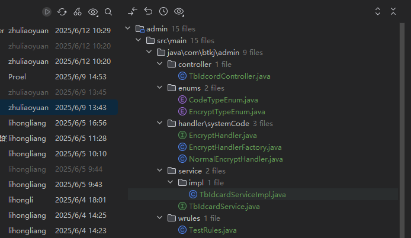
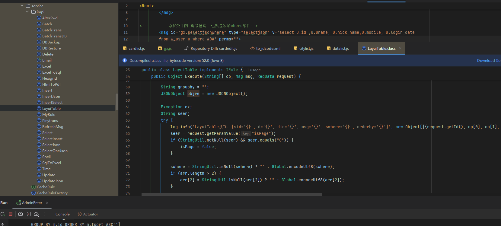

### 目标3 ：多条件传递获取数据并渲染

**说明：这是  03.2中的页面实现.md  中的目标3**

多参数的请求体格式

```javascript
$.sm(callback, [消息ID, '', $.msgArrwhere([条件数组])]);
```

#### 需要解决的问题

1. 多个参数时的请求体如何编写 

2. xml文件中是如何接收和使用的？


#### 参考例子

传入两个参数进行搜索

msgid -->  postlist.list   

#### 疑惑点

1. 按照前面的理解   xml文件中的msgid代表消息id   v代表消息内容(前面的都是直接sql语句)，而这个msgid对应的

   v 的内容为：*%16w_post%16isdel=0  （**这个地方不明白为什么是这样写的**）

   提供的whoami架构文档中才知道   %16是用来分割参数的

    perms 这个参数是权限标识

   

通过查看  [whoami框架3.0](https://apifox.com/apidoc/shared/98badc4f-73a4-4f9c-ac97-0248ed8f5d2f/doc-4734478) 访问密码：tb111111

突然顿悟  我滴妈呀   框架对应的消息类型 决定了消息内容该如何写


------

## 总结

通过管理系统中的身份证编码提交文件记录，



发现了一下几个情况

1. 这里的TbIdcordController.java  这个控制器里面的接口最后并没有与数据库进行交互，取之的是用于生成系统编码，从而返回给前端 用于后续的与数据库进行交互
2. 真正的与数据库实现交互的还是xml文件中的msg标签  
3. 通过

后续的编码过程可能也需要像这样实现 

在 `00.框架文档.md`  文件也使用到了需要实现类的情况  就是typy类型为rule的时候


## 新问题

使用layuitable 的type 类型的时候 sql语句是如何生成的？


这部分的规则是？


通过与总监的聊天发现了端倪，对于



layuitable类型的  是已经封装好的

在前端：在使用表格插件的时候请求接口会将url进行拼接，直接使用where去添加参数


在后端，前端的where里面的字段与xml文件中的where标签中的laywhere对应


相应的实现的源码jar包在LayuiTable中是封装好的


## 每个type的练习


