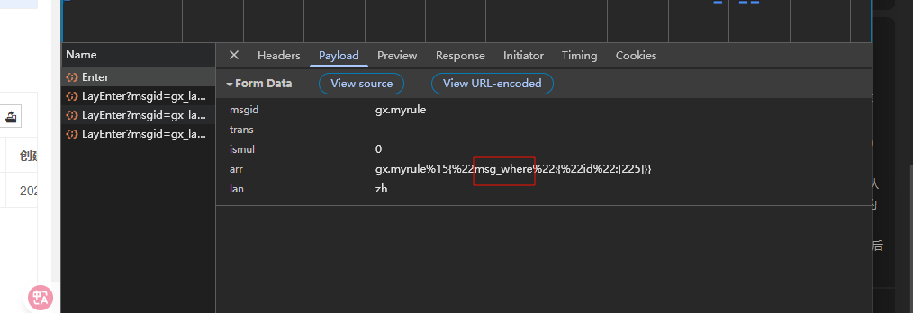
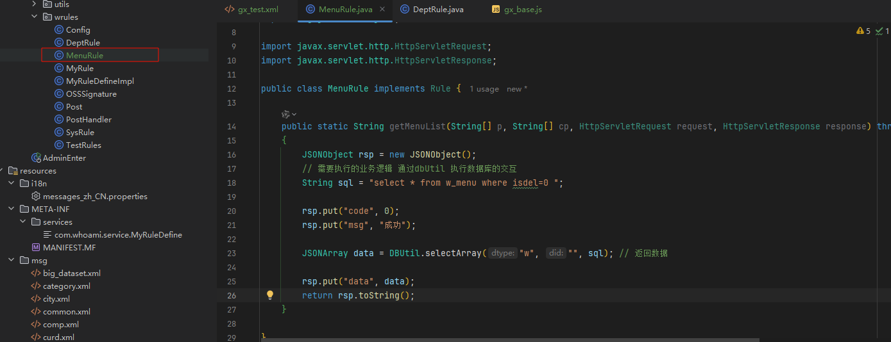

## 实现整项CRUD

### updatejson  已实现


### 疑问点：

```js
<script data-main="../../js/gx/gx_layuitable.js" src='../../sys/require.min.js'></script>
```

- `<script data-main = "" src="">` 标签中的data-main 代表的是主要的数据来源吗？ 固定写法？src中的内容替换为data-main中的内容也可以执行


## MyRule （适合复杂的CRUD）

现有的消息类型不能满足业务需求


### 基本格式说明：

- 声明了myrule消息类型后  需要紧跟一个 classMethod  为了规范 包下wrules下的创建的类的方法 

- 需要注意的是这个类需要实现Rule接口(文档里面要求)：如下

  ```java
  public static String getMenuList(String[] p, String[] cp, HttpServletRequest request, HttpServletResponse response) 
  ```

  需要注意的是  这个接口里面的方法的参数都是啥意思?  还有为什么要使用static？  启动前就加载  不是很浪费内存吗？

  > 参数：
  >
  > p:   使用了myrule消息体的话，前端请求了接口  此时会将传递的参数给到msgwhere(这里传递的是id)
  >
  > 也就说明了前端请求的是$.msgwhere(objwhere)
  >
  > 
  >
  > 对于后端，该如何解析从而得到要的参数呢？
  >
  > 通过查看 `DeptRule.java` 得到会使用`JSONObject(p[0]).optJSONOBject("msg_where")` 来得到我们想要的参数对象，再逐步获取想要的值  再使用
  >
  > cp  一般会携带对应的数据库类型

### 疑问：

1. $.msgwhere(obj1,obj2)  可以传递两个对象，目前只知道第一个obj的接收和获取数据，即使传递了在打印台获取不了相应的对象，初步判断原因是 消息内容部分使用的是   #0#  但是使用16%分割 然后使用#1# 去占位还是获取不到相应的值？
2. 

### 示例与基本步骤



- 使用string 或者stringBuilder  再或者stringBuffer 去存储sql语句
- 导入DButil工具类  使用工具类中的方法   其中的很多重要方法参考 🎉[DButil](https://apifox.com/apidoc/shared/98badc4f-73a4-4f9c-ac97-0248ed8f5d2f/doc-4861017)

### 返回说明

首先需要new 一个 JSONObject对象

设置状态码

设置msg

设置需要返回的数据

## 今日代码

```js
// 配置好基础的模块
// 添加gx.html里面的点击事件
// 向后端发送消息
require.config({
    paths: {
        jquery: '../../sys/jquery',
        system: '../../sys/system',
        layui: "../../layui-btkj/layui",
    },
    shim: {
        "system": {
            deps: ["jquery"]
        },
        "layui": {
            deps: ["jquery", "system"]
        },
        "config": {
            deps: ["layui"]
        }
    },
    waitSeconds: 0
});

require(["jquery", "system", "layui"], function () {
    layui.use(['table'], function () {

        // myrule的使用
        $("#btnMyRule").click(function () {
            // 拿到输入或者要传递的参数
            objwhere ={}
            objwhere.category_name = ["零"];
            objwhere.id = [];

            objwheretest = {}
            objwheretest.id = [Arg("id") || 5];
            
            $.sm(function (re, err) {
                if (err) {
                    layui.msg(err);
                }
                console.log(re);
            }, ["gx.myrule", $.msgArrwhere(objwhere,objwheretest)])  // 当有多个参数时，可以在前面声明变量 此处用于学习
        });
    });
});
```

```xml
   <msg id="gx.myrule" type="myrule" v="#0#16%#1#" classMethod="com.btkj.admin.wrules.MenuRule.getMenuList">
        </msg>
```

```java
package com.btkj.admin.wrules;

import com.whoami.db.DBUtil;
import com.whoami.service.Rule;
import com.whoami.util.StringUtil;
import lombok.extern.slf4j.Slf4j;
import org.json.JSONArray;
import org.json.JSONException;
import org.json.JSONObject;

import javax.servlet.http.HttpServletRequest;
import javax.servlet.http.HttpServletResponse;
import java.util.Arrays;

@Slf4j
public class MenuRule implements Rule {

    public static String getMenuList(String[] p, String[] cp, HttpServletRequest request, HttpServletResponse response) throws JSONException
    {
        JSONObject rsp = new JSONObject();

        String sqlSelectProductByCategoryName =
                " select pro.product_name, pr.cost_price,pr.sale_price,cat.category_name from product_price pr " +
                " join product_category cat on cat.id = pr.id " +
                " join product pro on pro.category3_id = cat.id " +
                " where pr.isdel=1 ";

        JSONObject msgwhere = new JSONObject(p[0]).optJSONObject("msg_where");
        JSONArray categoryName = msgwhere.optJSONArray("category_name"); // 注意这是前端传递过来的 id 假如有多个参数呢？
        JSONArray productId = msgwhere.optJSONArray("id"); // 具体商品id

        if (null != categoryName && !categoryName.isEmpty()) {
            // 获取参数
            String keyword = categoryName.optString(0);  // 获取参数
            if (!StringUtil.isEmpty(keyword)) {
                sqlSelectProductByCategoryName  += " and  cat.category_name like '%" + keyword + "%'";
            }
        }

        if(null != productId && !productId.isEmpty()){
            String categoryId = productId.optString(0);
            if(!StringUtil.isEmpty(categoryId)){
                sqlSelectProductByCategoryName += " and pro.id = '" + productId + "'";
            }
        }

        rsp.put("code", 0);
        rsp.put("msg", "成功");
        JSONArray data = DBUtil.selectArray("w", "", sqlSelectProductByCategoryName); // 返回数据
        rsp.put("data", data);

        return rsp.toString();
    }
}
```

## DButil工具类方法分析

### 1、批量查询查询(selectResultSetJSON)

#### 方法解读

**1、参数处理与数据库连接：**

​	接收dtype（数据库类型）、did（数据库标识）和sql（SQL语句）作为参数。

​	调用DB.getCon获取数据库连接，若连接失败则返回空列表。

**2、执行SQL并处理结果集：**

​	使用CallableStatement执行SQL语句。

​	遍历结果集，**将每一行数据转换为JSONObject，并存储在JSONArray中。**

​	将JSONArray及相关元信息封装为JSONObject，添加到结果列表。

**3、异常处理与资源释放：**

​	捕获异常并记录错误日志。

​	在finally块中关闭数据库资源（CallableStatement、ResultSet、Connection）。

**4、返回值：**

​	返回包含JSON对象的列表，每个对象包含结果集数据及其长度。

### 2、批量执行sql(ExecuteSqls)

#### 方法解读

1. 初始化阶段
关闭数据库连接的自动提交功能，开启事务控制
创建 ArrayList 用于存储执行结果
2. 批量处理阶段
遍历传入的 SQL 语句列表 sqllist
对每条 SQL 语句：
将其添加到批处理命令中（addBatch）
同时追加到 sql 字符串中（用于日志记录）
3. 执行阶段
调用 executeBatch() 执行所有批处理语句
获取每条语句影响的行数数组 results
将结果封装为 JSON 对象并添加到返回列表中
4. 事务处理
若执行成功：提交事务（commit）
若出现异常：回滚事务（rollback）并记录错误日志
5. 资源清理
最终关闭数据库连接


