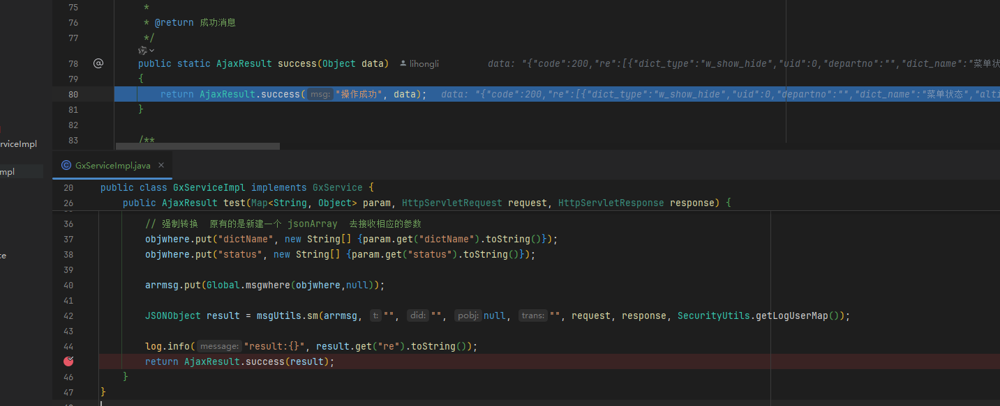
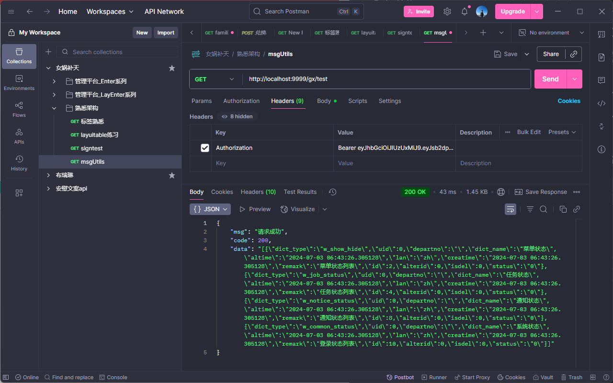

## 昨日问题

昨日的问题是使用了$smaction去请求controller(/gx/test)的时候，在idea控制台中我们已经拿到了相应的数据

但是在浏览器控制台中我们去console.log拿到相应的数据的时候 拿到的是undefined


## 原因

### 1、可能是异步问题(昨日想法)

### 2、后端返回的数据格式有问题(就是这个问题)

之所以这样说：请看VCR：


如图所示：可以看到报错了  obj  也就是我们后端返回的数据  到catch之后 并没有返回数据

这可能就是为什么我们已经返回了数据   但是拿不到的原因


## 解决问题

### 查看   success 的重载方法确定返回的数据格式 

```java
 /**
     * 返回成功消息
     * 
     * @return 成功消息
     */
    public static AjaxResult success()
    {
        return AjaxResult.success("操作成功");
    }

    /**
     * 返回成功数据
     * 
     * @return 成功消息
     */
    public static AjaxResult success(Object data)
    {
        return AjaxResult.success("操作成功", data);
    }

    /**
     * 返回成功消息
     * 
     * @param msg 返回内容
     * @return 成功消息
     */
    public static AjaxResult success(String msg)
    {
        return AjaxResult.success(msg, null);
    }

    /**
     * 返回成功消息
     * 
     * @param msg 返回内容
     * @param data 数据对象
     * @return 成功消息
     */
    public static AjaxResult success(String msg, Object data)
    {
        return new AjaxResult(HttpStatus.SUCCESS, msg, data);
    }
```

 可以看到  如果我们直接返回 result(.success(result))  走的代码为：



可以发现   data 的数据为：


很明显 在前端就解析时就会出错  返回undefined


那如果我们换为   result.get("re") 也就是  .success(result.get("re"))

理论上应该是可以成功的呀  走的重载方法也没问题，但是请求得到的结果：


离谱  data 是empty


可能是需要转换为 toString   但是这样走的就是   success(String msg)  那就将数据给到msg了  前端还是取不到


那我们就需要走别的重载方法了   success(String msg,object data)  而data 传递的就是  toString的数据  如图最终成功



## 页面完成


# 批量消息发送(batch练习)

好处：多个消息一块发送后台执行，可以减少请求次数，多看  [00.消息类型.md](./00.消息类型.md) 

## 简单示例(不带条件)

### 前端调用

```js
var arrsm = [];
arrsm.push(["gx.selectjson"])
arrsm.push(["gx.selectonejson"])
arrsm.push(["gx.selectjsonwfmenu"])

$.sm(function (re, err1) {
    if (re) {
        console.log(re)
    } else {
        jQuery.getparent().layer.msg(err1, {icon: 5});
    }
}, arrsm, {msgid: "gx.batch"})
```

### 后端实现

普通批量查询消息，可以使用batch消息，加msgid；也可以直接发送批量消息

```xml
<msg id="gx.batch" type="batch">
    <include id="gx.selectjson" />
    <include id="gx.selectonejson"/>
    <include id="gx.selectjsonwfmenu" />
</msg>
```

## 理解

上面的示例：都是查询的   而且没有携带条件  流程就只是

前端请求  gx.batch 消息   在xml中找到了相应的消息后  根据include中的消息id 去执行相应消息体的查询语句  比较好理解

## 进阶(带条件)

带条件就得去看看 sm 的源码了和文档了

> 📌 .sm=.fn.sm = function (cb, arr, pobj, timeout, trans) {}
> cb: 回调函数
> arr: 消息数组
> pobj: 拓展对象，批量消息msgid（必填）、trans事务执行
> timeout: 超时时间
> trans: 事务类型，1.单库批量事务执行 2.多库批量事务执行

### 批量insert示例

#### 前端

```js
var arrpm = [];
arrpm.push(["deptlist.add", JSON.stringify({
        depart_name: "技术部"
    }), $.msgwhere()]);
arrpm.push(["postlist.add", JSON.stringify({
        post_code: "123",
        post_name: "开发岗",
        post_sort: 123,
        status: 1
    }), $.msgwhere()]);
arrpm.push(["user.save", JSON.stringify({
        uname: "lihongli",
        nick_name: "李红利",
        depart_id:0,
        status:0
    }), $.msgwhere()]);
    
$.sm(function (re, err) {
    console.log("btnlogin - re -> " + re);
    console.log("btnlogin - err -> " + err);
}, arrpm, {msgid: "user.add"});
```

#### 后端

```xml
<msg id="user.add" type="batchtransdb" perms="sys:user:add" title="添加用户" businesstype="INSERT">
    <include id="deptlist.add"/>
    <include id="postlist.add"/>
    <include id="user.save" insertfromids="deptlist.add,postlist.add" insertkeys="depart_id,post_id"/>
</msg>
```

#### 理解：参数如何传递的？

查看 include 标签的参数说明

| 序号 | 参数          | 名称                 | 示例说明                                                     |
| :--- | :------------ | :------------------- | :----------------------------------------------------------- |
| 1    | id            | 子消息id             | 对应消息中id参数位                                           |
| 2    | insertkeys    | 插入哪些字段特殊处理 | 逗号分隔；哪些字段需要引用其他消息返回值，如：depart_id,post_id |
| 3    | insertfromids | 读取哪些消息返回值   | 逗号分隔；对应insertkeys插入返回值，如：deptlist.add,postlist.add |

> 💡 1.前端要按照执行先后顺序拼装arrmsg消息，被引用的消息要先执行；
> 2.当前引用值默认找前面执行insertfromids消息的最后一条取返回值；
> 支持形态：abbb, ababab,abcabc
