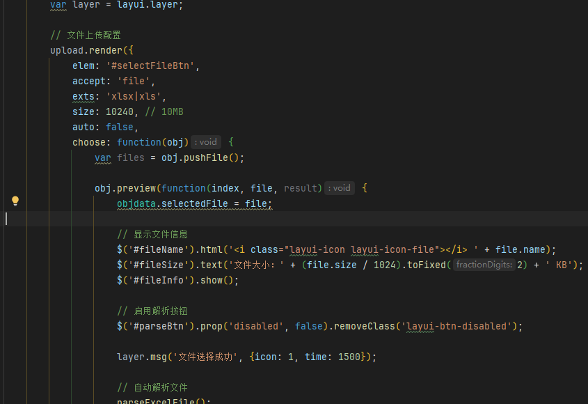
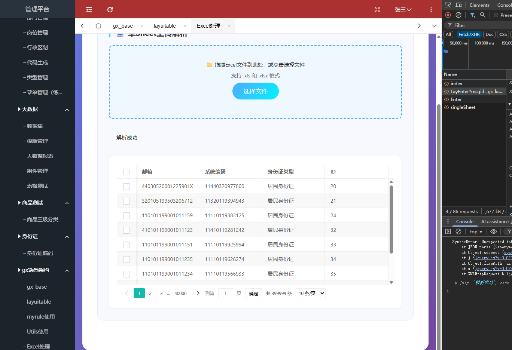

# Excel表格的解析

公司用的是 APACH poi  缺点比较占用内存

官方文档：[Easy Excel](https://easyexcel.opensource.alibaba.com/docs/current/)  这个还没有学明白


参考接口/test：

## 前端

主要使用的是layui 的upload组件



### js

```js
require.config({
    paths: {
        jquery: '../../sys/jquery',
        system: '../../sys/system',
        layui: "../../layui-btkj/layui",
        config: "../../js/layui_config"
    },
    shim: {
        "system": {
            deps: ["jquery"]
        },
        "layui": {
            deps: ["jquery", "system"]
        },
        "config": {
            deps: ["layui"]
        }
    },
    waitSeconds: 0
});

var objdata = {
    selectedFile: null,
    parsedData: [],
    tableIns: null
};

require(["jquery", "system", 'layui', 'config'], function ($) {
    layui.use(['table', 'form', 'upload', 'layer'], function () {
        var table = layui.table;
        var form = layui.form;
        var upload = layui.upload;
        var layer = layui.layer;

        // 文件上传配置
        upload.render({
            elem: '#selectFileBtn',
            accept: 'file',
            exts: 'xlsx|xls',
            size: 102400, // 10MB
            auto: false,
            choose: function(obj) {
                var files = obj.pushFile();

                obj.preview(function(index, file, result) {
                    objdata.selectedFile = file;

                    // 显示文件信息
                    $('#fileName').html('<i class="layui-icon layui-icon-file"></i> ' + file.name);
                    $('#fileSize').text('文件大小：' + (file.size / 1024).toFixed(2) + ' KB');
                    $('#fileInfo').show();

                    // 启用解析按钮
                    $('#parseBtn').prop('disabled', false).removeClass('layui-btn-disabled');

                    layer.msg('文件选择成功', {icon: 1, time: 1500});

                    // 自动解析文件
                    parseExcelFile();
                });
            },
            error: function(index, upload) {
                layer.msg('文件选择失败，请重试', {icon: 2});
            }
        });

        // 解析Excel文件
        function parseExcelFile() {
            if (!objdata.selectedFile) {
                layer.msg('请先选择文件', {icon: 2});
                return;
            }

            // 显示加载动画
            $('#singleLoading').show();
            $('#singleResult').hide();
            $('#singleDataDisplay').hide();

            var formData = new FormData();
            formData.append('file', objdata.selectedFile);

            //  需要换位 $.smaction()
            $.smaction(function(re, err){
                if (err) {
                    layer.msg(err);
                    console.log(err); // 解析失败都没有执行到这里
                } else {
                    // 解析Excel文件成功
                    objdata.parsedData = re;
                    // 使用setTimeout 添加延时
                    setTimeout(function() {
                        $('#singleLoading').hide();
                    }, 500)

                    displayData(re);
                }
            }, formData, {
                route: "gx",
                action: "singleSheet",
                datastring: false,
                contentType: false,
                processData: false
            })


        }

        // 显示解析后的数据
        function displayData(data) {
            if (!data || data.length === 0) {
                $('#singleResult').html('<div class="info">没有解析到数据</div>').show();
                return;
            }

            // 动态生成表格列
            var columns = generateColumns(data[0]);

            $('#singleResult').html('<div class="info">解析成功</div>').show();
            $('#singleDataDisplay').show();

            setTimeout(function() {
                // 渲染表格
                table.render({
                    elem: '#dataTable',
                    height: 'full-500',
                    countNumberBool: true, // 开启行号
                    defaultToolbar: ['filter', 'print', 'exports'], // 筛选  打印  导出
                    data: data,
                    cols: [columns],
                    page: true,
                    limit: 10,
                    limits: [10, 20, 50, 100],
                    even: true,
                    skin: 'row-even',
                });
            },200)

        }

        // 动态生成表格列配置
        function generateColumns(firstRow) {
            var columns = [{ type: 'checkbox', fixed: 'left' }];

            if (firstRow) {
                Object.keys(firstRow).forEach(function(key) {
                    columns.push({
                        field: key,
                        title: key,
                    });
                });
            }

            return columns;
        }


        // 初始化拖拽上传区域事件
        $(document).on('dragover', '#singleUploadArea', function(e) {
            e.preventDefault();
            $(this).addClass('dragover');
        });

        $(document).on('dragleave', '#singleUploadArea', function(e) {
            e.preventDefault();
            $(this).removeClass('dragover');
        });

        $(document).on('drop', '#singleUploadArea', function(e) {
            e.preventDefault();
            $(this).removeClass('dragover');

            var files = e.originalEvent.dataTransfer.files;
            if (files.length > 0) {
                handleDroppedFile(files[0]);
            }
        });

        // 处理拖拽文件
        function handleDroppedFile(file) {
            // 验证文件类型
            var fileName = file.name.toLowerCase();
            if (!fileName.endsWith('.xlsx') && !fileName.endsWith('.xls')) {
                layer.msg('请选择Excel文件 (.xlsx 或 .xls)', {icon: 2});
                return;
            }

            // 验证文件大小
            if (file.size > 10 * 1024 * 1024) {
                layer.msg('文件大小不能超过10MB', {icon: 2});
                return;
            }

            objdata.selectedFile = file;

            // 显示文件信息
            $('#fileName').html('<i class="layui-icon layui-icon-file"></i> ' + file.name);
            $('#fileSize').text('文件大小：' + (file.size / 1024).toFixed(2) + ' KB');
            $('#fileInfo').show();

            layer.msg('文件拖入成功', {icon: 1, time: 1500});

            // 自动解析
            parseExcelFile();
        }

        // 文件输入框变化事件
        $(document).on('change', '#singleFileInput', function(e) {
            var file = e.target.files[0];
            if (file) {
                handleDroppedFile(file);
            }
        });

    });
});
```

#### 效果：



## 后端

### 最初版本  没有使用批量处理

没有使用批量处理 当数据量过大的时候会出现OOM  内存溢出异常，假如一个表里面有40w条数据就会出问题

```java
// 解析Excel文件
 @Override
    public AjaxResult parseSingleSheet(MultipartFile file, HttpServletRequest request, HttpServletResponse response) {

        log.info("file:{}", file);
        //  先进行简单的文件校验
        if (file.isEmpty()) {
            return AjaxResult.error("上传文件为空");
        }
        if (!file.getOriginalFilename().endsWith(".xlsx") && !file.getOriginalFilename().endsWith(".xls")) {
            return AjaxResult.error("文件格式不支持，请上传Excel文件");
        }

        // 可以根据文件的复杂度和数据量进行判断 多 -> easy-excel  单 -> poi
        // 使用easy-excel 进行解析  需要去查看相关的文档  创建实体类与模板  创建监视器  使用工具类 进行解析
        // 理论上可以创建相应的工具类EasyExcelUtils 进行解析
//        List<Map<String, Object>> dataList = EasyExcelUtils.parseSingleSheet(file);
        // 使用 apache poi 进行解析  也就是使用work book  TODO  缺点很大 适合简单的excel 表格数据量过大的话 不适合
        List<Map<String, Object>> dataList = parseSingleSheetByPoi(file);

        return AjaxResult.success("解析成功", dataList);
    }

    private List<Map<String, Object>> parseSingleSheetByPoi(MultipartFile file) {
        String fileName = file.getOriginalFilename();
        log.info("fileName:{}", fileName);

        List<Map<String, Object>> result = new ArrayList<>();

        try(InputStream inputStream = file.getInputStream();
            Workbook workbook = fileName.endsWith(".xlsx") ?
                    new XSSFWorkbook(inputStream): new HSSFWorkbook(inputStream);
            ){
            Sheet sheet = workbook.getSheetAt(0); // 获取第一个sheet
            Row header = sheet.getRow(0); // 获取表头

            // TODO 1: 创建相应的字段映射
            Map<Integer, String> fieldMapping = createFieldMapping(header);

            // TODO 2: 批量处理方法封装    缺点很大 适合简单的excel 表格数据量过大的话 不适合
            List<Map<String, Object>> dataList = batchProcessRows(sheet, fieldMapping);

            // TODO  增删改查方法封装
            result =  validateAndProcessData(dataList);

        }catch (Exception e){
            log.error("解析Excel文件时出错", e);
        }
       return result;
    }

    /**
     * 创建字段映射关系
     */
    private Map<Integer, String> createFieldMapping(Row header) {
        Map<Integer, String> mapping = new HashMap<>();
        if (header != null) {
            for (int i = 0; i < header.getLastCellNum(); i++) {
                Cell cell = header.getCell(i);
                if (cell != null) {
                    String columnName = getCellValue(cell).toString().trim();
                    mapping.put(i, columnName);
                }
            }
        }
        return mapping;
    }

    /**
     * 批量处理行数据
     */
    private List<Map<String, Object>> batchProcessRows(Sheet sheet, Map<Integer, String> fieldMapping) {
        List<Map<String, Object>> dataList = new ArrayList<>();

        //TODO 从第二行开始读取数据（跳过表头）根据实际的数据在第几行开始的使用
        for (int rowNum = 1; rowNum <= sheet.getLastRowNum(); rowNum++) {
            Row row = sheet.getRow(rowNum);
            if (row != null) {
                Map<String, Object> rowData = processRow(row, fieldMapping);
                if (!rowData.isEmpty()) {
                    dataList.add(rowData);
                }
            }
        }
        return dataList;
    }

    /**
     * 处理单行数据
     */
    private Map<String, Object> processRow(Row row, Map<Integer, String> fieldMapping) {
        Map<String, Object> rowData = new HashMap<>();

        for (Map.Entry<Integer, String> entry : fieldMapping.entrySet()) {
            int cellIndex = entry.getKey();
            String fieldName = entry.getValue();

            Cell cell = row.getCell(cellIndex);
            Object cellValue = getCellValue(cell);

            if (cellValue != null && !cellValue.toString().trim().isEmpty()) {
                rowData.put(fieldName, cellValue);
            }
        }
        return rowData;
    }

    /**
     * 获取单元格值
     */
    private Object getCellValue(Cell cell) {
        if (cell == null) return null;

        switch (cell.getCellType()) {
            case STRING:
                return cell.getStringCellValue();
            case NUMERIC:
                if (DateUtil.isCellDateFormatted(cell)) {
                    return cell.getDateCellValue();
                }
                return cell.getNumericCellValue();
            case BOOLEAN:
                return cell.getBooleanCellValue();
            case FORMULA:
                return cell.getCellFormula();
            default:
                return null;
        }
    }
    /**
     * 数据验证和处理（可选）
     */
    private List<Map<String, Object>> validateAndProcessData(List<Map<String, Object>> dataList) {
        // 示例：数据验证逻辑 清除空列
        dataList.removeIf(row -> row.isEmpty());

        // 示例：数据清洗 去除空值列
        dataList.forEach(row -> {
            row.entrySet().removeIf(entry ->
                    entry.getValue() == null || entry.getValue().toString().trim().isEmpty()
            );
        });

        log.info("处理后的数据：{}", dataList.get(0).get("邮箱"));
        // 接下来就可以使用msgUtils 和数据库交互了  批量插入数据库
        return dataList;
    }
```

### 优化版本  使用SAX事件驱动

限制了一次最大处理的数据量和批量处理的数据量，

同时使用了[POI 的SAX事件驱动模式](https://www.cnblogs.com/ZhangZiSheng001/p/12532074.html)来尽可能的减少内存占用

最终得到如下的结果:


##### 步骤

```java
private static final int BATCH_SIZE = 1000; // 批处理大小
    private static final int MAX_ROWS = 500000; // 最大行数限制
    private static final long MAX_FILE_SIZE = 50 * 1024 * 1024;
 
@Override
    public AjaxResult parseSingleSheet(MultipartFile file, HttpServletRequest request, HttpServletResponse response) {
        log.info("开始解析文件: {}", file.getOriginalFilename());

        // 文件校验
        AjaxResult validationResult = validateFile(file);
        if (!validationResult.isSuccess()) {
            return validationResult;
        }

        try {
            // 使用流式处理避免OOM，返回解析后的数据
            List<Map<String, Object>> dataList = processExcelStream(file);
            return AjaxResult.success("解析成功", dataList);
        } catch (Exception e) {
            log.error("解析Excel文件时出错: {}", file.getOriginalFilename(), e);
            return AjaxResult.error("文件解析失败: " + e.getMessage());
        }
    }

    /**
     * 文件校验
     */
    private AjaxResult validateFile(MultipartFile file) {
        if (file.isEmpty()) {
            return AjaxResult.error("上传文件为空");
        }

        String filename = file.getOriginalFilename();
        if (filename == null || (!filename.endsWith(".xlsx") && !filename.endsWith(".xls"))) {
            return AjaxResult.error("文件格式不支持，请上传Excel文件");
        }

        if (file.getSize() > MAX_FILE_SIZE) {
            return AjaxResult.error("文件大小超过限制，最大支持50MB");
        }

        return AjaxResult.success();
    }

    /**
     * 流式处理Excel - 返回解析结果
     */
    private List<Map<String, Object>> processExcelStream(MultipartFile file) throws Exception {
        long startTime = System.currentTimeMillis();

        /* TODO 这部分的allData是存储的数据量是很大的，存储的是处理了的数据
           如果需要返回处理后的数据，才这样写  如果只是单纯记录处理成功的数据 进行计数即可避免占储内存
         */
        List<Map<String, Object>> allData = new ArrayList<>();

        try (InputStream inputStream = file.getInputStream()) {

            // 使用SAX方式解析，内存占用小
            if (file.getOriginalFilename().endsWith(".xlsx")) {
                processXlsxFile(inputStream, allData);
            } else {
                processXlsFile(inputStream, allData);
            }

        }

        long processTime = System.currentTimeMillis() - startTime;
        log.info("Excel解析完成，耗时: {}ms, 解析数据: {}条", processTime, allData.size());

        return allData;
    }

    /**
     * 处理XLSX文件 - 使用SAX模式
     */
    private void processXlsxFile(InputStream inputStream, List<Map<String, Object>> allData) throws Exception {
        try (XSSFWorkbook workbook = new XSSFWorkbook(inputStream)) {
            XSSFSheet sheet = workbook.getSheetAt(0);

            // 获取表头
            Map<Integer, String> headerMap = parseHeader(sheet.getRow(0));
            if (headerMap.isEmpty()) {
                throw new RuntimeException("无法解析表头信息");
            }

            // 流式处理数据行
            processRowsInBatches(sheet, headerMap, allData);
        }
    }

    /**
     * 处理XLS文件
     */
    private void processXlsFile(InputStream inputStream, List<Map<String, Object>> allData) throws Exception {
        try (HSSFWorkbook workbook = new HSSFWorkbook(inputStream)) {
            HSSFSheet sheet = workbook.getSheetAt(0);

            Map<Integer, String> headerMap = parseHeader(sheet.getRow(0));
            if (headerMap.isEmpty()) {
                throw new RuntimeException("无法解析表头信息");
            }

            processRowsInBatches(sheet, headerMap, allData);
        }
    }

    /**
     * 解析表头
     */
    private Map<Integer, String> parseHeader(Row headerRow) {
        Map<Integer, String> headerMap = new HashMap<>();

        if (headerRow == null) {
            return headerMap;
        }

        for (int i = 0; i < headerRow.getLastCellNum(); i++) {
            Cell cell = headerRow.getCell(i);
            if (cell != null) {
                String headerName = getCellValueAsString(cell).trim();
                if (!headerName.isEmpty()) {
                    headerMap.put(i, headerName);
                }
            }
        }

        return headerMap;
    }

    /**
     * 分批处理行数据 - 核心优化点
     */
    private void processRowsInBatches(Sheet sheet, Map<Integer, String> headerMap, List<Map<String, Object>> allData) {
        List<Map<String, Object>> batch = new ArrayList<>(BATCH_SIZE);
        int totalRows = sheet.getLastRowNum();
        int errorCount = 0;

        // 检查行数限制
        if (totalRows > MAX_ROWS) {
            throw new RuntimeException("数据行数超过限制: " + totalRows + " > " + MAX_ROWS);
        }

        // 从第二行开始处理（跳过表头）
        for (int rowNum = 1; rowNum <= totalRows; rowNum++) {
            Row row = sheet.getRow(rowNum);

            if (row == null) {
                continue; // 跳过空行
            }

            try {
                Map<String, Object> rowData = parseRowData(row, headerMap);
                if (!rowData.isEmpty()) {
                    batch.add(rowData);
                }

                // 达到批处理大小时，处理批次并添加到结果集
                if (batch.size() >= BATCH_SIZE) {
                    processBatch(batch, allData);
                    batch.clear(); // 清空批次，释放内存
                }

            } catch (Exception e) {
                log.warn("处理第{}行数据时出错: {}", rowNum + 1, e.getMessage());
                errorCount++;
            }
        }

        // 处理最后一个批次
        if (!batch.isEmpty()) {
            processBatch(batch, allData);
        }

        if (errorCount > 0) {
            log.info("解析完成，错误行数: {}", errorCount);
        }
    }

    /**
     * 解析单行数据
     */
    private Map<String, Object> parseRowData(Row row, Map<Integer, String> headerMap) {
        Map<String, Object> rowData = new HashMap<>();
        boolean hasData = false;

        for (Map.Entry<Integer, String> entry : headerMap.entrySet()) {
            int cellIndex = entry.getKey();
            String fieldName = entry.getValue();

            Cell cell = row.getCell(cellIndex);
            Object cellValue = getCellValue(cell);

            if (cellValue != null && !cellValue.toString().trim().isEmpty()) {
                rowData.put(fieldName, cellValue);
                hasData = true;
            }
        }

        return hasData ? rowData : Collections.emptyMap();
    }

    /**
     * 处理批次数据 - 数据验证和清洗
     */
    private void processBatch(List<Map<String, Object>> batch, List<Map<String, Object>> allData) {
        if (batch.isEmpty()) {
            return;
        }

        try {
            // 数据验证和清洗
            List<Map<String, Object>> validData = validateAndCleanBatchData(batch);

            // 添加到结果集
            if (!validData.isEmpty()) {
                allData.addAll(validData);
                //TODO validData就是一次1000条数据中符合要求的数据  可以对其与数据库交互  比如插入
                batchInsertService(validData);
//                log.info("成功处理批次数据: {} 条", validData.size());
            }

        } catch (Exception e) {
            log.error("批次处理失败", e);
        }
    }

    /**
     * 批量插入数据库
     */
    private void batchInsertService(List<Map<String, Object>> validData) {
        // 批量插入数据库 msgUtils.sm(arr, t, did, pobj, timeout, trans, request, response, tokenId, userMap)
        // TODO  但是这里还真不好用

    }

    /**
     * 批量数据验证和清洗
     */
    private List<Map<String, Object>> validateAndCleanBatchData(List<Map<String, Object>> batch) {
        return batch.stream()
                .filter(row -> !row.isEmpty())
                .map(this::cleanRowData)
                .filter(this::isValidRow)
                .collect(Collectors.toList());
    }
    /**
     * 清洗单行数据
     */
    private Map<String, Object> cleanRowData(Map<String, Object> row) {
        Map<String, Object> cleanedRow = new HashMap<>();

        row.forEach((key, value) -> {
            if (value != null && !value.toString().trim().isEmpty()) {
                // 清洗数据：去除首尾空格
                if (value instanceof String) {
                    cleanedRow.put(key, value.toString().trim());
                } else {
                    cleanedRow.put(key, value);
                }
            }
        });

        return cleanedRow;
    }

    /**
     * 单行数据验证
     */
    private boolean isValidRow(Map<String, Object> row) {
        // 根据业务需求添加验证逻辑
        // 例如：检查必填字段，这里以邮箱为例
        return !row.isEmpty() &&
                (row.containsKey("邮箱") ? row.get("邮箱") != null : true);
    }

    /**
     * 获取单元格值 - 优化版本
     */
    private Object getCellValue(Cell cell) {
        if (cell == null) {
            return null;
        }

        try {
            switch (cell.getCellType()) {
                case STRING:
                    return cell.getStringCellValue().trim();
                case NUMERIC:
                    if (DateUtil.isCellDateFormatted(cell)) {
                        return cell.getDateCellValue();
                    }
                    // 处理数字格式，避免科学计数法
                    double numValue = cell.getNumericCellValue();
                    if (numValue == Math.floor(numValue) && !Double.isInfinite(numValue)) {
                        return (long) numValue;
                    }
                    return numValue;
                case BOOLEAN:
                    return cell.getBooleanCellValue();
                case FORMULA:
                    try {
                        return cell.getNumericCellValue();
                    } catch (Exception e) {
                        return cell.getStringCellValue().trim();
                    }
                default:
                    return null;
            }
        } catch (Exception e) {
            log.warn("获取单元格值失败: {}", e.getMessage());
            return null;
        }
    }

    /**
     * 获取单元格字符串值
     */
    private String getCellValueAsString(Cell cell) {
        Object value = getCellValue(cell);
        return value != null ? value.toString() : "";
    }
```

### 说明

上面的例子全是关于一个sheet  也就是传递excel表格第第一个sheet  而在后端使用

```java
XSSFSheet sheet = workbook.getSheetAt(0);
```

0就代表了 第一个sheet

1代表的就是第二个 sheet  这里面的解析方法都可以解析对应的sheet的数据  前提模板没问题


虽然第二种方案避免了OOM  但是从 [SAX文档](https://www.cnblogs.com/ZhangZiSheng001/p/12532074.html#%E8%AF%BBxlsx--%E4%BD%BF%E7%94%A8SAX%E6%96%B9%E5%BC%8F)中知道了它只是低级的封装 并不是最优选择  

### EasyExcel版本  不熟悉 不太会使用

**它与apache poi的依赖会存在冲突**

easy excel对 POI进行高级的封装，具有如下的几种优势：

- **SAX解析**：EasyExcel底层使用SAX方式，天然避免OOM
- **流式处理**：逐行读取，内存占用恒定
- **自动内存管理**：无需手动管理Workbook资源

- **解析速度快**：比POI快2-3倍
- **内存占用少**：相同文件内存占用减少70%+
- **CPU占用低**：优化的解析算法

#### 步骤

1. 添加依赖  (需要注意的是 apache的一些依赖会与  easy-excel冲突)
2. 创建相应的监视器类（推荐） 也可以使用内部类那就只能当前类可以使用  很局限 

#### 实施


## Excel表格的批量插入

这部分只做了解

如何配合着 msgUtils.sm(arrmsg,其他参数)

## Excel表格的导出