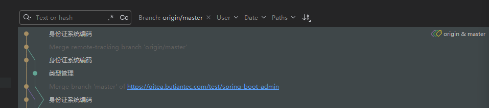
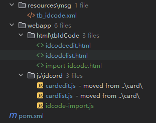

## 熟悉项目

项目所采用的前后端未分离，前端后端都在一个文件夹下

### Java后端

后端使用的是springboot单体架构  

使用了线程池   看见了创建线程的方式   

#### 代码规范

1. 包名规范


### layui前端

前端的使用的是原始的三件套  没有使用封装好的组件

html 、css、js分开实现   js偏向原始的jQuery


这是我接触的新项目中用到的whoami,但是之前我没有接触过,对于有些接口添加了断点,为什么不卡顿,为我提供详细的whoami的基础知识,同时针对图中的debug里面的信息,为我讲解对应的whoami架构


## 功能案例分析

1、从架构上来讲   参考身份证系统编码 的提交记录来看   




要想实现这个功能 根据证件编码 ，需要的步骤如下：

### 后端


控制器  接口  枚举  实现类

导入功能：和之前上班使用的技术一样  使用的都是流去操作   之前上班没有对上传的文件先进行验证是否符合   使用workbook 去获取到对于的excel表格资源  再去获取相应的工作表和表头  再去获取相应的列得到对应的字段   源代码使用的是apache 的POI去操作对应的workbook   sheet  row对象

#### 使用POI实现

```java
// 校验文件是否为空
if (file.isEmpty()) {
    return AjaxResult.error("上传文件为空");
}

// 校验文件类型
String fileName = file.getOriginalFilename();
if (fileName == null || !(fileName.endsWith(".xlsx") || fileName.endsWith(".xls"))) {
    return AjaxResult.error("文件格式不支持，请上传Excel文件");
}

// 自动关闭工作簿资源
try (InputStream is = file.getInputStream();
     Workbook workbook = fileName.endsWith(".xlsx") ?
             new XSSFWorkbook(is) : new HSSFWorkbook(is)) {

    // 获取工作表和表头
    Sheet sheet = workbook.getSheetAt(0);
    Row header = sheet.getRow(0);
    if (header == null || isEmptyRow(header)) {
        return AjaxResult.error("上传文件格式错误，缺少表头");
    }

    // 解析表头
    List<String> headerList = new ArrayList<>();
    for (int i = 0; i < header.getLastCellNum(); i++) {
        headerList.add(getCellValueAsString(header.getCell(i)));
    }

    // 使用原子类替代普通变量
    AtomicInteger emptyRowCount = new AtomicInteger(0);
    List<Map<String, Object>> successDataList = Collections.synchronizedList(new ArrayList<>());
    List<Map<String, Object>> errorDataList = Collections.synchronizedList(new ArrayList<>());
    Map<String, Integer> validRowCountMap = new ConcurrentHashMap<>();

    // 确定批处理大小
    int batchSize = 100;
    int lastRowNum = sheet.getLastRowNum();

    // 为线程安全创建request和response的副本
    HttpServletRequest requestCopy = request;
    HttpServletResponse responseCopy = response;

    // 创建任务列表
    List<CompletableFuture<Void>> futures = new ArrayList<>();
    final Map<String, Object> logUserMap = SecurityUtils.getLogUserMap();

    // 分批处理数据行
    for (int startRow = 1; startRow <= lastRowNum; startRow += batchSize) {
        int endRow = Math.min(startRow + batchSize - 1, lastRowNum);

        // 对每个批次创建一个任务
        int finalStartRow = startRow;
        CompletableFuture<Void> future = CompletableFuture.runAsync(() -> {
            for (int i = finalStartRow; i <= endRow; i++) {
                // 注意：这里的startRow和endRow是effectively final的
                Row row = sheet.getRow(i);
                if (row == null || isEmptyRow(row)) {
                    emptyRowCount.incrementAndGet();
                    continue;
                }

                // 解析当前行数据
                Map<String, Object> rowData = new LinkedHashMap<>();
                for (int j = 0; j < headerList.size(); j++) {
                    String headerName = headerList.get(j);
                    Cell cell = row.getCell(j);
                    rowData.put(titleMap.get(headerName), getCellValueAsString(cell));
                }

                // 判断格式是否正确
                if (!verification(typeMap.get(rowData.get("idType")), (String) rowData.get("idNo"))) {
                    rowData.put("desc", "证件号格式错误");
                    rowData.put("row", i);
                    errorDataList.add(rowData);
                    validRowCountMap.compute("errorCount", (k, v) -> v == null ? 1 : v + 1);
                    continue;
                }

                // 判断是否重复
                if (checkRepeat(requestCopy, responseCopy, rowData, logUserMap)) {
                    rowData.put("desc", "证件号重复");
                    rowData.put("row", i);
                    errorDataList.add(rowData);
                    validRowCountMap.compute("errorCount", (k, v) -> v == null ? 1 : v + 1);
                    continue;
                }

                successDataList.add(rowData);
                validRowCountMap.compute("successCount", (k, v) -> v == null ? 1 : v + 1);
            }
        }, threadPoolTaskExecutor);

        futures.add(future);
    }

    // 等待所有任务完成
    CompletableFuture.allOf(futures.toArray(new CompletableFuture[0])).join();

    // 返回解析结果
    Map<String, Object> resultMap = new HashMap<>();
    Map<String, Object> result = new HashMap<>();
    result.put("totalRows", lastRowNum);
    result.put("validRows", validRowCountMap);
    result.put("emptyRows", emptyRowCount.get());
    resultMap.put("success", successDataList);
    resultMap.put("error", errorDataList);
    result.put("data", resultMap);

    return AjaxResult.success("文件解析成功", result);

} catch (InvalidFormatException e) {
    return AjaxResult.error("文件格式错误: " + e.getMessage());
} catch (IOException e) {
    return AjaxResult.error("文件读取失败: " + e.getMessage());
} catch (Exception e) {
    return AjaxResult.error("系统异常: " + e.getMessage());
}
```

#### 使用easyexcel库实现

使用easyexcel去实现，前提在依赖中添加相关的依赖库   

```java
import com.alibaba.excel.EasyExcel;
import com.alibaba.excel.context.AnalysisContext;
import com.alibaba.excel.event.AnalysisEventListener;
import org.springframework.web.multipart.MultipartFile;

import java.io.IOException;
import java.util.*;
import java.util.concurrent.*;
import java.util.concurrent.atomic.AtomicInteger;

public AjaxResult importExcel(MultipartFile file, 
                             HttpServletRequest request, 
                             HttpServletResponse response) {
    
    // 校验文件是否为空
    if (file.isEmpty()) {
        return AjaxResult.error("上传文件为空");
    }

    // 校验文件类型
    String fileName = file.getOriginalFilename();
    if (fileName == null || !(fileName.endsWith(".xlsx") || fileName.endsWith(".xls"))) {
        return AjaxResult.error("文件格式不支持，请上传Excel文件");
    }

    try {
        // 使用原子类替代普通变量
        AtomicInteger emptyRowCount = new AtomicInteger(0);
        AtomicInteger totalRowCount = new AtomicInteger(0);
        List<Map<String, Object>> successDataList = Collections.synchronizedList(new ArrayList<>());
        List<Map<String, Object>> errorDataList = Collections.synchronizedList(new ArrayList<>());
        Map<String, Integer> validRowCountMap = new ConcurrentHashMap<>();

        // 为线程安全创建request和response的副本
        HttpServletRequest requestCopy = request;
        HttpServletResponse responseCopy = response;
        final Map<String, Object> logUserMap = SecurityUtils.getLogUserMap();

        // 创建监听器
        AnalysisEventListener<Map<Integer, String>> listener = new AnalysisEventListener<Map<Integer, String>>() {
            private List<String> headerList = new ArrayList<>();
            private List<CompletableFuture<Void>> futures = new ArrayList<>();
            private final int batchSize = 100;
            private List<Map<Integer, String>> cachedData = new ArrayList<>();

            @Override
            public void invokeHeadMap(Map<Integer, String> headMap, AnalysisContext context) {
                // 解析表头
                if (headMap == null || headMap.isEmpty()) {
                    throw new RuntimeException("上传文件格式错误，缺少表头");
                }
                for (int i = 0; i < headMap.size(); i++) {
                    headerList.add(headMap.get(i));
                }
            }

            @Override
            public void invoke(Map<Integer, String> data, AnalysisContext context) {
                totalRowCount.incrementAndGet();
                
                // 检查空行
                if (isEmptyRowData(data)) {
                    emptyRowCount.incrementAndGet();
                    return;
                }

                // 批量处理
                cachedData.add(data);
                if (cachedData.size() >= batchSize) {
                    processBatch(new ArrayList<>(cachedData), context.readRowHolder().getRowIndex());
                    cachedData.clear();
                }
            }

            @Override
            public void doAfterAllAnalysed(AnalysisContext context) {
                // 处理剩余数据
                if (!cachedData.isEmpty()) {
                    processBatch(cachedData, context.readRowHolder().getRowIndex());
                }
                // 等待所有任务完成
                CompletableFuture.allOf(futures.toArray(new CompletableFuture[0])).join();
            }

            private void processBatch(List<Map<Integer, String>> batchData, int rowIndex) {
                CompletableFuture<Void> future = CompletableFuture.runAsync(() -> {
                    for (Map<Integer, String> rowData : batchData) {
                        processRow(rowData, rowIndex);
                    }
                }, threadPoolTaskExecutor);
                futures.add(future);
            }

            private void processRow(Map<Integer, String> data, int rowIndex) {
                // 解析当前行数据
                Map<String, Object> rowData = new LinkedHashMap<>();
                for (int j = 0; j < headerList.size(); j++) {
                    String headerName = headerList.get(j);
                    String cellValue = data.get(j);
                    rowData.put(titleMap.get(headerName), cellValue);
                }

                // 判断格式是否正确
                if (!verification(typeMap.get(rowData.get("idType")), (String) rowData.get("idNo"))) {
                    rowData.put("desc", "证件号格式错误");
                    rowData.put("row", rowIndex + 1);
                    errorDataList.add(rowData);
                    validRowCountMap.compute("errorCount", (k, v) -> v == null ? 1 : v + 1);
                    return;
                }

                // 判断是否重复
                if (checkRepeat(requestCopy, responseCopy, rowData, logUserMap)) {
                    rowData.put("desc", "证件号重复");
                    rowData.put("row", rowIndex + 1);
                    errorDataList.add(rowData);
                    validRowCountMap.compute("errorCount", (k, v) -> v == null ? 1 : v + 1);
                    return;
                }

                successDataList.add(rowData);
                validRowCountMap.compute("successCount", (k, v) -> v == null ? 1 : v + 1);
            }

            private boolean isEmptyRowData(Map<Integer, String> data) {
                return data == null || data.values().stream()
                    .allMatch(value -> value == null || value.trim().isEmpty());
            }
        };

        // 使用EasyExcel读取文件
        EasyExcel.read(file.getInputStream(), listener)
                .headRowNumber(1)
                .sheet()
                .doRead();

        // 返回解析结果
        Map<String, Object> resultMap = new HashMap<>();
        Map<String, Object> result = new HashMap<>();
        result.put("totalRows", totalRowCount.get());
        result.put("validRows", validRowCountMap);
        result.put("emptyRows", emptyRowCount.get());
        resultMap.put("success", successDataList);
        resultMap.put("error", errorDataList);
        result.put("data", resultMap);

        return AjaxResult.success("文件解析成功", result);

    } catch (IOException e) {
        return AjaxResult.error("文件读取失败: " + e.getMessage());
    } catch (Exception e) {
        return AjaxResult.error("系统异常: " + e.getMessage());
    }
}
```

期间涉及到的xml  

### 前端



列表展示  编辑  以及导入对应的html和js  


## 前后端交互流程

通过和总监沟通后，了解到对于一些简单的查询或者crud   在前端请求接口   

### 1. xml中就实现了

前端请求接口有两种形式   第一种就是通过whoami消息框架   在前端传递相应的消息id  在xml文件里面的msg标签里面的id  与前端传递的对应之后就生成对于的sql语句执行完成   这种模式下封装好了的 根据文档里面的内容  会针对rpc去进行是否外部资源的请求  然后返回相应的数据


### 2. 对于复杂的业务场景  需要结合controller去实现

当遇到复杂的业务  不能使用上述模式的时候才会去写对应的controller  再进行相应的crud   这部分挺好看明白的    


听说下次开发使用的是比较新的uni-appx  使用别人封装好的组件，大大提升开发效率    uni.navigateto  页面跳转