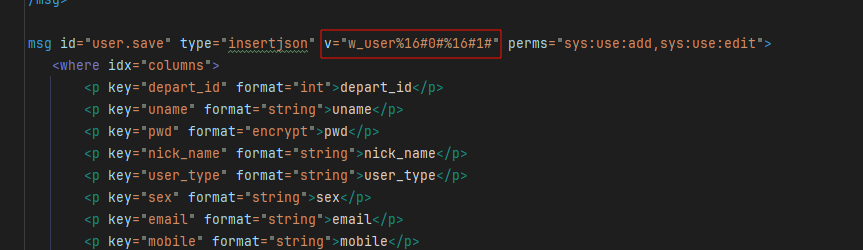

## 主要学习layui前端框架

通过标签（<button id = 'btnlogin'>）所绑定的id 

在script中是使用 $('#前面标签绑定的id')  如下：

前提：


对应的js文件中写好的函数

```js
<script>
    $('#btnlogin').click((e) => {
        console.log(e);
        $.sm((re, err) => {
            console.log(re, err)
        }, ['w_user.editpwd', '123456', '000000'])
    })
</script>

```

按照公司的架构  **w_user.editpwd  这个是传递的消息id  msgid   这个id在xml文件中会有与之一致的msg标签  这个标签内的内容就有对应的sql执行**


### 通过系统内的userlist.js  和user.xml 

学习公司的whoami消息架构

**userlist.js**

```js
/*
內容摘要:用户管理
测定分析
修改日期：2024.8.6
*/

require.config({
    paths: {
        jquery: '../../sys/jquery',
        system: '../../sys/system',
        layuicommon: "../../sys/layuicommon",
        layui: "../../layui-btkj/layui"
    },
    shim: {
        "system": {
            deps: ["jquery"]
        },
        "layui": {
            deps: ["jquery", "system"]
        },
        "layuicommon": {
            deps: ["jquery", "layui"]
        }
    },
    waitSeconds: 0
});
var objdata = {
    objuserType: {
        "0": ["男", "#1e9fff"],
        "1": ["女", "#ff5722"],
        "2": ["未知", "#ffb800"],
    },
};
require(["jquery", "system", 'layui', "layuicommon"], function () {
    layui.use(['table', 'layer'], function () {
        $("#UserSearch").click(function () {
            search();
        });

        $("#UserAdd").click(function () {
            openwin("add");
        });
        initlist();

    });
});

function initlist() {
    var table = layui.table;
    var form = layui.form;
    var departAll = []; // 存放所有部门表信息的数组
    var departNames = []; // 存放部门名称的数组
    var rolelist = [];//存放角色表信息的数组
    var postlist = [];//存放角色表信息的数组

    //部门信息
    $.sm(function (re, err) {
        if (re) {
            departAll = Object.values(re);
        } else {
            layer.msg(err);
        }
    }, ["user.getDepart"]);
    //角色信息
    $.sm(function (re,err){
        if(re){
            re.forEach(function(role) {
                rolelist.push({
                    id: role.id,
                    role_name: role.role_name
                });
            });
        }else{
            layer.msg(err);
        }
    },["user.role_user"]);
    //岗位信息
    $.sm(function (re,err){
        if(re){
            re.forEach(function(post) {
                postlist.push({
                    id: post.id,
                    post_name: post.post_name
                });
            });
        }else{
            layer.msg(err);
        }
    },["user.post_user"]);

    table.render({
        elem: '#laytable',    //指定table模版
        url: $.layurl + "?" + $.getSmStr(["user.getuser"]),         //数据接口
        header: {
            "Content-Type": "application/json",
            "Accept": "application/json",
        },
        where: {
            fields: 'id',
            types: 'asc'
        },
        height: 'full-' + ($("#laytable").offset().top + 20),
        autoSort: false,
        cols: [[ //标题栏   id,depart_id,uname,nick_name,remark,sex,status
            {type: 'checkbox', fixed: 'left'},
            {field: 'id', title: '用户ID', align: 'center', width: 50},
            {field: 'uname', title: '用户账号', align: 'center', width: 80},
            {field: 'nick_name', title: '用户昵称', align: 'center', width: 80},
            {field: 'role_id', title: '用户角色', align: 'center', width: 80,templet:function (d){
                    return rolelist.find(item => item.id === d.role_id)?.role_name || 'undefined';
                }},
            {field: 'user_type', title: '用户类型', align: 'center', width: 80, templet: function (d) {
                    if (d.user_type === "00") {
                        return "系统用户";
                    } else {
                        return "未知类型";
                    }
                }
            },
            {field: 'post_id', title: '用户岗位', align: 'center', width: 80,templet:function (d){
                    return postlist.find(item => item.id === d.post_id)?.post_name || 'undefined';
                }},
            {field: 'sex', title: '性别', align: 'center', width: 50, templet: function (d) {
                    if (!d.sex) {
                        return "";
                    }
                    //0男    1女    2未知
                    var arrtype = objdata.objuserType[d.sex];
                    var cls = arrtype[1];
                    var typeName = arrtype[0];
                    return '<span class="layui-btn-sm" style="color:white;background-color: ' + cls + '">' + typeName + '</span>';
                }
            },
            {field: 'status', title: '账号状态', align: 'center', width: 80, templet: '#statusTpl'},
            {field: 'u.depart_id', title: '所在部门', align: 'center', width: 250, templet: function (d) {
                    departNames = [];
                    return getDepartPath(d.depart_id);
                }
            },
            {field: 'email', title: '用户邮箱', align: 'center', width: 150},
            {field: 'mobile', title: '手机号码', align: 'center', width: 120},
            {field: 'remark', title: '备注', align: 'center', width: 80},
            {field: 'creatime', title: '创建时间', align: 'center', width: 160, templet: function (d) {
                    return createTime(d.creatime);          //yy-MM-dd HH:mm:ss
                    //return d.altime ? new Date(d.altime).toLocaleString() : '';       //yy/MM/dd HH:mm:ss
                }
            },
            {field: 'altime', title: '更新时间', align: 'center', width: 160, templet: function (d) {
                    return createTime(d.altime);
                }
            },
            {field: 'login_ip', title: '最后登录IP', align: 'center', width: 80},
            {field: 'login_date', title: '最后登录时间', align: 'center', width: 160, templet: function (d) {
                    return createTime(d.login_date);
                }
            },
            {title: '操作', width: 250, align: 'center', fixed: 'right', templet: function (d) {
                    var arrbtnhtml = [];
                    arrbtnhtml.push('<a class="layui-btn layui-btn-xs " lay-event="edituser" title="编辑" lay-perm="sys:use:edit"><i class="layui-icon">&#xe630;</i>编辑</a>');
                    arrbtnhtml.push('<a class="layui-btn layui-btn-danger layui-btn-xs " lay-event="deluser" title="删除" lay-perm="sys:use:del"><i class="layui-icon">&#xe630;</i>删除</a>');
                    arrbtnhtml.push('<a class="layui-btn layui-btn-warm layui-btn-xs " lay-event="updatePwd" title="修改密码" lay-perm="sys:use:pwd"><i class="layui-icon">&#xe630;</i>修改密码</a>');
                    // console.log(arrbtnhtml);
                    return arrbtnhtml.join('');
                    //return arrbtnhtml.join('');将这两个链接合并为一个字符串。这个字符串可以被用于渲染前端页面上的两个链接。
                }
            }
        ]],
        skin: 'row', //表格风格
        jump: function (obj1, obj2) {
        },
        done: function (o1, o2, count) {
            //获取权限
            $.buttonPermShow();
        },
        countNumberBool: true,
        even: true,
        page: true, //是否显示分页
        limits: [10, 20, 30, 50, 100],
        limit: 20 //每页默认显示的数量
    });

    table.on('tool(laytable)', function (obj) { //注：tool是工具条事件名，test是table原始容器的属性 lay-filter="对应的值"
        //事件处理程序，用于处理表格（基于layui的表格）的工具条事件
        var data = obj.data; //获得当前行数据
        var layEvent = obj.event;               //获得 lay-event 对应的值（也可以是表头的 event 参数对应的值）
        if (layEvent === "edituser") {
            openwin("edit", data.id);
        } else if (layEvent === 'deluser') {
            jQuery.getparent().layer.confirm('请确定是否要删除账号为 ' + data.uname + ' 的信息吗？', {
                icon: 3,
                title: ["删除", "text-align:center;"],
                btn: ['确定', '取消'], //按钮
            }, function (index) {
                jQuery.getparent().layer.closeAll('loading');
                $.sm(function (re, err) {
                    jQuery.getparent().layer.closeAll('loading');
                    if (err) {
                        parent.layer.msg(err, {shift: 6});
                    } else {
                        search();
                        jQuery.getparent().layer.close(index);
                        jQuery.getparent().layer.msg('删除成功！', {icon: 1});
                    }
                }, ["user.update", JSON.stringify({
                    isdel: 1
                }), $.msgwhere({id: data.id})]);
            });
        } else if (layEvent === "updatePwd") {
            openwin("updatePwd", data.id);
        }
    });

    form.on('switch(status)', function (obj) {
        jQuery.getparent().layer.closeAll('loading');
        $.sm(function (re, err) {
            if (err) {
                parent.layer.msg(err, {shift: 6});
            } else {
                layer.msg('修改成功');
                search();
            }
        }, ["user.update",JSON.stringify({
            status: this.checked ? 0 : 1
        }),$.msgwhere({id: [obj.value]})])
    });

    $('#UserDelS').on('click', function () {
        jQuery.getparent().layer.closeAll('loading');
        var checkedData = table.checkStatus('laytable').data;
        if (checkedData.length > 0) { // 至少有一个复选框被选中时才允许删除
            layer.confirm('确定要删除选中的数据吗？', function (index) {
                var ids = [];
                checkedData.forEach(function (item) {
                    ids.push(item.id);
                });
                jQuery.getparent().layer.load();
                $.sm(function (re, err) {
                    jQuery.getparent().layer.closeAll('loading');
                    if (err) {
                        parent.layer.msg(err, {shift: 6});
                    } else {
                        search();
                        jQuery.getparent().layer.close(index);
                        jQuery.getparent().layer.msg('删除成功！', {icon: 1});
                    }
                }, ["user.update", JSON.stringify({
                    isdel: 1
                }), $.msgwhere({ids: $.msgpJoin(ids)})]);

                layer.close(index); // 关闭确认框
            });
        } else {
            layer.msg('请至少选择一行进行删除', {icon: 5});
        }
    });

    function getDepartPath(id) {

        var currentDepart = departAll.find(function (depart) {
            return depart.id === id;
        });

        if (currentDepart) {
            departNames.unshift(currentDepart.depart_name);

            if (currentDepart.pid !== 0) {
                var parentDepartId = currentDepart.pid;
                getDepartPath(parentDepartId);
            }
            var path = departNames.join(" >> ");
        }
        return path;
    }

}

function openwin(type, id) {
    switch (type) {
        case "add":
            jQuery.getparent().layer.open({
                type: 2,
                title: (type == "add" ? "添加" : "编辑") + '用户',
                shadeClose: false,
                area: ['500px', '700px'],
                content: 'html/system/useredit.html?v=' + Arg("v") + '&type=' + type + '&mid=' + Arg("mid") + "&id=" + (id ? id : 0),
                success: function (layero, index) {
                },
                btn: ["保存", "取消"],
                yes: function (index, layero) {     //或者使用btn1
                    var w = layero.find('iframe')[0].contentWindow
                    w.$("#saveOK").trigger("click", function () {            //提交按钮
                        jQuery.getparent().layer.close(index);        //"btnok" 被点击后，关闭当前的模态窗口。
                        search();
                    });
                },
                no: function (index, layero) {
                    jQuery.getparent().layer.close(index);        //"editOK" 被点击后，关闭当前的模态窗口。
                    search();
                }
            });
            break;
        case "edit":
            jQuery.getparent().layer.open({
                type: 2,
                title: (type == "add" ? "添加" : "编辑") + '用户',
                shadeClose: false,
                area: ['500px', '700px'],
                content: 'html/system/useredit.html?v=' + Arg("v") + '&type=' + type + '&mid=' + Arg("mid") + "&id=" + (id ? id : 0),
                success: function (layero, index) {
                },
                btn: ["保存", "取消"],
                yes: function (index, layero) {        //或者使用btn1

                    var w = layero.find('iframe')[0].contentWindow;
                    w.$("#saveOK").trigger("click", function () {   //提交按钮
                        jQuery.getparent().layer.close(index);        //"editOK" 被点击后，关闭当前的模态窗口。
                        search();
                    });
                },
                no: function (index, layero) {
                    jQuery.getparent().layer.close(index);        //"editOK" 被点击后，关闭当前的模态窗口。
                    search();
                }
            });
            break;
        case "updatePwd":
            jQuery.getparent().layer.open({
                type: 1,
                title: "修改密码",
                shadeClose: false,
                area: ['450px', '250px'],
                content: '<form id="form" action="" class="layui-form form-display" lay-filter="formOk">\n' +
                    '        <div class="default-form" style="margin: 10px;">\n' +
                    '            <div class="layui-form-item">\n' +
                    '                <label class="layui-form-label"><em style="color: #aa1111">* </em>新密码:</label>\n' +
                    '                <div class="layui-input-block">\n' +
                    '                    <input type="text" maxlength="20" class="layui-input" id="newpwd"\n' +
                    '                           style="width: 300px" lay-verify="required"/>\n' +
                    '                </div>\n' +
                    '            </div>\n' +
                    '            <div class="layui-form-item">\n' +
                    '                <label class="layui-form-label"><em style="color: #aa1111">* </em>确定密码:</label>\n' +
                    '                <div class="layui-input-block">\n' +
                    '                    <input type="text" maxlength="20" class="layui-input" id="checkpwd"\n' +
                    '                           style="width: 300px" lay-verify="required"/>\n' +
                    '                </div>\n' +
                    '            </div>\n' +
                    '            <div style="display: none;">\n' +
                    '                <div class="layui-input-block">\n' +
                    '                    <a id="updateOK" class="layui-btn" lay-submit="lay-submit">提交</a>\n' +
                    '                </div>\n' +
                    '            </div>\n' +
                    '        </div>\n' +
                    '\n' +
                    '    </form>',
                success: function (layero, index) {

                },
                btn: ["保存", "取消"],
                yes: function (index, layero){
                    // 在这里获取元素值
                    var newpwd = layero.find('#newpwd').val();
                    var checkpwd = layero.find('#checkpwd').val();

                    // 进行输入数据的验证
                    if (newpwd === "" || checkpwd === "") {
                        jQuery.getparent().layer.close(index);
                        layer.msg("新密码和确认密码不能为空");
                        return false;
                    }else if (newpwd !== checkpwd) {
                        jQuery.getparent().layer.close(index);
                        layer.msg("新密码和确认密码不一致");
                        return false;
                    }else{
                        $.sm(function (re, err) {
                            jQuery.getparent().layer.closeAll('loading');
                            if (err) {
                                parent.layer.msg(err, {shift: 6});
                            } else {
                                jQuery.getparent().layer.close(index);
                                jQuery.getparent().layer.msg('修改成功！', {icon: 1});
                                search();
                            }
                        }, ["user.update", JSON.stringify({
                            pwd: newpwd
                        }), $.msgwhere({id: [id]})]);
                    }
                },
                no: function (index, layero) {
                    jQuery.getparent().layer.close(index);        //"editOK" 被点击后，关闭当前的模态窗口。
                    search();
                }
            })
            break;
        default:
            break;
    }
}

function search() {
    objdata.objwhere = {};                    //存储搜索条件
    var key1 = $("#search_uname").val();            //通过jquery获取id值
    var key2 = $("#search_usersex").val();
    if (key1){
        objdata.objwhere.uname = [key1];
    }
    if (key2){
        objdata.objwhere.sex = [key2];
    }
    layui.table.reload('laytable', {        //使用Layui框架的表格组件来重新加载ID为laytable的表格
        //在表格重载的过程过，调用了表格初始化的ajax请求？
        where: {
            swhere: $.msgwhere(objdata.objwhere),   //调用msgwhere将值拼接为字符串，msg文件中使用laywhere进行处理
            fields: 'id',
            types: 'asc'
        },
        page: {
            curr: 1
        }
    });
}

//表单数据时间设置
function createTime(value) {
    if(value===null||value===""||value===undefined){
        return "";
    }
    var date = new Date(value);
    var year = date.getFullYear();
    var month = date.getMonth() + 1;
    month = month < 10 ? "0" + month : month;
    var day = date.getDate();
    day = day < 10 ? "0" + day : day;
    var hour = date.getHours();
    hour = hour < 10 ? "0" + hour : hour;
    var minute = date.getMinutes();
    minute = minute < 10 ? "0" + minute : minute;
    var second = date.getSeconds();
    second = second < 10 ? "0" + second : second;
    return year + "-" + month + "-" + day + " " + hour + ":" + minute + ":" + second;
}
```

**user.xml**

```xml
<?xml version="1.0" encoding="utf-8"?>
<Root>
    <msgs>
        <msg id="user.getuser" type="layuitable" v="u.id,ur.role_id,u.uname,u.nick_name, u.user_type,up.post_id,u.sex,
        u.status,u.depart_id,u.email,u.mobile,u.remark,u.creatime,u.altime,u.login_ip,u.login_date,u.isdel %16w_user u
        left join  w_user_role ur on u.id = ur.user_id left join w_user_post up on u.id = up.user_id %16u.isdel =0" d="w" did="">
            <where idx="laywhere">
                <p key="uname">and (uname like '%{0}%')</p>
                <p key="sex">and (sex like '%{0}%')</p>
            </where>
        </msg>

        <msg id="user.detail" type="selectonejson" v="select u.id,u.depart_id,u.uname,u.pwd,ur.role_id,u.nick_name,
        u.user_type,up.post_id,u.sex,u.email,u.mobile,u.status, u.remark,u.isdel from w_user u left join  w_user_role ur
        on u.id = ur.user_id left join w_user_post up on u.id = up.user_id where u.isdel =0 and #0#" perms="sys:use:list">
            <where idx="0">
                <p key="id">u.id = {0}</p>
                <p key="uname">u.uname = '{0}'</p>
                <p key="mobile">u.mobile = '{0}'</p>
            </where>
        </msg>

        <msg id="user.save" type="insertjson" v="w_user%16#0#%16#1#" perms="sys:use:add,sys:use:edit">
            <where idx="columns">
                <p key="depart_id" format="int">depart_id</p>
                <p key="uname" format="string">uname</p>
                <p key="pwd" format="encrypt">pwd</p>
                <p key="nick_name" format="string">nick_name</p>
                <p key="user_type" format="string">user_type</p>
                <p key="sex" format="string">sex</p>
                <p key="email" format="string">email</p>
                <p key="mobile" format="string">mobile</p>
                <p key="status" format="int">status</p>
                <p key="remark" format="string">remark</p>
            </where>
            <where idx="1">
                <p key="id">id={0}</p>
            </where>
        </msg>

        <msg id="user.update" type="updatejson" v="w_user%16#0#%16#1#" perms="sys:use:del,sys:use:pwd">
            <where idx = "columns">
                <p key="isdel" format="int" />
                <p key="status" format="int" />
                <p key="pwd" format="encrypt"  />
            </where>
            <where idx = "1">
                <p key="id"> id={0} </p>
                <p key="ids" join="," prefix=" id in (" suffix=")">{0}</p>
            </where>
        </msg>

        <msg id="user.checkuser" type="selectjson" v="select id,uname,mobile from w_user where isdel=0">
        </msg>

        <msg id="user.getDepart" type="selectjson" v="select id, pid, depart_name from w_depart where isdel = 0 order by id asc">
        </msg>

        <msg id="user.role_user" type="selectjson" v="select id,role_name from w_role where isdel=0 order by id asc">
        </msg>
        <msg id="user.roleupdate" type="updatejson" v="w_user_role%16#0#%16#1#">
            <where idx = "columns">
                <p key="role_id" format="int" />
            </where>
            <where idx = "1">
                <p key="user_id"> user_id={0} </p>
            </where>
        </msg>
        <msg id="user.roleadd" type="insertjson" v="w_user_role%16#0#">
            <where idx="columns">
                <p key="user_id" format="int" />
                <p key="role_id" format="int" />
            </where>
        </msg>

        <msg id="user.post_user" type="selectjson" v="select id,post_name from w_post where isdel=0 order by id asc">
        </msg>
        <msg id="user.postupdate" type="updatejson" v="w_user_post%16#0#%16#1#">
            <where idx = "columns">
                <p key="post_id" format="int" />
            </where>
            <where idx = "1">
                <p key="user_id"> user_id={0} </p>
            </where>
        </msg>
        <msg id="user.postadd" type="insertjson" v="w_user_post%16#0#">
            <where idx="columns">
                <p key="user_id" format="int" />
                <p key="post_id" format="int" />
            </where>
        </msg>
    </msgs>
</Root>
```


#### 流程

该段代码实现了一个用户管理页面的主要功能流程，从前端界面到后端数据交互，结合 [userlist.js](file://D:\gongxi_work\workspace\spring-boot-admin\src\main\webapp\js\system\userlist.js) 和 [user.xml](file://D:\gongxi_work\workspace\spring-boot-admin\src\main\resources\msg\user.xml)，整体流程如下：

---

##### 1. **前端模块加载与初始化**
- **模块依赖加载**  
  使用 `require.config` 配置了前端模块路径和依赖关系，确保加载顺序正确：
  - `jquery`：用于 DOM 操作和异步请求。
  - `system`：封装通用功能，如 `$.sm`、`$.msgwhere` 等方法。
  - `layui`：LayUI UI 框架，提供表格、弹窗等组件。
  - `layuicommon`：对 LayUI 的封装，提供项目特定功能。

- **入口函数**  
  加载完依赖后，执行 [initlist()](file://D:\gongxi_work\workspace\spring-boot-admin\src\main\webapp\js\system\userlist.js#L47-L274)，初始化用户列表表格。

---

##### 2. **数据初始化与表格渲染**
- **获取部门、角色、岗位数据**  
  使用 `$.sm` 异步请求：
  - `user.getDepart`：获取所有未删除的部门数据。
  - `user.role_user`：获取所有角色数据。
  - `user.post_user`：获取所有岗位数据。

- **渲染表格**  
  使用 `layui.table.render` 初始化表格：
  - 数据来源：`user.getuser` 接口（在 [user.xml](file://D:\gongxi_work\workspace\spring-boot-admin\src\main\resources\msg\user.xml) 中定义）。
  - 列表字段：包括用户 ID、用户名、昵称、角色、岗位、性别、状态等。
  - 表格数据格式化：
    - 角色、岗位：通过 `rolelist` 和 `postlist` 查找对应名称。
    - 性别：通过 [objdata.objuserType](file://D:\gongxi_work\workspace\spring-boot-admin\src\main\webapp\js\system\userlist.js#L27-L31) 显示为“男”、“女”、“未知”。
    - 部门：通过递归查找 `departAll` 显示完整路径。

---

##### 3. **查询与事件绑定**
- **搜索功能**  
  用户输入用户名或性别后，点击“搜索”按钮，调用 [search()](file://D:\gongxi_work\workspace\spring-boot-admin\src\main\webapp\js\system\userlist.js#L399-L420)：
  - 构造查询条件 `objdata.objwhere`。
  - 使用 `layui.table.reload` 重新加载表格数据，调用 `user.getuser` 接口并传入过滤条件。

- **新增、编辑、删除、修改密码功能**  
  - 点击“新增”按钮：调用 [openwin("add")](file://D:\gongxi_work\workspace\spring-boot-admin\src\main\webapp\js\system\userlist.js#L276-L397) 打开新增用户弹窗。
  - 点击“编辑”按钮：调用 [openwin("edit", data.id)](file://D:\gongxi_work\workspace\spring-boot-admin\src\main\webapp\js\system\userlist.js#L276-L397) 打开编辑弹窗。
  - 点击“删除”按钮：弹出确认框，确认后调用 `$.sm` 发送删除请求。
  - 点击“修改密码”按钮：弹出密码修改弹窗，提交后调用 `$.sm` 修改密码。

---

##### 4. **后端数据接口定义（user.xml）**
- **`user.getuser` 接口**  
  - **作用**：从 `w_user` 表及其关联的 `w_user_role` 和 `w_user_post` 查询用户数据。
  - **SQL 逻辑**：
    - 查询字段：用户 ID、角色 ID、用户名、昵称、用户类型、岗位 ID、性别等。
    - 表连接：用户表左连接角色表和岗位表。
    - 过滤条件：只获取未删除用户（`isdel=0`）。
    - 支持模糊搜索：根据用户名和性别进行模糊匹配。

- **其他接口**
  - `user.detail`：获取用户详细信息。
  - `user.save`：新增或更新用户数据。
  - `user.update`：更新用户状态或删除用户。
  - `user.getDepart`、`user.role_user`、`user.post_user`：分别获取部门、角色、岗位列表。

---

##### 5. **前后端数据交互流程**
1. **前端请求**  
   - 调用 `$.sm` 或 `layui.table.reload` 发送请求。
   - 传递参数（如用户名、性别）到后端接口。

2. **后端处理**  
   - 根据 [msg](file://D:\gongxi_work\workspace\spring-boot-admin\src\main\java\com\btkj\admin\enums\ErrorCode.java#L27-L27) ID（如 `user.getuser`）匹配 [user.xml](file://D:\gongxi_work\workspace\spring-boot-admin\src\main\resources\msg\user.xml) 中的 SQL。
   - 执行 SQL 查询或更新操作。
   - 返回数据格式化后返回给前端。

3. **前端渲染**  
   - 接收数据后，使用 `layui.table.render` 或 `layui.form.render` 渲染页面。

---

##### 6. **流程图（文字版）**
```
前端页面（userlist.js）
   ↓
RequireJS 加载依赖（jquery、layui、system、layuicommon）
   ↓
initlist() 初始化列表
   ↓
异步请求 user.getDepart、user.role_user、user.post_user 获取数据
   ↓
渲染表格（layui.table.render）
   ↓
用户操作（搜索、新增、编辑、删除、修改密码）
   ↓
调用 $.sm 或 $.msgwhere 发送请求
   ↓
后端处理（user.xml 中的 msg ID 匹配 SQL）
   ↓
返回数据
   ↓
前端更新页面（search()、layui.table.reload）
```


---

#### 总结
整个流程从前端模块加载开始，通过 [require.js](file://D:\gongxi_work\workspace\spring-boot-admin\src\main\webapp\plugin\jquery-validation\lib\require.js) 加载依赖，使用 `layui` 渲染 UI，通过 `$.sm` 与后端交互，最终实现用户管理功能。后端通过 [user.xml](file://D:\gongxi_work\workspace\spring-boot-admin\src\main\resources\msg\user.xml) 定义接口和 SQL，实现数据查询与更新。

上面使用到的消息所涉及到的知识面→[WHOAMI](https://apifox.com/apidoc/shared/98badc4f-73a4-4f9c-ac97-0248ed8f5d2f/doc-4731197) 访问密码：tb111111

### 复杂业务下到controller内实现的案例


## 疑问点：

### 1.未知符号



在上面的知识面中v代表的是消息内容   可是 %16#0#....所代表的是啥？后续的封装好的包里面涉及到了拆分split

可能是用于区分批量操作的 

#### 疑问解惑 解决均来自03.02页面实现.md

1. 前面提到  对于稍微复杂的查询或者量多的时候  需要使用批量操作

2. 如何判断是否需要批量操作呢？ 此时啊  这个未知符号就出现了

3. 通过对EnterController.java文件添加断点进行代码所走的流程发现，对消息的处理会走到MsgEnter.class字节码文件当中，而这个是公司封装好的jar包  在里面的代码中，会进行spilt拆分操作，然后根据得到的符号进行操作的类型判断 如下图所示  这些判断主要进行的操作是是否进行批量操作

   

### 2. layuitable和laywhere

文档中的说明：

1.其中规则layuitable对应idx为*laywhere*；flexigrid对应idx为*gridwhere*；inserjson\updatejson 对应idx为*columns*;
2.整体返回：如果不带join，判断拼接后的为空时，如果带default，值为 default ；
如果带join参数，判断拼接后的为空时，如果带default，值为 prefix + default + suffix ；
3.使用classMethod方法，将忽略where标签下其他条件。


这部分占位是？idx="laywhere" 是结合着type="layuitable" 结合着使用 前面的idx代表着的又是占位符号（0  -->   #0# ）这里是如何代替的呢？

#### 疑问解惑 解决均来自03.02页面实现.md

经过第二天的代码研读 和页面编写 发现其中的端倪   容我为你细细道来：

1. 从文档中我们不难发现  layuitable这个标签默认是配合着laywhere使用的
2. 通过对big_dataset_new.getList  这个消息体的debug  发现这个消息体携带的参数是非常多的，也就导致了在where标签那部分不方便使用占位符  所以就通过p标签所绑定的key去与传递过来的参数一一匹配 
3. 匹配上就进行相应的增删改查


### 3. 按照昨天所走的Enter入口  debug没有用

添加了断点为什么还不没有停下呢？会不会和日志级别有关  全局日志是info

#### 疑问解惑

发现原因，是自己直接跑（run）了  没有使用debug去跑项目  得亏没有问 不然就是傻子了


## 尝试写一个交互页面

1. 基本开发步骤：

配置环境 - 添加依赖和数据库配置
设计数据库表结构
编写消息定义 - 在resources/msg/目录下创建XML消息文件
创建Controller - 处理HTTP请求，调用WhoamiService
开发前端页面 - 使用静态页面+AJAX方式

2. 消息类型选择：

selectjson: 查询返回JSON数据
selectonejson: 查询单条记录返回JSON
insert: 插入数据
update: 更新数据
layuitable: Layui表格分页查询
batch/batchtrans: 批量操作

3. 前端调用规范：

```javascript
$.sm(callback, [消息ID, 参数1, 参数2, ...]);

// 带条件查询
$.sm(callback, [消息ID, '', $.msgwhere({条件对象})]);

// 多条件组合
$.sm(callback, [消息ID, '', $.msgArrwhere([条件数组])]);
callback -->
function(re,err){
    if(err){
        // 打印或者提示错误
        layer.msg(err)
    }else{
        // 逻辑处理
    }
}
```

4. 注意事项：

消息ID格式：页面名.功能名
所有页面都是静态页面，通过AJAX获取数据
安全性通过"请求字典"模式保证
支持权限控制（perms属性）
支持操作日志（title和businesstype属性）

### 创建一个html  css就放到html中  

### 创建对应的js

 js文件中通过id绑定相应的方法  $sm()  这部分没有写过相关的请求方法 如何写  蛮吃力的

js的基本格式：

```

```


### 再去创建相应的xml文件用于数据交互 

#### xml标签学习  

四大主要标签 msg、where、p、include

##### msg标签

| 序号 | 参数         | 名称                     | 示例说明                                                     |
| :--- | :----------- | :----------------------- | :----------------------------------------------------------- |
| 1    | id           | 消息id                   | 页面名+消息名                                                |
| 2    | type         | 消息类型                 | 参见[消息类型](https://apifox.com/url)                       |
| 3    | v            | 消息内容                 | -                                                            |
| 4    | d            | 数据库类型               | 默认缺省为potgres数据库                                      |
| 5    | did          | 数据库标识               | 分库数据库标识                                               |
| 6    | rpc          | 对外系统提供服务         | 标识调用方系统名称                                           |
| 7    | colnull      | 针对数据库数字类型的null | selectonejson返回的是0问题，个别消息如果想返回空字符串，消息体上增加 colnull="true" 属性 |
| 8    | colstr       | 数据库字段类型读取方式   | true时按照字符串读取，避免json字符串返回前台精度丢失，如浮点型4.10 返回 4.1问题 |
| 9    | seer         | 可视化数据范围           | 针对查询类消息，表示此消息需要控制可视化数据范围，使用角色范围权限控制 （本人、本部门、本部门及下级、所有） |
| 10   | maintable    | 对应多表联合查询时主表   | 对应多表联合查询时，自动拼接条件，字段所属表，如w_user.id=1  |
| 11   | perms        | 功能权限                 | 多个权限用英文逗号分隔，如：sys:user:list,sys:user:sel       |
| 12   | title        | 功能名称                 | 写操作日志@Log注解所需，写此参数自动写操作日志               |
| 13   | businesstype | 业务操作类型             | 写操作日志@Log注解所需，如：OTHER（其他）、INSERT（新增）、UPDATE（修改）、DELETE（删除）、GRANT（授权）、EXPORT（导出）、INPORT（导入）、FORCE（强退）、CLEAN（清空） |
| 14   | classMethod  | 后台处理方法             | 支持调用后台方法，类需要实现com.whoami.service.Rule接口，方法固定参数(String[] p, String[] cp, HttpServletRequest request) 例如： classMethod="com.alotlove.zxxpt.auth.AppUtils.getApp" |

##### where标签

##### p标签

<font color = green>消息p标签，在where标签内部使用，支持各种条件、格式拼装，满足不同场景需求；</font>

##### include标签

#### xml标签使用

whoami架构中各类标签的使用（<font color=red>综合练习</font>）重要 

### 编写一个接口

如何使用postman（原本是使用apifox的但是没使用明白，加上之前用的postman）去测试接口？

#### 已有接口:     user.role_user


这个接口在headers上添加完token后参数加上，最后请求成功 

#### 自己编写的接口：// TODO

## 进阶版

对于复杂的业务场景  在controller里面实现？  //TODO  

查看源码后发现  所谓在controller里面实现 就是对应复杂的sql语句进行拼接  最后再根据封装好的DButils去执行相应的sql 语句 

而DButils文档中也有相应的方法封装   只需注入后使用工具内的方法即可


# 拓展（layui前端框架）

页面会写  如何写js  jQuery这是头疼的地方


