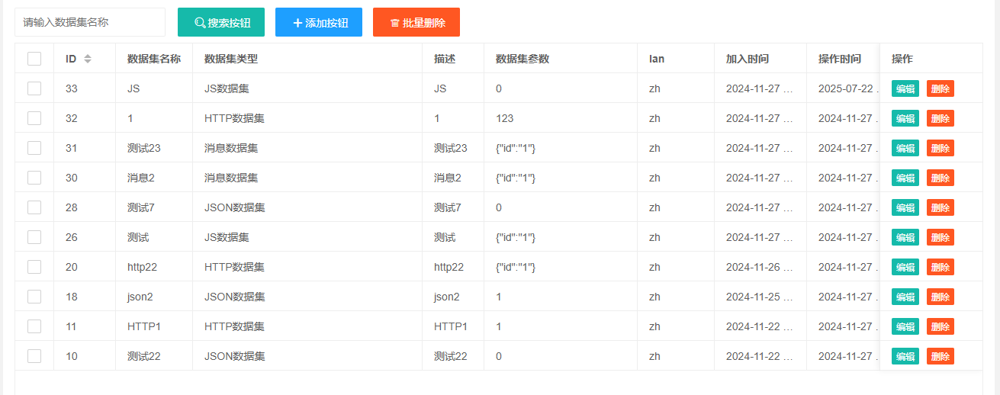
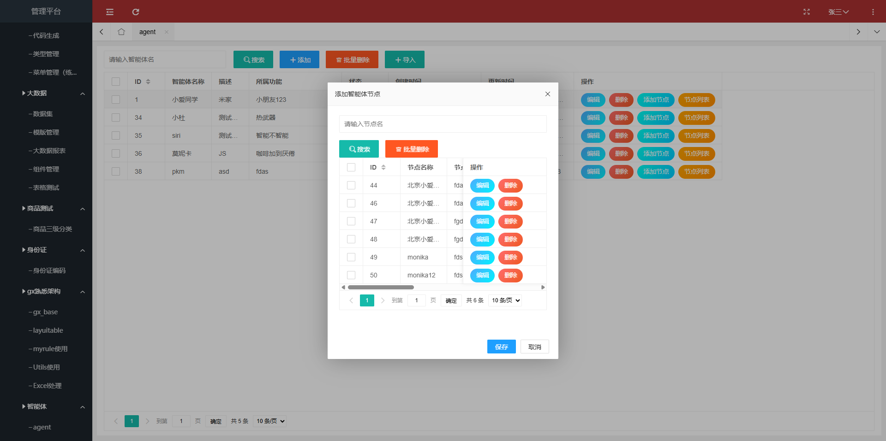

## 智能体练习

智能体开发
1).智能体表 w_agent
    id、名称、描述、所属功能
2).流程节点表 w_agent_node
    id、智能体id、名称、描述、类型、url、parent节点id


页面类似：



表的创建：
按照创建表的规范


智能体表   w_agent


流程节点表   w_agent_node


## 实现步骤

1. 添加相应的菜单   完成

2. 添加相应的页面  完成

3. 创建相应的表

   ```postgresql
   CREATE TABLE "public"."w_agent" (
       id int4 NOT NULL PRIMARY KEY,
       name VARCHAR(255) NOT NULL COMMENT '智能体名称',
       description TEXT COMMENT '智能体描述',
       function_type VARCHAR(100) COMMENT '所属功能类型',
       created_at TIMESTAMP DEFAULT CURRENT_TIMESTAMP,
       updated_at TIMESTAMP DEFAULT CURRENT_TIMESTAMP,
       isdel int2 DEFAULT 0 COMMENT '是否删除：0-未删除，1-已删除'
   );
   
   -- 流程节点表
   CREATE TABLE "public"."w_agent_node" (
       id int4 PRIMARY KEY,
       agent_id int4 NOT NULL,
       name VARCHAR(255) NOT NULL COMMENT '节点名称',
       description TEXT COMMENT '节点描述',
       type VARCHAR(50) NOT NULL COMMENT '节点类型',
       url VARCHAR(500) COMMENT '节点URL',
       parent_node_id INTEGER COMMENT '父节点ID',
       isdel int2 DEFAULT 0 COMMENT '是否删除：0-未删除，1-已删除',
       created_at TIMESTAMP DEFAULT CURRENT_TIMESTAMP,
       updated_at TIMESTAMP DEFAULT CURRENT_TIMESTAMP
   );
   ```


## 目前效果：



智能体的搜索、添加、编辑、删除、添加节点功能没问题

查看对应智能体的节点列表使用layuitable 存在一丢小问题

- 使用layuitable的原因是如果节点很多的话，使用selectjson 很难写那些分页
- 但是貌似不能请求接口的时候就携带参数，，，，，，如果需要该如何实现？或者说有什么好的替代方案吗？
- 点击完提交之后没有关闭模态框(bug)


## 明天待做

1. **如何批量删除 也就是拿到对应的id数组  然后慢慢删除**

2. **完成节点的编辑和删除操作**

3. 是否考虑需要新起一个页面用于单独节点的展示

   因为一个节点可能是很多个节点的父节点  考虑使用treeTable

4. 解决所有留下的bug   最后给李总看一下最后的效果

5. 节点都编辑完成后，生成画流程图插件https://g6.antv.antgroup.com/examples


