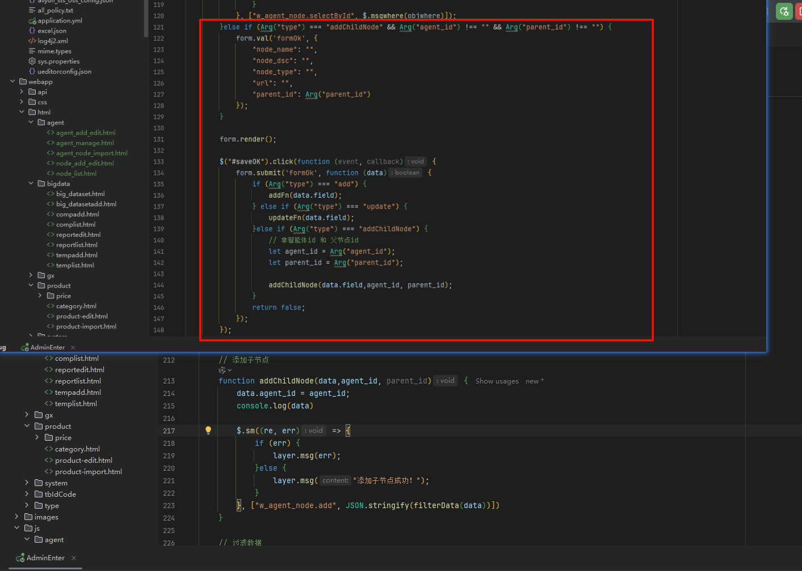

## 之前所完成的

之前已经完成了力导图和流程图，但是后面需要的是HTML节点

之前的代码：

```js
/**
 * 作者：gongxi
 * 时间：2025-08-07
 * 更新：添加节点关系图功能
 */
require.config({
    paths: {
        jquery: '../../sys/jquery',
        system: '../../sys/system',
        layui: "../../layui-btkj/layui",
        layuicommon: "../../sys/layuicommon",
        // 添加 AntV G6 依赖
        g6: "https://gw.alipayobjects.com/os/lib/antv/g6/4.8.20/dist/g6.min"
    },
    shim: {
        "system": {
            deps: ["jquery"]
        },
        "layui": {
            deps: ["jquery", "system"]
        },
        "layuicommon": {
            deps: ["jquery", "layui"]
        },
        "g6": {
            deps: ["jquery"]
        }
    },
    waitSeconds: 0
});

objdata = {
    nodelist: {},
    nodeRelationData: null, // 存储关系图数据 力导图
    nodeRelationDataDagre: null // 存储关系图数据 dagre
};

require(["jquery", "system", "layui", "g6"], function () {
    layui.use(['table', 'form','layer'], function () {
        var agentId = Arg("id");
        let layer = jQuery.getparent().layer;
        var table = layui.table;

        initNodeTable(agentId);

        $("#searchNode").click(function () {
            var search = $("#nodeName").val();
            objwhere.node_name = [search];

            layui.table.reload('nodeTable', {
                where: {
                    swhere: $.msgwhere(objwhere),
                    fields: 'id',
                    types: 'asc'
                },
                page: {
                    curr: 1
                }
            });
        })

        $("#delNodeBatchBtn").click(function () {
            let delList = [];
            let checkStatus = table.checkStatus('nodeTable');
            checkStatus.data.forEach((item) => {
                delList.push(item.id);
            });
            if(delList.length === 0){
                layer.msg("请选择要删除的项");
            }
            layer.confirm('请确认是否删除选中数据?', function (index) {
                layer.close(index);
                $.sm((re, err) => {
                    if (err) {
                        layer.msg(err);
                    } else {
                        layer.msg("删除成功！");
                        table.reload('nodeTable');
                    }
                }, ["w_agent_node.update", JSON.stringify({
                    isdel: "1"
                }), $.msgwhere({ids: $.msgpJoin(delList)})]);
            })
        })
    })

    function initNodeTable(id) {

        let table = layui.table;
        let isFirstLoad = true;

        objwhere = {};
        objwhere.agent_id = [id];

        table.render({
            elem: '#nodeTable',
            url: encodeURI($.layurl + "?" + $.getSmStr(["w_agent_node.selectByAgentId"])),
            width: 'full-120',
            page: true,
            where: {
                fields: 'id',
                types: 'asc'
            },
            cols: [[
                {type: 'checkbox'},
                {field: 'id', width: 80, title: 'ID', sort: true},
                {field: 'node_name', width: 100, title: '节点名称'},
                {field: 'node_type', width: 90, title: '节点类型', templet: "#node_typeTpl"},
                {field: 'node_dsc', title: '节点描述', width: 200},
                { field: 'parent_id', title: '父节点', width: 100},
                { field: 'url', title: 'url', width: 100},
                { field: 'status', title: '状态', width: 100, templet: "#statusTpl"},
                { field: 'created_time', title: '创建时间', width: 200},
                { field: 'altime', title: '更新时间', width: 200},
                {fixed: 'right', title: '操作', width: 150, minWidth: 100, templet:'#node_handle'}
            ]],
            even: true, // 开启隔行背景
            limits: [10, 30, 50, 80, 120],
            limit: 10, // 默认每页显示数量
            toolbar: '#toolbar', //工具栏
            defaultToolbar: ['filter', 'print', 'exports'], // 筛选  打印  导出

            done: function(res, curr, count) {
                if (isFirstLoad) {
                    isFirstLoad = false;

                    layui.table.reload('nodeTable', {
                        where: {
                            swhere: $.msgwhere(objwhere),
                            fields: 'id',
                            types: 'asc'
                        },
                        page: {
                            curr: 1
                        }
                    });
                } else {
                    /* TODO 1: 保存重新加载后的节点数据到 objdata.nodelist
                        存在的缺点  由于获取的是当前的数据 节点也只会展示当前数据的流程
                        如果需要一次就展示所有的关系
                     */
                    objdata.nodelist = res.data || [];

                    // 同时准备关系图数据 导向图
                    objdata.nodeRelationData = prepareRelationData(objdata.nodelist);

                    // dagre 流程图
                    objdata.nodeRelationDataDagre = prepareRelationDataDagre(objdata.nodelist);
                }

                table.on('tool(nodeTable)', function (obj) {
                    let nodeId = obj.data.id;
                    switch (obj.event){
                        case 'edit':{
                            nodeEdit(nodeId)
                            break;
                        }
                        case 'del':{
                            nodeDel(obj.data,nodeId)
                            break;
                        }
                    }
                })
            }
        });

    }

    function nodeEdit(nodeId) {
        var table = layui.table;
        var layer = jQuery.getparent().layer;
        jQuery.getparent().layer.open({
            type: 2,
            title: "编辑节点",
            shadeClose: false,
            area: ['500px', '600px'],
            content: 'html/agent/node_add_edit.html?v=' + Arg("v") + '&type=' + "update" + '&mid=' + Arg("mid") + "&id=" + nodeId,
            success: function (layero, index) {
            },
            btn: ["保存", "取消"],
            yes: function (index, layero) {
                let w = layero.find('iframe')[0].contentWindow;
                w.$("#saveOK").trigger("click", function () {
                    layer.close(index)
                    table.reload('nodeTable');
                });
            },
            no: function (index, layero) {
                layer.close(index);
                table.reload('nodeTable');
            }
        });
    }

    function nodeDel(data,nodeId) {
        var table = layui.table;
        layer.confirm('真的删除智能体节点--' + data.node_name + '吗？', function (index) {
            layer.close(index);
            $.sm((re, err) => {
                if (re) {
                    layer.msg("删除成功！");
                } else {
                    layer.msg(err);
                }
                table.reload('nodeTable');
            }, ["w_agent_node.update", JSON.stringify({
                isdel: "1"
            }), $.msgwhere({id: [nodeId]})]);
        });
    }


    // TODO 力导向图
    function prepareRelationData(nodeList) {
        if (!nodeList || nodeList.length === 0) {
            return { nodes: [], edges: [] };
        }

        const nodes = [];
        const edges = [];
        const nodeMap = new Map();

        // 创建节点映射
        nodeList.forEach(node => {
            nodeMap.set(node.id, node);
        });

        // 生成节点数据
        nodeList.forEach(node => {
            nodes.push({
                id: node.id.toString(),
                label: node.node_name || `节点${node.id}`,
                type: 'circle',
                size: 20, // 减小节点大小
                style: {
                    fill: getNodeColor(node.node_type),
                    stroke: '#666',
                    lineWidth: 1
                },
                labelCfg: {
                    style: {
                        fill: '#333',
                        fontSize: 10,
                        fontWeight: 'normal'
                    }
                },
                // 存储完整的节点信息用于显示详情
                nodeData: node
            });
        });

        // 生成边数据（基于parent_id关系）
        nodeList.forEach(node => {
            if (node.parent_id && node.parent_id !== '0' && nodeMap.has(parseInt(node.parent_id))) {
                edges.push({
                    source: node.parent_id.toString(),
                    target: node.id.toString(),
                    type: 'line',  // TODO 换为三次贝塞尔曲线  line  polyline  cubic  quadratic
                    style: {
                        stroke: '#666',
                        lineWidth: 2,
                        endArrow: {
                            path: 'M 0,0 L 8,4 L 8,-4 Z',
                            fill: '#666'
                        }
                    }
                });
            }
        });

        return { nodes, edges };
    }

    $("#nodeRelation").click(function () {

        if (!objdata.nodeRelationData || objdata.nodeRelationData.nodes.length === 0) {
            layer.msg('暂无节点数据，无法生成关系图');
            return;
        }
        // 动态加载 G6 库并创建关系图
        require(['g6'], function(G6) {
            createNodeRelationGraph(G6, objdata.nodeRelationData);
            // dagre 流程图
            // createNodeRelationGraphDagre(G6, objdata.nodeRelationDataDagre)
        });
    });

    // 创建节点关系图的函数
    function createNodeRelationGraph(G6, data) {
        const layer = jQuery.getparent().layer;

        // 创建弹窗显示关系图
        const layerIndex = layer.open({
            type: 1,
            title: '节点流程图',
            area: ['80%', '80%'],
            content: '<div id="nodeGraphContainer" style="width: 100%; height: 100%;"></div>',
            success: function(layero, index) {
                const container = layero.find('#nodeGraphContainer')[0];

                // 创建 G6 图实例
                const graph = new G6.Graph({
                    container: container,
                    width: container.clientWidth,
                    height: container.clientHeight,
                    plugins: [
                        {
                            type: 'watermark',  // 水印插件  但是版本较低下  用不了
                            text: 'NWBT',
                            textFontSize: 14,
                            textFontFamily: 'Microsoft YaHei',
                            fill: 'rgba(0, 0, 0, 0.1)',
                            rotate: Math.PI / 12,
                        },
                    ],
                    modes: {
                        default: [
                            'drag-canvas',   // 拖拽画布
                            'zoom-canvas',  // 缩放画布
                            'drag-node'  // 拖拽节点
                        ]
                    },
                    defaultNode: {
                        type: 'circle',
                        size: 30, // 减小默认节点大小
                        style: {
                            fill: '#5B8FF9',
                            stroke: '#5B8FF9',
                            lineWidth: 1
                        },
                        labelCfg: {
                            style: {
                                fill: '#333',
                                fontSize: 10
                            }
                        }
                    },
                    defaultEdge: {
                        type: 'polyline',
                        style: {
                            stroke: '#e2e2e2',
                            lineWidth: 1
                        }
                    },
                    layout: {
                        type: 'force',  // 使用力导图布局
                        preventOverlap: true,
                        linkDistance: 80, // 减小连接距离
                        nodeStrength: -100, // 调整节点斥力
                        edgeStrength: 0.3,
                        collideStrength: 0.8,
                        alpha: 0.8,
                        alphaDecay: 0.028,
                        alphaMin: 0.01,
                        forceSimulation: null,
                        center: [container.clientWidth / 2, container.clientHeight / 2] // 设置布局中心点
                    },
                    fitView: true, // 自动适应视口
                    fitViewPadding: [20, 20, 20, 20] // 设置边距
                });

                // 绑定节点点击事件
                graph.on('node:click', (e) => {
                    const nodeData = e.item.getModel().nodeData;
                    showNodeDetail(nodeData);
                });

                // 渲染数据
                graph.data(data);
                graph.render();

                // 延迟执行自适应画布，确保布局完成
                setTimeout(() => {
                    graph.fitView(20); // 添加20px的边距
                    graph.fitCenter(); // 确保图形在画布中心
                }, 500);

                // 窗口大小改变时重新调整
                window.addEventListener('resize', () => {
                    if (!graph || graph.destroyed) return;
                    if (!container || !container.scrollWidth || !container.scrollHeight) return;
                    graph.changeSize(container.scrollWidth, container.scrollHeight);
                });
            },
            end: function() {
                // 清理资源
                if (window.nodeGraph && !window.nodeGraph.destroyed) {
                    window.nodeGraph.destroy();
                    window.nodeGraph = null;
                }
            }
        });

    }

    // TODO dagre流程图
    function prepareRelationDataDagre(nodeList) {
        if (!nodeList || nodeList.length === 0) {
            return { nodes: [], edges: [] };
        }

        const nodes = [];
        const edges = [];
        const nodeMap = new Map();

        // 创建节点映射
        nodeList.forEach(node => {
            nodeMap.set(node.id, node);
        });

        // 生成节点数据 - 针对Dagre布局优化
        nodeList.forEach(node => {
            nodes.push({
                id: node.id.toString(),
                label: node.node_name || `节点${node.id}`,
                type: 'rect', // 使用矩形节点
                size: [100, 50], // [width, height] - 适合流程图的大小
                style: {
                    fill: getNodeColor(node.node_type),
                    stroke: '#666',
                    lineWidth: 1,
                    radius: 6 // 圆角
                },
                labelCfg: {
                    style: {
                        fill: '#fff',
                        fontSize: 11,
                        fontWeight: 'bold',
                        textAlign: 'center',
                        textBaseline: 'middle'
                    }
                },
                // 存储完整的节点信息用于显示详情
                nodeData: node
            });
        });

        // 生成边数据（基于parent_id关系）
        nodeList.forEach(node => {
            if (node.parent_id && node.parent_id !== '0' && nodeMap.has(parseInt(node.parent_id))) {
                edges.push({
                    source: node.parent_id.toString(),
                    target: node.id.toString(),
                    type: 'cubic', // 使用折线边  TODO  使用贝塞尔曲线
                    style: {
                        stroke: '#666',
                        lineWidth: 2,
                        endArrow: {
                            path: 'M 0,0 L 10,4 L 10,-4 Z',
                            fill: '#666'
                        }
                    }
                });
            }
        });

        return { nodes, edges };
    }

    $("#nodeRelationDagre").click(function () {
        if (!objdata.nodeRelationDataDagre || objdata.nodeRelationDataDagre.nodes.length === 0) {
            layer.msg('暂无节点数据，无法生成关系图');
            return;
        }
        // 动态加载 G6 库并创建关系图
        require(['g6'], function(G6) {

            createNodeRelationGraphDagre(G6, objdata.nodeRelationDataDagre)
        });
    });

    function createNodeRelationGraphDagre(G6, data) {
        const layer = jQuery.getparent().layer;

        console.log(data);
        // 创建弹窗显示关系图
        const layerIndex = layer.open({
            type: 1,
            title: '节点流程图',
            area: ['80%', '80%'],
            content: '<div id="nodeGraphContainer" style="width: 100%; height: 100%;"></div>',
            success: function(layero, index) {
                const container = layero.find('#nodeGraphContainer')[0];

                // 创建 G6 图实例 - 使用Dagre布局
                const graph = new G6.Graph({
                    container: container,
                    width: container.clientWidth,
                    height: container.clientHeight,
                    modes: {
                        default: [
                            'drag-canvas',   // 拖拽画布
                            'zoom-canvas',  // 缩放画布
                            'drag-node'  // 拖拽节点
                        ]
                    },
                    defaultNode: {
                        type: 'rect', // 改为矩形节点，更适合流程图
                        size: [80, 40], // [width, height]
                        style: {
                            fill: '#5B8FF9',
                            stroke: '#5B8FF9',
                            lineWidth: 1,
                            radius: 4 // 圆角
                        },
                        labelCfg: {
                            style: {
                                fill: '#fff',
                                fontSize: 10,
                                fontWeight: 'bold'
                            }
                        }
                    },
                    //
                    defaultEdge: {
                        type: 'simple-arrow', // 使用折线，更适合流程图
                        style: {
                            stroke: '#666',
                            lineWidth: 2,
                            endArrow: {
                                path: 'M 0,0 L 8,4 L 8,-4 Z',
                                fill: '#666'
                            }
                        }
                    },

                    layout: {
                        type: 'dagre',
                        // rankdir: 'TB', // 从上到下的方向 (Top to Bottom)
                        rankdir: 'LR', // 如果需要从左到右，可以改为 'LR' (Left to Right)
                        align: 'UL', // 对齐方式：UL(上左), UR(上右), DL(下左), DR(下右)
                        nodesep: 20,
                        ranksep: 50, // 不同层级间距
                        controlPoints: true // 启用控制点
                    },
                    fitView: true, // 自动适应视口
                    fitViewPadding: [20, 20, 20, 20] // 设置边距
                });

                // 绑定节点点击事件
                graph.on('node:click', (e) => {
                    const nodeData = e.item.getModel().nodeData;
                    showNodeDetail(nodeData);
                });

                // 渲染数据
                graph.data(data);
                graph.render();

                // 延迟执行自适应画布，确保布局完成
                setTimeout(() => {
                    graph.fitView(20); // 添加20px的边距
                    graph.fitCenter(); // 确保图形在画布中心
                }, 500);

                // 窗口大小改变时重新调整
                window.addEventListener('resize', () => {
                    if (!graph || graph.destroyed) return;
                    if (!container || !container.scrollWidth || !container.scrollHeight) return;
                    graph.changeSize(container.scrollWidth, container.scrollHeight);
                });
            },
            end: function() {
                // 清理资源
                if (window.nodeGraph && !window.nodeGraph.destroyed) {
                    window.nodeGraph.destroy();
                    window.nodeGraph = null;
                }
            }
        });
    }


    // 根据节点类型返回不同颜色
    function getNodeColor(nodeType) {
        const colors = {
            '1': '#52c41a',     // 绿色 - 开始节点
            '2': '#1890ff',   // 蓝色 - 处理节点
            '3': '#fa8c16',  // 橙色 - 决策节点
            '4': '#f5222d',       // 红色 - 结束节点
            '5': '#722ed1'    // 紫色 - 默认
        };
        return colors[nodeType] || colors['5'];
    }

    // 显示节点详情
    function showNodeDetail(nodeData) {
        const layer = jQuery.getparent().layer;

        const content = `
            <div style="padding: 20px;">
                <table class="layui-table" lay-size="sm">
                    <tr><td><strong>节点ID：</strong></td><td>${nodeData.id}</td></tr>
                    <tr><td><strong>节点名称：</strong></td><td>${nodeData.node_name || '未命名'}</td></tr>
                    <tr><td><strong>节点类型：</strong></td><td>${nodeData.node_type || '未知'}</td></tr>
                    <tr><td><strong>节点描述：</strong></td><td>${nodeData.node_dsc || '无描述'}</td></tr>
                    <tr><td><strong>父节点：</strong></td><td>${nodeData.parent_id || '无'}</td></tr>
                    <tr><td><strong>URL：</strong></td><td>${nodeData.url || '无'}</td></tr>
                    <tr><td><strong>状态：</strong></td><td>${nodeData.status === 0 ?'正常':'停用'}</td></tr>
                    <tr><td><strong>创建时间：</strong></td><td>${nodeData.created_time || '未知'}</td></tr>
                    <tr><td><strong>更新时间：</strong></td><td>${nodeData.altime || '未知'}</td></tr>
                </table>
            </div>
        `;

        layer.open({
            type: 1,
            title: '节点详情',
            area: ['500px', '400px'],
            content: content,
            btn: ['编辑', '关闭'],
            yes: function(index) {
                layer.close(index);
                nodeEdit(nodeData.id);
            }
        });
    }

});
```

## HTML节点 初版

替换为HTML节点形式，可以为相应的节点添加子节点

效果：点击相应的节点可以查看详情和添加子节点


修改后的版本，能直接添加相应的节点

### 代码部分：

node_list.js  修复bug

```js
/**
 * 作者：gongxi
 * 时间：2025-08-07
 * 更新：添加节点关系图功能 - 使用dagre布局和HTML节点操作
 * 优化：自动刷新图表、改善线条清晰度
 */
require.config({
    paths: {
        jquery: '../../sys/jquery',
        system: '../../sys/system',
        layui: "../../layui-btkj/layui",
        layuicommon: "../../sys/layuicommon",
        // 添加 AntV G6 依赖
        g6: "https://gw.alipayobjects.com/os/lib/antv/g6/4.8.20/dist/g6.min"
    },
    shim: {
        "system": {
            deps: ["jquery"]
        },
        "layui": {
            deps: ["jquery", "system"]
        },
        "layuicommon": {
            deps: ["jquery", "layui"]
        },
        "g6": {
            deps: ["jquery"]
        }
    },
    waitSeconds: 0
});

objdata = {
    nodelist: {},
    agent_id: null,  // 存储添加子节点时候的智能体id
    nodeRelationDataHTML: null,  // 使用html节点
    currentGraph: null  // 存储当前的图表实例
};

require(["jquery", "system", "layui", "g6"], function () {
    layui.use(['table', 'form','layer'], function () {

        let layer = jQuery.getparent().layer;
        var table = layui.table;

        objdata.agent_id = Arg("id");  // TODO存储添加子节点时候的智能体id

        initNodeTable(objdata.agent_id);

        $("#searchNode").click(function () {
            var search = $("#nodeName").val();
            objwhere.node_name = [search];

            layui.table.reload('nodeTable', {
                where: {
                    swhere: $.msgwhere(objwhere),
                    fields: 'id',
                    types: 'asc'
                },
                page: {
                    curr: 1
                }
            });
        })

        $("#delNodeBatchBtn").click(function () {
            let delList = [];
            let checkStatus = table.checkStatus('nodeTable');
            checkStatus.data.forEach((item) => {
                delList.push(item.id);
            });
            if(delList.length === 0){
                layer.msg("请选择要删除的项");
            }
            layer.confirm('请确认是否删除选中数据?', function (index) {
                layer.close(index);
                $.sm((re, err) => {
                    if (err) {
                        layer.msg(err);
                    } else {
                        layer.msg("删除成功！");
                        table.reload('nodeTable');
                        // 如果有打开的图表，自动刷新
                        refreshCurrentGraph();
                    }
                }, ["w_agent_node.update", JSON.stringify({
                    isdel: "1"
                }), $.msgwhere({ids: $.msgpJoin(delList)})]);
            })
        })
    })

    function initNodeTable(id) {

        let table = layui.table;
        let isFirstLoad = true;

        objwhere = {};
        objwhere.agent_id = [id];

        table.render({
            elem: '#nodeTable',
            url: encodeURI($.layurl + "?" + $.getSmStr(["w_agent_node.selectByAgentId"])),
            width: 'full-120',
            page: true,
            where: {
                fields: 'id',
                types: 'asc'
            },
            cols: [[
                {type: 'checkbox'},
                {field: 'id', width: 80, title: 'ID', sort: true},
                {field: 'node_name', width: 100, title: '节点名称'},
                {field: 'node_type', width: 90, title: '节点类型', templet: "#node_typeTpl"},
                {field: 'node_dsc', title: '节点描述', width: 200},
                { field: 'parent_id', title: '父节点', width: 100},
                { field: 'url', title: 'url', width: 100},
                { field: 'status', title: '状态', width: 100, templet: "#statusTpl"},
                { field: 'created_time', title: '创建时间', width: 200},
                { field: 'altime', title: '更新时间', width: 200},
                {fixed: 'right', title: '操作', width: 150, minWidth: 100, templet:'#node_handle'}
            ]],
            even: true, // 开启隔行背景
            limits: [10, 30, 50, 80, 120],
            limit: 10, // 默认每页显示数量
            toolbar: '#toolbar', //工具栏
            defaultToolbar: ['filter', 'print', 'exports'], // 筛选  打印  导出

            done: function(res, curr, count) {
                if (isFirstLoad) {
                    isFirstLoad = false;

                    layui.table.reload('nodeTable', {
                        where: {
                            swhere: $.msgwhere(objwhere),
                            fields: 'id',
                            types: 'asc'
                        },
                        page: {
                            curr: 1
                        }
                    });
                } else {
                    /* TODO 1: 保存重新加载后的节点数据到 objdata.nodelist
                        存在的缺点  由于获取的是当前的数据 节点也只会展示当前数据的流程
                        如果需要一次就展示所有的关系
                     */
                    objdata.nodelist = res.data || [];

                    objdata.nodeRelationDataHTML = prepareRelationDataHTML(objdata.nodelist);

                    // 如果有打开的图表，自动刷新
                    refreshCurrentGraph();
                }

                table.on('tool(nodeTable)', function (obj) {
                    let nodeId = obj.data.id;
                    switch (obj.event){
                        case 'edit':{
                            nodeEdit(nodeId)
                            break;
                        }
                        case 'del':{
                            nodeDel(obj.data,nodeId)
                            break;
                        }
                    }
                })
            }
        });

    }

    function nodeEdit(nodeId) {
        var table = layui.table;
        var layer = jQuery.getparent().layer;
        jQuery.getparent().layer.open({
            type: 2,
            title: "编辑节点",
            shadeClose: false,
            area: ['500px', '600px'],
            content: 'html/agent/node_add_edit.html?v=' + Arg("v") + '&type=' + "update" + '&mid=' + Arg("mid") + "&id=" + nodeId,
            success: function (layero, index) {
            },
            btn: ["保存", "取消"],
            yes: function (index, layero) {
                let w = layero.find('iframe')[0].contentWindow;
                w.$("#saveOK").trigger("click", function () {
                    layer.close(index)
                    // table.reload('nodeTable');
                    initNodeTable(objdata.agent_id)
                    // 编辑后也刷新图表
                    refreshCurrentGraph();
                });
            },
            no: function (index, layero) {
                layer.close(index);
                table.reload('nodeTable');
            }
        });
    }

    function nodeDel(data,nodeId) {
        var table = layui.table;
        layer.confirm('真的删除智能体节点--' + data.node_name + '吗？', function (index) {
            layer.close(index);
            $.sm((re, err) => {
                if (re) {
                    layer.msg("删除成功！");
                } else {
                    layer.msg(err);
                }
                table.reload('nodeTable');
                // 删除后刷新图表
                refreshCurrentGraph();
            }, ["w_agent_node.update", JSON.stringify({
                isdel: "1"
            }), $.msgwhere({id: [nodeId]})]);
        });
    }

    // 添加子节点函数 - 优化版本，添加成功后自动刷新图表
    function addChildNode(parentId, parentName) {
        var layer = jQuery.getparent().layer;
        var table = layui.table;

        layer.open({
            type: 2,
            title: `为节点 "${parentName}" 添加子节点`,
            shadeClose: false,
            area: ['500px', '600px'],
            content: 'html/agent/node_add_edit.html?v=' + Arg("v") + '&type=addChildNode&mid=' + Arg("mid") + '&parent_id=' + parentId + '&agent_id=' + objdata.agent_id,
            success: function (layero, index) {
                // 可以在这里设置默认的父节点ID
            },
            btn: ["保存", "取消"],
            yes: function (index, layero) {
                let w = layero.find('iframe')[0].contentWindow;
                w.$("#saveOK").trigger("click", function () {
                    layer.close(index);
                    // 重新加载表格数据
                    table.reload('nodeTable');
                    layer.msg("子节点添加成功！");

                    // 延迟刷新图表，确保数据已更新
                    setTimeout(() => {
                        refreshCurrentGraph();
                    }, 500);
                });
            },
            no: function (index, layero) {
                layer.close(index);
            }
        });
    }

    // 刷新当前图表的函数
    function refreshCurrentGraph() {
        if (objdata.currentGraph && !objdata.currentGraph.destroyed) {
            const newData = prepareRelationDataHTML(objdata.nodelist);
            objdata.currentGraph.changeData(newData);

            // 使用更平滑的动画和布局
            setTimeout(() => {
                objdata.currentGraph.layout();
                objdata.currentGraph.fitView(30);
            }, 300);
        }
    }

    // TODO html节点
    function prepareRelationDataHTML(nodeList){
        if (!nodeList || nodeList.length === 0) {
            return { nodes: [], edges: [] };
        }

        const nodes = [];
        const edges = [];
        const nodeMap = new Map();

        // 创建节点映射
        nodeList.forEach(node => {
            nodeMap.set(node.id, node);
        });

        // 生成节点数据 - 使用HTML节点
        nodeList.forEach(node => {
            nodes.push({
                id: node.id.toString(),
                label: node.node_name || `节点${node.id}`,
                type: 'html-node', // 使用自定义HTML节点类型
                size: [160, 100], // [width, height] - HTML节点需要指定大小
                style: {
                    fill: 'transparent', // HTML节点背景透明
                    stroke: 'transparent'
                },
                // 存储完整的节点信息用于显示详情和HTML渲染
                nodeData: node
            });
        });

        // 生成边数据（基于parent_id关系）
        nodeList.forEach(node => {
            if (node.parent_id && node.parent_id !== '0' && nodeMap.has(parseInt(node.parent_id))) {
                edges.push({
                    source: node.parent_id.toString(),
                    target: node.id.toString(),
                    type: 'cubic-horizontal', // 改为水平贝塞尔曲线，更平滑
                    style: {
                        stroke: '#1890ff',
                        lineWidth: 2,
                        strokeOpacity: 0.8,
                        endArrow: {
                            path: 'M 0,0 L 8,4 L 8,-4 Z',
                            fill: '#1890ff',
                            strokeOpacity: 1
                        }
                    }
                });
            }
        });

        return { nodes, edges };
    }

    $("#nodeRelationHTML").click(function () {
        if (!objdata.nodeRelationDataHTML || objdata.nodeRelationDataHTML.nodes.length === 0) {
            layer.msg('暂无节点数据，无法生成关系图');
            return;
        }
        // 动态加载 G6 库并创建关系图
        require(['g6'], function(G6) {
            createNodeRelationGraphHTML(G6, objdata.nodeRelationDataHTML)
        });
    });

    function createNodeRelationGraphHTML(G6, data){
        const layer = jQuery.getparent().layer;

        // 创建弹窗显示关系图
        const layerIndex = layer.open({
            type: 1,
            title: '节点流程图',
            area: ['90%', '90%'],
            content: `
                <div style="width: 100%; height: 100%; position: relative;">
                    <div style="position: absolute; top: 10px; right: 10px; z-index: 1000;">
                        <button id="refreshGraphBtn" class="layui-btn layui-btn-primary layui-btn-sm">
                            <i class="layui-icon layui-icon-refresh"></i> 刷新
                        </button>
                        <button id="fitGraphBtn" class="layui-btn layui-btn-primary layui-btn-sm">
                            <i class="layui-icon layui-icon-shrink-right"></i> 适应画布
                        </button>
                        <button id="resetLayoutBtn" class="layui-btn layui-btn-primary layui-btn-sm">
                            <i class="layui-icon layui-icon-template"></i> 重置布局
                        </button>
                    </div>
                    <div id="nodeGraphContainer" style="width: 100%; height: 100%; background: #fafafa;"></div>
                </div>
            `,
            success: function(layero, index) {
                const container = layero.find('#nodeGraphContainer')[0];

                // 注册自定义HTML节点
                G6.registerNode('html-node', {
                    draw(cfg, group) {
                        const nodeData = cfg.nodeData;
                        const size = cfg.size || [160, 100];
                        const width = size[0];
                        const height = size[1];

                        // 创建外部容器
                        const rect = group.addShape('rect', {
                            attrs: {
                                x: -width / 2,
                                y: -height / 2,
                                width: width,
                                height: height,
                                fill: getNodeColor(nodeData.node_type),
                                stroke: '#666',
                                strokeWidth: 1,
                                radius: 8,
                                cursor: 'pointer',
                                shadowColor: 'rgba(0,0,0,0.15)',
                                shadowBlur: 6,
                                shadowOffsetX: 2,
                                shadowOffsetY: 2
                            },
                            name: 'main-rect'
                        });

                        // 添加节点标题
                        group.addShape('text', {
                            attrs: {
                                x: 0,
                                y: -25,
                                text: cfg.label,
                                fontSize: 14,
                                fontWeight: 'bold',
                                fill: '#fff',
                                textAlign: 'center',
                                textBaseline: 'middle',
                                cursor: 'pointer'
                            },
                            name: 'title-text'
                        });

                        // 添加节点类型标签
                        const nodeTypeText = getNodeTypeText(nodeData.node_type);
                        group.addShape('rect', {
                            attrs: {
                                x: -width/2 + 5,
                                y: -height/2 + 5,
                                width: 45,
                                height: 18,
                                fill: 'rgba(255,255,255,0.2)',
                                radius: 3,
                                cursor: 'pointer'
                            },
                            name: 'type-bg'
                        });

                        group.addShape('text', {
                            attrs: {
                                x: -width/2 + 27.5,
                                y: -height/2 + 14,
                                text: nodeTypeText,
                                fontSize: 10,
                                fill: '#fff',
                                textAlign: 'center',
                                textBaseline: 'middle',
                                cursor: 'pointer'
                            },
                            name: 'type-text'
                        });

                        // 添加状态指示器
                        const statusColor = nodeData.status === 0 ? '#52c41a' : '#f5222d';
                        const statusText = nodeData.status === 0 ? '正常' : '停用';
                        group.addShape('circle', {
                            attrs: {
                                x: width / 2 - 15,
                                y: -height / 2 + 15,
                                r: 6,
                                fill: statusColor,
                                stroke: '#fff',
                                strokeWidth: 2,
                                cursor: 'pointer'
                            },
                            name: 'status-circle'
                        });

                        // 如果有描述，添加描述文本
                        if (nodeData.node_dsc) {
                            const desc = nodeData.node_dsc.length > 16
                                ? nodeData.node_dsc.substring(0, 16) + '...'
                                : nodeData.node_dsc;
                            group.addShape('text', {
                                attrs: {
                                    x: 0,
                                    y: 5,
                                    text: desc,
                                    fontSize: 11,
                                    fill: '#fff',
                                    textAlign: 'center',
                                    textBaseline: 'middle',
                                    opacity: 0.9,
                                    cursor: 'pointer'
                                },
                                name: 'desc-text'
                            });
                        }

                        // 添加操作按钮
                        const addBtnGroup = group.addGroup({
                            name: 'add-btn-group'
                        });

                        // 添加子节点按钮背景
                        addBtnGroup.addShape('rect', {
                            attrs: {
                                x: -width/2 + 5,
                                y: height/2 - 25,
                                width: 60,
                                height: 20,
                                fill: 'rgba(255,255,255,0.2)',
                                stroke: '#fff',
                                strokeWidth: 1,
                                radius: 3,
                                cursor: 'pointer',
                                opacity: 0.8
                            },
                            name: 'add-btn-bg'
                        });

                        // 添加子节点按钮文本
                        addBtnGroup.addShape('text', {
                            attrs: {
                                x: -width/2 + 35,
                                y: height/2 - 15,
                                text: '+ 子节点',
                                fontSize: 10,
                                fill: '#fff',
                                textAlign: 'center',
                                textBaseline: 'middle',
                                cursor: 'pointer'
                            },
                            name: 'add-btn-text'
                        });

                        // 查看详情按钮
                        const detailBtnGroup = group.addGroup({
                            name: 'detail-btn-group'
                        });

                        detailBtnGroup.addShape('rect', {
                            attrs: {
                                x: width/2 - 50,
                                y: height/2 - 25,
                                width: 45,
                                height: 20,
                                fill: 'rgba(255,255,255,0.2)',
                                stroke: '#fff',
                                strokeWidth: 1,
                                radius: 3,
                                cursor: 'pointer',
                                opacity: 0.8
                            },
                            name: 'detail-btn-bg'
                        });

                        detailBtnGroup.addShape('text', {
                            attrs: {
                                x: width/2 - 27.5,
                                y: height/2 - 15,
                                text: '详情',
                                fontSize: 10,
                                fill: '#fff',
                                textAlign: 'center',
                                textBaseline: 'middle',
                                cursor: 'pointer'
                            },
                            name: 'detail-btn-text'
                        });

                        return rect;
                    },

                    // 更新节点
                    update(cfg, item) {
                        const group = item.getContainer();
                        const nodeData = cfg.nodeData;

                        // 更新主要形状颜色
                        const rect = group.find(element => element.get('name') === 'main-rect');
                        if (rect) {
                            rect.attr('fill', getNodeColor(nodeData.node_type));
                        }

                        // 更新标题文本
                        const titleText = group.find(element => element.get('name') === 'title-text');
                        if (titleText) {
                            titleText.attr('text', cfg.label);
                        }

                        // 更新类型文本
                        const typeText = group.find(element => element.get('name') === 'type-text');
                        if (typeText) {
                            typeText.attr('text', getNodeTypeText(nodeData.node_type));
                        }

                        // 更新状态
                        const statusCircle = group.find(element => element.get('name') === 'status-circle');
                        if (statusCircle) {
                            const statusColor = nodeData.status === 0 ? '#52c41a' : '#f5222d';
                            statusCircle.attr('fill', statusColor);
                        }

                        // 更新描述文本
                        const descText = group.find(element => element.get('name') === 'desc-text');
                        if (descText && nodeData.node_dsc) {
                            const desc = nodeData.node_dsc.length > 16
                                ? nodeData.node_dsc.substring(0, 16) + '...'
                                : nodeData.node_dsc;
                            descText.attr('text', desc);
                        }
                    }
                });

                // 创建 G6 图实例 - 优化配置
                const graph = new G6.Graph({
                    container: container,
                    width: container.clientWidth,
                    height: container.clientHeight,
                    renderer: 'canvas', // 明确指定使用canvas渲染器
                    pixelRatio: window.devicePixelRatio || 2, // 支持高清屏
                    modes: {
                        default: [
                            'drag-canvas',   // 拖拽画布
                            'zoom-canvas',  // 缩放画布
                            'drag-node'     // 拖拽节点
                        ]
                    },
                    defaultNode: {
                        type: 'html-node', // 使用自定义的HTML节点
                        size: [160, 100],  // 设置大小  长  宽
                        style: {
                            fill: 'transparent',
                            stroke: 'transparent'
                        }
                    },
                    defaultEdge: {
                        type: 'cubic-horizontal',
                        style: {
                            stroke: '#1890ff',
                            lineWidth: 2,
                            strokeOpacity: 0.8,
                            endArrow: {
                                path: 'M 0,0 L 8,4 L 8,-4 Z',
                                fill: '#1890ff',
                                strokeOpacity: 1
                            }
                        }
                    },
                    layout: {
                        type: 'dagre', // 使用dagre布局
                        rankdir: 'TB', // 从上到下 (Top to Bottom)
                        align: 'DL',   // 对齐方式
                        nodesep: 60,   // 增加节点间距
                        ranksep: 100,  // 增加层级间距
                        controlPoints: true, // 启用控制点
                        sortByCombo: false
                    },
                    fitView: true,
                    fitViewPadding: [40, 40, 40, 40], // 增加边距
                    animate: true, // 启用动画
                    animateCfg: {
                        duration: 300,
                        easing: 'easeLinear'
                    }
                });

                // 存储图表实例
                objdata.currentGraph = graph;

                // 绑定节点点击事件 - 区分不同区域的点击
                graph.on('node:click', (e) => {
                    const nodeData = e.item.getModel().nodeData;
                    const shape = e.target;
                    const shapeName = shape.get('name');
                    const group = e.item.getContainer();

                    // 点击添加子节点按钮
                    if (shapeName === 'add-btn-bg' || shapeName === 'add-btn-text' ||
                        (group.find(element => element.get('name') === 'add-btn-group') &&
                            group.find(element => element.get('name') === 'add-btn-group').contain(shape))) {
                        e.stopPropagation();
                        addChildNode(nodeData.id, nodeData.node_name);
                        return;
                    }

                    // 点击查看详情按钮
                    if (shapeName === 'detail-btn-bg' || shapeName === 'detail-btn-text' ||
                        (group.find(element => element.get('name') === 'detail-btn-group') &&
                            group.find(element => element.get('name') === 'detail-btn-group').contain(shape))) {
                        e.stopPropagation();
                        showNodeDetail(nodeData);
                        return;
                    }

                    // 默认显示节点详情
                    showNodeDetail(nodeData);
                });

                // 节点悬停效果 - 优化
                graph.on('node:mouseenter', (e) => {
                    const item = e.item;
                    const group = item.getContainer();
                    const rect = group.find(element => element.get('name') === 'main-rect');
                    if (rect) {
                        rect.attr('strokeWidth', 2);
                        rect.attr('stroke', '#1890ff');

                        // 高亮按钮
                        const addBtnGroup = group.find(element => element.get('name') === 'add-btn-group');
                        const detailBtnGroup = group.find(element => element.get('name') === 'detail-btn-group');
                        if (addBtnGroup) {
                            addBtnGroup.get('children').forEach(child => {
                                if (child.get('name') === 'add-btn-bg') {
                                    child.attr('opacity', 1);
                                    child.attr('fill', 'rgba(24, 144, 255, 0.3)');
                                }
                            });
                        }
                        if (detailBtnGroup) {
                            detailBtnGroup.get('children').forEach(child => {
                                if (child.get('name') === 'detail-btn-bg') {
                                    child.attr('opacity', 1);
                                    child.attr('fill', 'rgba(24, 144, 255, 0.3)');
                                }
                            });
                        }
                    }
                    graph.paint();
                });

                graph.on('node:mouseleave', (e) => {
                    const item = e.item;
                    const group = item.getContainer();
                    const rect = group.find(element => element.get('name') === 'main-rect');
                    if (rect) {
                        rect.attr('strokeWidth', 1);
                        rect.attr('stroke', '#666');

                        // 恢复按钮样式
                        const addBtnGroup = group.find(element => element.get('name') === 'add-btn-group');
                        const detailBtnGroup = group.find(element => element.get('name') === 'detail-btn-group');
                        if (addBtnGroup) {
                            addBtnGroup.get('children').forEach(child => {
                                if (child.get('name') === 'add-btn-bg') {
                                    child.attr('opacity', 0.8);
                                    child.attr('fill', 'rgba(255,255,255,0.2)');
                                }
                            });
                        }
                        if (detailBtnGroup) {
                            detailBtnGroup.get('children').forEach(child => {
                                if (child.get('name') === 'detail-btn-bg') {
                                    child.attr('opacity', 0.8);
                                    child.attr('fill', 'rgba(255,255,255,0.2)');
                                }
                            });
                        }
                    }
                    graph.paint();
                });

                // 渲染数据
                graph.data(data);
                graph.render();

                // 延迟执行自适应画布，确保布局完成
                setTimeout(() => {
                    graph.fitView(40);
                }, 800);

                // 绑定刷新按钮事件
                layero.find('#refreshGraphBtn').on('click', function() {
                    // 重新加载表格数据并刷新图表
                    layui.table.reload('nodeTable', {
                        done: function(res) {
                            objdata.nodelist = res.data || [];
                            const newData = prepareRelationDataHTML(objdata.nodelist);
                            graph.changeData(newData);
                            setTimeout(() => {
                                graph.layout();
                                graph.fitView(40);
                            }, 300);
                            layer.msg('图表已刷新');
                        }
                    });
                });

                // 绑定适应画布按钮事件
                layero.find('#fitGraphBtn').on('click', function() {
                    graph.fitView(40);
                    graph.fitCenter();
                });

                // 绑定重置布局按钮事件
                layero.find('#resetLayoutBtn').on('click', function() {
                    graph.layout();
                    setTimeout(() => {
                        graph.fitView(40);
                    }, 500);
                    layer.msg('布局已重置');
                });

                // 窗口大小改变时重新调整
                const resizeHandler = () => {
                    if (!graph || graph.destroyed) return;
                    if (!container || !container.scrollWidth || !container.scrollHeight) return;
                    graph.changeSize(container.scrollWidth, container.scrollHeight);
                    graph.fitView(40);
                };

                window.addEventListener('resize', resizeHandler);

                // 保存清理函数
                layero.data('cleanup', () => {
                    window.removeEventListener('resize', resizeHandler);
                    // 清理图表实例引用
                    if (objdata.currentGraph === graph) {
                        objdata.currentGraph = null;
                    }
                });
            },
            end: function(layero) {
                // 清理资源
                if (graph && !graph.destroyed) {
                    graph.destroy();
                }

                // 执行额外的清理
                const cleanup = layero.data('cleanup');
                if (cleanup) {
                    cleanup();
                }
            }
        });
    }

    // 辅助函数：获取节点类型文本
    function getNodeTypeText(nodeType) {
        const typeMap = {
            '1': '开始节点',
            '2': '处理节点',
            '3': '决策节点',
            '4': '结束节点',
            '5': '其他'
        };
        return typeMap[nodeType] || '未知';
    }

    // 根据节点类型返回不同颜色
    function getNodeColor(nodeType) {
        const colors = {
            '1': '#52c41a',     // 绿色 - 开始节点
            '2': '#1890ff',     // 蓝色 - 处理节点
            '3': '#fa8c16',     // 橙色 - 决策节点
            '4': '#f5222d',     // 红色 - 结束节点
            '5': '#722ed1'      // 紫色 - 其他
        };
        return colors[nodeType] || colors['5'];
    }

    // 显示节点详情
    function showNodeDetail(nodeData) {
        const layer = jQuery.getparent().layer;

        const content = `
            <div style="padding: 20px;">
                <table class="layui-table" lay-size="sm">
                    <tr><td><strong>节点ID：</strong></td><td>${nodeData.id}</td></tr>
                    <tr><td><strong>节点名称：</strong></td><td>${nodeData.node_name || '未命名'}</td></tr>
                    <tr><td><strong>节点类型：</strong></td><td>${getNodeTypeText(nodeData.node_type)}</td></tr>
                    <tr><td><strong>节点描述：</strong></td><td>${nodeData.node_dsc || '无描述'}</td></tr>
                    <tr><td><strong>父节点：</strong></td><td>${nodeData.parent_id || '无'}</td></tr>
                    <tr><td><strong>URL：</strong></td><td>${nodeData.url || '无'}</td></tr>
                    <tr><td><strong>状态：</strong></td><td>${nodeData.status === 0 ? '正常' : '停用'}</td></tr>
                    <tr><td><strong>创建时间：</strong></td><td>${nodeData.created_time || '未知'}</td></tr>
                    <tr><td><strong>更新时间：</strong></td><td>${nodeData.altime || '未知'}</td></tr>
                </table>
            </div>
        `;

        layer.open({
            type: 1,
            title: '节点详情',
            area: ['500px', '450px'],
            content: content,
            btn: ['编辑节点', '关闭'],
            yes: function(index) {
                layer.close(index);
                nodeEdit(nodeData.id);
            }
        });
    }
});
```

node_add_edit.js添加部分



### 存在瑕疵

由于我们是在获取智能体对应的节点后才展示，而获取的过程是**使用layuitable，一次并不能获取到所有的数据，**就导致了添加新的节点后，如果存在的节点数量超过了一次获取的数据的页面数量，那么即使刷新了也不会显示相应的节点图，那就需要优化，在点击按钮之后获取智能体的所有节点，在对节点添加子节点的时候，需要刷新相应的table

## HTML节点  优化版本

**一次获取相应智能体所有的节点，添加完子节点后刷新表格，刷新G6图表**

效果：


### 代码部分

```js
/**
 * 作者：gongxi
 * 时间：2025-08-12
 * 更新：添加节点关系图功能 - 使用dagre布局和HTML节点操作
 * 优化：自动刷新图表、改善线条清晰度、解决TODO问题
 */
require.config({
    paths: {
        jquery: '../../sys/jquery',
        system: '../../sys/system',
        layui: "../../layui-btkj/layui",
        layuicommon: "../../sys/layuicommon",
        // 添加 AntV G6 依赖   版本太低  该如何迁移之高版本
        g6: "https://gw.alipayobjects.com/os/lib/antv/g6/4.8.20/dist/g6.min"
    },
    shim: {
        "system": {
            deps: ["jquery"]
        },
        "layui": {
            deps: ["jquery", "system"]
        },
        "layuicommon": {
            deps: ["jquery", "layui"]
        },
        "g6": {
            deps: ["jquery"]
        }
    },
    waitSeconds: 0
});

objdata = {
    nodelist: {},
    allNodeData: [], // 新增：存储所有节点数据
    agent_id: null,  // 存储添加子节点时候的智能体id
    nodeRelationDataHTML: null,  // 使用html节点
    currentGraph: null  // 存储当前的图表实例
};

require(["jquery", "system", "layui", "g6"], function () {
    layui.use(['table', 'form','layer'], function () {

        let layer = jQuery.getparent().layer;
        var table = layui.table;

        objdata.agent_id = Arg("id");  // 存储添加子节点时候的智能体id

        initNodeTable(objdata.agent_id);

        $("#searchNode").click(function () {
            var search = $("#nodeName").val();
            objwhere.node_name = [search];

            layui.table.reload('nodeTable', {
                where: {
                    swhere: $.msgwhere(objwhere),
                    fields: 'id',
                    types: 'asc'
                },
                page: {
                    curr: 1
                }
            });
        })

        $("#delNodeBatchBtn").click(function () {
            let delList = [];
            let checkStatus = table.checkStatus('nodeTable');
            checkStatus.data.forEach((item) => {
                delList.push(item.id);
            });
            if(delList.length === 0){
                layer.msg("请选择要删除的项");
                return;
            }
            layer.confirm('请确认是否删除选中数据?', function (index) {
                layer.close(index);
                $.sm((re, err) => {
                    if (err) {
                        layer.msg(err);
                    } else {
                        layer.msg("删除成功！");
                        table.reload('nodeTable');
                        // 删除后重新获取所有数据并刷新图表
                        loadAllNodeData().then(() => {
                            refreshCurrentGraph();
                        });
                    }
                }, ["w_agent_node.update", JSON.stringify({
                    isdel: "1"
                }), $.msgwhere({ids: $.msgpJoin(delList)})]);
            })
        })
    })

    function initNodeTable(id) {

        let table = layui.table;
        let isFirstLoad = true;

        objwhere = {};
        objwhere.agent_id = [id];

        table.render({
            elem: '#nodeTable',
            url: encodeURI($.layurl + "?" + $.getSmStr(["w_agent_node.selectByAgentId"])),
            width: 'full-120',
            page: true,
            where: {
                fields: 'id',
                types: 'asc'
            },
            cols: [[
                {type: 'checkbox'},
                {field: 'id', width: 80, title: 'ID', sort: true},
                {field: 'node_name', width: 100, title: '节点名称'},
                {field: 'node_type', width: 90, title: '节点类型', templet: "#node_typeTpl"},
                {field: 'node_dsc', title: '节点描述', width: 200},
                { field: 'parent_id', title: '父节点', width: 100},
                { field: 'url', title: 'url', width: 100},
                { field: 'status', title: '状态', width: 100, templet: "#statusTpl"},
                { field: 'created_time', title: '创建时间', width: 200},
                { field: 'altime', title: '更新时间', width: 200},
                {fixed: 'right', title: '操作', width: 150, minWidth: 100, templet:'#node_handle'}
            ]],
            even: true, // 开启隔行背景
            limits: [10, 30, 50, 80, 120],
            limit: 10, // 默认每页显示数量
            toolbar: '#toolbar', //工具栏
            defaultToolbar: ['filter', 'print', 'exports'], // 筛选  打印  导出

            done: function(res, curr, count) {
                if (isFirstLoad) {
                    isFirstLoad = false;

                    layui.table.reload('nodeTable', {
                        where: {
                            swhere: $.msgwhere(objwhere),
                            fields: 'id',
                            types: 'asc'
                        },
                        page: {
                            curr: 1
                        }
                    });
                } else {
                    objdata.nodelist = res.data || [];

                    // 同时加载所有节点数据用于关系图
                    loadAllNodeData();
                }

                table.on('tool(nodeTable)', function (obj) {
                    let nodeId = obj.data.id;
                    switch (obj.event){
                        case 'edit':{
                            nodeEdit(nodeId)
                            break;
                        }
                        case 'del':{
                            nodeDel(obj.data,nodeId)
                            break;
                        }
                    }
                })
            }
        });
    }

    // 新增：加载所有节点数据的函数
    function loadAllNodeData() {
        return new Promise((resolve, reject) => {
            $.sm(function (re, err) {
                if (err) {
                    layer.msg('获取节点数据失败: ' + err);
                    reject(err);
                } else {
                    objdata.allNodeData = re || [];
                    objdata.nodeRelationDataHTML = prepareRelationDataHTML(objdata.allNodeData);
                    resolve(re);
                }
            }, ["w_agent_node.selectById", $.msgwhere({"agent_id": [objdata.agent_id]})]);
        });
    }

    function nodeEdit(nodeId) {
        var table = layui.table;
        var layer = jQuery.getparent().layer;
        jQuery.getparent().layer.open({
            type: 2,
            title: "编辑节点",
            shadeClose: false,
            area: ['500px', '600px'],
            content: 'html/agent/node_add_edit.html?v=' + Arg("v") + '&type=' + "update" + '&mid=' + Arg("mid") + "&id=" + nodeId,
            success: function (layero, index) {
            },
            btn: ["保存", "取消"],
            yes: function (index, layero) {
                let w = layero.find('iframe')[0].contentWindow;
                w.$("#saveOK").trigger("click", function () {
                    layer.close(index);
                    // 重新初始化表格数据
                    initNodeTable(objdata.agent_id);
                    // 编辑后重新加载所有数据并刷新图表
                    setTimeout(() => {
                        loadAllNodeData().then(() => {
                            refreshCurrentGraph();
                        });
                    }, 500);
                });
            },
            no: function (index, layero) {
                layer.close(index);
                table.reload('nodeTable');
            }
        });
    }

    function nodeDel(data,nodeId) {
        var table = layui.table;
        layer.confirm('真的删除智能体节点--' + data.node_name + '吗？', function (index) {
            layer.close(index);
            $.sm((re, err) => {
                if (re) {
                    layer.msg("删除成功！");
                } else {
                    layer.msg(err);
                }
                table.reload('nodeTable');
                // 删除后重新获取所有数据并刷新图表
                setTimeout(() => {
                    loadAllNodeData().then(() => {
                        refreshCurrentGraph();
                    });
                }, 300);
            }, ["w_agent_node.update", JSON.stringify({
                isdel: "1"
            }), $.msgwhere({id: [nodeId]})]);
        });
    }

    // 添加子节点函数 - 优化版本，添加成功后自动刷新图表
    function addChildNode(parentId, parentName) {
        var layer = jQuery.getparent().layer;
        var table = layui.table;

        layer.open({
            type: 2,
            title: `为节点 "${parentName}" 添加子节点`,
            shadeClose: false,
            area: ['500px', '600px'],
            content: 'html/agent/node_add_edit.html?v=' + Arg("v") + '&type=addChildNode&mid=' + Arg("mid") + '&parent_id=' + parentId + '&agent_id=' + objdata.agent_id,
            success: function (layero, index) {
                // 可以在这里设置默认的父节点ID
            },
            btn: ["保存", "取消"],
            yes: function (index, layero) {
                let w = layero.find('iframe')[0].contentWindow;
                w.$("#saveOK").trigger("click", function () {
                    layer.close(index);

                    // 重新初始化表格数据
                    initNodeTable(objdata.agent_id);
                    layer.msg("子节点添加成功！");

                    // 延迟刷新图表，确保数据已更新
                    setTimeout(() => {
                        loadAllNodeData().then(() => {
                            refreshCurrentGraph();
                        });
                    }, 800);
                });
            },
            no: function (index, layero) {
                layer.close(index);
            }
        });
    }

    // 刷新当前图表的函数
    function refreshCurrentGraph() {
        if (objdata.currentGraph && !objdata.currentGraph.destroyed) {
            // 使用所有节点数据来刷新图表
            const newData = prepareRelationDataHTML(objdata.allNodeData);
            objdata.currentGraph.changeData(newData);

            // 使用更平滑的动画和布局
            setTimeout(() => {
                objdata.currentGraph.layout();
                objdata.currentGraph.fitView(30);
            }, 300);
        }
    }

    // HTML节点数据准备函数
    function prepareRelationDataHTML(nodeList){

        if (!nodeList || nodeList.length === 0) {
            return { nodes: [], edges: [] };
        }

        const nodes = [];
        const edges = [];
        const nodeMap = new Map();

        // 创建节点映射
        nodeList.forEach(node => {
            nodeMap.set(node.id, node);
        });

        // 生成节点数据 - 使用HTML节点
        nodeList.forEach(node => {
            nodes.push({
                id: node.id.toString(),
                label: node.node_name || `节点${node.id}`,
                type: 'html-node', // 使用自定义HTML节点类型
                size: [280, 100], // [width, height] - HTML节点需要指定大小
                style: {
                    fill: 'transparent', // HTML节点背景透明
                    stroke: 'transparent'
                },
                // 存储完整的节点信息用于显示详情和HTML渲染
                nodeData: node
            });
        });

        // 生成边数据（基于parent_id关系）
        nodeList.forEach(node => {
            if (node.parent_id && node.parent_id !== '0' && nodeMap.has(parseInt(node.parent_id))) {
                edges.push({
                    source: node.parent_id.toString(),
                    target: node.id.toString(),
                    type: 'cubic-horizontal', // 改为水平贝塞尔曲线，更平滑
                    style: {
                        stroke: '#1890ff',
                        lineWidth: 2,
                        strokeOpacity: 0.8,
                        endArrow: {
                            path: 'M 0,0 L 8,4 L 8,-4 Z',
                            fill: '#1890ff',
                            strokeOpacity: 1
                        }
                    }
                });
            }
        });

        return { nodes, edges };
    }

    // 流程图点击
    $("#nodeRelationHTML").click(function () {
        layer.load(1); // 显示加载动画

        loadAllNodeData().then(() => {
            layer.closeAll('loading'); // 关闭加载动画

            if (!objdata.nodeRelationDataHTML || objdata.nodeRelationDataHTML.nodes.length === 0) {
                layer.msg('暂无节点数据，无法生成关系图');
                return;
            }

            // 动态加载 G6 库并创建关系图
            require(['g6'], function(G6) {
                createNodeRelationGraphHTML(G6, objdata.nodeRelationDataHTML);
            });
        }).catch((error) => {
            layer.closeAll('loading'); // 关闭加载动画
            layer.msg('获取节点数据失败，请重试');
            console.error('获取节点数据失败:', error);
        });
    });

    function createNodeRelationGraphHTML(G6, data){
        const layer = jQuery.getparent().layer;

        // 创建弹窗显示关系图
        const layerIndex = layer.open({
            type: 1,
            title: `节点流程图 (共${data.nodes.length}个节点)`,
            area: ['90%', '90%'],
            content: `
                <div style="width: 100%; height: 100%; position: relative;">
                    <div style="position: absolute; top: 10px; right: 10px; z-index: 1000;">
                        <button id="refreshGraphBtn" class="layui-btn layui-btn-primary layui-btn-sm">
                            <i class="layui-icon layui-icon-refresh"></i> 刷新
                        </button>
                        <button id="fitGraphBtn" class="layui-btn layui-btn-primary layui-btn-sm">
                            <i class="layui-icon layui-icon-shrink-right"></i> 适应画布
                        </button>
                        <button id="resetLayoutBtn" class="layui-btn layui-btn-primary layui-btn-sm">
                            <i class="layui-icon layui-icon-template"></i> 重置布局
                        </button>
                    </div>
                    <div id="nodeGraphContainer" style="width: 100%; height: 100%; background: #fafafa;"></div>
                </div>
            `,
            success: function(layero, index) {
                const container = layero.find('#nodeGraphContainer')[0];

                // 注册自定义HTML节点
                G6.registerNode('html-node', {
                    draw(cfg, group) {
                        const nodeData = cfg.nodeData;
                        const size = cfg.size || [160, 100];
                        const width = size[0];
                        const height = size[1];

                        // 创建外部容器
                        const rect = group.addShape('rect', {
                            attrs: {
                                x: -width / 2,
                                y: -height / 2,
                                width: width,
                                height: height,
                                fill: getNodeColor(nodeData.node_type),
                                stroke: '#666',
                                strokeWidth: 1,
                                radius: 8,
                                cursor: 'pointer',
                                shadowColor: 'rgba(0,0,0,0.15)',
                                shadowBlur: 6,
                                shadowOffsetX: 2,
                                shadowOffsetY: 2
                            },
                            name: 'main-rect'
                        });

                        // 添加节点标题
                        group.addShape('text', {
                            attrs: {
                                x: 0,
                                y: -25,
                                text: cfg.label,
                                fontSize: 14,
                                fontWeight: 'bold',
                                fill: '#fff',
                                textAlign: 'center',
                                textBaseline: 'middle',
                                cursor: 'pointer'
                            },
                            name: 'title-text'
                        });

                        // 添加节点类型标签
                        const nodeTypeText = getNodeTypeText(nodeData.node_type);
                        group.addShape('rect', {
                            attrs: {
                                x: -width/2 + 5,
                                y: -height/2 + 5,
                                width: 45,
                                height: 18,
                                fill: 'rgba(255,255,255,0.2)',
                                radius: 3,
                                cursor: 'pointer'
                            },
                            name: 'type-bg'
                        });

                        group.addShape('text', {
                            attrs: {
                                x: -width/2 + 27.5,
                                y: -height/2 + 14,
                                text: nodeTypeText,
                                fontSize: 10,
                                fill: '#fff',
                                textAlign: 'center',
                                textBaseline: 'middle',
                                cursor: 'pointer'
                            },
                            name: 'type-text'
                        });

                        // 添加状态指示器
                        const statusColor = nodeData.status === 0 ? '#52c41a' : '#f5222d';
                        const statusText = nodeData.status === 0 ? '正常' : '停用';
                        group.addShape('circle', {
                            attrs: {
                                x: width / 2 - 15,
                                y: -height / 2 + 15,
                                r: 6,
                                fill: statusColor,
                                stroke: '#fff',
                                strokeWidth: 2,
                                cursor: 'pointer'
                            },
                            name: 'status-circle'
                        });

                        // 如果有描述，添加描述文本
                        if (nodeData.node_dsc) {
                            const desc = nodeData.node_dsc.length > 16
                                ? nodeData.node_dsc.substring(0, 16) + '...'
                                : nodeData.node_dsc;
                            group.addShape('text', {
                                attrs: {
                                    x: 0,
                                    y: 5,
                                    text: desc,
                                    fontSize: 11,
                                    fill: '#fff',
                                    textAlign: 'center',
                                    textBaseline: 'middle',
                                    opacity: 0.9,
                                    cursor: 'pointer'
                                },
                                name: 'desc-text'
                            });
                        }

                        // 添加操作按钮
                        const addBtnGroup = group.addGroup({
                            name: 'add-btn-group'
                        });

                        // 添加子节点按钮背景
                        addBtnGroup.addShape('rect', {
                            attrs: {
                                x: -width/2 + 5,
                                y: height/2 - 25,
                                width: 60,
                                height: 20,
                                fill: 'rgba(255,255,255,0.2)',
                                stroke: '#fff',
                                strokeWidth: 1,
                                radius: 3,
                                cursor: 'pointer',
                                opacity: 0.8
                            },
                            name: 'add-btn-bg'
                        });

                        // 添加子节点按钮文本
                        addBtnGroup.addShape('text', {
                            attrs: {
                                x: -width/2 + 35,
                                y: height/2 - 15,
                                text: '+ 子节点',
                                fontSize: 10,
                                fill: '#fff',
                                textAlign: 'center',
                                textBaseline: 'middle',
                                cursor: 'pointer'
                            },
                            name: 'add-btn-text'
                        });

                        // 查看详情按钮
                        const detailBtnGroup = group.addGroup({
                            name: 'detail-btn-group'
                        });

                        detailBtnGroup.addShape('rect', {
                            attrs: {
                                x: width/2 - 50,
                                y: height/2 - 25,
                                width: 45,
                                height: 20,
                                fill: 'rgba(255,255,255,0.2)',
                                stroke: '#fff',
                                strokeWidth: 1,
                                radius: 3,
                                cursor: 'pointer',
                                opacity: 0.8
                            },
                            name: 'detail-btn-bg'
                        });

                        detailBtnGroup.addShape('text', {
                            attrs: {
                                x: width/2 - 27.5,
                                y: height/2 - 15,
                                text: '详情',
                                fontSize: 10,
                                fill: '#fff',
                                textAlign: 'center',
                                textBaseline: 'middle',
                                cursor: 'pointer'
                            },
                            name: 'detail-btn-text'
                        });

                        return rect;
                    },

                    // 更新节点
                    update(cfg, item) {
                        const group = item.getContainer();
                        const nodeData = cfg.nodeData;

                        // 更新主要形状颜色
                        const rect = group.find(element => element.get('name') === 'main-rect');
                        if (rect) {
                            rect.attr('fill', getNodeColor(nodeData.node_type));
                        }

                        // 更新标题文本
                        const titleText = group.find(element => element.get('name') === 'title-text');
                        if (titleText) {
                            titleText.attr('text', cfg.label);
                        }

                        // 更新类型文本
                        const typeText = group.find(element => element.get('name') === 'type-text');
                        if (typeText) {
                            typeText.attr('text', getNodeTypeText(nodeData.node_type));
                        }

                        // 更新状态
                        const statusCircle = group.find(element => element.get('name') === 'status-circle');
                        if (statusCircle) {
                            const statusColor = nodeData.status === 0 ? '#52c41a' : '#f5222d';
                            statusCircle.attr('fill', statusColor);
                        }

                        // 更新描述文本
                        const descText = group.find(element => element.get('name') === 'desc-text');
                        if (descText && nodeData.node_dsc) {
                            const desc = nodeData.node_dsc.length > 16
                                ? nodeData.node_dsc.substring(0, 16) + '...'
                                : nodeData.node_dsc;
                            descText.attr('text', desc);
                        }
                    }
                });

                // 创建 G6 图实例 - 优化配置
                const graph = new G6.Graph({
                    container: container,
                    width: container.clientWidth,
                    height: container.clientHeight,
                    renderer: 'canvas', // 明确指定使用canvas渲染器
                    pixelRatio: window.devicePixelRatio || 2, // 支持高清屏
                    modes: {
                        default: [
                            'drag-canvas',   // 拖拽画布
                            'zoom-canvas',  // 缩放画布
                            'drag-node'     // 拖拽节点
                        ]
                    },
                    defaultNode: {
                        type: 'html-node', // 使用自定义的HTML节点
                        size: [160, 100],  // 设置大小  长  宽
                        style: {
                            fill: 'transparent',
                            stroke: 'transparent'
                        }
                    },
                    defaultEdge: {
                        type: 'cubic-horizontal',
                        style: {
                            stroke: '#1890ff',
                            lineWidth: 2,
                            strokeOpacity: 0.8,
                            endArrow: {
                                path: 'M 0,0 L 8,4 L 8,-4 Z',
                                fill: '#1890ff',
                                strokeOpacity: 1
                            }
                        }
                    },
                    layout: {
                        type: 'dagre', // 使用dagre布局
                        rankdir: 'TB', // 从上到下 (Top to Bottom)
                        align: 'DL',   // 对齐方式
                        nodesep: 60,   // 增加节点间距
                        ranksep: 100,  // 增加层级间距
                        controlPoints: true, // 启用控制点
                        sortByCombo: false
                    },
                    fitView: true,
                    fitViewPadding: [40, 40, 40, 40], // 增加边距
                    animate: true, // 启用动画
                    animateCfg: {
                        duration: 300,
                        easing: 'easeLinear'
                    }
                });

                // 存储图表实例
                objdata.currentGraph = graph;

                // 绑定节点点击事件 - 区分不同区域的点击
                graph.on('node:click', (e) => {
                    const nodeData = e.item.getModel().nodeData;
                    const shape = e.target;
                    const shapeName = shape.get('name');
                    const group = e.item.getContainer();

                    // 点击添加子节点按钮
                    if (shapeName === 'add-btn-bg' || shapeName === 'add-btn-text' ||
                        (group.find(element => element.get('name') === 'add-btn-group') &&
                            group.find(element => element.get('name') === 'add-btn-group').contain(shape))) {
                        e.stopPropagation();
                        addChildNode(nodeData.id, nodeData.node_name);
                        return;
                    }

                    // 点击查看详情按钮
                    if (shapeName === 'detail-btn-bg' || shapeName === 'detail-btn-text' ||
                        (group.find(element => element.get('name') === 'detail-btn-group') &&
                            group.find(element => element.get('name') === 'detail-btn-group').contain(shape))) {
                        e.stopPropagation();
                        showNodeDetail(nodeData);
                        return;
                    }

                    // 默认显示节点详情
                    showNodeDetail(nodeData);
                });

                // 节点悬停效果 - 优化
                graph.on('node:mouseenter', (e) => {
                    const item = e.item;
                    const group = item.getContainer();
                    const rect = group.find(element => element.get('name') === 'main-rect');
                    if (rect) {
                        rect.attr('strokeWidth', 2);
                        rect.attr('stroke', '#1890ff');

                        // 高亮按钮
                        const addBtnGroup = group.find(element => element.get('name') === 'add-btn-group');
                        const detailBtnGroup = group.find(element => element.get('name') === 'detail-btn-group');
                        if (addBtnGroup) {
                            addBtnGroup.get('children').forEach(child => {
                                if (child.get('name') === 'add-btn-bg') {
                                    child.attr('opacity', 1);
                                    child.attr('fill', 'rgba(24, 144, 255, 0.3)');
                                }
                            });
                        }
                        if (detailBtnGroup) {
                            detailBtnGroup.get('children').forEach(child => {
                                if (child.get('name') === 'detail-btn-bg') {
                                    child.attr('opacity', 1);
                                    child.attr('fill', 'rgba(24, 144, 255, 0.3)');
                                }
                            });
                        }
                    }
                    graph.paint();
                });

                graph.on('node:mouseleave', (e) => {
                    const item = e.item;
                    const group = item.getContainer();
                    const rect = group.find(element => element.get('name') === 'main-rect');
                    if (rect) {
                        rect.attr('strokeWidth', 1);
                        rect.attr('stroke', '#666');

                        // 恢复按钮样式
                        const addBtnGroup = group.find(element => element.get('name') === 'add-btn-group');
                        const detailBtnGroup = group.find(element => element.get('name') === 'detail-btn-group');
                        if (addBtnGroup) {
                            addBtnGroup.get('children').forEach(child => {
                                if (child.get('name') === 'add-btn-bg') {
                                    child.attr('opacity', 0.8);
                                    child.attr('fill', 'rgba(255,255,255,0.2)');
                                }
                            });
                        }
                        if (detailBtnGroup) {
                            detailBtnGroup.get('children').forEach(child => {
                                if (child.get('name') === 'detail-btn-bg') {
                                    child.attr('opacity', 0.8);
                                    child.attr('fill', 'rgba(255,255,255,0.2)');
                                }
                            });
                        }
                    }
                    graph.paint();
                });

                // 渲染数据
                graph.data(data);
                graph.render();

                // 延迟执行自适应画布，确保布局完成
                setTimeout(() => {
                    graph.fitView(40);
                }, 800);

                // 绑定刷新按钮事件 - 优化版本
                layero.find('#refreshGraphBtn').on('click', function() {
                    const btn = $(this);
                    btn.addClass('layui-btn-disabled').html('<i class="layui-icon layui-icon-loading layui-anim layui-anim-rotate layui-anim-loop"></i> 刷新中');

                    // 重新获取所有数据
                    loadAllNodeData().then(() => {
                        // 同时重新加载表格数据
                        layui.table.reload('nodeTable');

                        // 更新图表数据
                        const newData = prepareRelationDataHTML(objdata.allNodeData);
                        graph.changeData(newData);

                        setTimeout(() => {
                            graph.layout();
                            graph.fitView(40);
                            btn.removeClass('layui-btn-disabled').html('<i class="layui-icon layui-icon-refresh"></i> 刷新');
                            layer.msg('图表已刷新');
                        }, 300);
                    }).catch((error) => {
                        btn.removeClass('layui-btn-disabled').html('<i class="layui-icon layui-icon-refresh"></i> 刷新');
                        layer.msg('刷新失败，请重试');
                        console.error('刷新失败:', error);
                    });
                });

                // 绑定适应画布按钮事件
                layero.find('#fitGraphBtn').on('click', function() {
                    graph.fitView(40);
                    graph.fitCenter();
                });

                // 绑定重置布局按钮事件
                layero.find('#resetLayoutBtn').on('click', function() {
                    graph.layout();
                    setTimeout(() => {
                        graph.fitView(40);
                    }, 500);
                    layer.msg('布局已重置');
                });

                // 窗口大小改变时重新调整
                const resizeHandler = () => {
                    if (!graph || graph.destroyed) return;
                    if (!container || !container.scrollWidth || !container.scrollHeight) return;
                    graph.changeSize(container.scrollWidth, container.scrollHeight);
                    graph.fitView(40);
                };

                window.addEventListener('resize', resizeHandler);

                // 保存清理函数
                layero.data('cleanup', () => {
                    window.removeEventListener('resize', resizeHandler);
                    // 清理图表实例引用
                    if (objdata.currentGraph === graph) {
                        objdata.currentGraph = null;
                    }
                });
            },
            end: function(layero) {
                const cleanup = layero.data('cleanup');
                if (cleanup) {
                    cleanup();
                }
            }
        });
    }

    // 获取节点类型文本
    function getNodeTypeText(nodeType) {
        const typeMap = {
            '1': '开始',
            '2': '处理',
            '3': '决策',
            '4': '结束',
            '5': '其他'
        };
        return typeMap[nodeType] || '未知';
    }

    // 根据节点类型返回不同颜色
    function getNodeColor(nodeType) {
        const colors = {
            '1': '#52c41a',     // 绿色 - 开始节点
            '2': '#1890ff',     // 蓝色 - 处理节点
            '3': '#fa8c16',     // 橙色 - 决策节点
            '4': '#f5222d',     // 红色 - 结束节点
            '5': '#722ed1'      // 紫色 - 其他
        };
        return colors[nodeType] || colors['5'];
    }

    // 显示节点详情
    function showNodeDetail(nodeData) {
        const layer = jQuery.getparent().layer;

        const content = `
            <div style="padding: 20px;">
                <table class="layui-table" lay-size="sm">
                    <tr><td><strong>节点ID：</strong></td><td>${nodeData.id}</td></tr>
                    <tr><td><strong>节点名称：</strong></td><td>${nodeData.node_name || '未命名'}</td></tr>
                    <tr><td><strong>节点类型：</strong></td><td>${getNodeTypeText(nodeData.node_type)}</td></tr>
                    <tr><td><strong>节点描述：</strong></td><td>${nodeData.node_dsc || '无描述'}</td></tr>
                    <tr><td><strong>父节点：</strong></td><td>${nodeData.parent_id || '无'}</td></tr>
                    <tr><td><strong>URL：</strong></td><td>${nodeData.url || '无'}</td></tr>
                    <tr><td><strong>状态：</strong></td><td>${nodeData.status === 0 ? '正常' : '停用'}</td></tr>
                    <tr><td><strong>创建时间：</strong></td><td>${nodeData.created_time || '未知'}</td></tr>
                    <tr><td><strong>更新时间：</strong></td><td>${nodeData.altime || '未知'}</td></tr>
                </table>
            </div>
        `;

        layer.open({
            type: 1,
            title: '节点详情',
            area: ['500px', '450px'],
            content: content,
            btn: ['编辑节点', '关闭'],
            yes: function(index) {
                layer.close(index);
                nodeEdit(nodeData.id);
            }
        });
    }
});
```

### 存在的瑕疵

使用的是layer.open  其中type为1  content使用的就是html  不方便维护  

**最重要的问题是代码量太大  不方便维护** 其他的功能也与渲染G6图表混合，耦合太高


## HTML节点  最终版本（没实现）

最终版其实也就是将type换为2  去新的页面

但是刷新表格啥的，这些都需要跨页面通信  有些数据在下一个js中本来就需要用到，真不好改 

### 难点

1. 将渲染G6图表单独拎出来 添加子节点时候的刷新table,跨页面了  sucess的时候刷新table?


## 版本有点低

上面的实现版本是4.8.20   但是官网的版本是5.0.49  还没有兼容上，很多的方法在5版本上用不了


## 提交

在经历了半个多月后，迎来了首次提交，不知最后啥样

