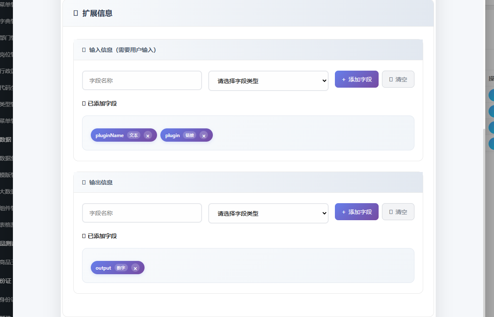

## 数据插件管理  (全局)

1.输入
2.名称
3.类型 （超链接、http请求、代码块等）
4.内容
5.输出


结合之前的智能体的HTML节点

在创建的节点上添加

### COZE节点

原有的是点击了后显示详情，现在需要优化为点击详情才展示详情

点击别的位置像上面那样可以输入，参考：


### 得亏问了，不然白干


## 实现

### 数据库

先说明：新建插件表 w_plugin  

| 字段         | 类型 | 说明                                                         |
| ------------ | ---- | ------------------------------------------------------------ |
| id           | int2 |                                                              |
| plugin_name  |      | 插件名                                                       |
| type         |      | 插件类型                                                     |
| content      |      | 插件内容                                                     |
| input        | text | 输入格式<br />{"path":"http://localhost:9999/index.html",<br />"type":"get","params":"v=0.016482517439420308"}<br />格式类似上面这样 |
| output       | text | 同上（input）                                                |
| status       |      | 状态                                                         |
| created_time |      | 创建时间                                                     |
| altime       |      | 更新时间                                                     |
| isdel        |      |                                                              |

```sql
DROP TABLE IF EXISTS "public"."w_plugin";
CREATE TABLE "public"."w_plugin" (
  "id" int4 NOT NULL,
  "plugin_name" varchar(50) COLLATE "pg_catalog"."default" NOT NULL,
  "plugin_type" varchar(50) COLLATE "pg_catalog"."default" NOT NULL,
  "logo" varchar(255) COLLATE "pg_catalog"."default",
  "content" text COLLATE "pg_catalog"."default",
  "input" text COLLATE "pg_catalog"."default",
  "output" text COLLATE "pg_catalog"."default",
  "status" int2,
  "created_time" timestamp(6),
  "altime" timestamp(6),
  "isdel" int2
)
;
COMMENT ON COLUMN "public"."w_plugin"."plugin_name" IS '插件名称';
COMMENT ON COLUMN "public"."w_plugin"."plugin_type" IS '插件类型';
COMMENT ON COLUMN "public"."w_plugin"."logo" IS '插件logo地址';
COMMENT ON COLUMN "public"."w_plugin"."content" IS '插件内容';
COMMENT ON COLUMN "public"."w_plugin"."input" IS '插件输入(json格式，含多个字段)';
COMMENT ON COLUMN "public"."w_plugin"."output" IS '插件输出';
COMMENT ON COLUMN "public"."w_plugin"."status" IS '插件状态';
COMMENT ON COLUMN "public"."w_plugin"."created_time" IS '创建时间';

-- ----------------------------
-- Primary Key structure for table w_plugin
-- ----------------------------
ALTER TABLE "public"."w_plugin" ADD CONSTRAINT "w_plugin_pkey" PRIMARY KEY ("id");

```


节点表添加一个字段  用于记录 插件id  plugin_id

就意味着之前的节点编辑、添加等功能都需要额外添加字段


### 表单样式


### 添加页面

遇到的问题：

表单提交未生效,父js文件当中提前关闭了  原因


## 难点

### 1、当表单中含有文件和文本都存在的时候，后端不好改写

图上传走专门的接口，返回文件名或者url  然后创建一个全局变量imageUrl  给到表单，提交即可

### 2、存储输入输出字段

最开始想着的是使用{} 去存储输入或者输出的字符串  但是发现如果有对象里面套对象的话就会出现解析出问题？ 显然我也不知道啥情况 保留一份当前代码：

#### 1.使用 {} 存储  出问题


最终考虑还是走数组存储吧

```js
/**
 * 插件表单处理 - 改进版本
 * 作者：龚喜
 * 时间：2025-08-18
 */

require.config({
    paths: {
        jquery: '../../sys/jquery',
        system: '../../sys/system',
        layui: "../../layui-btkj/layui",
        layuicommon: "../../sys/layuicommon",
    },
    shim: {
        "system": {
            deps: ["jquery"]
        },
        "layui": {
            deps: ["jquery", "system"]
        },
        "layuicommon": {
            deps: ["jquery", "layui"]
        }
    },
    waitSeconds: 0
});

// 全局变量
let objdata = {
    pluginType: [
        {
            id: "1",
            name: "superlink",
            title: "超链接",
            icon: "fas fa-link"
        },
        {
            id: "2",
            name: "http",
            title: "HTTP请求",
            icon: "fas fa-globe"
        },
        {
            id: "3",
            name: "code",
            title: "代码块",
            icon: "fas fa-code"
        },
        {
            id: "4",
            name: "function",
            title: "函数",
            icon: "fas fa-function"
        }
    ],
    selectType: "superlink", // 默认选择超链接类型
    imageUrl: "",  // 存储上传成功后的图片地址
    inputFields: {},  // 修改：使用对象类型，key为字段名，value为字段配置
    outputFields: {} // 修改：使用对象类型，key为字段名，value为字段配置
};

require(["jquery", "system", 'layui', 'layuicommon'], function () {
    layui.use(['form', 'layer', 'upload'], function () {
        var form = layui.form;
        let layer = layui.layer;
        let upload = layui.upload;

        // 初始化表单
        initForm();

        // 初始化上传
        initUpload();

        // 绑定事件
        bindEvents();

        // 如果是编辑模式，加载数据
        if (Arg("type") === "update" && Arg("id") !== "") {
            loadPluginData(Arg("id"));
        }

        /**
         * 初始化表单
         */
        function initForm() {
            var form = layui.form;
            form.render();

            // 表单验证规则
            form.verify({
                plugin_name: function(value) {
                    if (!value || value.trim() === '') {
                        return '请输入插件名称';
                    }
                    if (value.length > 30) {
                        return '插件名称不能超过30个字符';
                    }
                },
                plugin_type: function(value) {
                    if (!value) {
                        return '请选择插件类型';
                    }
                },
                content: function(value) {
                    if (!value || value.trim() === '') {
                        return '请输入内容';
                    }

                    // 根据类型进行特殊验证
                    if (objdata.selectType === 'http') {
                        if (!isValidUrl(value)) {
                            return '请输入有效的HTTP请求路径';
                        }
                    }
                }
            });

            // 监听单选框变化
            form.on('radio(pluginType)', function(data) {
                objdata.selectType = data.value;
                updateContentPlaceholder(data.value);
            });

            // 字符计数器
            $('input[name="plugin_name"]').on('input', function() {
                updateCharCounter($(this), 30, '#nameCounter');
            });
        }

        /**
         * 初始化上传组件
         */
        function initUpload() {
            upload.render({
                elem: '.upload-area-compact',
                url: getUploadUrl(), // 修复：使用动态获取的上传地址
                accept: 'images',
                acceptMime: 'image/png,image/jpg,image/jpeg',
                size: 1024,
                before: function(obj) {
                    layer.load();
                },
                done: function(res) {
                    layer.closeAll('loading');
                    // 修复：兼容不同的响应格式
                    if ((res.code === 0 || res.status === 'success') && res.data) {
                        // 将url给到全局的变量imageUrl  给到表单提交
                        objdata.imageUrl = res.data.url || res.data.path || res.data;
                        showPreview(objdata.imageUrl);
                        layer.msg('Logo上传成功', {icon: 1});
                    } else {
                        const errorMsg = res.msg || res.message || '上传失败';
                        layer.msg('上传失败：' + errorMsg, {icon: 2});
                    }
                },
                error: function() {
                    layer.closeAll('loading');
                    layer.msg('上传失败，请重试', {icon: 2});
                }
            });

            // 初始化拖拽上传
            initDragUpload();
        }

        /**
         * 获取上传URL
         */
        function getUploadUrl() {
            // 可以根据实际环境动态获取上传地址
            if (typeof window.uploadConfig !== 'undefined' && window.uploadConfig.url) {
                return window.uploadConfig.url;
            }
            // 默认上传地址，可以配置到配置文件中
            return '/api/upload';
        }

        /**
         * 绑定事件
         */
        function bindEvents() {
            // 保存按钮
            $("#saveOK").click(function(event) {
                event.preventDefault();
                submitForm();
            });

            // 取消按钮
            $("#cancelBtn").click(function() {
                // 调用父窗口的取消回调
                if (typeof parent.onPluginCancel === 'function') {
                    parent.onPluginCancel();
                } else {
                    // 兜底方案：显示确认对话框
                    if (confirm('确定要取消吗？未保存的数据将丢失。')) {
                        parent.layer.closeAll();
                    }
                }
            });

            // 添加字段按钮
            $("#addInputFieldBtn").click(function() {
                addInputField();
            });

            $("#addOutputFieldBtn").click(function() {
                addOutputField();
            });

            // 清空字段按钮
            $("#clearInputFieldsBtn").click(function() {
                clearFields('input');
            });

            $("#clearOutputFieldsBtn").click(function() {
                clearFields('output');
            });

            // 回车键添加字段
            $('#inputFieldName').keypress(function(e) {
                if (e.which === 13) {
                    e.preventDefault();
                    addInputField();
                }
            });

            $('#outputFieldName').keypress(function(e) {
                if (e.which === 13) {
                    e.preventDefault();
                    addOutputField();
                }
            });

            // 快捷键支持
            $(document).keydown(function(e) {
                if (e.ctrlKey && e.keyCode === 13) {
                    submitForm();
                }
            });
        }

        /**
         * 提交表单 - 修复表单验证和数据获取问题
         */
        function submitForm() {
            // 修复：手动进行表单验证，因为layui的验证可能不生效
            const formData = getFormData();

            // 手动验证
            const validation = validateFormData(formData);
            if (!validation.isValid) {
                layer.msg(validation.message, {icon: 2});
                return false;
            }

            // 添加字段数据  TODO  需要将这两个字段串化

            formData.input_fields = JSON.stringify(objdata.inputFields);
            formData.output_fields = JSON.stringify(objdata.outputFields);
            formData.logo = objdata.imageUrl;

            // 根据操作类型调用不同方法
            let type = Arg("type");
            if (type === "add") {
                addPlugin(formData);
            } else if (type === "update") {
                formData.id = Arg("id");
                updatePlugin(formData);
            }
        }

        /**
         * 获取表单数据
         */
        function getFormData() {
            return {
                plugin_name: $('input[name="plugin_name"]').val().trim(),
                plugin_type: $('input[name="plugin_type"]:checked').val(),
                content: $('textarea[name="content"]').val().trim()
            };
        }

        /**
         * 验证表单数据
         */
        function validateFormData(data) {
            if (!data.plugin_name) {
                return { isValid: false, message: '请输入插件名称' };
            }
            if (data.plugin_name.length > 30) {
                return { isValid: false, message: '插件名称不能超过30个字符' };
            }
            if (!data.plugin_type) {
                return { isValid: false, message: '请选择插件类型' };
            }
            if (!data.content) {
                return { isValid: false, message: '请输入内容' };
            }
            if (data.plugin_type === 'http' && !isValidUrl(data.content)) {
                return { isValid: false, message: '请输入有效的HTTP请求路径' };
            }

            return { isValid: true };
        }

        // 同时保留供外部调用的函数
        window.submitForm = function() {
            submitForm();
        }

        /**
         * 添加插件
         */
        function addPlugin(data) {
            console.log('添加插件数据:', data);
            $.sm((re, err) => {
                if (err) {
                    layer.msg(err, {icon: 2});
                } else {
                    layer.msg("插件添加成功！", {icon: 1});
                    // 延迟调用成功回调，确保消息显示
                    setTimeout(() => {
                        // 调用父窗口的成功回调
                        if (typeof parent.onPluginSaveSuccess === 'function') {
                            parent.onPluginSaveSuccess();
                        } else {
                            // 兜底方案：直接关闭窗口并刷新
                            parent.layer.closeAll();
                            if (typeof parent.refreshTable === 'function') {
                                parent.refreshTable();
                            }
                        }
                    }, 1000);
                }
            }, ["w_plugin.add", JSON.stringify(data)]);
        }

        /**
         * 更新插件
         */
        function updatePlugin(data) {
            console.log('更新插件数据:', data);
            $.sm((re, err) => {
                if (err) {
                    layer.msg(err, {icon: 2});
                } else {
                    layer.msg("插件更新成功！", {icon: 1});
                    // 延迟调用成功回调，确保消息显示
                    setTimeout(() => {
                        // 调用父窗口的成功回调
                        if (typeof parent.onPluginSaveSuccess === 'function') {
                            parent.onPluginSaveSuccess();
                        } else {
                            // 兜底方案：直接关闭窗口并刷新
                            parent.layer.closeAll();
                            if (typeof parent.refreshTable === 'function') {
                                parent.refreshTable();
                            }
                        }
                    }, 1000);
                }
            }, ["w_agent_plugin.update", JSON.stringify(data), $.msgwhere({id: [data.id]})]);
        }

        /**
         * 加载插件数据
         */
        function loadPluginData(id) {
            $.sm((re, err) => {
                if (err) {
                    layer.msg(err, {icon: 2});
                } else {
                    let data = re[0];
                    populateForm(data);
                }
            }, ["w_agent_plugin.selectById", $.msgwhere({id: [id]})]);
        }

        /**
         * 填充表单数据
         */
        function populateForm(data) {
            // 填充基本信息
            $('input[name="plugin_name"]').val(data.plugin_name || '');
            $('textarea[name="content"]').val(data.content || '');

            // 设置单选框
            if (data.plugin_type) {
                $(`input[name="plugin_type"][value="${data.plugin_type}"]`).prop('checked', true);
                objdata.selectType = data.plugin_type;
            }

            // 解析并设置字段数据
            if (data.input_fields) {
                try {
                    let inputFields = typeof data.input_fields === 'string'
                        ? JSON.parse(data.input_fields)
                        : data.input_fields;

                    // 兼容数组和对象两种格式
                    if (Array.isArray(inputFields)) {
                        // 如果是数组，转换为对象格式
                        objdata.inputFields = {};
                        inputFields.forEach(field => {
                            if (field.name) {
                                objdata.inputFields[field.name] = {
                                    type: field.type,
                                    required: field.required || false,
                                    description: field.description || ''
                                };
                            }
                        });
                    } else {
                        // 如果已经是对象格式
                        objdata.inputFields = inputFields || {};
                    }
                    renderFieldTags('input');
                } catch (e) {
                    console.warn('输入字段数据解析失败:', e);
                    objdata.inputFields = {};
                }
            }

            if (data.output_fields) {
                try {
                    let outputFields = typeof data.output_fields === 'string'
                        ? JSON.parse(data.output_fields)
                        : data.output_fields;

                    // 兼容数组和对象两种格式
                    if (Array.isArray(outputFields)) {
                        // 如果是数组，转换为对象格式
                        objdata.outputFields = {};
                        outputFields.forEach(field => {
                            if (field.name) {
                                objdata.outputFields[field.name] = {
                                    type: field.type,
                                    description: field.description || ''
                                };
                            }
                        });
                    } else {
                        // 如果已经是对象格式
                        objdata.outputFields = outputFields || {};
                    }
                    renderFieldTags('output');
                } catch (e) {
                    console.warn('输出字段数据解析失败:', e);
                    objdata.outputFields = {};
                }
            }

            // 设置logo
            if (data.logo) {
                objdata.imageUrl = data.logo;
                showPreview(data.logo);
            }

            // 更新字符计数器
            updateCharCounter($('input[name="plugin_name"]'), 30, '#nameCounter');

            // 重新渲染表单
            form.render();
        }

        /**
         * 添加输入字段
         */
        function addInputField() {
            let name = $('#inputFieldName').val().trim();
            let type = $('#inputFieldType').val();

            if (!name || !type) {
                layer.msg('请填写完整的字段信息', {icon: 2});
                return;
            }

            // 检查是否已存在
            if (objdata.inputFields.hasOwnProperty(name)) {
                layer.msg('字段名称已存在', {icon: 2});
                return;
            }

            objdata.inputFields[name] = {
                type: type,
                required: false,
                description: ''
            };

            renderFieldTags('input');
            clearFieldInputs('input');
            layer.msg('输入字段添加成功', {icon: 1});
        }

        /**
         * 添加输出字段
         */
        function addOutputField() {
            let name = $('#outputFieldName').val().trim();
            let type = $('#outputFieldType').val();

            if (!name || !type) {
                layer.msg('请填写完整的字段信息', {icon: 2});
                return;
            }

            // 检查是否已存在
            if (objdata.outputFields.hasOwnProperty(name)) {
                layer.msg('字段名称已存在', {icon: 2});
                return;
            }

            objdata.outputFields[name] = {
                type: type,
                description: ''
            };

            renderFieldTags('output');
            clearFieldInputs('output');
            layer.msg('输出字段添加成功', {icon: 1});
        }

        /**
         * 渲染字段标签
         */
        function renderFieldTags(fieldType) {
            let fields = fieldType === 'input' ? objdata.inputFields : objdata.outputFields;
            let container = fieldType === 'input' ? '#inputFieldsList' : '#outputFieldsList';
            let tagsList = container + ' .field-tags-list';
            let emptyDiv = container + ' .field-tags-empty';

            // 获取字段名称数组
            let fieldNames = Object.keys(fields);

            if (fieldNames.length === 0) {
                $(emptyDiv).show();
                $(tagsList).empty();
                return;
            }

            $(emptyDiv).hide();

            let tagsHtml = fieldNames.map((fieldName) => {
                let field = fields[fieldName];
                return `
                    <div class="field-tag" data-name="${fieldName}" data-type="${fieldType}">
                        <span class="field-tag-name">${fieldName}</span>
                        <span class="field-tag-type">${getTypeLabel(field.type)}</span>
                        <button type="button" class="field-tag-remove" onclick="removeFieldTag('${fieldType}', '${fieldName}')">
                            ×
                        </button>
                    </div>
                `;
            }).join('');

            $(tagsList).html(tagsHtml);
        }

        /**
         * 移除字段标签
         */
        window.removeFieldTag = function(fieldType, fieldName) {
            if (fieldType === 'input') {
                delete objdata.inputFields[fieldName];
            } else {
                delete objdata.outputFields[fieldName];
            }
            renderFieldTags(fieldType);
            layer.msg('字段已移除', {icon: 1});
        };

        /**
         * 清空字段
         */
        function clearFields(fieldType) {
            let fields = fieldType === 'input' ? objdata.inputFields : objdata.outputFields;
            let fieldNames = Object.keys(fields);

            if (fieldNames.length === 0) {
                layer.msg('没有可清空的字段', {icon: 2});
                return;
            }

            layer.confirm('确定要清空所有字段吗？', function(index) {
                if (fieldType === 'input') {
                    objdata.inputFields = {};
                } else {
                    objdata.outputFields = {};
                }
                renderFieldTags(fieldType);
                layer.msg('字段已清空', {icon: 1});
                layer.close(index);
            });
        }

        /**
         * 清空字段输入框
         */
        function clearFieldInputs(fieldType) {
            if (fieldType === 'input') {
                $('#inputFieldName').val('');
                $('#inputFieldType').val('');
            } else {
                $('#outputFieldName').val('');
                $('#outputFieldType').val('');
            }
        }

        /**
         * 工具函数
         */
        function getTypeLabel(type) {
            const typeMap = {
                text: '文本',
                number: '数字',
                date: '日期',
                email: '邮箱',
                url: '链接',
                boolean: '布尔值',
                array: '数组',
                object: '对象'
            };
            return typeMap[type] || type;
        }

        function updateContentPlaceholder(type) {
            let placeholder = '';
            switch (type) {
                case 'superlink':
                    placeholder = '请输入链接地址，如：https://example.com';
                    break;
                case 'http':
                    placeholder = '请输入API接口地址，如：https://api.example.com/data';
                    break;
                case 'code':
                    placeholder = '请输入代码块，支持多种编程语言';
                    break;
                case 'function':
                    placeholder = '请输入函数定义或函数调用代码';
                    break;
                default:
                    placeholder = '请输入内容...';
            }
            $('textarea[name="content"]').attr('placeholder', placeholder);
        }

        function updateCharCounter($input, maxLength, counterSelector) {
            let currentLength = $input.val().length;
            $(counterSelector).text(currentLength);

            if (currentLength > maxLength * 0.8) {
                $(counterSelector).addClass('warning');
            } else {
                $(counterSelector).removeClass('warning');
            }
        }

        function showPreview(imageUrl) {
            $('#previewImage').attr('src', imageUrl);
            $('#uploadPreview').show();
        }

        function isValidUrl(string) {
            try {
                new URL(string);
                return true;
            } catch (_) {
                return false;
            }
        }

        function initDragUpload() {
            const uploadArea = document.querySelector('.upload-area-compact');
            if (!uploadArea) return;

            uploadArea.addEventListener('dragover', function(e) {
                e.preventDefault();
                e.stopPropagation();
                uploadArea.style.borderColor = '#667eea';
                uploadArea.style.background = 'linear-gradient(135deg, #f0f4ff 0%, #e0e7ff 100%)';
            });

            uploadArea.addEventListener('dragleave', function(e) {
                e.preventDefault();
                e.stopPropagation();
                uploadArea.style.borderColor = '#d1d5db';
                uploadArea.style.background = 'linear-gradient(135deg, #f8fafc 0%, #f1f5f9 100%)';
            });

            uploadArea.addEventListener('drop', function(e) {
                e.preventDefault();
                e.stopPropagation();
                uploadArea.style.borderColor = '#d1d5db';
                uploadArea.style.background = 'linear-gradient(135deg, #f8fafc 0%, #f1f5f9 100%)';

                const files = e.dataTransfer.files;
                if (files.length > 0) {
                    const file = files[0];
                    if (file.type.startsWith('image/')) {
                        // 修复：正确触发上传
                        const fileInput = document.getElementById('logoFile');
                        fileInput.files = files;
                        fileInput.dispatchEvent(new Event('change'));
                    } else {
                        layer.msg('请上传图片文件', {icon: 2});
                    }
                }
            });
        }
    });
});
```

#### 2. 使用 [] 存储 还是有问题


## 解决问题

### 1、字符串编码问题

在上面发现不论我们使用{} 还是[]  都会出错，该如何解决呢？

通过查看  `templist.add` 该接口  发现  对于

**json串中有特殊符号  需要使用encodeURLComponent编码一下[格式%20]**

**取值的时候需要解码**


那就说明了最开始的逻辑是没有问题的   我们的字符串也需要先编码  


## 今日所完成的

1. 插件的添加、编辑、删除、搜索、批量删除、状态修改、回显

   费时较长是因为json的数据格式问题，以及页面在添加字段存储字段列表耗时较长

2. 节点在编辑或者添加的时候可以关联插件

### 效果




## 明日待做

需要在节点详情将插件信息展示出来，展示原有的logo


