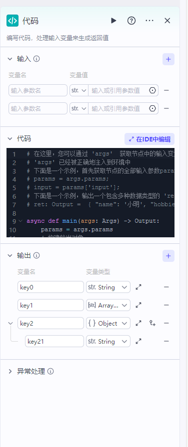
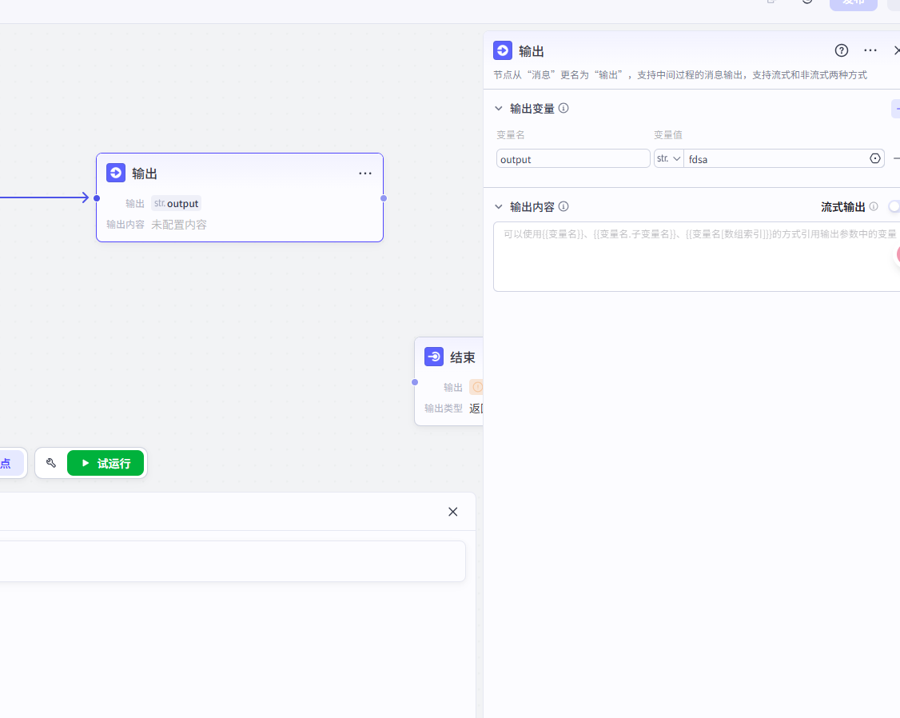
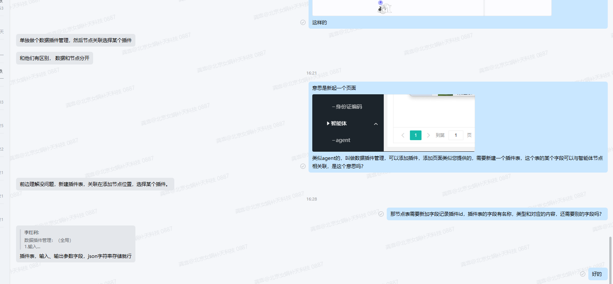
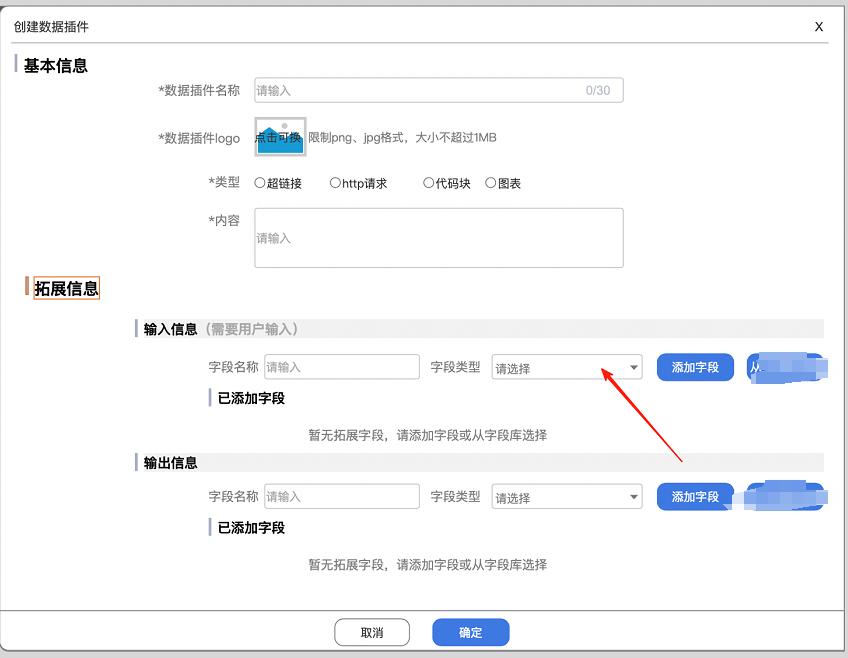

## 数据插件管理  (全局)

1.输入
2.名称
3.类型 （超链接、http请求、代码块等）
4.内容
5.输出




结合之前的智能体的HTML节点

在创建的节点上添加

### COZE节点

原有的是点击了后显示详情，现在需要优化为点击详情才展示详情

点击别的位置像上面那样可以输入，参考：



### 得亏问了，不然白干



## 实现

### 数据库

先说明：新建插件表 w_plugin  

| 字段         | 类型 | 说明                                                         |
| ------------ | ---- | ------------------------------------------------------------ |
| id           | int2 |                                                              |
| plugin_name  |      | 插件名                                                       |
| type         |      | 插件类型                                                     |
| content      |      | 插件内容                                                     |
| input        | text | 输入格式<br />{"path":"http://localhost:9999/index.html",<br />"type":"get","params":"v=0.016482517439420308"}<br />格式类似上面这样 |
| output       | text | 同上（input）                                                |
| status       |      | 状态                                                         |
| created_time |      | 创建时间                                                     |
| altime       |      | 更新时间                                                     |
| isdel        |      |                                                              |

```sql
DROP TABLE IF EXISTS "public"."w_plugin";
CREATE TABLE "public"."w_plugin" (
  "id" int4 NOT NULL,
  "plugin_name" varchar(50) COLLATE "pg_catalog"."default" NOT NULL,
  "plugin_type" varchar(50) COLLATE "pg_catalog"."default" NOT NULL,
  "logo" varchar(255) COLLATE "pg_catalog"."default",
  "content" text COLLATE "pg_catalog"."default",
  "input" text COLLATE "pg_catalog"."default",
  "output" text COLLATE "pg_catalog"."default",
  "status" int2,
  "created_time" timestamp(6),
  "altime" timestamp(6),
  "isdel" int2
)
;
COMMENT ON COLUMN "public"."w_plugin"."plugin_name" IS '插件名称';
COMMENT ON COLUMN "public"."w_plugin"."plugin_type" IS '插件类型';
COMMENT ON COLUMN "public"."w_plugin"."logo" IS '插件logo地址';
COMMENT ON COLUMN "public"."w_plugin"."content" IS '插件内容';
COMMENT ON COLUMN "public"."w_plugin"."input" IS '插件输入(json格式，含多个字段)';
COMMENT ON COLUMN "public"."w_plugin"."output" IS '插件输出';
COMMENT ON COLUMN "public"."w_plugin"."status" IS '插件状态';
COMMENT ON COLUMN "public"."w_plugin"."created_time" IS '创建时间';

-- ----------------------------
-- Primary Key structure for table w_plugin
-- ----------------------------
ALTER TABLE "public"."w_plugin" ADD CONSTRAINT "w_plugin_pkey" PRIMARY KEY ("id");

```


节点表添加一个字段  用于记录 插件id  plugin_id

就意味着之前的节点编辑、添加等功能都需要额外添加字段


### 表单样式



### 添加页面


