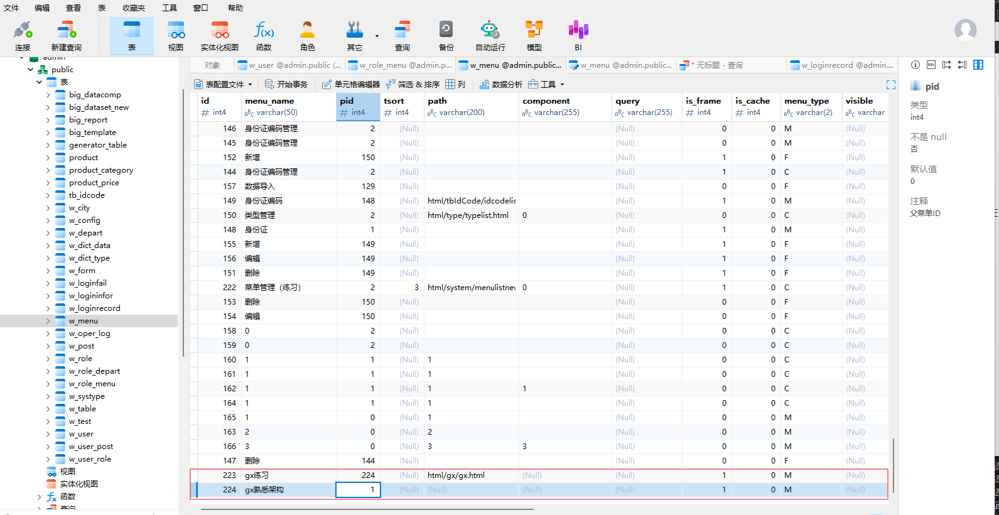
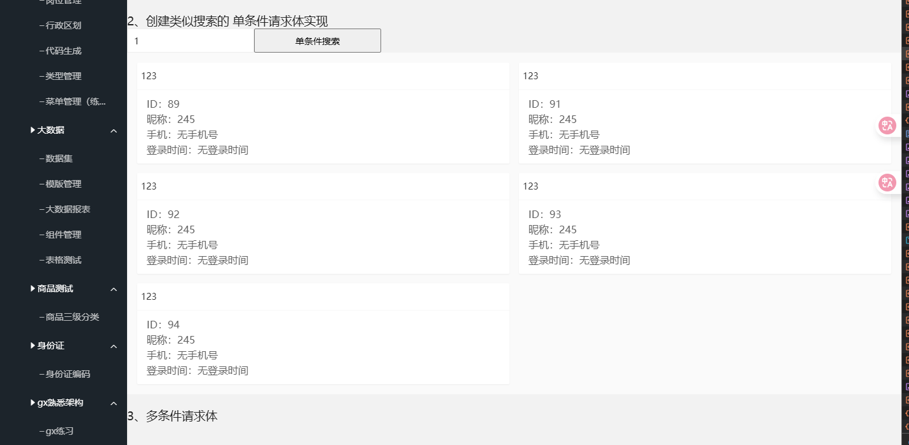

## 1、简单的查询 实现xml与js 联动

### 目标1：获取数据并渲染

1、按照昨日的demo中的步骤  我们需要先创建msgid  也就是相应的xml文件

  确定好type后 使用postman去请求接口 获取到数据 这部分都按照最简单的来

2、去对应的js 模拟前端请求接口

3、在html里面将得到的数据渲染出来

#### 需要解决的问题：

1. 如何确保js里面发送了消息也就是请求了接口？   **实现了简单的请求**

   确保页面上的点击按钮发生了点击事件

2. 如何将写的小demo在管理系统上显示出来？  **已解决**

   这部分需要查看系统的页面是如何配置的  通过查看菜单也页面  找到了此系统的页面路由是放在数据库里面根据不同的用户的权限，可以查看的页面路由不一样  

   其中配置路由的时候，需要在w_menu表里面进行操作  需要区分父菜单的id

   根据用户的权限配置能查看的页面  需要在w_role_menu 表进行操作

   - 设置页面路由

     

   - 给用户添加权限

     

3. 通过请求接口获取到了相应的数据  如何将数据赋值给相应的对象呢？  **已解决** 

   这部分可以参看citylist.js  这个js文件是请求接口获得数据并传递的  这部分的消息体是 

   citylist.list  通过理解后  发现是使用了组件  给组件绑定好id  后在js 文件中通过layui.use("组件类型(table)")

   定义一个变量 table = layui.table   随后请求接口 回调后 封装一个渲染函数 通过使用相应的渲染方法 

   例如  table  对应的table.render(响应得到的数据)

4. 赋值得到了数据 如何使用layui的一些组件将数据渲染出来呢？   **已解决**

   使用组件自带的渲染方法    table  对应 render   别的可以看官方文档

#### 实现效果

忽略样式  总算完整一个消息了


------


### 目标2：传递单参数获取数据并渲染(搜索例子)

html传递的数据通过参数形式传递到js   说白了  类似双向数据绑定

js文件传递的参数请求到接口

xml文件里面使用参数进行crud

单参数的消息请求体格式：

```javascript
$.sm(callback, [消息ID, '', $.msgwhere({条件对象})]);
```

#### 需要解决的问题：

1. html传递的数据在js文件是如何接收的？
2. js文件如何将参数代入到接口当中并去请求接口的？
3. xml文件该如何使用参数？

#### 遇到的细节问题(注意事项)：

1. 含参数时消息请求的写法  $.sm(function(re,err){ },**['请求体(也就是接口名)',$.msgwhere(单参数)]**)  注意括号
2. 数据类型转换  参数

#### 实现效果



### 目标3: 多参数传递获取数据并渲染  // TODO 待实现

多参数的请求体格式

```javascript
$.sm(callback, [消息ID, '', $.msgArrwhere([条件数组])]);
```

#### 需要解决的问题

1. 多个参数时的请求体如何编写
2. xml文件中是如何接收和使用的？

### 总代码： // todo 待全实现

#### 1 gx_test.xml

```xml
<?xml version="1.0" encoding="utf-8"?>
<Root>
    <msgs>
<!--        简单的查询-->
        <msg id="gx.selectjson" type="selectjson" v="select u.id, u.uname, u.nick_name from w_user u" perms="">
        </msg>
        <msg id="gx.selectonejson" type="selectonejson" v="select u.uname, u.nick_name from w_user u" perms="">
        </msg>

<!--        添加条件的 类似搜索  也就是添加where条件-->
        <msg id="gx.selectjsonwhere" type="selectjson" v="select u.id ,u.uname, u.nick_name,u.mobile, u.login_date
        from w_user u where #0#" perms="">
            <where idx="0">
                <p key="keyword">u.uname like '%{0}%'</p>
            </where>
        </msg>
<!--        单条件关联查询-->
    </msgs>
</Root>
```

#### 2 gx.js

```js
// 配置好基础的模块
// 添加gx.html里面的点击事件
// 向后端发送消息
require.config({
    paths: {
        jquery: '../../sys/jquery',
        system: '../../sys/system',
        layui: "../../layui-btkj/layui",
    },
    shim: {
        "system": {
            deps: ["jquery"]
        },
        "layui": {
            deps: ["jquery", "system"]
        },
        "config": {
            deps: ["layui"]
        }
    },
    waitSeconds: 0
});
// 创建对象用于存储得到的 数据
var objdata = {
    testMessage: []
}

require(["jquery", "system", 'layui'], function () {
    // html中就只有一个button  使用table去展示数据
    layui.use(['table'], function () {
        var table = layui.table;
        $("#btn").click(function () {
            $.sm(function (re, err) {
                if (err) {
                    layer.log(err);
                } else {
                    // console.log(re)
                    objdata.testMessage = re;

                    // 调用渲染方法渲染数据  样式先不管
                    renderTable(re)
                }
            }, ["gx.selectjson"]);
        })
        $("#btn1").click(function () {
            $.sm(function (re, err) {
                if (err) {
                    console.log(err);
                } else {
                    console.log(re)
                    objdata.testMessage = re;
                }
            }, ["gx.selectonejson"]);
        })
        function renderTable(data) {
            table.render({
                elem: '#testTable',      // 绑定表格容器  与html中的表格对应的id一致
                data: data,               // 传入数据
                css: [ // 重设当前表格样式
                    '.layui-table-tool-temp{padding-right: 145px;}'
                ].join(''),
                cols: [[                 // 定义列结构
                    { field: 'id', title: 'ID', width: 80, align: 'center' },
                    { field: 'uname', title: '姓名', width: 150,align: "center" },
                    { field: 'nick_name', title: '昵称', align: "center"},
                    // 添加更多字段...
                ]],
                page: true               // 是否分页
            });
        }

        $("#btn2").click(function () {
            // 点击搜索的  练习传参  这部分的传参分为单参数 和 多参数  对应的点击事件
            var keyword = $("#keywords").val();  // 获取输入框的值  layui的写法
            // 判断是否有值
            if (!keyword) {
                layer.msg("请输入关键字");
                return
            }
            console.log(keyword)
            var where = {}
            where.keyword = [keyword];

            $.sm(function (re, err) {
                if (err) {
                    layer.log(err);
                } else {
                    // console.log(re)
                    objdata.testMessage = re;
                    // 数据渲染   等下看看有没有卡片样式的组件
                    renderCards(re)
                }
            }, ["gx.selectjsonwhere",$.msgwhere( where)]);
        })
        function renderCards(data) {
            var $container = $("#cardContainer .layui-row");
            $container.empty(); // 清空旧数据

            data.forEach(function (user) {
                var cardHtml = `
                    <div class="layui-col-md6">
                        <div class="layui-card">
                            <div class="layui-card-header">${user.uname || '无姓名'}</div>
                            <div class="layui-card-body">
                                ID：${user.id || ''}<br>
                                昵称：${user.nick_name || '无昵称'}<br>
                                手机：${user.mobile || '无手机号'}<br>
                                登录时间：${user.login_date || '无登录时间'}
                            </div>
                        </div>
                    </div>
                `;
                $container.append(cardHtml);
            });
        }

    })

});

```

#### 3  gx.html

```html
<html>
<head>
    <title>gx测试页面</title>
    <meta name="renderer" content="webkit">
    <meta http-equiv="X-UA-Compatible" content="IE=edge,chrome=1">
    <meta name="viewport"
          content="width=device-width, initial-scale=1.0, minimum-scale=1.0, maximum-scale=1.0, user-scalable=0">
    <link rel="stylesheet" href="../../layui-btkj/css/layui.css" media="all">
    <link rel="stylesheet" href="../../css/layui_ext.css" media="all">
    <link rel="stylesheet" href="../../css/color.css" media="all">
    <link rel="stylesheet" href="../../css/soulTable.css" media="all">
    <link type="text/css" rel="stylesheet" href="../../css/reset.css"/>
    <link rel="stylesheet" href="../../css/commonstyle-layui-btkj.css">
</head>
<body>
<h2 style="text-align: center">熟悉whoami消息架构</h2>
<div style="">
    <h3>1、简单查询</h3>
    <div class="simple">
        <input type="button" value="点击获取用户(type = 'selectjson')的使用 控制台得到数据 " id="btn"/>
        <table id="testTable" lay-filter="testTable" class="layui-hide"></table>
        <input type="button" value="点击获取用户(type = 'selectonejson')的使用 控制台得到数据 " id="btn1"/>
    </div>
    <br />

<!--    创建类似搜索的 单条件请求体实现-->
    <h3>2、创建类似搜索的 单条件请求体实现</h3>
    <div >
        <div class="hard">
            <input type="text" id="keywords" placeholder="请输入用户名" class="layui-input" lay-affix="clear"/>
            <input type="button" value="单条件搜索" id="btn2"/>
        </div>
        <div class="card">
            <div id="cardContainer" class="layui-bg-gray" style="padding: 16px;">
                <div class="layui-row layui-col-space15">
                    <!-- 卡片将插入到这里 -->
                </div>
            </div>
        </div>
    </div>
    <br />

<!--    多条件请求体-->
    <h3>3、多条件请求体</h3>
    <div class="harder">
    </div>

</div>

<script data-main="../../js/gx/gx" src='../../sys/require.min.js'></script>
</body>
<style lang="scss">
    .simple{
        display: flex;
        flex-direction: column;
        margin-bottom: 20px;
        input{
            margin-bottom: 10px;
            width: 200px;
            height: 30px;
        }
    }
    .hard{
        display: flex;
        input{
            width: 200px;
        }
    }
</style>
</html>

```


## 2、复杂的业务场景  含有controller


## 3、重要问题

在之前的实现当中啊，我们虽然都调通了请求接口  获取数据

有没有想过  为什么只是发送了msgid和对应的参数  为什么就可以获取到数据呢？（前提已经登录）

这就要说到一个非常重要的工具类了  -------- DButils.java  （这个是公司已经封装好的 

将在04.3中的复杂页面实现.md 中谈到  届时也会知道为什么还需要controller了？）


