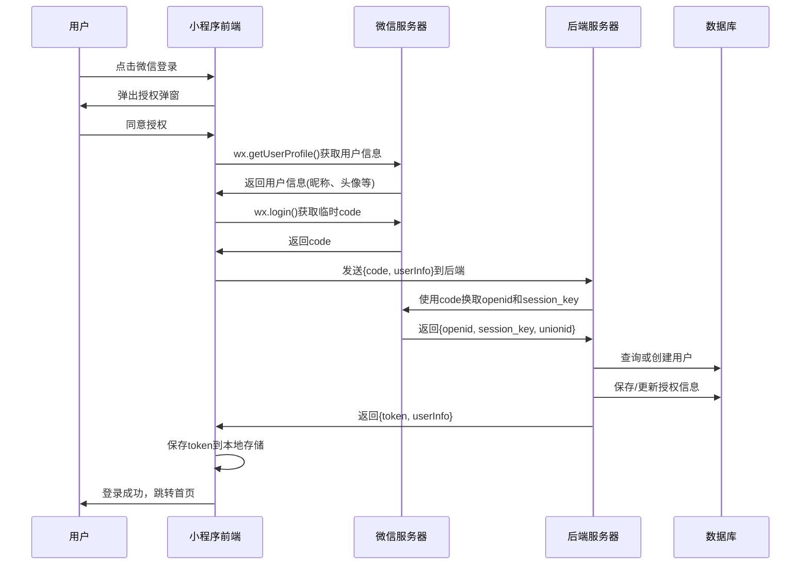
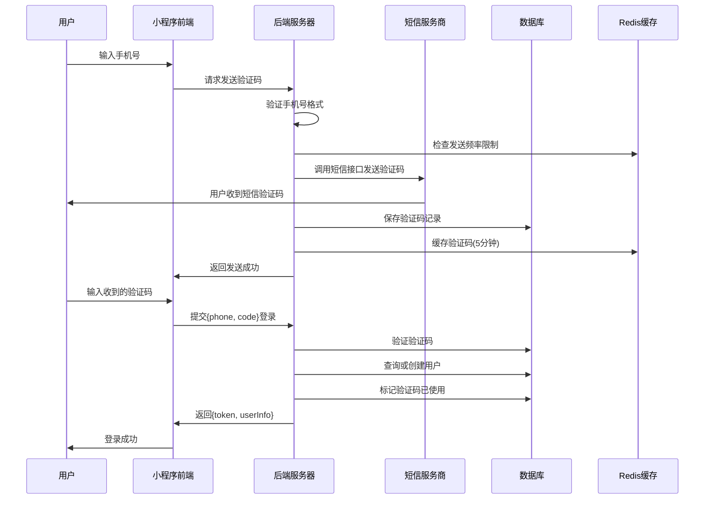

# uni-appx

## 页面编写

本来是想学习一下微信快捷登录的流程的，但是中途找到了几个不错的原型图，一时兴起就去做了，也算是回顾一下之前的uni-app知识吧！

**登录页：**

添加了一些基本的判断，和登录成功的跳转页面


**我的页面：**


### 调整后

**首页：**


## 微信快捷登录实现流程？

现在很多的小程序都在使用微信或者电话直接快捷登录

### 微信快捷登录流程



### 前端(uni-appx端)

首先需要引入微信SDK

在mainfest.json文件中配置相关的appid

#### 核心代码

```js
uni.login({
        provider: 'weixin',
        success: (res) => {
          console.log('微信登录成功（小程序）:', res);
          resolve(res);
        },
        fail: (err) => {
          console.error('微信登录失败:', err);
          reject(new Error('微信授权失败'));
        }
      });
```

#### 

### 后端

后端的作用主要就是将登录后的微信用户的信息存储起来

## 手机快捷登录

### 手机号快捷登录流程




## 后端如何存储快捷登录的用户信息？


