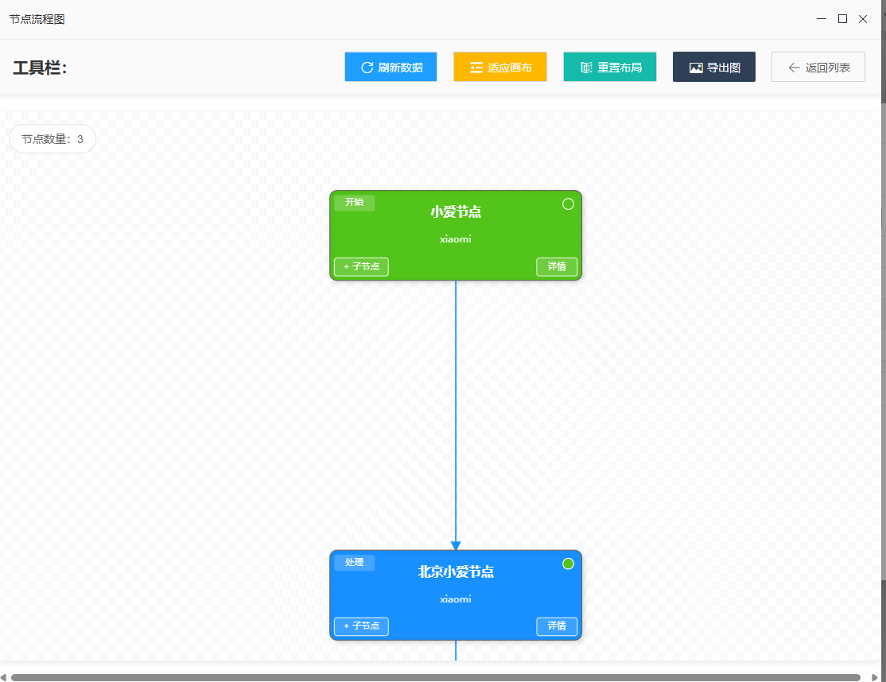
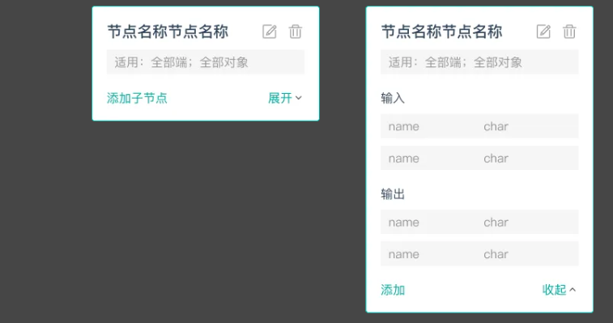
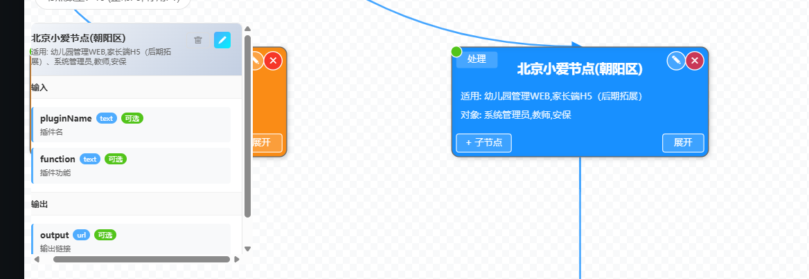
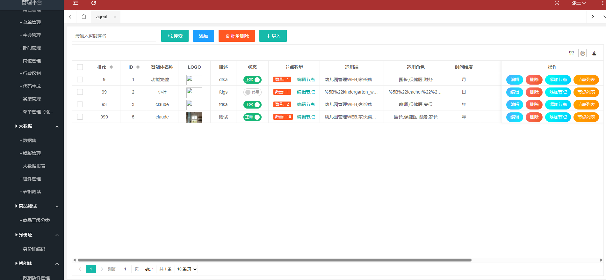
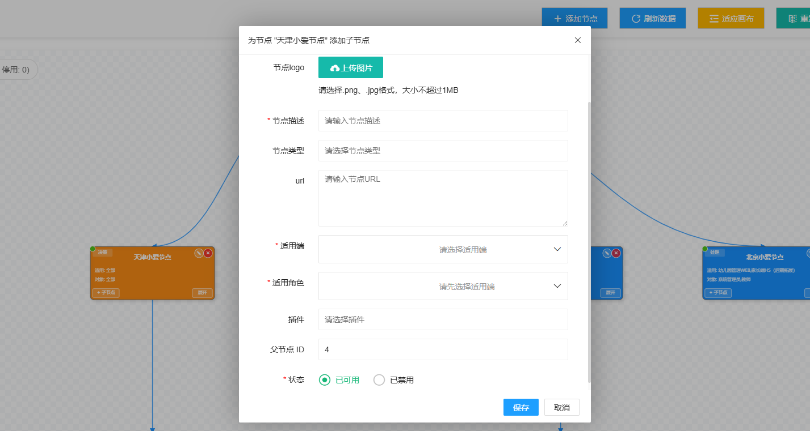
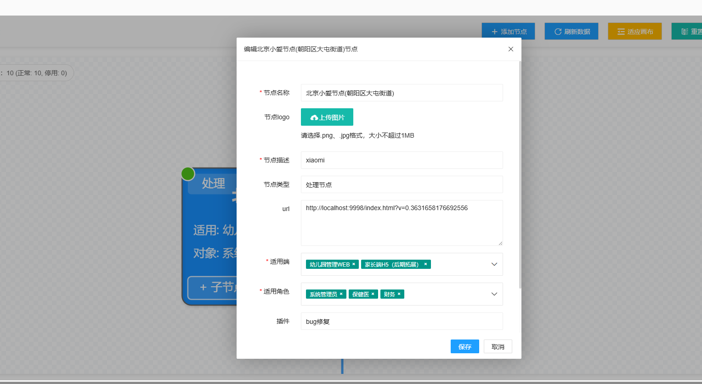

## 智能体功能补充

在上一个文件中，我们好不容易将数据库重新设计和规范了，但是原有的智能体和节点的logo是没有的


添加或者编辑字段添加

## 智能体页面

添加上了，图片没有   出现的问题

layuitable 会根据表的id进行排序 如果两张表的时候，该如何处理呢？

前端传递  根据where 里面的参数 fields: '对应表的id'


### 添加、编辑、删除

在01文档中，由于初始化table后，添加了很多的字段，对于不同字段的回显，添加没问题了，删除和显示相应的智能体也没问题

### 效果图：


## 节点页面

这是一个复杂的


## 插件添加

存在的bug,点击保存，没有关闭模态框，猜测是因为使用了自带的字段验证方法，手动验证，需要修改为使用表达那自带的form.verfy() 去验证


## HTML节点流程图

### 初始

原本的结构是这样的



#### 代码

```js
/**
 * 作者：gongxi
 * 时间：2025-08-13
 * 说明：独立的节点流程图页面
 * 功能：节点关系图显示、添加子节点、刷新数据等
 */
require.config({
    paths: {
        jquery: '../../sys/jquery',
        system: '../../sys/system',
        layui: "../../layui-btkj/layui",
        layuicommon: "../../sys/layuicommon",
        // 添加 AntV G6 依赖
        g6: "../../plugin/antv/g6/g6.min"
    },
    shim: {
        "system": {
            deps: ["jquery"]
        },
        "layui": {
            deps: ["jquery", "system"]
        },
        "layuicommon": {
            deps: ["jquery", "layui"]
        },
        "g6": {
            deps: ["jquery"]
        }
    },
    waitSeconds: 0
});

// 页面数据对象
var objdata = {
    agent_id: null,
    allNodeData: [],
    currentGraph: null,
    nodeRelationDataHTML: null
};

require(["jquery", "system", "layui", "g6"], function () {
    layui.use(['layer', 'form'], function () {
        var layer = layui.layer;
        var form = layui.form;

        // 获取参数
        objdata.agent_id = Arg("agent_id") || Arg("id");

        if (!objdata.agent_id) {
            layer.msg('缺少必要参数：agent_id');
            return;
        }

        // 初始化页面
        initPage();

        // 绑定工具栏按钮事件
        bindToolbarEvents();
    });

    // 初始化页面
    function initPage() {
        // 显示加载状态
        showLoading();

        // 加载节点数据并渲染图表
        loadAllNodeData().then(() => {
            hideLoading();
            if (!objdata.nodeRelationDataHTML || objdata.nodeRelationDataHTML.nodes.length === 0) {
                showEmptyState();
                return;
            }

            // 动态加载 G6 库并创建关系图
            require(['g6'], function(G6) {
                createNodeRelationGraphHTML(G6, objdata.nodeRelationDataHTML);
            });
        }).catch((error) => {
            hideLoading();
            layui.layer.msg('获取节点数据失败，请重试');
            console.error('获取节点数据失败:', error);
        });
    }

    // 绑定工具栏按钮事件
    function bindToolbarEvents() {
        var layer = layui.layer;

        // 刷新数据按钮
        $("#refreshGraphBtn").click(function() {
            const btn = $(this);
            btn.addClass('layui-btn-disabled').html('<i class="layui-icon layui-icon-loading layui-anim layui-anim-rotate layui-anim-loop"></i> 刷新中');

            loadAllNodeData().then(() => {
                if (objdata.currentGraph && !objdata.currentGraph.destroyed) {
                    const newData = prepareRelationDataHTML(objdata.allNodeData);
                    objdata.currentGraph.changeData(newData);

                    setTimeout(() => {
                        objdata.currentGraph.layout();
                        objdata.currentGraph.fitView(30);
                        btn.removeClass('layui-btn-disabled').html('<i class="layui-icon layui-icon-refresh"></i> 刷新数据');
                        layer.msg('图表已刷新');
                        updateNodeCount();
                    }, 300);
                }
            }).catch((error) => {
                btn.removeClass('layui-btn-disabled').html('<i class="layui-icon layui-icon-refresh"></i> 刷新数据');
                layer.msg('刷新失败，请重试');
                console.error('刷新失败:', error);
            });
        });

        // 适应画布按钮
        $("#fitGraphBtn").click(function() {
            if (objdata.currentGraph && !objdata.currentGraph.destroyed) {
                objdata.currentGraph.fitView(30);
                objdata.currentGraph.fitCenter();
                layer.msg('已适应画布');
            }
        });

        // 重置布局按钮
        $("#resetLayoutBtn").click(function() {
            if (objdata.currentGraph && !objdata.currentGraph.destroyed) {
                objdata.currentGraph.layout();
                setTimeout(() => {
                    objdata.currentGraph.fitView(30);
                }, 500);
                layer.msg('布局已重置');
            }
        });

        // 导出图片按钮
        $("#exportGraphBtn").click(function() {
            showExportDialog();
        });

        // 返回列表按钮
        $("#backToListBtn").click(function() {
            // 关闭当前窗口或跳转回列表页
            var index = parent.layer.getFrameIndex(window.name);
            if (index) {
                parent.layer.close(index);
            } else {
                // 如果不是在弹窗中，则跳转回列表页
                window.location.href = 'node_list.html?v=' + Arg("v") + '&mid=' + Arg("mid") + '&id=' + objdata.agent_id;
            }
        });
    }

    // 加载所有节点数据
    function loadAllNodeData() {
        return new Promise((resolve, reject) => {
            $.sm(function (re, err) {
                if (err) {
                    reject(err);
                } else {
                    console.log('获取节点数据成功:', re);
                    objdata.allNodeData = re || [];
                    objdata.nodeRelationDataHTML = prepareRelationDataHTML(objdata.allNodeData);
                    resolve(re);
                }
            }, ["w_agent_node.selectById", $.msgwhere({"agent_id": [objdata.agent_id]})]);
        });
    }

    // HTML节点数据准备函数
    function prepareRelationDataHTML(nodeList) {
        if (!nodeList || nodeList.length === 0) {
            return { nodes: [], edges: [] };
        }

        const nodes = [];
        const edges = [];
        const nodeMap = new Map();

        // 创建节点映射
        nodeList.forEach(node => {
            nodeMap.set(node.id, node);
        });

        // 生成节点数据 - 使用HTML节点
        nodeList.forEach(node => {
            nodes.push({
                id: node.id.toString(),
                label: node.node_name || `节点${node.id}`,
                type: 'html-node',
                size: [280, 100],
                style: {
                    fill: 'transparent',
                    stroke: 'transparent'
                },
                nodeData: node
            });
        });

        // 生成边数据（基于parent_id关系）
        nodeList.forEach(node => {
            if (node.parent_id && node.parent_id !== '0' && nodeMap.has(parseInt(node.parent_id))) {
                edges.push({
                    source: node.parent_id.toString(),
                    target: node.id.toString(),
                    type: 'cubic-horizontal',
                    style: {
                        stroke: '#1890ff',
                        lineWidth: 2,
                        strokeOpacity: 0.8,
                        endArrow: {
                            path: 'M 0,0 L 8,4 L 8,-4 Z',
                            fill: '#1890ff',
                            strokeOpacity: 1
                        }
                    }
                });
            }
        });

        return { nodes, edges };
    }

    // 创建节点关系图
    function createNodeRelationGraphHTML(G6, data) {
        const container = document.getElementById('nodeGraphContainer');

        if (!container) {
            layui.layer.msg('图表容器未找到');
            return;
        }

        // 注册自定义HTML节点
        G6.registerNode('html-node', {
            draw(cfg, group) {
                const nodeData = cfg.nodeData;
                const size = cfg.size || [280, 100];
                const width = size[0];
                const height = size[1];

                // 创建外部容器
                const rect = group.addShape('rect', {
                    attrs: {
                        x: -width / 2,
                        y: -height / 2,
                        width: width,
                        height: height,
                        fill: getNodeColor(nodeData.node_type),
                        stroke: '#666',
                        strokeWidth: 1,
                        radius: 8,
                        cursor: 'pointer',
                        shadowColor: 'rgba(0,0,0,0.15)',
                        shadowBlur: 6,
                        shadowOffsetX: 2,
                        shadowOffsetY: 2
                    },
                    name: 'main-rect'
                });

                // 添加节点标题
                group.addShape('text', {
                    attrs: {
                        x: 0,
                        y: -25,
                        text: cfg.label,
                        fontSize: 14,
                        fontWeight: 'bold',
                        fill: '#fff',
                        textAlign: 'center',
                        textBaseline: 'middle',
                        cursor: 'pointer'
                    },
                    name: 'title-text'
                });

                // 添加节点类型标签
                const nodeTypeText = getNodeTypeText(nodeData.node_type);
                group.addShape('rect', {
                    attrs: {
                        x: -width/2 + 5,
                        y: -height/2 + 5,
                        width: 45,
                        height: 18,
                        fill: 'rgba(255,255,255,0.2)',
                        radius: 3,
                        cursor: 'pointer'
                    },
                    name: 'type-bg'
                });

                group.addShape('text', {
                    attrs: {
                        x: -width/2 + 27.5,
                        y: -height/2 + 14,
                        text: nodeTypeText,
                        fontSize: 10,
                        fill: '#fff',
                        textAlign: 'center',
                        textBaseline: 'middle',
                        cursor: 'pointer'
                    },
                    name: 'type-text'
                });

                // 添加状态指示器
                const statusColor = nodeData.status === 0 ? '#52c41a' : '#f5222d';
                group.addShape('circle', {
                    attrs: {
                        x: width / 2 - 15,
                        y: -height / 2 + 15,
                        r: 6,
                        fill: statusColor,
                        stroke: '#fff',
                        strokeWidth: 2,
                        cursor: 'pointer'
                    },
                    name: 'status-circle'
                });

                // 如果有描述，添加描述文本
                if (nodeData.node_dsc) {
                    const desc = nodeData.node_dsc.length > 16
                        ? nodeData.node_dsc.substring(0, 16) + '...'
                        : nodeData.node_dsc;
                    group.addShape('text', {
                        attrs: {
                            x: 0,
                            y: 5,
                            text: desc,
                            fontSize: 11,
                            fill: '#fff',
                            textAlign: 'center',
                            textBaseline: 'middle',
                            opacity: 0.9,
                            cursor: 'pointer'
                        },
                        name: 'desc-text'
                    });
                }

                // 添加子节点按钮
                const addBtnGroup = group.addGroup({
                    name: 'add-btn-group'
                });

                addBtnGroup.addShape('rect', {
                    attrs: {
                        x: -width/2 + 5,
                        y: height/2 - 25,
                        width: 60,
                        height: 20,
                        fill: 'rgba(255,255,255,0.2)',
                        stroke: '#fff',
                        strokeWidth: 1,
                        radius: 3,
                        cursor: 'pointer',
                        opacity: 0.8
                    },
                    name: 'add-btn-bg'
                });

                addBtnGroup.addShape('text', {
                    attrs: {
                        x: -width/2 + 35,
                        y: height/2 - 15,
                        text: '+ 子节点',
                        fontSize: 10,
                        fill: '#fff',
                        textAlign: 'center',
                        textBaseline: 'middle',
                        cursor: 'pointer'
                    },
                    name: 'add-btn-text'
                });

                // 查看详情按钮
                const detailBtnGroup = group.addGroup({
                    name: 'detail-btn-group'
                });

                detailBtnGroup.addShape('rect', {
                    attrs: {
                        x: width/2 - 50,
                        y: height/2 - 25,
                        width: 45,
                        height: 20,
                        fill: 'rgba(255,255,255,0.2)',
                        stroke: '#fff',
                        strokeWidth: 1,
                        radius: 3,
                        cursor: 'pointer',
                        opacity: 0.8
                    },
                    name: 'detail-btn-bg'
                });

                detailBtnGroup.addShape('text', {
                    attrs: {
                        x: width/2 - 27.5,
                        y: height/2 - 15,
                        text: '详情',
                        fontSize: 10,
                        fill: '#fff',
                        textAlign: 'center',
                        textBaseline: 'middle',
                        cursor: 'pointer'
                    },
                    name: 'detail-btn-text'
                });

                return rect;
            },

            // 更新节点
            update(cfg, item) {
                const group = item.getContainer();
                const nodeData = cfg.nodeData;

                // 更新主要形状颜色
                const rect = group.find(element => element.get('name') === 'main-rect');
                if (rect) {
                    rect.attr('fill', getNodeColor(nodeData.node_type));
                }

                // 更新标题文本
                const titleText = group.find(element => element.get('name') === 'title-text');
                if (titleText) {
                    titleText.attr('text', cfg.label);
                }

                // 更新类型文本
                const typeText = group.find(element => element.get('name') === 'type-text');
                if (typeText) {
                    typeText.attr('text', getNodeTypeText(nodeData.node_type));
                }

                // 更新状态
                const statusCircle = group.find(element => element.get('name') === 'status-circle');
                if (statusCircle) {
                    const statusColor = nodeData.status === 0 ? '#52c41a' : '#f5222d';
                    statusCircle.attr('fill', statusColor);
                }

                // 更新描述文本
                const descText = group.find(element => element.get('name') === 'desc-text');
                if (descText && nodeData.node_dsc) {
                    const desc = nodeData.node_dsc.length > 16
                        ? nodeData.node_dsc.substring(0, 16) + '...'
                        : nodeData.node_dsc;
                    descText.attr('text', desc);
                }
            }
        });

        // 创建 G6 图实例
        const graph = new G6.Graph({
            container: container,
            width: container.clientWidth,
            height: container.clientHeight,
            renderer: 'canvas',
            pixelRatio: window.devicePixelRatio || 2,
            modes: {
                default: [
                    'drag-canvas',
                    'zoom-canvas',
                    'drag-node'
                ]
            },
            defaultNode: {
                type: 'html-node',
                size: [280, 100],
                style: {
                    fill: 'transparent',
                    stroke: 'transparent'
                }
            },
            defaultEdge: {
                type: 'cubic-horizontal',
                style: {
                    stroke: '#1890ff',
                    lineWidth: 2,
                    strokeOpacity: 0.8,
                    endArrow: {
                        path: 'M 0,0 L 8,4 L 8,-4 Z',
                        fill: '#1890ff',
                        strokeOpacity: 1
                    }
                }
            },
            layout: {
                type: 'dagre',
                rankdir: 'TB',
                align: 'DL',
                nodesep: 60,
                ranksep: 100,
                controlPoints: true,
                sortByCombo: false
            },
            fitView: true,
            fitViewPadding: [40, 40, 40, 40],
            animate: true,
            animateCfg: {
                duration: 300,
                easing: 'easeLinear'
            }
        });

        // 存储图表实例
        objdata.currentGraph = graph;

        // 绑定节点点击事件
        graph.on('node:click', (e) => {
            const nodeData = e.item.getModel().nodeData;
            const shape = e.target;
            const shapeName = shape.get('name');
            const group = e.item.getContainer();

            // 点击添加子节点按钮
            if (shapeName === 'add-btn-bg' || shapeName === 'add-btn-text' ||
                (group.find(element => element.get('name') === 'add-btn-group') &&
                    group.find(element => element.get('name') === 'add-btn-group').contain(shape))) {
                e.stopPropagation();
                addChildNode(nodeData.id, nodeData.node_name);
                return;
            }

            // 点击查看详情按钮
            if (shapeName === 'detail-btn-bg' || shapeName === 'detail-btn-text' ||
                (group.find(element => element.get('name') === 'detail-btn-group') &&
                    group.find(element => element.get('name') === 'detail-btn-group').contain(shape))) {
                e.stopPropagation();
                showNodeDetail(nodeData);
                return;
            }

            // 默认显示节点详情
            showNodeDetail(nodeData);
        });

        // 节点悬停效果
        graph.on('node:mouseenter', (e) => {
            const item = e.item;
            const group = item.getContainer();
            const rect = group.find(element => element.get('name') === 'main-rect');
            if (rect) {
                rect.attr('strokeWidth', 2);
                rect.attr('stroke', '#1890ff');

                // 高亮按钮
                const addBtnGroup = group.find(element => element.get('name') === 'add-btn-group');
                const detailBtnGroup = group.find(element => element.get('name') === 'detail-btn-group');
                if (addBtnGroup) {
                    addBtnGroup.get('children').forEach(child => {
                        if (child.get('name') === 'add-btn-bg') {
                            child.attr('opacity', 1);
                            child.attr('fill', 'rgba(24, 144, 255, 0.3)');
                        }
                    });
                }
                if (detailBtnGroup) {
                    detailBtnGroup.get('children').forEach(child => {
                        if (child.get('name') === 'detail-btn-bg') {
                            child.attr('opacity', 1);
                            child.attr('fill', 'rgba(24, 144, 255, 0.3)');
                        }
                    });
                }
            }
            graph.paint();
        });

        graph.on('node:mouseleave', (e) => {
            const item = e.item;
            const group = item.getContainer();
            const rect = group.find(element => element.get('name') === 'main-rect');
            if (rect) {
                rect.attr('strokeWidth', 1);
                rect.attr('stroke', '#666');

                // 恢复按钮样式
                const addBtnGroup = group.find(element => element.get('name') === 'add-btn-group');
                const detailBtnGroup = group.find(element => element.get('name') === 'detail-btn-group');
                if (addBtnGroup) {
                    addBtnGroup.get('children').forEach(child => {
                        if (child.get('name') === 'add-btn-bg') {
                            child.attr('opacity', 0.8);
                            child.attr('fill', 'rgba(255,255,255,0.2)');
                        }
                    });
                }
                if (detailBtnGroup) {
                    detailBtnGroup.get('children').forEach(child => {
                        if (child.get('name') === 'detail-btn-bg') {
                            child.attr('opacity', 0.8);
                            child.attr('fill', 'rgba(255,255,255,0.2)');
                        }
                    });
                }
            }
            graph.paint();
        });

        // 渲染数据
        graph.data(data);
        graph.render();

        // 延迟执行自适应画布
        setTimeout(() => {
            graph.fitView(40);
            updateNodeCount();
        }, 800);

        // 窗口大小改变时重新调整
        const resizeHandler = () => {
            if (!graph || graph.destroyed) return;
            if (!container || !container.scrollWidth || !container.scrollHeight) return;
            graph.changeSize(container.scrollWidth, container.scrollHeight);
            graph.fitView(40);
        };

        window.addEventListener('resize', resizeHandler);

        // 页面卸载时清理
        $(window).on('beforeunload', function() {
            window.removeEventListener('resize', resizeHandler);
            if (graph && !graph.destroyed) {
                graph.destroy();
            }
        });
    }

    // 添加子节点函数
    function addChildNode(parentId, parentName) {
        var layer = layui.layer;

        layer.open({
            type: 2,
            title: `为节点 "${parentName}" 添加子节点`,
            shadeClose: false,
            area: ['620px', '700px'],
            content: 'node_add_edit.html?v=' + Arg("v") + '&type=addChildNode&mid=' + Arg("mid") + '&parent_id=' + parentId + '&agent_id=' + objdata.agent_id,
            success: function (layero, index) {
                // 可以在这里设置默认的父节点ID
            },
            btn: ["保存", "取消"],
            yes: function (index, layero) {
                let w = layero.find('iframe')[0].contentWindow;
                w.$("#saveOK").trigger("click", function () {
                    layer.close(index);
                    layer.msg("子节点添加成功！");

                    // 延迟刷新图表，确保数据已更新
                    setTimeout(() => {
                        loadAllNodeData().then(() => {
                            refreshCurrentGraph();
                        });
                    }, 800);
                });
            },
            no: function (index, layero) {
                layer.close(index);
            }
        });
    }

    // 显示节点详情
    function showNodeDetail(nodeData) {
        const layer = layui.layer;

        const content = `
            <div style="padding: 20px;">
                <table class="layui-table" lay-size="sm">
                    <tr><td><strong>节点ID：</strong></td><td>${nodeData.id}</td></tr>
                    <tr><td><strong>节点名称：</strong></td><td>${nodeData.node_name || '未命名'}</td></tr>
                    <tr><td><strong>节点类型：</strong></td><td>${getNodeTypeText(nodeData.node_type)}</td></tr>
                    <tr><td><strong>节点描述：</strong></td><td>${nodeData.node_dsc || '无描述'}</td></tr>
                    <tr><td><strong>父节点：</strong></td><td>${nodeData.parent_id || '无'}</td></tr>
                    <tr><td><strong>插件id：</strong></td><td>${nodeData.plugin_id || '无'}</td></tr>
                    <tr><td><strong>URL：</strong></td><td>${nodeData.url || '无'}</td></tr>
                    <tr><td><strong>状态：</strong></td><td>${nodeData.status === 0 ? '正常' : '停用'}</td></tr>
                    <tr><td><strong>创建时间：</strong></td><td>${nodeData.creatime || '未知'}</td></tr>
                    <tr><td><strong>更新时间：</strong></td><td>${nodeData.altime || '未知'}</td></tr>
                </table>
            </div>
        `;

        layer.open({
            type: 1,
            title: '节点详情',
            area: ['500px', '450px'],
            content: content,
            btn: ['编辑节点', '关闭'],
            yes: function(index) {
                layer.close(index);
                editNode(nodeData.id);
            }
        });
    }

    // 编辑节点
    function editNode(nodeId) {
        var layer = layui.layer;

        layer.open({
            type: 2,
            title: "编辑节点",
            shadeClose: false,
            area: ['500px', '600px'],
            content: 'node_add_edit.html?v=' + Arg("v") + '&type=update&mid=' + Arg("mid") + "&id=" + nodeId,
            success: function (layero, index) {
            },
            btn: ["保存", "取消"],
            yes: function (index, layero) {
                let w = layero.find('iframe')[0].contentWindow;
                w.$("#saveOK").trigger("click", function () {
                    layer.close(index);
                    layer.msg("编辑成功！");

                    // 编辑后重新加载所有数据并刷新图表
                    setTimeout(() => {
                        loadAllNodeData().then(() => {
                            refreshCurrentGraph();
                        });
                    }, 500);
                });
            },
            no: function (index, layero) {
                layer.close(index);
            }
        });
    }

    // 刷新当前图表的函数
    function refreshCurrentGraph() {
        if (objdata.currentGraph && !objdata.currentGraph.destroyed) {
            const newData = prepareRelationDataHTML(objdata.allNodeData);
            objdata.currentGraph.changeData(newData);

            setTimeout(() => {
                objdata.currentGraph.layout();
                objdata.currentGraph.fitView(30);
                updateNodeCount();
            }, 300);
        }
    }

    // 获取节点类型文本
    function getNodeTypeText(nodeType) {
        const typeMap = {
            '1': '开始',
            '2': '处理',
            '3': '决策',
            '4': '结束',
            '5': '其他'
        };
        return typeMap[nodeType] || '未知';
    }

    // 根据节点类型返回不同颜色
    function getNodeColor(nodeType) {
        const colors = {
            '1': '#52c41a',     // 绿色 - 开始节点
            '2': '#1890ff',     // 蓝色 - 处理节点
            '3': '#fa8c16',     // 橙色 - 决策节点
            '4': '#f5222d',     // 红色 - 结束节点
            '5': '#722ed1'      // 紫色 - 其他
        };
        return colors[nodeType] || colors['5'];
    }

    // 显示加载状态
    function showLoading() {
        const loadingHtml = `
            <div class="loading-overlay">
                <i class="layui-icon layui-icon-loading layui-anim layui-anim-rotate layui-anim-loop"></i>
                加载节点数据中...
            </div>
        `;
        $('#nodeGraphContainer').html(loadingHtml);
    }

    // 隐藏加载状态
    function hideLoading() {
        $('.loading-overlay').remove();
    }

    // 显示空状态
    function showEmptyState() {
        const emptyHtml = `
            <div style="display: flex; align-items: center; justify-content: center; height: 100%; flex-direction: column; color: #999;">
                <i class="layui-icon layui-icon-face-cry" style="font-size: 64px; margin-bottom: 20px;"></i>
                <h3>暂无节点数据</h3>
                <p>请先添加节点数据后再查看流程图</p>
            </div>
        `;
        $('#nodeGraphContainer').html(emptyHtml);
        $('#graphInfo').html('节点数量：0');
    }

    // 更新节点数量显示
    function updateNodeCount() {
        const count = objdata.allNodeData ? objdata.allNodeData.length : 0;
        $('#nodeCount').html(`节点数量：${count}`);
    }

    // 显示导出对话框
    function showExportDialog() {
        var layer = layui.layer;
        var form = layui.form;

        if (!objdata.currentGraph || objdata.currentGraph.destroyed) {
            layer.msg('图表未加载，无法导出');
            return;
        }

        const dialogContent = `
            <div style="padding: 20px;">
                <form class="layui-form" lay-filter="exportForm">
                    <div class="layui-form-item">
                        <label class="layui-form-label">导出格式</label>
                        <div class="layui-input-block">
                            <select name="format" lay-verify="required">
                                <option value="">请选择导出格式</option>
                                <option value="png" selected>PNG 图片</option>
                                <option value="jpg">JPEG 图片(推荐)</option>                       
                            </select>
                        </div>
                    </div>
                    <div class="layui-form-item">
                        <label class="layui-form-label">文件名称</label>
                        <div class="layui-input-block">
                            <input type="text" name="filename" value="节点流程图_${getCurrentTimeString()}" 
                                   placeholder="请输入文件名" class="layui-input" lay-verify="required">
                        </div>
                    </div>
                    <div class="layui-form-item">
                        <label class="layui-form-label">背景颜色</label>
                        <div class="layui-input-block">
                            <select name="backgroundColor">
                                <option value="transparent">透明背景</option>
                                <option value="#ffffff" selected>白色背景</option>
                                <option value="#FAF9DE">护眼背景</option>
                                <option value="#000000">黑色背景</option>
                            </select>
                        </div>
                    </div>
                </form>
            </div>
        `;

        const exportIndex = layer.open({
            type: 1,
            title: '导出流程图',
            area: ['400px', '450px'],
            content: dialogContent,
            btn: ['导出', '取消'],
            success: function(layero, index) {
                // 重新渲染form
                form.render('select', 'exportForm');
            },
            yes: function(index, layero) {
                // 获取表单数据
                const formData = form.val('exportForm');

                if (!formData.format) {
                    layer.msg('请选择导出格式');
                    return;
                }

                if (!formData.filename.trim()) {
                    layer.msg('请输入文件名');
                    return;
                }

                // 执行导出
                layer.close(index);
                exportGraph(formData);
            }
        });
    }

    // 导出图表
    function exportGraph(options) {
        var layer = layui.layer;

        if (!objdata.currentGraph || objdata.currentGraph.destroyed) {
            layer.msg('图表未加载，无法导出');
            return;
        }

        const { format, filename, backgroundColor = '#ffffff' } = options;

        // 显示导出进度
        const loadingIndex = layer.load(1, {
            shade: [0.3, '#000']
        });

        try {
            let exportPromise;
            switch (format) {
                case 'png':
                    exportPromise = exportToPNG( backgroundColor, filename);
                    break;
                case 'jpg':
                    exportPromise = exportToJPG(backgroundColor, filename);
                    break;
                default:
                    throw new Error('不支持的导出格式');
            }
            exportPromise.then(() => {
                layer.close(loadingIndex);
                layer.msg('导出成功！', { icon: 1 });
            }).catch((error) => {
                layer.close(loadingIndex);
                layer.msg('导出失败: ' + error.message, { icon: 2 });
                console.error('导出失败:', error);
            });

        } catch (error) {
            layer.close(loadingIndex);
            layer.msg('导出失败: ' + error.message, { icon: 2 });
            console.error('导出失败:', error);
        }
    }

    // 导出为PNG
    function exportToPNG( backgroundColor, filename) {
        return new Promise((resolve, reject) => {
            try {
                objdata.currentGraph.downloadFullImage(filename, 'image/png', {
                    backgroundColor: backgroundColor === 'transparent' ? 'transparent' : backgroundColor,
                    padding: [20, 20, 20, 20],
                    ratio: parseFloat(quality)
                });
                resolve();
            } catch (error) {
                reject(error);
            }
        });
    }

    // 导出为JPG
    function exportToJPG(backgroundColor, filename) {
        return new Promise((resolve, reject) => {
            try {
                // JPG不支持透明背景，强制使用白色背景
                const bgColor = backgroundColor === 'transparent' ? '#ffffff' : backgroundColor;
                objdata.currentGraph.downloadFullImage(filename, 'image/jpeg', {
                    backgroundColor: bgColor,
                    padding: [20, 20, 20, 20],
                });
                resolve();
            } catch (error) {
                reject(error);
            }
        });
    }

    // 获取当前时间字符串
    function getCurrentTimeString() {
        const now = new Date();
        const year = now.getFullYear();
        const month = String(now.getMonth() + 1).padStart(2, '0');
        const day = String(now.getDate()).padStart(2, '0');
        const hours = String(now.getHours()).padStart(2, '0');
        const minutes = String(now.getMinutes()).padStart(2, '0');
        const seconds = String(now.getSeconds()).padStart(2, '0');

        return `${year}${month}${day}_${hours}${minutes}${seconds}`;
    }
});
```

### 修改


现有的可以查看详情，添加子节点，可以编辑，展开  

#### bug

里面存在一个bug,原始没有节点,添加完节点后没有重新渲染G6图标,一开始添加子节点设置状态为禁用不显示添加子节点是没问题的，但是我在修改了节点状态为可用时刷新点击刷新，没显示添加子节点的按钮，其次我想将状态指示移动到左上角的,同时右上角添加layui中的删除和编辑图标,点击编辑弹出对应的编辑页面,右下角换为展开,在点击后open新的弹出框,显示插件的信息，

修复

### 点击删除如何达到选择


## 明日待做

复制智能体  也是一个大工程

渲染插件内容(先做)


## 节点展开

节点展开显示的是关联的插件的基本信息，效果类似抽屉那样可以展开和收起

```js
 /*
    * TODO 显示插件信息这里按照原型是像抽屉一样展开和收起
    *  不过这个文件的代码量太大 如果想保留上面的像抽屉那样的效果，新启一个页面和对应的js可以如何实现？
    *  原型图显示的节点名称和适用可以从nodeData里面拿到
    *  而输入和输出需要通过nodeData里面的插件id 拿到input 和 output字段并解析
    *  input和output字段都是一个字符串数组，里面的结构如下：
    *  [{"name":"pluginName","type":"text","required":false,"description":"又出现bug啦"}]
    *  原型图中的input  和 output 通过解析分别展示
    *  右上角的编辑按钮可以跳转到plugin_add_edit.html页面 并传入nodeData.plugin_id，结构如下:
    *  content: 'html/plugin/plugin_add_edit.html?v=' + Arg("v") + '&type=' + "update" + '&mid=' + Arg("mid") + "&id=" + pluginId,
    *
    *  */
    function showPluginInfo(nodeData) {
        const layer = layui.layer;
        console.log(nodeData);

        const content = `
            <div style="padding: 20px;">
                <table class="layui-table" lay-size="sm">
                    <tr><td><strong>插件ID：</strong></td><td>${nodeData.plugin_id || '无'}</td></tr>
                    <tr><td><strong>插件名称：</strong></td><td>${nodeData.plugin_name || '无'}</td></tr>
                    <tr><td><strong>插件URL：</strong></td><td style="word-break:break-all;">${nodeData.url || '无'}</td></tr>
                    <tr><td><strong>适用终端：</strong></td><td>${nodeData.applicable_end || '无'}</td></tr>
                    <tr><td><strong>适用对象：</strong></td><td>${nodeData.applicable_role || '无'}</td></tr>
                    <tr><td><strong>节点描述：</strong></td><td>${nodeData.node_desc || '无'}</td></tr>
                    <tr><td><strong>创建时间：</strong></td><td>${nodeData.creatime || '未知'}</td></tr>
                    <tr><td><strong>更新时间：</strong></td><td>${nodeData.altime || '未知'}</td></tr>
                </table>
            </div>
        `;

        layer.open({
            type: 1,
            title: '插件信息详情',
            area: ['600px', '450px'],
            content: content,
            btn: ['关闭'],
            yes: function(index) {
                layer.close(index);
            }
        });
    }
```

原型图如下：



### 新BUG

节点与插件取消关联后，将节点的插件设置为空，原本的通过下面的查询就出现了

空的现象

```xml
<msg id="w_agent_node.selectById" type="selectjson"
     v="select an.id, an.agent_id,an.node_name,an.node_type,an.node_dsc,an.logo,an.url,an.parent_id,
     an.plugin_id,an.applicable_end,an.applicable_role,an.status,an.creatime,an.altime,
     pl.id AS plid, pl.plugin_name
     from w_agent_node AS an LEFT JOIN w_plugin AS pl on an.plugin_id = pl.id
     where an.isdel = 0 and pl.isdel = 0 #0#" perms="">
    <where idx="0">
        <p key="id"> and an.id = {0}</p>
        <p key="agent_id"> and an.agent_id = {0}</p>
    </where>
</msg>
```

修复

```xml
<msg id="w_agent_node.selectById" type="selectjson"
     v="select an.id, an.agent_id,an.node_name,an.node_type,an.node_dsc,an.logo,an.url,an.parent_id,
     an.plugin_id,an.applicable_end,an.applicable_role,an.status,an.creatime,an.altime,
     pl.id AS plid, pl.plugin_name
     from w_agent_node AS an LEFT JOIN w_plugin AS pl on an.plugin_id = pl.id AND an.plugin_id IS NOT NULL
     where an.isdel = 0 and (pl.isdel = 0 OR pl.id IS NULL) #0#" perms="">
    <where idx="0">
        <p key="id"> and an.id = {0}</p>
        <p key="agent_id"> and an.agent_id = {0}</p>
    </where>
</msg>
```

### 点击之后可以实现展开了



但是如何让其完整的显示在展开按钮的后面呢？？

展开位置就很难


### 新问题

智能体的搜索出现问题！！！使用layuitable 添加了group by后出问题了，原因就是在where子句之前去了


## 下周安排

解决上面发现的问题

图片上传 与显示功能彻底实现


### 目前的所有效果：









展开有点丑陋


## 结语

刚解决一个bug   又出来好几个bug


