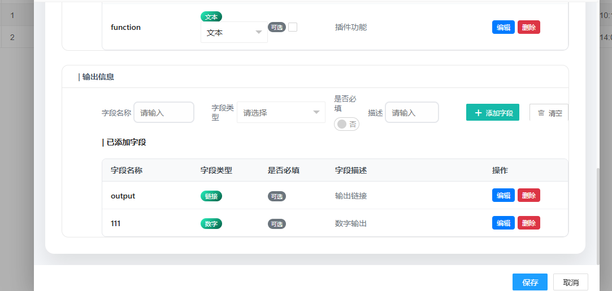
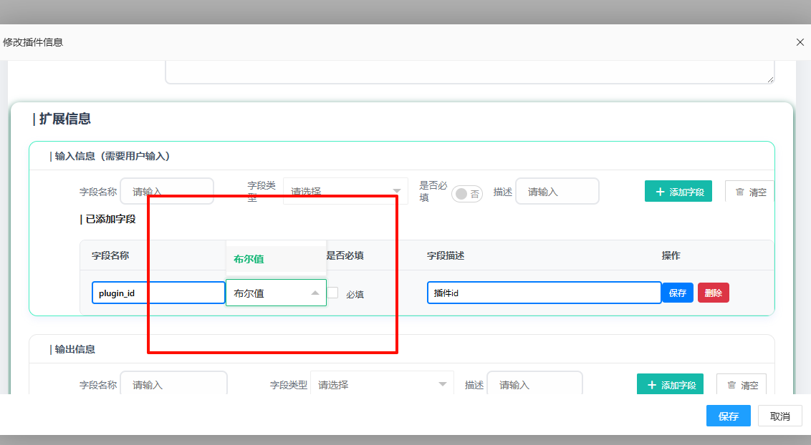
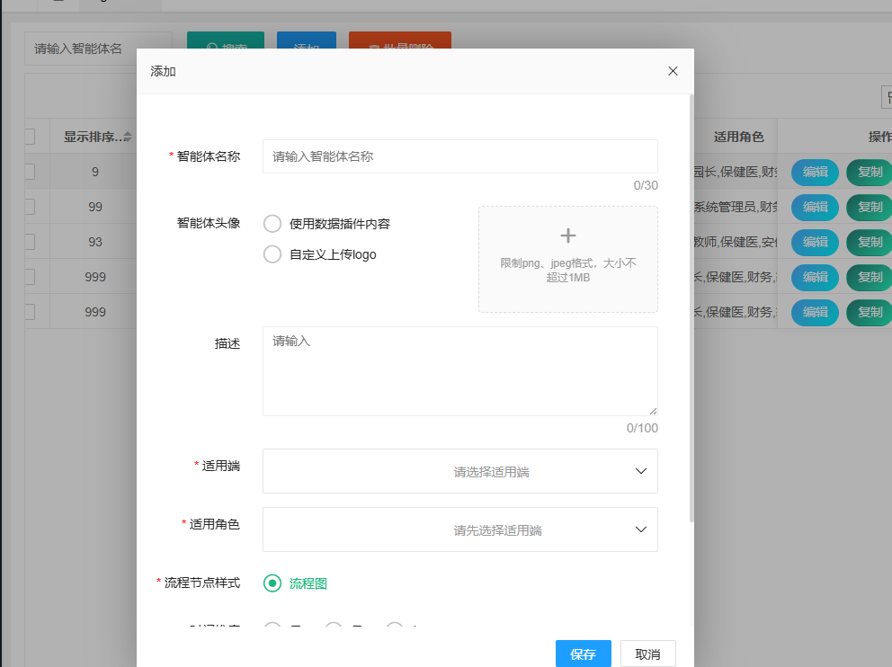
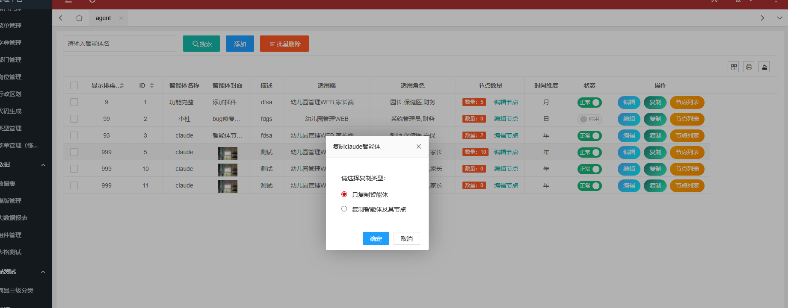
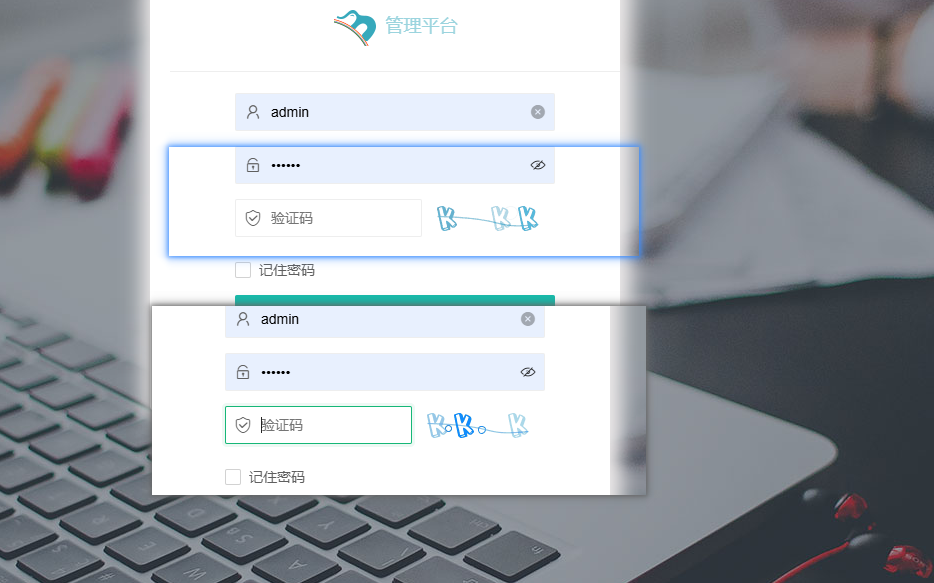

# BUG修复

## 1、节点展开修复

在02中我们虽然实现了展开，而且展开后的详情是进入到新的页面当中的，但是存在一个比较严重的问题，展开后节点对应的详细信息是没有在按钮下，主要是计算得到的坐标是错误的，每次计算得到的位置坐标都是一个且唯一，而画布的宽度和高度是按照百分比去实现的


展开位置得到了修复，能够在点击展开动态的显示在节点下，但是出现了一个问题，如果将iframe设置的高度为100vh,虽然节点对应的插件信息卡片展示出来了：


但是有很明显的遮罩，这个是因为设置了高度，但是由于iframe跨页面自适应不太好处理，

想到的解决方案是：

**根据没有数据的时候的高度去设置一个最小的高度，如果有内容就采取滑动如下：**

**再加上原本的收起和添加时跨页面的，所因此考虑不要底部的添加和收起按钮了**

最后的效果：


### 页面浅浅美化


## 2、添加、编辑插件

这个页面是通过layer.open 进来的，在父页面已经有了保存和取消按钮，因此这个页面就不需要了保存和取消按钮，其次在类型选择后添加一个是否必填的按钮，注意不要影响其他的样式，其次我想将添加好的字段展示为列表，并在每一个字段右边有编辑和删除，类似列表那样


这里面使用的是自定义验证去验证表单的字段是否满足，但是layui的form自带的有表单的字段验证，现在我想在保留原来的功能的基础上去改写这两个文件，要求就是修改为form表单验证，其次由于提交的form表单字段在js文件当中比较分散，所以我想要优化，使其比较集中，方便后续的管理，对于数据类型的选择，我希望在js中实现，而不是直接写死，logo并不需要一定填写，这个页面是通过layer.open 进来的，在父页面已经有了保存和取消按钮，因此这个页面就不需要了保存和取消按钮，需要一个隐式的按钮(<div style="display: none;">     <div class="layui-input-block">         <a id="saveOK" class="layui-btn" lay-submit="lay-submit">提交</a>     </div> </div>),在js中进行保存，其次在扩展信息中的类型选择后添加一个是否必填的按钮，注意不要影响其他的样式，其次我想将添加好的字段展示为列表，并在每一个字段右边有编辑和删除，类似列表那样，编辑并不是弹出框去编辑，而是将添加的字段设置为可编辑的。也就是原有的渲染字段的地方变为输入框或者按钮，鼠标点击别的地方后字段保存


### 优化点

1、目前实现的使用的是自定义的验证，这样就导致了和点击保存的时候冲突很高，能验证，但是关闭不了弹出层，要想关闭按照之前的页面经历就需要使用form表单自带的验证，在父页面就可以保存前验证了

2、现在实现的地方存在不少问题，提交的表单数据比较分散，需要优化，这样就可以不影响别的方法，

3、按照原型图的设计，还需要添加的字段做列表，根据添加时候的字段为表头，对添加的字段可以编辑和删除，编辑就是在单元格直接 编辑字段


点击编辑后  phone变为可编辑的

### 暂时实现的


页面需要补足的地方：

回显的时候效果应该是：



点击编辑的时候：


**这才是应该实现的效果，但是最开始渲染的时候怎么可能是刚点进去的时候的样子，需要修复**

------

还需要修复的地方，

应该只保留下面的部分，，，，，


### 页面是有了，提交没反应


提交有问题 ，相关的bug 已经放在了 `plugin_add_edit.js` 文件当中，明日待修复


改不完的BUG

#### bug代码

```js
/**
 * 插件表单处理 - 优化版本
 * 作者：龚喜
 * 时间：2025-08-25
 * 优化内容：
 * 1. 使用Layui表单验证替代自定义验证
 * 2. 集中管理表单字段配置
 * 3. 动态生成数据类型选择
 * 4. 列表式字段展示，支持在线编辑
 * 5. 添加必填字段选择功能
 */

require.config({
    paths: {
        jquery: '../../sys/jquery',
        system: '../../sys/system',
        layui: "../../layui-btkj/layui",
        layuicommon: "../../sys/layuicommon",
    },
    shim: {
        "system": {
            deps: ["jquery"]
        },
        "layui": {
            deps: ["jquery", "system"]
        },
        "layuicommon": {
            deps: ["jquery", "layui"]
        }
    },
    waitSeconds: 0
});

// 全局配置对象 - 集中管理所有配置
const CONFIG = {
    // 插件类型配置
    pluginTypes: [
        {
            id: "1",
            name: "superlink",
            title: "超链接",
            icon: "fas fa-link",
            placeholder: "请输入链接地址，如：https://example.com"
        },
        {
            id: "2",
            name: "http",
            title: "HTTP请求",
            icon: "fas fa-globe",
            placeholder: "请输入API接口地址，如：https://api.example.com/data"
        },
        {
            id: "3",
            name: "code",
            title: "代码块",
            icon: "fas fa-code",
            placeholder: "请输入代码块，支持多种编程语言"
        },
        {
            id: "4",
            name: "function",
            title: "函数",
            icon: "fas fa-function",
            placeholder: "请输入函数定义或函数调用代码"
        }
    ],

    // 字段类型配置
    fieldTypes: {
        input: [
            { value: "text", label: "文本" },
            { value: "number", label: "数字" },
            { value: "date", label: "日期" },
            { value: "email", label: "邮箱" },
            { value: "url", label: "链接" },
            { value: "boolean", label: "布尔值" }
        ],
        output: [
            { value: "text", label: "文本" },
            { value: "number", label: "数字" },
            { value: "date", label: "日期" },
            { value: "email", label: "邮箱" },
            { value: "url", label: "链接" },
            { value: "boolean", label: "布尔值" },
            { value: "array", label: "数组" },
            { value: "object", label: "对象" }
        ]
    },

    // 表单验证规则
    validators: {
        plugin_name: function(value) {
            if (!value || value.trim() === '') {
                return '请输入插件名称';
            }
            if (value.length > 30) {
                return '插件名称不能超过30个字符';
            }
            return '';
        },
        http_content: function(value) {
            if (!CONFIG.utils.isValidUrl(value)) {
                return '请输入有效的HTTP请求路径';
            }
            return '';
        }
    },

    // 工具函数
    utils: {
        isValidUrl: function(string) {
            try {
                new URL(string);
                return true;
            } catch (_) {
                return false;
            }
        },

        getTypeLabel: function(type) {
            const allTypes = [...CONFIG.fieldTypes.input, ...CONFIG.fieldTypes.output];
            const typeObj = allTypes.find(t => t.value === type);
            return typeObj ? typeObj.label : type;
        }
    }
};

// 数据管理对象
let objdata = {
    selectType: "superlink",
    imageUrl: "",
    inputFields: [],
    outputFields: [],
    editingField: null // 当前编辑的字段信息 {type, index}
};

require(["jquery", "system", 'layui', 'layuicommon'], function () {
    layui.use(['form', 'layer', 'upload'], function () {
        let form = layui.form;
        let layer = layui.layer;
        let upload = layui.upload;

        // 初始化表单
        initForm();

        // 初始化上传
        initUpload();

        // 绑定事件
        bindEvents();

        // 初始化字段类型选择
        initFieldTypeSelects();

        // 如果是编辑模式，加载数据
        if (Arg("type") === "update" && Arg("id") !== "") {
            loadPluginData();
        }

        /**
         * 初始化表单 - 使用Layui表单验证
         */
        function initForm() {
            // 自定义验证规则
            form.verify({
                plugin_name: function(value) {
                    return CONFIG.validators.plugin_name(value);
                },
                http_content: function(value, item) {
                    const pluginType = $('input[name="plugin_type"]:checked').val();
                    if (pluginType === 'http') {
                        return CONFIG.validators.http_content(value);
                    }
                    return '';
                }
            });

            form.render();

            // 监听单选框变化
            form.on('radio(pluginType)', function(data) {
                objdata.selectType = data.value;
                updateContentPlaceholder(data.value);
            });

            // 监听表单提交
            form.on('submit(pluginSubmit)', function(data) {
                submitForm();
                return false;
            });

            // 字符计数器
            $('input[name="plugin_name"]').on('input', function() {
                updateCharCounter($(this), 30, '#nameCounter');
            });
        }

        /**
         * 初始化上传组件
         */
        function initUpload() {
            upload.render({
                elem: '.upload-area-compact',
                url: getUploadUrl(),
                accept: 'images',
                acceptMime: 'image/png,image/jpg,image/jpeg',
                size: 1024,
                before: function(obj) {
                    layer.load();
                },
                done: function(res) {
                    layer.closeAll('loading');
                    if ((res.code === 0 || res.status === 'success') && res.data) {
                        objdata.imageUrl = res.data.url || res.data.path || res.data;
                        showPreview(objdata.imageUrl);
                        layer.msg('Logo上传成功', {icon: 1});
                    } else {
                        const errorMsg = res.msg || res.message || '上传失败';
                        layer.msg('上传失败：' + errorMsg, {icon: 2});
                    }
                },
                error: function() {
                    layer.closeAll('loading');
                    layer.msg('上传失败，请重试', {icon: 2});
                }
            });

            initDragUpload();
        }

        /**
         * 初始化字段类型选择器
         */
        function initFieldTypeSelects() {
            // 初始化输入字段类型
            let inputOptions = CONFIG.fieldTypes.input.map(type =>
                `<option value="${type.value}">${type.label}</option>`
            ).join('');
            $('#inputFieldType').html('<option value="">请选择</option>' + inputOptions);

            // 初始化输出字段类型
            let outputOptions = CONFIG.fieldTypes.output.map(type =>
                `<option value="${type.value}">${type.label}</option>`
            ).join('');
            $('#outputFieldType').html('<option value="">请选择</option>' + outputOptions);

            form.render('select');
        }

        /**
         * 绑定事件
         */
        function bindEvents() {
            // 添加字段按钮
            $("#addInputFieldBtn").click(function() {
                addInputField();
            });

            $("#addOutputFieldBtn").click(function() {
                addOutputField();
            });

            // 清空字段按钮
            $("#clearInputFieldsBtn").click(function() {
                clearFields('input');
            });

            $("#clearOutputFieldsBtn").click(function() {
                clearFields('output');
            });

            // 回车键添加字段
            $('#inputFieldName, #inputFieldDescription').keypress(function(e) {
                if (e.which === 13) {
                    e.preventDefault();
                    addInputField();
                }
            });

            $('#outputFieldName, #outputFieldDescription').keypress(function(e) {
                if (e.which === 13) {
                    e.preventDefault();
                    addOutputField();
                }
            });

            // 快捷键支持
            $(document).keydown(function(e) {
                if (e.ctrlKey && e.keyCode === 13) {
                    submitForm();
                }
            });

            // 点击其他地方保存编辑
            $(document).click(function(e) {
                if (objdata.editingField && !$(e.target).closest('.field-list-item').length) {
                    saveFieldEdit();
                }
            });
        }

        /**
         * 提交表单 - TODO 使用最底下的 TODO的验证方式 使用Layui验证,不要这种验证方式
         * TODO radio-item-dot没有动态的展示 pluginType里面的数据
         */
        function submitForm() {
            // 触发Layui表单验证
            $('button[lay-submit]').trigger('click');
        }

        /**
         * 获取表单数据 - 集中管理
         */
        function getFormData() {
            const formData = {
                plugin_name: $('input[name="plugin_name"]').val().trim(),
                plugin_type: $('input[name="plugin_type"]:checked').val(),
                content: $('textarea[name="content"]').val().trim(),
                logo: objdata.imageUrl,
                input: JSON.stringify(objdata.inputFields),
                output: JSON.stringify(objdata.outputFields)
            };

            // 如果是编辑模式，添加ID
            if (Arg("type") === "update") {
                formData.id = Arg("id");
            }

            return formData;
        }

        /**
         * 保存插件数据
         */
        function savePluginData(formData) {
            const isUpdate = Arg("type") === "update";
            const apiMethod = isUpdate ? "w_plugin.update" : "w_plugin.add";
            const apiParams = isUpdate ? [JSON.stringify(formData), $.msgwhere({id: [formData.id]})] : [JSON.stringify(formData)];

            console.log("没走？")
            $.sm((re, err) => {
                if (err) {
                    layer.msg(err, {icon: 2});
                } else {
                    const successMsg = isUpdate ? "插件更新成功！" : "插件添加成功！";
                    layer.msg(successMsg, {icon: 1});
                    // 刷新父页面或关闭弹窗的逻辑可以在这里添加
                }
            }, [apiMethod, ...apiParams]);
        }

        /**
         * 加载插件数据
         */
        function loadPluginData() {
            $.sm((re, err) => {
                if (err) {
                    layer.msg(err, {icon: 2});
                } else {
                    populateForm(re[0]);
                }
            }, ["w_plugin.selectById", $.msgwhere({id: [Arg("id")]})]);
        }

        /**
         * 填充表单数据
         */
        function populateForm(data) {
            // 填充基本信息
            $('input[name="plugin_name"]').val(data.plugin_name || '');
            $('textarea[name="content"]').val(data.content || '');

            // 设置单选框
            if (data.plugin_type) {
                $(`input[name="plugin_type"][value="${data.plugin_type}"]`).prop('checked', true);
                objdata.selectType = data.plugin_type;
                updateContentPlaceholder(data.plugin_type);
            }

            // 解析并设置字段数据
            if (data.input) {
                try {
                    const inputFields = typeof data.input === 'string' ? JSON.parse(data.input) : data.input;
                    objdata.inputFields = Array.isArray(inputFields) ? inputFields : [];
                    renderFieldList('input');
                } catch (e) {
                    console.warn('输入字段数据解析失败:', e);
                    objdata.inputFields = [];
                }
            }

            if (data.output) {
                try {
                    const outputFields = typeof data.output === 'string' ? JSON.parse(data.output) : data.output;
                    objdata.outputFields = Array.isArray(outputFields) ? outputFields : [];
                    renderFieldList('output');
                } catch (e) {
                    console.warn('输出字段数据解析失败:', e);
                    objdata.outputFields = [];
                }
            }

            // 设置logo
            if (data.logo) {
                objdata.imageUrl = data.logo;
                showPreview(data.logo);
            }

            // 更新字符计数器
            updateCharCounter($('input[name="plugin_name"]'), 30, '#nameCounter');

            // 重新渲染表单
            form.render();
        }

        /**
         * 添加输入字段
         */
        function addInputField() {
            const fieldData = getFieldInputData('input');
            if (!validateFieldData(fieldData)) {
                return;
            }

            // 检查是否已存在
            if (objdata.inputFields.some(field => field.name === fieldData.name)) {
                layer.msg('字段名称已存在', {icon: 2});
                return;
            }

            objdata.inputFields.push(fieldData);
            renderFieldList('input');
            clearFieldInputs('input');
            layer.msg('输入字段添加成功', {icon: 1});
        }

        /**
         * 添加输出字段
         */
        function addOutputField() {
            const fieldData = getFieldInputData('output');
            if (!validateFieldData(fieldData)) {
                return;
            }

            if (objdata.outputFields.some(field => field.name === fieldData.name)) {
                layer.msg('字段名称已存在', {icon: 2});
                return;
            }

            objdata.outputFields.push(fieldData);
            renderFieldList('output');
            clearFieldInputs('output');
            layer.msg('输出字段添加成功', {icon: 1});
        }

        /**
         * 获取字段输入数据
         */
        function getFieldInputData(fieldType) {
            const prefix = fieldType === 'input' ? 'input' : 'output';
            return {
                name: $(`#${prefix}FieldName`).val().trim(),
                type: $(`#${prefix}FieldType`).val(),
                required: $(`#${prefix}FieldRequired`).is(':checked'),
                description: $(`#${prefix}FieldDescription`).val().trim()
            };
        }

        /**
         * 验证字段数据
         */
        function validateFieldData(fieldData) {
            if (!fieldData.name || !fieldData.type) {
                layer.msg('请填写完整的字段信息', {icon: 2});
                return false;
            }
            return true;
        }

        /**
         * 渲染字段列表
         */
        function renderFieldList(fieldType) {
            const fields = fieldType === 'input' ? objdata.inputFields : objdata.outputFields;
            const container = `#${fieldType}FieldsList`;
            const listContainer = `${container} .field-list`;
            const emptyDiv = `${container} .field-list-empty`;

            if (fields.length === 0) {
                $(emptyDiv).show();
                $(listContainer).remove();
                return;
            }

            $(emptyDiv).hide();

            // 创建列表结构
            let listHtml = `
                <div class="field-list">
                    <div class="field-list-header">
                        <div class="col-name">字段名称</div>
                        <div class="col-type">字段类型</div>
                        <div class="col-required">是否必填</div>
                        <div class="col-description">字段描述</div>
                        <div class="col-actions">操作</div>
                    </div>
            `;

            fields.forEach((field, index) => {
                listHtml += `
                    <div class="field-list-item" data-type="${fieldType}" data-index="${index}">
                        <div class="col-name">
                            <span class="field-value" data-field="name">${field.name}</span>
                            <input type="text" class="field-edit-input" data-field="name" value="${field.name}" style="display:none;">
                        </div>
                        <div class="col-type">
                            <span class="field-type-tag field-value" data-field="type">${CONFIG.utils.getTypeLabel(field.type)}</span>
                            <select class="field-edit-select" data-field="type" style="display:none;">
                                ${getTypeOptionsHtml(fieldType, field.type)}
                            </select>
                        </div>
                        <div class="col-required">
                            <span class="field-value" data-field="required">
                                ${field.required ? '<span class="field-required-tag">必填</span>' : '<span class="field-optional-tag">可选</span>'}
                            </span>
                            <input type="checkbox" class="field-edit-input" data-field="required" ${field.required ? 'checked' : ''} style="display:none;">
                        </div>
                        <div class="col-description">
                            <span class="field-value" data-field="description">${field.description || '-'}</span>
                            <input type="text" class="field-edit-input" data-field="description" value="${field.description || ''}" style="display:none;">
                        </div>
                        <div class="col-actions">
                            <div class="field-actions-btn">
<!--                            todo 用户点击编辑 后可以编辑，但是按钮需要变为保存-->
                                <button type="button" class="field-edit-btn" onclick="editField('${fieldType}', ${index})">编辑</button>
                                <button type="button" class="field-delete-btn" onclick="deleteField('${fieldType}', ${index})">删除</button>
                            </div>
                        </div>
                    </div>
                `;
            });

            listHtml += '</div>';

            // 移除旧的列表，添加新的
            $(listContainer).remove();
            $(container).append(listHtml);
        }

        /**
         * 获取类型选项HTML
         */
        function getTypeOptionsHtml(fieldType, currentType) {
            const types = CONFIG.fieldTypes[fieldType];
            return types.map(type =>
                `<option value="${type.value}" ${type.value === currentType ? 'selected' : ''}>${type.label}</option>`
            ).join('');
        }

        /**
         * TODO 存在bug
         *  回显的时候渲染先展示了选择框，而不是在选择框部分回显对应选择的,
         *  需要点击多次编辑按钮 才能展示成想要的样子，layer显示的时间过长
         *
         */
        window.editField = function(fieldType, index) {
            // 保存之前的编辑
            if (objdata.editingField) {
                saveFieldEdit();
            }

            objdata.editingField = {type: fieldType, index: index};
            const item = $(`.field-list-item[data-type="${fieldType}"][data-index="${index}"]`);

            // 显示编辑控件，隐藏显示值
            item.find('.field-value').hide();
            item.find('.field-edit-input, .field-edit-select').show();
        };

        /**
         * 保存字段编辑
         */
        function saveFieldEdit() {
            if (!objdata.editingField) return;

            const {type, index} = objdata.editingField;
            const fields = type === 'input' ? objdata.inputFields : objdata.outputFields;
            const item = $(`.field-list-item[data-type="${type}"][data-index="${index}"]`);

            // 获取编辑后的值
            const newField = {
                name: item.find('input[data-field="name"]').val().trim(),
                type: item.find('select[data-field="type"]').val(),
                required: item.find('input[data-field="required"]').is(':checked'),
                description: item.find('input[data-field="description"]').val().trim()
            };

            // 验证数据
            if (!newField.name || !newField.type) {
                layer.msg('字段名称和类型不能为空', {icon: 2});
                return;
            }

            // 检查名称重复（排除自己）
            const duplicateIndex = fields.findIndex((field, idx) => field.name === newField.name && idx !== index);
            if (duplicateIndex !== -1) {
                layer.msg('字段名称已存在', {icon: 2});
                return;
            }

            // 更新数据
            fields[index] = newField;
            objdata.editingField = null;

            // 重新渲染列表
            renderFieldList(type);

            layer.msg('字段更新成功', {icon: 1});
        }

        /**
         * 删除字段
         */
        window.deleteField = function(fieldType, index) {
            layer.confirm('确定要删除这个字段吗？', function(layerIndex) {
                const fields = fieldType === 'input' ? objdata.inputFields : objdata.outputFields;
                fields.splice(index, 1);
                renderFieldList(fieldType);
                layer.msg('字段已删除', {icon: 1});
                layer.close(layerIndex);
            });
        };

        /**
         * 清空字段
         */
        function clearFields(fieldType) {
            const fields = fieldType === 'input' ? objdata.inputFields : objdata.outputFields;
            if (fields.length === 0) {
                layer.msg('没有可清空的字段', {icon: 2});
                return;
            }

            layer.confirm('确定要清空所有字段吗？', function(layerIndex) {
                if (fieldType === 'input') {
                    objdata.inputFields = [];
                } else {
                    objdata.outputFields = [];
                }
                renderFieldList(fieldType);
                layer.msg('字段已清空', {icon: 1});
                layer.close(layerIndex);
            });
        }

        /**
         * 清空字段输入框
         */
        function clearFieldInputs(fieldType) {
            const prefix = fieldType === 'input' ? 'input' : 'output';
            $(`#${prefix}FieldName`).val('');
            $(`#${prefix}FieldType`).val('');
            $(`#${prefix}FieldRequired`).prop('checked', false);
            $(`#${prefix}FieldDescription`).val('');
            form.render();
        }

        /**
         * 工具函数
         */
        function getUploadUrl() {
            if (typeof window.uploadConfig !== 'undefined' && window.uploadConfig.url) {
                return window.uploadConfig.url;
            }
            return '/api/upload';
        }

        function updateContentPlaceholder(type) {
            const pluginType = CONFIG.pluginTypes.find(t => t.name === type);
            const placeholder = pluginType ? pluginType.placeholder : '请输入内容...';
            $('textarea[name="content"]').attr('placeholder', placeholder);
        }

        function updateCharCounter($input, maxLength, counterSelector) {
            const currentLength = $input.val().length;
            $(counterSelector).text(currentLength);

            if (currentLength > maxLength * 0.8) {
                $(counterSelector).addClass('warning');
            } else {
                $(counterSelector).removeClass('warning');
            }
        }

        function showPreview(imageUrl) {
            $('#previewImage').attr('src', imageUrl);
            $('#uploadPreview').show();
        }

        function initDragUpload() {
            const uploadArea = document.querySelector('.upload-area-compact');
            if (!uploadArea) return;

            uploadArea.addEventListener('dragover', function(e) {
                e.preventDefault();
                e.stopPropagation();
                uploadArea.style.borderColor = '#667eea';
                uploadArea.style.background = 'linear-gradient(135deg, #f0f4ff 0%, #e0e7ff 100%)';
            });

            uploadArea.addEventListener('dragleave', function(e) {
                e.preventDefault();
                e.stopPropagation();
                uploadArea.style.borderColor = '#d1d5db';
                uploadArea.style.background = 'linear-gradient(135deg, #f8fafc 0%, #f1f5f9 100%)';
            });

            uploadArea.addEventListener('drop', function(e) {
                e.preventDefault();
                e.stopPropagation();
                uploadArea.style.borderColor = '#d1d5db';
                uploadArea.style.background = 'linear-gradient(135deg, #f8fafc 0%, #f1f5f9 100%)';

                const files = e.dataTransfer.files;
                if (files.length > 0) {
                    const file = files[0];
                    if (file.type.startsWith('image/')) {
                        const fileInput = document.getElementById('logoFile');
                        fileInput.files = files;
                        fileInput.dispatchEvent(new Event('change'));
                    } else {
                        layer.msg('请上传图片文件', {icon: 2});
                    }
                }
            });
        }

        // 保留供外部调用的函数
        window.submitForm = function() {
            submitForm();
        };

        // 提交表单数据
        $('#saveOK').click(function() {
            /* TODO 表单提交处理 bug
                提交并没有请求接口  savePluginData中的打印也没有执行
                点击提交会多次验证，也就是在验证的打印会执行很多遍
            */

            form.on('pluginForm', function(data) {
                console.log('提交表单数据：', data.field);
                const formData = getFormData();
                savePluginData(formData);
                return false;
            });
        });

    });
});
```

#### 代码修复1.0

修复效果：

添加字段和删除以及保存插件现在没啥大问题了，但是编辑还有问题


编辑修复



虽然添加了类型选择和是否必填，**但是样式层级有问题下午修复**


------

# 需求变更

## 智能体添加


那就修改吧！



### 智能体复制



现在实现的是智能体的复制，但是节点部分的批量插入还没有做，需要做一个更加快捷高效的消息，这部分需要查看whoami3版本的文档  批量插入的速度是很快的，而且降低数据库的压力！！！


# 明日待做

**搜索完善与优化**   ✔

**根据原型图规范展示的表格** ✔

## **智能体及其节点复制**   ✔

目前节点复制的思想是：通过先复制智能体，往w_agent表里面插入一条数据
如果要复制其节点，往w_agent表里面插入的数据的时候，拿到返回的id 

然后将节点列表里面的agent_id 全部替换为得到的 id，然后使用循环将节点插入到w_agent_node表里面

此时就忽略了一个问题，由于原本的nodeList 里面的单个对象的parent_id没有变化，就导致了，虽然节点确实复制了，但是各个节点之间的父子关系就错了

### 复制节点二次实现

针对上面的问题，考虑的是使用ID映射重建关系

**核心思想：**

1. **ID映射重建关系**：由于数据库自动生成新ID，必须建立新旧ID的映射关系来维护父子关系
2. **层级顺序插入**：按照父→子的顺序插入，确保引用的父节点ID已经存在
3. **动态更新引用**：在插入每个节点前，将其parent_id更新为新的父节点ID

**处理流程：**

```
原始数据 → 清洗数据 → 层级排序 → 逐个插入 → 更新映射 → 维护关系
```

#### 主要缺点

1. 与数据库交互的次数过多  2 + N(表示节点的数量)
2. 映射关系是放在内存中的，如果节点数量特别多，且关系复杂的话，可能会出现异常

#### 使用版本核心代码

```js
     function copyAgentFunc(agentId, agentName) {
            // 弹出选择框，让用户选择复制类型
            let content = `
                <div style="padding: 20px;">
                    <p style="margin-bottom: 15px;">请选择复制类型：</p>
                    <div>
                        <label style="display: block; margin-bottom: 10px; cursor: pointer;">
                            <input type="radio" name="copyType" value="agent" checked style="margin-right: 8px;">
                            只复制智能体
                        </label>
                        <label style="display: block; cursor: pointer;">
                            <input type="radio" name="copyType" value="all" style="margin-right: 8px;">
                            复制智能体及其节点
                        </label>
                    </div>
                </div>
            `;

            layer.confirm(content, {
                title: '复制' + agentName + '智能体',
                btn: ['确定', '取消'],
                btn1: function(index, layero) {
                    let selectedType = $(layero).find('input[name="copyType"]:checked').val();
                    layer.close(index);

                    if (selectedType) {
                        copyAgent(agentId, selectedType);
                    } else {
                        layer.msg('请选择复制类型');
                    }
                }
            });
        }

        async function copyAgent(agentId, type) {
            try {
                const loadingMsg = type === 'all' ? '正在复制智能体及其节点...' : '正在复制智能体...';
                layer.msg(loadingMsg);

                // 获取智能体数据
                const agentData = await new Promise((resolve, reject) => {
                    $.sm(function (re, err) {
                        if (err) {
                            reject(new Error('获取智能体数据失败：' + err));
                        } else {
                            resolve(re[0]);
                        }
                    }, ["w_agent.selectById", $.msgwhere({id: [agentId]})]);
                });

                if (!agentData) {
                    layer.msg('智能体数据为空，无法复制');
                    return;
                }

                // 清洗智能体数据，清除原有的id、创建时间和更新时间
                const cleanAgentData = {...agentData};
                delete cleanAgentData.id;
                delete cleanAgentData.creatime;
                delete cleanAgentData.altime;

                if (type === 'agent') {
                    // 只复制智能体
                    await new Promise((resolve, reject) => {
                        $.sm(function (re, err) {
                            if (err) {
                                reject(new Error('插入智能体失败：' + err));
                            } else {
                                resolve(re);
                            }
                        }, ["w_agent.add", JSON.stringify(cleanAgentData)]);
                    });

                    layer.msg('复制智能体成功');
                    table.reload('agentTable');
                } else {
                    // 复制智能体及其节点
                    await copyAgentWithNodes(cleanAgentData, agentId);
                }

            } catch (error) {
                layer.msg('复制失败：' + error.message);
                console.error('复制错误：', error);
            }
        }

        async function copyAgentWithNodes(cleanAgentData, originalAgentId) {
            try {
                // 获取节点数据
                const nodeList = await new Promise((resolve, reject) => {
                    $.sm(function (re, err) {
                        if (err) {
                            reject(new Error('获取节点数据失败：' + err));
                        } else {
                            resolve(re || []);
                        }
                    }, ["w_agent_node.getCopyList", $.msgwhere({agent_id: [originalAgentId]})]);
                });

                if (!nodeList || nodeList.length === 0) {
                    layer.msg('节点数据为空，请先添加节点或者只复制智能体');
                    return;
                }

                // 插入智能体，获取新的智能体ID
                const newAgentId = await new Promise((resolve, reject) => {
                    $.sm(function (re, err) {
                        if (err) {
                            reject(new Error('插入智能体失败：' + err));
                        } else {
                            resolve(re);
                        }
                    }, ["w_agent.add", JSON.stringify(cleanAgentData)]);
                });
                
                // 关键修复：使用正确的树形遍历算法
                const sortedNodes = buildCorrectNodeHierarchy(nodeList);
   
                const oldToNewIdMap = new Map(); // 旧节点ID -> 新节点ID的映射
                let insertedCount = 0;

                // 按正确顺序插入节点
                for (const nodeData of sortedNodes) {
                    // 更新agent_id
                    nodeData.agent_id = newAgentId;

                    // 关键修复：正确更新parent_id
                    let newParentId = null;
                    if (nodeData.parent_id) {
                        if (oldToNewIdMap.has(nodeData.parent_id)) {
                            newParentId = oldToNewIdMap.get(nodeData.parent_id);
                        } else {
                            newParentId = null;
                        }
                    }
                    nodeData.parent_id = newParentId;

                    // 移除临时字段
                    const cleanNode = {...nodeData};
                    delete cleanNode.originalId;

                    // 插入节点
                    try {
                        const newNodeId = await new Promise((resolve, reject) => {
                            $.sm(function (re, err) {
                                if (err) {
                                    reject(new Error('插入节点失败：' + err));
                                } else {
                                    resolve(re);
                                }
                            }, ["w_agent_node.add", JSON.stringify(cleanNode)]);
                        });

                        // 建立映射关系
                        oldToNewIdMap.set(nodeData.originalId, newNodeId);

                        insertedCount++;

                    } catch (error) {
                        // console.error('插入节点失败:', error);
                        throw error;
                    }
                }

                layer.msg('复制智能体及其节点成功');
                table.reload('agentTable');

            } catch (error) {
                console.error('复制失败:', error);
                throw new Error('复制智能体及节点失败：' + error.message);
            }
        }

        //TODO 正确的树形结构层级排序算法 深度优先搜索  DFS 还真是他乡遇故知啊
        function buildCorrectNodeHierarchy(nodeList) {

            // 1. 预处理：清洗数据并添加原始ID标记
            const processedNodes = nodeList.map(node => {
                const cleanNode = {...node};
                const originalId = node.id;

                // 清洗字段
                delete cleanNode.id;
                delete cleanNode.creatime;
                delete cleanNode.altime;

                // 添加原始ID标记
                cleanNode.originalId = originalId;

                return cleanNode;
            });

            // 2. 建立父子关系映射
            const nodeMap = new Map();
            const childrenMap = new Map();

            processedNodes.forEach(node => {
                nodeMap.set(node.originalId, node);
                if (!childrenMap.has(node.originalId)) {
                    childrenMap.set(node.originalId, []);
                }
            });

            // 建立子节点列表
            processedNodes.forEach(node => {
                if (node.parent_id) {
                    if (!childrenMap.has(node.parent_id)) {
                        childrenMap.set(node.parent_id, []);
                    }
                    childrenMap.get(node.parent_id).push(node.originalId);
                }
            });

            console.log('父子关系映射:', Object.fromEntries(childrenMap));

            // 3. 找出所有根节点（没有父节点或父节点不存在的节点）
            const rootNodes = processedNodes.filter(node => {
                const hasParent = node.parent_id && nodeMap.has(node.parent_id);
                const isRoot = !hasParent;
                if (isRoot) {
                    console.log(`根节点: ${node.originalId} (${node.name || 'unnamed'})`);
                }
                return isRoot;
            });

            // 4. 使用深度优先遍历构建正确的层级顺序
            const result = [];
            const visited = new Set();

            // 递归去处理节点关系
            function dfsTraversal(nodeId, level = 0) {
                if (visited.has(nodeId)) {
                    // console.warn(`节点 ${nodeId} 已访问过，可能存在循环引用`);
                    return;
                }

                visited.add(nodeId);
                const node = nodeMap.get(nodeId);
                if (node) {
                    // console.log(`${'  '.repeat(level)}处理节点: ${nodeId} (${node.name || 'unnamed'}) level=${level}`);
                    result.push(node);

                    // 递归处理子节点
                    const children = childrenMap.get(nodeId) || [];
                    children.forEach(childId => {
                        dfsTraversal(childId, level + 1);
                    });
                }
            }

            // 从每个根节点开始遍历
            rootNodes.forEach(rootNode => {
                // console.log(`\n开始遍历根节点树: ${rootNode.originalId}`);
                dfsTraversal(rootNode.originalId);
            });

            // 5. 处理孤立节点（理论上不应该存在，但防御性处理）
            const orphanNodes = processedNodes.filter(node => !visited.has(node.originalId));
            if (orphanNodes.length > 0) {
                result.push(...orphanNodes);
            }

            return result;
        }
```


### 复制节点优化

这个的话看后续节点数量是否很多，因为


**搜索完善与优化** 

**根据原型图规范展示的表格**

**解决在没有节点的情况下，添加节点刷新不显示节点的bug!!**


------

好家伙，4个k的验证码也是让我遇着了



------


