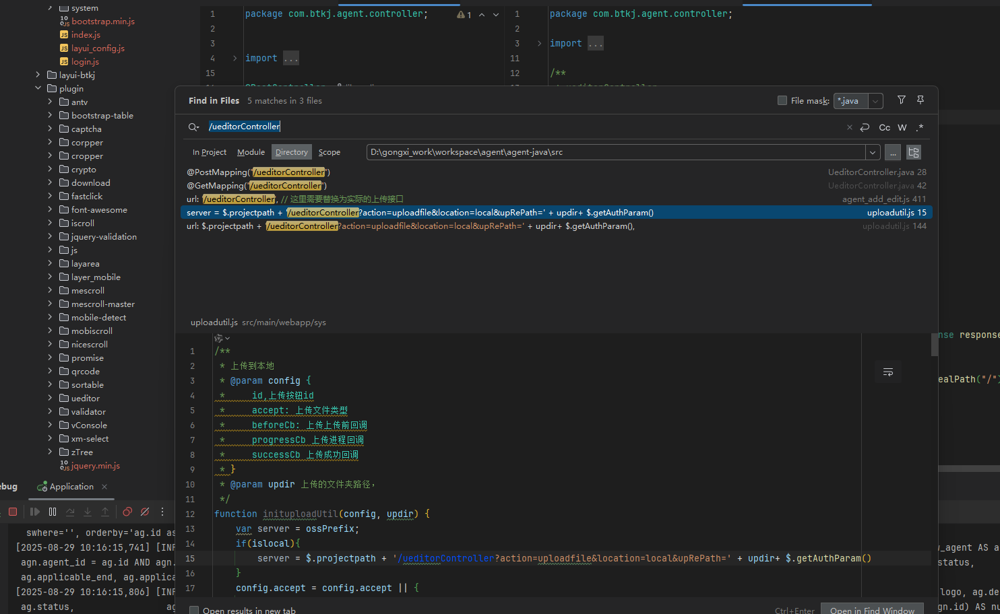
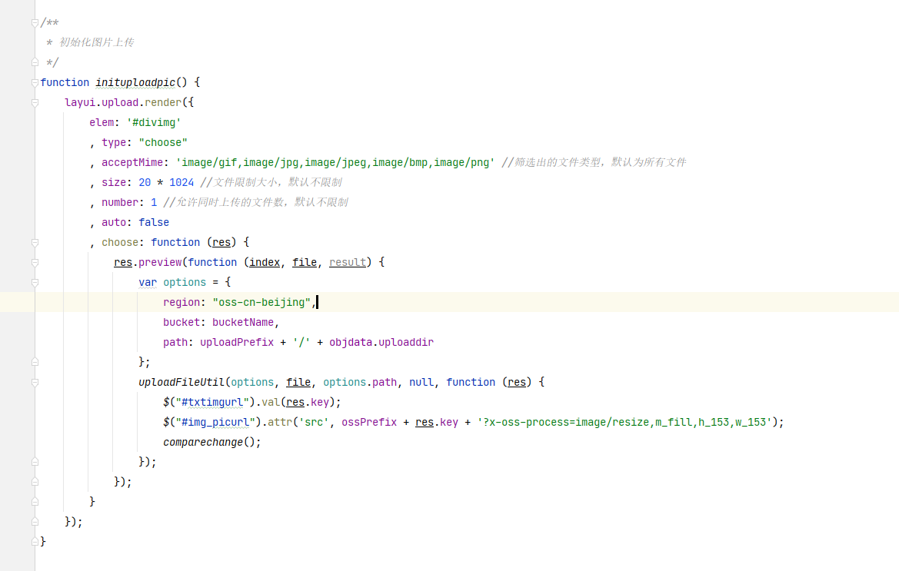
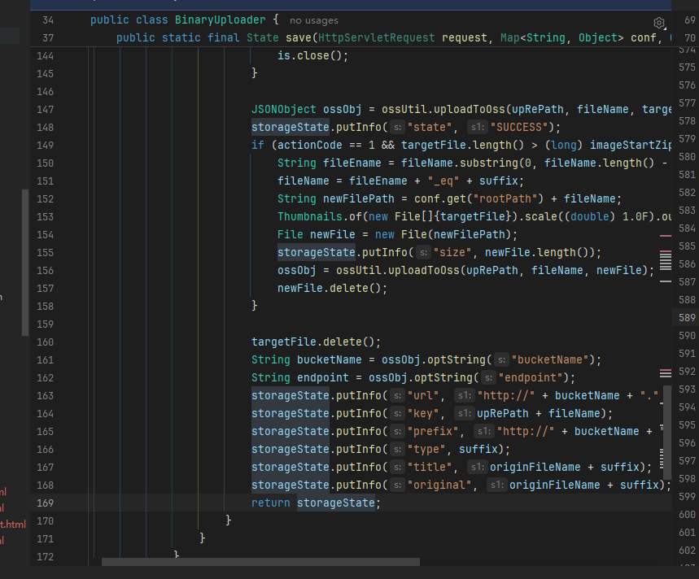

# Logo上传

不知道有没有现成的接口,通过提供过来的spring-boot-admin 测试项目 
发现，对于上传貌似都没有封装好相应的接口

看提供的文档里面也没有相应的介绍，需要问一下李总

是自己写接口，然后将文件使用流的方式去存储到某个文件夹下呢？还是？

正常的情况下，上传文件，

按照现在的逻辑上传成功是会返回部分文件信息，然后去渲染的

需要去询问一下大佬了，😔

通过询问，了解到前端是有专门的工具类去接收的  uploadutil.js

该工具类中有一个方法   uploadFileUtil 用的是别的方法

```js
/**
 * 上传file
 * @param options oss配置
 * @param islocal 是否上传到本地
 * @param file 上传的文件
 * @param updir 保存到的文件夹
 * @param cb 上传完回调
 */
function uploadFileUtil(options, file, updir, progressCb, cb) {....}
```



目前就知道在工具类中调用到了，但是对应的方法却没有被调用过

现在不好操作的地方就是  uploadUtil组件   与  layui中的 upload组件  有小冲突


不知该如何修改



按照上面的去实现，发现一直都出一个问题   <font color="red">未找到上传数据</font>

这就真不知道如何解决了   啊西巴

同样的代码，在飞哥那边没问题，在自己电脑这里传不了

## logo上传

编辑回显   展示logo  待补充

> 疑问点： 使用一样的工具类，为什么上传不成功？？？
>
> 使用oss传递文件到文件服务器

通过查看ueditorController  接口  这是前端上传工具类请求的接口，我们在后端查看相应的返回值后


如图中的返回值，必定含有上传成功的url链接，然后我们在前端上传成功后得到cb(re)

而re 中含有url   给到我们要传递的地址即可


## 小bug

使用layuitable类型的时候使用了group by 去分组拿到节点数量没问题  因为一开始没有条件

此时，添加搜索功能  传递了参数  出现了错误  ，因为where出现在了gruop by 之后

```xml
<msg id="w_agent.getList" type="layuitable"
     v="ag.id, ag.agent_name, ag.logo, ag.description, ag.function_type, ag.status,
        ag.display_format, ag.applicable_end, ag.applicable_role, ag.time_granularity,
        ag.creatime, ag.altime, ag.display_sort, count(agn.id) AS num
        %16 w_agent AS ag left join w_agent_node AS agn on agn.agent_id = ag.id AND agn.isdel = 0
        %16 ag.isdel = 0
        GROUP BY ag.id, ag.agent_name, ag.logo, ag.description, ag.function_type, ag.status,
        ag.display_format, ag.applicable_end, ag.applicable_role, ag.time_granularity,
        ag.creatime, ag.altime, ag.display_sort">
    <where idx="laywhere">
        <p key="agentName">and ag.agent_name like '%{0}%'</p>
        <p key="status">and ag.status = {0}</p>
    </where>
</msg>
```

上面的问题要想和group by结合时，就必须要在where子句之前，但是这部分不太会加  ？？？？

需要去看看文档


# Bug修复

## 节点回显

原始的父节点id 我想着比较多，就设置为输入的方式，但是原型提供的是下拉框，那就只能修改了

这次使用批量发送消息的方式去一次获得数据

**节点列表封面显示有问题**

## 智能体回显

回显保存的时候，封面必须选择一个才能提交，否则也没有显示，理想的效果应该是，编辑根据得到的logo 是否为纯数字  

现在的回显是有问题的，根据logo的值的类型来专门回显

## html节点

1. 问题1：初始没有节点的时候，在工具栏添加按钮点击添加节点后，画布没有显示，刷新也没有用

   通过对原有的渲染G6图标的js文件进行分析得到了

   > 我们在初始化页面的时候，会先loadAllNodeData  加载节点数据并渲染，但是没有数据的时候就直接给返回了
   >
   > ```
   > hideLoading();
   > if (!objdata.nodeRelationDataHTML || objdata.nodeRelationDataHTML.nodes.length === 0) {
   >     showEmptyState();
   >     return;
   > }
   > ```

2. 问题2：在展开编辑保存提交后，关闭了所有的弹窗，理论上应该是刷新画布

经历这么多次的调整和修改，代码结构太差，需要重新调整一下！！！

处理一下得到logo为空的情况，同时添加或者更新节点信息的时候，如果选择了关联插件，那么单选框默认选择使用数据插件内容，回显部分也得优化一下代码结构，调整整体代码顺序，将角色数据配置和适用端配置以及选中的值，给我放到objdata中，使代码结构更流畅

## 展开后编辑插件，编辑成功后页面全部关了

经过很久的修复，可算解决了，

又是缝缝补补


