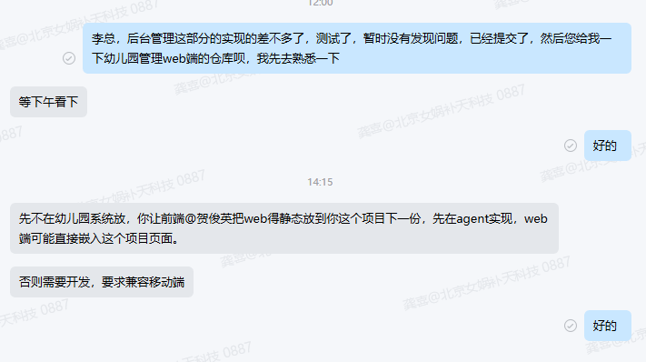
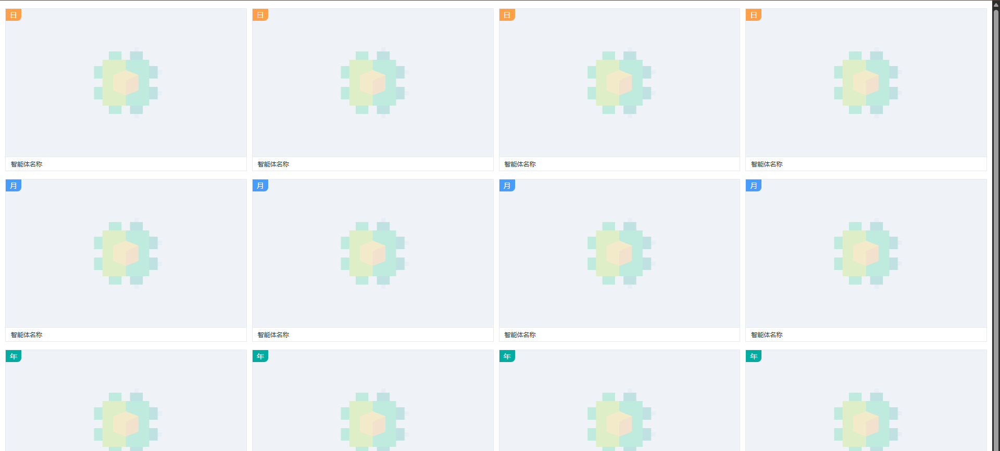
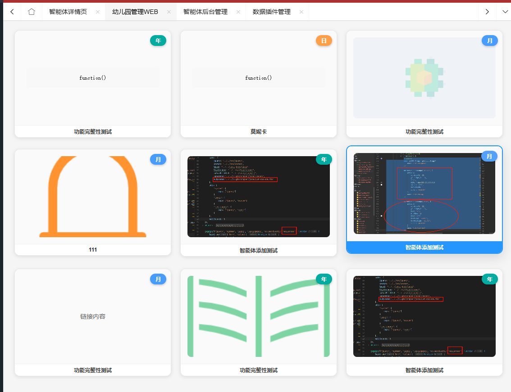
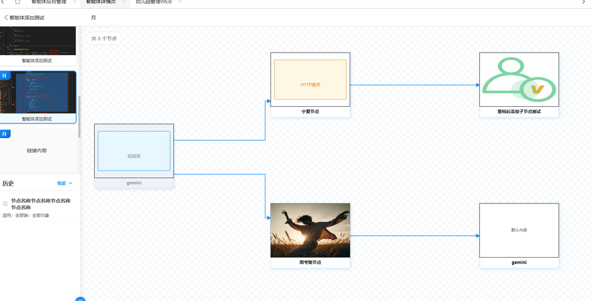
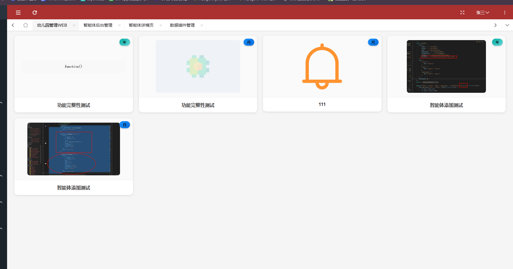

## 幼儿园管理端WEB



按照李总的说法，就是在agent-web新建web端的跳转页面，基于静态页面的样式和结构去开发

### 智能体列表页

#### 静态效果



#### 实现效果




### 智能体详情页


明天在补充一下,添加拖拽和

#### 代码留底

```js
/**
 * 作者：gongxi
 * 时间：2025-09-05
 * 智能体节点图表 - 优化版本
 */

require.config({
    paths: {
        jquery: '../../sys/jquery',
        system: '../../sys/system',
        layui: "../../layui-btkj/layui",
        layuicommon: "../../sys/layuicommon",
        g6: "../../plugin/antv/g6/g6.min"
    },
    shim: {
        "system": {
            deps: ["jquery"]
        },
        "layui": {
            deps: ["jquery", "system"]
        },
        "layuicommon": {
            deps: ["jquery", "layui"]
        },
        "g6": {
            deps: ["jquery"]
        }
    },
    waitSeconds: 0
});

objdata = {
    // 智能体ID
    agent_id: null,

    // 节点数据存储
    allNodeData: [],
    nodeRelationDataHTML: null,

    // 图表实例
    currentGraph: null,

    // 页面状态
    isLoading: false,
    isInitialized: false,

    // 拖拽状态控制
    isDragging: false,
    dragStartTime: 0,

    // 适用端配置（与agent_detail保持一致）
    applicable: {
        applicable_end: ['家长端'],
        applicable_role: ['家长']
    }
};

require(["jquery", "system", "layui"], function () {
    layui.use(['layer'], function () {
        // 初始化页面
        initNodeGraph();
        initEventListeners();
    });
});

/**
 * 初始化节点图表 - 主入口函数
 */
function initNodeGraph() {
    // 获取URL参数中的agent_id
    const agentId = Arg("agent_id") || Arg("id");

    if (!agentId) {
        showEmptyState('缺少必要参数：agent_id');
        return;
    }

    objdata.agent_id = agentId;

    // 加载节点数据
    loadNodeData();
}

/**
 * 加载节点数据 - 统一数据加载方式
 */
function loadNodeData() {
    showLoading();

    let data = {
        "agent_id": [objdata.agent_id]
    };

    $.sm(function (re, err) {
        if (err) {
            hideLoading();
            layer.msg(err);
            showEmptyState('加载节点数据失败，请重试');
        } else {
            // 将接口返回的数据赋值给变量
            objdata.allNodeData = re || [];
            // 准备关系数据并渲染图表
            prepareAndRenderGraph();
        }
    }, ["w_agent_node_plugin.getList", $.msgwhere(data)]);
}

/**
 * 准备数据并渲染图表
 */
function prepareAndRenderGraph() {
    // 准备节点关系数据
    objdata.nodeRelationDataHTML = prepareRelationDataHTML(objdata.allNodeData);

    hideLoading();

    if (!objdata.nodeRelationDataHTML || objdata.nodeRelationDataHTML.nodes.length === 0) {
        showEmptyState('该智能体暂无节点数据');
        return;
    }

    // 动态加载 G6 库并创建关系图
    require(['g6'], function(G6) {
        createNodeRelationGraph(G6, objdata.nodeRelationDataHTML);
        hideEmptyState();
        updateNodeCount();
        objdata.isInitialized = true;
    });
}

/**
 * 准备节点关系数据 - 保持与智能体展示效果一致
 */
function prepareRelationDataHTML(nodeList) {
    if (!nodeList || nodeList.length === 0) {
        return { nodes: [], edges: [] };
    }

    const nodes = [];
    const edges = [];
    const nodeMap = new Map();

    // 创建节点映射
    nodeList.forEach(node => {
        nodeMap.set(node.id, node);
    });

    // 生成节点数据 - 使用与智能体列表相同的展示逻辑
    nodeList.forEach(node => {
        const nodeName = node.node_name || `节点${node.id}`;

        nodes.push({
            id: node.id.toString(),
            label: nodeName,
            type: 'custom-node',
            size: [220, 180], //  TODO 增加高度以容纳logo
            style: {
                fill: 'transparent',
                stroke: 'transparent'
            },
            nodeData: node,
        });
    });

    // 生成边数据（基于parent_id关系）
    nodeList.forEach(node => {
        if (node.parent_id && node.parent_id !== '0' && nodeMap.has(parseInt(node.parent_id))) {
            edges.push({
                source: node.parent_id.toString(),
                target: node.id.toString(),
                type: 'cubic',  // TODO 贝塞尔曲线  可以换为别的线
                style: {
                    stroke: '#1890ff',
                    lineWidth: 2,
                    strokeOpacity: 0.8,
                    endArrow: {
                        path: 'M 0,0 L 8,4 L 8,-4 Z',  // 箭头
                        fill: '#1890ff',
                        strokeOpacity: 1
                    }
                }
            });
        }
    });

    return { nodes, edges };
}

/**
 * 创建节点关系图 - 优化版本
 */
function createNodeRelationGraph(G6, data) {
    const container = $('#nodeGraphContainer');

    // 销毁现有图表实例
    if (objdata.currentGraph && !objdata.currentGraph.destroyed) {
        objdata.currentGraph.destroy();
    }

    // 注册自定义节点 - 支持logo展示
    G6.registerNode('custom-node', {
        draw(cfg, group) {
            const nodeData = cfg.nodeData;
            const size = cfg.size || [220, 180];
            const width = size[0];
            const height = size[1];

            // 节点状态
            const isDisabled = nodeData.status !== 0;

            // 创建主容器
            const mainRect = group.addShape('rect', {
                attrs: {
                    x: -width / 2,
                    y: -height / 2,
                    width: width,
                    height: height,
                    fill: '#fff',
                    stroke: isDisabled ? '#ccc' : '#e8e8e8',
                    strokeWidth: 1,
                    cursor: 'pointer',
                    shadowColor: 'rgba(0,0,0,0.1)',
                    shadowBlur: 6,
                    shadowOffsetX: 2,
                    shadowOffsetY: 2,
                    radius: 4
                },
                name: 'main-rect'
            });

            // 内容区域 - 支持logo和文本内容
            const contentY = -height / 2  ;
            const titleHeight =  30;
            const contentHeight = height-titleHeight;


            group.addShape('rect', {
                attrs: {
                    x: -width / 2,
                    y: contentY,
                    width: width,
                    height: contentHeight,
                    stroke: '#0a0a0a', // 边框颜色
                    strokeWidth: 1, // 边框宽度
                    cursor: 'pointer',
                    textAlign: 'center',
                },
                name: 'content-bg'
            });

            if (nodeData.pld === 0 && nodeData.logo) {
                // 展示logo图片
                group.addShape('image', {
                    attrs: {
                        x: -width / 2,
                        y: contentY ,
                        width: width,
                        height: height -titleHeight,
                        img:  ossPrefix  + nodeData.logo,
                        cursor: 'pointer',
                        radius: 8,
                    },
                    name: 'logo-image'
                });

            } else {
                // TODO 这部分的内容也许还会变化，需要根据plugin_type 去改变显示的内容
                // plugin_type可能是 superlink,http,code,function
                switch (nodeData.plugin_type){
                    case 'superlink': // 超链接  如何处理？
                        // 相应的方法
                        break
                    case 'http':  // http 如何渲染http  假如是一个http页面，如何渲染 但是不需要相应的功能
                        break
                    case 'code':  // 代码
                        break
                    case 'function':  // 函数
                        break
                    default:
                        break
                }
                // 下面就表示默认的
                let displayText = '';
                if (nodeData.pld === 0) {
                    displayText = '默认内容';
                } else {
                    displayText = nodeData.content ?
                        (nodeData.content.length > 25 ? nodeData.content.substring(0, 25) + '...' : nodeData.content) :
                        '无内容';
                }

                group.addShape('text', {
                    attrs: {
                        x: 0,
                        y: contentY + contentHeight / 2,
                        text: displayText,
                        fontSize: 11,
                        fill: isDisabled ? '#999' : '#666',
                        textAlign: 'center',
                        textBaseline: 'middle',
                        cursor: 'pointer',
                        borderBottom: '1px solid #666',
                    },
                    name: 'content-text'
                });
            }

            // 节点名称
            group.addShape('rect', {
                attrs: {
                    x: -width / 2,
                    y: height / 2 - titleHeight,
                    width: width,
                    height: titleHeight,
                    cursor: 'pointer',
                },
                name: 'name-bg'
            });

            group.addShape('text', {
                attrs: {
                    x: 0,
                    y: height / 2 -titleHeight/2,
                    text: cfg.label,
                    fontSize: 12,
                    fontWeight: 'bold',
                    fill: '#0a0a0a',
                    textAlign: 'center',
                    textBaseline: 'middle',
                    cursor: 'pointer'
                },
                name: 'name-text'
            });

            return mainRect;
        }
    });

    // 创建 G6 图实例
    const graph = new G6.Graph({
        container: container[0],
        width: container[0].clientWidth || 800,
        height: container[0].clientHeight || 600,
        renderer: 'canvas',
        pixelRatio: window.devicePixelRatio || 2,
        modes: {
            default: [
                'drag-canvas',
                'zoom-canvas',
                'drag-node'
            ]
        },
        defaultNode: {
            type: 'html-node',
            size: [220, 120]
        },
        defaultEdge: {
            type: 'cubic-horizontal',
            style: {
                stroke: '#1890ff',
                lineWidth: 2,
                strokeOpacity: 0.8,
                endArrow: {
                    path: 'M 0,0 L 8,4 L 8,-4 Z',
                    fill: '#1890ff'
                }
            }
        },
        layout: {
            type: 'dagre',
            rankdir: 'LR', //TB 从上到下  LR 从左到右
            align: 'DL',
            nodesep: 80,
            ranksep: 120
        },
        fitView: true,
        fitViewPadding: [30, 30, 30, 30]
    });

    // 存储图表实例
    objdata.currentGraph = graph;

    // 绑定节点点击事件
    graph.on('node:click', function(e) {
        // 避免拖拽时触发点击
        if (objdata.isDragging) return;

        const nodeModel = e.item.getModel();
        console.log(nodeModel);
        /* todo nodeModel.nodeData 里面的 applicable_end和applicable_role是通过, 来连接的
            需要解析  然后与全局objdata中的applicable_end和applicable_role进行对比 来判断是否有权限点击
            有权限 点击后跳转到相应的页面  页面的路径来自  nodeModel中的nodeData.url
            无权限  节点显示灰色  不让点击

            还需要添加的内容，节点状态： 初始化的时候给每个节点添加一个蓝色的shadow  如果点击过就shadow就变为绿色

         */
        selectNode(nodeModel.nodeData, e.item);
    });

    // 渲染数据
    graph.data(data);
    graph.render();

    // 延迟执行自适应画布
    setTimeout(() => {
        if (graph && !graph.destroyed) {
            graph.fitView(30);
        }
    }, 300);

    // 响应式处理
    initGraphResize(graph);
}

/**
 * 选择节点 - 类似智能体选择逻辑
 */
function selectNode(nodeData, nodeItem) {
    console.log('选中节点:', nodeData);

    // 更新选中状态（如果需要的话）
    if (objdata.currentGraph) {
        // 重置所有节点样式
        objdata.currentGraph.getNodes().forEach(node => {
            objdata.currentGraph.updateItem(node, {
                style: {
                    stroke: '#e8e8e8',
                    strokeWidth: 1
                }
            });
        });

        // 高亮选中节点
        objdata.currentGraph.updateItem(nodeItem, {
            style: {
                stroke: '#1890ff',
                strokeWidth: 3
            }
        });
    }

    // 可以在这里添加更多的节点选择逻辑
    showNodeDetails(nodeData);
}

/**
 * 显示节点详情 - 可扩展功能后续看业务需不需要
 */
function showNodeDetails(nodeData) {

}

/**
 * 图表响应式处理
 */
function initGraphResize(graph) {
    const resizeHandler = () => {
        if (!graph || graph.destroyed) return;

        const container = $('#nodeGraphContainer')[0];
        if (!container || !container.clientWidth || !container.clientHeight) return;

        graph.changeSize(container.clientWidth, container.clientHeight);
        graph.fitView(30);
    };

    window.addEventListener('resize', resizeHandler);

    // 页面卸载时清理
    $(window).on('beforeunload', function() {
        window.removeEventListener('resize', resizeHandler);
        if (graph && !graph.destroyed) {
            graph.destroy();
        }
    });
}

/**
 * 初始化事件监听器
 */
function initEventListeners() {
    // 窗口大小改变时重新计算布局
    $(window).on('resize', function() {
        if (objdata.currentGraph && !objdata.currentGraph.destroyed) {
            const container = $('#nodeGraphContainer')[0];
            if (container) {
                objdata.currentGraph.changeSize(container.clientWidth, container.clientHeight);
                objdata.currentGraph.fitView(30);
            }
        }
    });

    // 刷新按钮事件
    $(document).on('click', '#refreshBtn', function() {
        if (objdata.agent_id) {
            loadNodeData();
        }
    });

    // 适应画布按钮事件
    $(document).on('click', '#fitViewBtn', function() {
        if (objdata.currentGraph && !objdata.currentGraph.destroyed) {
            objdata.currentGraph.fitView(30);
        }
    });
}

/**
 * 页面状态管理函数
 */

// 显示加载状态
function showLoading() {
    objdata.isLoading = true;
    $('#loadingOverlay').show();
}

// 隐藏加载状态
function hideLoading() {
    objdata.isLoading = false;
    $('#loadingOverlay').hide();
}

// 显示空状态
function showEmptyState(message = '暂无节点数据') {
    $('#emptyState').show();
    $('#emptyState .empty-text').text(message);
    updateNodeCount();
}

// 隐藏空状态
function hideEmptyState() {
    $('#emptyState').hide();
}

// 更新节点数量显示
function updateNodeCount() {
    const count = objdata.allNodeData ? objdata.allNodeData.length : 0;
    $('#nodeCount').text(`共 ${count} 个节点`);
}
```

#### 需要优化

目前实现的很难满足需求

> todo nodeModel.nodeData 里面的 applicable_end和applicable_role是通过, 来连接的
>             需要解析  然后与全局objdata中的applicable_end和applicable_role进行对比 来判断是否有权限点击
>             有权限 点击后跳转到相应的页面  页面的路径来自  nodeModel中的nodeData.url
>             无权限  节点显示灰色  不让点击
>
> ​            还需要添加的内容，节点状态： 初始化的时候给每个节点添加一个蓝色的shadow  如果点击过就shadow就变为绿色



------

## 目前的实现效果

智能体详情页和列表页实现了，但是




## 下周计划

1. 完成节点的历史点击，也就是用户点击的节点记录，需要创建新的表去存储是谁点击了节点  点击了那个节点
2. 询问用户角色是如何拿到的？然后请求相应的接口去获取对应的角色列表
3. 思考插件该如何实现，创建的实现填写的输入和输出该如何使用？？？？？ 目前来说真不知道

#### 需要解决的问题

1. 列表页点击

2. 登录之后的用户信息从哪里拿  

   逆向。用户登录的时候，用户信息存储在token中的，token中是否放了相应的用户id，用户名等基本信息

   如果是存储在token当中的，那么，系统中是否有相应的方法或者工具类去解析token(这个一定是有的)

3. 日志表该如何设计

4. 对于创建插件的时候使用的输入输出字段该如何使用，目的又是啥？情景也想不到


> mklink /J webapp D:\gongxi_work\workspace\agent\agent-web\src\main\webapp