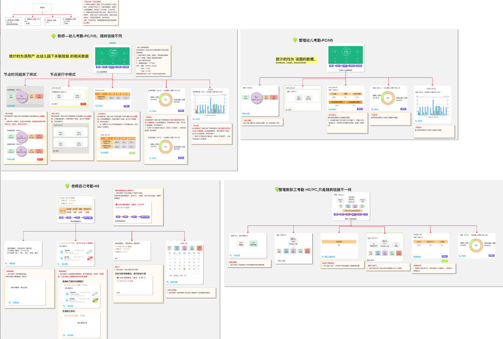
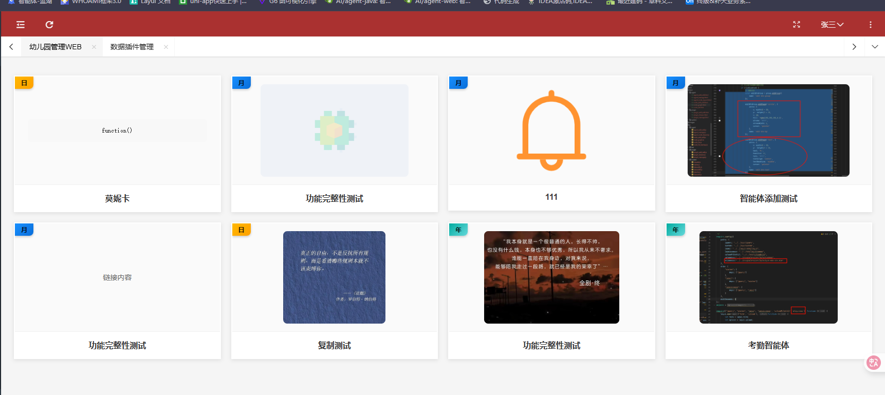
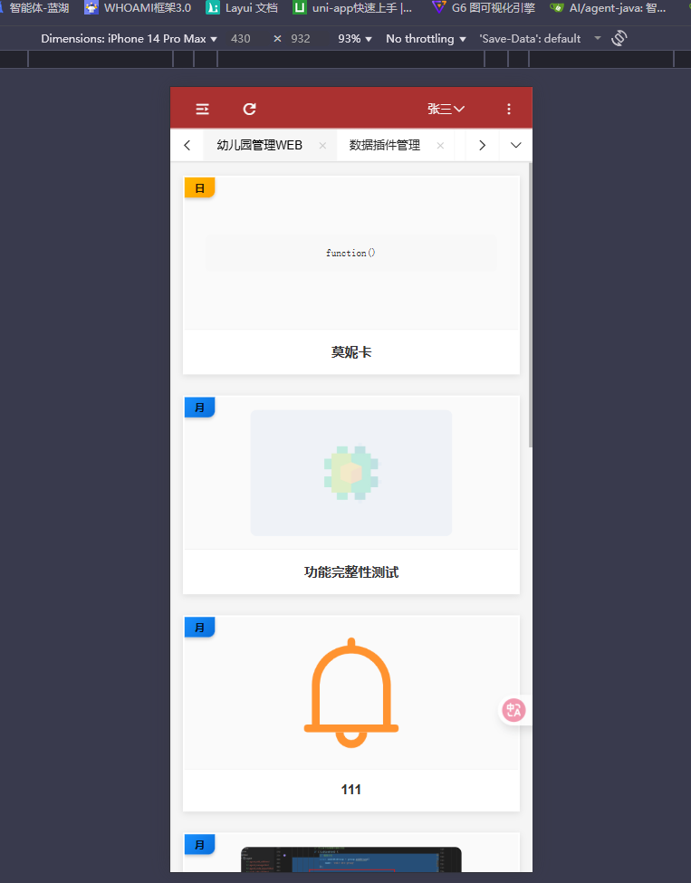
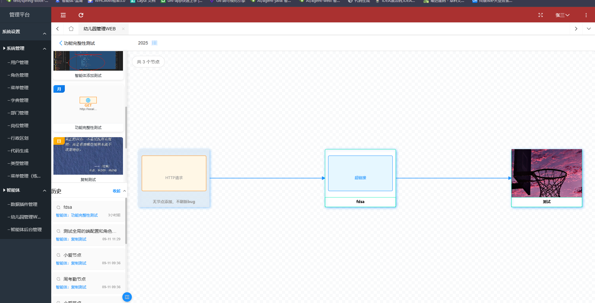
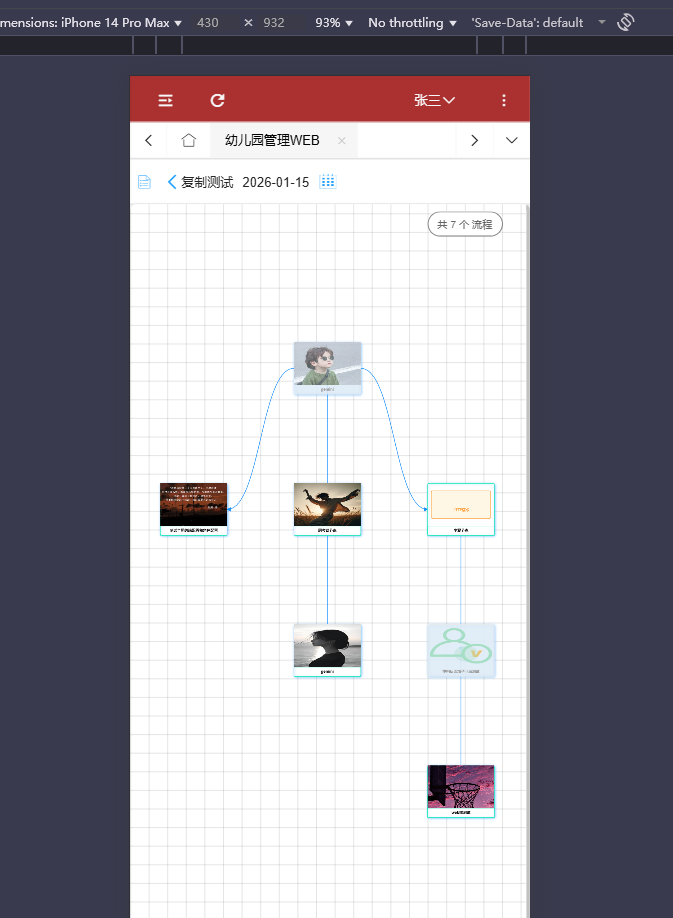
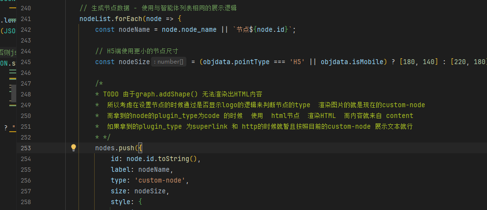
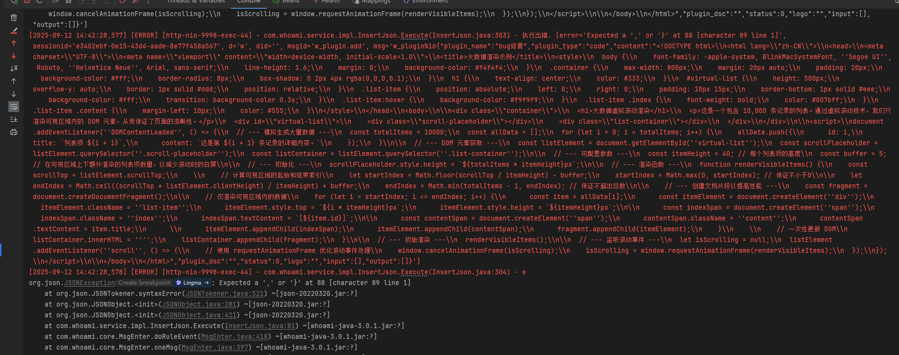

## 开发数据插件需要考虑的问题

根据需求那边给的图，对于插件的开发至少需要考虑以下几个问题

1. 我们知道，创建节点的时候可以选择相应的插件，然后在别的端展示的时候要么展示当时节点上传的logo
   要么就是展示插件的内容，而在设计插件的表的时候，插件内容使用的是text,  也就是说这部分得到的只是一段字符串罢了，而本身content的内容就会根据选择的插件类型 **超链接**   **http**   **代码块**来存对应的内容，渲染节点的时候如何按照提供的原型来做插件呢？
2. 很明显，按照提供过来的图，插件的内容可能是图表，底部还有相应的链接，链接点开，看样子是别的页面的东西
   这些页面从哪里来，该如何实现？
3. 之前按照原型需要选择输入输出字段，这两个字段存储是字符串，需要解析方可得到对应的内容，那么问题来了，这些字段解析了后在那些地方使用呢？前面可能是跳转链接，是在链接中携带跳转吗？
4. 谈到过一个考勤智能体，智能体的节点，节点中的数据该如何拿呢？打卡数据肯定是从别的表中拿的，在系统中拿**别的数据库中的表**是如何走的呢？
5. 最头大的地方就是，别的端系统还没有，熟悉不到，到时候如何添加成为一个困难点

## 适配幼儿园端H5

由于H5和pc端使用的是同一个页面，也就需要对原本的agent_list.html和agnet_list.js进行调整

### web端效果  智能体列表agent_list

#### H5端的效果 原效果

整体太大了，需要缩小

#### 适配思路

**在js中的objdata里面添加一个变量pointType 用于存储时 pc端还是 h5**

针对不同的端实现不同的样式

经过适配

#### H5端适配后

**缺点：针对不同端的css样式 耦合效果太大**  优化起来时间太长

### web端智能体详情效果  agent_detail

#### H5端的效果

#### H5适配后

### web端效果  node_graph_web

#### H5端的效果 （已经修改过）

优化后：

##### 存在的bug   解决

如上图虽然节点渲染没问题，但是，节点不能点击，因为在H5端是通过触摸实现的，因此适配web端的那一套点击时间在这部分是无法满足H5端的要求的，因此需要二次适配

## 插件demo

content里面放的代码块

html和js都给到对于的content

**需要的参数从输入输出拿**

### superlink  超链接类型

### HTTP 请求

### code  代码块渲染

#### 难点1

现有的代码结构是基于canvas去渲染的，但是canvas本身是不支持html  的 也就是 group.addshape 是没有html的

https://f6.antv.vision/zh/docs/manual/middle/elements/shape/shape-and-properties

**所以渲染得考虑别的办法**  可是有啥办法呢？

之前的节点写死了一种  向上改变的话就是设置不同的节点 nodes  type

如果是code 类型的  我们就在设置type的时候设置为html  然后再去渲染 content里面的内容

## BUG

### 插件添加或者编辑

1. **往content里面放html代码的时候就会出问题  存入content的时候该如何写？**
   

