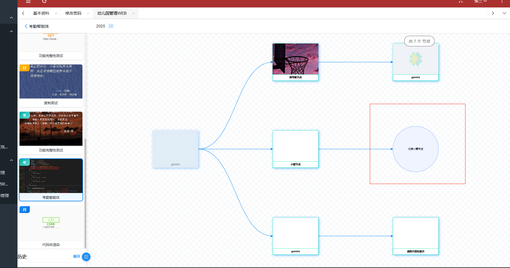
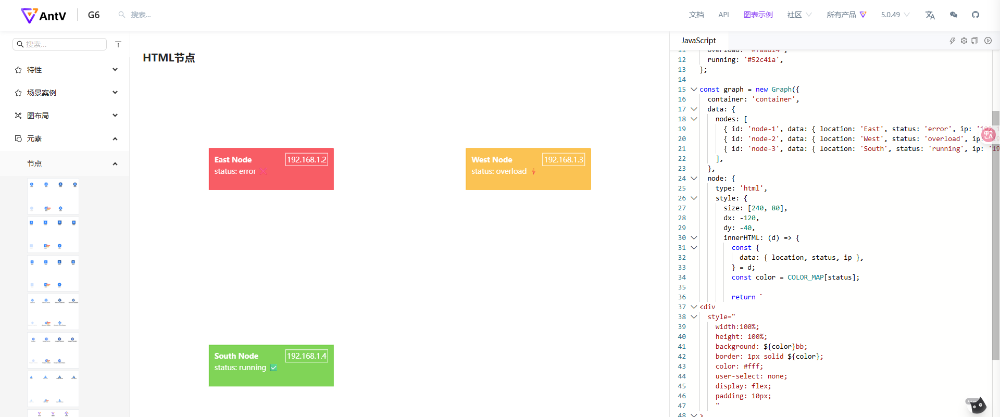
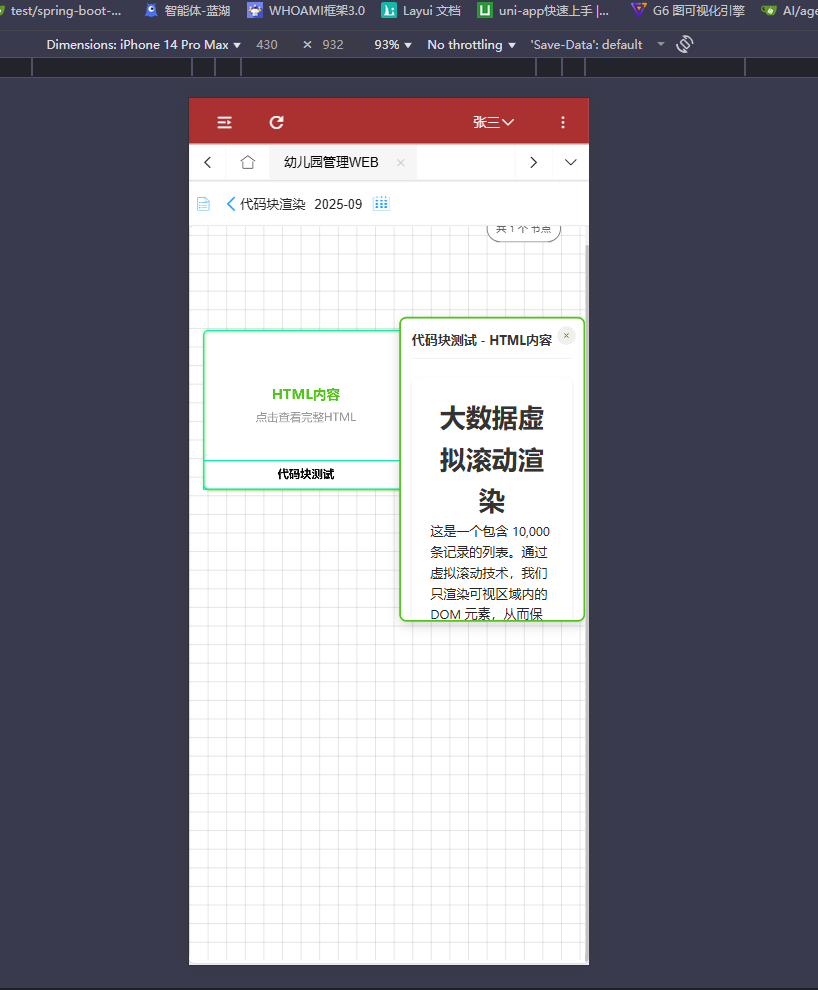

## 开发数据插件需要考虑的问题

根据需求那边给的图，对于插件的开发至少需要考虑以下几个问题

1. 我们知道，创建节点的时候可以选择相应的插件，然后在别的端展示的时候要么展示当时节点上传的logo
   要么就是展示插件的内容，而在设计插件的表的时候，插件内容使用的是text,  也就是说这部分得到的只是一段字符串罢了，而本身content的内容就会根据选择的插件类型 **超链接**   **http**   **代码块**来存对应的内容，渲染节点的时候如何按照提供的原型来做插件呢？
2. 很明显，按照提供过来的图，插件的内容可能是图表，底部还有相应的链接，链接点开，看样子是别的页面的东西
   这些页面从哪里来，该如何实现？
3. 之前按照原型需要选择输入输出字段，这两个字段存储是字符串，需要解析方可得到对应的内容，那么问题来了，这些字段解析了后在那些地方使用呢？前面可能是跳转链接，是在链接中携带跳转吗？
4. 谈到过一个考勤智能体，智能体的节点，节点中的数据该如何拿呢？打卡数据肯定是从别的表中拿的，在系统中拿**别的数据库中的表**是如何走的呢？
5. 最头大的地方就是，别的端系统还没有，熟悉不到，到时候如何添加成为一个困难点


## 适配幼儿园端H5


由于H5和pc端使用的是同一个页面，也就需要对原本的agent_list.html和agnet_list.js进行调整

### web端效果  智能体列表agent_list


#### H5端的效果 原效果


整体太大了，需要缩小

#### 适配思路

**在js中的objdata里面添加一个变量pointType 用于存储时 pc端还是 h5**

针对不同的端实现不同的样式

经过适配

#### H5端适配后


**缺点：针对不同端的css样式 耦合效果太大**  优化起来时间太长

### web端智能体详情效果  agent_detail


#### H5端的效果


#### H5适配后


### web端效果  node_graph_web


#### H5端的效果 （已经修改过）


优化后：


##### 存在的bug   解决

如上图虽然节点渲染没问题，但是，节点不能点击，因为在H5端是通过触摸实现的，因此适配web端的那一套点击时间在这部分是无法满足H5端的要求的，因此需要二次适配


## 插件demo

content里面放的代码块

html和js都给到对于的content

**需要的参数从输入输出拿**

### superlink  超链接类型


### HTTP 请求


### code  代码块渲染

#### 难点1

现有的代码结构是基于canvas去渲染的，但是canvas本身是不支持html  的 也就是 group.addshape 是没有html的

https://f6.antv.vision/zh/docs/manual/middle/elements/shape/shape-and-properties


**所以渲染得考虑别的办法**  可是有啥办法呢？


之前的节点写死了一种  向上改变的话就是设置不同的节点 nodes  type

如果是code 类型的  我们就在设置type的时候设置为html  然后再去渲染 content里面的内容

**思路：**

```tex
/*
* TODO 由于graph.addShape() 无法渲染出HTML内容
*  所以考虑在设置节点的时候通过是否显示logo的逻辑来判断节点的type  渲染图片的就是现在的custom-node
*  而拿到的node的plugin_type为code 的时候  使用  html节点  渲染HTML 也就是type为html
*  nodes去push的时候存储新的即可  而内容就来自 content 也就是return 的html
*  如果拿到的plugin_type 为superlink 和 http的时候就暂且按照目前的custom-node 展示文本就行
*
*  创建新的方法针对这种类型的节点单独渲染其内容
* */
```

不过这也就要求code类型的cntent为标准的html  相当于把整个页面都给放进去了，这部分还得确定好
对于动态的数据展示，html里面的js咋搞？ 如何拿到对应的参数呢？

#### 难点2

4版本的G6是没有  html类型的节点的，就导致了使用  html节点类型不生效，而需要将原本的重构为适配5版本的,

重构为5版本，原本的注册节点的方式就需要重新编写，在4版本适用端，强行使用5版本的html类型渲染得到的结果



code类型的节点的代码块并没有渲染出来，其他的空白是超链接和HTTP请求的 这部分的内容在需求那边也没有给出，暂且先这样

本身渲染节点这部分，代码量已经很大了  因为这是H5端和web端共用的页面，缩放什么的都是在这里面去实现的

对于其实渲染插件内容content  我觉得需要在渲染的时候给到其他的页面，这样代码耦合度相对较低，但是又遇到困难

#### 难点3

上面提到了将渲染插件的content单独拎出来放到新的页面，官方的文档没有相关的例子，在本系统中该如何做呢？



官方所做的html节点是按照上面的结构的，return 相应的前端代码  在现在的代码上去照葫芦画瓢，行不通，也很明显，这是5版本的语法，4版本上甚至都没有这样的节点类型  

## BUG

### 插件添加或者编辑

1. **往content里面放html代码的时候就会出问题  存入content的时候该如何写？**
   

2. **从地址栏传递过来判断是那个端的pointType 使用三目运算符去设置流程图的方向的时候未生效  rankdir**  

   


## 实现插件demo解决方案

### 4.x.g6.min.js 版本

说明：该版本之前尝试过，使用的自定义节点，然后在渲染的部分针对不同类型的插件去走单独的渲染方法，但是使用的是graph.addShap()   官方没有html  白给  没有想到更好的代替方案

**使用dom和overlay  去点击渲染  html**   

#### 代码

```js
/**
 * 作者：gongxi
 * 时间：2025-09-11
 * 智能体节点图表 - G6 v4版本 + DOM叠加HTML渲染方案
 * 保持原有Canvas渲染样式和交互效果，通过DOM overlay实现HTML内容渲染
 */

require.config({
    paths: {
        jquery: '../../sys/jquery',
        system: '../../sys/system',
        layui: "../../layui-btkj/layui",
        layuicommon: "../../sys/layuicommon",
        g6: "../../plugin/antv/g6/4.x.g6.min"  // 保持G6 v4
    },
    shim: {
        "system": {
            deps: ["jquery"]
        },
        "layui": {
            deps: ["jquery", "system"]
        },
        "layuicommon": {
            deps: ["jquery", "layui"]
        },
        "g6": {
            deps: ["jquery"]
        }
    },
    waitSeconds: 0
});

// 保持原有的objdata和PLUGIN_TYPES配置...
objdata = {
    // 智能体ID
    agent_id: null,
    // 节点数据存储
    allNodeData: [],
    nodeRelationDataHTML: null,
    // 图表实例
    currentGraph: null,
    // 页面状态
    isLoading: false,
    isInitialized: false,
    // 拖拽状态控制
    isDragging: false,
    dragStartTime: 0,
    // 点击过的节点记录
    clickedNodes: new Set(),
    // 地址栏传递
    applicable: {
        applicable_end: '',
        applicable_role: ''
    },
    pointType: '',
    // 设备类型检测
    isMobile: false,
    isTouch: false,
    // HTML overlay容器
    htmlOverlayContainer: null
};

// 插件类型配置
const PLUGIN_TYPES = {
    superlink: {
        name: '超链接',
        bgColor: '#e6f7ff',
        borderColor: '#1890ff',
        textColor: '#1890ff',
        rendering: 'canvas'
    },
    http: {
        name: 'HTTP请求',
        bgColor: '#fff7e6',
        borderColor: '#fa8c16',
        textColor: '#fa8c16',
        rendering: 'canvas'
    },
    code: {
        name: '代码执行',
        bgColor: '#f6ffed',
        borderColor: '#52c41a',
        textColor: '#52c41a',
        rendering: 'html'   // code类型支持HTML渲染
    },
    function: {
        name: '函数调用',
        bgColor: '#f9f0ff',
        borderColor: '#722ed1',
        textColor: '#722ed1',
        rendering: 'canvas'
    },
    default: {
        name: '默认内容',
        bgColor: 'transparent',
        borderColor: 'transparent',
        textColor: '#666',
        rendering: 'canvas'
    }
};

const DEFAULT_LOGO_PATH = '../../images/agentimg/agentimg.jpg';

require(["jquery", "system", "layui"], function () {
    layui.use(['layer'], function () {
        detectDevice();
        initNodeGraph();
        initEventListeners();
    });
});

// 保持原有的基础函数...
function detectDevice() {
    objdata.isMobile = /Android|webOS|iPhone|iPad|iPod|BlackBerry|IEMobile|Opera Mini/i.test(navigator.userAgent);
    objdata.isTouch = 'ontouchstart' in window || navigator.maxTouchPoints > 0;
}

function initNodeGraph() {
    const agentId = Arg("agent_id") || Arg("id");
    const pointType = Arg("pointType");
    const applicable_end = Arg("applicable_end");
    const applicable_role = Arg("applicable_role");
    objdata.pointType = pointType;
    objdata.applicable.applicable_end = [applicable_end];
    objdata.applicable.applicable_role = [applicable_role];

    if (!agentId) {
        showEmptyState('缺少必要参数：agent_id');
        return;
    }

    objdata.agent_id = agentId;
    setBackgroundStyle();
    loadNodeData();
}

function setBackgroundStyle() {
    const container = $('.graph-canvas');
    if (objdata.pointType === 'H5' || objdata.isMobile) {
        container.css({
            'background': `        
                linear-gradient(90deg, rgba(0,0,0,0.1) 1px, transparent 1px),
                linear-gradient(180deg, rgba(0,0,0,0.1) 1px, transparent 1px)`,
            'background-size': '20px 20px',
            'background-position': '0 0, 0 10px, 10px -10px, -10px 0px'
        });
    } else {
        container.css({
            'background': `linear-gradient(45deg, #f8f9fa 25%, transparent 25%),
                          linear-gradient(-45deg, #f8f9fa 25%, transparent 25%),
                          linear-gradient(45deg, transparent 75%, #f8f9fa 75%),
                          linear-gradient(-45deg, transparent 75%, #f8f9fa 75%)`,
            'background-size': '20px 20px',
            'background-position': '0 0, 0 10px, 10px -10px, -10px 0px'
        });
    }
}

function loadNodeData() {
    showLoading();
    let data = {
        "agent_id": [objdata.agent_id]
    };

    $.sm(function (re, err) {
        if (err) {
            hideLoading();
            layer.msg(err);
            showEmptyState('加载节点数据失败，请重试');
        } else {
            objdata.allNodeData = re || [];
            prepareAndRenderGraph();
        }
    }, ["w_agent_node_plugin.getList", $.msgwhere(data)]);
}

function prepareAndRenderGraph() {
    objdata.nodeRelationDataHTML = prepareRelationDataHTML(objdata.allNodeData);
    hideLoading();

    if (!objdata.nodeRelationDataHTML || objdata.nodeRelationDataHTML.nodes.length === 0) {
        showEmptyState('该智能体暂无节点数据');
        return;
    }

    require(['g6'], function(G6) {
        createNodeRelationGraph(G6, objdata.nodeRelationDataHTML);
        hideEmptyState();
        updateNodeCount();
        objdata.isInitialized = true;
    });
}

/**
 * 准备节点关系数据 - G6 v4版本，所有节点都用Canvas，HTML内容通过overlay显示
 */
function prepareRelationDataHTML(nodeList) {
    if (!nodeList || nodeList.length === 0) {
        return { nodes: [], edges: [] };
    }

    const nodes = [];
    const edges = [];
    const nodeMap = new Map();

    nodeList.forEach(node => {
        nodeMap.set(node.id, node);
    });

    // 所有节点都使用自定义Canvas节点，HTML内容通过overlay处理
    nodeList.forEach(node => {
        const nodeName = node.node_name || `节点${node.id}`;
        const nodeSize = (objdata.pointType === 'H5' || objdata.isMobile) ? [180, 140] : [220, 180];

        nodes.push({
            id: node.id.toString(),
            label: nodeName,
            size: nodeSize,
            type: 'custom-node',
            nodeData: node,
            style: {
                fill: 'transparent',
                stroke: 'transparent'
            }
        });
    });

    nodeList.forEach(node => {
        if (node.parent_id && node.parent_id !== '0' && nodeMap.has(parseInt(node.parent_id))) {
            edges.push({
                source: node.parent_id.toString(),
                target: node.id.toString(),
                type: 'cubic-horizontal',
                style: {
                    stroke: '#1890ff',
                    lineWidth: 2,
                    strokeOpacity: 0.8,
                    endArrow: {
                        path: 'M 0,0 L 8,4 L 8,-4 Z',
                        fill: '#1890ff',
                        strokeOpacity: 1
                    }
                }
            });
        }
    });

    return { nodes, edges };
}

/**
 * 创建节点关系图 - G6 v4版本 + HTML overlay
 */
function createNodeRelationGraph(G6, data) {
    const container = $('#nodeGraphContainer');

    if (objdata.currentGraph && !objdata.currentGraph.destroyed) {
        objdata.currentGraph.destroy();
    }

    // 创建HTML overlay容器
    createHtmlOverlayContainer(container[0]);

    // 注册自定义节点
    G6.registerNode('custom-node', {
        draw(cfg, group) {
            const nodeData = cfg.nodeData;
            const size = cfg.size || [220, 180];
            const width = size[0];
            const height = size[1];

            // 节点状态
            const isDisabled = nodeData.status !== 0;
            const hasPermission = checkNodePermission(nodeData);
            const isClicked = objdata.clickedNodes.has(nodeData.id.toString());

            // 创建主容器
            const shadowColor = isClicked ? 'rgba(82, 196, 26, 0.8)' : 'rgba(24, 144, 255, 0.6)';
            const strokeColor = isDisabled || !hasPermission ? '#e8e8e8' : '#12ecb2';

            const mainRect = group.addShape('rect', {
                attrs: {
                    x: -width / 2,
                    y: -height / 2,
                    width: width,
                    height: height,
                    fill: isDisabled || !hasPermission ? '#f5f5f5' : '#fff',
                    stroke: strokeColor,
                    strokeWidth: 1,
                    cursor: hasPermission && !isDisabled ? 'pointer' : 'not-allowed',
                    shadowColor: shadowColor,
                    shadowBlur: 8,
                    shadowOffsetX: 2,
                    shadowOffsetY: 2,
                    radius: 4,
                    opacity: isDisabled || !hasPermission ? 0.8 : 1
                },
                name: 'main-rect'
            });

            // 内容区域
            const contentY = -height / 2;
            const titleHeight = (objdata.pointType === 'H5' || objdata.isMobile) ? 25 : 30;

            // 根据是否为HTML内容显示不同的预览
            if (getPluginTypeConfig(nodeData.plugin_type).rendering === 'html' && isHtmlContent(nodeData.content)) {
                renderHtmlPreview(group, nodeData, contentY, width, height, titleHeight, isDisabled || !hasPermission);
            } else {
                renderPluginContent(group, nodeData, contentY, width, height, titleHeight, isDisabled || !hasPermission);
            }

            // 渲染节点名称
            renderNodeTitle(group, cfg, width, height, titleHeight, strokeColor, hasPermission, isDisabled);

            // 权限锁定图标
            if (!hasPermission) {
                group.addShape('text', {
                    attrs: {
                        x: width / 2 - 10,
                        y: -height / 2 + 10,
                        text: '🔒',
                        fontSize: (objdata.pointType === 'H5' || objdata.isMobile) ? 20 : 26,
                        textAlign: 'center',
                        textBaseline: 'middle',
                    },
                    name: 'lock-icon'
                });
            }

            return mainRect;
        },

        // 节点创建后的回调，用于创建HTML overlay
        afterDraw(cfg, group) {
            const nodeData = cfg.nodeData;
            if (getPluginTypeConfig(nodeData.plugin_type).rendering === 'html' && isHtmlContent(nodeData.content)) {
                createNodeHtmlOverlay(cfg);
            }
        }
    });

    const graphConfig = getGraphConfig(container);
    const graph = new G6.Graph(graphConfig);
    objdata.currentGraph = graph;

    bindGraphEvents(graph);

    graph.data(data);
    graph.render();

    setTimeout(() => {
        if (graph && !graph.destroyed) {
            graph.fitView(30);
        }
    }, 300);

    initGraphResize(graph);
}

/**
 * 创建HTML overlay容器
 */
function createHtmlOverlayContainer(graphContainer) {
    if (objdata.htmlOverlayContainer) {
        objdata.htmlOverlayContainer.remove();
    }

    objdata.htmlOverlayContainer = document.createElement('div');
    objdata.htmlOverlayContainer.id = 'html-overlay-container';
    objdata.htmlOverlayContainer.style.cssText = `
        position: absolute;
        top: 0;
        left: 0;
        width: 100%;
        height: 100%;
        pointer-events: none;
        z-index: 1000;
    `;

    graphContainer.style.position = 'relative';
    graphContainer.appendChild(objdata.htmlOverlayContainer);
}

/**
 * 为节点创建HTML overlay
 */
function createNodeHtmlOverlay(cfg) {
    const nodeData = cfg.nodeData;
    const nodeId = cfg.id;

    // 创建HTML overlay元素
    const overlay = document.createElement('div');
    overlay.id = `html-overlay-${nodeId}`;
    overlay.className = 'node-html-overlay';
    overlay.style.cssText = `
        position: absolute;
        background: white;
        border: 2px solid #52c41a;
        border-radius: 8px;
        padding: 12px;
        max-width: 400px;
        max-height: 300px;
        overflow: auto;
        pointer-events: auto;
        box-shadow: 0 4px 12px rgba(0,0,0,0.15);
        z-index: 1001;
        display: none;
        font-family: -apple-system, BlinkMacSystemFont, 'Segoe UI', Roboto, sans-serif;
    `;

    // 添加标题
    const title = document.createElement('div');
    title.style.cssText = `
        font-weight: bold;
        font-size: 14px;
        margin-bottom: 8px;
        color: #333;
        border-bottom: 1px solid #f0f0f0;
        padding-bottom: 8px;
    `;
    title.textContent = `${nodeData.node_name || '代码节点'} - HTML内容`;

    // 添加HTML内容
    const content = document.createElement('div');
    content.innerHTML = sanitizeHtml(nodeData.content);

    overlay.appendChild(title);
    overlay.appendChild(content);

    // 添加关闭按钮
    const closeBtn = document.createElement('div');
    closeBtn.style.cssText = `
        position: absolute;
        top: 8px;
        right: 8px;
        width: 20px;
        height: 20px;
        cursor: pointer;
        text-align: center;
        line-height: 18px;
        border-radius: 50%;
        background: #f0f0f0;
        font-size: 12px;
        color: #666;
    `;
    closeBtn.innerHTML = '×';
    closeBtn.onclick = () => {
        overlay.style.display = 'none';
    };

    overlay.appendChild(closeBtn);
    objdata.htmlOverlayContainer.appendChild(overlay);

    // 存储overlay引用到节点配置中
    cfg.htmlOverlay = overlay;
}

/**
 * 渲染HTML预览（在Canvas节点中显示提示） TODO  后续可能会换为动态的内容
 */
function renderHtmlPreview(group, nodeData, contentY, width, height, titleHeight, isDisabled) {
    const contentHeight = height - titleHeight;

    // 添加HTML图标
    group.addShape('text', {
        attrs: {
            x: 0,
            y: contentY + contentHeight / 2 - 20,
            text: '🌐',
            fontSize: 28,
            textAlign: 'center',
            textBaseline: 'middle',
            opacity: isDisabled ? 0.6 : 1
        },
        name: 'html-icon'
    });

    // 添加HTML标识
    group.addShape('text', {
        attrs: {
            x: 0,
            y: contentY + contentHeight / 2,
            text: 'HTML内容',
            fontSize: 12,
            fill: isDisabled ? '#999' : '#52c41a',
            textAlign: 'center',
            textBaseline: 'middle',
            fontWeight: 'bold'
        },
        name: 'html-label'
    });

    // 添加提示文本
    group.addShape('text', {
        attrs: {
            x: 0,
            y: contentY + contentHeight / 2 + 20,
            text: '点击查看完整HTML',
            fontSize: 10,
            fill: '#999',
            textAlign: 'center',
            textBaseline: 'middle'
        },
        name: 'html-hint'
    });
}

/**
 * 显示HTML overlay
 */
function showHtmlOverlay(nodeItem) {
    const cfg = nodeItem.getModel();
    const overlay = cfg.htmlOverlay;

    if (overlay) {
        // 获取节点位置
        const position = getNodeScreenPosition(nodeItem);
        overlay.style.left = position.x + 'px';
        overlay.style.top = position.y + 'px';
        overlay.style.display = 'block';

        // 确保overlay在视窗内
        adjustOverlayPosition(overlay);
    }
}

/**
 * 获取节点在屏幕上的位置
 */
function getNodeScreenPosition(nodeItem) {
    const model = nodeItem.getModel();
    const canvasPoint = objdata.currentGraph.getCanvasByPoint(model.x || 0, model.y || 0);
    const container = objdata.currentGraph.getContainer();
    const containerRect = container.getBoundingClientRect();

    return {
        x: containerRect.left + canvasPoint.x + 120, // 节点右侧
        y: containerRect.top + canvasPoint.y - 100
    };
}

/**
 * 调整overlay位置，确保在视窗内
 */
function adjustOverlayPosition(overlay) {
    const rect = overlay.getBoundingClientRect();
    const viewportWidth = window.innerWidth;
    const viewportHeight = window.innerHeight;

    // 右边界调整
    if (rect.right > viewportWidth - 20) {
        overlay.style.left = (viewportWidth - rect.width - 20) + 'px';
    }

    // 下边界调整
    if (rect.bottom > viewportHeight - 20) {
        overlay.style.top = (viewportHeight - rect.height - 20) + 'px';
    }

    // 左边界调整
    if (rect.left < 20) {
        overlay.style.left = '20px';
    }

    // 上边界调整
    if (rect.top < 20) {
        overlay.style.top = '20px';
    }
}

/**
 * 绑定图表事件 - 增加HTML overlay处理
 */
function bindGraphEvents(graph) {
    // 节点点击事件
    const clickEvent = objdata.isTouch ? 'node:touchstart' : 'node:click';

    graph.on(clickEvent, function(e) {
        const timeSinceDragStart = Date.now() - objdata.dragStartTime;
        if (objdata.isDragging && timeSinceDragStart > 200) return;

        const nodeModel = e.item.getModel();
        const nodeData = nodeModel.nodeData;

        const hasPermission = checkNodePermission(nodeData);
        if (!hasPermission) {
            layer.msg('您没有权限访问此节点');
            return;
        }

        if (nodeData.status !== 0) {
            layer.msg('该节点暂不可用');
            return;
        }

        // 如果是HTML节点，显示overlay
        if (getPluginTypeConfig(nodeData.plugin_type).rendering === 'html' && isHtmlContent(nodeData.content)) {
            showHtmlOverlay(e.item);
        }

        selectedNode(nodeData, e.item);
    });

    // 拖拽事件
    graph.on('node:dragstart', function() {
        objdata.isDragging = true;
        objdata.dragStartTime = Date.now();
        // 隐藏所有overlay
        hideAllHtmlOverlays();
    });

    graph.on('node:dragend', function() {
        setTimeout(() => {
            objdata.isDragging = false;
        }, 150);
    });

    // 画布点击时隐藏所有overlay
    graph.on('canvas:click', function() {
        hideAllHtmlOverlays();
    });

    // 移动端特殊处理
    if (objdata.isTouch) {
        graph.on('node:touchstart', function(e) {
            e.preventDefault();
        });

        let lastTapTime = 0;
        graph.on('canvas:touchstart', function(e) {
            const currentTime = Date.now();
            const tapLength = currentTime - lastTapTime;
            if (tapLength < 500 && tapLength > 0) {
                const point = { x: e.canvasX, y: e.canvasY };
                const currentZoom = graph.getZoom();
                const targetZoom = currentZoom < 1.5 ? 2 : 1;
                graph.zoomTo(targetZoom, point);
            }
            lastTapTime = currentTime;
        });
    }

    // 画布拖拽优化
    graph.on('canvas:dragstart', function() {
        objdata.isDragging = true;
        hideAllHtmlOverlays();
    });

    graph.on('canvas:dragend', function() {
        setTimeout(() => {
            objdata.isDragging = false;
        }, 100);
    });
}

/**
 * 隐藏所有HTML overlay
 */
function hideAllHtmlOverlays() {
    if (objdata.htmlOverlayContainer) {
        const overlays = objdata.htmlOverlayContainer.querySelectorAll('.node-html-overlay');
        overlays.forEach(overlay => {
            overlay.style.display = 'none';
        });
    }
}

/**
 * 获取图表配置
 */
function getGraphConfig(container) {
    const isMobileDevice = objdata.pointType === 'H5' || objdata.isMobile;

    return {
        container: container[0],
        width: container[0].clientWidth || 800,
        height: container[0].clientHeight || 600,
        renderer: 'canvas',
        pixelRatio: window.devicePixelRatio || 2,
        modes: {
            default: isMobileDevice ? [
                'drag-canvas',
                'zoom-canvas'
            ] : [
                'drag-canvas',
                'zoom-canvas',
                'drag-node'
            ]
        },
        defaultNode: {
            type: 'custom-node',
            size: isMobileDevice ? [180, 120] : [220, 120]
        },
        defaultEdge: {
            type: 'polyline',
            style: {
                stroke: '#1890ff',
                lineWidth: 2,
                strokeOpacity: 0.8,
                endArrow: {
                    path: 'M 0,0 L 8,4 L 8,-4 Z',
                    fill: '#1890ff'
                }
            }
        },
        layout: {
            type: 'dagre',
            rankdir: isMobileDevice ? 'TB':'LR'  ,  // todo 没有即时更新
            align: 'DL',
            nodesep: isMobileDevice ? 60 : 80,
            ranksep: isMobileDevice ? 80 : 120
        },
        fitView: true,
        fitViewPadding: isMobileDevice ? [20, 20, 20, 20] : [30, 30, 30, 30]
    };
}

function checkNodePermission(nodeData) {
    if (!nodeData.applicable_end && !nodeData.applicable_role) {
        return true;
    }
    if (nodeData.applicable_end === '全部' && nodeData.applicable_role === '全部') {
        return true;
    }

    let hasEndPermission = true;
    let hasRolePermission = true;

    if (nodeData.applicable_end) {
        const nodeEnds = nodeData.applicable_end.split(',').map(item => item.trim());
        hasEndPermission = nodeEnds.some(end => objdata.applicable.applicable_end.includes(end));
    }

    if (nodeData.applicable_role) {
        const nodeRoles = nodeData.applicable_role.split(',').map(item => item.trim());
        hasRolePermission = nodeRoles.some(role => objdata.applicable.applicable_role.includes(role));
    }

    return hasEndPermission && hasRolePermission;
}

function getPluginTypeConfig(pluginType) {
    return PLUGIN_TYPES[pluginType] || PLUGIN_TYPES.default;
}

function shouldShowLogo(nodeData) {
    if (nodeData.pld === 0 && nodeData.logo === '') {
        return { showLogo: true, logoPath: DEFAULT_LOGO_PATH };
    }

    if (nodeData.logo && !nodeData.logo.toString().match(/^\d+$/)) {
        return { showLogo: true, logoPath: ossPrefix + nodeData.logo };
    }

    return { showLogo: false, logoPath: null };
}

function isHtmlContent(content) {
    if (!content) return false;
    const htmlRegex = /<[^>]+>/;
    return htmlRegex.test(content);
}

function sanitizeHtml(html) {
    const temp = document.createElement('div');
    temp.innerHTML = html;

    const dangerousTags = ['script', 'object', 'embed', 'form', 'iframe'];
    dangerousTags.forEach(tag => {
        const elements = temp.querySelectorAll(tag);
        elements.forEach(el => el.remove());
    });

    const allElements = temp.querySelectorAll('*');
    allElements.forEach(el => {
        Array.from(el.attributes).forEach(attr => {
            if (attr.name.startsWith('on')) {
                el.removeAttribute(attr.name);
            }
        });
    });

    return temp.innerHTML;
}

function renderPluginContent(group, nodeData, contentY, width, height, titleHeight, isDisabled) {
    const contentHeight = height - titleHeight;
    const pluginConfig = getPluginTypeConfig(nodeData.plugin_type);
    const logoInfo = shouldShowLogo(nodeData);

    if (logoInfo.showLogo) {
        group.addShape('image', {
            attrs: {
                x: -width / 2,
                y: contentY,
                width: width,
                height: contentHeight,
                img: logoInfo.logoPath,
                cursor: !isDisabled ? 'pointer' : 'not-allowed',
                radius: 8,
                opacity: isDisabled ? 0.6 : 1
            },
            name: 'logo-image'
        });
        return;
    }

    let displayText = '';
    if (nodeData.pld === 0) {
        displayText = '默认内容';
    } else {
        displayText = nodeData.content ?
            (nodeData.content.length > 25 ? nodeData.content.substring(0, 25) + '...' : nodeData.content) :
            '无内容';
    }

    group.addShape('text', {
        attrs: {
            x: 0,
            y: contentY + contentHeight / 2,
            text: displayText,
            fontSize: (objdata.pointType === 'H5' || objdata.isMobile) ? 9 : 11,
            fill: isDisabled ? '#999' : pluginConfig.textColor,
            textAlign: 'center',
            textBaseline: 'middle',
            cursor: 'pointer',
        },
        name: 'content-text'
    });
}

function renderNodeTitle(group, cfg, width, height, titleHeight, strokeColor, hasPermission, isDisabled) {
    group.addShape('rect', {
        attrs: {
            x: -width / 2,
            y: height / 2 - titleHeight,
            width: width,
            height: titleHeight,
            cursor: hasPermission && !isDisabled ? 'pointer' : 'not-allowed',
            stroke: strokeColor,
            opacity: isDisabled || !hasPermission ? 0.6 : 1
        },
        name: 'name-bg'
    });

    group.addShape('text', {
        attrs: {
            x: 0,
            y: height / 2 - titleHeight / 2,
            text: cfg.label,
            fontSize: (objdata.pointType === 'H5' || objdata.isMobile) ? 10 : 12,
            fontWeight: 'bold',
            fill: isDisabled || !hasPermission ? '#999' : '#0a0a0a',
            textAlign: 'center',
            textBaseline: 'middle',
            cursor: hasPermission && !isDisabled ? 'pointer' : 'not-allowed'
        },
        name: 'name-text'
    });
}

function selectedNode(nodeData, nodeItem) {
    objdata.clickedNodes.add(nodeData.id.toString());

    if (objdata.currentGraph) {
        objdata.currentGraph.getNodes().forEach(node => {
            objdata.currentGraph.updateItem(node, {
                style: {
                    stroke: '#e8e8e8',
                    strokeWidth: 1
                }
            });
        });

        objdata.currentGraph.updateItem(nodeItem, {
            style: {
                stroke: '#1890ff',
                strokeWidth: 3
            }
        });

        setTimeout(() => {
            objdata.currentGraph.refresh();
        }, 100);
    }

    saveNodeClickLog(nodeData);
    handleNodeAction(nodeData);
    showNodeDetails(nodeData);
}

function saveNodeClickLog(nodeData) {
    $.sm(function (re, err) {
        if (err) {
            console.log(err);
        } else {
            console.log(re);
        }
    }, ["node_click_log.add", JSON.stringify({
        agent_id: nodeData.agent_id,
        node_id: nodeData.id,
        oprid: "",
    })]);
}

function handleNodeAction(nodeData) {
    switch (nodeData.plugin_type) {
        case 'superlink':
            if (nodeData.url) {
                // window.open(nodeData.url, '_blank');
            } else {
                layer.msg('该超链接节点暂无URL配置');
            }
            break;

        case 'http':
            if (nodeData.api_url || nodeData.url) {
                const url = nodeData.api_url || nodeData.url;
                layer.confirm('是否要访问此HTTP接口？<br>' + url, {
                    icon: 3,
                    title: 'HTTP请求'
                }, function(index) {
                    // window.open(url, '_blank');
                    layer.close(index);
                });
            } else {
                // showNodeDetails(nodeData);
            }
            break;

        case 'code':
            if (nodeData.url) {
                // window.open(nodeData.url, '_blank');
            } else {
                showCodeDetails(nodeData);
            }
            break;

        case 'function':
            if (nodeData.url) {
                // window.open(nodeData.url, '_blank');
            } else {
                showFunctionDetails(nodeData);
            }
            break;

        default:
            if (nodeData.url) {
                // window.open(nodeData.url, '_blank');
            } else {
                layer.msg('该节点暂无配置操作');
            }
            break;
    }
}

function showNodeDetails(nodeData) {
    // 可以在这里实现节点详情弹窗等功能
}

function showCodeDetails(nodeData) {
    const content = nodeData.content || '无代码内容';
    const isHtml = isHtmlContent(content);

    const contentHtml = `
        <div style="padding: 15px;">
            <h4>代码节点详情</h4>
            <p><strong>节点名称：</strong>${nodeData.node_name || '未命名'}</p>
            <p><strong>编程语言：</strong>${nodeData.language || nodeData.code_language || '未指定'}</p>
            <p><strong>内容类型：</strong>${isHtml ? 'HTML内容' : '代码内容'}</p>
            <p><strong>${isHtml ? 'HTML' : '代码'}内容：</strong></p>
            <div style="
                background: #f5f5f5; 
                padding: 10px; 
                border-radius: 4px; 
                max-height: 300px; 
                overflow-y: auto;
                ${isHtml ? '' : 'font-family: monospace;'}
            ">
                ${isHtml ? content : content.replace(/</g, '&lt;').replace(/>/g, '&gt;')}
            </div>
        </div>
    `;

    layer.open({
        type: 1,
        title: '代码节点',
        area: (objdata.pointType === 'H5' || objdata.isMobile) ? ['90%', '70%'] : ['600px', '450px'],
        content: contentHtml
    });
}

function showFunctionDetails(nodeData) {
    const content = `
        <div style="padding: 15px;">
            <h4>函数节点详情</h4>
            <p><strong>节点名称：</strong>${nodeData.node_name || '未命名'}</p>
            <p><strong>函数名称：</strong>${nodeData.function_name || nodeData.func_name || '未指定'}</p>
            <p><strong>函数描述：</strong></p>
            <div style="background: #f5f5f5; padding: 10px; border-radius: 4px; max-height: 200px; overflow-y: auto;">
                ${nodeData.content || nodeData.description || '无函数描述'}
            </div>
        </div>
    `;

    layer.open({
        type: 1,
        title: '函数节点',
        area: (objdata.pointType === 'H5' || objdata.isMobile) ? ['90%', '60%'] : ['500px', '350px'],
        content: content
    });
}

function initGraphResize(graph) {
    const resizeHandler = () => {
        if (!graph || graph.destroyed) return;

        const container = $('#nodeGraphContainer')[0];
        if (!container || !container.clientWidth || !container.clientHeight) return;

        graph.changeSize(container.clientWidth, container.clientHeight);
        graph.fitView(30);

        // 隐藏overlay，因为位置可能已改变
        hideAllHtmlOverlays();
    };

    window.addEventListener('resize', resizeHandler);

    $(window).on('beforeunload', function() {
        window.removeEventListener('resize', resizeHandler);
        if (graph && !graph.destroyed) {
            graph.destroy();
        }
        // 清理HTML overlay容器
        if (objdata.htmlOverlayContainer) {
            objdata.htmlOverlayContainer.remove();
        }
    });
}

function initEventListeners() {
    $(window).on('resize', function() {
        if (objdata.currentGraph && !objdata.currentGraph.destroyed) {
            const container = $('#nodeGraphContainer')[0];
            if (container) {
                objdata.currentGraph.changeSize(container.clientWidth, container.clientHeight);
                objdata.currentGraph.fitView(30);
                hideAllHtmlOverlays();
            }
        }
    });
}

// 页面状态管理函数
function showLoading() {
    objdata.isLoading = true;
    $('#loadingOverlay').show();
}

function hideLoading() {
    objdata.isLoading = false;
    $('#loadingOverlay').hide();
}

function showEmptyState(message = '暂无节点数据') {
    $('#emptyState').show();
    $('#emptyState .empty-text').text(message);
    updateNodeCount();
}

function hideEmptyState() {
    $('#emptyState').hide();
}

function updateNodeCount() {
    const count = objdata.allNodeData ? objdata.allNodeData.length : 0;
    const name = objdata.pointType === 'H5' ?  '流程':'节点' ;
    $('#nodeCount').text(`共 ${count} 个 ${name}`);
}
```

#### 效果



**后续原有的文本展示会到相应的接口中获得，**

#### 按照原型浅浅实现demo


##### 优化点

1：去除里面的设备类型检测，完全由objdata.pointType去控制是那个端，

2：代码中节点的各种颜色，尺寸等我希望像plugin_types那样去全局配置，但是不需要提供给别的地方使用

### 5.x.g6.min.js 版本

这个版本支持  html节点，刚好可以渲染代码块，那么如果要实现5版本的

1. **现有的代码需要重构为适配5版本的** 这一步就难搞啊！！！

   这tm得卡一周啊！！！  现有的代码适配问题太多，尝试一下4版本

2. 如何将渲染的html单独到新的页面？

 


## 代码备份

### 针对code类型的渲染  4版本

**该版本下无法直接渲染html  但是graph.addShape  里面不包含html的渲染**

```js
/**
 * 作者：gongxi
 * 时间：2025-09-11
 * 智能体节点图表 - 优化代码，减少冗余，降低耦合，H5端适配，支持HTML内容渲染
 * 保持原有Canvas渲染样式和交互效果
 */

require.config({
    paths: {
        jquery: '../../sys/jquery',
        system: '../../sys/system',
        layui: "../../layui-btkj/layui",
        layuicommon: "../../sys/layuicommon",
        g6: "../../plugin/antv/g6/4.x.g6.min"
    },
    shim: {
        "system": {
            deps: ["jquery"]
        },
        "layui": {
            deps: ["jquery", "system"]
        },
        "layuicommon": {
            deps: ["jquery", "layui"]
        },
        "g6": {
            deps: ["jquery"]
        }
    },
    waitSeconds: 0
});

objdata = {
    // 智能体ID
    agent_id: null,

    // 节点数据存储
    allNodeData: [],
    nodeRelationDataHTML: null,

    // 图表实例
    currentGraph: null,

    // 页面状态
    isLoading: false,
    isInitialized: false,

    // 拖拽状态控制
    isDragging: false,
    dragStartTime: 0,

    // 点击过的节点记录
    clickedNodes: new Set(),

    // 地址栏传递
    applicable: {
        applicable_end: '',
        applicable_role: ''
    },
    pointType: '',

    // 设备类型检测
    isMobile: false,
    isTouch: false
};

// 插件类型配置 - 集中管理颜色和样式
const PLUGIN_TYPES = {
    superlink: {
        name: '超链接',
        bgColor: '#e6f7ff',
        borderColor: '#1890ff',
        textColor: '#1890ff',
        rendering: 'html'   // 节点类型 html
    },
    http: {
        name: 'HTTP请求',
        bgColor: '#fff7e6',
        borderColor: '#fa8c16',
        textColor: '#fa8c16',
        rendering: 'html'
    },
    code: {
        name: '代码执行',
        bgColor: '#f6ffed',
        borderColor: '#52c41a',
        textColor: '#52c41a',
        rendering: 'html'   // 支持HTML渲染
    },
    function: {
        name: '函数调用',
        bgColor: '#f9f0ff',
        borderColor: '#722ed1',
        textColor: '#722ed1',
        rendering: 'html'
    },
    default: {
        name: '默认内容',
        bgColor: 'transparent',
        borderColor: 'transparent',
        textColor: '#666'
    }
};

// 默认图片路径配置，既没有logo 也没有插件的情况下使用，避免大空白
const DEFAULT_LOGO_PATH = '../../images/agentimg/agentimg.jpg';

require(["jquery", "system", "layui"], function () {
    layui.use(['layer'], function () {
        // 设备检测
        detectDevice();
        // 初始化页面
        initNodeGraph();
        initEventListeners();
    });
});

/**
 * 设备检测
 */
function detectDevice() {
    objdata.isMobile = /Android|webOS|iPhone|iPad|iPod|BlackBerry|IEMobile|Opera Mini/i.test(navigator.userAgent);
    objdata.isTouch = 'ontouchstart' in window || navigator.maxTouchPoints > 0;
}

/**
 * 初始化节点图表 - 主入口函数
 */
function initNodeGraph() {
    // 获取URL参数中的agent_id
    const agentId = Arg("agent_id") || Arg("id");
    const pointType = Arg("pointType");
    const applicable_end = Arg("applicable_end");
    const applicable_role = Arg("applicable_role");
    objdata.pointType = pointType;
    objdata.applicable.applicable_end = [applicable_end];
    objdata.applicable.applicable_role = [applicable_role];

    if (!agentId) {
        showEmptyState('缺少必要参数：agent_id');
        return;
    }

    objdata.agent_id = agentId;

    // 根据端类型设置背景样式
    setBackgroundStyle();

    // 加载节点数据
    loadNodeData();
}

/**
 * 设置背景样式 - 根据端类型适配
 */
function setBackgroundStyle() {
    const container = $('.graph-canvas');

    if (objdata.pointType === 'H5' || objdata.isMobile) {
        // H5端使用方格线
        container.css({
            'background': `        
                linear-gradient(90deg, rgba(0,0,0,0.1) 1px, transparent 1px),
                linear-gradient(180deg, rgba(0,0,0,0.1) 1px, transparent 1px)`,
            'background-size': '20px 20px',
            'background-position': '0 0, 0 10px, 10px -10px, -10px 0px'
        });
    } else {
        // Web端保持原有网格背景
        container.css({
            'background': `linear-gradient(45deg, #f8f9fa 25%, transparent 25%),
                          linear-gradient(-45deg, #f8f9fa 25%, transparent 25%),
                          linear-gradient(45deg, transparent 75%, #f8f9fa 75%),
                          linear-gradient(-45deg, transparent 75%, #f8f9fa 75%)`,
            'background-size': '20px 20px',
            'background-position': '0 0, 0 10px, 10px -10px, -10px 0px'
        });
    }
}

/**
 * 加载节点数据 - 统一数据加载方式
 */
function loadNodeData() {
    showLoading();

    let data = {
        "agent_id": [objdata.agent_id]
    };

    $.sm(function (re, err) {
        if (err) {
            hideLoading();
            layer.msg(err);
            showEmptyState('加载节点数据失败，请重试');
        } else {
            objdata.allNodeData = re || [];
            // 准备关系数据并渲染图表
            prepareAndRenderGraph();
        }
    }, ["w_agent_node_plugin.getList", $.msgwhere(data)]);
}

/**
 * 准备数据并渲染图表
 */
function prepareAndRenderGraph() {
    // 准备节点关系数据
    objdata.nodeRelationDataHTML = prepareRelationDataHTML(objdata.allNodeData);

    hideLoading();

    if (!objdata.nodeRelationDataHTML || objdata.nodeRelationDataHTML.nodes.length === 0) {
        showEmptyState('该智能体暂无节点数据');
        return;
    }

    // 动态加载 G6 库并创建关系图
    require(['g6'], function(G6) {
        createNodeRelationGraph(G6, objdata.nodeRelationDataHTML);
        hideEmptyState();
        updateNodeCount();
        objdata.isInitialized = true;
    });
}

/**
 * 准备节点关系数据
 */
function prepareRelationDataHTML(nodeList) {
    if (!nodeList || nodeList.length === 0) {
        return { nodes: [], edges: [] };
    }

    const nodes = [];
    const edges = [];
    const nodeMap = new Map();

    // 创建节点映射
    nodeList.forEach(node => {
        nodeMap.set(node.id, node);
    });

    // 生成节点数据 - 根据plugin_type选择不同的渲染方式
    nodeList.forEach(node => {
        const nodeName = node.node_name || `节点${node.id}`;
        const nodeSize = (objdata.pointType === 'H5' || objdata.isMobile) ? [180, 140] : [220, 180];

        let nodeConfig = {
            id: node.id.toString(),
            label: nodeName,
            size: nodeSize,
            nodeData: node,
        };

        // 根据插件类型设置不同的渲染方式
        if (node.plugin_type === 'code') {
            console.log('code node:', node);
            // code类型使用HTML渲染
            nodeConfig.type = 'html';
            nodeConfig.style = {
                dx:-120,
                dy:-40,
                innerHTML:getCodeNodeHtmlContent(node)
            };
        } else {
            // 其他类型使用Canvas渲染
            nodeConfig.type = 'custom-node';
            nodeConfig.style = {
                fill: 'transparent',
                stroke: 'transparent'
            };
        }

        nodes.push(nodeConfig);
    });

    nodeList.forEach(node => {
        if (node.parent_id && node.parent_id !== '0' && nodeMap.has(parseInt(node.parent_id))) {
            edges.push({
                source: node.parent_id.toString(),
                target: node.id.toString(),
                type: 'cubic-horizontal',
                style: {
                    stroke: '#1890ff',
                    lineWidth: 2,
                    strokeOpacity: 0.8,
                    endArrow: {
                        path: 'M 0,0 L 8,4 L 8,-4 Z',
                        fill: '#1890ff',
                        strokeOpacity: 1
                    }
                }
            });
        }
    });

    return { nodes, edges };
}

/**
 * 获取代码节点的HTML内容 - 独立函数，降低耦合
 */
function getCodeNodeHtmlContent(nodeData) {
    const pluginConfig = getPluginTypeConfig(nodeData.plugin_type);
    const isDisabled = nodeData.status !== 0;
    const hasPermission = checkNodePermission(nodeData);
    // const selectedTime = getUserSelectedTime();

    // 获取最新的内容数据
    // const contentData = getLatestCodeContent(nodeData.pld, nodeData.plugin_id, selectedTime);

    const nodeId = nodeData.id;
    const nodeTitle = nodeData.node_name || `节点${nodeId}`;
    const language = 'html';

    return `
        <div class="html-code-node" 
             data-node-id="${nodeId}"
             data-pld="${nodeData.pld || ''}"
             data-plugin-id="${nodeData.plugin_id || ''}"
             data-selected-time=""
             style="
                width: 100%;
                height: 100%;
                background: ${isDisabled || !hasPermission ? '#f5f5f5' : '#fff'};
                border: 2px solid ${isDisabled || !hasPermission ? '#e8e8e8' : pluginConfig.borderColor};
                border-radius: 6px;
                overflow: hidden;
                opacity: ${isDisabled || !hasPermission ? 0.6 : 1};
                pointer-events: ${hasPermission && !isDisabled ? 'auto' : 'none'};
                box-shadow: 0 2px 8px rgba(0,0,0,0.1);
                font-family: -apple-system, BlinkMacSystemFont, 'Segoe UI', sans-serif;
                cursor: ${hasPermission && !isDisabled ? 'pointer' : 'not-allowed'};
                display: flex;
                flex-direction: column;
             "
<!--             onclick="handleHtmlNodeClick('${nodeId}')">-->
            
            <!-- 节点标题栏 -->
            <div class="node-header" style="
                padding: 8px 12px;
                background: ${pluginConfig.bgColor || '#f0f0f0'};
                border-bottom: 1px solid ${pluginConfig.borderColor};
                font-weight: bold;
                font-size: 12px;
                color: ${isDisabled || !hasPermission ? '#999' : '#0a0a0a'};
                display: flex;
                justify-content: space-between;
                align-items: center;
                min-height: 30px;
            ">
                <span class="node-title" title="${nodeTitle}">${nodeTitle.length > 15 ? nodeTitle.substring(0, 15) + '...' : nodeTitle}</span>
                <div class="node-badges">
                    <span class="language-badge" style="
                        background: ${pluginConfig.textColor};
                        color: #fff;
                        padding: 2px 6px;
                        border-radius: 3px;
                        font-size: 9px;
                        margin-right: 4px;
                    ">${language.toUpperCase()}</span>
                    <span class="html-icon">🌐</span>
                    ${!hasPermission ? '<span class="lock-icon">🔒</span>' : ''}
                </div>
            </div>
            
            <!-- 内容区域 -->
            <div class="node-content" style="
                flex: 1;
                padding: 10px;
                overflow: auto;
                font-size: 11px;
                line-height: 1.4;
            ">
                ${nodeData.content}
            </div>
            
            <!-- 时间标识 -->
            <div class="time-indicator" style="
                padding: 4px 8px;
                background: rgba(0,0,0,0.05);
                border-top: 1px solid rgba(0,0,0,0.1);
                font-size: 9px;
                color: #666;
                text-align: right;
            ">

            </div>
        </div>
    `;
}

/**
 * 检查用户是否有权限访问节点
 */
function checkNodePermission(nodeData) {
    console.log(objdata.applicable)
    // 如果节点没有权限配置，默认允许访问
    if (!nodeData.applicable_end && !nodeData.applicable_role) {
        return true;
    }
    // 节点的适用端和适用角色为全部,也返回 true
    if (nodeData.applicable_end === '全部' && nodeData.applicable_role === '全部') {
        return true;
    }

    let hasEndPermission = true;
    let hasRolePermission = true;

    // 检查端权限
    if (nodeData.applicable_end) {
        const nodeEnds = nodeData.applicable_end.split(',').map(item => item.trim());
        hasEndPermission = nodeEnds.some(end => objdata.applicable.applicable_end.includes(end));
    }

    // 检查角色权限
    if (nodeData.applicable_role) {
        const nodeRoles = nodeData.applicable_role.split(',').map(item => item.trim());
        hasRolePermission = nodeRoles.some(role => objdata.applicable.applicable_role.includes(role));
    }

    return hasEndPermission && hasRolePermission;
}

/**
 * 获取插件类型配置
 */
function getPluginTypeConfig(pluginType) {
    return PLUGIN_TYPES[pluginType] || PLUGIN_TYPES.default;
}

/**
 * 判断是否应该显示logo图片
 */
function shouldShowLogo(nodeData) {
    // 如果pld为0且logo为空或0，显示默认图片
    if (nodeData.pld === 0 &&  nodeData.logo === '') {
        return { showLogo: true, logoPath: DEFAULT_LOGO_PATH };
    }

    // 如果logo不是纯数字，显示自定义logo
    if (nodeData.logo && !nodeData.logo.toString().match(/^\d+$/)) {
        return { showLogo: true, logoPath: ossPrefix + nodeData.logo };
    }

    return { showLogo: false, logoPath: null };
}

/**
 * 渲染插件内容区域
 */
function renderPluginContent(group, nodeData, contentY, width, height, titleHeight, isDisabled) {
    const contentHeight = height - titleHeight;
    const pluginConfig = getPluginTypeConfig(nodeData.plugin_type);

    // 检查是否需要显示logo
    const logoInfo = shouldShowLogo(nodeData);

    if (logoInfo.showLogo) {
        // 显示logo图片
        group.addShape('image', {
            attrs: {
                x: -width / 2,
                y: contentY,
                width: width,
                height: contentHeight,
                img: logoInfo.logoPath,
                cursor: !isDisabled ? 'pointer' : 'not-allowed',
                radius: 8,
                opacity: isDisabled ? 0.6 : 1
            },
            name: 'logo-image'
        });
        return;
    }

    // 根据插件类型渲染不同内容
    if (nodeData.plugin_type && nodeData.plugin_type !== 'default') {
        // todo 就渲染对应的文本就行

    } else {
        // 默认内容渲染
        renderDefaultContent(group, nodeData, pluginConfig, contentY, contentHeight, isDisabled);
    }
}

/**
 * 检测是否为HTML内容
 */
function isHtmlContent(content) {
    if (!content) return false;
    const htmlRegex = /<[^>]+>/;
    return htmlRegex.test(content);
}


/**
 * 渲染默认内容
 */
function renderDefaultContent(group, nodeData, pluginConfig, contentY, contentHeight, isDisabled) {
    let displayText = '';
    if (nodeData.pld === 0) {
        displayText = '默认内容';
    } else {
        displayText = nodeData.content ?
            (nodeData.content.length > 25 ? nodeData.content.substring(0, 25) + '...' : nodeData.content) :
            '无内容';
    }

    group.addShape('text', {
        attrs: {
            x: 0,
            y: contentY + contentHeight / 2,
            text: displayText,
            fontSize: (objdata.pointType === 'H5' || objdata.isMobile) ? 9 : 11,
            fill: isDisabled ? '#999' : pluginConfig.textColor,
            textAlign: 'center',
            textBaseline: 'middle',
            cursor: 'pointer',
        },
        name: 'content-text'
    });
}

function renderNodeTitle(group, cfg, width, height, titleHeight, strokeColor, hasPermission, isDisabled) {
    // 节点名称背景
    group.addShape('rect', {
        attrs: {
            x: -width / 2,
            y: height / 2 - titleHeight,
            width: width,
            height: titleHeight,
            cursor: hasPermission && !isDisabled ? 'pointer' : 'not-allowed',
            stroke: strokeColor,
            opacity: isDisabled || !hasPermission ? 0.6 : 1
        },
        name: 'name-bg'
    });

    // 节点名称文本
    group.addShape('text', {
        attrs: {
            x: 0,
            y: height / 2 - titleHeight / 2,
            text: cfg.label,
            fontSize: (objdata.pointType === 'H5' || objdata.isMobile) ? 10 : 12,
            fontWeight: 'bold',
            fill: isDisabled || !hasPermission ? '#999' : '#0a0a0a',
            textAlign: 'center',
            textBaseline: 'middle',
            cursor: hasPermission && !isDisabled ? 'pointer' : 'not-allowed'
        },
        name: 'name-text'
    });
}

/**
 * 创建节点关系图
 */
function createNodeRelationGraph(G6, data) {
    const container = $('#nodeGraphContainer');

    // 销毁现有图表实例
    if (objdata.currentGraph && !objdata.currentGraph.destroyed) {
        objdata.currentGraph.destroy();
    }

    // 注册自定义节点
    G6.registerNode('custom-node', {
        draw(cfg, group) {
            const nodeData = cfg.nodeData;
            const size = cfg.size || [220, 180];
            const width = size[0];
            const height = size[1];

            // 节点状态
            const isDisabled = nodeData.status !== 0;
            const hasPermission = checkNodePermission(nodeData);
            const isClicked = objdata.clickedNodes.has(nodeData.id.toString());

            // 创建主容器
            const shadowColor = isClicked ? 'rgba(82, 196, 26, 0.8)' : 'rgba(24, 144, 255, 0.6)';
            const strokeColor = isDisabled || !hasPermission ? '#e8e8e8' : '#12ecb2';

            const mainRect = group.addShape('rect', {
                attrs: {
                    x: -width / 2,
                    y: -height / 2,
                    width: width,
                    height: height,
                    fill: isDisabled || !hasPermission ? '#f5f5f5' : '#fff',
                    stroke: strokeColor,
                    strokeWidth: 1,
                    cursor: hasPermission && !isDisabled ? 'pointer' : 'not-allowed',
                    shadowColor: shadowColor,
                    shadowBlur: 8,
                    shadowOffsetX: 2,
                    shadowOffsetY: 2,
                    radius: 4,
                    opacity: isDisabled || !hasPermission ? 0.8 : 1
                },
                name: 'main-rect'
            });

            // 内容区域
            const contentY = -height / 2;
            const titleHeight = (objdata.pointType === 'H5' || objdata.isMobile) ? 25 : 30;

            group.addShape('rect', {
                attrs: {
                    x: -width / 2,
                    y: contentY,
                    width: width,
                    height: height - titleHeight,
                    strokeWidth: 1,
                    cursor: hasPermission && !isDisabled ? 'pointer' : 'not-allowed',
                    textAlign: 'center',
                },
                name: 'content-bg'
            });

            // 渲染插件内容
            renderPluginContent(group, nodeData, contentY, width, height, titleHeight, isDisabled || !hasPermission);
            // 渲染节点名称
            renderNodeTitle(group, cfg, width, height, titleHeight, strokeColor, hasPermission, isDisabled);

            // 如果没有权限，添加锁定图标
            if (!hasPermission) {
                group.addShape('text', {
                    attrs: {
                        x: width / 2 - 10,
                        y: -height / 2 + 10,
                        text: '🔒',
                        fontSize: (objdata.pointType === 'H5' || objdata.isMobile) ? 20 : 26,
                        textAlign: 'center',
                        textBaseline: 'middle',
                    },
                    name: 'lock-icon'
                });
            }

            return mainRect;
        }
    });

    // 获取图表配置 - 保持原有Canvas渲染
    const graphConfig = getGraphConfig(container);

    // 创建 G6 图实例
    const graph = new G6.Graph(graphConfig);

    // 存储图表实例
    objdata.currentGraph = graph;

    // 绑定事件
    bindGraphEvents(graph);

    // 渲染数据
    graph.data(data);
    graph.render();

    // 延迟执行自适应画布
    setTimeout(() => {
        if (graph && !graph.destroyed) {
            graph.fitView(30);
        }
    }, 300);

    // 响应式处理
    initGraphResize(graph);
}

/**
 * 获取图表配置
 */
function getGraphConfig(container) {
    const isMobileDevice = objdata.pointType === 'H5' || objdata.isMobile;

    return {
        container: container[0],
        width: container[0].clientWidth || 800,
        height: container[0].clientHeight || 600,
        renderer: 'canvas',  // 保持Canvas渲染
        pixelRatio: window.devicePixelRatio || 2,
        modes: {
            default: isMobileDevice ? [
                'drag-canvas',
                'zoom-canvas'
            ] : [
                'drag-canvas',
                'zoom-canvas',
                'drag-node'  // 保持节点拖拽功能
            ]
        },
        defaultNode: {
            type: 'custom-node',
            size: isMobileDevice ? [180, 120] : [220, 120]
        },
        defaultEdge: {
            type: 'polyline',
            style: {
                stroke: '#1890ff',
                lineWidth: 2,
                strokeOpacity: 0.8,
                endArrow: {
                    path: 'M 0,0 L 8,4 L 8,-4 Z',
                    fill: '#1890ff'
                }
            }
        },
        layout: {
            type: 'dagre',
            rankdir: objdata.pointType === 'H5' ? 'TB': 'LR' ,
            align: 'DL',
            nodesep: isMobileDevice ? 60 : 80,
            ranksep: isMobileDevice ? 80 : 120
        },
        fitView: true,
        fitViewPadding: isMobileDevice ? [20, 20, 20, 20] : [30, 30, 30, 30]
    };
}

/**
 * 绑定图表事件
 */
function bindGraphEvents(graph) {
    // 节点点击事件 - 优化移动端支持
    const clickEvent = objdata.isTouch ? 'node:touchstart' : 'node:click';

    graph.on(clickEvent, function(e) {
        // 避免拖拽时触发点击 - 增加时间判断
        const timeSinceDragStart = Date.now() - objdata.dragStartTime;
        if (objdata.isDragging && timeSinceDragStart > 200) return;

        const nodeModel = e.item.getModel();
        const nodeData = nodeModel.nodeData;

        // 检查权限
        const hasPermission = checkNodePermission(nodeData);
        if (!hasPermission) {
            layer.msg('您没有权限访问此节点');
            return;
        }

        // 检查节点状态
        if (nodeData.status !== 0) {
            layer.msg('该节点暂不可用');
            return;
        }

        selectedNode(nodeData, e.item);
    });

    // 统一处理拖拽事件（PC端和移动端）
    graph.on('node:dragstart', function() {
        objdata.isDragging = true;
        objdata.dragStartTime = Date.now();
    });

    graph.on('node:dragend', function() {
        // 延迟重置拖拽状态，避免点击事件误触发
        setTimeout(() => {
            objdata.isDragging = false;
        }, 150);
    });

    // 移动端特殊处理
    if (objdata.isTouch) {
        // 防止长按选择文本
        graph.on('node:touchstart', function(e) {
            e.preventDefault();
        });

        // 处理双击缩放
        let lastTapTime = 0;
        graph.on('canvas:touchstart', function(e) {
            const currentTime = Date.now();
            const tapLength = currentTime - lastTapTime;
            if (tapLength < 500 && tapLength > 0) {
                // 双击缩放
                const point = { x: e.canvasX, y: e.canvasY };
                const currentZoom = graph.getZoom();
                const targetZoom = currentZoom < 1.5 ? 2 : 1;
                graph.zoomTo(targetZoom, point);
            }
            lastTapTime = currentTime;
        });
    }

    // 画布拖拽优化
    graph.on('canvas:dragstart', function() {
        objdata.isDragging = true;
    });

    graph.on('canvas:dragend', function() {
        setTimeout(() => {
            objdata.isDragging = false;
        }, 100);
    });
}

/**
 * 选择节点
 */
function selectedNode(nodeData, nodeItem) {
    // 记录节点被点击过
    objdata.clickedNodes.add(nodeData.id.toString());

    // 更新选中状态（如果需要的话）
    if (objdata.currentGraph) {
        // 重置所有节点样式
        objdata.currentGraph.getNodes().forEach(node => {
            objdata.currentGraph.updateItem(node, {
                style: {
                    stroke: '#e8e8e8',
                    strokeWidth: 1
                }
            });
        });

        // 高亮选中节点
        objdata.currentGraph.updateItem(nodeItem, {
            style: {
                stroke: '#1890ff',
                strokeWidth: 3
            }
        });

        // 重新渲染以更新节点的阴影颜色
        setTimeout(() => {
            objdata.currentGraph.refresh();
        }, 100);
    }

    // 存储点击日志
    saveNodeClickLog(nodeData);

    // 跳转处理根据不同类型节点进行不同操作
    handleNodeAction(nodeData);

    // 可以在这里添加更多的节点选择逻辑
    showNodeDetails(nodeData);
}

function saveNodeClickLog(nodeData) {
    $.sm(function (re, err) {
        if (err) {
            console.log(err);
        } else {
            console.log(re);
        }
    }, ["node_click_log.add", JSON.stringify({
        agent_id: nodeData.agent_id,
        node_id: nodeData.id,
        oprid: "",
    })]);
}

/**
 * 根据节点类型处理不同的操作
 */
function handleNodeAction(nodeData) {
    switch (nodeData.plugin_type) {
        case 'superlink':
            if (nodeData.url) {
                // window.open(nodeData.url, '_blank');
            } else {
                layer.msg('该超链接节点暂无URL配置');
            }
            break;

        case 'http':
            if (nodeData.api_url || nodeData.url) {
                const url = nodeData.api_url || nodeData.url;
                layer.confirm('是否要访问此HTTP接口？<br>' + url, {
                    icon: 3,
                    title: 'HTTP请求'
                }, function(index) {
                    // window.open(url, '_blank');
                    layer.close(index);
                });
            } else {
                // showNodeDetails(nodeData);
            }
            break;

        case 'code':
            if (nodeData.url) {
                // window.open(nodeData.url, '_blank');
            } else {
                showCodeDetails(nodeData);
            }
            break;

        case 'function':
            if (nodeData.url) {
                // window.open(nodeData.url, '_blank');
            } else {
                showFunctionDetails(nodeData);
            }
            break;

        default:
            if (nodeData.url) {
                // window.open(nodeData.url, '_blank');
            } else {
                layer.msg('该节点暂无配置操作');
            }
            break;
    }
}

/**
 * 显示节点详情 - 可扩展功能后续看业务需不需要
 */
function showNodeDetails(nodeData) {
    // 可以在这里实现节点详情弹窗等功能
    // console.log('节点详情:', nodeData);
}

/**
 * 显示代码详情 - 支持HTML内容显示
 */
function showCodeDetails(nodeData) {
    const content = nodeData.content || '无代码内容';
    const isHtml = isHtmlContent(content);

    const contentHtml = `
        <div style="padding: 15px;">
            <h4>代码节点详情</h4>
            <p><strong>节点名称：</strong>${nodeData.node_name || '未命名'}</p>
            <p><strong>编程语言：</strong>${nodeData.language || nodeData.code_language || '未指定'}</p>
            <p><strong>内容类型：</strong>${isHtml ? 'HTML内容' : '代码内容'}</p>
            <p><strong>${isHtml ? 'HTML' : '代码'}内容：</strong></p>
            <div style="
                background: #f5f5f5; 
                padding: 10px; 
                border-radius: 4px; 
                max-height: 300px; 
                overflow-y: auto;
                ${isHtml ? '' : 'font-family: monospace;'}
            ">
                ${isHtml ? content : content.replace(/</g, '&lt;').replace(/>/g, '&gt;')}
            </div>
        </div>
    `;

    layer.open({
        type: 1,
        title: '代码节点',
        area: (objdata.pointType === 'H5' || objdata.isMobile) ? ['90%', '70%'] : ['600px', '450px'],
        content: contentHtml
    });
}

/**
 * 显示函数详情
 */
function showFunctionDetails(nodeData) {
    const content = `
        <div style="padding: 15px;">
            <h4>函数节点详情</h4>
            <p><strong>节点名称：</strong>${nodeData.node_name || '未命名'}</p>
            <p><strong>函数名称：</strong>${nodeData.function_name || nodeData.func_name || '未指定'}</p>
            <p><strong>函数描述：</strong></p>
            <div style="background: #f5f5f5; padding: 10px; border-radius: 4px; max-height: 200px; overflow-y: auto;">
                ${nodeData.content || nodeData.description || '无函数描述'}
            </div>
        </div>
    `;

    layer.open({
        type: 1,
        title: '函数节点',
        area: (objdata.pointType === 'H5' || objdata.isMobile) ? ['90%', '60%'] : ['500px', '350px'],
        content: content
    });
}

/**
 * 图表响应式处理
 */
function initGraphResize(graph) {
    const resizeHandler = () => {
        if (!graph || graph.destroyed) return;

        const container = $('#nodeGraphContainer')[0];
        if (!container || !container.clientWidth || !container.clientHeight) return;

        graph.changeSize(container.clientWidth, container.clientHeight);
        graph.fitView(30);
    };

    window.addEventListener('resize', resizeHandler);

    // 页面卸载时清理
    $(window).on('beforeunload', function() {
        window.removeEventListener('resize', resizeHandler);
        if (graph && !graph.destroyed) {
            graph.destroy();
        }
    });
}

/**
 * 初始化事件监听器
 */
function initEventListeners() {
    // 窗口大小改变时重新计算布局
    $(window).on('resize', function() {
        if (objdata.currentGraph && !objdata.currentGraph.destroyed) {
            const container = $('#nodeGraphContainer')[0];
            if (container) {
                objdata.currentGraph.changeSize(container.clientWidth, container.clientHeight);
                objdata.currentGraph.fitView(30);
            }
        }
    });
}

/**
 * 页面状态管理函数
 */

function showLoading() {
    objdata.isLoading = true;
    $('#loadingOverlay').show();
}

function hideLoading() {
    objdata.isLoading = false;
    $('#loadingOverlay').hide();
}

function showEmptyState(message = '暂无节点数据') {
    $('#emptyState').show();
    $('#emptyState .empty-text').text(message);
    updateNodeCount();
}

function hideEmptyState() {
    $('#emptyState').hide();
}

function updateNodeCount() {
    const count = objdata.allNodeData ? objdata.allNodeData.length : 0;
    const name = objdata.pointType === 'H5' ?  '流程':'节点' ;
    $('#nodeCount').text(`共 ${count} 个 ${name}`);
}
```

### 适配5版本的G6


