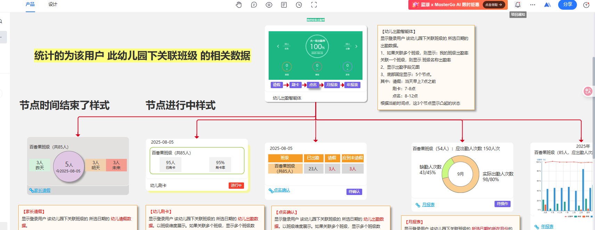
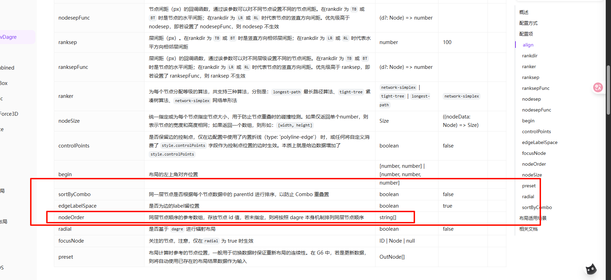
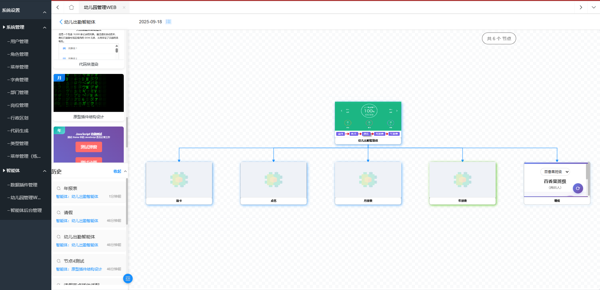
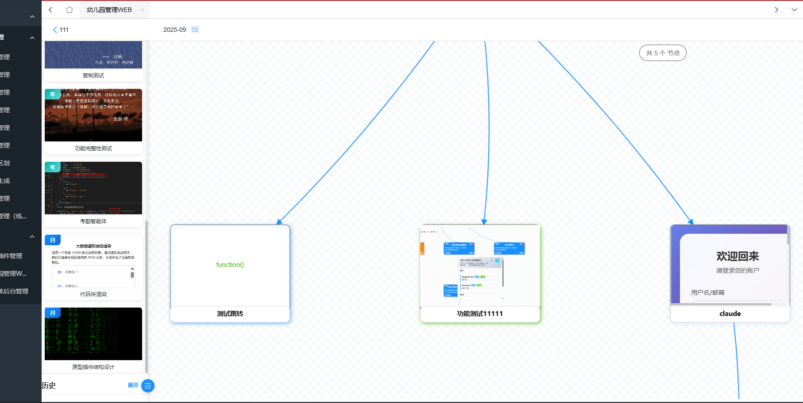
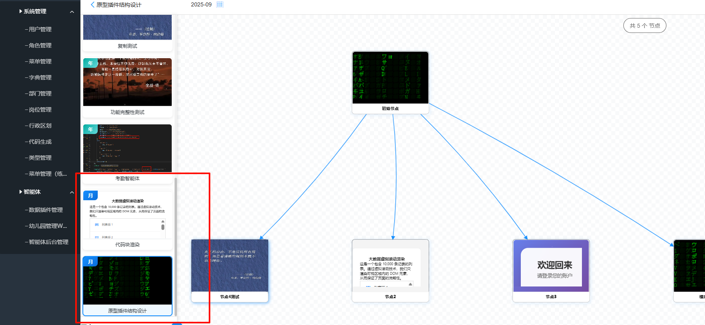
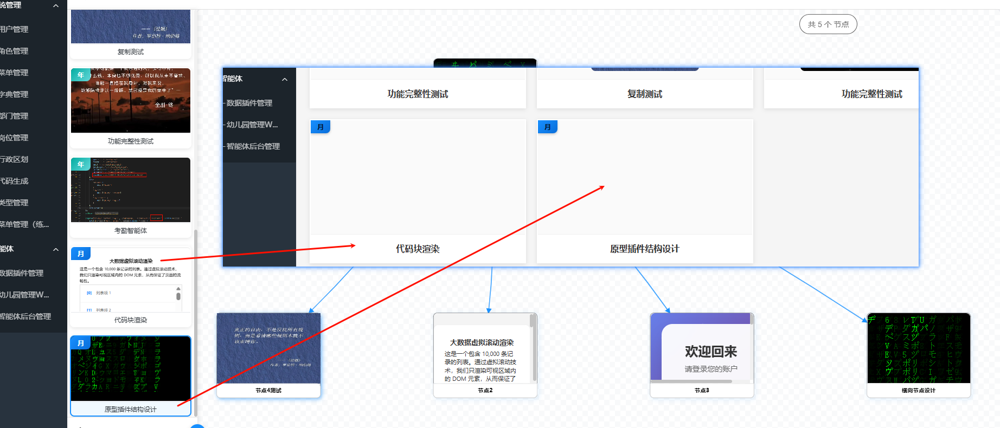
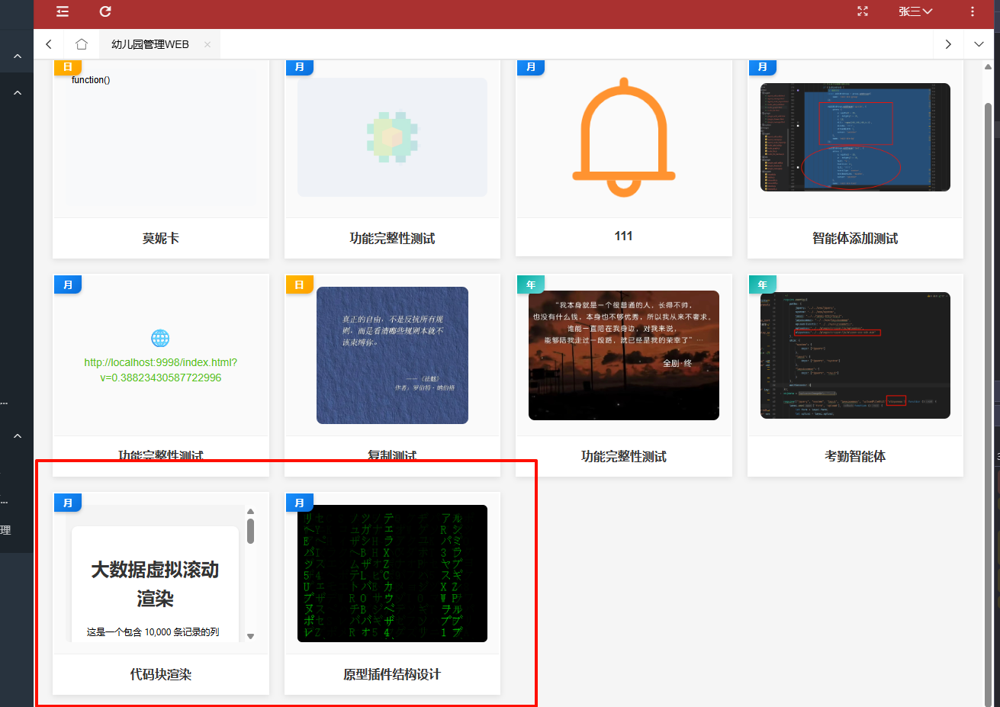
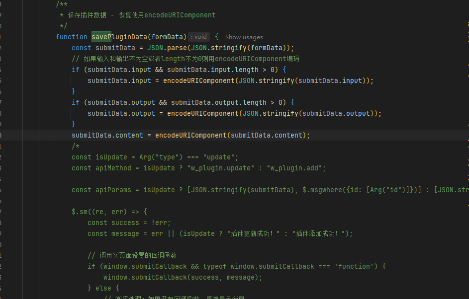

## 节点顺序问题    待解决



场景：之前的是流程类型，那么就可以根据添加子节点形成流程那种样式，

但是设计这部分给到的根本不像是流程，因为都放在了同级

1. **按照这个设计，那么就无法保证了后台添加节点的顺序显示**
2. 需要别的解决方案  之前有个节点类型去，不过那也只能控制颜色显示，在后台刚好使用（但是这种与）
3. 还得去看官网的节点顺序

通过查看官网，发现了有个专门控制顺序的，shit  还没有来得及看   就先去问了李总



虽然添加了nodeOrder  但是底层是按照降序吗？还是升序？


### 效果




## 历史点击节点

开始设计的时候是跳转配置的URL

现在是需要转到对应的节点，并设置为选中状态

点击的时候知道智能体id  和节点id

**还有跨页面通信   效果就是点击某条历史记录之后，通过agentId去找到相应的智能体**

**再将节点id传到node_graph_web.js中，接收到后渲染节点流程，并将对应节点id的节点的选中状态换为选中状态**




## 幼儿园端修复

### 适用角色变更为适用职务

适用职务是从哪里拿的数据？**这是从别的系统中拿到的**


### 智能体详情页面渲染



原始没有渲染出来

### 智能体列表的html类型渲染



最开始设计的时候只展示了文本，如果文本过长还会去截断，但是现在需要渲染出来，原有的代码处理逻辑太差，优化处理代码逻辑。


最终渲染出来了

## 插件存content数据的

content本身是text类型的，但是我们在后台添加的时候会出问题
当时谈到了使用encode一下，但是使用了encode后依然出问题

猜测的原因是因为content里面有相应的引号，去阻挡了拆分，但是引号很难避免，因为，哪怕不写注释，样式里面呢也可能有引号，




**修改后的代码，**

**这是一个非常小丑的操作：**

**<font color="red">最开始报错的原因是因为一开始就将submitData给到了要提交的数组，也就是说没有先处理数据，然后再给到后端</font>**


后面修改逻辑后：先处理数据，再给到提交值（粗心）


### 测试的HTML

```html
<!DOCTYPE html>
<html lang="zh-CN">
<head>
    <meta charset="UTF-8">
    <meta name="viewport" content="width=device-width, initial-scale=1.0">
    <title>黑客雨</title>
    <style>
        /* CSS 部分 */
        body {
            margin: 0;
            overflow: hidden; /* 隐藏滚动条 */
            background-color: #000; /* 设置背景为黑色 */
        }

        #matrix-canvas {
            display: block; /* 将canvas元素设置为块级元素 */
        }
    </style>
</head>
<body>
    <canvas id="matrix-canvas"></canvas>

    <script>
        // JavaScript 部分

        // 获取canvas元素和它的2D渲染上下文
        const canvas = document.getElementById('matrix-canvas');
        const ctx = canvas.getContext('2d');

        // 设置canvas的宽度和高度以填满整个窗口
        canvas.width = window.innerWidth;
        canvas.height = window.innerHeight;

        // 定义要显示的字符集 (片假名、数字和字母)
        const characters = 'アァカサタナハマヤャラワガザダバパイィキシチニヒミリヰギジヂビピウゥクスツヌフムユュルグズブヅプエェケセテネヘメレヱゲゼデベペオォコソトノホモヨョロヲゴゾドボポヴッン0123456789ABCDEFGHIJKLMNOPQRSTUVWXYZ';
        const charactersArray = characters.split('');

        // 定义字体大小和列数
        const fontSize = 16;
        const columns = Math.floor(canvas.width / fontSize);

        // 创建一个数组来存储每一列的当前y坐标
        const drops = [];
        for (let x = 0; x < columns; x++) {
            drops[x] = 1;
        }

        // 绘制函数，会重复调用以产生动画效果
        function draw() {
            // 用一个半透明的黑色矩形覆盖整个canvas，以创建字符的拖尾效果
            ctx.fillStyle = 'rgba(0, 0, 0, 0.05)';
            ctx.fillRect(0, 0, canvas.width, canvas.height);

            // 设置字符的颜色和字体
            ctx.fillStyle = '#0F0'; // 绿色
            ctx.font = fontSize + 'px monospace';

            // 遍历每一列
            for (let i = 0; i < drops.length; i++) {
                // 从字符集中随机选择一个字符
                const text = charactersArray[Math.floor(Math.random() * charactersArray.length)];
                
                // 在(x, y)坐标处绘制字符
                ctx.fillText(text, i * fontSize, drops[i] * fontSize);

                // 如果字符到达屏幕底部，有一定几率将其重置回顶部
                if (drops[i] * fontSize > canvas.height && Math.random() > 0.975) {
                    drops[i] = 0;
                }

                // 增加y坐标，使字符下落
                drops[i]++;
            }
        }

        // 每隔33毫秒调用一次draw函数，形成动画
        setInterval(draw, 33);

        // 当窗口大小改变时，重新设置canvas的大小并重新计算列数
        window.addEventListener('resize', () => {
            canvas.width = window.innerWidth;
            canvas.height = window.innerHeight;
            // 重新计算列数，但保留现有的drops数组，避免效果中断
        });
    </script>
</body>
</html>
```


