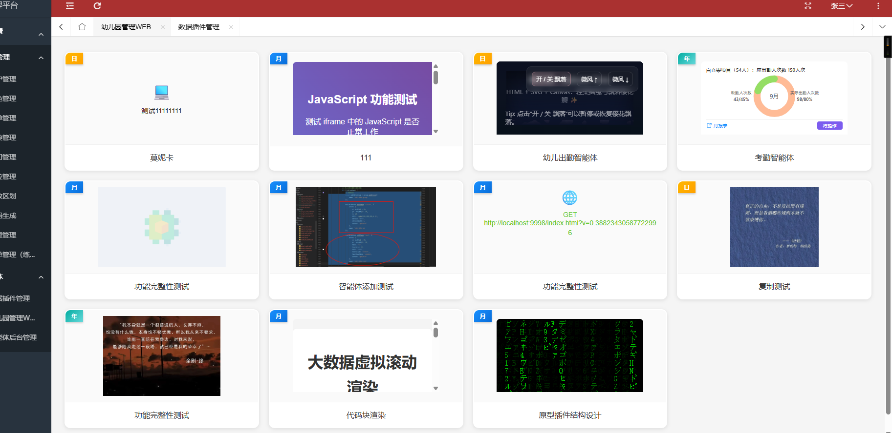

## 测试插件

### 1、点名插件

```html
<!DOCTYPE html>
<html lang="zh-CN">
<head>
    <meta charset="UTF-8">
    <meta name="viewport" content="width=device-width, initial-scale=1.0">
    <title>环形图数据展示</title>
    <style>
        * {
            margin: 0;
            padding: 0;
            box-sizing: border-box;
        }
        
        body {
            width: 100vw;
            height: 100vh;
            font-family: -apple-system, BlinkMacSystemFont, "Segoe UI", Arial, sans-serif;
            background: #fff;
            padding: 3.5vw;
            display: flex;
            flex-direction: column;
            overflow: hidden;
        }
        
        .header {
            font-size: 3.4vw;
            color: #333;
            margin-bottom: 2.8vh;
            font-weight: 500;
            line-height: 1.3;
        }
        
        .chart-container {
            flex: 1;
            display: flex;
            align-items: center;
            justify-content: center;
            position: relative;
            min-height: 0;
        }
        
        .donut-chart {
            position: relative;
            width: 34vw;
            height: 34vw;
            max-width: 63vh;
            max-height: 63vh;
        }
        
        .donut-svg {
            transform: rotate(-90deg);
            width: 100%;
            height: 100%;
        }
        
        .center-text {
            position: absolute;
            top: 50%;
            left: 50%;
            transform: translate(-50%, -50%);
            text-align: center;
            font-size: 4vw;
            color: #666;
            font-weight: 500;
        }
        
        .label {
            position: absolute;
            font-size: 2.8vw;
            color: #333;
            display: flex;
            flex-direction: column;
            align-items: center;
            text-align: center;
            line-height: 1.4;
        }
        
        .label-value {
            font-weight: 600;
            color: #333;
            margin-top: 0.5vh;
            font-size: 3vw;
        }
        
        .label-desc {
            color: #666;
            white-space: nowrap;
        }
        
        .label-left {
            left: -13.7vw;
            top: 50%;
            transform: translateY(-50%);
        }
        
        .label-right {
            right: -14.8vw;
            top: 50%;
            transform: translateY(-50%);
        }
        
        .footer {
            display: flex;
            justify-content: space-between;
            align-items: center;
            margin-top: 2.8vh;
            padding-top: 2.2vh;
            border-top: 1px solid #f0f0f0;
        }
        
        .link {
            display: flex;
            align-items: center;
            font-size: 3.1vw;
            color: #1890ff;
            text-decoration: none;
            cursor: pointer;
        }
        
        .link:hover {
            color: #40a9ff;
        }
        
        .link-icon {
            width: 4vw;
            height: 4vw;
            margin-right: 1.2vw;
        }
        
        .btn {
            background: #7c5cef;
            color: white;
            border: none;
            padding: 1.4vh 4vw;
            border-radius: 1.2vw;
            font-size: 3.1vw;
            cursor: pointer;
            transition: background 0.3s;
            white-space: nowrap;
        }
        
        .btn:hover {
            background: #6a4dd4;
        }
    </style>
</head>
<body>
    <div class="header">百香果项目（54人）：应出勤人次数 150人次</div>
    
    <div class="chart-container">
        <div class="donut-chart">
            <svg class="donut-svg" viewBox="0 0 120 120" preserveAspectRatio="xMidYMid meet">
                <!-- 背景圆环 -->
                <circle cx="60" cy="60" r="45" fill="none" stroke="#f0f0f0" stroke-width="18"/>
                
                <!-- 橙色部分 (实际出勤) - 80% -->
                <circle cx="60" cy="60" r="45" fill="none" stroke="#ffbb96" stroke-width="18"
                        stroke-dasharray="226 283" stroke-linecap="round"/>
                
                <!-- 绿色部分 (缺勤) - 45% -->
                <circle cx="60" cy="60" r="45" fill="none" stroke="#95de64" stroke-width="18"
                        stroke-dasharray="127 382" stroke-dashoffset="-226" stroke-linecap="round"/>
            </svg>
            
            <div class="center-text">9月</div>
            
            <!-- 左侧标签 -->
            <div class="label label-left">
                <span class="label-desc">缺勤人次数</span>
                <span class="label-value">43/45%</span>
            </div>
            
            <!-- 右侧标签 -->
            <div class="label label-right">
                <span class="label-desc">实际出勤人次数</span>
                <span class="label-value">98/80%</span>
            </div>
        </div>
    </div>
    
    <div class="footer">
        <a href="javascript:void(0);" class="link" onclick="alert('查看月报表')">
            <svg class="link-icon" viewBox="0 0 1024 1024" fill="currentColor">
                <path d="M832 128H640v64h146.752L521.344 457.344l45.312 45.312L832 237.248V384h64V128z"/>
                <path d="M768 832H192V256h352v-64H160a32 32 0 0 0-32 32v640a32 32 0 0 0 32 32h640a32 32 0 0 0 32-32V480h-64v352z"/>
            </svg>
            月报表
        </a>
        <button class="btn" onclick="alert('待提作功能')">待提作</button>
    </div>
</body>
</html>
```

### 2、年报表

```html
<!DOCTYPE html>
<html lang="zh-CN">
<head>
    <meta charset="UTF-8">
    <meta name="viewport" content="width=device-width, initial-scale=1.0">
    <title>出勤统计</title>
</head>
<body>

<!-- TODO 放的内容-->
<div class="chart-wrapper">
    <div class="header">
        <div class="year">2025年</div>
        <div class="subtitle">百香果班级（85人，应出勤人次数1823人次）</div>
    </div>

    <div class="chart-container">
        <canvas id="attendanceChart"></canvas>
    </div>
</div>

</body>

<script src="https://cdnjs.cloudflare.com/ajax/libs/Chart.js/3.9.1/chart.min.js"></script>
<script>
const ctx = document.getElementById('attendanceChart').getContext('2d');

const months = ['六月', '七月', '十一月', '一月', '二月', '三月', '四月', '五月', '六月', '七月', '八月'];

const attendanceRate = [100, 100, 100, 100, 100, 100, 100, 100, 100, 100, 100];

const actualData = [22, 45, 12, 48, 18, 42, 25, 85, 50, 22, 3];
const industryData = [10, 4, 10, 5, 8, 12, 25, 0, 26, 12, 3];
const leaveData = [10, 0, 0, 0, 0, 8, 0, 22, 0, 0, 0];
const otherData = [0, 0, 0, 0, 0, 0, 0, 0, 0, 20, 0];

function getResponsiveSizes() {
    const width = window.innerWidth;
    const height = window.innerHeight;
    const base = Math.min(width, height);
    
    return {
        legendFont: Math.max(10, base * 0.013),
        legendPadding: Math.max(12, base * 0.015),
        legendBox: Math.max(6, base * 0.008),
        tooltipFont: Math.max(10, base * 0.012),
        axisFont: Math.max(9, base * 0.011),
        titleFont: Math.max(10, base * 0.012),
        pointRadius: Math.max(3, base * 0.005),
        lineWidth: Math.max(1.5, base * 0.0025),
        padding: Math.max(6, base * 0.008)
    };
}

function updateChartSizes() {
    const sizes = getResponsiveSizes();
    
    chart.options.plugins.legend.labels.font.size = sizes.legendFont;
    chart.options.plugins.legend.labels.padding = sizes.legendPadding;
    chart.options.plugins.legend.labels.boxWidth = sizes.legendBox;
    chart.options.plugins.legend.labels.boxHeight = sizes.legendBox;
    
    chart.options.plugins.tooltip.titleFont.size = sizes.tooltipFont;
    chart.options.plugins.tooltip.bodyFont.size = sizes.tooltipFont - 1;
    chart.options.plugins.tooltip.padding = sizes.padding + 2;
    
    chart.options.scales.x.ticks.font.size = sizes.axisFont;
    chart.options.scales.x.ticks.padding = sizes.padding;
    
    chart.options.scales.y.title.font.size = sizes.titleFont;
    chart.options.scales.y.ticks.font.size = sizes.axisFont;
    chart.options.scales.y.ticks.padding = sizes.padding;
    
    chart.options.scales.y1.title.font.size = sizes.titleFont;
    chart.options.scales.y1.ticks.font.size = sizes.axisFont;
    chart.options.scales.y1.ticks.padding = sizes.padding;
    
    chart.data.datasets[0].pointRadius = sizes.pointRadius;
    chart.data.datasets[0].borderWidth = sizes.lineWidth;
    chart.data.datasets[0].pointBorderWidth = sizes.lineWidth * 0.8;
    
    chart.update('none');
}

const chart = new Chart(ctx, {
    type: 'bar',
    data: {
        labels: months,
        datasets: [
            {
                type: 'line',
                label: '出勤率',
                data: attendanceRate,
                borderColor: '#FF6B6B',
                backgroundColor: 'transparent',
                borderWidth: 2.5,
                pointRadius: 5,
                pointBackgroundColor: '#FF6B6B',
                pointBorderColor: '#FF6B6B',
                pointBorderWidth: 2,
                yAxisID: 'y1',
                order: 0,
                tension: 0
            },
            {
                label: '实值',
                data: actualData,
                backgroundColor: '#4A9EFF',
                barPercentage: 0.7,
                categoryPercentage: 0.8,
                yAxisID: 'y'
            },
            {
                label: '病假',
                data: industryData,
                backgroundColor: '#52C7A5',
                barPercentage: 0.7,
                categoryPercentage: 0.8,
                yAxisID: 'y'
            },
            {
                label: '事假',
                data: leaveData,
                backgroundColor: '#FFB84D',
                barPercentage: 0.7,
                categoryPercentage: 0.8,
                yAxisID: 'y'
            },
            {
                label: '其他',
                data: otherData,
                backgroundColor: '#A8A8A8',
                barPercentage: 0.7,
                categoryPercentage: 0.8,
                yAxisID: 'y'
            }
        ]
    },
    options: {
        responsive: true,
        maintainAspectRatio: false,
        interaction: {
            mode: 'index',
            intersect: false
        },
        plugins: {
            legend: {
                display: true,
                position: 'bottom',
                labels: {
                    usePointStyle: true,
                    pointStyle: 'circle',
                    padding: 20,
                    font: {
                        size: 13,
                        family: '-apple-system, BlinkMacSystemFont, "Segoe UI", Arial, sans-serif'
                    },
                    color: '#666',
                    boxWidth: 8,
                    boxHeight: 8
                }
            },
            tooltip: {
                backgroundColor: 'rgba(0, 0, 0, 0.75)',
                padding: 10,
                titleFont: {
                    size: 13
                },
                bodyFont: {
                    size: 12
                },
                cornerRadius: 4
            }
        },
        scales: {
            x: {
                grid: {
                    display: false,
                    drawBorder: false
                },
                ticks: {
                    font: {
                        size: 13,
                        family: '-apple-system, BlinkMacSystemFont, "Segoe UI", Arial, sans-serif'
                    },
                    color: '#666',
                    padding: 8
                }
            },
            y: {
                type: 'linear',
                position: 'right',
                beginAtZero: true,
                max: 50,
                title: {
                    display: true,
                    text: '请假人次数（人次）',
                    font: {
                        size: 12,
                        family: '-apple-system, BlinkMacSystemFont, "Segoe UI", Arial, sans-serif'
                    },
                    color: '#999',
                    padding: 10
                },
                ticks: {
                    stepSize: 10,
                    callback: function(value) {
                        return value + ' 人次';
                    },
                    font: {
                        size: 11,
                        family: '-apple-system, BlinkMacSystemFont, "Segoe UI", Arial, sans-serif'
                    },
                    color: '#999',
                    padding: 8
                },
                grid: {
                    color: '#E8E8E8',
                    drawBorder: false,
                    lineWidth: 1
                }
            },
            y1: {
                type: 'linear',
                position: 'left',
                beginAtZero: true,
                max: 100,
                title: {
                    display: true,
                    text: '出勤率（%）',
                    font: {
                        size: 12,
                        family: '-apple-system, BlinkMacSystemFont, "Segoe UI", Arial, sans-serif'
                    },
                    color: '#999',
                    padding: 10
                },
                ticks: {
                    stepSize: 20,
                    callback: function(value) {
                        return value + ' %';
                    },
                    font: {
                        size: 11,
                        family: '-apple-system, BlinkMacSystemFont, "Segoe UI", Arial, sans-serif'
                    },
                    color: '#999',
                    padding: 8
                },
                grid: {
                    display: false
                }
            }
        }
    }
});

updateChartSizes();

window.addEventListener('resize', () => {
    updateChartSizes();
});
</script>

<style>
    * {
        margin: 0;
        padding: 0;
        box-sizing: border-box;
    }

    body {
        width: 100vw;
        height: 100vh;
        font-family: -apple-system, BlinkMacSystemFont, "Segoe UI", Arial, sans-serif;
        background: #fff;
        padding: 3.5vw;
        display: flex;
        flex-direction: column;
        overflow: hidden;
    }

/*   TODO 内容区域  说明：单位统一使用vw  和 vh 切勿覆盖上面的样式  否则缩放后效果差 */

.chart-wrapper {
    width: 100%;
    height: 100%;
    display: flex;
    flex-direction: column;
    background: #fff;
    border-radius: 1vw;
    padding: 2vw;
}

.header {
    text-align: left;
    margin-bottom: 2vh;
    padding-left: 1vw;
}

.year {
    font-size: 2vw;
    font-weight: 600;
    color: #333;
    margin-bottom: 0.8vh;
    letter-spacing: 0.05em;
}

.subtitle {
    font-size: 1.2vw;
    color: #666;
    font-weight: 400;
}

.chart-container {
    flex: 1;
    width: 100%;
    position: relative;
    min-height: 0;
    padding: 1vw;
}

#attendanceChart {
    width: 100% !important;
    height: 100% !important;
}

</style>
</html>
```

## 修改list样式

### 代码

```html
<!DOCTYPE html>
<html>
<head>
    <title>智能体列表页</title>
    <meta name="renderer" content="webkit">
    <meta http-equiv="X-UA-Compatible" content="IE=edge,chrome=1">
    <meta name="viewport"
          content="width=device-width, initial-scale=1.0, minimum-scale=1.0, maximum-scale=1.0, user-scalable=0">
    <link rel="stylesheet" href="../../css/agent_node.css" media="all">
    <link rel="stylesheet" type="text/css" href="../../layui-btkj/css/layui.css" media="all">
</head>
<body>

<div class="agent-container">
    <div class="layui-row layui-col-space10" id="agentContainer">
        <!-- 智能体列表将在这里渲染 -->
    </div>
</div>

<script data-main="../../js/agent-web/agent_list" src='../../sys/require.min.js'></script>
</body>

<style>
    html, body {
        height: 100%;
        background: #f5f5f5;
        margin: 0;
        padding: 0;
    }

    /* ================ 基础容器样式 ================ */
    .agent-container {
        padding: 20px 15px;
        max-width: 100%;
        margin: 0 auto;
    }

    /* 超大屏幕适当限制最大宽度，避免卡片过宽 */
    @media (min-width: 1920px) {
        .agent-container {
            max-width: 1800px; /* 超大屏最大宽度 */
        }
    }

    /* Layui 栅格行优化 - 解决高度不一致问题 */
    .layui-row {
        display: flex;
        flex-wrap: wrap;
        align-items: stretch;
    }

    .layui-col-space10 > [class*="layui-col-"] {
        padding: 0 10px;
        display: flex;
        margin-bottom: 20px;
    }

    /* 减少栅格间距，让卡片更紧凑 */
    @media (min-width: 1200px) {
        .layui-col-space10 {
            margin: 0 -8px; /* 减少列间距 */
        }

        .layui-col-space10 > [class*="layui-col-"] {
            padding: 0 8px; /* 对应减少 */
        }
    }

    /* ================ Web端专属样式 ================ */
    .point-type-web .agent-container {
        padding: 30px 25px; /* 增加左右内边距 */
    }

    .point-type-web .layui-col-space10 > [class*="layui-col-"] {
        padding: 0 10px;
        margin-bottom: 20px;
    }

    /* Web端卡片尺寸 - 强制固定高度 */
    .point-type-web .agent-list {
        height: 240px; /* 改为固定高度，不用min-height */
    }

    .point-type-web .agent-listdiv {
        height: 200px;
        max-height: 200px; /* 强制最大高度 */
    }

    .point-type-web .agent-btn {
        padding: 15px 20px;
        font-size: 16px;
    }

    .point-type-web .agent_bg {
        padding: 4px 12px;
        font-size: 12px;
    }

    .point-type-web .link-icon,
    .point-type-web .http-icon,
    .point-type-web .code-icon,
    .point-type-web .function-icon {
        font-size: 30px;
    }

    .point-type-web .link-text,
    .point-type-web .http-text,
    .point-type-web .text-display span {
        font-size: 14px;
    }

    .point-type-web .function-code pre,
    .point-type-web .code-fallback pre {
        font-size: 12px;
    }

    /* ================ H5端专属样式 ================ */
    .point-type-h5 .agent-container {
        padding: 15px 10px;
    }

    .point-type-h5 .layui-col-space10 > [class*="layui-col-"] {
        padding: 0 5px;
        margin-bottom: 15px;
    }

    /* H5端卡片尺寸 - 强制固定高度 */
    .point-type-h5 .agent-list {
        height: 150px; /* 改为固定高度，不用min-height */
    }

    .point-type-h5 .agent-listdiv {
        height: 120px;
        max-height: 120px; /* 强制最大高度 */
    }

    .point-type-h5 .agent-btn {
        padding: 10px 15px;
        font-size: 14px;
    }

    .point-type-h5 .agent_bg {
        padding: 2px 8px;
        font-size: 10px;
    }

    .point-type-h5 .link-icon,
    .point-type-h5 .http-icon,
    .point-type-h5 .code-icon,
    .point-type-h5 .function-icon {
        font-size: 24px;
    }

    .point-type-h5 .link-text,
    .point-type-h5 .http-text,
    .point-type-h5 .text-display span {
        font-size: 12px;
    }

    .point-type-h5 .function-code pre,
    .point-type-h5 .code-fallback pre {
        font-size: 10px;
    }

    /* H5端悬浮效果较弱 */
    .point-type-h5 .agent-list:hover {
        transform: translateY(-1px) scale(1.01);
        box-shadow: 0 4px 15px rgba(0,0,0,0.12);
    }

    /* ================ 通用智能体卡片样式 ================ */
    .agent-list {
        width: 100%;
        background: #ffffff;
        border-radius: 12px;
        box-shadow: 0 2px 8px rgba(0,0,0,0.1);
        overflow: hidden;
        cursor: pointer;
        transition: all 0.3s ease;
        position: relative;
        border: 2px solid transparent;
        display: flex;
        flex-direction: column;
        /* min-height 由端类型决定 */
    }

    .agent-list:hover {
        transform: translateY(-2px) scale(1.02);
        box-shadow: 0 8px 25px rgba(0,0,0,0.15);
        border: 2px solid #1890ff;
        z-index: 10;
        background: #fafafa;
    }

    /* 时间粒度标签 */
    .agent_bg {
        position: absolute;
        top: 0;
        left: 0;
        z-index: 2;
        box-shadow: 0 2px 4px rgba(0,0,0,0.2);
        color: white;
        font-weight: bold;
        /* padding 和 font-size 由端类型决定 */
    }

    .agent_bg.daybg {
        background: linear-gradient(135deg, #ffb800, #ffa000);
    }

    .agent_bg.mouthbg {
        background: linear-gradient(135deg, #1890ff, #096dd9);
    }

    .agent_bg.yearbg {
        background: linear-gradient(135deg, #02aca0, #65d8da);
    }

    /* 不同时间粒度的悬浮边框颜色 */
    .agent-list[data-time-granularity="日"]:hover {
        border: 2px solid #ff9800;
        box-shadow: 0 8px 25px rgba(255, 152, 0, 0.3);
    }

    .agent-list[data-time-granularity="月"]:hover {
        border: 2px solid #2196f3;
        box-shadow: 0 8px 25px rgba(33, 150, 243, 0.3);
    }

    .agent-list[data-time-granularity="年"]:hover {
        border: 2px solid #4caf50;
        box-shadow: 0 8px 25px rgba(76, 175, 80, 0.3);
    }

    /* 智能体内容区域 - 强制限制高度，超出滚动 */
    .agent-listdiv {
        flex: 1;
        /* height 由端类型决定 */
        display: flex;
        align-items: center;
        justify-content: center;
        background: #fafafa;
        position: relative;
        transition: all 0.3s ease;
        overflow: hidden; /* 防止内容溢出 */
        padding: 12px;
    }

    .agent-list:hover .agent-listdiv {
        background: #f0f8ff;
    }

    .agent-listdiv img {
        max-width: 100%;
        max-height: 100%;
        width: auto;
        height: auto;
        object-fit: contain; /* 改为contain，完整显示图片 */
        transition: all 0.3s ease;
    }

    .agent-list:hover .agent-listdiv img {
        transform: scale(1.05);
    }

    /* 内容显示 - 强制限制在容器内 */
    .content-display {
        width: 100%;
        height: 100%;
        max-height: 100%; /* 关键：不能超过父容器 */
        display: flex;
        align-items: center;
        justify-content: center;
        text-align: center;
        flex-direction: column;
        padding: 8px;
        overflow: hidden; /* 防止溢出 */
    }

    /* 超链接显示样式 */
    .superlink-display {
        color: #1890ff;
    }

    .link-icon,
    .http-icon {
        margin-bottom: 8px;
        /* font-size 由端类型决定 */
    }

    .link-text,
    .http-text {
        line-height: 1.4;
        max-height: 100%; /* 改为100%，完全受父容器控制 */
        overflow-y: auto;
        word-break: break-all;
        flex: 1; /* 自动填充空间 */
        /* font-size 由端类型决定 */
    }

    /* HTTP显示样式 */
    .http-display {
        color: #52c41a;
    }

    /* 代码显示样式 */
    .code-display {
        width: 100%;
        height: 100%;
        padding: 0;
    }

    .code-iframe {
        width: 100%;
        height: 100%;
        border: none;
        border-radius: 6px;
        background: #f8f9fa;
    }

    .code-fallback {
        width: 100%;
        height: 100%;
        display: flex;
        flex-direction: column;
        align-items: center;
        justify-content: center;
        background: #f8f9fa;
        border-radius: 6px;
        padding: 8px;
    }

    .code-icon {
        color: #722ed1;
        margin-bottom: 8px;
        /* font-size 由端类型决定 */
    }

    .code-fallback pre {
        margin: 0;
        max-height: 100%; /* 受父容器控制 */
        overflow-y: auto;
        background: transparent;
        padding: 0;
        line-height: 1.3;
        flex: 1;
        /* font-size 由端类型决定 */
    }

    /* 函数显示样式 */
    .function-display {
        color: #fa541c;
    }

    .function-icon {
        margin-bottom: 8px;
        /* font-size 由端类型决定 */
    }

    .function-code {
        width: 100%;
        max-height: 100%; /* 受父容器控制 */
        overflow-y: auto;
        flex: 1;
    }

    .function-code pre {
        margin: 0;
        background: #f8f8f8;
        border-radius: 4px;
        padding: 6px;
        line-height: 1.3;
        /* font-size 由端类型决定 */
    }

    /* 文本显示样式 - 限制高度 */
    .text-display {
        width: 100%;
        height: 100%;
        max-height: 100%;
        display: flex;
        align-items: center;
        justify-content: center;
        overflow: hidden;
    }

    .text-display span {
        color: #666;
        line-height: 1.5;
        max-height: 100%; /* 受父容器控制 */
        overflow-y: auto;
        transition: all 0.3s ease;
        display: block;
        word-break: break-word;
        flex: 1;
        /* font-size 由端类型决定 */
    }

    .agent-list:hover .text-display span {
        color: #333;
    }

    /* 智能体名称按钮 */
    .agent-btn {
        background: #fff;
        border-top: 1px solid #f0f0f0;
        text-align: center;
        color: #333;
        transition: all 0.3s ease;
        flex-shrink: 0;
        /* padding 和 font-size 由端类型决定 */
    }

    .agent-list:hover .agent-btn {
        background: #1890ff;
        color: #fff;
        border-top: 1px solid #1890ff;
    }

    /* 错误状态样式 */
    .empty-state {
        text-align: center;
        padding: 50px 20px;
        color: #999;
    }

    .empty-icon {
        font-size: 42px;
        margin-bottom: 16px;
    }

    .empty-text {
        font-size: 16px;
        color: #666;
        margin-bottom: 8px;
    }

    .empty-desc {
        font-size: 13px;
        color: #999;
        margin-bottom: 18px;
    }

    .empty-actions {
        margin-top: 20px;
    }

    /* 响应式布局调整 */
    @media (max-width: 768px) {
        .agent-container {
            padding: 15px 10px;
        }

        .layui-col-space10 > [class*="layui-col-"] {
            margin-bottom: 15px;
        }

        /* 中屏幕调整，仍保持固定高度 */
        .point-type-web .agent-list {
            height: 260px;
        }

        .point-type-web .agent-listdiv {
            height: 160px;
            max-height: 160px;
        }

        .point-type-web .agent-btn {
            padding: 12px 14px;
            font-size: 15px;
        }
    }

    @media (max-width: 480px) {
        .point-type-h5 .agent-container {
            padding: 10px 8px;
        }

        .point-type-h5 .layui-col-space10 > [class*="layui-col-"] {
            padding: 0 4px;
            margin-bottom: 12px;
        }

        /* 小屏幕调整，仍保持固定高度 */
        .point-type-web .agent-list {
            height: 240px;
        }

        .point-type-web .agent-listdiv {
            height: 140px;
            max-height: 140px;
        }

        .point-type-h5 .agent-list {
            height: 180px;
        }

        .point-type-h5 .agent-listdiv {
            height: 100px;
        }

        .agent-btn {
            padding: 10px 12px;
            font-size: 13px;
        }

        .agent_bg {
            padding: 3px 8px;
            font-size: 10px;
        }
    }

    /* 优化滚动条样式 */
    .link-text::-webkit-scrollbar,
    .http-text::-webkit-scrollbar,
    .text-display span::-webkit-scrollbar,
    .function-code::-webkit-scrollbar,
    .code-fallback pre::-webkit-scrollbar {
        width: 4px;
        height: 4px;
    }

    .link-text::-webkit-scrollbar-thumb,
    .http-text::-webkit-scrollbar-thumb,
    .text-display span::-webkit-scrollbar-thumb,
    .function-code::-webkit-scrollbar-thumb,
    .code-fallback pre::-webkit-scrollbar-thumb {
        background: rgba(0,0,0,0.2);
        border-radius: 2px;
    }

    .link-text::-webkit-scrollbar-thumb:hover,
    .http-text::-webkit-scrollbar-thumb:hover,
    .text-display span::-webkit-scrollbar-thumb:hover,
    .function-code::-webkit-scrollbar-thumb:hover,
    .code-fallback pre::-webkit-scrollbar-thumb:hover {
        background: rgba(0,0,0,0.3);
    }
</style>
</html>
```

原有效果是没有对齐的

### 效果


