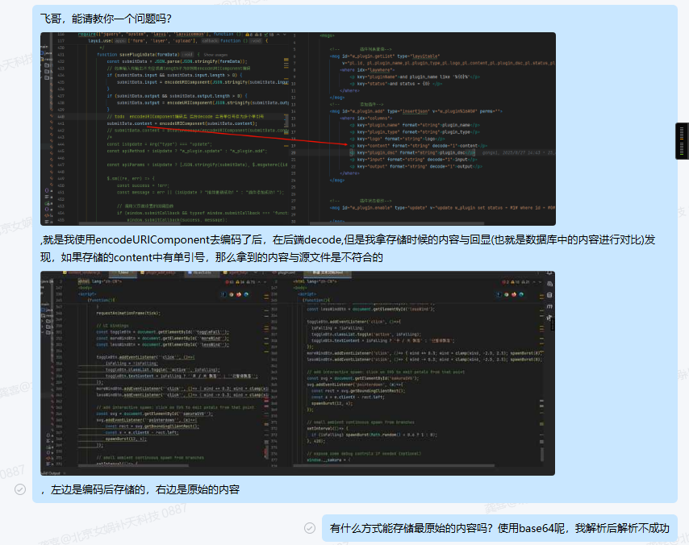

## content内容渲染

agent_list.js   agent_detail.js    node_graph_web.js

这三个文件中都涉及到了，针对不同类型的content去渲染，包括code类型，http类型等，这就导致了代码冗余量大，现在我想要将这几种渲染封装到一个js文件当中，然后在这三个文件中require进行引入，新建的js文件与这三个文件在同一个目录下，且结构也要与提供的文件结构一致


### 新问题

iframe是不支持js的   需要考虑使用别的方法


# 重构

之前的实现中，对于content的渲染，在三个地方(agent_list.js、agent_detail.js、node_graph_web.js)都涉及到了，但是最开始的一版，三个地方的渲染都在对应的js文件中，这就导致了代码不仅非常的臃肿，而且很不灵活，如果要全面的改，那就需要修改三个地方，鉴于三个文件的code类型的渲染效果是一样的，那么就可以将其封装起来，又原本的节点配置是在node_graph_web.js中的，导致了文件的代码量很大，就考虑将节点的样式等也封装到一个文件当中，也方便维护

## content_renderer.js

```js
/**
 * 作者: 龚喜
 * 内容渲染工具模块 - 优化版
 * 统一处理不同类型的插件内容渲染
 * 创建时间: 2025-10-09
 * 优化时间: 2025-10-10 修复HTML包装、权限检查、iframe管理问题
 */

require.config({
    paths: {
        jquery: '../../sys/jquery'
    },
    waitSeconds: 0
});

// 全局内容渲染器对象
var ContentRenderer = (function() {

    // 默认图片路径
    const DEFAULT_LOGO_PATH = '../../images/agentimg/agentimg.jpg';

    // 插件类型配置
    const PLUGIN_TYPES = {
        superlink: {
            name: '超链接',
            icon: '🔗',
            bgColor: '#e6f7ff',
            borderColor: '#1890ff',
            textColor: '#1890ff'
        },
        http: {
            name: 'HTTP请求',
            icon: '🌐',
            bgColor: '#fff7e6',
            borderColor: '#fa8c16',
            textColor: '#fa8c16'
        },
        code: {
            name: '代码执行',
            icon: '💻',
            bgColor: '#f6ffed',
            borderColor: '#52c41a',
            textColor: '#52c41a'
        },
        function: {
            name: '函数调用',
            icon: '⚡',
            bgColor: '#f9f0ff',
            borderColor: '#722ed1',
            textColor: '#722ed1'
        },
        default: {
            name: '默认内容',
            icon: '📄',
            bgColor: 'transparent',
            borderColor: 'transparent',
            textColor: '#666'
        }
    };

    // 节点样式配置
    const NODE_STYLE_CONFIG = {
        size: {
            H5: [180, 140],
            web: [280, 180]
        },
        titleHeight: {
            H5: 25,
            web: 30
        },
        fontSize: {
            title: { H5: 10, web: 12 },
            content: { H5: 9, web: 11 },
            date: { H5: 10, web: 10 },
            count: { H5: 10, web: 10 },
            mainNumber: { H5: 16, web: 16 },
            subLabel: { H5: 12, web: 12 },
            lockIcon: { H5: 20, web: 26 }
        },
        colors: {
            nodeBorder: '#818181',
            nodeBorderDisabled: '#e8e8e8',
            nodeBorderSelected: '#1890ff',
            nodeBackground: '#fff',
            nodeBackgroundDisabled: '#f5f5f5',
            shadowDefault: 'rgba(24, 144, 255, 0.6)',
            shadowClicked: 'rgba(82, 196, 26, 0.8)',
            titleText: '#0a0a0a',
            titleTextDisabled: '#999',
            contentText: '#565555',
            contentTextDisabled: '#999',
            titleBorder: '#e1e1e1',
            htmlPreviewBorder: '#52c41a',
            htmlPreviewBorderDisabled: '#d9d9d9',
            htmlPreviewBackground: '#fff',
            htmlPreviewBackgroundDisabled: '#f5f5f5'
        },
        layout: {
            nodesep: { H5: 10, web: 40 },
            ranksep: { H5: 10, web: 25 },
            rankdir: { H5: 'TB', web: 'TB' },
            fitViewPadding: { H5: [20, 20, 20, 20], web: [30, 30, 30, 30] }
        },
        backgroundGrid: {
            H5: {
                background: `linear-gradient(90deg, rgba(0,0,0,0.1) 1px, transparent 1px),
                    linear-gradient(180deg, rgba(0,0,0,0.1) 1px, transparent 1px)`,
                backgroundSize: '20px 20px',
                backgroundPosition: '0 0, 0 10px, 10px -10px, -10px 0px'
            },
            web: {
                background: `linear-gradient(45deg, #f8f9fa 25%, transparent 25%),
                              linear-gradient(-45deg, #f8f9fa 25%, transparent 25%),
                              linear-gradient(45deg, transparent 75%, #f8f9fa 75%),
                              linear-gradient(-45deg, transparent 75%, #f8f9fa 75%)`,
                backgroundSize: '20px 20px',
                backgroundPosition: '0 0, 0 10px, 10px -10px, -10px 0px'
            }
        }
    };

    // iframe管理器 - 优化版
    const IframeManager = {
        iframes: new Map(),

        create: function(containerId, htmlContent, isComplete = false) {
            this.destroy(containerId);

            const container = document.getElementById(containerId);
            if (!container) return null;

            const iframe = document.createElement('iframe');
            iframe.style.cssText = `
                width: 100%;
                height: 100%;
                border: none;
                border-radius: 4px;
            `;

            // 修复：完整HTML不需要再包装  TODO srcdoc是不允许js的
            if (isComplete) {
                iframe.srcdoc = htmlContent;
            } else {
                // 只有HTML片段才需要包装
                iframe.srcdoc = this.wrapHtmlContent(htmlContent);
            }

            container.appendChild(iframe);
            this.iframes.set(containerId, iframe);

            return iframe;
        },

        wrapHtmlContent: function(htmlContent) {
            return `
                <!DOCTYPE html>
                <html>
                <head>
                    <meta charset="utf-8">
                    <meta name="viewport" content="width=device-width, initial-scale=1.0">
                    <style>
                        * { margin: 0; padding: 0; box-sizing: border-box; }
                        body { 
                            font-family: Arial, sans-serif; 
                            font-size: 10px; 
                            line-height: 1.2;
                            overflow: hidden;
                            transform: scale(0.8);
                            transform-origin: top left;
                            width: 125%;
                            height: 125%;
                        }
                        img { max-width: 100%; max-height: 40px; }
                        h1, h2, h3, h4, h5, h6 { font-size: 11px; margin: 1px 0; }
                        p, div { font-size: 9px; margin: 1px 0; }
                    </style>
                </head>
                <body>${htmlContent}</body>
                </html>
            `;
        },

        destroy: function(containerId) {
            const iframe = this.iframes.get(containerId);
            if (iframe && iframe.parentNode) {
                iframe.parentNode.removeChild(iframe);
                this.iframes.delete(containerId);
            }
        },

        destroyAll: function() {
            this.iframes.forEach((iframe, id) => {
                this.destroy(id);
            });
            this.iframes.clear();
        }
    };

    /**
     * 获取节点样式配置
     */
    function getNodeStyleConfig(configPath, pointType = 'web') {
        const type = pointType === 'H5' ? 'H5' : 'web';
        const pathArray = configPath.split('.');
        let config = NODE_STYLE_CONFIG;

        for (let path of pathArray) {
            config = config[path];
            if (!config) return null;
        }

        if (config && typeof config === 'object' && (config.H5 || config.web)) {
            return config[type] || config.web;
        }

        return config;
    }

    function escapeHtml(text) {
        if (!text) return '';
        const map = {
            '&': '&amp;',
            '<': '&lt;',
            '>': '&gt;',
            '"': '&quot;',
            "'": '&#039;'
        };
        return text.toString().replace(/[&<>"']/g, m => map[m]);
    }

    function isHtmlContent(content) {
        if (!content) return false;
        return /<[^>]+>/.test(content);
    }

    function isCompleteHtml(content) {
        if (!content) return false;
        const trimmed = content.trim().toLowerCase();
        return trimmed.startsWith('<!doctype html') || trimmed.startsWith('<html');
    }

    function getPluginTypeConfig(pluginType) {
        return PLUGIN_TYPES[pluginType] || PLUGIN_TYPES.default;
    }

    function shouldShowLogo(item) {
        if (item.pld === 0 && (!item.logo || item.logo === '')) {
            return { showLogo: true, logoPath: DEFAULT_LOGO_PATH };
        }

        if (item.logo === 0) {
            return { showLogo: true, logoPath: DEFAULT_LOGO_PATH };
        }

        if (item.logo && !item.logo.toString().match(/^\d+$/)) {
            const logoUrl = (typeof ossPrefix !== 'undefined' ? ossPrefix : '') + item.logo;
            return { showLogo: true, logoPath: logoUrl };
        }

        return { showLogo: false, logoPath: null };
    }

    function needsHtmlRendering(item) {
        return item.pld !== 0 &&
            item.plugin_type === 'code' &&
            isHtmlContent(item.content);
    }

    function generateContentHtml(item) {
        const logoInfo = shouldShowLogo(item);

        if (logoInfo.showLogo) {
            return ``;
        }

        if (item.pld !== 0 && item.content) {
            return generatePluginContentDisplay(item);
        }

        return ``;
    }

    function generatePluginContentDisplay(item) {
        const generators = {
            'superlink': generateSuperlinkDisplay,
            'http': generateHttpDisplay,
            'code': generateCodeDisplay,
            'function': generateFunctionDisplay
        };

        const generator = generators[item.plugin_type] || generateDefaultDisplay;
        return generator(item.content, item);
    }

    function generateSuperlinkDisplay(content) {
        const config = getPluginTypeConfig('superlink');
        const displayText = content.length > 60 ? content.substring(0, 60) + '...' : content;

        return `
            <div class="content-display superlink-display">
                <div class="link-icon">${config.icon}</div>
                <span class="link-text">${escapeHtml(displayText)}</span>
            </div>
        `;
    }

    function generateHttpDisplay(content, item) {
        const config = getPluginTypeConfig('http');
        const method = item.http_method || 'GET';
        const apiUrl = item.api_url || content || 'HTTP请求';
        const displayText = apiUrl.length > 60 ? apiUrl.substring(0, 60) + '...' : apiUrl;

        return `
            <div class="content-display http-display">
                <div class="http-icon">${config.icon}</div>
                <span class="http-method">${method}</span>
                <span class="http-text">${escapeHtml(displayText)}</span>
            </div>
        `;
    }

    function generateCodeDisplay(content, item) {
        if (isHtmlContent(content)) {
            const previewId = `code-preview-${item.id || Math.random().toString(36).substr(2, 9)}`;
            const isComplete = isCompleteHtml(content);

            setTimeout(() => {
                IframeManager.create(previewId, content, isComplete);
            }, 100);

            return `<div class="html-preview-container" id="${previewId}"></div>`;
        } else {
            const displayText = content.length > 60 ? content.substring(0, 60) + '...' : content;
            const config = getPluginTypeConfig('code');

            return `
                <div class="content-display code-display">
                    <div class="code-icon">${config.icon}</div>
                    <span class="code-text">${escapeHtml(displayText)}</span>
                </div>
            `;
        }
    }

    function generateFunctionDisplay(content, item) {
        const config = getPluginTypeConfig('function');
        const funcName = item.function_name || item.func_name || 'Function';
        const funcDesc = content || item.description || '函数调用';
        const displayText = funcDesc.length > 60 ? funcDesc.substring(0, 60) + '...' : funcDesc;

        return `
            <div class="content-display function-display">
                <div class="function-icon">${config.icon}</div>
                <div class="function-name">${escapeHtml(funcName)}</div>
                <div class="function-text">${escapeHtml(displayText)}</div>
            </div>
        `;
    }

    function generateDefaultDisplay(content) {
        if (isCompleteHtml(content)) {
            return content;
        }

        if (isHtmlContent(content)) {
            return content;
        }

        const displayText = content.length > 60 ? content.substring(0, 60) + '...' : content;
        return `
            <div class="content-display text-display">
                <span>${escapeHtml(displayText)}</span>
            </div>
        `;
    }

    function generateDetailCardContent(item) {
        const isPluginLogo = item.logo && item.logo.toString().match(/^\d+$/);

        if (!isPluginLogo && item.logo !== 0) {
            if (item.logo) {
                const logoUrl = (typeof ossPrefix !== 'undefined' ? ossPrefix : '') + item.logo;
                return ``;
            } else {
                return ``;
            }
        } else if (item.logo === 0) {
            return ``;
        } else {
            return generatePluginDetailDisplay(item);
        }
    }

    function generatePluginDetailDisplay(item) {
        const detailGenerators = {
            'superlink': generateSuperlinkDetailDisplay,
            'http': generateHttpDetailDisplay,
            'code': generateCodeDetailDisplay,
            'function': generateFunctionDetailDisplay
        };

        const generator = detailGenerators[item.plugin_type] || generateDefaultDetailDisplay;
        return generator(item);
    }

    function generateSuperlinkDetailDisplay(item) {
        const linkText = item.url || item.content || '超链接';
        const displayText = linkText.length > 15 ? linkText.substring(0, 15) + '...' : linkText;

        return `
            <div class="content-display superlink-display">
                <div class="plugin-icon" style="background: #e6f7ff; color: #1890ff; border: 1px solid #1890ff;">🔗</div>
                <div class="plugin-text" style="color: #1890ff;">${escapeHtml(displayText)}</div>
            </div>
        `;
    }

    function generateHttpDetailDisplay(item) {
        const method = item.http_method || 'GET';
        const apiUrl = item.api_url || item.content || 'HTTP请求';
        const displayText = apiUrl.length > 12 ? apiUrl.substring(0, 12) + '...' : apiUrl;

        return `
            <div class="content-display http-display">
                <div class="plugin-icon" style="background: #fff7e6; color: #fa8c16; border: 1px solid #fa8c16;">🌐</div>
                <div class="plugin-method" style="color: #fa8c16; font-weight: bold; font-size: 11px;">${method}</div>
                <div class="plugin-text" style="color: #666; font-size: 10px;">${escapeHtml(displayText)}</div>
            </div>
        `;
    }

    function generateCodeDetailDisplay(item) {
        const codeText = item.content || '代码执行';

        if (isHtmlContent(codeText)) {
            const previewId = `code-preview-${item.id}`;
            const isComplete = isCompleteHtml(codeText);

            setTimeout(() => {
                IframeManager.create(previewId, codeText, isComplete);
            }, 100);

            return `<div class="html-preview-container" id="${previewId}" style="
                width: 100%; 
                height: 100%;              
                border-radius: 4px;
                overflow: hidden;
                background: #fff;
            "></div>`;
        } else {
            const displayText = codeText.length > 10 ? codeText.substring(0, 10) + '...' : codeText;
            return `
                <div class="content-display code-display">
                    <div class="plugin-icon" style="background: #f6ffed; color: #52c41a; border: 1px solid #52c41a; font-family: monospace;">&lt;/&gt;</div>
                    <div class="plugin-text" style="color: #666; font-size: 9px; font-family: monospace;">${escapeHtml(displayText)}</div>
                </div>
            `;
        }
    }

    function generateFunctionDetailDisplay(item) {
        const funcName = item.function_name || item.func_name || 'Function';
        const funcDesc = item.content || item.description || '函数调用';
        const displayText = funcDesc.length > 10 ? funcDesc.substring(0, 10) + '...' : funcDesc;

        return `
            <div class="content-display function-display">
                <div class="plugin-icon" style="background: #f9f0ff; color: #722ed1; border: 1px solid #722ed1; font-family: serif;">ƒ</div>
                <div class="plugin-method" style="color: #722ed1; font-weight: bold; font-size: 10px;">${escapeHtml(funcName)}</div>
                <div class="plugin-text" style="color: #666; font-size: 9px;">${escapeHtml(displayText)}</div>
            </div>
        `;
    }

    function generateDefaultDetailDisplay(item) {
        const content = item.content || '无内容';

        if (isCompleteHtml(content)) {
            return content;
        }

        if (isHtmlContent(content)) {
            return content;
        }

        const displayText = content.length > 30 ? content.substring(0, 30) + '...' : content;
        return `
            <div class="content-display">
                <span>${escapeHtml(displayText)}</span>
            </div>
        `;
    }

    // 暴露公共API
    return {
        escapeHtml: escapeHtml,
        isHtmlContent: isHtmlContent,
        isCompleteHtml: isCompleteHtml,
        getPluginTypeConfig: getPluginTypeConfig,
        shouldShowLogo: shouldShowLogo,
        needsHtmlRendering: needsHtmlRendering,
        getNodeStyleConfig: getNodeStyleConfig,
        NODE_STYLE_CONFIG: NODE_STYLE_CONFIG,
        generateContentHtml: generateContentHtml,
        generatePluginContentDisplay: generatePluginContentDisplay,
        generateDetailCardContent: generateDetailCardContent,
        generatePluginDetailDisplay: generatePluginDetailDisplay,
        generateSuperlinkDisplay: generateSuperlinkDisplay,
        generateHttpDisplay: generateHttpDisplay,
        generateCodeDisplay: generateCodeDisplay,
        generateFunctionDisplay: generateFunctionDisplay,
        generateDefaultDisplay: generateDefaultDisplay,
        generateSuperlinkDetailDisplay: generateSuperlinkDetailDisplay,
        generateHttpDetailDisplay: generateHttpDetailDisplay,
        generateCodeDetailDisplay: generateCodeDetailDisplay,
        generateFunctionDetailDisplay: generateFunctionDetailDisplay,
        generateDefaultDetailDisplay: generateDefaultDetailDisplay,
        IframeManager: IframeManager,
        createCodePreviewIframe: function(containerId, htmlContent, isComplete) {
            return IframeManager.create(containerId, htmlContent, isComplete);
        },
        PLUGIN_TYPES: PLUGIN_TYPES,
        DEFAULT_LOGO_PATH: DEFAULT_LOGO_PATH
    };
})();
```

创建统一的iframe管理器

将一些方法暴露出去

## agent_list.js

```js
/*
* 作者: 龚喜
* 幼儿园管理端的跳转页面
* 智能体列表页
* 创建时间: 2025-09-03
* 重构: 2025-09-08 简化页面跳转逻辑
* 更新: 2025-09-12 添加pointType适配不同端
* 更新: 2025-10-09 引入ContentRenderer统一内容渲染
* */

require.config({
    paths: {
        jquery: '../../sys/jquery',
        system: '../../sys/system',
        layui: "../../layui-btkj/layui",
        layuicommon: "../../sys/layuicommon",
        contentRenderer: './content_renderer'
    },
    shim: {
        "system": {
            deps: ["jquery"]
        },
        "layui": {
            deps: ["jquery", "system"]
        },
        "layuicommon": {
            deps: ["jquery", "layui"]
        }
    },
    waitSeconds: 0
});

objdata = {
    // 适用端  链接携带
    applicable: {
        applicable_end: ['幼儿园管理WEB'],
        applicable_role: ['系统管理员']
    },

    // 智能体搜索
    agent_name: '测试',

    // 智能体列表数据
    agentListData: [],

    // 端类型控制：web、H5  后续会通过跳转链接携带
    pointType: 'web'
};

require(["jquery", "system", "layui", "contentRenderer"], function () {
    layui.use(['table', 'form', 'layer'], function () {
        initPointType();
        initList();
    });

    /**
     * 初始化端类型
     */
    function initPointType() {
        // 从URL参数获取pointType
        const urlParams = new URLSearchParams(window.location.search);
        const pointType = urlParams.get('pointType');

        if (pointType) {
            objdata.pointType = pointType;
        }

        // 根据端类型应用样式
        applyPointTypeStyle();
    }

    /**
     * 根据端类型应用样式
     */
    function applyPointTypeStyle() {
        const body = $('body');

        // 清除之前的端类型样式
        body.removeClass('point-type-web point-type-h5');

        // 添加对应的端类型样式
        if (objdata.pointType === 'H5') {
            body.addClass('point-type-h5');
        } else {
            body.addClass('point-type-web');
        }
    }

    /**
     * 初始化智能体列表
     */
    function initList() {
        let data = objdata.applicable;

        $.sm(function (re, err) {
            if (err) {
                layer.msg(err);
                renderEmptyState('加载失败，请稍后重试');
            } else {
                objdata.agentListData = re || [];
                renderAgentList(objdata.agentListData);
            }
        }, ["w_agent_plugin.getList", $.msgwhere(data)]);
    }

    /**
     * 渲染智能体列表
     */
    function renderAgentList(listData) {
        const container = $('#agentContainer');

        // 如果数据为空，显示暂无数据
        if (!listData || listData.length === 0) {
            renderEmptyState('暂无智能体数据', '暂时还没有可用的智能体，请稍后再试');
            return;
        }

        let html = '';

        listData.forEach(function(item) {
            const timeGranularity = item.time_granularity || '日';
            const agentName = item.agent_name || '智能体名称';
            const bgClass = getBackgroundClass(timeGranularity);
            const contentHtml = generateContentHtml(item);

            // 根据端类型确定列布局
            const colClass = getColumnClass();

            html += `
                <div class="${colClass}">
                    <div class="agent-list" data-id="${item.id}" data-time-granularity="${timeGranularity}">
                        <div class="agent_bg ${bgClass}">${timeGranularity}</div>
                        <div class="agent-listdiv">
                            ${contentHtml}
                        </div>
                        <div class="agent-btn">
                            ${agentName}
                        </div>
                    </div>
                </div>
            `;
        });

        container.html(html);

        // 绑定点击事件
        bindEvents();
    }

    /**
     * 根据端类型获取列布局类名
     */
    function getColumnClass() {
        if (objdata.pointType === 'H5') {
            // H5端：一行两个
            return 'layui-col-xs6 layui-col-sm6 layui-col-md6 layui-col-lg6';
        } else {
            // Web端：响应式布局
            return 'layui-col-xs12 layui-col-sm6 layui-col-md4 layui-col-lg3';
        }
    }

    /**
     * 渲染空状态
     */
    function renderEmptyState(title, description) {
        const container = $('#agentContainer');
        const emptyHtml = `
            <div class="layui-col-xs12">
                <div class="empty-state">
                    <div class="empty-icon">📋</div>
                    <div class="empty-text">${title}</div>
                    <div class="empty-desc">${description || ''}</div>
                    <div class="empty-actions">
                        <button class="layui-btn layui-btn-primary" onclick="refreshList()">
                            <i class="layui-icon layui-icon-refresh"></i> 刷新
                        </button>
                    </div>
                </div>
            </div>
        `;
        container.html(emptyHtml);
    }

    /**
     * 根据时间粒度获取背景样式类
     */
    function getBackgroundClass(timeGranularity) {
        switch(timeGranularity) {
            case '日':
                return 'daybg';
            case '月':
                return 'mouthbg';
            case '年':
                return 'yearbg';
            default:
                return 'daybg';
        }
    }

    /**
     * 生成内容HTML - 使用 ContentRenderer
     */
    function generateContentHtml(item) {
        return ContentRenderer.generateContentHtml(item);
    }

    /**
     * 绑定事件
     */
    function bindEvents() {
        // 智能体点击事件 - 直接跳转到详情页
        $('.agent-list').off('click').on('click', function() {
            const agentId = $(this).data('id');
            const agentData = objdata.agentListData.find(item => item.id === agentId);

            if (agentData) {
                handleAgentClick(agentData);
            } else {
                layer.msg('智能体数据不存在');
            }
        });

        // 悬浮效果
        $('.agent-list').off('mouseenter mouseleave')
            .on('mouseenter', function() {
                $(this).addClass('agent-hover');
            })
            .on('mouseleave', function() {
                $(this).removeClass('agent-hover');
            });
    }

    /**
     * 处理智能体点击事件 - 跳转到详情页
     */
    function handleAgentClick(agentData) {
        // 显示加载动画
        const loadingIndex = layui.layer.load(2, {
            shade: [0.3, '#ffffff'],
            content: '正在加载...'
        });

        // 延迟跳转，让用户看到反馈
        setTimeout(function() {
            layui.layer.close(loadingIndex);

            // 跳转到详情页，传递agent_id和pointType参数
            const params = new URLSearchParams();
            params.set('agent_id', agentData.id);
            if (objdata.pointType) {
                params.set('pointType', objdata.pointType);
            }
            params.set('applicable_end',objdata.applicable.applicable_end)
            params.set('applicable_role',objdata.applicable.applicable_role)

            window.location.href = `agent_detail.html?${params.toString()}`;
        }, 500);
    }

    /**
     * 刷新列表
     */
    window.refreshList = function() {
        const loadingIndex = layui.layer.load(1, {shade: [0.2, '#000']});

        // 延迟一下再刷新，给用户反馈
        setTimeout(function() {
            layui.layer.close(loadingIndex);
            initList();
        }, 500);
    };

    // 暴露全局管理对象
    window.agentListManager = {
        refreshList: function() {
            refreshList();
        },
        getListData: function() {
            return objdata.agentListData;
        },
        renderList: renderAgentList,
        reload: function() {
            window.location.reload();
        },
        getPointType: function() {
            return objdata.pointType;
        },
        setPointType: function(type) {
            objdata.pointType = type;
            applyPointTypeStyle();
            // 重新渲染列表以应用新的布局
            renderAgentList(objdata.agentListData);
        }
    };
});
```

直接调用封装好的方法，减少代码冗余

## agent_detail.js

```js
/*
* 作者: 龚喜
* 幼儿园管理端WEB 的智能体详情页
* 创建时间: 2025-09-03
* 重构: 2025-09-08 简化页面跳转逻辑
* 历史记录功能完善: 2025-09-09
* 更新: 2025-09-12 添加pointType适配不同端
* 更新：2025-09-17 使用iframe去渲染代码块
* 更新: 2025-10-09 引入ContentRenderer统一内容渲染
* */

require.config({
    paths: {
        jquery: '../../sys/jquery',
        system: '../../sys/system',
        layui: "../../layui-btkj/layui",
        layuicommon: "../../sys/layuicommon",
        contentRenderer: './content_renderer'
    },
    shim: {
        "system": {
            deps: ["jquery"]
        },
        "layui": {
            deps: ["jquery", "system"]
        },
        "layuicommon": {
            deps: ["jquery", "layui"]
        }
    },
    waitSeconds: 0
});

objdata = {
    // 适用端
    applicable: {
        applicable_end: '',
        applicable_role: ''
    },

    // 智能体搜索
    agent_name: '测试',

    // URL传递的agent_id
    agent_id: null,

    // 当前选中的智能体
    currentAgent: null,

    // 左侧面板状态
    leftPanelCollapsed: false,

    // 历史记录展开状态
    historyExpanded: false,

    // 当前选择的时间
    currentDate: new Date(),

    // layui组件实例
    laydate: null,

    // 智能体列表数据
    agentListData: [],

    // 节点历史记录
    nodeClickLog: [],

    // 历史记录分页相关
    historyPageNum: 1,
    historyPageSize: 10,
    historyLoading: false,
    historyNoMore: false,
    historyLastData: null,

    // 端类型控制：web、H5 地址栏拿到
    pointType: '',

    // H5端左侧面板显示状态
    h5LeftPanelVisible: false
};

require(["jquery", "system", "layui", "contentRenderer"], function () {
    layui.use(['table', 'form', 'layer', 'laydate'], function () {
        // 保存laydate实例
        objdata.laydate = layui.laydate;

        // 初始化页面
        initPage();
    });

    /**
     * 初始化页面
     */
    function initPage() {
        // 初始化端类型
        initPointType();

        // 获取URL参数中的agent_id
        objdata.agent_id = Arg('agent_id');

        if (!objdata.agent_id) {
            layer.msg('缺少智能体参数，即将返回列表页', {time: 2000});
            setTimeout(function() {
                goBackToList();
            }, 2000);
            return;
        }

        // 初始化智能体列表和详情
        initAgentList();

        // 初始化事件监听器
        initEventListeners();

        // 初始化历史记录功能
        // initNodeHistory();
    }

    /**
     * 初始化端类型
     */
    function initPointType() {

        const pointType = Arg('pointType');
        const applicable_end = Arg('applicable_end')
        const applicable_role = Arg('applicable_role');

        // console.log('pointType:', pointType);
        if (pointType) {
            objdata.pointType = pointType;
        }
        if(applicable_end && applicable_role){
            objdata.applicable.applicable_end = [applicable_end]
            objdata.applicable.applicable_role = [applicable_role]
        }

        // 根据端类型应用样式
        applyPointTypeStyle();
    }

    /**
     * 根据端类型应用样式
     */
    function applyPointTypeStyle() {
        const body = $('body');

        // 清除之前的端类型样式
        body.removeClass('point-type-web point-type-h5');

        // 添加对应的端类型样式
        if (objdata.pointType === 'H5') {
            body.addClass('point-type-h5');
            // H5端默认隐藏左侧面板
            objdata.h5LeftPanelVisible = false;
        } else {
            body.addClass('point-type-web');
        }
    }

    /**
     * 初始化智能体列表
     */
    function initAgentList() {
        let data = objdata.applicable;

        $.sm(function (re, err) {
            if (err) {
                layer.msg('获取智能体数据失败: ' + err);
                renderAgentListError();
            } else {
                objdata.agentListData = re || [];

                // 渲染左侧智能体列表
                renderAgentList(objdata.agentListData);

                // 自动选中指定的智能体
                if (objdata.agent_id) {
                    autoSelectAgent(objdata.agent_id);
                }
            }
        }, ["w_agent_plugin.getList", $.msgwhere(data)]);
    }

    /**
     * 渲染智能体列表
     */
    function renderAgentList(agentListData) {
        const container = $('#agentListContainer');
        container.empty();

        if (!agentListData || agentListData.length === 0) {
            container.append('<div class="no-agents">暂无智能体数据</div>');
            return;
        }

        agentListData.forEach((item, index) => {
            const timeGranularity = item.time_granularity || '日';
            const agentName = item.agent_name || '智能体名称';
            const bgClass = getBackgroundClass(timeGranularity);
            const contentHtml = generateContentHtml(item);

            const agentHtml = `
                <div class="agent-list widdiv" data-agent-id="${item.id}" data-index="${index}">
                    <div class="agent_bg ${bgClass}">${timeGranularity}</div>
                    <div class="agent-listdiv">${contentHtml}</div> 
                    <div class="agent-btn">${agentName}</div>
                </div>
            `;

            container.append(agentHtml);
        });

        // 绑定智能体点击事件
        bindAgentClickEvents();
    }

    /**
     * 渲染智能体列表错误状态
     */
    function renderAgentListError() {
        const container = $('#agentListContainer');
        const errorHtml = `
            <div class="error-state">
                <div class="error-icon">⚠</div>
                <div class="error-text">加载失败</div>
                <div class="error-actions">
                    <button class="layui-btn layui-btn-sm" onclick="initAgentList()">重试</button>
                    <button class="layui-btn layui-btn-primary layui-btn-sm" onclick="goBackToList()">返回列表</button>
                </div>
            </div>
        `;
        container.html(errorHtml);
    }

    /**
     * 绑定智能体点击事件
     */
    function bindAgentClickEvents() {
        $('.agent-list').off('click').on('click', function() {
            const agentIndex = $(this).data('index');
            const agentData = objdata.agentListData[agentIndex];

            if (agentData) {
                selectAgent(agentData, $(this));

                // 更新URL参数，但不刷新页面
                updateUrlParameter('agent_id', agentData.id);

                // H5端选择智能体后自动隐藏左侧面板
                if (objdata.pointType === 'H5') {
                    hideH5LeftPanel();
                }
            }
        });
    }

    /**
     * 自动选中指定ID的智能体
     */
    function autoSelectAgent(agentId) {
        // 查找对应的智能体数据
        const targetAgent = objdata.agentListData.find(agent => agent.id == agentId);

        if (targetAgent) {
            // 查找对应的DOM元素
            const targetElement = $(`.agent-list[data-agent-id="${agentId}"]`);

            if (targetElement.length > 0) {
                // 自动选中该智能体
                selectAgent(targetAgent, targetElement);

                // 滚动到选中的智能体位置
                setTimeout(function() {
                    targetElement[0].scrollIntoView({
                        behavior: 'smooth',
                        block: 'center'
                    });
                }, 300);
            } else {
                layer.msg(`未找到指定的智能体 (ID: ${agentId})`);
            }
        } else {
            layer.msg(`未找到指定的智能体 (ID: ${agentId})`);
        }
    }

    /**
     * 选择智能体
     */
    function selectAgent(agent, element) {
        // 更新选中状态
        $('.agent-list').removeClass('active');
        element.addClass('active');

        // 保存当前选中的智能体
        objdata.currentAgent = agent;
        objdata.agent_id = agent.id;

        // 渲染右侧内容
        renderAgentContent(agent);
    }

    /**
     * 渲染智能体内容
     */
    function renderAgentContent(agent) {
        const header = $('#detailHeader');
        const contentArea = $('#contentArea');
        const placeholder = $('#contentPlaceholder');

        // 隐藏占位符
        placeholder.hide();

        // 清除之前的内容
        $('.header-content').remove();
        $('.node-content').remove();

        // 显示头部
        const headerHtml = generateHeaderHtml(agent);
        header.append(headerHtml);

        // 初始化时间选择器
        initTimeSelector(agent);
        const params = new URLSearchParams();
        params.set('agent_id', agent.id);
        params.set('pointType', objdata.pointType);
        params.set('applicable_end',objdata.applicable.applicable_end)
        params.set('applicable_role',objdata.applicable.applicable_role)

        // 加载节点图表
        const nodeGraphHtml = `
            <div class="node-content">           
                <iframe 
                    id="nodeGraphFrame" 
                    src="../../html/agent-web/node_graph_web.html?${params.toString()}" 
                    frameborder="0" 
                    style="width: 100%; height: 810px; border: none; border-radius: 8px;">
                </iframe>       
            </div>
        `;

        contentArea.append(nodeGraphHtml);
    }

    /**
     * 生成头部HTML
     */
    function generateHeaderHtml(agent) {
        const timeDisplay = getTimeDisplay(agent.time_granularity);
        const iconFont = objdata.h5LeftPanelVisible ? 'layui-icon-spread-left' : 'layui-icon-spread-right';

        // H5端添加菜单按钮
        const menuButton = objdata.pointType === 'H5' ?
            `<i class="layui-icon layui-icon-list" style="font-size: 20px; color: #1E9FFF; cursor: pointer; margin-right: 10px;" onclick="toggleH5LeftPanel()"></i>` : '';

        return `
            <div class="header-content">
                <div class="header-left">
                    ${menuButton}
                    <i class="layui-icon layui-icon-left" style="font-size: 20px; color: #1E9FFF; cursor: pointer" onclick="goBackToList()"></i> 
                    <div class="agent_name">${agent.agent_name}</div>
                </div>
                <div class="header-right" id="timeSelector">
                    <div class="header-right-time" id="timeContent">
                        ${timeDisplay}
                    </div>
                    <i class="layui-icon layui-icon-date" style="font-size: 20px; color: #1E9FFF; margin-left: 5px;"></i> 
                </div>
            </div>
        `;
    }

    /**
     * H5端切换左侧面板显示/隐藏
     */
    window.toggleH5LeftPanel = function() {
        if (objdata.pointType === 'H5') {
            objdata.h5LeftPanelVisible = !objdata.h5LeftPanelVisible;

            if (objdata.h5LeftPanelVisible) {
                showH5LeftPanel();
            } else {
                hideH5LeftPanel();
            }
        }
    };

    /**
     * 显示H5端左侧面板
     */
    function showH5LeftPanel() {
        const leftPanel = $('#leftPanel');
        const overlay = $('.h5-overlay');

        leftPanel.addClass('h5-visible');

        // 如果遮罩不存在，创建遮罩
        if (overlay.length === 0) {
            $('body').append('<div class="h5-overlay"></div>');

            // 绑定遮罩点击事件
            $('.h5-overlay').on('click', function() {
                hideH5LeftPanel();
            });
        }

        $('.h5-overlay').fadeIn(300);
        objdata.h5LeftPanelVisible = true;
    }

    /**
     * 隐藏H5端左侧面板
     */
    function hideH5LeftPanel() {
        const leftPanel = $('#leftPanel');
        const overlay = $('.h5-overlay');

        leftPanel.removeClass('h5-visible');
        overlay.fadeOut(300);
        objdata.h5LeftPanelVisible = false;
    }

    /**
     * 根据时间维度获取当前时间显示
     */
    function getTimeDisplay(timeGranularity) {
        const now = objdata.currentDate;

        switch(timeGranularity) {
            case '日':
                return formatDate(now, 'yyyy-MM-dd');
            case '月':
                return formatDate(now, 'yyyy-MM');
            case '年':
                return formatDate(now, 'yyyy');
            default:
                return formatDate(now, 'yyyy-MM-dd');
        }
    }

    /**
     * 初始化时间选择器
     */
    function initTimeSelector(agent) {
        const timeGranularity = agent.time_granularity || '日';

        $('#timeSelector').off('click');

        let dateConfig = {
            elem: '#timeSelector',
            trigger: 'click',
            value: getTimeDisplay(timeGranularity),
            show: false,
            done: function(value) {
                objdata.currentDate = new Date(value);
                $('#timeContent').text(value);

                // 重新加载节点图表数据 - 传递完整参数
                reloadNodeGraph(agent.id, value, timeGranularity);
            }
        };

        switch(timeGranularity) {
            case '日':
                dateConfig.type = 'date';
                dateConfig.format = 'yyyy-MM-dd';
                break;
            case '月':
                dateConfig.type = 'month';
                dateConfig.format = 'yyyy-MM';
                break;
            case '年':
                dateConfig.type = 'year';
                dateConfig.format = 'yyyy';
                break;
            default:
                dateConfig.type = 'date';
                dateConfig.format = 'yyyy-MM-dd';
        }

        const laydateInstance = objdata.laydate.render(dateConfig);
        $('#timeSelector').data('laydate-instance', laydateInstance);
    }

    /**
     * 重新加载节点图表
     */
    function reloadNodeGraph(agentId, selectedTime, timeGranularity) {
        const iframe = $('#nodeGraphFrame');
        if (iframe.length > 0) {
            const params = new URLSearchParams();
            params.set('agent_id', agentId);
            params.set('selected_time', selectedTime);
            params.set('time_granularity', timeGranularity);

            // 传递端类型
            if (objdata.pointType) {
                params.set('pointType', objdata.pointType);
            }

            // 传递权限参数 - 关键修复
            if (objdata.applicable.applicable_end) {
                params.set('applicable_end', objdata.applicable.applicable_end);
            }
            if (objdata.applicable.applicable_role) {
                params.set('applicable_role', objdata.applicable.applicable_role);
            }

            const newSrc = `../../html/agent-web/node_graph_web.html?${params.toString()}`;
            iframe.attr('src', newSrc);
        }
    }

    /**
     * 返回列表页
     */
    window.goBackToList = function() {
        // 显示加载动画
        const loadingIndex = layui.layer.load(1, {
            shade: [0.3, '#ffffff'],
            content: '加载中...'
        });

        // 延迟跳转，给用户反馈
        setTimeout(function() {
            layui.layer.close(loadingIndex);

            // 跳转时保持pointType参数
            const params = new URLSearchParams();
            if (objdata.pointType) {
                params.set('pointType', objdata.pointType);
            }

            const url = params.toString() ? `agent_list.html?${params.toString()}` : 'agent_list.html';
            window.location.href = url;
        }, 300);
    };

    /**
     * 更新URL参数
     */
    function updateUrlParameter(key, value) {
        try {
            const url = new URL(window.location);
            url.searchParams.set(key, value);

            // 保持pointType参数
            if (objdata.pointType) {
                url.searchParams.set('pointType', objdata.pointType);
            }

            window.history.replaceState({}, document.title, url.toString());
        } catch (error) {
            console.error('更新URL参数失败:', error);
        }
    }

    /**
     * 格式化日期
     */
    function formatDate(date, format) {
        if (!date) return '';

        const year = date.getFullYear();
        const month = String(date.getMonth() + 1).padStart(2, '0');
        const day = String(date.getDate()).padStart(2, '0');

        return format
            .replace('yyyy', year)
            .replace('MM', month)
            .replace('dd', day);
    }

    /**
     * 根据时间粒度获取背景样式类
     */
    function getBackgroundClass(timeGranularity) {
        switch(timeGranularity) {
            case '日':
                return 'daybg';
            case '月':
                return 'mouthbg';
            case '年':
                return 'yearbg';
            default:
                return 'daybg';
        }
    }

    /**
     * 生成内容HTML - 使用 ContentRenderer
     */
    function generateContentHtml(item) {
        return ContentRenderer.generateDetailCardContent(item);
    }

    /**
     * 初始化历史记录功能
     */
    function initNodeHistory() {
        // 重置历史记录相关变量
        objdata.nodeClickLog = [];
        objdata.historyPageNum = 1;
        objdata.historyPageSize = 10;
        objdata.historyLoading = false;
        objdata.historyNoMore = false;
        objdata.historyLastData = null;

        // 首次加载历史记录
        loadNodeHistory();

        // 绑定历史记录容器的滚动事件
        bindHistoryScrollEvent();
    }

    /**
     * 加载历史记录数据
     */
    function loadNodeHistory(isLoadMore = false) {
        // 如果正在加载或者已经没有更多数据，则不再加载
        if (objdata.historyLoading || objdata.historyNoMore) {
            return;
        }

        objdata.historyLoading = true;

        // 显示加载效果
        showHistoryLoading(isLoadMore);

        const pageSize = objdata.historyPageSize;
        const pageNum = objdata.historyPageNum;
        const offset = (pageNum - 1) * pageSize;

        // 搜索节点名字,后续需要再加
        var objwhere = {};
        const nodeName = $('#nodeName').val();
        if (nodeName && nodeName.trim()) {
            objwhere.node_name = nodeName.trim();
        }

        $.sm(function (re, err) {
            // 添加0.8秒延迟，让用户看到加载效果
            setTimeout(function() {
                objdata.historyLoading = false;
                hideHistoryLoading();

                if (err) {
                    layer.msg('获取历史记录失败: ' + err);
                    return;
                }

                // 处理返回的数据
                processHistoryData(re || [], isLoadMore);
            }, 800);

        }, ["node_click_log.queryClickRecord", $.msgwhere(objwhere), pageSize, offset]);
    }

    /**
     * 处理历史记录数据
     */
    function processHistoryData(newData, isLoadMore) {
        // 检查是否与上次数据一致 避免重复请求接口
        if (objdata.historyLastData && JSON.stringify(newData) === JSON.stringify(objdata.historyLastData)) {
            objdata.historyNoMore = true;
            showNoMoreTip();
            return;
        }

        // 如果没有新数据
        if (!newData || newData.length === 0) {
            if (!isLoadMore) {
                renderEmptyHistory();
            } else {
                objdata.historyNoMore = true;
                showNoMoreTip();
            }
            return;
        }

        // 如果返回的数据少于页面大小，说明没有更多数据了
        if (newData.length < objdata.historyPageSize) {
            objdata.historyNoMore = true;
        }

        // 保存当前数据作为上次数据的比较基准
        objdata.historyLastData = [...newData];

        if (isLoadMore) {
            // 追加数据
            objdata.nodeClickLog = objdata.nodeClickLog.concat(newData);
        } else {
            // 首次加载或刷新
            objdata.nodeClickLog = newData;
        }

        // 渲染历史记录
        renderHistory(isLoadMore);

        // 页码加1，为下次加载做准备
        objdata.historyPageNum++;
    }

    /**
     * 渲染历史记录
     */
    function renderHistory(isLoadMore = false) {
        const historyContent = $('#historyContent');

        if (!isLoadMore) {
            // 清空现有内容
            historyContent.empty();
        }

        // 移除之前的"到底了"提示
        historyContent.find('.history-no-more').remove();

        if (!objdata.nodeClickLog || objdata.nodeClickLog.length === 0) {
            renderEmptyHistory();
            return;
        }

        // 渲染每一条历史记录
        objdata.nodeClickLog.forEach((item, index) => {
            // 如果是加载更多，只渲染新数据
            if (isLoadMore) {
                const existingIndex = objdata.nodeClickLog.length - (objdata.historyLastData ? objdata.historyLastData.length : 0);
                if (index < existingIndex) {
                    return;
                }
            }

            const historyItemHtml = generateHistoryItemHtml(item, index);
            historyContent.append(historyItemHtml);
        });

        // 如果没有更多数据，显示到底提示
        if (objdata.historyNoMore) {
            showNoMoreTip();
        }

        // 绑定点击事件
        bindHistoryItemClickEvents();
    }

    /**
     * 生成历史记录项HTML
     */
    function generateHistoryItemHtml(item, index) {
        const nodeName = item.node_name || '未知节点';
        const agentName = item.agent_name || '未知智能体';
        const clickTime = formatHistoryTime(item.click_time);

        // 截取过长的节点名称
        const displayNodeName = nodeName.length > 15 ? nodeName.substring(0, 15) + '...' : nodeName;
        const displayAgentName = agentName.length > 12 ? agentName.substring(0, 12) + '...' : agentName;

        return `
            <div class="history-item" data-item-index="${index}" data-url="${item.url || ''}" data-node-id="${item.noid || ''}" data-agent-id="${item.agid || ''}">
                <h3>
                    
                    <span class="node-name" title="${ContentRenderer.escapeHtml(nodeName)}">${ContentRenderer.escapeHtml(displayNodeName)}</span>
                </h3>
                <p class="history-desc">
                    <span class="agent-info" title="${ContentRenderer.escapeHtml(agentName)}">智能体：${ContentRenderer.escapeHtml(displayAgentName)}</span>
                    <span class="time-info">${clickTime}</span>
                </p>
            </div>
        `;
    }

    /**
     * 格式化历史记录时间显示
     */
    function formatHistoryTime(timeStr) {
        if (!timeStr) return '';

        try {
            const date = new Date(timeStr);
            const now = new Date();
            const diff = now - date;

            // 小于1分钟显示"刚刚"
            if (diff < 60 * 1000) {
                return '刚刚';
            }

            // 小于1小时显示"X分钟前"
            if (diff < 60 * 60 * 1000) {
                const minutes = Math.floor(diff / (60 * 1000));
                return `${minutes}分钟前`;
            }

            // 小于1天显示"X小时前"
            if (diff < 24 * 60 * 60 * 1000) {
                const hours = Math.floor(diff / (60 * 60 * 1000));
                return `${hours}小时前`;
            }

            // 超过1天显示具体日期
            const month = String(date.getMonth() + 1).padStart(2, '0');
            const day = String(date.getDate()).padStart(2, '0');
            const hour = String(date.getHours()).padStart(2, '0');
            const minute = String(date.getMinutes()).padStart(2, '0');

            return `${month}-${day} ${hour}:${minute}`;
        } catch (error) {
            return timeStr;
        }
    }

    /**
     * 绑定历史记录项点击事件
     */
    function bindHistoryItemClickEvents() {
        $('.history-item').off('click.historyItem').on('click.historyItem', function() {
            const nodeId = $(this).data('node-id');
            const agentId = $(this).data('agent-id');
            const nodeName = $(this).find('.node-name').text();

            // 检查必要参数
            if (!nodeId || !agentId) {
                layer.msg('历史记录数据不完整，无法跳转');
                return;
            }

            // 添加加载提示
            const loadingIndex = layer.load(1, {
                shade: [0.3, '#ffffff'],
                content: '正在跳转...'
            });

            try {
                // 1. 检查当前是否已经是目标智能体
                if (objdata.agent_id && objdata.agent_id.toString() === agentId.toString()) {
                    // 当前就是目标智能体，直接选中节点
                    selectNodeInCurrentGraph(nodeId, nodeName);
                    layer.close(loadingIndex);
                } else {
                    // 2. 需要切换到目标智能体
                    switchToAgentAndSelectNode(agentId, nodeId, nodeName, loadingIndex);
                }

                // 3. 收起历史记录面板
                if (objdata.historyExpanded) {
                    $('#expandBtn').click();
                    setTimeout(function() {
                        hideH5LeftPanel();
                    },500)
                }

            } catch (error) {
                layer.close(loadingIndex);
                layer.msg('跳转失败，请重试');
            }
        });
    }

    /**
     * 在当前图表中选中指定节点
     */
    function selectNodeInCurrentGraph(nodeId, nodeName) {
        const iframe = $('#nodeGraphFrame')[0];
        if (iframe && iframe.contentWindow) {
            try {
                // 发送选中节点的消息到iframe
                iframe.contentWindow.postMessage({
                    type: 'selectNode',
                    nodeId: nodeId.toString(),
                    nodeName: nodeName
                }, '*');

            } catch (error) {
                layer.msg('选中节点失败');
            }
        } else {
            layer.msg('图表未加载完成，请稍后重试');
        }
    }

    /**
     * 切换到指定智能体并选中节点
     */
    function switchToAgentAndSelectNode(agentId, nodeId, nodeName, loadingIndex) {
        // 1. 查找目标智能体
        const targetAgent = objdata.agentListData.find(agent => agent.id.toString() === agentId.toString());

        if (!targetAgent) {
            layer.close(loadingIndex);
            layer.msg('未找到目标智能体');
            return;
        }

        // 2. 切换智能体
        const targetElement = $(`.agent-list[data-agent-id="${agentId}"]`);
        if (targetElement.length > 0) {
            selectAgent(targetAgent, targetElement);
            updateUrlParameter('agent_id', agentId);

            // 3. 等待iframe加载完成后选中节点
            const iframe = $('#nodeGraphFrame')[0];
            if (iframe) {
                let hasSelected = false;

                const onIframeLoad = function() {
                    if (hasSelected) return;
                    hasSelected = true;

                    // 等待iframe内部初始化完成
                    setTimeout(() => {
                        selectNodeInCurrentGraph(nodeId, nodeName);

                        setTimeout(() => {
                            layer.close(loadingIndex);
                        }, 1000);
                    }, 800);

                    iframe.removeEventListener('load', onIframeLoad);
                };

                // 监听来自iframe的ready消息
                const messageHandler = function(event) {
                    if (event.data && event.data.type === 'graphReady' && !hasSelected) {
                        hasSelected = true;

                        setTimeout(() => {
                            selectNodeInCurrentGraph(nodeId, nodeName);
                            setTimeout(() => {
                                layer.close(loadingIndex);
                            }, 1000);
                        }, 500);

                        window.removeEventListener('message', messageHandler);
                    }
                };

                window.addEventListener('message', messageHandler);
                iframe.addEventListener('load', onIframeLoad);

                // 超时保护
                setTimeout(() => {
                    layer.close(loadingIndex);
                    iframe.removeEventListener('load', onIframeLoad);
                    window.removeEventListener('message', messageHandler);

                    if (!hasSelected) {
                        layer.msg('选中节点超时,请手动点击节点');
                    }
                }, 8000);
            } else {
                layer.close(loadingIndex);
                layer.msg('图表加载失败');
            }
        } else {
            layer.close(loadingIndex);
            layer.msg('未找到目标智能体元素');
        }
    }

    /**
     * 初始化跨iframe通信监听
     * 需要在initEventListeners函数中调用
     */
    function initIframeCommunication() {
        // 监听来自node_graph_web.html的消息
        window.addEventListener('message', function(event) {
            // 安全检查：确保消息来源可信
            if (event.origin !== window.location.origin) {
                return;
            }

            const data = event.data;
            if (!data || typeof data !== 'object') {
                return;
            }

            switch (data.type) {
                case 'nodeSelected':
                    // 节点选中成功的反馈
                    break;

                case 'nodeSelectFailed':
                    // 节点选中失败的反馈
                    console.error('节点选中失败:', data.error);
                    layer.msg('选中节点失败：' + (data.error || '未知错误'));
                    break;

                case 'graphReady':
                    // 图表准备就绪
                    break;

                default:
                    console.log('收到未知消息类型:', data.type);
            }
        });
    }

    /**
     * 绑定历史记录滚动事件
     */
    function bindHistoryScrollEvent() {
        $('#historyContent').off('scroll.historyLoad').on('scroll.historyLoad', function() {
            const container = $(this);
            const scrollTop = container.scrollTop();
            const scrollHeight = container.prop('scrollHeight');
            const containerHeight = container.height();

            // 当滚动到底部附近50px时触发加载更多
            if (scrollHeight - scrollTop - containerHeight <= 50) {
                if (!objdata.historyLoading && !objdata.historyNoMore) {
                    loadNodeHistory(true);
                }
            }
        });
    }

    /**
     * 显示历史记录加载效果
     */
    function showHistoryLoading(isLoadMore) {
        const historyContent = $('#historyContent');

        if (isLoadMore) {
            // 加载更多时在底部显示loading
            historyContent.find('.history-loading').remove();
            historyContent.append(`
                <div class="history-loading">
                    <div class="loading-spinner"></div>
                    <span>加载中...</span>
                </div>
            `);
        } else {
            // 首次加载时显示整体loading
            historyContent.html(`
                <div class="history-loading full-loading">
                    <div class="loading-spinner"></div>
                    <span>加载历史记录中...</span>
                </div>
            `);
        }
    }

    /**
     * 隐藏历史记录加载效果
     */
    function hideHistoryLoading() {
        $('#historyContent .history-loading').remove();
    }

    /**
     * 显示没有更多数据的提示
     */
    function showNoMoreTip() {
        const historyContent = $('#historyContent');

        // 移除现有的提示
        historyContent.find('.history-no-more').remove();

        // 添加到底了的提示
        historyContent.append(`
            <div class="history-no-more">
                <span>—— 已显示全部历史记录 ——</span>
            </div>
        `);
    }

    /**
     * 渲染空历史记录状态
     */
    function renderEmptyHistory() {
        const historyContent = $('#historyContent');
        historyContent.html(`
            <div class="history-empty">
                <div class="empty-icon">📝</div>
                <div class="empty-text">暂无历史记录</div>
                <div class="empty-desc">节点操作记录会在这里显示</div>
            </div>
        `);
    }

    /**
     * 刷新历史记录
     */
    function refreshHistory() {
        // 重置分页相关变量
        objdata.historyPageNum = 1;
        objdata.historyNoMore = false;
        objdata.historyLastData = null;
        objdata.nodeClickLog = [];

        // 重新加载
        loadNodeHistory();
    }

    /**
     * 初始化事件监听器 - 更新版本
     */
    function initEventListeners() {
        // 历史记录展开/收起
        $('#expandBtn').off('click').on('click', function() {
            const btn = $(this);
            const content = $('#historyContent');

            objdata.historyExpanded = !objdata.historyExpanded;

            if (objdata.historyExpanded) {
                initNodeHistory();  // 点击展开得到最新的数据，不用在一开始初始化
                content.addClass('show');
                setTimeout(function() {
                    btn.addClass('expanded');
                }, 1000)

                btn.html('收起 ');
            } else {
                content.removeClass('show');
                btn.removeClass('expanded');
                btn.html('展开 ');
            }
        });

        // 左侧面板收缩/展开 (Web端)
        $('#collapseBtn').off('click').on('click', function() {
            if (objdata.pointType !== 'H5') {
                const leftPanel = $('#leftPanel');

                objdata.leftPanelCollapsed = !objdata.leftPanelCollapsed;

                if (objdata.leftPanelCollapsed) {
                    leftPanel.addClass('collapsed');
                } else {
                    leftPanel.removeClass('collapsed');
                }
            }
        });

        // 窗口大小改变时重新计算布局
        $(window).off('resize.agentDetail').on('resize.agentDetail', function() {
            if ($(window).width() <= 768) {
                if (objdata.pointType !== 'H5') {
                    $('#leftPanel').removeClass('collapsed');
                    objdata.leftPanelCollapsed = false;
                }
            }
        });

        // H5端阻止页面滚动穿透
        if (objdata.pointType === 'H5') {
            $('body').on('touchmove', '.h5-overlay', function(e) {
                e.preventDefault();
            });
        }

        // 初始化跨iframe通信 - 新添加的
        initIframeCommunication();
    }

    // 暴露全局管理对象
    window.agentDetailManager = {
        getCurrentAgent: function() {
            return objdata.currentAgent;
        },
        getAgentId: function() {
            return objdata.agent_id;
        },
        getPointType: function() {
            return objdata.pointType;
        },
        setPointType: function(type) {
            objdata.pointType = type;
            applyPointTypeStyle();
        },
        refreshAgent: function() {
            if (objdata.agent_id) {
                window.location.reload();
            }
        },
        refreshHistory: refreshHistory,
        goBack: goBackToList,
        toggleH5LeftPanel: toggleH5LeftPanel,
        showH5LeftPanel: showH5LeftPanel,
        hideH5LeftPanel: hideH5LeftPanel
    };
});
```


## node_graph_web.js

```js
/**
 * 作者:gongxi
 * 时间:2025-09-11
 * 智能体节点图表 - 优化版
 * 修复: 时间选择后节点状态问题、边框颜色统一、iframe管理优化
 * 更新:2025-10-10 全面优化
 */

require.config({
    paths: {
        jquery: '../../sys/jquery',
        system: '../../sys/system',
        layui: "../../layui-btkj/layui",
        layuicommon: "../../sys/layuicommon",
        g6: "../../plugin/antv/g6/g6.min",
        contentRenderer: './content_renderer'
    },
    shim: {
        "system": { deps: ["jquery"] },
        "layui": { deps: ["jquery", "system"] },
        "layuicommon": { deps: ["jquery", "layui"] },
        "g6": { deps: ["jquery"] }
    },
    waitSeconds: 0
});

// 全局数据对象
objdata = {
    agent_id: null,
    selected_time: null,        // 添加:选中的时间
    time_granularity: null,     // 添加:时间粒度
    allNodeData: [],
    nodeRelationDataHTML: null,
    currentGraph: null,
    isLoading: false,
    isInitialized: false,
    isDragging: false,
    dragStartTime: 0,
    clickedNodes: new Set(),
    applicable: {
        applicable_end: '',
        applicable_role: ''
    },
    pointType: '',
    htmlIframeContainers: new Map(),
    sortedNodeIds: []
};

require(["jquery", "system", "layui", "contentRenderer"], function () {
    layui.use(['layer'], function () {
        initNodeGraph();
        initEventListeners();
        initCrossIframeCommunication();
    });
});

/**
 * 获取当前端点类型的配置
 */
function getCurrentStyleConfig(configPath) {
    return ContentRenderer.getNodeStyleConfig(configPath, objdata.pointType);
}

/**
 * 初始化节点图表
 */
function initNodeGraph() {
    const agentId = Arg("agent_id") || Arg("id");
    const pointType = Arg("pointType");
    const applicable_end = Arg("applicable_end");
    const applicable_role = Arg("applicable_role");
    const selected_time = Arg("selected_time");           // 获取时间参数
    const time_granularity = Arg("time_granularity");     // 获取时间粒度

    objdata.pointType = pointType;
    objdata.selected_time = selected_time;
    objdata.time_granularity = time_granularity;

    // 修复:正确设置权限参数
    if (applicable_end) {
        objdata.applicable.applicable_end = [applicable_end];
    }
    if (applicable_role) {
        objdata.applicable.applicable_role = [applicable_role];
    }

    if (!agentId) {
        showEmptyState('缺少必要参数:agent_id');
        return;
    }

    objdata.agent_id = agentId;
    setBackgroundStyle();
    loadNodeData();
}

/**
 * 设置背景样式
 */
function setBackgroundStyle() {
    const container = $('.graph-canvas');
    const pointType = objdata.pointType === 'H5' ? 'H5' : 'web';
    const bgConfig = ContentRenderer.NODE_STYLE_CONFIG.backgroundGrid[pointType];

    container.css({
        'background': bgConfig.background,
        'background-size': bgConfig.backgroundSize,
        'background-position': bgConfig.backgroundPosition
    });
}

/**
 * 加载节点数据
 */
function loadNodeData() {
    showLoading();

    const data = {
        "agent_id": [objdata.agent_id]
    };

    // 如果有时间参数,添加到查询条件 TODO
  /*  if (objdata.selected_time) {
        data.selected_time = objdata.selected_time;
    }
    if (objdata.time_granularity) {
        data.time_granularity = objdata.time_granularity;
    }*/

    $.sm(function (re, err) {
        if (err) {
            hideLoading();
            layer.msg(err);
            showEmptyState('加载节点数据失败,请重试');
        } else {
            objdata.allNodeData = re || [];
            prepareAndRenderGraph();
        }
    }, ["w_agent_node_plugin.getList", $.msgwhere(data)]);
}

/**
 * 准备并渲染图表
 */
function prepareAndRenderGraph() {
    // 1. 销毁旧图表
    if (objdata.currentGraph && !objdata.currentGraph.destroyed) {
        objdata.currentGraph.destroy();
        objdata.currentGraph = null;
    }

    // 2. 清理所有iframe资源
    ContentRenderer.IframeManager.destroyAll();
    clearAllIframeContainers();

    // 3. 重置状态
    objdata.clickedNodes.clear();
    objdata.isInitialized = false;

    // 4. 准备数据
    objdata.nodeRelationDataHTML = prepareRelationDataHTML(objdata.allNodeData);
    hideLoading();

    if (!objdata.nodeRelationDataHTML || objdata.nodeRelationDataHTML.nodes.length === 0) {
        showEmptyState('该智能体暂无节点数据');
        return;
    }

    // 5. 创建新图表
    require(['g6'], function(G6) {
        createNodeRelationGraph(G6, objdata.nodeRelationDataHTML);
        hideEmptyState();
        updateNodeCount();

        objdata.isInitialized = true;

        // 6. 延迟更新iframe位置,确保DOM完全渲染
        setTimeout(() => {
            updateAllIframePositions();

            // 7. 通知父页面图表已就绪
            notifyParentGraphReady();
        }, 500);
    });
}


/**
 * 准备节点关系数据
 */
function prepareRelationDataHTML(nodeList) {
    if (!nodeList || nodeList.length === 0) {
        return { nodes: [], edges: [] };
    }

    const nodes = [];
    const edges = [];
    const ids = [];
    const nodeMap = new Map();

    nodeList.forEach(node => {
        nodeMap.set(node.id, node);
        ids.push(node.id);
    });

    // 排序节点ID
    objdata.sortedNodeIds = ids.sort((a, b) => a - b).map(id => id.toString());

    // 准备节点数据
    nodeList.forEach(node => {
        const nodeName = node.node_name || `节点${node.id}`;
        const nodeSize = getCurrentStyleConfig('size');

        nodes.push({
            id: node.id.toString(),
            label: nodeName,
            size: nodeSize,
            type: 'unified-custom-node',
            nodeData: node,
            style: {
                fill: 'transparent',
                stroke: 'transparent'
            }
        });
    });

    // 准备边数据
    nodeList.forEach(node => {
        if (node.parent_id && node.parent_id !== '0' && nodeMap.has(parseInt(node.parent_id))) {
            edges.push({
                source: node.parent_id.toString(),
                target: node.id.toString(),
                sourceAnchor: 1,
                targetAnchor: 0,
                type: 'polyline',
                style: {
                    stroke: '#1890ff',
                    lineWidth: 2,
                    strokeOpacity: 0.8,
                    endArrow: {
                        path: 'M 0,0 L 8,4 L 8,-4 Z',
                        fill: '#1890ff',
                        strokeOpacity: 1
                    }
                }
            });
        }
    });

    return { nodes, edges };
}

/**
 * 创建节点关系图
 */
function createNodeRelationGraph(G6, data) {
    const container = $('#nodeGraphContainer');

    // 创建HTML iframe容器
    createHtmlIframeContainer(container[0]);

    // 注册统一的自定义节点
    G6.registerNode('unified-custom-node', {
        draw(cfg, group) {
            return drawUnifiedNode(cfg, group);
        },
        afterDraw(cfg, group) {
            const nodeData = cfg.nodeData;
            // 修复:确保权限检查正确
            if (ContentRenderer.needsHtmlRendering(nodeData) &&
                checkNodePermission(nodeData) &&
                nodeData.status === 0) {
                createNodeIframe(cfg);
            }
        },
        getAnchorPoints() {
            return [
                [0.5, 0],    // 顶部中心
                [0.5, 1],    // 底部中心
            ];
        }
    });

    const graphConfig = getGraphConfig(container);
    const graph = new G6.Graph(graphConfig);
    objdata.currentGraph = graph;

    bindGraphEvents(graph);

    graph.data(data);
    graph.render();

    setTimeout(() => {
        if (graph && !graph.destroyed) {
            graph.fitView(30);
        }
        updateAllIframePositions();
    }, 300);

    initGraphResize(graph);
}


/**
 * 创建HTML iframe容器
 */
function createHtmlIframeContainer(graphContainer) {
    const oldContainer = document.getElementById('html-iframe-container');
    if (oldContainer) {
        oldContainer.remove();
    }

    const iframeContainer = document.createElement('div');
    iframeContainer.id = 'html-iframe-container';
    iframeContainer.style.cssText = `
        position: absolute;
        top: 0;
        left: 0;
        width: 100%;
        height: 100%;
        pointer-events: none;
        z-index: 1000;
    `;

    graphContainer.style.position = 'relative';
    graphContainer.appendChild(iframeContainer);
}

/**
 * 创建节点iframe
 */
function createNodeIframe(cfg) {
    const nodeData = cfg.nodeData;
    const nodeId = cfg.id;

    // 检查是否已创建
    if (objdata.htmlIframeContainers.has(nodeId)) {
        // console.log('iframe已存在,跳过创建:', nodeId);
        return;
    }

    const size = cfg.size || getCurrentStyleConfig('size');
    const titleHeight = getCurrentStyleConfig('titleHeight');

    // 节点状态检查
    const isDisabled = nodeData.status !== 0;
    const hasPermission = checkNodePermission(nodeData);

    if (!hasPermission || isDisabled) {
        // console.log('节点无权限或禁用,跳过iframe创建:', nodeId, {hasPermission, isDisabled});
        return;
    }

    // 创建容器
    const tempContainer = document.createElement('div');
    tempContainer.id = `iframe-container-${nodeId}`;
    tempContainer.style.cssText = `
        position: absolute;
        width: ${size[0] - 2}px;
        height: ${size[1] - titleHeight - 1}px;
        pointer-events: auto;
        z-index: 1001;
        display: none;
    `;

    const iframeContainer = document.getElementById('html-iframe-container');
    if (iframeContainer) {
        iframeContainer.appendChild(tempContainer);

        // 使用ContentRenderer创建iframe
        const isComplete = ContentRenderer.isCompleteHtml(nodeData.content);
        ContentRenderer.IframeManager.create(tempContainer.id, nodeData.content, isComplete);

        // 存储容器引用
        objdata.htmlIframeContainers.set(nodeId, tempContainer);

        // console.log('iframe创建成功:', nodeId);

        // 初始位置更新
        setTimeout(() => {
            updateIframePosition(nodeId);
        }, 100);
    }
}


/**
 * 绘制统一的自定义节点 - 修复边框颜色问题
 */
function drawUnifiedNode(cfg, group) {
    const nodeData = cfg.nodeData;
    const size = cfg.size || getCurrentStyleConfig('size');
    const width = size[0];
    const height = size[1];

    // 节点状态
    const isDisabled = nodeData.status !== 0;
    const hasPermission = checkNodePermission(nodeData);
    const isClicked = objdata.clickedNodes.has(nodeData.id.toString());
    const isHtmlNode = ContentRenderer.needsHtmlRendering(nodeData);

    // 统一边框颜色配置
    const colors = ContentRenderer.NODE_STYLE_CONFIG.colors;
    const shadowColor = isClicked ? colors.shadowClicked : colors.shadowDefault;

    // 修复:统一使用相同的边框颜色配置
    const strokeColor = (isDisabled || !hasPermission) ? colors.nodeBorderDisabled : colors.nodeBorder;
    const fillColor = isHtmlNode ? 'transparent' :
        ((isDisabled || !hasPermission) ? colors.nodeBackgroundDisabled : colors.nodeBackground);

    // 创建主容器 - 所有节点使用统一边框
    const mainRect = group.addShape('rect', {
        attrs: {
            x: -width / 2,
            y: -height / 2,
            width: width,
            height: height,
            fill: fillColor,
            stroke: strokeColor,
            strokeWidth: 5,
            cursor: hasPermission && !isDisabled ? 'pointer' : 'not-allowed',
            shadowColor: shadowColor,
            shadowBlur: 8,
            shadowOffsetX: 2,
            shadowOffsetY: 2,
            radius: 8,
            opacity: isDisabled || !hasPermission ? 0.8 : 1
        },
        name: 'main-rect'
    });

    const titleHeight = getCurrentStyleConfig('titleHeight');

    if (!isHtmlNode) {
        renderNodeContent(group, nodeData, width, height, titleHeight, isDisabled || !hasPermission);
    }

    renderNodeTitle(group, cfg, width, height, titleHeight, hasPermission, isDisabled, isHtmlNode);

    if (!hasPermission) {
        group.addShape('text', {
            attrs: {
                x: width / 2 - (isHtmlNode ? 15 : 10),
                y: -height / 2 + (isHtmlNode ? 15 : 10),
                text: '🔒',
                fontSize: getCurrentStyleConfig('fontSize.lockIcon'),
                textAlign: 'center',
                textBaseline: 'middle',
            },
            name: 'lock-icon'
        });
    }

    return mainRect;
}

/**
 * 渲染节点内容(非HTML节点)
 */
function renderNodeContent(group, nodeData, width, height, titleHeight, isDisabled) {
    const contentHeight = height - titleHeight;
    const contentY = -height / 2;
    const colors = ContentRenderer.NODE_STYLE_CONFIG.colors;

    const logoInfo = ContentRenderer.shouldShowLogo(nodeData);

    if (logoInfo.showLogo) {
        group.addShape('image', {
            attrs: {
                x: -width / 2,
                y: contentY,
                width: width,
                height: contentHeight,
                img: logoInfo.logoPath,
                cursor: !isDisabled ? 'pointer' : 'not-allowed',
                radius: 8,
                opacity: isDisabled ? 0.6 : 1,
            },
            name: 'logo-image'
        });
        return;
    }

    const pluginConfig = ContentRenderer.getPluginTypeConfig(nodeData.plugin_type);
    let displayText = '';

    if (nodeData.pld === 0) {
        displayText = '默认内容';
    } else {
        displayText = nodeData.content ?
            (nodeData.content.length > 25 ? nodeData.content.substring(0, 25) + '...' : nodeData.content) :
            '无内容';
    }

    group.addShape('text', {
        attrs: {
            x: 0,
            y: contentY + contentHeight / 2,
            text: displayText,
            fontSize: getCurrentStyleConfig('fontSize.content'),
            fill: isDisabled ? colors.contentTextDisabled : pluginConfig.textColor,
            textAlign: 'center',
            textBaseline: 'middle',
            cursor: 'pointer',
        },
        name: 'content-text'
    });
}

/**
 * 渲染节点标题
 */
function renderNodeTitle(group, cfg, width, height, titleHeight, hasPermission, isDisabled, isHtmlNode) {
    const colors = ContentRenderer.NODE_STYLE_CONFIG.colors;

    group.addShape('rect', {
        attrs: {
            x: -width / 2,
            y: height / 2 - titleHeight,
            width: width,
            height: titleHeight,
            fill: hasPermission && !isDisabled ? colors.nodeBackground : colors.nodeBackgroundDisabled,
            cursor: hasPermission && !isDisabled ? 'pointer' : 'not-allowed',
            stroke: colors.titleBorder,
            strokeWidth: 1,
            opacity: isDisabled || !hasPermission ? 0.6 : 1,
            radius: isHtmlNode ? [0, 0, 8, 8] : 8,
            textBaseline: 'top'
        },
        name: 'name-bg'
    });

    group.addShape('text', {
        attrs: {
            x: 0,
            y: height / 2 - titleHeight / 2,
            text: cfg.label,
            fontSize: getCurrentStyleConfig('fontSize.title'),
            fontWeight: 'bold',
            fill: isDisabled || !hasPermission ? colors.titleTextDisabled : colors.titleText,
            textAlign: 'center',
            textBaseline: 'middle',
            cursor: hasPermission && !isDisabled ? 'pointer' : 'not-allowed'
        },
        name: 'name-text'
    });
}


/**
 * 更新单个iframe位置
 */
function updateIframePosition(nodeId) {
    if (!objdata.currentGraph || objdata.currentGraph.destroyed) return;

    const container = objdata.htmlIframeContainers.get(nodeId);
    if (!container) return;

    const node = objdata.currentGraph.findById(nodeId);
    if (!node) return;

    const model = node.getModel();
    const size = model.size || getCurrentStyleConfig('size');
    const titleHeight = getCurrentStyleConfig('titleHeight');
    const zoom = objdata.currentGraph.getZoom();

    const canvasPoint = objdata.currentGraph.getCanvasByPoint(model.x || 0, model.y || 0);

    const scaledWidth = (size[0] - 2) * zoom;
    const scaledHeight = (size[1] - titleHeight - 1) * zoom;

    const finalX = canvasPoint.x - scaledWidth/2;
    const finalY = canvasPoint.y - (size[1] * zoom)/2;

    container.style.left = finalX + 'px';
    container.style.top = finalY + 'px';
    container.style.width = scaledWidth + 'px';
    container.style.height = scaledHeight + 'px';
    container.style.display = zoom < 0.2 ? 'none' : 'block';
}

/**
 * 更新所有iframe位置
 */
function updateAllIframePositions() {
    objdata.htmlIframeContainers.forEach((container, nodeId) => {
        updateIframePosition(nodeId);
    });
}

/**
 * 清理所有iframe容器
 */
function clearAllIframeContainers() {
    objdata.htmlIframeContainers.forEach((container, nodeId) => {
        if (container && container.parentNode) {
            container.parentNode.removeChild(container);
        }
    });
    objdata.htmlIframeContainers.clear();
}

/**
 * 获取图表配置
 */
function getGraphConfig(container) {
    const pointType = objdata.pointType === 'H5' ? 'H5' : 'web';
    const layoutConfig = ContentRenderer.NODE_STYLE_CONFIG.layout;

    return {
        container: container[0],
        width: container[0].clientWidth || 800,
        height: container[0].clientHeight || 600,
        renderer: 'canvas',
        pixelRatio: window.devicePixelRatio || 2,
        modes: {
            default: pointType === 'H5' ? [
                'drag-canvas',
                'zoom-canvas',
            ] : [
                'drag-canvas',
                'zoom-canvas',
                'drag-node'
            ]
        },
        defaultNode: {
            type: 'unified-custom-node',
            size: getCurrentStyleConfig('size'),
            draggable: true
        },
        defaultEdge: {
            type: 'polyline',
            style: {
                stroke: '#1890ff',
                lineWidth: 2,
                strokeOpacity: 0.8,
                endArrow: {
                    path: 'M 0,0 L 8,4 L 8,-4 Z',
                    fill: '#1890ff'
                }
            }
        },
        layout: {
            type: 'dagre',
            rankdir: layoutConfig.rankdir[pointType],
            align: 'DL',
            nodesep: layoutConfig.nodesep[pointType],
            ranksep: layoutConfig.ranksep[pointType],
            nodeOrder: objdata.sortedNodeIds
        },
        fitView: true,
        fitViewPadding: layoutConfig.fitViewPadding[pointType]
    };
}

/**
 * 绑定图表事件
 */
function bindGraphEvents(graph) {
    // 节点点击事件
    graph.on('node:click', function(e) {
        const timeSinceDragStart = Date.now() - objdata.dragStartTime;
        if (objdata.isDragging && timeSinceDragStart > 200) return;

        const nodeModel = e.item.getModel();
        const nodeData = nodeModel.nodeData;

        if (isClickOnIframeArea(e, nodeModel)) {
            return;
        }

        const hasPermission = checkNodePermission(nodeData);
        if (!hasPermission) {
            layer.msg('您没有权限访问此节点');
            return;
        }

        if (nodeData.status !== 0) {
            layer.msg('该节点暂不可用');
            return;
        }

        selectedNode(nodeData, e.item);
    });

    // 拖拽事件
    graph.on('node:dragstart', function() {
        objdata.isDragging = true;
        objdata.dragStartTime = Date.now();
    });

    graph.on('node:drag', function() {
        requestAnimationFrame(() => {
            updateAllIframePositions();
        });
    });

    graph.on('node:dragend', function() {
        setTimeout(() => {
            objdata.isDragging = false;
            updateAllIframePositions();
        }, 150);
    });

    // 画布拖拽
    graph.on('canvas:dragstart', function() {
        objdata.isDragging = true;
    });

    graph.on('canvas:drag', function() {
        requestAnimationFrame(() => {
            updateAllIframePositions();
        });
    });

    graph.on('canvas:dragend', function() {
        setTimeout(() => {
            objdata.isDragging = false;
            updateAllIframePositions();
        }, 100);
    });

    // 缩放事件
    graph.on('wheelzoom', function() {
        requestAnimationFrame(() => {
            updateAllIframePositions();
        });
    });

    // 监听图表的矩阵变换事件
    graph.on('viewportchange', function() {
        requestAnimationFrame(() => {
            updateAllIframePositions();
        });
    });
}

/**
 * 检查点击是否在iframe区域内
 */
function isClickOnIframeArea(e, nodeModel) {
    const nodeData = nodeModel.nodeData;
    const isHtmlNode = ContentRenderer.needsHtmlRendering(nodeData);

    if (!isHtmlNode) return false;

    const size = nodeModel.size || getCurrentStyleConfig('size');
    const titleHeight = getCurrentStyleConfig('titleHeight');

    const clickX = e.canvasX - nodeModel.x;
    const clickY = e.canvasY - nodeModel.y;

    const inXRange = clickX >= -size[0]/2 + 2 && clickX <= size[0]/2 - 2;
    const inYRange = clickY >= -size[1]/2 + 2 && clickY <= size[1]/2 - titleHeight - 2;

    return inXRange && inYRange;
}

/**
 * 检查节点权限
 */
function checkNodePermission(nodeData) {
    // 1. 如果节点没有设置权限,默认有权限
    if (!nodeData.applicable_end && !nodeData.applicable_role) {
        return true;
    }

    // 2. 如果节点设置为"全部",有权限
    if (nodeData.applicable_end === '全部' && nodeData.applicable_role === '全部') {
        return true;
    }

    // 3. 如果当前用户没有权限信息,默认无权限
    if ((!objdata.applicable.applicable_end || objdata.applicable.applicable_end.length === 0) &&
        (!objdata.applicable.applicable_role || objdata.applicable.applicable_role.length === 0)) {
        return false;
    }

    let hasEndPermission = true;
    let hasRolePermission = true;

    // 4. 检查端权限
    if (nodeData.applicable_end && nodeData.applicable_end !== '全部') {
        const nodeEnds = nodeData.applicable_end.split(',').map(item => item.trim());
        hasEndPermission = nodeEnds.some(end =>
            objdata.applicable.applicable_end &&
            objdata.applicable.applicable_end.includes(end)
        );
    }

    // 5. 检查角色权限
    if (nodeData.applicable_role && nodeData.applicable_role !== '全部') {
        const nodeRoles = nodeData.applicable_role.split(',').map(item => item.trim());
        hasRolePermission = nodeRoles.some(role =>
            objdata.applicable.applicable_role &&
            objdata.applicable.applicable_role.includes(role)
        );
    }

    return hasEndPermission && hasRolePermission;;
}

/**
 * 选中节点
 */
function selectedNode(nodeData, nodeItem) {
    objdata.clickedNodes.add(nodeData.id.toString());

    if (objdata.currentGraph) {
        const colors = ContentRenderer.NODE_STYLE_CONFIG.colors;

        // 重置所有节点样式
        objdata.currentGraph.getNodes().forEach(node => {
            objdata.currentGraph.updateItem(node, {
                style: {
                    stroke: colors.nodeBorder,
                    strokeWidth: 1
                }
            });
        });

        // 高亮选中节点
        objdata.currentGraph.updateItem(nodeItem, {
            style: {
                stroke: colors.nodeBorderSelected,
                strokeWidth: 3
            }
        });

        objdata.currentGraph.refresh();

        setTimeout(() => {
            updateAllIframePositions();
        }, 100);
    }

    saveNodeClickLog(nodeData);
    handleNodeAction(nodeData);
}

/**
 * 保存节点点击日志
 */
function saveNodeClickLog(nodeData) {
    $.sm(function (re, err) {
        if (err) {
            console.log(err);
        }
    }, ["node_click_log.add", JSON.stringify({
        agent_id: nodeData.agent_id,
        node_id: nodeData.id,
        oprid: "",
    })]);
}

/**
 * 处理节点动作
 */
function handleNodeAction(nodeData) {
    // 根据需要扩展
    if (nodeData.url && nodeData.plugin_type !== 'code') {
        // window.open(nodeData.url, '_blank');
    }
}

/**
 * 初始化图表resize
 */
function initGraphResize(graph) {
    const resizeHandler = () => {
        if (!graph || graph.destroyed) return;

        const container = $('#nodeGraphContainer')[0];
        if (!container || !container.clientWidth || !container.clientHeight) return;

        graph.changeSize(container.clientWidth, container.clientHeight);
        graph.fitView(30);

        setTimeout(() => {
            updateAllIframePositions();
        }, 100);
    };

    window.addEventListener('resize', resizeHandler);

    $(window).on('beforeunload', function() {
        window.removeEventListener('resize', resizeHandler);
        if (graph && !graph.destroyed) {
            graph.destroy();
        }
        ContentRenderer.IframeManager.destroyAll();
        clearAllIframeContainers();
    });
}

/**
 * 初始化事件监听器
 */
function initEventListeners() {
    $(window).on('resize', function() {
        if (objdata.currentGraph && !objdata.currentGraph.destroyed) {
            const container = $('#nodeGraphContainer')[0];
            if (container) {
                objdata.currentGraph.changeSize(container.clientWidth, container.clientHeight);
                objdata.currentGraph.fitView(30);

                setTimeout(() => {
                    updateAllIframePositions();
                }, 100);
            }
        }
    });
}

/**
 * 初始化跨iframe通信
 */
function initCrossIframeCommunication() {
    window.addEventListener('message', function(event) {
        if (event.origin !== window.location.origin) {
            return;
        }

        const data = event.data;
        if (!data || typeof data !== 'object') {
            return;
        }

        switch (data.type) {
            case 'selectNode':
                handleNodeSelection(data.nodeId, data.nodeName);
                break;
        }
    });

    const sendReadyMessage = () => {
        if (objdata.currentGraph && objdata.isInitialized) {
            window.parent.postMessage({
                type: 'graphReady'
            }, '*');
        } else {
            setTimeout(sendReadyMessage, 200);
        }
    };

    setTimeout(sendReadyMessage, 100);
}

/**
 * 处理节点选中请求
 */
function handleNodeSelection(nodeId, nodeName) {
    try {
        if (!objdata.currentGraph || objdata.currentGraph.destroyed) {
            throw new Error('图表未初始化或已销毁');
        }

        const targetNode = objdata.currentGraph.findById(nodeId.toString());
        if (!targetNode) {
            throw new Error(`未找到ID为 ${nodeId} 的节点`);
        }

        const nodeModel = targetNode.getModel();
        const nodeData = nodeModel.nodeData;

        if (!nodeData) {
            throw new Error('节点数据不存在');
        }

        const hasPermission = checkNodePermission(nodeData);
        if (!hasPermission) {
            throw new Error('没有权限访问此节点');
        }

        if (nodeData.status !== 0) {
            throw new Error('该节点暂不可用');
        }

        selectedNode(nodeData, targetNode);

        setTimeout(() => {
            updateAllIframePositions();
        }, 100);

        window.parent.postMessage({
            type: 'nodeSelected',
            nodeId: nodeId,
            nodeName: nodeName
        }, '*');

    } catch (error) {
        console.error('选中节点失败:', error.message);

        window.parent.postMessage({
            type: 'nodeSelectFailed',
            nodeId: nodeId,
            error: error.message
        }, '*');
    }
}

function notifyParentGraphReady() {
    try {
        window.parent.postMessage({
            type: 'graphReady'
        }, '*');
    } catch (error) {
        console.error('发送就绪消息失败:', error);
    }
}

// 页面状态管理函数
function showLoading() {
    objdata.isLoading = true;
    $('#loadingOverlay').show();
}

function hideLoading() {
    objdata.isLoading = false;
    $('#loadingOverlay').hide();
}

function showEmptyState(message = '暂无节点数据') {
    $('#emptyState').show();
    $('#emptyState .empty-text').text(message);
    updateNodeCount();
}

function hideEmptyState() {
    $('#emptyState').hide();
}

function updateNodeCount() {
    const count = objdata.allNodeData ? objdata.allNodeData.length : 0;
    const name = objdata.pointType === 'H5' ? '流程' : '节点';
    $('#nodeCount').text(`共 ${count} 个 ${name}`);
}
```


# 解决BUG

## iframe不支持js

iframe是不支持js的   需要考虑使用别的方法

修改content_renderer.js

使用 Blob  创建相应的链接  然后给到iframe.src

```js
/**
 * 作者: 龚喜
 * 内容渲染工具模块 - 优化版
 * 统一处理不同类型的插件内容渲染
 * 创建时间: 2025-10-09
 * 优化时间: 2025-10-10 修复HTML包装、权限检查、iframe管理问题
 */

require.config({
    paths: {
        jquery: '../../sys/jquery'
    },
    waitSeconds: 0
});

// 全局内容渲染器对象
var ContentRenderer = (function() {

    // 默认图片路径
    const DEFAULT_LOGO_PATH = '../../images/agentimg/agentimg.jpg';

    // 插件类型配置
    const PLUGIN_TYPES = {
        superlink: {
            name: '超链接',
            icon: '🔗',
            bgColor: '#e6f7ff',
            borderColor: '#1890ff',
            textColor: '#1890ff'
        },
        http: {
            name: 'HTTP请求',
            icon: '🌐',
            bgColor: '#fff7e6',
            borderColor: '#fa8c16',
            textColor: '#fa8c16'
        },
        code: {
            name: '代码执行',
            icon: '💻',
            bgColor: '#f6ffed',
            borderColor: '#52c41a',
            textColor: '#52c41a'
        },
        function: {
            name: '函数调用',
            icon: '⚡',
            bgColor: '#f9f0ff',
            borderColor: '#722ed1',
            textColor: '#722ed1'
        },
        default: {
            name: '默认内容',
            icon: '📄',
            bgColor: 'transparent',
            borderColor: 'transparent',
            textColor: '#666'
        }
    };

    // 节点样式配置
    const NODE_STYLE_CONFIG = {
        size: {
            H5: [180, 140],
            web: [280, 180]
        },
        titleHeight: {
            H5: 25,
            web: 30
        },
        fontSize: {
            title: { H5: 10, web: 12 },
            content: { H5: 9, web: 11 },
            date: { H5: 10, web: 10 },
            count: { H5: 10, web: 10 },
            mainNumber: { H5: 16, web: 16 },
            subLabel: { H5: 12, web: 12 },
            lockIcon: { H5: 20, web: 26 }
        },
        colors: {
            nodeBorder: '#818181',
            nodeBorderDisabled: '#e8e8e8',
            nodeBorderSelected: '#1890ff',
            nodeBackground: '#fff',
            nodeBackgroundDisabled: '#f5f5f5',
            shadowDefault: 'rgba(24, 144, 255, 0.6)',
            shadowClicked: 'rgba(82, 196, 26, 0.8)',
            titleText: '#0a0a0a',
            titleTextDisabled: '#999',
            contentText: '#565555',
            contentTextDisabled: '#999',
            titleBorder: '#e1e1e1',
            htmlPreviewBorder: '#52c41a',
            htmlPreviewBorderDisabled: '#d9d9d9',
            htmlPreviewBackground: '#fff',
            htmlPreviewBackgroundDisabled: '#f5f5f5'
        },
        layout: {
            nodesep: { H5: 10, web: 40 },
            ranksep: { H5: 10, web: 25 },
            rankdir: { H5: 'TB', web: 'TB' },
            fitViewPadding: { H5: [20, 20, 20, 20], web: [30, 30, 30, 30] }
        },
        backgroundGrid: {
            H5: {
                background: `linear-gradient(90deg, rgba(0,0,0,0.1) 1px, transparent 1px),
                    linear-gradient(180deg, rgba(0,0,0,0.1) 1px, transparent 1px)`,
                backgroundSize: '20px 20px',
                backgroundPosition: '0 0, 0 10px, 10px -10px, -10px 0px'
            },
            web: {
                background: `linear-gradient(45deg, #f8f9fa 25%, transparent 25%),
                              linear-gradient(-45deg, #f8f9fa 25%, transparent 25%),
                              linear-gradient(45deg, transparent 75%, #f8f9fa 75%),
                              linear-gradient(-45deg, transparent 75%, #f8f9fa 75%)`,
                backgroundSize: '20px 20px',
                backgroundPosition: '0 0, 0 10px, 10px -10px, -10px 0px'
            }
        }
    };

    // iframe管理器 - 优化版
    const IframeManager = {
        iframes: new Map(),
        blobUrls: new Map(),

        create: function(containerId, htmlContent, isComplete = false) {
            this.destroy(containerId);

            const container = document.getElementById(containerId);
            if (!container) return null;

            const iframe = document.createElement('iframe');
            iframe.style.cssText = `
                width: 100%;
                height: 100%;
                border: none;
                border-radius: 4px;
            `;

            htmlContent = $.dehtmlencode(htmlContent)
            // 使用 Blob URL 替代 srcdoc，以支持 JavaScript 执行
            const finalHtml = isComplete ? htmlContent : this.wrapHtmlContent(htmlContent);
            const blob = new Blob([finalHtml], { type: 'text/html; charset=utf-8' });
            const blobUrl = URL.createObjectURL(blob);

            iframe.src = blobUrl;

            container.appendChild(iframe);
            this.iframes.set(containerId, iframe);
            this.blobUrls.set(containerId, blobUrl);

            return iframe;
        },

        wrapHtmlContent: function(htmlContent) {
            return `
                <!DOCTYPE html>
                <html>
                <head>
                    <meta charset="utf-8">
                    <meta name="viewport" content="width=device-width, initial-scale=1.0">
                    <style>
                        * { margin: 0; padding: 0; box-sizing: border-box; }
                        body { 
                            font-family: Arial, sans-serif; 
                            font-size: 10px; 
                            line-height: 1.2;
                            overflow: hidden;
                            transform: scale(0.8);
                            transform-origin: top left;
                            width: 125%;
                            height: 125%;
                        }
                        img { max-width: 100%; max-height: 40px; }
                        h1, h2, h3, h4, h5, h6 { font-size: 11px; margin: 1px 0; }
                        p, div { font-size: 9px; margin: 1px 0; }
                    </style>
                </head>
                <body>${htmlContent}</body>
                </html>
            `;
        },

        destroy: function(containerId) {
            const iframe = this.iframes.get(containerId);
            if (iframe && iframe.parentNode) {
                iframe.parentNode.removeChild(iframe);
                this.iframes.delete(containerId);
            }
        },

        destroyAll: function() {
            this.iframes.forEach((iframe, id) => {
                this.destroy(id);
            });
            this.iframes.clear();
        }
    };

    /**
     * 获取节点样式配置
     */
    function getNodeStyleConfig(configPath, pointType = 'web') {
        const type = pointType === 'H5' ? 'H5' : 'web';
        const pathArray = configPath.split('.');
        let config = NODE_STYLE_CONFIG;

        for (let path of pathArray) {
            config = config[path];
            if (!config) return null;
        }

        if (config && typeof config === 'object' && (config.H5 || config.web)) {
            return config[type] || config.web;
        }

        return config;
    }

    function escapeHtml(text) {
        if (!text) return '';
        const map = {
            '&': '&amp;',
            '<': '&lt;',
            '>': '&gt;',
            '"': '&quot;',
            "'": '&#039;'
        };
        return text.toString().replace(/[&<>"']/g, m => map[m]);
    }

    function isHtmlContent(content) {
        if (!content) return false;
        return /<[^>]+>/.test(content);
    }

    function isCompleteHtml(content) {
        if (!content) return false;
        const trimmed = content.trim().toLowerCase();
        return trimmed.startsWith('<!doctype html') || trimmed.startsWith('<html');
    }

    function getPluginTypeConfig(pluginType) {
        return PLUGIN_TYPES[pluginType] || PLUGIN_TYPES.default;
    }

    function shouldShowLogo(item) {
        if (item.pld === 0 && (!item.logo || item.logo === '')) {
            return { showLogo: true, logoPath: DEFAULT_LOGO_PATH };
        }

        if (item.logo === 0) {
            return { showLogo: true, logoPath: DEFAULT_LOGO_PATH };
        }

        if (item.logo && !item.logo.toString().match(/^\d+$/)) {
            const logoUrl = (typeof ossPrefix !== 'undefined' ? ossPrefix : '') + item.logo;
            return { showLogo: true, logoPath: logoUrl };
        }

        return { showLogo: false, logoPath: null };
    }

    function needsHtmlRendering(item) {
        return item.pld !== 0 &&
            item.plugin_type === 'code' &&
            isHtmlContent(item.content);
    }

    function generateContentHtml(item) {
        const logoInfo = shouldShowLogo(item);

        if (logoInfo.showLogo) {
            return ``;
        }

        if (item.pld !== 0 && item.content) {
            return generatePluginContentDisplay(item);
        }

        return ``;
    }

    function generatePluginContentDisplay(item) {
        const generators = {
            'superlink': generateSuperlinkDisplay,
            'http': generateHttpDisplay,
            'code': generateCodeDisplay,
            'function': generateFunctionDisplay
        };

        const generator = generators[item.plugin_type] || generateDefaultDisplay;
        return generator(item.content, item);
    }

    function generateSuperlinkDisplay(content) {
        const config = getPluginTypeConfig('superlink');
        const displayText = content.length > 60 ? content.substring(0, 60) + '...' : content;

        return `
            <div class="content-display superlink-display">
                <div class="link-icon">${config.icon}</div>
                <span class="link-text">${escapeHtml(displayText)}</span>
            </div>
        `;
    }

    function generateHttpDisplay(content, item) {
        const config = getPluginTypeConfig('http');
        const method = item.http_method || 'GET';
        const apiUrl = item.api_url || content || 'HTTP请求';
        const displayText = apiUrl.length > 60 ? apiUrl.substring(0, 60) + '...' : apiUrl;

        return `
            <div class="content-display http-display">
                <div class="http-icon">${config.icon}</div>
                <span class="http-method">${method}</span>
                <span class="http-text">${escapeHtml(displayText)}</span>
            </div>
        `;
    }

    function generateCodeDisplay(content, item) {
        if (isHtmlContent(content)) {
            const previewId = `code-preview-${item.id || Math.random().toString(36).substr(2, 9)}`;
            const isComplete = isCompleteHtml(content);

            setTimeout(() => {
                IframeManager.create(previewId, content, isComplete);
            }, 100);

            return `<div class="html-preview-container" id="${previewId}"></div>`;
        } else {
            const displayText = content.length > 60 ? content.substring(0, 60) + '...' : content;
            const config = getPluginTypeConfig('code');

            return `
                <div class="content-display code-display">
                    <div class="code-icon">${config.icon}</div>
                    <span class="code-text">${escapeHtml(displayText)}</span>
                </div>
            `;
        }
    }

    function generateFunctionDisplay(content, item) {
        const config = getPluginTypeConfig('function');
        const funcName = item.function_name || item.func_name || 'Function';
        const funcDesc = content || item.description || '函数调用';
        const displayText = funcDesc.length > 60 ? funcDesc.substring(0, 60) + '...' : funcDesc;

        return `
            <div class="content-display function-display">
                <div class="function-icon">${config.icon}</div>
                <div class="function-name">${escapeHtml(funcName)}</div>
                <div class="function-text">${escapeHtml(displayText)}</div>
            </div>
        `;
    }

    function generateDefaultDisplay(content) {
        if (isCompleteHtml(content)) {
            return content;
        }

        if (isHtmlContent(content)) {
            return content;
        }

        const displayText = content.length > 60 ? content.substring(0, 60) + '...' : content;
        return `
            <div class="content-display text-display">
                <span>${escapeHtml(displayText)}</span>
            </div>
        `;
    }

    function generateDetailCardContent(item) {
        const isPluginLogo = item.logo && item.logo.toString().match(/^\d+$/);

        if (!isPluginLogo && item.logo !== 0) {
            if (item.logo) {
                const logoUrl = (typeof ossPrefix !== 'undefined' ? ossPrefix : '') + item.logo;
                return ``;
            } else {
                return ``;
            }
        } else if (item.logo === 0) {
            return ``;
        } else {
            return generatePluginDetailDisplay(item);
        }
    }

    function generatePluginDetailDisplay(item) {
        const detailGenerators = {
            'superlink': generateSuperlinkDetailDisplay,
            'http': generateHttpDetailDisplay,
            'code': generateCodeDetailDisplay,
            'function': generateFunctionDetailDisplay
        };

        const generator = detailGenerators[item.plugin_type] || generateDefaultDetailDisplay;
        return generator(item);
    }

    function generateSuperlinkDetailDisplay(item) {
        const linkText = item.url || item.content || '超链接';
        const displayText = linkText.length > 15 ? linkText.substring(0, 15) + '...' : linkText;

        return `
            <div class="content-display superlink-display">
                <div class="plugin-icon" style="background: #e6f7ff; color: #1890ff; border: 1px solid #1890ff;">🔗</div>
                <div class="plugin-text" style="color: #1890ff;">${escapeHtml(displayText)}</div>
            </div>
        `;
    }

    function generateHttpDetailDisplay(item) {
        const method = item.http_method || 'GET';
        const apiUrl = item.api_url || item.content || 'HTTP请求';
        const displayText = apiUrl.length > 12 ? apiUrl.substring(0, 12) + '...' : apiUrl;

        return `
            <div class="content-display http-display">
                <div class="plugin-icon" style="background: #fff7e6; color: #fa8c16; border: 1px solid #fa8c16;">🌐</div>
                <div class="plugin-method" style="color: #fa8c16; font-weight: bold; font-size: 11px;">${method}</div>
                <div class="plugin-text" style="color: #666; font-size: 10px;">${escapeHtml(displayText)}</div>
            </div>
        `;
    }

    function generateCodeDetailDisplay(item) {
        const codeText = item.content || '代码执行';

        if (isHtmlContent(codeText)) {
            const previewId = `code-preview-${item.id}`;
            const isComplete = isCompleteHtml(codeText);

            setTimeout(() => {
                IframeManager.create(previewId, codeText, isComplete);
            }, 100);

            return `<div class="html-preview-container" id="${previewId}" style="
                width: 100%; 
                height: 100%;              
                border-radius: 4px;
                overflow: hidden;
                background: #fff;
            "></div>`;
        } else {
            const displayText = codeText.length > 10 ? codeText.substring(0, 10) + '...' : codeText;
            return `
                <div class="content-display code-display">
                    <div class="plugin-icon" style="background: #f6ffed; color: #52c41a; border: 1px solid #52c41a; font-family: monospace;">&lt;/&gt;</div>
                    <div class="plugin-text" style="color: #666; font-size: 9px; font-family: monospace;">${escapeHtml(displayText)}</div>
                </div>
            `;
        }
    }

    function generateFunctionDetailDisplay(item) {
        const funcName = item.function_name || item.func_name || 'Function';
        const funcDesc = item.content || item.description || '函数调用';
        const displayText = funcDesc.length > 10 ? funcDesc.substring(0, 10) + '...' : funcDesc;

        return `
            <div class="content-display function-display">
                <div class="plugin-icon" style="background: #f9f0ff; color: #722ed1; border: 1px solid #722ed1; font-family: serif;">ƒ</div>
                <div class="plugin-method" style="color: #722ed1; font-weight: bold; font-size: 10px;">${escapeHtml(funcName)}</div>
                <div class="plugin-text" style="color: #666; font-size: 9px;">${escapeHtml(displayText)}</div>
            </div>
        `;
    }

    function generateDefaultDetailDisplay(item) {
        const content = item.content || '无内容';

        if (isCompleteHtml(content)) {
            return content;
        }

        if (isHtmlContent(content)) {
            return content;
        }

        const displayText = content.length > 30 ? content.substring(0, 30) + '...' : content;
        return `
            <div class="content-display">
                <span>${escapeHtml(displayText)}</span>
            </div>
        `;
    }

    // 暴露公共API
    return {
        escapeHtml: escapeHtml,
        isHtmlContent: isHtmlContent,
        isCompleteHtml: isCompleteHtml,
        getPluginTypeConfig: getPluginTypeConfig,
        shouldShowLogo: shouldShowLogo,
        needsHtmlRendering: needsHtmlRendering,
        getNodeStyleConfig: getNodeStyleConfig,
        NODE_STYLE_CONFIG: NODE_STYLE_CONFIG,
        generateContentHtml: generateContentHtml,
        generatePluginContentDisplay: generatePluginContentDisplay,
        generateDetailCardContent: generateDetailCardContent,
        generatePluginDetailDisplay: generatePluginDetailDisplay,
        generateSuperlinkDisplay: generateSuperlinkDisplay,
        generateHttpDisplay: generateHttpDisplay,
        generateCodeDisplay: generateCodeDisplay,
        generateFunctionDisplay: generateFunctionDisplay,
        generateDefaultDisplay: generateDefaultDisplay,
        generateSuperlinkDetailDisplay: generateSuperlinkDetailDisplay,
        generateHttpDetailDisplay: generateHttpDetailDisplay,
        generateCodeDetailDisplay: generateCodeDetailDisplay,
        generateFunctionDetailDisplay: generateFunctionDetailDisplay,
        generateDefaultDetailDisplay: generateDefaultDetailDisplay,
        IframeManager: IframeManager,
        createCodePreviewIframe: function(containerId, htmlContent, isComplete) {
            return IframeManager.create(containerId, htmlContent, isComplete);
        },
        PLUGIN_TYPES: PLUGIN_TYPES,
        DEFAULT_LOGO_PATH: DEFAULT_LOGO_PATH
    };
})();
```

## encode单引号问题



### 假如使用base64  没成功 

这种方式相对而言理论上也更安全

就是数据库里面存base64编码后的一堆符号

在前端


### 使用system.js中带的编码和解码方式

在存入html的时候使用

```js
submitData.content = encodeURIComponent($.htmlencode(submitData.content,true));
```

$.htmlencode()  去把单引号和双引号给替换

替换后存储相应的编码过的html


再使用

$dehtmlcode个解码获取  也就是还原为原来的单引号和双引号


## 最后实现了渲染以及js也是可以交互的


