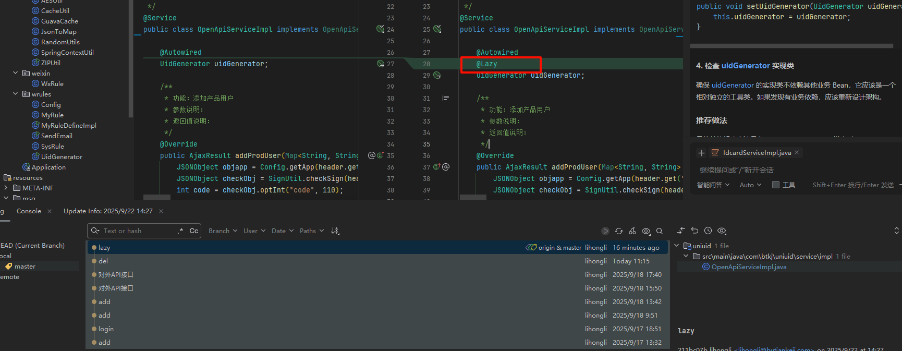

## 拉取项目

## 关键表之间的关系

xcxuser表中

## 用户管理

差关联的系统   也就是产品  一个产品算一个系统,

关联的系统从appkey  中的appname

## 产品管理

## 意见反馈

意见反馈表

xcxuser_feedback

xcxuserid   type     content  

xcxuser_feedback_id_seq

## 问题

1. uniuid-java  该项目启动会出错
   

   在依赖引入的上添加   `@lazy`  之前加错位置 导致没有成功
   

2. 历史绑定手机号和历史绑定系统是从哪里拿?

3. 

