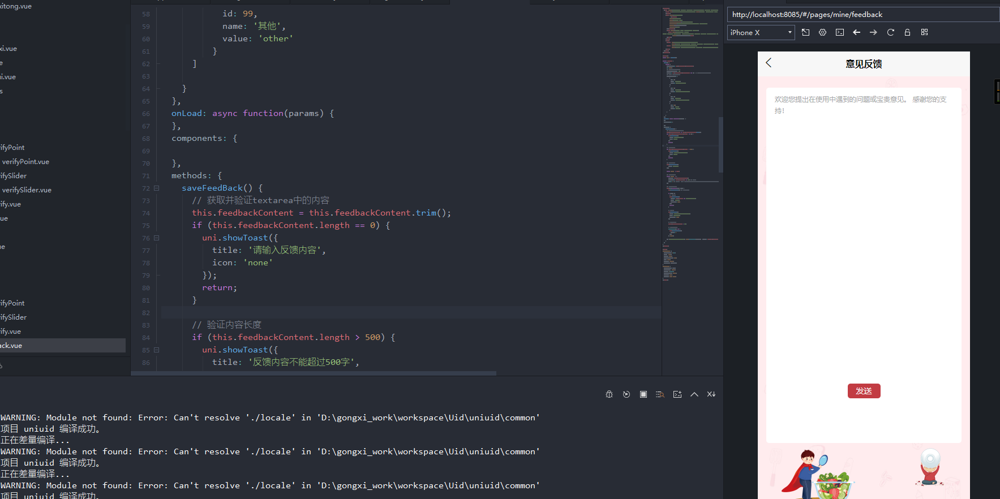
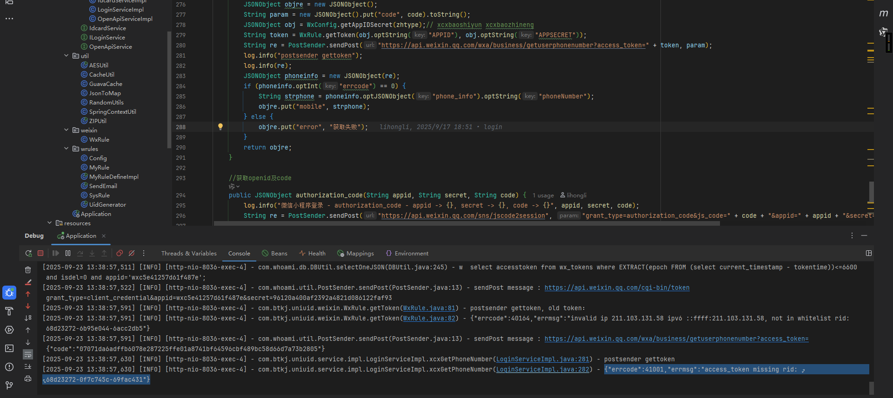

## 熟悉项目和相应的接口方式


### 熟悉

这里提供封装的代码和一个请求示例：

#### 源码

```vue
<script>
  import {
   aesEncrypt
  } from "@/common/ase.js"
  //app.js
  var global = require('./globaldata');
  var util = require("./common/util.js")
  var smutil = require('./util/smutil.js');
  var _this;

  export default {
   data() {
    return {};
   },
   onLaunch: async function() {
    _this = this;
    this.checkUpdate();
    // 拿到globaldata的数据
    for (const key in global) {
     if (Object.hasOwnProperty.call(global, key)) {
      this.globalData[key] = global[key];
     }
    }

    // 注册方法
    uni.sm = this.globalData.sm;
    uni.smsync = this.globalData.smsync;
    uni.smaction = this.globalData.smaction;
    uni.alert = this.globalData.alert;
    uni.msg = this.globalData.msg;
    uni.confirm = this.globalData.confirm;
    uni.prompt = this.globalData.prompt;
    uni.getPrePage = this.globalData.getPrePage;
    uni.msgwhere = this.globalData.msgwhere;
    uni.msgArrwhere = this.globalData.msgArrwhere;
    uni.msgpJoin = this.globalData.msgpJoin;
    uni.svs = this.globalData.services;

    var mobile = uni.getStorageSync('curmobile') || "";
    var openid = uni.getStorageSync('curopenid') || "";
    var token = uni.getStorageSync('token') || "";
    console.log("mobile:" + mobile);
    console.log("openid:" + openid);
    console.log("token:" + token);
    _this.globalData.loginByToken(token, function(){
     // 微信小程序
     // #ifdef MP-WEIXIN  
     uni.login({
      success: async (res) => {
       console.log(JSON.stringify(res));
       // e.detail.code = res.code;
       var param = {
        zhtype: _this.globalData.xcxtype, 
        logintype: "loginBycode",
        logincode: res.code
       }
       _this.globalData.applogin(param);
      }
     });
     //#endif 
     //#ifndef MP-WEIXIN
     var param = {
      zhtype: _this.globalData.xcxtype, 
      logintype: "loginByopenid",
      openid: openid
     }
     _this.globalData.applogin(param);
     //#endif 
    })
    //获取系统信息
    this.globalData.sysinfo = uni.getSystemInfoSync();
    //#ifdef MP-WEIXIN
    let menuButtonObject = uni.getMenuButtonBoundingClientRect();
    let statusBarHeight = this.globalData.sysinfo.statusBarHeight;
    let navTop = menuButtonObject.top; //胶囊按钮与顶部的距离
    let navHeight = statusBarHeight + menuButtonObject.height + (menuButtonObject.top - statusBarHeight) *
     2; //导航高度
    this.globalData.navHeight = navHeight;
    this.globalData.navTop = navTop;
    this.globalData.windowHeight = this.globalData.sysinfo.windowHeight;
    // #endif 
   },
   globalData: {
    waitlogin: true,
    //mapkey: 'HUSBZ-552W6-PBHST-EDDJQ-YWOZJ-43FAI',
    //qqmapkey: 'EEDBZ-2WLWW-6TBRY-O4JJM-RDA7T-KMB3Q',
    code: '',
    headers: {
     // 'content-type': 'application/json'
    },
    services:{
     auth:'uniuid'
    },
    loginByToken(token, cb){
     if(token){
      //_this.globalData.headers['Authorization'] = 'Bearer ' + token;
      var param = {
       zhtype: _this.globalData.xcxtype, 
       logintype: "autologin",
       token: token
      }
      _this.globalData.applogin(param, null, cb);
     } else {
      cb && cb();
     }
    },

    getUserInfoBack: function(obj) {
     console.log(obj);
     if (obj && obj.sid) {
      uni.setStorageSync('curmobile', obj.objuser.mobile);
      uni.setStorageSync('token', obj.token);
      if(obj.openid || obj.objuser.openid_xcx){
       uni.setStorageSync('curopenid', obj.openid || obj.objuser.openid_xcx);
      }
      //#ifdef MP-WEIXIN
      //_this.globalData.headers['Authorization'] = 'Bearer ' + obj.token;
      _this.globalData.headers['Cookie'] = 'JSESSIONID=' + obj.sid;
      // #endif
      _this.globalData.objuserinfo = obj.objuser;
      _this.globalData.code = obj.code;
      console.log("objuserinfo", _this.globalData.objuserinfo);
      _this.globalData.waitlogin = false;
      if (_this.globalData.userInfoReadyCallback) {
       _this.globalData.userInfoReadyCallback();
       _this.globalData.userInfoReadyCallback = null;
      }
     } else {
      //_this.alert("登录失败");
     }
    },
    //获取家长当前绑定的学生
    getCurBindStu(cb){
     var userid = _this.globalData.objuserinfo.id;
     this.sm(function(re, err){
      if(err){
       return uni.msg(err);
      }
      _this.globalData.objuserinfo.curstu = re;
      cb && cb();
     }, ["stu.selectcurbingstu", userid], {route: uni.svs.zxx_home_biz})
    },
    // 统一 登录流程
    applogin: function(param, succb, errcb) {
     var pobj = {
      route: uni.svs.auth,
      action: 'login/wxlogin',
      method: 'POST',
      datastring: true
     }
     this.smaction((re, err, obj) => {
      uni.hideLoading();
      if (err) {
       //#ifdef MP-WEIXIN
       if(obj.sid){
        _this.globalData.headers['Cookie'] = 'JSESSIONID=' + obj.sid;
       }
       // #endif
       if(param.logintype == "autologin" && errcb){//通过token登录失败，会再以其他方式再登录一次
        errcb();
       } else {
        console.log('未登录:', obj);
        if(getCurrentPages()[0].route != 'pages/login/login'){
         setTimeout(function(){
          uni.reLaunch({
           url: "/pages/login/login"
          })
         }, 1000)
        }
       }
      } else {
       _this.globalData.getUserInfoBack(re);
       succb && succb();
      }
     }, param, pobj)
     // }, ['apphome.applogin', _this.globalData.xcxtype, logintype, key, pwd || "", yzm || "", qrcodeuserid || "", qrcodegiftcode || ""]);
    },
    geturl(route, action){
     if(_this.globalData.selfsevice && _this.globalData.selfsevice["/" + route]){
      return _this.globalData.selfsevice["/" + route].target + '/' + action;
     } else {   
      return _this.globalData.requrl + '/' + route + '/' + action;
     }
    },
    /**
     * 请求controller的方法
     * @param {Object} cb 调用结束后的回调
     * @param {Object} param 请求的参数 json对象格式
     * @param {Object} pobj 必填，包含route(路由，既微服务名称)、action(controller路径)，其他key自定。 例如：{route:'bzn-xcx-tbpt', action: 'yey/list'}
     */
    smaction: function(cb, param, pobj){
     if (typeof cb == 'object') {
      var arrtemp = cb;
      cb = param;
      param = arrtemp;
     }
     if(!pobj || !pobj.route || !pobj.action){
      return cb(null, '路由不能为空');
     }
     var token = uni.getStorageSync('token');
     if(token){
      param.Authorization = 'Bearer ' + token;
     }
     var url = '/' + pobj.route + '/' + pobj.action;
     uni.request({
      // #ifdef H5
      url:  url,
      // #endif
      // #ifndef H5
      url: _this.globalData.geturl(pobj.route, pobj.action),
      // #endif     
      //请求方式
      method: pobj.method || "GET",
      //请求数据
      data: pobj.datastring ? JSON.stringify(param) : param,
      // #ifndef H5
      header: _this.globalData.headers,
      // #endif
      //处理session问题
      success: function(res) {
       //console.log(res);
       if (res.data) {
        if(res.data.code){
         var result = res.data && res.data.data ? JSON.parse(res.data.data) : {};
         if (res.data.code == 200) {
          return cb(result || res.data.msg, null, result || res.data.msg);
         } else {
          return cb(null, res.data.msg, result);
         }
        }
        var strtype = Object.prototype.toString.apply(res.data.data);
    
        if (strtype == '[object Array]') {
         cb(res.data);
        } else if (strtype == '[object Object]') {
         if (res.data.error || res.data.code == 500) {
          console.log('请求数据', param);
          console.log('请求服务', pobj);
          console.log(res.data);
          if (res.data.error == "nologin") {
           return uni.navigateTo({
            url: "/pages/login/login"
           })
          }
    
          if (typeof res.data == 'object') {
           if (res.data.mess) {}
          }
    
          cb(res.data, res.data.error || res.data.msg, res.data);
         } else {
          cb(res.data.re || res.data, res.data.error, res.data);
         }
        } else {
         cb(null, res.data.error || res.data.msg, res.data);
        }
       } else {
        cb(null, '请求失败');
       }
      },
      fail: function(res) {
       cb(null, '请求失败');
      }
     });
    },
    sm: function(cb, arr, pobj) {
     if (typeof cb == 'object') {
      var arrtemp = cb;
      cb = arr;
      arr = arrtemp;
     }
     // var objp = smutil.getSmParam(arr, pobj);
        
     var strp = '';
     var ismul = 0;
     var msgid = '';
     if (typeof arr[0] == 'object') {
      ismul = 1;
      var arr2 = [];
     
      for (var i = 0; i < arr.length; i++) {
       for (var j = 0; j < arr[i].length; j++) {
        if (typeof arr[i][j] == 'object') {
         arr[i][j] = JSON.stringify(arr[i][j]);
        }
       }
       arr2.push(smutil.encodeArr(arr[i]).join('%15'));
      }
     
      strp = arr2.join('%18');
     } else {
      for (var j = 0; j < arr.length; j++) {
       if (typeof arr[j] == 'object') {
        arr[j] = JSON.stringify(arr[j]);
       }
      }
      msgid = arr[0];
      strp = smutil.encodeArr(arr).join('%15');
     }

     var data = {
      arr: strp,
      lan: 'zh'
     };

     if (ismul) {
      data.ismul = ismul;
     }

     data.msgid = (pobj && pobj.msgid) || msgid || ''

     if (pobj && pobj.trans) {
      data.trans = pobj.trans;
     }

     if (pobj && pobj.rpc) {
      //远程调用
      data.rpc = pobj.rpc;
     }
     
     var token = uni.getStorageSync('token');
     if(token){
      data.Authorization = 'Bearer ' + token;
     }
     var url = '/Enter';
     if (pobj && pobj.route) {
      url = '/' + pobj.route + url;
     } else {
      // cb(null, '路由不能为空');
      // return;
     }
     uni.request({
      // #ifdef H5
      url:  url,
      // #endif
      // #ifndef H5
      url: _this.globalData.geturl(pobj.route, "Enter"),
      // #endif     
      //请求方式
      // method: "POST",
      //请求数据
      data: data,
      // #ifndef H5
      header: _this.globalData.headers,
      // #endif
      //处理session问题
      success: function(res) {
       console.log(res)
       if (res.data) {
        if(res.data.code){
         if(res.data.code == 200){
          var result = JSON.parse(res.data.data);
          return cb(result, null, result);
         } else {
          return cb(null, res.data);
         }
        }
        var strtype = Object.prototype.toString.apply(res.data);

        if (strtype == '[object Array]') {
         cb(res.data);
        } else if (strtype == '[object Object]') {
         if (res.data.error || res.data.code == 500) {
          console.log(strp);
          console.log(res.data);
          if (res.data.error == "nologin") {
           return uni.navigateTo({
            url: "/pages/login/login"
           })
          }

          if (typeof res.data == 'object') {
           if (res.data.mess) {}
          }

          cb(res.data, res.data.error || res.data.msg, res.data);
         } else {
          cb(res.data.re || res.data, res.data.error, res.data);
         }
        } else {
         cb(null, res.data.error || res.data.msg, res.data);
        }
       } else {
        cb(null, '请求失败');
       }
      },
      fail: function(res) {
       cb(null, '请求失败');
      }
     });
    },

    //同步请求方式
    smsync: function(arr, pobj) {
     if (typeof cb == 'object') {
      var arrtemp = cb;
      cb = arr;
      arr = arrtemp;
     } 
        
     var strp = '';
     var ismul = 0;
     var msgid = '';
     if (typeof arr[0] == 'object') {
      ismul = 1;
      var arr2 = [];
     
      for (var i = 0; i < arr.length; i++) {
       for (var j = 0; j < arr[i].length; j++) {
        if (typeof arr[i][j] == 'object') {
         arr[i][j] = JSON.stringify(arr[i][j]);
        }
       }
       arr2.push(smutil.encodeArr(arr[i]).join('%15'));
      }
     
      strp = arr2.join('%18');
     } else {
      for (var j = 0; j < arr.length; j++) {
       if (typeof arr[j] == 'object') {
        arr[j] = JSON.stringify(arr[j]);
       }
      }
      msgid = arr[0];
      strp = smutil.encodeArr(arr).join('%15');
     }
     
     var data = {
      arr: strp,
      lan: 'zh'
     };
     
     if (ismul) {
      data.ismul = ismul;
     }
     
     data.msgid = (pobj && pobj.msgid) || msgid || ''
     
     if (pobj && pobj.trans) {
      data.trans = pobj.trans;
     }
     
     if (pobj && pobj.rpc) {
      //远程调用
      data.rpc = pobj.rpc;
     }
     
     var token = uni.getStorageSync('token');
     if(token){
      data.Authorization = 'Bearer ' + token;
     }
     var url = '/Enter';
     
     return new Promise(function(resolve, reject) {
      if (pobj && pobj.route) {
       url = '/' + pobj.route + url;
      } else { 
       reject({
        re: null,
        err: '路由不能为空',
        obj: null
       });
       return;
      }
      
      uni.request({
       // #ifdef H5
       url:  url,
       // #endif
       // #ifndef H5
       url: _this.globalData.geturl(pobj.route, "Enter"),
       // #endif     
       //请求方式
       // method: "POST",
       //请求数据
       data: data,
       // #ifndef H5
       header: _this.globalData.headers,
       // #endif
       //处理session问题
       success: function(res) {
        if (res.data) {
         if(res.data.code){
          if(res.data.code == 200){
           var result = JSON.parse(res.data.data); 
           resolve({
            re: result,
            err: null,
            obj: res.data
           });
          } else {
           reject({
            re: null,
            err: res.data.msg,
            obj: res.data
           });
          }
          return;
         }
         var strtype = Object.prototype.toString.apply(res.data);

         if (strtype == '[object Array]') {
          resolve({
           re: res.data
          });
         } else if (strtype == '[object Object]') {
          if (res.data.error || res.data.code == 500) {
           console.error(strp);
           console.error(res.data);
           uni.showToast({
            title: res.data.error,
            icon: 'none',
            duration: 2000
           });
           reject({
            re: null,
            err: res.data.error || res.data.msg,
            obj: res.data
           });
          } else {
           resolve({
            re: res.data.re || res.data,
            err: res.data.error || res.data.msg,
            obj: res.data
           });
          }
         } else {
          resolve({
           re: null,
           err: null,
           obj: res.data
          });
         }
        } else {
         uni.showToast({
          title: '请求失败',
          icon: 'none',
          duration: 2000
         });
         reject({
          re: null,
          err: '请求失败'
         });
        }
       },
       fail: function() {
        uni.showToast({
         title: '请求失败',
         icon: 'none',
         duration: 2000
        });
        reject({
         re: null,
         err: '请求失败'
        });
       }
      });
     });
    },

    confirm: function(p1, p2, p3) {
     if (p3) {
      this.alert(p1, p2, p3, true);
     } else {
      this.alert('提示', p1, p2, true, false);
     }
    },

    prompt: function(p1, p2, p3) {
     if (p3) {
      this.alert(p1, p2, p3, true, true);
     } else {
      this.alert('提示', p1, p2, true, true);
     }
    },

    alert: function(p1, p2, p3, showCancel, editable) {
     var title = '提示';
     var content = '';
     var cb = null;

     if (!p1) {
      return;
     }
     if (!p2 && p2 != "") {
      //只有一个参数 那就是content
      content = p1;
     } else {
      if (!p3) {
       //只有两个参数
       if (typeof p2 == 'string') {
        //p2 是string 则 p1 是title p2 是content
        title = p1;
        content = p2;
       } else {
        //p2 是function 则 p1 是content p2 是callback
        content = p1;
        cb = p2;
       }
      } else {
       //三个参数则 p1 是title p2 是content p3是callback
       title = p1;
       content = p2;
       cb = p3;
      }
     }

     uni.showModal({
      title: title,
      content: content + '',
      showCancel: showCancel || false,
      editable: editable || false,
      success: function(res) {
       if (res.confirm) {
        if (cb) {
         cb(res);
        }
       }
      }
     });
    },

    msg: function(title) {
     uni.showToast({
      title: title + '',
      icon: 'none',
      style: "z-index: 99999;",
      duration: 2000
     });
    },
    //获取 前页面
    getPrePage: function(n = -1) {
     n = n < -1 ? n : -1;
     var pages = getCurrentPages(); // 页面栈
     var beforePage = pages[pages.length - (-(n - 1))]; // 前n个页面
     // #ifndef H5
     beforePage = beforePage.$vm;
     // #endif
     return beforePage;
    },
    msgwhere: function(obj1, obj2) {
     var obj = {};
     if (obj1) {
      obj = Object.assign(obj, obj1);
     }
     if (obj2) {
      obj = Object.assign(obj, obj2);
     }
     return JSON.stringify({
      msg_where: obj
     })
    },
    msgArrwhere: function(arr) {
     return JSON.stringify({
      msg_where: arr
     })
    },
    msgpJoin: function(arr) {
     var arrnew = [];
     for (var i = 0; i < arr.length; i++) {
      arrnew.push([arr[i]]);
     }
     return arrnew;
    },


   },
   methods: {
    checkLogin: function() {
     console.log("------------:" + _this.globalData.code)
     return _this.globalData.code === 0;
    },
    checkUpdate() {
     // #ifdef MP-WEIXIN
     const updateManager = uni.getUpdateManager();

     updateManager.onCheckForUpdate(function(res) {
      // 请求完新版本信息的回调
      console.log("是否有更新:", res.hasUpdate);
     });

     updateManager.onUpdateReady(function(res) {
      uni.showModal({
       title: '更新提示',
       content: '新版本已经准备好，是否重启应用？',
       success(res) {
        if (res.confirm) {
         // 新的版本已经下载好，调用 applyUpdate 应用新版本并重启
         updateManager.applyUpdate();
        }
       }
      });

     });

     updateManager.onUpdateFailed(function(res) {
      // 新的版本下载失败
      console.error('新的版本下载失败', res)
     });
     // #endif 
    }
   }
  };
</script>
<style lang="scss">
  /*每个页面公共css */
  @import '@/uni_modules/uni-scss/index.scss';
  /* #ifndef APP-NVUE */
  @import '@/static/customicons.css';
  @import '@/static/iconfont.css';
  @import '@/static/weui.css';


  @import '@/common/fui-app.css';
  @import '@/components/firstui/fui-theme/fui-theme.css';

  // 设置整个项目的背景色
  page {
   background-color: #f5f5f5;
  }

  /* #endif */
  .example-info {
   font-size: 14px;
   color: #333;
   padding: 10px;
  }
</style>
```

#### 请求示例

```vue
<template>
  <view>
   <view class="weui-cells weui-cells_after-title">
    <view class="weui-cell">
     <view class="weui-cell__bd">姓名</view>
     <view class="weui-cell__ft weui-cell__ft_in-access" @click="changePrompt('姓名','truename',userdetail.truename)">{{userdetail.truename || '请输入姓名'}}</view>
    </view>

    <view class="weui-cell">
     <view class="weui-cell__bd">民族</view>
     <view class="weui-cell__ft weui-cell__ft_in-access">
      <picker mode="selector" :range="arrnation" :value="nationIndex" @change="chooseNation" style="width:100%">
       {{userdetail.nation || '请选择民族'}}
      </picker>
     </view>
    </view>
    <view class="weui-cell">
     <view class="weui-cell__bd">国籍</view>
     <view class="weui-cell__ft weui-cell__ft_in-access">
      <picker mode="selector" :range="arrnationality" :value="nationalityIndex" @change="chooseNationality" style="width:100%">
       {{userdetail.nationality || '请选择国籍'}}
      </picker>
     </view>
    </view>
    <view class="weui-cell">
     <view class="weui-cell__bd">证件类型</view>
     <view class="weui-cell__ft weui-cell__ft_in-access">
      <picker mode="selector" :range="arrcredentialstype" :value="idcardtypeIndex" @change="chooseIdcardtype" style="width:100%">
       {{userdetail.idcard_type || '请选择证件类型'}}
      </picker>
     </view>
    </view>
    <view class="weui-cell">
     <view class="weui-cell__bd">证件号码</view>
     <view class="weui-cell__ft weui-cell__ft_in-access" @click="changePrompt('证件号码','idcard',userdetail.idcard)">{{userdetail.idcard || '请输入证件号码'}}</view>
    </view>
    <view class="weui-cell">
     <view class="weui-cell__bd">户口所在地</view>
     <view class="weui-cell__ft weui-cell__ft_in-access">
      <picker mode="selector" :range="arrlocation" :value="locationIndex" @change="chooseLocation" style="width:100%">
       {{userdetail.localtion || '请选择户口所在地'}}
      </picker>
     </view>
    </view>
    <view class="weui-cell">
     <view class="weui-cell__bd">户口类型</view>
     <view class="weui-cell__ft weui-cell__ft_in-access">
      <picker mode="selector" :range="arrlocationtype" :value="locationtypeIndex" @change="chooseLocationtype" style="width:100%">
       {{userdetail.locationtype || '请选择户口类型'}}
      </picker>
     </view>
    </view>
    <view class="weui-cell">
     <view class="weui-cell__bd">工作单位</view>
     <view class="weui-cell__ft weui-cell__ft_in-access" @click="changePrompt('工作单位','aunits',userdetail.aunits)">{{userdetail.aunits || '请输入工作单位'}}</view>
    </view>

   </view>
   <!-- 提交按钮 -->
   <view class="button-bottom " style="height: 160rpx;box-shadow: none;border-top:none;">
    <button class="common-btn noafter" @click="logout">退出登录</button>
   </view>
  </view>
</template>

<script>
  var moment = require("../../common/moment.min.js");
  var util = require("../../common/util.js")
  var app = getApp();
  
  export default {
   data() {
    return {
     myinfo: app.globalData.objuserinfo,
     userdetail: {},
     nationIndex: -1,
     nationalityIndex: -1,
     locationtypeIndex: -1,
     locationIndex: -1,
     idcardtypeIndex: -1
    }
   },
   onLoad(params) {
    this.initData();
   },
   onShow() {
   
   },
   methods: {
    initData(){
     var _this = this;
     uni.sm(function(re,err){
      if(err){
       return uni.msg(err);
      }
      _this.userdetail = re;
      _this.nationIndex = _this.arrnation.indexOf(re.nation);
      _this.nationalityIndex = _this.arrnationality.indexOf(re.nationality);
      _this.locationtypeIndex = _this.arrlocationtype.indexOf(re.locationtype);
      _this.locationIndex = _this.arrlocation.indexOf(re.location);
      _this.idcardtypeIndex = _this.arrcredentialstype.indexOf(re.idcard_type);
     }, ["user.selectdetail", this.myinfo.id], {route: uni.svs.zxx_home_biz})
    },
    chooseNation(e){
     this.nationIndex = e.detail.value;
     this.userdetail.nation = this.arrnation[this.nationIndex];
     var param = {
      nation: this.arrnation[this.nationIndex]
     }
     this.save(param);
    },
    chooseNationality(e){
     this.nationalityIndex = e.detail.value;
     this.userdetail.nationality = this.arrnationality[this.nationalityIndex];
     var param = {
      nationality: this.arrnationality[this.nationalityIndex]
     }
     this.save(param);
    },
    chooseIdcardtype(e){
     this.idcardtypeIndex = e.detail.value;
     this.userdetail.idcard_type = this.arrcredentialstype[this.idcardtypeIndex];
     var param = {
      idcard_type: this.arrcredentialstype[this.idcardtypeIndex]
     }
     this.save(param);
    },
    chooseLocation(e){
     this.locationIndex = e.detail.value;
     this.userdetail.localtion = this.arrlocation[this.locationIndex];
     var param = {
      localtion: this.arrlocation[this.locationIndex]
     }
     this.save(param);
    },
    chooseLocationtype(e){
     this.locationtypeIndex = e.detail.value;
     this.userdetail.locationtype = this.arrlocationtype[this.locationtypeIndex];
     var param = {
      locationtype: this.arrlocationtype[this.locationtypeIndex]
     }
     this.save(param);
    },
    //弹框输入
    changePrompt: function(title, itype, _val) {
     var _this = this;
     uni.prompt(title || "输入", _val, function(res) {
      if (itype == "idcard" && res.content.length > 18) {
       setTimeout(function() {
        uni.alert("长度不能大于18位");
       }, 100);
       return;
       // return _this.changePrompt(title, itype, res.content);
      }
      if (itype == "truename" && res.content.length > 10) {
       setTimeout(function() {
        uni.alert("长度不能大于10位");
       }, 100);
       return;
       // return _this.changePrompt(title, itype, res.content);
      }
      if (itype == "aunits" && res.content.length > 20) {
       setTimeout(function() {
        uni.alert("长度不能大于20位");
       }, 100);
       return;
       // return _this.changePrompt(title, itype, res.content);
      }
      _this.userdetail[itype] = _val = res.content;
      var param = {};
      param[itype] = res.content;
      _this.save(param);
     })
    },
    
    // //保存单项
    // editoneitem: function(itype, value) {
    //   uni.sm(
    //    (re, err) => {
    //     if (!err) {
    //      uni.msg('保存成功');
    //     } else {
    //      uni.alert('保存失败');
    //     }
    //    },
    //    ['apphome.homeuser.editoneitembyid', itype, value]
    //   );
    // },
    save(param){
     uni.sm(function(re, err){
      if(err){
       return uni.msg(err);
      }
      uni.msg('保存成功');
      if(param.truename){//修改的是姓名时，需要同步到后台缓存中
       app.globalData.objuserinfo.truename = param.truename;
       uni.smaction(function(){
        
       }, {key: 'truename', value: param.truename}, {route: uni.svs.zxx_home_biz, action: 'mine/syncinfo'})
      }
     }, ["user.updateuser", JSON.stringify(param), uni.msgwhere({id: [this.myinfo.id]})], {route: uni.svs.zxx_home_biz})
    },
    logout(){
     uni.smaction(function(re, err){
      if(err){
       return uni.msg(err);
      }
      // uni.removeStorageSync('token');
      app.globalData.objuserinfo = {};
      uni.reLaunch({
       url: '/pages/tabBar/home/index'
      })
     }, {}, {route: uni.svs.auth, action: 'exit', method: 'POST'})
    }
   }
  }
</script>


<style>
  page {
   background: #fff;
  }


  .weui-cell {
   padding: 15px;
  }

  .weui-cell .weui-cell__bd {
   font-size: 14px;
   color: #303030;
  }

  .weui-cell .weui-cell__ft {
   font-size: 14px;
   color: #999999;
  }

  .weui-cell:before {
   right: 15px;
  }

  .weui-cells:after {
   right: 15px;
   left: 15px;
  }
</style>
```

### [源码分析及学习](./00.小程序端架构熟悉.md)

## 小程序端启动

### nginx 反向代理

这个不会  没配置过


### 内置浏览器


### 重新去配置dev


这里开发环境下去设置好对应的selfsevice  


## 请求接口

小程序端启动后请求接口需要本地反向代理
在安装好的nginx的配置文件中添加相应的配置    这一步配置就不知道咋搞 shit


鉴于现在的好多东西都不太会搞  
暂且把后台的给稍微处理一下


### demo


最开始是没有请求接口的，也就是哪怕写了但是没有发送消息到后端，所以后端是接收不了的，修改mainfest.json中的源码视图  **邪修  实现**


后端也是收到请求了


## 我的页面

### index.vue   原本代码 

```vue
<template>
	<view>
		<view class="top-bgview">
			<image src="/static/image/home/minebg.png" style="width: 100%;height: 393rpx;"></image>
		</view>
		<view style="position: absolute; top: 160rpx;z-index: 1; left:30rpx; right: 30rpx;">
			<image src="/static/image/home/minetop.png" style="width: 100%;height: 431rpx;"></image>
			<view style="position: absolute; top: 50rpx;z-index: 1; left:30rpx; right: 30rpx; text-align: center;">
				<view @click="toMyinfo">
					<image src="/static/image/home/identity_img.png" style="width: 116rpx;height: 116rpx;"></image>
					<view>
						{{myinfo.truename || myinfo.nickname || myinfo.mobile || ""}}
					</view>
				</view>
			</view>

			<view class="helplist">
				<view class="weui-cell" @click="toHelpCenter">
					<view class="weui-cell__bd weui-flex" style="align-items: center;">
						<view class="weui-flex_center" style="width: 50rpx;margin-right: 20rpx;">
							<image src="/static/image/home/bzzximg.png" style="width: 48rpx;height:48rpx;"></image>
						</view>
						<view>帮助中心</view>
					</view>
					<view class="weui-cell__ft weui-cell__ft_in-access">

					</view>
				</view>
				<view class="weui-cell" @click="Subscribe()">
					<view class="weui-cell__bd weui-flex" style="align-items: center;">
						<view class="weui-flex_center" style="width: 50rpx;margin-right: 20rpx;">
							<image src="/static/image/home/mineimg.png" style="width: 48rpx;height:48rpx;"></image>
						</view>
						<view>订阅消息</view>
					</view>
					<view class="weui-cell__ft weui-cell__ft_in-access">

					</view>
				</view>
			</view>
		</view>
	</view>
</template>

<script>
	var moment = require("../../../common/moment.min.js");
	var util = require("../../../common/util.js")
	var app = getApp();
	
	export default {
		data() {
			return {
				myinfo: app.globalData.objuserinfo,
				pname: ''
			}
		},
		onLoad(params) {
			this.initData();
		},
		onShow() {
		
		},
		methods: {
			initData(){
				
			},
			//个人信息
			toMyinfo(){
				if(!this.myinfo || !this.myinfo.id){//未登录，跳转到登录页
					uni.navigateTo({
						url: "/pages/login/login" 
					})
					return;
				}
				uni.navigateTo({
					url: "/pages/mine/myinfo" 
				})
			},
			//帮助中心
			toHelpCenter(){
				if(!this.myinfo || !this.myinfo.id){//未登录，跳转到登录页
					uni.navigateTo({
						url: "/pages/login/login" 
					})
					return;
				}
				uni.navigateTo({
					url: "/pages/mine/help_center" 
				})
			},
			//意见反馈
			toFeeDback(){
				if(!this.myinfo || !this.myinfo.id){//未登录，跳转到登录页
					uni.navigateTo({
						url: "/pages/login/login" 
					})
					return;
				}
				uni.navigateTo({
					url: "/pages/mine/feedback" 
				})
			},
			//订阅消息
			Subscribe(cb) {
				if(!this.myinfo || !this.myinfo.id){//未登录，跳转到登录页
					uni.navigateTo({
						url: "/pages/login/login" 
					})
					return;
				}
				
				//#ifdef MP-WEIXIN
				uni.requestSubscribeMessage({
					//此处填写刚才申请模板的模板ID
					tmplIds: ['SxWEPUY0eaZxFKGt-uyy31-WiCQRVJ6YYczIcfr5XS8'],
					success(res) { 
						console.log(res)
						if(res.errMsg=='requestSubscribeMessage:ok'){
							uni.msg('订阅成功+1')
						}
						cb&&cb(res)
					}
				})
				// #endif
				// #ifndef MP-WEIXIN
				uni.msg('请在微信小程序操作！');
				cb && cb();
				// #endif
			},
			logincallback(){
				this.myinfo = app.globalData.objuserinfo;
				this.initData();
			}
		}
	}
</script>

<style>
	page {
		background: #F2F4F7;
	}

	.weui-cell__ft {
		color: #8C8C8C;
		font-size: 20rpx;
	}

	.weui-cell__ft_in-access:after {
		border-color: #C7C7CC;
	}

	.weui-cell {
		padding: 30rpx 30rpx;
	}

	.weui-cell::before {
		right: 30rpx;
		left: 100rpx;

	}
	.top-bgview {
		height: 393rpx;


	}
	.statustxt {
		height: 128rpx;
		background: #FFFFFF;
		border-radius: 5px;
		background: #fff;
		width: 50%;
		align-items: center;
	}
	.identitylist {
		margin-top: 40rpx;
	}
	.identitytxt {
		flex: 1;
	}
	.identitytxt text {
		text-align: center;
		display: block;
		font-size: 28rpx;
		color: #303030;
	}
	.helplist {
		border-radius: 10rpx;
		background: #fff;
		font-size: 28rpx;
		color: #333333;
	}
</style>
```

### 按照原型实现

#### 代码：

说明：由静态工程师提供后，在现有的基础上添加相应的js


### 意见反馈

第一个文件中的反馈类型部分需要提取出来在script中，类似第二个文件中的feedbackTypes数组，然后有对应的icon，来自第一个文件中的静态文件路径，选中后，文件2中的类型选择todo部分传递相应的反馈类型id，同时设置颜色为第一个文件中的第一个反馈类型对应的颜色，总之就是结合这两个文件，给出一个完整的feedback.vue

```vue
<template>
  <view style="overflow-x: hidden; position: absolute;bottom: 0;width: 100%;height: 100%;">
    <image src="../mine/static/image/yjfkbg.jpg" style="width: 100%;height: 100%; position: absolute;bottom: 0;">
    </image>
    <view class="cen-bgview">
    <textarea
          class="uni-input"
          style="width: 90%;"
          placeholder-style="color:#a7a8a9;"
          placeholder="欢迎您提出在使用中遇到的问题或宝贵意见。 感谢您的支持！"
          v-model="feedbackContent"
          maxlength="500"
      ></textarea>
      <view style="width: 100%; text-align: center;">
        <view style="font-size: 28rpx;
color: #FFFFFF; text-align: center;background: #C23C43; display: inline-block; width: 116rpx;border-radius: 10rpx; padding:2px 0 ;"
              @click="saveFeedBack">发送</view>
      </view>
    </view>
    <view>
      <image src="../mine/static/image/yjfkleft.png"
             style="width: 268rpx;height: 236rpx; position: absolute;bottom: 0;left:80rpx;"> </image>
      <image src="../mine/static/image/yjfkbot.png"
             style="width: 272rpx;height:182rpx; position: absolute;bottom:60rpx;right: 0px;"> </image>
    </view>
  </view>
</template>

<script>
const app = getApp();

export default {
  data() {
    return {
      env_version: app.globalData.env_version,
      t: null,
      // 存储textarea中的内容
      feedbackContent: '',
      myinfo: app.globalData.objuserinfo || {}, // 获取用户信息，用于提交反馈
    // TODO 添加反馈类型数组
      feedbackTypes: [
          {
            id: 1,
            name: '用户反馈',
            value: 'user_feedback',
            checked: true
          },
          {
            id: 2,
            name: '功能建议',
            value: 'function_suggestion'
          },
          {
            id: 3,
            name: '产品建议',
            value: 'product_suggestion'
          },
          {
            id: 4,
            name: '其他',
            value: 'other'
          }
      ]
    
    }
  },
  onLoad: async function(params) {
  },
  components: {

  },
  methods: {
    saveFeedBack() {
      // 获取并验证textarea中的内容
      this.feedbackContent = this.feedbackContent.trim();
      if (this.feedbackContent.length == 0) {
        uni.showToast({
          title: '请输入反馈内容',
          icon: 'none'
        });
        return;
      }

      // 验证内容长度
      if (this.feedbackContent.length > 500) {
        uni.showToast({
          title: '反馈内容不能超过500字',
          icon: 'none'
        });
        return;
      }

      // 显示加载提示
      uni.showLoading({
        title: '正在发送'
      });

      const _this = this;

      // 准备提交的参数
      const param = {
        content: this.feedbackContent,
        xcxuserid: this.myinfo.id || '', // 用户ID
        type: 1 // 反馈类型  TODO 现有的页面从哪里拿？现在的页面静态那边尚未提供，先这样默认一下,存储选择的数组对应的对象的id
      };

      // 调用接口提交反馈
      uni.sm(function(re, err) {
        uni.hideLoading(); // 隐藏加载提示

        if (err) {
          // 提交失败
          uni.showToast({
            title: err.message || '提交失败，请重试',
            icon: 'none',
            duration: 2000
          });
          return;
        }

        // 提交成功
        uni.showToast({
          title: '反馈提交成功，感谢您的建议！',
          icon: 'success',
          duration: 2000
        });

        // 清空输入内容
        _this.feedbackContent = '';

        // 延迟返回上一页
        setTimeout(() => {
          uni.navigateBack({
            delta: 1
          });
        }, 2000);

      }, ["xcxuser_feedback.add", JSON.stringify(param)], {route: uni.svs.zxx_home_biz});
    }
  }
}
</script>

<style>
.cen-bgview {
  background: #fff;
  left: 15px;
  right: 15px;
  border-radius: 5px;
  top: 20px;
  bottom: 240rpx;
  position: absolute;
}
.uni-input {
  text-align: left;
  font-size: 24rpx;
  color: #303030;
  line-height: 40rpx;
  height: 80%;
  margin: 10px 15px;
}
</style>
```

#### 现有效果



#### 按照原型设计

根据静态那边提供过来的样式和结构，修改现有的页面和交互


## 登录

手机号快捷登录



之所以出现41001  是因为自己在开发者没有设置IP白名单  导致自己的手机号去快捷登录的时候出现了  access_token missing rid 错误  [相关的解释：](https://blog.csdn.net/guo_qiangqiang/article/details/121105446)


