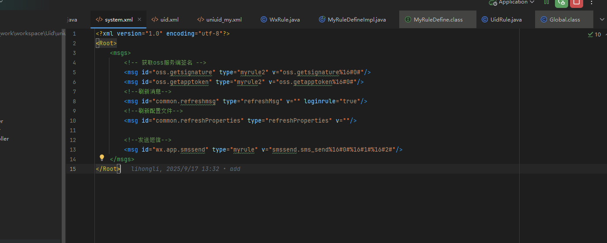
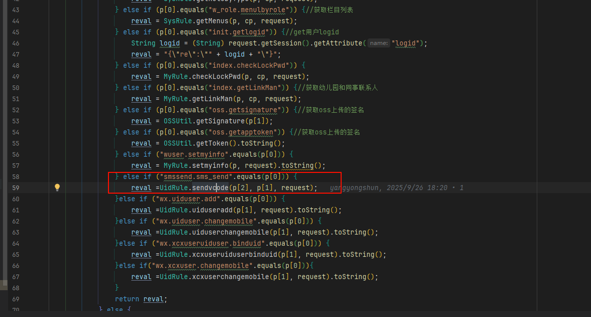

## 发送短信

参考 消息   wx.app.smssend   消息类型myrule

首先在xml文件中配置好相应的消息

### wx.app.smssend



就当是自己去学习企业的短信配置



## 发送实现方法

```java
public static String sendvcode(String captchaVerification, String mobile, HttpServletRequest request) {
    JSONObject objre = new JSONObject();
    log.info("sendvcode");
    log.info("请求参数：captchaVerification: {}, mobile: {}", captchaVerification, mobile);
    try {
        if (StringUtil.isNull(captchaVerification) || StringUtil.isNull(mobile)) {
            log.error("请求参数错误");
            objre.put("error", "请求参数错误");
        }
        //1、验证图形验证码是否通过
        CaptchaVO captchaVO = new CaptchaVO();
        captchaVO.setCaptchaVerification(captchaVerification);
        CaptchaService captchaService = SpringContextUtil.getBean(CaptchaService.class);
        ResponseModel responseModel = captchaService.verification(captchaVO);
        if (!responseModel.isSuccess()) {
            log.error("图形验证码不通过，{}", responseModel.getRepMsg());
            objre.put("error", responseModel.getRepMsg());
        }
        //2、生成短信验证码
        int randNum = (int) ((Math.random() * 9 + 1) * 100000);
        String valCode = String.valueOf(randNum);
        JSONObject param = new JSONObject();
        param.put("code", valCode);
        param.put("product", "UID小程序");
        param.put("mobile", mobile);
        param.put("smsid", "logincode");
        String isok = "200";//send_sms(param, "zxx");
        log.info("发送验证码结果：mobile：{}，isok： {}，valCode： {}", mobile, isok, valCode);
        if ("200".equals(isok)) {
            RedisUtils redisUtils = SpringContextUtil.getBean(RedisUtils.class);
            redisUtils.setCacheObject("uid_sms_" + mobile, valCode, 5 * 60, TimeUnit.SECONDS);
            objre.put("success", "验证码已发送");
            objre.put("mcode", valCode);
        } else {
            if (isok.equals("15")) {
                objre.put("error", "不是合法的手机号");
            }
            objre.put("error", "验证码发送失败");
        }
    } catch (Exception e) {
        log.error("发送短信验证码异常");
        log.error(e.getMessage() + ",{}", e);
        objre.put("error", "发送短信验证码异常");
    }
    return objre.toString();
}

public static String send_sms(JSONObject param, String sys) {
    Map<String, String> headers = new HashMap<>();
    headers.put("Content-Type", "application/json");
    String resultstr = HttpUtil.doPost(headers, Global.map.get("smsAddress") + "?sys=" + sys, param);
    if (StringUtil.notNull(resultstr)) {
        JSONObject resObi = new JSONObject(resultstr);
        return resObi.optString("code");
    } else {
        return "500";
    }
}
```

### 整体流程概述

这段代码实现了一个典型的"图形验证码 + 短信验证码"的二次验证机制，主要分为以下几个阶段：

------

### 第一阶段：参数校验

```java
if (StringUtil.isNull(captchaVerification) || StringUtil.isNull(mobile)) {
    log.error("请求参数错误");
    objre.put("error", "请求参数错误");
}
```

- 验证必传参数：图形验证码凭证（`captchaVerification`）和手机号（`mobile`）
- 如果任一参数为空，直接返回错误

------

### 第二阶段：图形验证码验证

```java
CaptchaVO captchaVO = new CaptchaVO();
captchaVO.setCaptchaVerification(captchaVerification);
CaptchaService captchaService = SpringContextUtil.getBean(CaptchaService.class);
ResponseModel responseModel = captchaService.verification(captchaVO);
```

**目的**：防止恶意程序自动化攻刷短信接口

**流程**：

1. 创建图形验证码验证对象
2. 通过 Spring 容器获取验证服务
3. 调用验证接口检查用户提交的图形验证码是否正确
4. 如果验证失败，返回错误信息，**终止后续流程**

------

### 第三阶段：生成短信验证码

```java
int randNum = (int) ((Math.random() * 9 + 1) * 100000);
String valCode = String.valueOf(randNum);
```

**生成逻辑**：

- `Math.random() * 9 + 1` 生成 [1, 10) 的随机数
- 乘以 100000 得到 [100000, 1000000) 的整数
- 结果是一个 **6位数字验证码**（例如：123456）

------

### 第四阶段：准备短信参数

```java
JSONObject param = new JSONObject();
param.put("code", valCode);           // 验证码
param.put("product", "UID小程序");    // 产品名称
param.put("mobile", mobile);          // 目标手机号
param.put("smsid", "logincode");      // 短信模板ID
```

这些参数会被传递给短信发送接口，用于：

- 指定验证码内容
- 标识发送方（产品名称）
- 指定接收方（手机号）
- 选择短信模板（logincode 对应登录验证码模板）

------

### 第五阶段：调用短信发送接口

```java
String isok = "200";//send_sms(param, "zxx");
```

**注意**：代码中注释掉了实际调用，直接返回 "200"（成功）

#### `send_sms` 方法详解：

```java
public static String send_sms(JSONObject param, String sys) {
    Map<String, String> headers = new HashMap<>();
    headers.put("Content-Type", "application/json");
    
    // 发送HTTP POST请求到短信网关
    String resultstr = HttpUtil.doPost(
        headers, 
        Global.map.get("smsAddress") + "?sys=" + sys, 
        param
    );
    
    // 解析返回结果
    if (StringUtil.notNull(resultstr)) {
        JSONObject resObi = new JSONObject(resultstr);
        return resObi.optString("code");  // 返回状态码
    } else {
        return "500";  // 请求失败
    }
}
```

**工作流程**：

1. 设置 HTTP 请求头为 JSON 格式
2. 向短信网关发送 POST 请求（地址从全局配置读取）
3. 携带系统标识参数 `sys=zxx`
4. 解析响应，提取状态码

------

### 第六阶段：处理发送结果

#### 成功情况（返回码 = "200"）

```java
if ("200".equals(isok)) {
    RedisUtils redisUtils = SpringContextUtil.getBean(RedisUtils.class);
    redisUtils.setCacheObject("uid_sms_" + mobile, valCode, 5 * 60, TimeUnit.SECONDS);
    objre.put("success", "验证码已发送");
    objre.put("mcode", valCode);
}
```

**操作**：

1. 将验证码存入 Redis，键名格式：`uid_sms_13800138000`
2. 设置 **5分钟过期时间**（300秒）
3. 返回成功消息
4. **注意**：返回了明文验证码 `mcode`（这是安全隐患，见下方分析）

#### 失败情况

```java
else {
    if (isok.equals("15")) {
        objre.put("error", "不是合法的手机号");
    }
    objre.put("error", "验证码发送失败");
}
```

根据错误码处理：

- 错误码 "15"：手机号格式非法
- 其他错误：通用失败提示

------

### 第七阶段：异常处理

```java
catch (Exception e) {
    log.error("发送短信验证码异常");
    log.error(e.getMessage() + ",{}", e);
    objre.put("error", "发送短信验证码异常");
}
```

捕获所有异常并记录日志，返回统一错误提示。

------

## 流程图总结

```
用户请求
  ↓
参数校验（captchaVerification + mobile）
  ↓
图形验证码验证 ← 防止机器人攻击
  ↓
生成6位随机验证码
  ↓
调用短信网关发送
  ↓
成功？
  ├─ 是 → 存入Redis（5分钟） → 返回成功
  └─ 否 → 返回错误信息
```

------

## 潜在问题与建议

### ⚠️ 安全问题

1. **返回明文验证码**：`objre.put("mcode", valCode)` 在生产环境应移除
2. **注释掉实际发送**：`String isok = "200";` 应恢复为真实调用
3. **缺少频率限制**：未检查同一手机号的发送次数（容易被滥用）

### 🔧 逻辑问题

1. **错误码处理 bug**：

   ```java
   if (isok.equals("15")) {
       objre.put("error", "不是合法的手机号");
   }
   objre.put("error", "验证码发送失败"); // 这行会覆盖上面的错误
   ```

   应改为 `else if`

2. **缺少返回值控制**：多个错误分支设置后仍继续执行，应及时 `return`

### 💡 改进建议

- 添加同一手机号发送频率限制（如1分钟内只能发送1次）
- 添加同一IP的请求频率限制
- 移除返回的明文验证码
- 增强手机号格式校验
- 完善错误码映射机制

