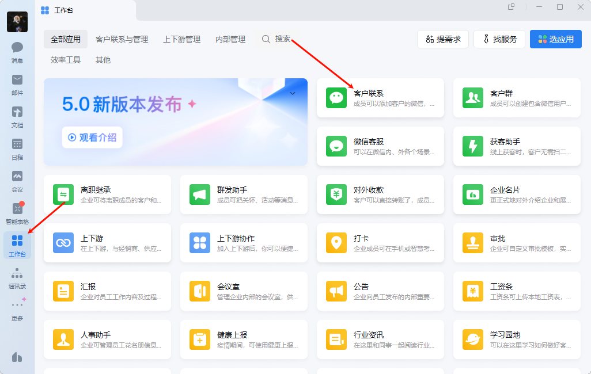
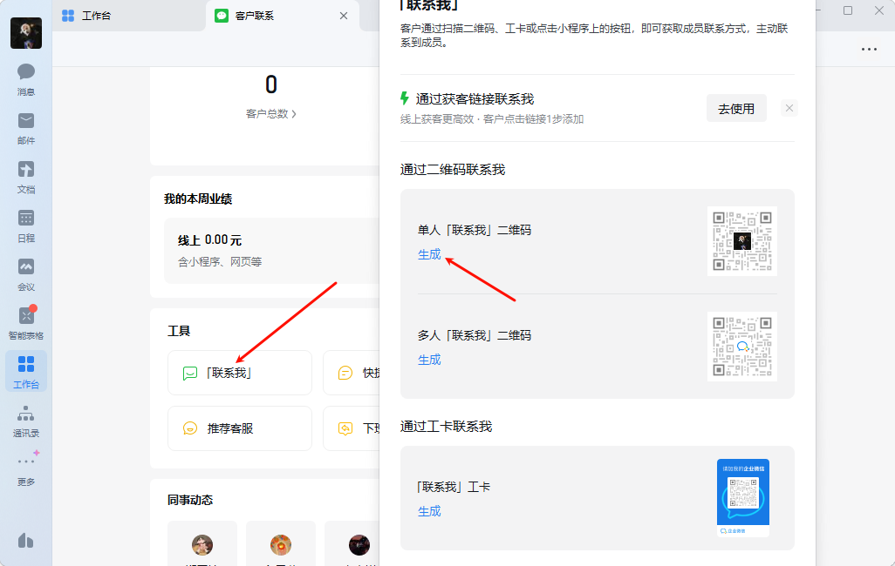

## 如何获取企微码

1. **打开企业微信APP**：: 在手机上打开企业微信应用程序。
2. **进入工作台**：: 点击主界面下方的【工作台】选项卡。
3. **选择客户联系**：: 在工作台页面中，找到并点击【客户联系】功能。
4. **找到联系我二维码**：: 在客户联系的工具列表中，找到【联系我】选项，并点击进入。
5. **生成并保存二维码**：: 选择【单人联系我二维码】，系统会自动生成一个专属的二维码。 点击保存按钮，即可将二维码保存到手机相册。

## 如何长按识别二维码

**使用uni-app开发，给image标签添加:show-menu-by-longpress="true"属性**

### 对应事件的监听

上述事件本身没有回调，貌似只有监听，
在需求上基本是扫码添加好友，不涉及到解密与加密，将用户添加给相应的专员

一个用户根据不同的产品肯定有不同的专员  

用户可以查看自己的账户金额  与积分

专员可以管理自己的客户 

客户的升级是否由专员提交 提交的内容   系统管理员审核？

对于多图上传  1对多  **还有产品视频 得创建一个表去映射相应的关系**

#### 1、发送给朋友

#### 2、收藏

#### 3、保存图片

#### 4、识别图片中的小程序码

​                   

