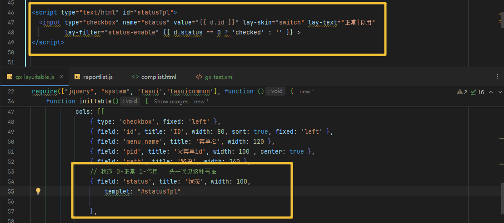
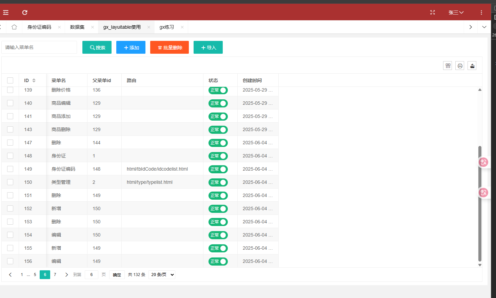
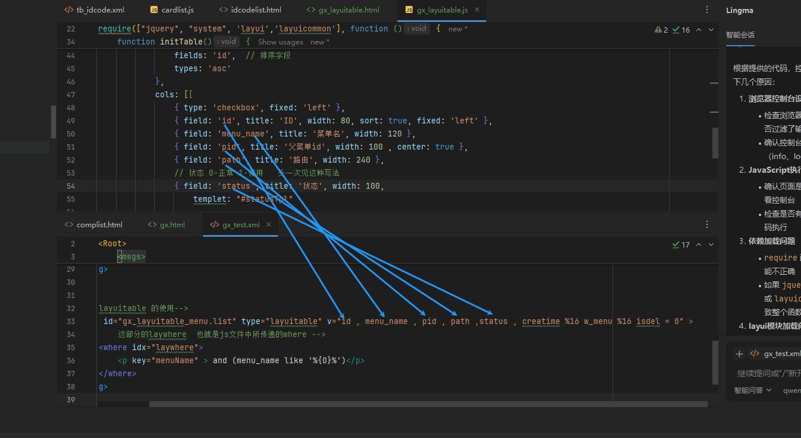
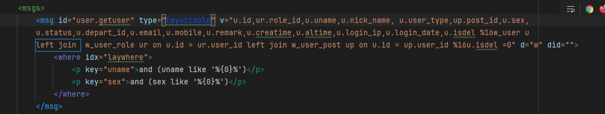

## layuitable  深度解析

前端请求到  --->   xml文件     --->  封装好了的layuitable.class

参考消息体：msgid  --> tb_idcode.list


昨天谈到了前端针对table的render 是需要对其url和msgid  进行拼接的

`url: encodeURI($.layurl + "?" + $.getSmStr(["tb_idcode.list"])),`

直接快进到js文件是如何编写的  html文件中对table标签绑定了相应的id

### layuitable组件(官方源码)

通过官方的layuitable文档    的table组件中的[源码](https://layui.dev/docs/2/table/)：

#### 官方API(例举常用)

就可以解释为什么不需要传递页码和数据多少了

Table表格的[异步属性](https://layui.dev/docs/2/table/#options.ajax)

异步属性，当开启url属性时才生效  其中

| 属性名 | 描述                                                         |
| ------ | ------------------------------------------------------------ |
| url    | 发送异步请求的URL，默认会自动携带两个传递参数:  ?page=1 &limit =30 该参数可通过request 属性自定义<br />page 代表当前页码     limit 代表每页的数据条数 |
| where  | 请求的其他参数  where                                        |
|        |                                                              |

### 1、从0-1使用layuitype

#### gx_layuitable.html

```html
<!DOCTYPE html>
<html lang="en">
<head>
    <meta charset="UTF-8">
    <title>layuitable类型练习</title>
    <meta name="renderer" content="webkit">
    <meta http-equiv="X-UA-Compatible" content="IE=edge,chrome=1">
    <meta name="viewport"
          content="width=device-width, initial-scale=1.0, minimum-scale=1.0, maximum-scale=1.0, user-scalable=0">
    <link rel="stylesheet" href="../../css/big_dataset.css" media="all">
    <link rel="stylesheet" type="text/css" href="../../layui-btkj/css/layui.css" media="all">
    <script type="text/javascript" src="../../sys/jquery.js"></script>
    <script type="text/javascript" src="../../sys/system.js"></script>
    <script type="text/javascript" src="../../sys/input.js"></script>
    <script src="../../layui-btkj/layui.js"></script>
    <script src="../../sys/require.min.js"></script>
</head>
<body>
<div id="LAY_app">
  <div class="layui-layout">
    <div class="layui-row layui-col-space16">
      <div class="layui-col-md2">
        <input type="text" name="" id="menuName" placeholder="请输入菜单名" class="layui-input searchVal" maxlength="50">
      </div>
      <div class="layui-col-md4">
        <button type="button" class="layui-btn search" id="searchBtn">
          <i class="layui-icon layui-icon-search"></i>搜索
        </button>
        <button type="button" class="layui-btn layui-bg-blue addbtn1" lay-perm="sys:use:add">
          <i class="layui-icon layui-icon-add-1" lay-perm="sys:dataset:add"></i>添加
        </button>
        <button type="button" class="layui-btn layui-bg-red delbtn" id="batchDel" lay-perm="sys:use:del">
          <i class="layui-icon layui-icon-delete" lay-perm="sys:dataset:delall"></i>批量删除
        </button>
        <button type="button" class="layui-btn" id="batchAdd" lay-perm="sys:use:add">
          <i class="layui-icon layui-icon-add-1" lay-perm="sys:dataset:add"></i>导入
        </button>
      </div>
    </div>
    <div id="laytable">
      <table class="layui-hide" id="gx_layuitable" lay-filter="gx_layuitable"></table>
    </div>
  </div>
</div>

<script type="text/html" id="statusTpl">
  <input type="checkbox" name="status" value="{{ d.id }}" lay-skin="switch" lay-text="正常|停用"
         lay-filter="status-enable" {{ d.status == 0 ? 'checked' : '' }} >
</script>


<script type="text/html" id="toolbarDemo">
  <div class="layui-btn-container">
    <button class="layui-btn layui-btn-sm" lay-event="getCheckData">获取选中行数据</button>
    <button class="layui-btn layui-btn-sm" lay-event="getData">获取当前页数据</button>
    <button class="layui-btn layui-btn-sm" id="dropdownButton">
      下拉按钮
      <i class="layui-icon layui-icon-down layui-font-12"></i>
    </button>
    <button class="layui-btn layui-btn-sm layui-bg-blue" id="reloadTest">
      重载测试
      <i class="layui-icon layui-icon-down layui-font-12"></i>
    </button>
    <button class="layui-btn layui-btn-sm layui-btn-primary" id="rowMode">
      <span>{{= d.lineStyle ? '多行' : '单行' }}模式</span>
      <i class="layui-icon layui-icon-down layui-font-12"></i>
    </button>
  </div>
</script>
<script type="text/html" id="toolDemo">
  <div class="layui-clear-space">
    <a class="layui-btn layui-btn-xs" lay-event="edit">编辑</a>
    <a class="layui-btn layui-btn-xs" lay-event="more">
      更多
      <i class="layui-icon layui-icon-down"></i>
    </a>
  </div>
</script>

<script src="../../js/gx/gx_layuitable.js"></script>
</body>
</html>
```

##### 疑问与过程中遇到的坑

1. 在head标签中为什么要引入这么多的`<link>`和`<script>` 是每次都引入吗？

2. `<script>` 在最后引入的时候我看别的参考用 data-main 和src

   ```js
   <script data-main="../../js/gx/gx_layuitable" src='../../sys/require.min.js'></script>
   ```

   这个文件之前也是这样结构的写  但是发现没有调用接口  后面改为了下面的才成功

   ```js
   <script src="../../js/gx/gx_layuitable"></script>
   ```

3. 还遇到一个比较新奇的写法

   就是我们在获取状态的时候之前的vue框架是通过v-if  或者 v-show来展示的tag的

   但是这里的写法是在table中的col中对应的status字段添加一个 template = '#(script标签中的id)' 如下图：

   

   不知道是不是框架自带的  于是就有了新的探索点  如果点击修改状态  又该如何写呢？

#### gx_layuitable.js

```js
require.config({
    paths: {
        jquery: '../../sys/jquery',
        system: '../../sys/system',
        layuicommon: "../../sys/layuicommon",
        layui: "../../layui-btkj/layui"
    },
    shim: {
        "system": {
            deps: ["jquery"]
        },
        "layui": {
            deps: ["jquery", "system"]
        },
        "layuicommon": {
            deps: ["jquery", "layui"]
        }
    },
    waitSeconds: 0
});

require(["jquery", "system", 'layui','layuicommon'], function () {

    layui.use(['table', 'layer', 'dropdown'], function () {


        // 为了减少代码的复杂程度  可以对表格的初始化逻辑进行封装
        console.log("initTable");
        initTable();
        console.log("initTable_over");


    })
    function initTable() {
        var table = layui.table;
        table.render({
            elem: '#gx_layuitable',
            url: encodeURI($.layurl + "?" + $.getSmStr(["gx_layuitable_menu.list"])),  // 数据接口
            header: {
                "Content-Type": "application/json",
                "Accept": "application/json",
            },
            where: {
                fields: 'id',  // 排序字段
                types: 'asc'
            },
            cols: [[
                { type: 'checkbox', fixed: 'left' },
                { field: 'id', title: 'ID', width: 80, sort: true, fixed: 'left' },
                { field: 'menu_name', title: '菜单名', width: 120 },
                { field: 'pid', title: '父菜单id', width: 100 , center: true },
                { field: 'path', title: '路由', width: 240 },
                // 状态 0-正常 1-停用   头一次见这种写法
                { field: 'status', title: '状态', width: 100,
                    templet: "#statusTpl"
                },
                // 创建时间
                { field: 'creatime', title: '创建时间', width: 120 }
            ]],
            toolbar: '#toolbar', //工具栏
            defaultToolbar: ['filter', 'print', 'exports'], // 筛选  打印  导出
            height: 'full-200', // 100%高度
            page: true,  // 开启分页
            countNumberBool: true, // 开启行号
            even: true, // 开启隔行背景
            limits: [10, 20, 30, 50, 100],
            limit: 20, // 默认每页显示数量
        });
        //
        table.on('tool(gx_layuitable)', function(obj) {
        });
    }
})
```

##### 疑问与过程中遇到的坑


#### gx_test.xml

```xml
      <msg id="gx_layuitable_menu.list" type="layuitable" v="id , menu_name , pid , path ,status , creatime %16 w_menu %16 isdel = 0" >
<!--            这部分的laywhere  也就是js文件中所传递的where 适用于搜索 -->
            <where idx="laywhere">
                <p key="menuName" > and (menu_name like '%{0}%')</p>
            </where>
        </msg>
```


#### 效果展示



#### 收获与注意事项：

layuitable可算是搞明白了

使用layuitable消息类型   的时候注意分割  %16   

注意cols中的字段需要与xml中分割符 一一对应



### 2、实现筛选并重新加载table

目标：可以输入菜单名和下拉选择父菜单id 进行数据的获取并渲染


主要熟悉selec标签和table组件的使用

#### 实现思路：

之前的搜索主要使用的是selectjson去实现搜索的，这次配合着layuitable去实现  不难发现 type类型为layuitable的消息类型主要就是配合着table组件进行使用的  在官方提供的api中发现实现一些简单的功能 那是很快的

在where中添加相应的参数就可以获取到数据  在文章的末尾会提供上所有的源码  

通过阅读下拉选择框组件文档 了解到了如何渲染数据  

这里当有多个条件的时候  我们要想实现相应的功能   

1.  如何拿到输入的文本框
2. 下拉选择框选择的数据如何给到要请求的接口？

主要实现的代码：按钮点击后的重新加载


### 3、实现添加功能

主要熟悉insert   insertjson  insertselect  消息类型

insertjson在页面中已经有练习了

update还没有


## layuiTable源码查看(后端)

查看源码才能知道为什么使用type为layuitable  能从数据里面拿到数据


查看源码才能知道为什么它本身是一个查询  可以使用selectjson代替  但是layui框架为我们封装好了

说白了就是使用这个组件按照type类型为layuitable的消息类型的时候   可以大大简化我们的开发流程

也就是说我们在消息内容 v 那部分可以简写很多的sql语句 

而只需要表格的col  与  v 的前面字段一一对应  目前就做了单表的查询  

如果是多表关联又该如何写呢？ 使用join



### Execute函数执行流程

由controller里面导入dbutil依赖  通过这个工具去执行execute函数  与数据库进行交互

这是一个用于LayUI表格数据查询的核心方法，支持分页、排序、条件查询和跨数据库查询。

函数大体流程：

#### 1、参数初始化阶段

> 输入参数：cp[](数据库连接参数 ), msg(消息对象), request(请求对象)
> ↓
> 解析msg对象获取：
>
> - str: 查询字符串
> - arrpm: 参数数组  
> - objmsg: JSON消息对象
> ↓
> 按"%16"分割str得到arr数组：
> - arr[0]: 查询字段
> - arr[1]: 查询表名
> - arr[2]: 附加where条件
> - arr[3]: group by字段

#### 2、请求参数提取

> 从request中提取：
> - page: 当前页码
> - limit: 每页记录数
> - swhere: 查询条件
> - orderfield: 排序字段
> - ordertype: 排序类型(ASC/DESC)
> - isPage: 是否分页(默认true)

#### 3、安全检查阶段

> - 检查SQL注入：
>   ├── Global.containsSqlInjection(orderfield)
>   ├── Global.containsSqlInjection(ordertype)  
>   └── Global.containsSqlInjection2(swhere)
>   ↓
>   检查分页参数：
>   ├── limit是否为数字
>   └── page是否为数字
>   ↓
>   如果检测到异常 → 返回错误响应

#### 4、条件处理阶段

```
处理where条件：
├── UTF8编码转换
├── 单引号转义处理
├── 特殊字符替换
└── MsgKit.getMsgWhere()处理动态where条件
↓
构建最终where条件：
├── 添加arr[2]的附加条件
├── 添加默认的isdel=0条件
├── 添加权限控制条件(strsee)
└── 去除开头的"and"关键字
```

#### 5、SQL构建阶段

```
构建计数SQL：
sqlCount = "select count(1) total from " + arr[1] + " where " + swhere + groupby
↓
如果有groupby → 包装为子查询计数
↓
计算分页参数：
├── limit = 每页记录数
└── offset = (当前页-1) × 每页记录数
```

#### 6、数据查询执行

##### 6.1跨数据库查询模式（cp[0]="crossdb"）

```
解析cp[1]为数据库配置数组
↓
遍历每个数据库：
├── 执行计数查询
├── 累计总记录数
├── 处理分页偏移量
└── 执行数据查询
↓
合并所有数据库的结果
```

##### 6.2 单数据库查询阶段

```
构建数据查询SQL：
sqlData = "select " + arr[0] + " from " + arr[1] + " where " + swhere + groupby + 
          " order by " + orderfield + " " + ordertype + 
          " limit " + limit + " offset " + offset
↓
执行查询：
├── DBUtil.selectOneJSON() - 获取总数
└── DBUtil.selectArray() - 获取数据
```

#### 7、响应构建阶段

```
构建JSON响应：
{
    "count": 总记录数,
    "data": 数据数组,
    "code": 状态码(0=成功),
    "msg": 消息
}
```

#### 8、异常处理

```
try-catch包装：
├── 参数解析异常处理
├── SQL执行异常处理
└── 返回标准错误格式
```

## 今日代码

### gx_layuitable.html

```html
<!DOCTYPE html>
<html lang="en">
<head>
    <meta charset="UTF-8">
    <title>layuitable类型练习</title>
    <meta name="renderer" content="webkit">
    <meta http-equiv="X-UA-Compatible" content="IE=edge,chrome=1">
    <meta name="viewport"
          content="width=device-width, initial-scale=1.0, minimum-scale=1.0, maximum-scale=1.0, user-scalable=0">
    <link rel="stylesheet" href="../../css/big_dataset.css" media="all">
    <link rel="stylesheet" type="text/css" href="../../layui-btkj/css/layui.css" media="all">
    <script type="text/javascript" src="../../sys/jquery.js"></script>
    <script type="text/javascript" src="../../sys/system.js"></script>
    <script type="text/javascript" src="../../sys/input.js"></script>
    <script src="../../layui-btkj/layui.js"></script>
    <script src="../../sys/require.min.js"></script>
</head>
<body>
<div id="LAY_app">
  <div class="layui-layout">
    <div class="layui-row layui-col-space16">
      <div class="layui-col-md2">
        <input type="text" name="" id="menuName" placeholder="请输入菜单名" class="layui-input searchVal" maxlength="50">
          <button class="layui-btn  demo-dropdown-base" id="f_menuId">
              <span>父菜单id选择</span>
              <i class="layui-icon layui-icon-down layui-font-12"></i>
          </button>
      </div>
      <div class="layui-col-md4">
        <button type="button" class="layui-btn search" id="searchBtn" value="搜索(实现)">
          <i class="layui-icon layui-icon-search"></i>搜索(实现)
        </button>
        <button type="button" class="layui-btn layui-bg-blue" lay-perm="" id="addBtn" >
          <i class="layui-icon layui-icon-add-1" lay-perm=""></i>添加
        </button>
        <button type="button" class="layui-btn layui-bg-red delbtn" id="delBatchBtn" lay-perm="">
          <i class="layui-icon layui-icon-delete" lay-perm=""></i>批量删除
        </button>
        <button type="button" class="layui-btn" id="importBtn" lay-perm="">
          <i class="layui-icon layui-icon-add-1" lay-perm=""></i>导入
        </button>
      </div>
    </div>
    <div id="laytable">
      <table class="layui-hide" id="gx_layuitable" lay-filter="gx_layuitable"></table>
    </div>
  </div>
</div>

<script type="text/html" id="statusTpl">
  <input type="checkbox" name="status" value="{{ d.id }}" lay-skin="switch" lay-text="正常|停用"
         lay-filter="status-enable" {{ d.status == 0 ? 'checked' : '' }} >
</script>


<script type="text/html" id="toolbarDemo">
  <div class="layui-btn-container">
    <button class="layui-btn layui-btn-sm" lay-event="getCheckData">获取选中行数据</button>
    <button class="layui-btn layui-btn-sm" lay-event="getData">获取当前页数据</button>
    <button class="layui-btn layui-btn-sm" id="dropdownButton">
      下拉按钮
      <i class="layui-icon layui-icon-down layui-font-12"></i>
    </button>
    <button class="layui-btn layui-btn-sm layui-bg-blue" id="reloadTest">
      重载测试
      <i class="layui-icon layui-icon-down layui-font-12"></i>
    </button>
    <button class="layui-btn layui-btn-sm layui-btn-primary" id="rowMode">
      <span>{{= d.lineStyle ? '多行' : '单行' }}模式</span>
      <i class="layui-icon layui-icon-down layui-font-12"></i>
    </button>
  </div>
</script>
<script type="text/html" id="toolDemo">
  <div class="layui-clear-space">
    <a class="layui-btn layui-btn-xs" lay-event="edit">编辑</a>
    <a class="layui-btn layui-btn-xs" lay-event="more">
      更多
      <i class="layui-icon layui-icon-down"></i>
    </a>
  </div>
</script>

<script src="../../js/gx/gx_layuitable.js"></script>
</body>
</html>
```

### gx_layuitable.js

```js
require.config({
    paths: {
        jquery: '../../sys/jquery',
        system: '../../sys/system',
        layuicommon: "../../sys/layuicommon",
        layui: "../../layui-btkj/layui"
    },
    shim: {
        "system": {
            deps: ["jquery"]
        },
        "layui": {
            deps: ["jquery", "system"]
        },
        "layuicommon": {
            deps: ["jquery", "layui"]
        }
    },
    waitSeconds: 0
});

var objdata = {
    f_id: "",
};

require(["jquery", "system", 'layui','layuicommon'], function () {

    layui.use(['table', 'layer', 'dropdown'], function () {


        // 为了减少代码的复杂程度  可以对表格的初始化逻辑进行封装

        initTable();

        // 如果想添加一个下拉框 选择了 某个选项 该如何实现这个下拉框？
        initDropdown();

        // 搜索按钮点击事件
        $("#searchBtn").click(function () {
            var search = $("#menuName").val(); // 拿到输入框的值
            console.log(search)
            // 重新加载表格  同时在where中添加swhere属性用于添加别的条件
            objdata.objwhere = {}
            objdata.objwhere.menuName = [search];  // 因为请求的接口数据类型为数组 故需要添加[]

            //
            if(objdata.f_id){
                objdata.objwhere.f_id = [objdata.f_id];
            }


            // 重新加载table
            layui.table.reload('gx_layuitable', {
                where: {
                    swhere: $.msgwhere(objdata.objwhere), // 后端的laywhere接收 数据格式为json
                    fields: 'id',
                    types:'asc'
                },
                page: {
                    curr: 1
                }

            })
        })

        // 使用钩子函数
        $("#addBtn").click(() => {
            openwin("add")
        })

        $("#delBatchBtn").click(() => {
            openwin("delBatchBtn")
        })

        $("#importBtn").click(() => {
            openwin("importBtn")
        })


    })
    function initTable() {
        var table = layui.table;
        table.render({
            elem: '#gx_layuitable',
            url: encodeURI($.layurl + "?" + $.getSmStr(["gx_layuitable_menu.list"])),  // 数据接口
            header: {
                "Content-Type": "application/json",
                "Accept": "application/json",
            },
            where: {
                fields: 'id',  // 排序字段
                types: 'asc'
            },
            cols: [[
                { type: 'checkbox', fixed: 'left' },
                { field: 'id', title: 'ID', width: 80, sort: true, fixed: 'left' },
                { field: 'menu_name', title: '菜单名', width: 120 },
                { field: 'pid', title: '父菜单id', width: 100 , center: true },
                { field: 'path', title: '路由', width: 240 },
                // 状态 0-正常 1-停用   头一次见这种写法
                { field: 'status', title: '状态', width: 100,
                    templet: "#statusTpl"

                },

                // 创建时间
                { field: 'creatime', title: '创建时间', width: 120 }
            ]],
            toolbar: '#toolbar', //工具栏
            defaultToolbar: ['filter', 'print', 'exports'], // 筛选  打印  导出
            height: 'full-200', // 100%高度
            page: true,  // 开启分页
            countNumberBool: true, // 开启行号
            even: true, // 开启隔行背景
            limits: [10, 20, 30, 50, 100],
            limit: 20, // 默认每页显示数量
        });
        //
        table.on('tool(gx_layuitable)', function(obj) {
        });
    }

    function initDropdown(){
        var dropdown = layui.dropdown;

        $.sm(function (re, err) {
            if(err){
                layer.msg(err);
            }
            // 渲染dropdown
            // console.log(re)
            var dropdownData = [];
            if(re && Array.isArray(re)) {
                re.forEach(function(item, index) {
                    // 假设每个item是一个数组，取第一个元素作为id
                    var id = Array.isArray(item) ? item[0] : item;
                    dropdownData.push({
                        id: id,
                        title: "父菜单：" + id  // 这里可以根据实际需求设置显示文本
                    });
                });
            }

            dropdown.render({
                elem: '#f_menuId',
                data: dropdownData,  // 结构为 [{id:1,title:"张"},{id:2,title:"李四"}]  但是得到的re 为[[1],[2]] 该如何实现 将数据先转换
                click: function (data, index) {
                    this.elem.find('span').text(data.title);  // 将数据写入span
                    objdata.f_id = data.id;
                }
            });

        }, ["gx.selectjsonwfmenu"]);
    }

    function openwin(type, id){
        switch ( type){
            case 'add':
                console.log("add")
                break ;
            case 'delBatchBtn':
                console.log("delBatchBtn")
                break ;
            case 'importBtn':
                console.log("importBtn")
                break ;
            default:
                console.log("default")
        }

    }

})
```


### gx_test.xml

```xml
<?xml version="1.0" encoding="utf-8"?>
<Root>
    <msgs>
<!--        简单的查询-->
        <msg id="gx.selectjson" type="selectjson" v="select u.id, u.uname, u.nick_name from w_user u" perms="">
        </msg>
        <msg id="gx.selectonejson" type="selectonejson" v="select u.uname, u.nick_name from w_user u" perms="">
        </msg>

<!--        添加条件的 类似搜索  也就是添加where条件-->
        <msg id="gx.selectjsonwhere" type="selectjson" v="select u.id ,u.uname, u.nick_name,u.mobile, u.login_date
        from w_user u where #0#" perms="">
            <where idx="0">
                <p key="keyword">u.uname like '%{0}%'</p>
            </where>
        </msg>
<!--        insert insertjson insertselect-->
        <msg id="gx.insertjson" type="insertjson" d="w" v="w_user%16#0#%16#1#" perms="">
            <where idx="columns">
                <p key="uname" format="String">uname</p>
                <p key="nickName" format="String">nick_name</p>
                <p key="email" format="String">email</p>
                <p key="mobile" format="String">mobile</p>
            </where>
            <where idx = "1">
                <p key="id">id = {0}</p>
            </where>

        </msg>


<!--        layuitable 的使用-->
        <msg id="gx_layuitable_menu.list" type="layuitable" v="id , menu_name , pid , path ,status , creatime %16 w_menu %16 isdel = 0" >
<!--            这部分的laywhere  也就是js文件中所传递的where -->
            <where idx="laywhere">
                <p key="menuName" > and (menu_name like '%{0}%')</p>
                <p key="f_id" > and pid = {0}</p>
            </where>
        </msg>

        <msg id="gx.selectjsonwfmenu" type="select" v="select pid from w_menu group by pid order by pid asc">

        </msg>

    </msgs>
</Root>
```


