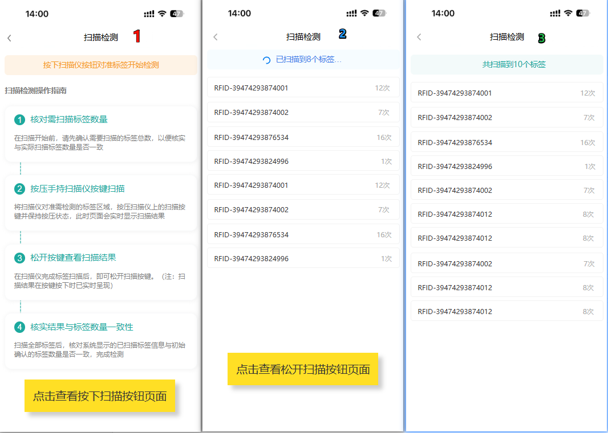

## 原型



## 代码实现

`scanDetection.vue`

```vue
<template>
	<view class="container">
		<!-- 初始操作指南 - 未开始扫描时显示 -->
		<view v-if="!hasStartedScanning" class="guide-section">
			<!-- 顶部提示 -->
			<view class="tip-box">
				<text class="tip-text">按下扫描枪按钮/准备开始检测</text>
			</view>
			
			<view class="guide-title">
				<text class="title-text">扫描检测操作指南</text>
			</view>
			
			<!-- 操作步骤 -->
			<view class="guide-steps">
				<view class="step-card">
					<view class="step-header">
						<view class="step-number">1</view>
						<text class="step-title">核对需扫描标签数量</text>
					</view>
					<text class="step-desc">在扫描开始前，请先确认需要扫描的标签总数，以便核实与实际扫描标签数量是否一致</text>
				</view>
				
				<view class="step-divider"></view>
				
				<view class="step-card">
					<view class="step-header">
						<view class="step-number">2</view>
						<text class="step-title">按压手持扫描仪按键扫描</text>
					</view>
					<text class="step-desc">将扫描仪对准需要扫描的标签区域，按压扫描仪上的扫描按键并保持按压状态，此时页面会实时显示扫描结果</text>
				</view>
				
				<view class="step-divider"></view>
				
				<view class="step-card">
					<view class="step-header">
						<view class="step-number">3</view>
						<text class="step-title">松开按键查看扫描结果</text>
					</view>
					<text class="step-desc">在扫描仪完成标签扫描后，即可松开扫描按键。(注：扫描结果在按键按下时已实时呈现)</text>
				</view>
				
				<view class="step-divider"></view>
				
				<view class="step-card">
					<view class="step-header">
						<view class="step-number">4</view>
						<text class="step-title">核实结果与标签数量一致性</text>
					</view>
					<text class="step-desc">扫描全部标签后，核对系统显示的已扫描标签信息与初始确认的标签数量是否一致，完成检测</text>
				</view>
			</view>
		</view>
		
		<!-- 扫描结果界面 - 开始扫描后显示 -->
		<view v-else class="scan-section">
			<!-- 扫描状态提示 -->
			<view class="tip-box" :class="{ 'scanning': isScanning, 'stopped': !isScanning }">
				<text class="tip-text" v-if="isScanning">已扫描到{{ tagList.length }}个标签...</text>
				<text class="tip-text" v-else>共扫描到{{ tagList.length }}个标签</text>
			</view>
			
			<!-- 扫描到的标签列表 -->
			<view class="scan-result-section">
				<scroll-view 
					class="tag-scroll-view" 
					scroll-y="true"
					:show-scrollbar="true"
					@touchmove.stop="">
					<view v-for="(tag, index) in tagList" :key="tag.epc" class="tag-item">
						<view class="tag-epc">{{ tag.epc }}</view>
						<view class="tag-info">
							<text class="tag-count">{{ tag.count }}次</text>
						</view>
					</view>
				</scroll-view>
			</view>
			
			<!-- 操作按钮区域 -->
			<view class="action-buttons" v-show="!isScanning">
				<button class="action-btn clear-btn" @click="clearTags">清空</button>
			</view>
		</view>
	</view>
</template>

<script>
import uhfManager from '@/common/uhfManager.js';
import uhfSceneConfig from '@/common/uhfSceneConfig.js';

export default {
	data() {
		return {
			currentSceneId: 3, // 盘库场景
			isInitializing: false,
			isScanning: false,
			isStopping: false,
			hasStartedScanning: false, // 标记是否已经开始过扫描
			
			// 扫描数据
			tagMap: {},
			tagList: [],
			dataBuffer: [],
			updateTimer: null,
			pendingUpdates: false
		}
	},
	
	onShow() {
		console.log('页面显示');
		// 异步初始化UHF
		this.$nextTick(() => {
			this.asyncInitUHF();
		});
	},
	
	onHide() {
		console.log('页面隐藏');
		this.stopScan();
		this.uninitUHF();
	},
	
	onUnload() {
		console.log('页面卸载');
		this.stopScan();
		this.uninitUHF();
	},
	
	methods: {
		/**
		 * 异步初始化UHF
		 */
		async asyncInitUHF() {
			// 如果已经初始化,检查配置是否需要更新
			if (uhfManager.isReady()) {
				const config = uhfSceneConfig.getConfig(this.currentSceneId);
				uhfManager.applyConfig(config);
				this.setupCallbacks();
				return;
			}
			
			// 执行初始化
			this.isInitializing = true;
			
			// 使用setTimeout让页面先渲染
			setTimeout(() => {
				this.initUHF();
				this.isInitializing = false;
			}, 100);
		},
		
		/**
		 * 初始化UHF
		 */
		initUHF() {
			const config = uhfSceneConfig.getConfig(this.currentSceneId);
			console.log('使用盘库场景配置:', config);
			
			const result = uhfManager.init(config);
			
			if (result) {
				console.log('UHF初始化成功');
				this.setupCallbacks();
			} else {
				console.error('UHF初始化失败');
				uni.showToast({
					title: '设备初始化失败',
					icon: 'error',
					duration: 2000
				});
			}
		},
		
		/**
		 * 设置回调函数
		 */
		setupCallbacks() {
			// 设置标签数据回调
			uhfManager.setOnTagDataCallback((uhfdata) => {
				if (this.isScanning && !this.isStopping) {
					this.parseTagData(uhfdata);
				}
			});
			
			// 设置按键扫描回调 - 监听292按钮
			uhfManager.setOnKeyScanCallback((isKeyDown) => {
				if (isKeyDown) {
					this.startScan();
				} else {
					this.stopScan();
				}
			});
		},
		
		/**
		 * 卸载UHF
		 */
		uninitUHF() {
			uhfManager.uninit();
			this.stopUpdateTimer();
		},
		
		/**
		 * 开始扫描
		 */
		startScan() {
			if (this.isScanning) return;
			
			if (this.isInitializing) {
				uni.showToast({
					title: '设备初始化中,请稍候',
					icon: 'none'
				});
				return;
			}
			
			const result = uhfManager.startScan();
			if (result) {
				this.isScanning = true;
				this.isStopping = false;
				this.hasStartedScanning = true; // 标记已开始扫描,切换界面
				this.dataBuffer = [];
				this.startUpdateTimer();
				console.log('开始扫描');
			} else {
				console.error('启动扫描失败');
				uni.showToast({
					title: '启动失败',
					icon: 'error'
				});
			}
		},
		
		/**
		 * 停止扫描
		 */
		stopScan() {
			if (!this.isScanning || this.isStopping) return;
			
			this.isStopping = true;
			console.log('准备停止扫描');
			
			const result = uhfManager.stopScan();
			
			if (result) {
				// 立即停止定时器
				this.stopUpdateTimer();
				
				// 异步处理剩余数据
				setTimeout(() => {
					// 处理缓冲区中剩余的数据
					if (this.dataBuffer.length > 0) {
						this.processBatchData();
					}
					
					// 最后一次更新UI
					this.updateTagListFast();
					
					this.isScanning = false;
					this.isStopping = false;
					
					console.log('停止扫描');
				}, 0);
			} else {
				this.isStopping = false;
			}
		},
		
		/**
		 * 启动UI更新定时器
		 */
		startUpdateTimer() {
			this.stopUpdateTimer();
			this.updateTimer = setInterval(() => {
				if (this.pendingUpdates) {
					this.processBatchData();
					this.updateTagListFast();
					this.pendingUpdates = false;
				}
			}, 300);
		},
		
		/**
		 * 停止UI更新定时器
		 */
		stopUpdateTimer() {
			if (this.updateTimer) {
				clearInterval(this.updateTimer);
				this.updateTimer = null;
			}
		},
		
		/**
		 * 解析标签数据
		 */
		parseTagData(uhfdata) {
			console.log("收到的数据:", uhfdata);
			if (!uhfdata || this.isStopping) return;
			
			const tagPattern = /\[(.*?)\]/g;
			let match;
			
			while ((match = tagPattern.exec(uhfdata)) !== null) {
				const tagData = match[1].split(',');
				
				if (tagData.length >= 4) {
					this.dataBuffer.push({
						epc: tagData[0].trim(),
						tid: tagData[1].trim(),
						rssi: tagData[2].trim(),
						freq: tagData[3].trim()
					});
					
					this.pendingUpdates = true;
				}
			}
		},
		
		/**
		 * 批量处理缓冲区数据
		 */
		processBatchData() {
			if (this.dataBuffer.length === 0) return;
			
			const buffer = this.dataBuffer.splice(0);
			
			buffer.forEach(tag => {
				if (this.tagMap[tag.epc]) {
					// 已存在,更新属性
					this.tagMap[tag.epc].count++;
					this.tagMap[tag.epc].rssi = tag.rssi;
					this.tagMap[tag.epc].freq = tag.freq;
					this.tagMap[tag.epc].timestamp = Date.now();
				} else {
					// 新标签
					this.$set(this.tagMap, tag.epc, {
						epc: tag.epc,
						tid: tag.tid,
						rssi: tag.rssi,
						freq: tag.freq,
						count: 1,
						timestamp: Date.now()
					});
				}
			});
		},
		
		/**
		 * 快速更新标签列表
		 */
		updateTagListFast() {
			this.tagList = Object.values(this.tagMap);
		},
		
		/**
		 * 清空已扫描的标签
		 */
		clearTags() {
			uni.showModal({
				title: '确认清空',
				content: '确定要清空所有已扫描的标签吗?',
				success: (res) => {
					if (res.confirm) {
						this.tagMap = {};
						this.tagList = [];
						this.dataBuffer = [];
						this.hasStartedScanning = false; // 返回初始指南界面
						
						uni.showToast({
							title: '已清空',
							icon: 'success',
							duration: 1500
						});
					}
				}
			});
		}
	}
}
</script>

<style scoped>
.container {
	background-color: #ffffff;
	min-height: 100vh;
	padding: 20rpx;
}

/* ====== 操作指南样式 ====== */
.guide-section {
	padding-bottom: 40rpx;
}

.guide-title {
	margin: 30rpx 0;
}

.title-text {
	font-size: 30rpx;
	color: #333333;
	font-weight: 500;
}

.guide-steps {
	background-color: #FFFFFF;
}

.step-card {
	background-color: #FFFFFF;
	border: 2rpx solid #E0E0E0;
	border-radius: 12rpx;
	padding: 30rpx 25rpx;
	box-shadow: 0 2rpx 8rpx rgba(0, 0, 0, 0.15);
}

.step-header {
	display: flex;
	align-items: center;
	margin-bottom: 20rpx;
}

.step-number {
	width: 50rpx;
	height: 50rpx;
	background-color: #1da99e;
	color: #FFFFFF;
	border-radius: 50%;
	display: flex;
	align-items: center;
	justify-content: center;
	font-size: 28rpx;
	font-weight: bold;
	flex-shrink: 0;
	margin-right: 20rpx;
}

.step-title {
	font-size: 32rpx;
	color: #25af9f;
	font-weight: 500;
	flex: 1;
}

.step-desc {
	font-size: 28rpx;
	color: #747474;
	line-height: 1.6;
	display: block;
}

.step-divider {
	height: 50rpx;
	width: 12rpx;
	background-image: linear-gradient(to bottom, #30e0cc 50%, transparent 50%);
	background-size: 5rpx 14rpx;
	background-repeat: repeat-y;
	margin-left: 45rpx;
}

/* ====== 提示框样式 ====== */
.tip-box {
	border-radius: 12rpx;
	padding: 20rpx;
	margin-bottom: 10rpx;
	transition: background-color 0.3s ease;
}

/* 初始状态 - 橙色背景 */
.guide-section .tip-box {
	background: rgba(241, 144, 24, 0.2);
}

.guide-section .tip-text {
	color: #E65100;
}

/* 扫描中 - 蓝色背景 */
.tip-box.scanning {
	background: rgba(5, 191, 247, 0.1);
}

.tip-box.scanning .tip-text {
	color: #0298dd;
}

/* 扫描停止 - 灰色背景 */
.tip-box.stopped {
	background: rgba(19, 197, 197, 0.1);
}

.tip-box.stopped .tip-text {
	color: #06ad7e;
}

.tip-text {
	font-size: 26rpx;
	text-align: center;
	display: block;
}

/* ====== 扫描结果区域样式 ====== */
.scan-section {
	display: flex;
	flex-direction: column;
	height: calc(100vh - 40rpx);
}

.scan-result-section {
	flex: 1;
	background-color: #FFFFFF;
	border-radius: 16rpx;
	padding: 10rpx 0;
	overflow: hidden;
	margin-bottom: 20rpx;
}

.tag-scroll-view {
	height: 100%;
}

.tag-item {
	display: flex;
	align-items: center;
	justify-content: space-between;
	padding: 20rpx 20rpx;
	margin: 10rpx 0;
	border: 2rpx solid #d9d9d9;
	border-radius: 10rpx;
}

.tag-epc {
	flex: 1;
	font-size: 24rpx;
	color: #333333;
	font-family: monospace;
}

.tag-info {
	display: flex;
	align-items: center;
}

.tag-count {
	font-size: 24rpx;
	color: #8e918e;
}

/* ====== 操作按钮样式 ====== */
.action-buttons {
	display: flex;
	padding: 0 0 0 10rpx;
}

.action-btn {
	height: 80rpx;
	line-height: 80rpx;
	border-radius: 12rpx;
	font-size: 28rpx;
	border: none;
}

.clear-btn {
	background-color: #f5aca5;
	color: #ff0000;
    flex:1;
}
</style>
```

## 效果


## 存在的BUG