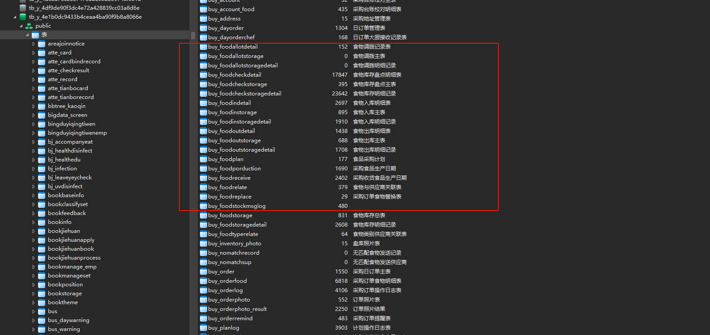

## 库和主要的表

## 参考项目 --code 

运行后的访问地址：

http://localhost:8085/tongbang/index.html?v=2.639
**之前没有+   tongbang   踩了很多的坑**

## 与pda 设备接入主要的实现思想

现有的系统的出入库最深层次到达批次

**也就是detail  需要在detail  下更深层的绑定**  

**这个表  需要订单     明细    以及rfid标签**

入库、出库以及盘库  都需要 

## 入库操作涉及到的表

1. buy_foodinstorage   食物入库主表
   
2. buy_foodinstoragedetail  食物入库明细记录
   

### 表之间的关联关系

一对多   通过 入库编号  `innum`  关联

### 部分可以复用的消息id

1. `handInstorage.instorage`  入库操作
2. 

## 出库操作涉及到的表

1. buy_foodoutstorage   食物出库主表
2. buy_foodoutstoragedetail  食物出库明细记录

## 盘库 操作涉及到的表

1. buy_foodcheckstorage   食物库存盘点主表
2. buy_foodcheckstoragedetail    食物库存明细记录

## 库存 系统

## 需要先解决密码登录的问题   finish

## 上面的绑定都需要在详情下新增一张表

表的主要存的  库存表  库存详情表  

