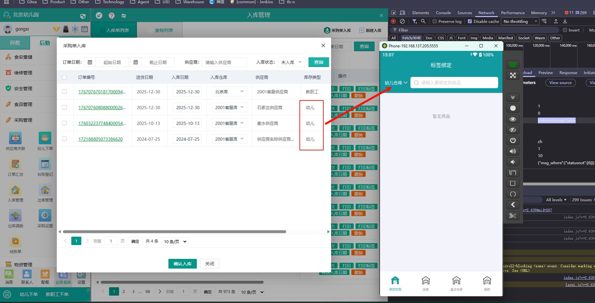
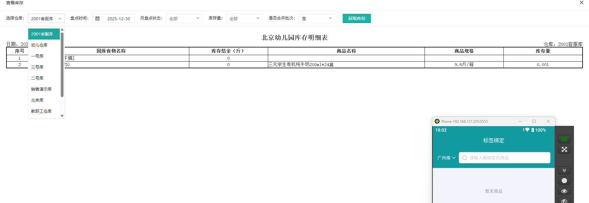

标签绑定

选择幼儿仓库   target 为1

表示入库订单列表中的所有的幼儿订单

具体的商品信息则是  上面订单中的所有商品列表  不管是否重复，没入库都可以在手持机上入库

手持机上对应的商品列表即为需要入幼儿仓库的商品

## 上面的是自己的想法   现在是不使用的

## 具体的实现方式

拿到的商品信息是从类似的这种效果

**点击具体的商品之后就是可以点击去绑定**

**商品的数量基本上决定标签的数量**

这里还是两个消息去获取入库的和库存的没有绑标签的

