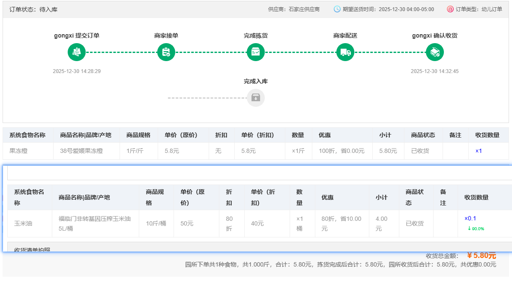
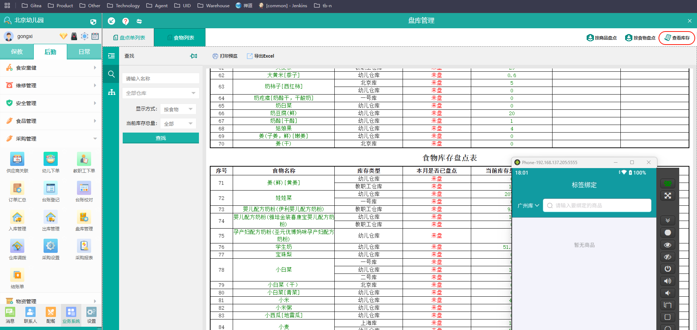
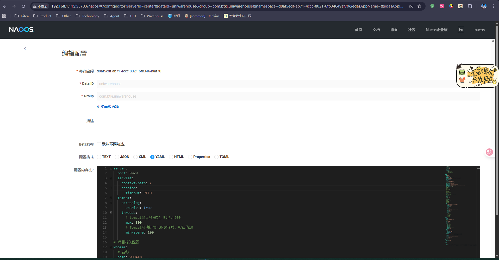

标签绑定

选择幼儿仓库   target 为1

表示入库订单列表中的所有的幼儿订单


具体的商品信息则是  上面订单中的所有商品列表  不管是否重复，没入库都可以在手持机上入库



手持机上对应的商品列表即为需要入幼儿仓库的商品

## 上面的是自己的想法   现在是不使用的


## 具体的实现方式




拿到的商品信息是从类似的这种效果


**点击具体的商品之后就是可以点击去绑定**

**商品的数量基本上决定标签的数量**


这里还是两个消息去获取入库的和库存的没有绑标签的


库存的finish了 一半       **入库完成后绑定标签的**   

总的库存  出入库都会往里面写数据  修改库存量 

标签如何修改库存量呢   ？？？？ 出库拿走了那些标签

数量减少 ？？？


## 新建的库存绑标签的表

buy_foodstoragedetailrfid

每个标签的计量单位    conversion   拿走多少标签  就是多少单位的   **总库存 -  出库的**

foodnum    rfidnum   whid   conversion    unit(库存单位)   state(状态)   

物品的编号   标签号     对应的规格    state

​												规格就是    conversion   unit 

扫到3个标签   那就对应   3 * conversion  unit


## 库存详情是如何判断还有的 ？？？？ 

oprnum   oprjin  不为0


## BUG

现有的食品的筛选有问题   匹配问题


## 新入库的绑定标签

**之前的是库存绑定标签的**


## 库存详情的绑定rfid 表


## dbutil中的批量操作

```
 /**
     * 插入批量语句
     *
     * @param dtype 数据库类型
     * @param did   数据库连接关键字
     * @param sqls  sql字符串多个分号分隔
     * @return 结果
     * code 没有代表成功  1 数据库类型不能为空,2:数据库连接失败 3:执行语句出错
     * 对象对应传入sql下表返回执行结果
     */
    public static JSONObject insertSql(String dtype, String did, String sqls) {}
```


## 获取未绑定的批次


## 现有的架构使用的数据库操作存在很严重的注入风险

然后登录使用的也是DBUtil

因此需要重新改变一下架构     使用MsgUtils去防止SQL注入


## 架构调整

配置是在公司内网的nacos里面修改配置，然后在开发的过程当中就会读取nacos中的配置去执行




## MsgUtils

msgUtils批量的执行


后端使用类似的消息数组去执行，如果不传递 msgwhere的话   底层会拼接为一条然后去执行相应的sql     

采取当前的DBUtil 也是支持的   但是还是有SQL注入的问题

## 编写消息的时候不在传递  w

如果园区登录的话传递   y    did 改为guid


## 分库分表时候的处理


明天需要研究一下这个配置   为后续的开发做准备。。。。

## 登录时候的前端排错处理   先做


