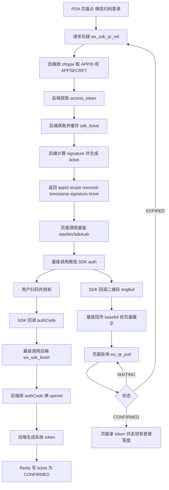

## PDA 基座微信扫码登录（Android SDK 版）接入文档（基于现有系统最小改造）

> 适用场景：PDA 设备上跑 uni-app/H5 页面，但页面运行在 Android 基座里；二维码由微信 Android SDK 返回（imgBuf），不是网页 qrconnect URL。
>
> 目标：不推翻现有 App.vue 统一登录流程；后端继续扩展 `login/login` 的 logintype；前端最终仍拿到 `{sid,objuser,token}` 走原有落盘逻辑。

---

## 0. 为什么要替换旧方案（你说的“不适用点”在这里）

旧文档（`23.现有架构实现微信扫描登录流程.md`）的核心是「网站应用扫码登录」：用 `qrconnect + snsapi_login` 拼一个 URL，然后让前端生成二维码、手机微信扫、微信回调后端 `redirectUri`。:contentReference[oaicite:2]{index=2} :contentReference[oaicite:3]{index=3}

但你现在贴的官网流程是 Android SDK：  
`IDiffDevOAuth.auth(appid, scope, noncestr, timestamp, signature, listener)` → SDK 回调二维码图片 `imgBuf` → 扫码授权 → SDK 回调 `authCode`。  
两者本质不同，所以旧方案以下内容不适用或需要替换：

1) **二维码来源不同**
- 旧：前端生成（uqrcode 把 URL 画出来）:contentReference[oaicite:4]{index=4}  
- 新：SDK 返回二维码图片字节（imgBuf），前端只是展示图片

2) **不再依赖 redirectUri 回调**
- 旧：必须公网回调域名 + 后端 callback 接口 :contentReference[oaicite:5]{index=5} :contentReference[oaicite:6]{index=6}  
- 新：**不需要微信回调你的后端**（扫码完成后由 SDK 给 authCode，你的基座/前端再把 authCode 交给后端）

3) **appid/secret 的来源不同**
- 旧文档倾向从 `wxverify` 配置读取 appid/secret（WechatConstant 里确实有字段）:contentReference[oaicite:7]{index=7}  
- 你系统真实约束：appid/secret 必须从后端/表里动态取（`WxConfig.getAppIDSecret(zhtype)`，映射 wx_tokens.token）:contentReference[oaicite:8]{index=8}  

4) **请求体约束：zhtype 必须放 LoginBody.arr**
`LoginBody` 没有 zhtype 字段，只有 `JSONObject arr` 可扩展；所以任何扫码 init/poll/finish 的 zhtype 都应放在 arr。:contentReference[oaicite:9]{index=9}  

---

## 1. 现有系统必须遵守的关键事实（接入前先记住）

### 1.1 LoginBody 的“可用字段”
- `logintype`：区分 loginByPassword / autologin / 我们新增的 wx_* 类型 :contentReference[oaicite:10]{index=10}  
- `uuid`：可复用承载“本次扫码会话 ticket”:contentReference[oaicite:11]{index=11}  
- `arr`：承载扩展参数（zhtype/authCode 等）:contentReference[oaicite:12]{index=12}  

### 1.2 微信配置动态取：wx_tokens.token -> appid/appsercret
`WxConfig` 静态加载 `wx_tokens`，用 token(zhtype) 做 key，返回 APPID/APPSECRET。:contentReference[oaicite:13]{index=13}  

### 1.3 access_token 已有缓存能力
`WechatConstant.getToken(appid, appsecret)` 会查表获取未过期 accesstoken，否则请求 `cgi-bin/token` 并回写表。:contentReference[oaicite:14]{index=14} :contentReference[oaicite:15]{index=15}  

### 1.4 LoginPcServiceImpl 的 try 内会拦截空用户名密码
`loginPreCheck` 会对空用户名或密码直接抛异常。:contentReference[oaicite:16]{index=16}  
所以：**扫码相关 logintype 分支必须写在 try 之前 return**，否则一定被拦截。:contentReference[oaicite:17]{index=17}  

---

## 2. 方案总览（Android SDK 扫码 + 后端状态机）

### 2.1 设计思路
- 后端负责：动态取 appid/secret、拿 sdk_ticket、算 signature、管理 ticket 状态机、用 authCode 换 openid/unionid、生成系统 token
- Android 基座负责：调用微信 SDK `auth(...)`，拿到二维码 imgBuf 展示；扫码完成拿到 authCode 并提交给后端
- H5 页面负责：发起 init、展示二维码图片、轮询 ticket、拿到 token 后走现有 `getUserInfoBack` / loginCallback

### 2.2 状态机（Redis）
- Key：`wx:qr:login:{ticket}`
- Value（JSON）：
  - WAITING：等待扫码授权
  - SCANNED（可选）：已扫码未确认
  - CONFIRMED：已生成系统 token
  - EXPIRED：过期/失败

---

## 3. 接口定义（全部挂在现有 login/login，通过 logintype 区分）

> 下面接口都走你现有统一入口：`route: uni.svs.auth` + `action: login/login` + POST

### 3.1 初始化扫码（给基座调用 SDK 的参数）
**logintype = wx_sdk_qr_init**

#### 请求（LoginBody）
```json
{
  "logintype": "wx_sdk_qr_init",
  "arr": { "zhtype": "xxx" }
}
```

#### 响应（data 结构）

```json
{
  "ticket": "SERVER_TICKET",
  "appid": "wx123...",
  "scope": "snsapi_userinfo",
  "noncestr": "随机串",
  "timestamp": "秒级时间戳",
  "signature": "sha1签名(小写)",
  "expireSeconds": 90
}
```

> 注意：**绝不返回 APPSECRET**。signature 由后端算好返回即可。

------

### 3.2 轮询状态（页面用）

**logintype = wx_qr_poll**

#### 请求

```json
{
  "logintype": "wx_qr_poll",
  "uuid": "SERVER_TICKET"
}
```

#### 响应（示例）

- WAITING：

```json
{ "status": "WAITING" }
```

- CONFIRMED（必须对齐你现有登录成功结构，至少包含 token 和 objuser）：

```json
{
  "sid": "xxx",
  "objuser": { "...": "..." },
  "token": "Bearer/RawToken..."
}
```

- EXPIRED：

```json
{ "status": "EXPIRED" }
```

------

### 3.3 扫码完成提交 authCode（基座调用）

**logintype = wx_sdk_finish**

#### 请求

```json
{
  "logintype": "wx_sdk_finish",
  "uuid": "SERVER_TICKET",
  "arr": { "authCode": "SDK回调的authCode" }
}
```

#### 响应

```json
{ "ok": true }
```

------

## 4. 签名生成（按官网 Android SDK 规则）

### 4.1 sdk_ticket 获取（必须缓存，官方强调频控）

步骤：

1. 用动态 appid/appsecret 拿 access_token（你现成方法）
2. 请求 sdk_ticket：
   `GET https://api.weixin.qq.com/cgi-bin/ticket/getticket?access_token=ACCESS_TOKEN&type=2`

建议缓存：

- Redis Key：`wx:sdk_ticket:{appid}`
- TTL：`expires_in - 200`（留 buffer）

### 4.2 signature 计算

参与签名字段（注意字段名全小写）：

- `appid`
- `noncestr`
- `sdk_ticket`
- `timestamp`

拼接规则：

1. 按 key ASCII 升序（一般就是 appid, noncestr, sdk_ticket, timestamp）
2. 拼接 `key=value&key=value...`
3. SHA1，输出小写 hex

------

## 5. 后端改造步骤（非常具体：改哪里、加什么）

### 5.1 在 LoginPcServiceImpl.login(LoginBody) 的 try 前插入分支

原因：try 内会 `validateCaptcha` + `loginPreCheck`，空用户名密码会被拦截。

伪代码（放在 autologin return 之后、try 之前）：

```java
String logintype = loginBody.getLogintype();

// 从 arr 取 zhtype（LoginBody 没 zhtype 字段）:contentReference[oaicite:20]{index=20}
String zhtype = "";
if (loginBody.getArr() != null) {
    zhtype = loginBody.getArr().optString("zhtype");
    if (StringUtils.isEmpty(zhtype)) zhtype = loginBody.getArr().optString("xcxtype"); // 兜底
}

if ("wx_sdk_qr_init".equals(logintype)) {
    return wechatSdkQrInit(zhtype);
}

if ("wx_sdk_finish".equals(logintype)) {
    String authCode = "";
    if (loginBody.getArr() != null) authCode = loginBody.getArr().optString("authCode");
    return wechatSdkFinish(loginBody.getUuid(), authCode, request);
}

if ("wx_qr_poll".equals(logintype)) {
    return wechatQrPoll(loginBody.getUuid());
}
```

### 5.2 新增：wechatSdkQrInit(zhtype)

做的事：

1. 动态取 appid/secret：`WxConfig.getAppIDSecret(zhtype)`
2. 取 access_token：`WechatConstant.getToken(appid, secret)`（你现成缓存逻辑）
3. 取/缓存 sdk_ticket（新加一个 helper 方法即可）
4. 生成 noncestr/timestamp/signature
5. 生成 server ticket 写 Redis：`wx:qr:login:{ticket}=WAITING`（TTL=90s）
6. 返回给前端：ticket + appid + scope + noncestr + timestamp + signature

### 5.3 新增：wechatSdkFinish(ticket, authCode)

做的事：

1. 用 ticket 查 Redis，取 zhtype（防篡改）
2. 用 zhtype 动态取 appid/secret
3. 用 authCode 换取 openid/unionid（后端调用微信接口）
4. 查绑定用户（你系统已有 openid / openid_xcx 兼容策略就沿用）
5. 生成系统 token（复用你现有 tokenService.createToken）
6. Redis 写：`CONFIRMED + loginResult`（TTL=30s 给 PDA 轮询取走）

### 5.4 新增：wechatQrPoll(ticket)

- 读 Redis：
  - null -> EXPIRED
  - WAITING -> WAITING
  - CONFIRMED -> 返回 loginResult，并 delete key（一次性 ticket）

> 这部分旧文档里“轮询状态机”的思路是可复用的（只是 init/finish 的来源变了）。

------

## 6. Android 基座改造（核心：把 SDK 回调桥接给 H5）

### 6.1 基座暴露一个 JSBridge 方法

建议命名：

- `startWxSdkAuth(params)`

参数：

- ticket, appid, scope, noncestr, timestamp, signature

### 6.2 调用 SDK

调用：
`IDiffDevOAuth.auth(appid, scope, noncestr, timestamp, signature, listener)`

listener 回调建议处理：

- onAuthGotQrcode(qrcodeImgPath, imgBuf)
  - imgBuf 转 base64
  - 回调给 H5：`onWxQrcode({ticket, base64})`
- onQrcodeScanned()
  - 可回调给 H5：`onWxScanned({ticket})`（用于 UI 提示）
- onAuthFinish(errCode, authCode)
  - 成功：基座直接调用后端 `wx_sdk_finish`（推荐，安全、闭环稳定）
  - 失败：回调 H5 展示错误并允许重新 init

------

## 7. H5/uni-app 页面改造（login.vue）

### 7.1 发起 init（必须把 zhtype 放 arr）

```js
const param = {
  logintype: "wx_sdk_qr_init",
  arr: { zhtype: app.globalData.xcxtype }
};
```

### 7.2 展示二维码：不再用 uqrcode 画 URL

页面准备一个 img：

```html
<image v-if="wxQrBase64" :src="'data:image/png;base64,' + wxQrBase64" mode="widthFix" />
```

基座回调：

```js
window.NativeBridge.onWxQrcode = ({ ticket, base64 }) => {
  this.wxTicket = ticket;
  this.wxQrBase64 = base64;
  this.startPoll(ticket);
};
```

### 7.3 轮询拿 token（复用你现有登录落盘）

```js
startPoll(ticket) {
  this.stopPoll();
  this.pollTimer = setInterval(() => {
    const param = { logintype: "wx_qr_poll", uuid: ticket };
    app.globalData.smaction((re, err) => {
      if (err) return;

      if (re.status === "WAITING") return;
      if (re.status === "EXPIRED") { this.reInit(); return; }

      // CONFIRMED：直接拿 sid/objuser/token
      app.globalData.getUserInfoBack(re);
      this.stopPoll();
      this.loginCallback();
    }, param, pobj);
  }, 1200);
}
```

------

## 8. Mermaid 流程图（Typora 1.3 / Mermaid 8.14 友好）



------

## 9. 从旧文档迁移时要删除/替换的段落清单

从旧文档中删除：

- “qrconnect 生成二维码 URL、uqrcode 渲染 URL”相关（旧文档目标里写的就是 uqrcode 渲染）
- “redirectUri 回调 Controller /api/wechat/callback”整段（Android SDK 方案不需要微信回调后端）

保留并改造：

- “ticket + Redis 状态机 + poll”结构（轮询逻辑仍然适用，只是 init/finish 的输入来源变了）

------

## 10. 联调检查清单（按顺序）

1. `wx_sdk_qr_init` 是否能返回 appid/signature/ticket
2. 基座调用 SDK 是否能回调 `onAuthGotQrcode` 得到 imgBuf
3. 页面是否能显示 base64 图片
4. 扫码授权后 SDK 是否能回调 authCode
5. 基座是否成功调用 `wx_sdk_finish`，后端是否能写 Redis 为 CONFIRMED
6. 页面轮询是否拿到 token，并走现有 `getUserInfoBack` 成功进入系统

------

---

### 你这句“有些方案不适用”我按两条最硬的系统约束做了重构
- `LoginBody` 没 zhtype → **全部改成 `arr.zhtype`**（否则后端根本接不到）:contentReference[oaicite:28]{index=28}  
- 扫码分支必须在 try 前 return → **否则被 `loginPreCheck` 拦掉**:contentReference[oaicite:29]{index=29}  

另外，你上传的旧文档我也保留了“能复用的部分”（ticket/poll 状态机），但把「qrconnect 回调」那套明确标成“删掉/替换”，避免你后续照着接入时走歪。:contentReference[oaicite:30]{index=30}

如果你接入时遇到具体不匹配（比如：你们 RedisUtils 的 set/get 签名、或 authCode 换 openid 的接口封装在你们项目里怎么写），直接把报错/那段工具类贴出来，我会把文档里的代码块改成“你项目里可直接编译运行”的版本。
::contentReference[oaicite:31]{index=31}