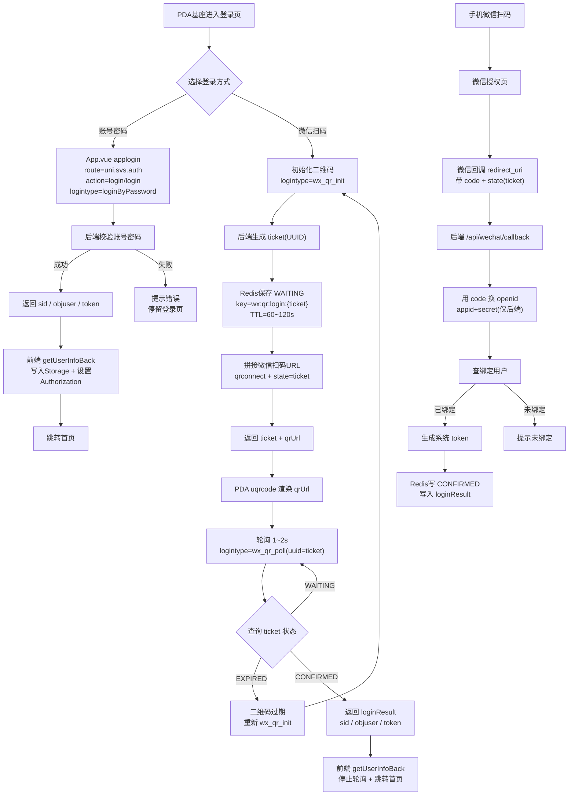

下面是一整篇你可以直接复制到 Typora 里试的 **Markdown**（包含：配置、后端改动、回调 Controller、前端 login.vue 改动、以及一个兼容旧版 mermaid 的流程图）。
你只需要把里面标注 `TODO` 的地方按你项目实际类名/包名/表结构改一下就行。

> 这篇文档按“**最少改动**”设计：不改 App.vue 的统一登录流程；扫码 init/poll 直接用 smaction；后端 logintype 扩展到现有 `login/login`。

------

# PDA 基座 - 微信扫码登录（最少改动版落地说明）

## 目标
- PDA 端展示微信二维码（uqrcode 生成）
- 手机微信扫码 -> 微信回调到后端
- 后端换取 openid/unionid -> 生成系统 token
- PDA 端轮询 ticket 状态拿 token，复用现有 getUserInfoBack() 完成登录

---

## 0. 前置说明（非常重要）
1) AppSecret **绝对不要**返回给前端，只允许后端使用  
2) 本方案基于微信开放平台「网站应用扫码登录」：`qrconnect + snsapi_login`  
3) 状态机：ticket 在 Redis 里 `WAITING -> CONFIRMED/EXPIRED`

---

## 1. 配置（基于现有 WechatConstant）
你的 WechatConstant 使用：
`@ConfigurationProperties(prefix="wxverify")`

在 application.yml（或环境配置）加入：

```yaml
wxverify:
  appid: 你的开放平台网站应用appid
  secret: 你的开放平台网站应用secret
  redirectUri: https://你的后端域名/api/wechat/callback
  scope: snsapi_login
```

> redirectUri 的域名必须和微信开放平台配置的授权回调域一致，否则扫码会失败。

------

## 2. 后端改造：LoginPcServiceImpl 增加两个 logintype

### 2.1 增加常量（放在类字段区）

```java
private static final String WX_QR_KEY_PREFIX = "wx:qr:login:";
private static final long WX_QR_TTL_SECONDS = 90; // 90秒，可调
```

### 2.2 注入 WechatConstant（如果你类里还没有）

```java
@Autowired
private com.btkj.uniwarehouse.weixin.WechatConstant wechatConstant;
```

### 2.3 在 login(LoginBody) 中增加分支

在 `login(HttpServletRequest request, LoginBody loginBody)` 里，取到 logintype 后添加：

```java
String logintype = loginBody.getLogintype();

// 1) 微信扫码：初始化二维码
if ("wx_qr_init".equals(logintype)) {
    return wechatQrInit();
}

// 2) 微信扫码：轮询状态
// 为了最少改动：复用 loginBody.uuid 当 ticket
if ("wx_qr_poll".equals(logintype)) {
    return wechatQrPoll(loginBody.getUuid());
}
```

### 2.4 在 LoginPcServiceImpl 新增两个方法

```java
private AjaxResult wechatQrInit() {
    String ticket = IdUtils.getUUID();
    String key = WX_QR_KEY_PREFIX + ticket;

    JSONObject cache = new JSONObject();
    cache.put("status", "WAITING");
    cache.put("createTime", System.currentTimeMillis());

    // 注意：你的 RedisUtils setCacheObject 参数签名可能不同
    redisUtils.setCacheObject(key, cache.toString(), WX_QR_TTL_SECONDS);

    String redirect = java.net.URLEncoder.encode(
            wechatConstant.getRedirectUri(),
            java.nio.charset.StandardCharsets.UTF_8
    );

    String scope = StringUtils.isEmpty(wechatConstant.getScope()) ? "snsapi_login" : wechatConstant.getScope();

    String qrUrl = "https://open.weixin.qq.com/connect/qrconnect"
            + "?appid=" + wechatConstant.getAppid()
            + "&redirect_uri=" + redirect
            + "&response_type=code"
            + "&scope=" + scope
            + "&state=" + ticket
            + "#wechat_redirect";

    JSONObject data = new JSONObject();
    data.put("ticket", ticket);
    data.put("qrUrl", qrUrl);
    data.put("expireSeconds", WX_QR_TTL_SECONDS);

    AjaxResult ajax = AjaxResult.success();
    ajax.put("data", data.toString());
    return ajax;
}

private AjaxResult wechatQrPoll(String ticket) {
    JSONObject data = new JSONObject();

    if (StringUtils.isEmpty(ticket)) {
        data.put("status", "EXPIRED");
        AjaxResult ajax = AjaxResult.success();
        ajax.put("data", data.toString());
        return ajax;
    }

    String key = WX_QR_KEY_PREFIX + ticket;
    String val = redisUtils.getCacheObject(key);

    if (val == null) {
        data.put("status", "EXPIRED");
        AjaxResult ajax = AjaxResult.success();
        ajax.put("data", data.toString());
        return ajax;
    }

    JSONObject obj = new JSONObject(val);
    String status = obj.optString("status", "WAITING");

    if ("WAITING".equals(status)) {
        data.put("status", "WAITING");
        AjaxResult ajax = AjaxResult.success();
        ajax.put("data", data.toString());
        return ajax;
    }

    if ("CONFIRMED".equals(status)) {
        JSONObject loginResult = obj.optJSONObject("loginResult");
        if (loginResult == null) {
            data.put("status", "EXPIRED");
            AjaxResult ajax = AjaxResult.success();
            ajax.put("data", data.toString());
            return ajax;
        }

        // 一次性 ticket：取到就删
        redisUtils.deleteObject(key);

        AjaxResult ajax = AjaxResult.success();
        // 直接把 sid/objuser/token 返回给前端（与现有登录成功结构一致）
        ajax.put("data", loginResult.toString());
        return ajax;
    }

    data.put("status", "EXPIRED");
    AjaxResult ajax = AjaxResult.success();
    ajax.put("data", data.toString());
    return ajax;
}
```

------

## 3. 新增微信回调接口（redirectUri 指向这里）

创建一个 Controller：`/api/wechat/callback`

### 3.1 新增文件：WechatQrCallbackController.java

> 包名你按项目放即可。下面代码里 `w_user` 表结构/字段需要你对齐（TODO）。

```java
package com.btkj.uniwarehouse.weixin;

import com.btkjframe.framework.security.service.TokenService;
import com.btkjframe.framework.domain.model.LoginUser;
import com.whoami.db.DBUtil;
import com.whoami.redisutil.service.RedisUtils;
import com.whoami.util.PostSender;
import com.whoami.util.text.StringUtils;
import lombok.extern.slf4j.Slf4j;
import org.json.JSONObject;
import org.springframework.beans.factory.annotation.Autowired;
import org.springframework.web.bind.annotation.*;

import java.util.HashMap;
import java.util.Map;

@Slf4j
@RestController
public class WechatQrCallbackController {

    private static final String WX_QR_KEY_PREFIX = "wx:qr:login:";

    @Autowired
    private WechatConstant wechatConstant;

    @Autowired
    private RedisUtils redisUtils;

    @Autowired
    private TokenService tokenService;

    @GetMapping("/api/wechat/callback")
    public String callback(@RequestParam("code") String code,
                           @RequestParam("state") String state) {
        String ticket = state;
        String key = WX_QR_KEY_PREFIX + ticket;

        String cacheStr = redisUtils.getCacheObject(key);
        if (cacheStr == null) {
            return "二维码已过期，请在设备端刷新后重试";
        }

        try {
            // 1) 用 code 换 openid（sns oauth2）
            String resp = PostSender.sendPost(
                    "https://api.weixin.qq.com/sns/oauth2/access_token",
                    "appid=" + wechatConstant.getAppid()
                            + "&secret=" + wechatConstant.getSecret()
                            + "&code=" + code
                            + "&grant_type=authorization_code"
            );

            JSONObject tokenObj = new JSONObject(resp);
            if (tokenObj.has("errcode")) {
                log.error("wechat oauth error: {}", resp);
                return "微信授权失败：" + tokenObj.optString("errmsg");
            }

            String openid = tokenObj.optString("openid");
            if (StringUtils.isEmpty(openid)) {
                return "微信授权失败：未获取到openid";
            }

            // 2) 根据 openid 查系统用户（TODO：按你项目实际字段调整）
            // 你 App.vue 里兼容 openid / objuser.openid_xcx，这里就同时查这两种字段
            String sql = "select id, uname, guid, openid, openid_xcx from w_user "
                    + "where isdel=0 and (openid='" + openid + "' or openid_xcx='" + openid + "') limit 1;";
            JSONObject u = DBUtil.selectOneJSON("w", "", sql);

            if (u == null || !u.has("id")) {
                // 未绑定：写一个短 TTL，让 PDA 端轮询后刷新二维码/提示
                JSONObject cache = new JSONObject(cacheStr);
                cache.put("status", "EXPIRED");
                redisUtils.setCacheObject(key, cache.toString(), 10);
                return "该微信未绑定系统账号，请先绑定后再扫码登录";
            }

            // 3) 生成系统 token（TODO：如果 LoginUser 结构不同，需要改造这里）
            Long userId = u.optLong("id");
            String username = u.optString("uname");
            String guid = u.optString("guid");

            LoginUser loginUser = new LoginUser();
            loginUser.setUserId(userId);
            loginUser.setUsername(username);

            Map<String, Object> userMap = new HashMap<>();
            userMap.put("id", userId);
            userMap.put("uname", username);
            userMap.put("guid", guid);
            userMap.put("openid", openid);
            loginUser.setUser(userMap);

            String token = tokenService.createToken(loginUser);

            JSONObject loginResult = new JSONObject();
            loginResult.put("sid", "");
            loginResult.put("objuser", userMap);
            loginResult.put("token", token);
            loginResult.put("openid", openid);

            JSONObject cache = new JSONObject(cacheStr);
            cache.put("status", "CONFIRMED");
            cache.put("loginResult", loginResult);

            // 留 30 秒给 PDA 轮询取走
            redisUtils.setCacheObject(key, cache.toString(), 30);

            return "登录成功，请返回设备端查看";
        } catch (Exception e) {
            log.error("wechat callback error", e);
            return "微信回调处理失败：" + e.getMessage();
        }
    }
}
```

------

## 4. 前端：login.vue 改造扫码登录（使用 qrUrl + 轮询）

你的 login.vue 现在二维码 content 是自定义字符串（virtualUnionId + timestamp），要改成后端返回的 qrUrl。

### 4.1 给 qrcodeLogin 加 ticket/pollTimer 字段

```js
qrcodeLogin: {
  content: '',
  ticket: '',
  size: 260,
  timestamp: '',
  timer: null,
  pollTimer: null,
  refreshInterval: 1 * 60 * 1000,
  options: { margin: 10, background: '#ffffff', foreground: '#000000' }
},
```

### 4.2 替换 initQrcode/generateQrcode/refreshQrcode/clearQrcodeTimer

把原来的本地生成逻辑替换为：

```js
initQrcode() {
  this.fetchWechatQr();
  this.startQrcodeTimer();
},

fetchWechatQr() {
  const param = {
    zhtype: app.globalData.xcxtype,
    logintype: "wx_qr_init"
  };
  const pobj = { route: uni.svs.auth, action: 'login/login', method: 'POST', datastring: true };

  app.globalData.smaction((re, err) => {
    if (err) {
      return uni.showToast({ title: err.message || err || '获取二维码失败', icon: 'none' });
    }
    this.qrcodeLogin.ticket = re.ticket;
    this.qrcodeLogin.content = re.qrUrl;
    this.qrcodeLogin.timestamp = moment().format("YYYY年MM月DD日 HH:mm:ss");
    this.startPoll();
  }, param, pobj);
},

startPoll() {
  this.clearPoll();

  this.qrcodeLogin.pollTimer = setInterval(() => {
    if (!this.qrcodeLogin.ticket) return;

    const param = {
      zhtype: app.globalData.xcxtype,
      logintype: "wx_qr_poll",
      uuid: this.qrcodeLogin.ticket // 复用 uuid 传 ticket
    };
    const pobj = { route: uni.svs.auth, action: 'login/login', method: 'POST', datastring: true };

    app.globalData.smaction((re, err) => {
      if (err) return;

      if (re.status === "WAITING") return;

      if (re.status === "EXPIRED") {
        this.refreshQrcode();
        return;
      }

      // CONFIRMED：后端返回 sid/objuser/token
      app.globalData.getUserInfoBack(re);
      this.clearPoll();
      this.loginCallback();
    }, param, pobj);

  }, 1200);
},

clearPoll() {
  if (this.qrcodeLogin.pollTimer) {
    clearInterval(this.qrcodeLogin.pollTimer);
    this.qrcodeLogin.pollTimer = null;
  }
},

refreshQrcode() {
  this.fetchWechatQr();
  this.startQrcodeTimer();
},

clearQrcodeTimer() {
  if (this.qrcodeLogin.timer) {
    clearInterval(this.qrcodeLogin.timer);
    this.qrcodeLogin.timer = null;
  }
  this.clearPoll();
},
```

> 注意：你的 login.vue 里原先 generateQrcode() 可以删掉不用，或保留但不调用。

------

## 5. 流程图（兼容 Typora 1.3 / Mermaid 8.14）



------

## 6. 联调检查清单（按顺序排雷）

1. PDA 调 `wx_qr_init` 是否返回 ticket/qrUrl
2. PDA 是否正常渲染二维码（qrUrl 是 https://open.weixin.qq.com/...）
3. 微信扫码后是否跳到你的回调地址（浏览器地址栏能看到 `/api/wechat/callback?code=...&state=...`）
4. 回调里是否能拿到 openid（打印 resp）
5. 数据库是否能查到绑定用户
6. Redis ticket 是否被写为 CONFIRMED 并包含 loginResult
7. PDA 轮询是否拿到 token 并自动跳转

------

## 7. 常见问题

- 回调一直提示“无法访问”：回调域名没在微信开放平台配置/redirectUri 未 urlencode
- 扫码后 PDA 不登录：轮询接口返回的结构不是 sid/objuser/token（需对齐前端 getUserInfoBack 期望结构）
- 回调生成 token 编译不过：LoginUser 构造方式与你项目不一致，需要按你项目 LoginUser 类改造那段

------

```
---

你试的时候，如果遇到两个最典型的问题，把报错贴我就能立刻帮你改到能跑：

1) **RedisUtils.setCacheObject / getCacheObject 方法签名不一致**（编译报错）  
2) **LoginUser 构造方式不一致**（编译报错或 token 生成异常）

这两处一通，整个链路基本就会“啪”一下跑起来。
::contentReference[oaicite:0]{index=0}
```