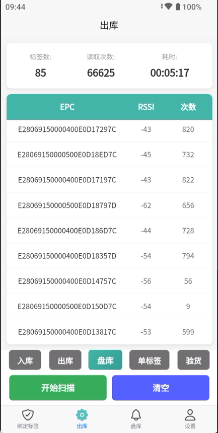

## 现有BUG

点击开始扫描之后，长时间不停止，在此场景下会出现点击停止会卡顿很久才会停止，读取次数一直递增

分析原因：

> **数据处理阻塞主线程**：`parseTagData` 方法在处理大量数据时，频繁的正则匹配、DOM更新和数组排序会阻塞UI线程
>
> **频繁的响应式更新**：每次 `updateTag` 都会触发 `updateTagList`，导致大量的列表重排序
>
> **停止扫描的数据还在处理**：即使调用了 `stopScan()`，缓冲区中的数据仍在继续处理


后续在停止之后拿到最后的列表，然后与物品批量关联，你可以增加相应的数据处理，后续的业务逻辑添加TODO

不能自动调用，场景是手动去确认关联的，你可以在开始扫描那一栏添加两个按钮，批量绑定和批量出库，对应场景选择的1245，也就是id为1，2，4，5，其中点击1的时候只有批量绑定，2的时候只有批量出库，4和5，两个按钮都有


场景：有86个标签，点击开始扫描，在连续扫了3分钟后会出现点击停止扫描，会出现失灵情况


### BUG修复

#### 代码留影 -->  /inventory/index.vue

```vue
<template>
	<view class="container">

		<!-- 统计信息 -->
		<view class="stats-container">
			<view class="stat-item">
				<text class="stat-label">标签数:</text>
				<text class="stat-value">{{ uniqueTagCount }}</text>
			</view>
			<view class="stat-item">
				<text class="stat-label">读取次数:</text>
				<text class="stat-value">{{ totalReadCount }}</text>
			</view>
			<view class="stat-item">
				<text class="stat-label">耗时:</text>
				<text class="stat-value">{{ formatTime(elapsedTime) }}</text>
			</view>
		</view>

		<!-- 表格 -->
		<view class="table-container">
			<view class="table">
				<!-- 表头 -->
				<view class="table-header">
					<view class="table-cell" style="flex: 2;">EPC</view>
					<!-- <view class="table-cell" style="flex: 1.5;">TID</view> -->
					<view class="table-cell" style="flex: 0.8;">RSSI</view>
					<view class="table-cell" style="flex: 0.6;">次数</view>
				</view>
				
				<!-- 表格内容 -->
				<scroll-view class="table-body" scroll-y="true">
					<view v-for="(tag, index) in tagList" :key="tag.epc" class="table-row">
						<view class="table-cell" style="flex: 2;">
							<text class="epc-text">{{ tag.epc }}</text>
						</view>
					<!-- 	<view class="table-cell" style="flex: 1.5;">
							<text class="cell-text">{{ tag.tid || '-' }}</text>
						</view> -->
						<view class="table-cell" style="flex: 0.8;">
							<text class="cell-text">{{ tag.rssi }}</text>
						</view>
						<view class="table-cell" style="flex: 0.6;">
							<text class="cell-text">{{ tag.count }}</text>
						</view>
					</view>
					
					<!-- 空状态 -->
					<view v-if="tagList.length === 0" class="empty-state">
						<text class="empty-text">{{ isScanning ? '正在扫描...' : '暂无数据' }}</text>
					</view>
				</scroll-view>
			</view>
		</view>

		<!-- 场景选择 -->
		<view class="scene-selector">
			<view class="scene-item"
				v-for="scene in sceneList" 
				:key="scene.id"
				:class="{ 'active': currentSceneId === scene.id }"
				@click="selectScene(scene.id)"
			>
				<text class="scene-name">{{ scene.name }}</text>
			</view>
		</view>
		
		<!-- 底部按钮 -->
		<view class="button-container">
			<button 
				class="btn btn-start" 
				:class="{ 'btn-active': isScanning }"
				@click="toggleScan"
				:disabled="isStopping"
			>
				{{ isStopping ? '停止中...' : (isScanning ? '停止' : '开始扫描') }}
			</button>
			
			
			<!-- 批量操作按钮 -->
			<view class="batch-button-container" v-if="showBatchButtons">
				<button 
					v-if="showBindButton"
					class="btn btn-batch btn-bind" 
					@click="batchBind"
					:disabled="isScanning || tagList.length === 0"
				>
					批量绑定
				</button>
				<button 
					v-if="showOutboundButton"
					class="btn btn-batch btn-outbound" 
					@click="batchOutbound"
					:disabled="isScanning || tagList.length === 0"
				>
					批量出库
				</button>
			</view>
			
			<button class="btn btn-clear" @click="clearData" :disabled="isScanning">清空</button>
		</view>
	</view>
</template>

<script>
import uhfManager from '@/common/uhfManager.js';
import uhfSceneConfig from '@/common/uhfSceneConfig.js';

export default {
	data() {
		return {
			sceneList: [],
			currentSceneId: 1,
			isScanning: false,
			isStopping: false,
			tagMap: {},
			tagList: [],
			elapsedTime: 0,
			timer: null,
			updateTimer: null,
			pendingUpdates: false,
			dataBuffer: []
		}
	},
	
	computed: {
		uniqueTagCount() {
			return Object.keys(this.tagMap).length;
		},
		
		// 读取次数 = 所有标签的count累加之和
		totalReadCount() {
			return Object.values(this.tagMap).reduce((sum, tag) => sum + tag.count, 0);
		},
		
		showBatchButtons() {
			return [1, 2, 4, 5].includes(this.currentSceneId);
		},
		
		showBindButton() {
			return [1, 4, 5].includes(this.currentSceneId);
		},
		
		showOutboundButton() {
			return [2, 4, 5].includes(this.currentSceneId);
		}
	},
	
	onLoad() {
		console.log('页面加载');
		this.loadScenes();
	},
	
	onShow() {
		console.log('页面显示');
		this.initUHF();
	},
	
	onHide() {
		console.log('页面隐藏');
		this.stopScan();
		this.uninitUHF();
	},
	
	onUnload() {
		console.log('页面卸载');
		this.stopScan();
		this.uninitUHF();
	},
	
	methods: {
		loadScenes() {
			this.sceneList = uhfSceneConfig.getAllScenes();
		},
		
		selectScene(sceneId) {
			if (this.isScanning) {
				uni.showToast({
					title: '请先停止扫描',
					icon: 'none'
				});
				return;
			}
			
			this.currentSceneId = sceneId;
			
			this.uninitUHF();
			setTimeout(() => {
				this.initUHF();
			}, 300);
		},
		
		initUHF() {
			const config = uhfSceneConfig.getConfig(this.currentSceneId);
			const result = uhfManager.init(config);
			
			if (result) {
				console.log('UHF初始化成功');
				
				uhfManager.setOnTagDataCallback((uhfdata) => {
					if (this.isScanning && !this.isStopping) {
						this.parseTagData(uhfdata);
					}
				});
				
				uhfManager.setOnKeyScanCallback((isKeyDown) => {
					if (isKeyDown) {
						this.startScan();
					} else {
						this.stopScan();
					}
				});
			} else {
				console.error('UHF初始化失败');
				uni.showToast({
					title: '初始化失败',
					icon: 'error',
					duration: 2000
				});
			}
		},
		
		uninitUHF() {
			uhfManager.uninit();
			this.stopTimer();
			this.stopUpdateTimer();
		},
		
		toggleScan() {
			if (this.isScanning) {
				this.stopScan();
			} else {
				this.startScan();
			}
		},
		
		startScan() {
			if (this.isScanning) return;
			
			const result = uhfManager.startScan();
			if (result) {
				this.isScanning = true;
				this.isStopping = false;
				this.dataBuffer = [];
				this.startTimer();
				this.startUpdateTimer();
				console.log('开始盘点');
				
				uni.showToast({
					title: '开始扫描',
					icon: 'none',
					duration: 1000
				});
			} else {
				console.error('启动盘点失败');
				uni.showToast({
					title: '启动失败',
					icon: 'error'
				});
			}
		},
		
		stopScan() {
			if (!this.isScanning || this.isStopping) return;
			
			this.isStopping = true;
			console.log('准备停止扫描');
			
			// 先停止接收新数据
			const result = uhfManager.stopScan();
			
			if (result) {
				// 立即停止定时器,防止新数据进入
				this.stopTimer();
				this.stopUpdateTimer();
				
				// 异步处理剩余数据和UI更新,避免阻塞按钮响应
				setTimeout(() => {
					// 处理缓冲区中剩余的数据
					if (this.dataBuffer.length > 0) {
						this.processBatchData();
					}
					
					// 最后一次更新UI(不排序,直接转换)
					this.updateTagListFast();
					
					this.isScanning = false;
					this.isStopping = false;
					
					console.log('停止盘点');
					uni.showToast({
						title: '停止扫描',
						icon: 'none',
						duration: 1000
					});
				}, 0);
			} else {
				this.isStopping = false;
			}
		},
		
		startTimer() {
			this.elapsedTime = 0;
			this.timer = setInterval(() => {
				this.elapsedTime++;
			}, 1000);
		},
		
		stopTimer() {
			if (this.timer) {
				clearInterval(this.timer);
				this.timer = null;
			}
		},
		
		/**
		 * 启动UI更新定时器
		 * 使用节流机制,每300ms更新一次UI
		 */
		startUpdateTimer() {
			this.stopUpdateTimer();
			this.updateTimer = setInterval(() => {
				if (this.pendingUpdates) {
					this.processBatchData();
					this.updateTagListFast();
					this.pendingUpdates = false;
				}
			}, 300);
		},
		
		stopUpdateTimer() {
			if (this.updateTimer) {
				clearInterval(this.updateTimer);
				this.updateTimer = null;
			}
		},
		
		formatTime(seconds) {
			const hours = Math.floor(seconds / 3600);
			const minutes = Math.floor((seconds % 3600) / 60);
			const secs = seconds % 60;
			
			return `${String(hours).padStart(2, '0')}:${String(minutes).padStart(2, '0')}:${String(secs).padStart(2, '0')}`;
		},
		
		/**
		 * 解析标签数据 - 优化版本
		 * 数据先放入缓冲区,批量处理
		 */
		parseTagData(uhfdata) {
			if (!uhfdata || this.isStopping) return;
			
			const tagPattern = /\[(.*?)\]/g;
			let match;
			
			while ((match = tagPattern.exec(uhfdata)) !== null) {
				const tagData = match[1].split(',');
				
				if (tagData.length >= 4) {
					this.dataBuffer.push({
						epc: tagData[0].trim(),
						tid: tagData[1].trim(),
						rssi: tagData[2].trim(),
						freq: tagData[3].trim()
					});
					
					this.pendingUpdates = true;
				}
			}
		},
		
		/**
		 * 批量处理缓冲区数据
		 * 减少响应式更新次数
		 */
		processBatchData() {
			if (this.dataBuffer.length === 0) return;
			
			const buffer = this.dataBuffer.splice(0);
			
			buffer.forEach(tag => {
				if (this.tagMap[tag.epc]) {
					// 已存在,直接更新属性
					this.tagMap[tag.epc].count++;
					this.tagMap[tag.epc].rssi = tag.rssi;
					this.tagMap[tag.epc].freq = tag.freq;
					this.tagMap[tag.epc].timestamp = Date.now();
				} else {
					// 新标签
					this.$set(this.tagMap, tag.epc, {
						epc: tag.epc,
						tid: tag.tid,
						rssi: tag.rssi,
						freq: tag.freq,
						count: 1,
						timestamp: Date.now()
					});
				}
			});
		},
		
		/**
		 * 快速更新标签列表 - 取消排序
		 * 直接将tagMap转为数组,按插入顺序显示
		 */
		updateTagListFast() {
			// 直接转换为数组,不进行任何排序
			this.tagList = Object.values(this.tagMap);
		},
		
		clearData() {
			if (this.isScanning) {
				uni.showToast({
					title: '请先停止扫描',
					icon: 'none'
				});
				return;
			}
			
			uni.showModal({
				title: '确认',
				content: '确定要清空所有数据吗?',
				success: (res) => {
					if (res.confirm) {
						this.tagMap = {};
						this.tagList = [];
						this.elapsedTime = 0;
						this.dataBuffer = [];
						
						uni.showToast({
							title: '已清空',
							icon: 'success'
						});
					}
				}
			});
		},
		
		/**
		 * 批量绑定操作
		 */
		batchBind() {
			if (this.tagList.length === 0) {
				uni.showToast({
					title: '暂无标签数据',
					icon: 'none'
				});
				return;
			}
			
			uni.showModal({
				title: '批量绑定',
				content: `确定要绑定 ${this.tagList.length} 个标签吗?`,
				success: (res) => {
					if (res.confirm) {
						this.performBatchBind();
					}
				}
			});
		},
		
		performBatchBind() {
			const tagData = this.tagList.map(tag => ({
				epc: tag.epc,
				tid: tag.tid,
				rssi: tag.rssi,
				freq: tag.freq,
				count: tag.count
			}));
			
			console.log('批量绑定数据:', tagData);
			
			// TODO: 调用后端API
			
			uni.showToast({
				title: '批量绑定功能待实现',
				icon: 'none',
				duration: 2000
			});
		},
		
		/**
		 * 批量出库操作
		 */
		batchOutbound() {
			if (this.tagList.length === 0) {
				uni.showToast({
					title: '暂无标签数据',
					icon: 'none'
				});
				return;
			}
			
			uni.showModal({
				title: '批量出库',
				content: `确定要出库 ${this.tagList.length} 个标签吗?`,
				success: (res) => {
					if (res.confirm) {
						this.performBatchOutbound();
					}
				}
			});
		},
		
		performBatchOutbound() {
			const tagData = this.tagList.map(tag => ({
				epc: tag.epc,
				tid: tag.tid,
				rssi: tag.rssi,
				freq: tag.freq,
				count: tag.count
			}));
			
			console.log('批量出库数据:', tagData);
			
			// TODO: 调用后端API
			
			uni.showToast({
				title: '批量出库功能待实现',
				icon: 'none',
				duration: 2000
			});
		},
		
		/**
		 * 直接清空数据(不弹确认框)
		 */
		clearDataDirectly() {
			this.tagMap = {};
			this.tagList = [];
			this.elapsedTime = 0;
			this.dataBuffer = [];
		}
	}
}
</script>

<style scoped>
.container {
	display: flex;
	flex-direction: column;
	height: 100vh;
	background-color: #f5f5f5;
}

.scene-selector {
	display: flex;
	background-color: #ffffff;
	overflow-x: auto;
	justify-content: space-evenly;
	white-space: nowrap;
}

.scene-item {
	flex-shrink: 0;
	padding: 10rpx 30rpx;
	background: #707070;;
	border-radius: 12rpx;
	transition: all 0.3s;
}

.scene-item.active {
	background: linear-gradient(135deg, #4dc3a6 0%, #3ba891 100%);
	transform: scale(1.05);
}

.scene-name {
	font-size: 28rpx;
	font-weight: bold;
	color: #ffffff;
}

.stats-container {
	display: flex;
	justify-content: space-around;
	padding: 30rpx 20rpx;
	background-color: #ffffff;
	margin: 20rpx;
	border-radius: 16rpx;
	box-shadow: 0 4rpx 12rpx rgba(0, 0, 0, 0.08);
}

.stat-item {
	display: flex;
	flex-direction: column;
	align-items: center;
}

.stat-label {
	font-size: 24rpx;
	color: #999999;
	margin-bottom: 8rpx;
}

.stat-value {
	font-size: 36rpx;
	font-weight: bold;
	color: #333333;
}

.table-container {
	flex: 1;
	margin: 0 20rpx 20rpx;
	background-color: #ffffff;
	border-radius: 16rpx;
	overflow: hidden;
	box-shadow: 0 4rpx 12rpx rgba(0, 0, 0, 0.08);
}

.table {
	display: flex;
	flex-direction: column;
	height: 100%;
	text-align: center;
}

.table-header {
	display: flex;
	background: #4dc3a6;
	padding: 24rpx 20rpx;
	border-bottom: 2rpx solid #e0e0e0;
}

.table-header .table-cell {
	color: #ffffff;
	font-size: 28rpx;
	font-weight: bold;
}

.table-body {
	flex: 1;
	overflow-y: auto;
}

.table-row {
	display: flex;
	padding: 24rpx 20rpx;
	border-bottom: 1rpx solid #f0f0f0;
	transition: background-color 0.2s;
}

.table-row:active {
	background-color: #f8f8f8;
}

.table-cell {
	display: flex;
	flex-direction: column;
	justify-content: center;
	padding: 0 10rpx;
	word-break: break-all;
}

.epc-text {
	font-size: 26rpx;
	color: #333333;
	font-weight: 500;
}

.cell-text {
	font-size: 26rpx;
	color: #666666;
	text-align: center;
}

.empty-state {
	display: flex;
	justify-content: center;
	align-items: center;
	padding: 100rpx 0;
}

.empty-text {
	font-size: 28rpx;
	color: #999999;
}

.button-container {
	display: flex;
	padding: 20rpx;
	background-color: #ffffff;
	box-shadow: 0 -4rpx 12rpx rgba(0, 0, 0, 0.08);
}

.btn {
	flex: 1;
	height: 88rpx;
	line-height: 88rpx;
	margin: 0 10rpx;
	border-radius: 12rpx;
	font-size: 30rpx;
	font-weight: bold;
	border: none;
	transition: all 0.3s;
}

.btn-start {
	background: #3fbf5d;
	color: #ffffff;
}

.btn-start.btn-active {
	background: #ea3c2c;
}

.btn-clear {
	background-color: #5555ff;
	color: #ffffff;
}

.btn:active {
	opacity: 0.8;
	transform: scale(0.98);
}

.btn:disabled {
	opacity: 0.6;
}

.batch-button-container {
	display: flex;
	padding: 0 ;
	gap: 20rpx;
}

.btn-batch {
	flex: 1;
	height: 88rpx;
	line-height: 88rpx;
	border-radius: 12rpx;
	font-size: 30rpx;
	font-weight: bold;
	border: none;
	transition: all 0.3s;
}

.btn-bind {
	background: #49d1b4;
	color: #ffffff;
}

.btn-outbound {
	background: #f5576c;
	color: #ffffff;
}

.btn-batch:active {
	opacity: 0.8;
	transform: scale(0.98);
}

.btn-batch:disabled {
	opacity: 0.6;
	background: #cccccc;
}
</style>
```

#### 效果图


**记录点击停止，是否立即停止！！**



基本上是即点即停的，这次优化还不错

今天就摸鱼度过吧！！！


# 批量操作

后续也许会用到的，具体业务需求

## 方案一:使用临时表 + JOIN更新(推荐)

```sql
-- 1. 入库时批量绑定
WITH tag_data AS (
  SELECT unnest(ARRAY['E28069150000400E0D15417C', 'E28069150000500E0D15E97C', ...]) AS epc
)
UPDATE items 
SET bind_status = 1, 
    updated_at = NOW()
FROM tag_data
WHERE items.epc = tag_data.epc;

-- 2. 出库时批量解绑
WITH tag_data AS (
  SELECT unnest(ARRAY['E28069150000400E0D15417C', ...]) AS epc
)
UPDATE items 
SET bind_status = 0, 
    updated_at = NOW()
FROM tag_data
WHERE items.epc = tag_data.epc;
```

**优点:**

- 性能最优,一条SQL完成
- 支持批量操作
- 事务安全

------

## 方案二:使用ANY操作符

```sql
-- 1. 入库批量绑定
UPDATE items 
SET bind_status = 1, 
    updated_at = NOW()
WHERE epc = ANY(ARRAY['E28069150000400E0D15417C', 'E28069150000500E0D15E97C', ...]);

-- 2. 出库批量解绑
UPDATE items 
SET bind_status = 0, 
    updated_at = NOW()
WHERE epc = ANY(ARRAY['E28069150000400E0D15417C', ...]);
```

**优点:**

- 语法简洁
- 性能好
- 易于理解

------

## 方案三:使用事务 + 批处理

```javascript
// Node.js示例
async function bindTags(tagList) {
  const client = await pool.connect();
  try {
    await client.query('BEGIN');
    
    // 方式1: 单条UPDATE
    for (const tag of tagList) {
      await client.query(
        'UPDATE items SET bind_status = 1 WHERE epc = $1',
        [tag.epc]
      );
    }
    
    // 方式2: 批量UPDATE(推荐)
    const epcs = tagList.map(t => t.epc);
    await client.query(
      'UPDATE items SET bind_status = 1 WHERE epc = ANY($1)',
      [epcs]
    );
    
    await client.query('COMMIT');
  } catch (e) {
    await client.query('ROLLBACK');
    throw e;
  } finally {
    client.release();
  }
}

async function unbindTags(epcList) {
  await pool.query(
    'UPDATE items SET bind_status = 0 WHERE epc = ANY($1)',
    [epcList]
  );
}
```

------

## 方案四:使用UPSERT(如需插入新记录)

```sql
-- 如果物品可能不存在,需要插入
INSERT INTO items (epc, bind_status, pid, created_at)
SELECT 
  unnest(ARRAY['E28069150000400E0D15417C', ...]) AS epc,
  1 AS bind_status,
  unnest(ARRAY[101, 102, ...]) AS pid,
  NOW() AS created_at
ON CONFLICT (epc) 
DO UPDATE SET 
  bind_status = 1,
  updated_at = NOW();
```

------

## 方案五:记录绑定历史表

```sql
-- 创建绑定历史表
CREATE TABLE tag_bind_history (
  id SERIAL PRIMARY KEY,
  epc VARCHAR(50),
  pid INTEGER,
  bind_status SMALLINT,
  operated_at TIMESTAMP DEFAULT NOW()
);

-- 入库时记录
INSERT INTO tag_bind_history (epc, pid, bind_status)
SELECT epc, pid, 1
FROM unnest(
  ARRAY['E28069150000400E0D15417C', ...],
  ARRAY[101, 102, ...]
) AS t(epc, pid);

-- 同时更新主表
UPDATE items SET bind_status = 1 
WHERE epc = ANY(ARRAY['E28069150000400E0D15417C', ...]);
```

**优点:**

- 可追溯历史
- 便于审计
- 支持数据分析

------

## 推荐实现

**如果只需更新绑定状态:** 使用方案一或方案二

**如果需要创建新记录:** 使用方案四

**如果需要历史追溯:** 使用方案五

**性能对比:**

1. 方案一/二 > 方案三(批量) > 方案三(循环)
2. 建议在epc字段上创建索引: `CREATE INDEX idx_items_epc ON items(epc);`