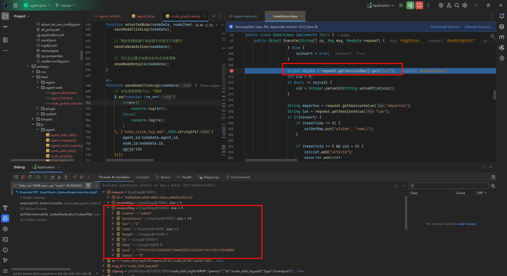
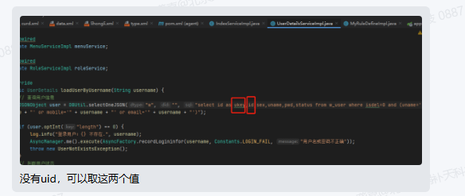

## 获取登录用户的信息

在某些场景下需要记录用户的操作日志

因此需要去拿用户的一些信息  比如id


而架构里面获取用户的信息主要通过两种方式

### 消息中使用{uid}

也就是在xml中使用下面的字段

```xml
<p key="oprid" format="int" default="{uid}"/>
```


需要注意的问题是这个oprid该如何给值？？？？？

这个oprid给空值就行了，在后续的执行过程中，会遇到下面这种情况，存入过程中，发现uid是没有的



后面询问李总之后才发现了端倪



最终在将原本的uid替换为ukey之后，成功获取到了当前登录用户的Id


### 后端使用工具类

SecurityUtils.getAttribute("uid")

架构文档中没有该工具类，，，，，

系统中有，但是不熟悉