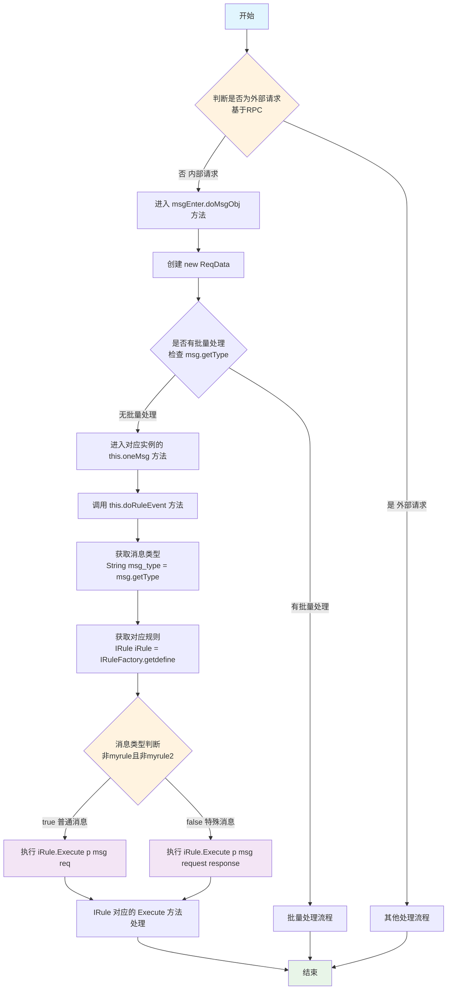

说明：这是在上一日咨询完总监疑问后去了解和熟悉的

## system.js

### 源码

通过查看源码得知了  `$.msgwhere(obj1,obj2)`   的封装

```js
 $.msgwhere = function (obj1, obj2) {
        var obj = {};
        if (obj1) {
            obj = $.extend(obj, obj1);
        }
        if (obj2) {
            obj = $.extend(obj, obj2);
        }
        return JSON.stringify({
            msg_where: obj
        })
    };
```

就解惑了为什么传递两个对象，但是后台就收到一个的原因了   `ZY.疑问与解惑.md` 中的第二个问题了

### 新的问题、原因分析和注意事项

查看源码得知传递两个对象会被合并为一个，此时如果两个对象中有字段是一样的例如：
obj1   {categroy_name : ["12"], id:[] }    obj2 {id: [3]}

这种情况下通过调试得知  合并的过程会直接出现两种情况

1. 一个有值(包含空)  一个无值(null 或者 undefined)   同名的字段会采用有值的那个   
2. 都有值  会采取最后一个obj 的字段(也就是后者会覆盖前者)

因此：**两个对象尽可能不要有重复的字段**

当有多个obj 传递的时候    xml 对应的消息体的   消息内容 需要使用16%分割 后添加  #？#

如果两个obj    对应的v  = "#0#16%#1#"

### 优缺点


#### 1. 空字符串会被保留
```javascript
var obj1 = {name: "张三", desc: "描述"};
var obj2 = {name: "", desc: ""};
var result = $.msgwhere(obj1, obj2);
// 结果: {"msg_where":{"name":"","desc":""}}
// 可能期望: {"msg_where":{"name":"张三","desc":"描述"}}
```


#### 2. **缺乏灵活性**
- 无法自定义合并策略（如只合并非空值、深度合并等）
- 无法处理复杂的数据类型合并
- 不能选择性地合并特定属性


#### 3. **性能问题**
- 每次都创建新的空对象
- 无条件执行两次 `$.extend` 操作
- 对于大型对象会造成不必要的性能开销

#### 4. **缺乏验证机制**
- 不会验证对象属性的有效性
- 不会处理循环引用
- 不会过滤无效的属性值

### 建议的改进方案(忽略   询问ai )

```javascript
// 改进版本 - 只合并有值的属性
$.msgwhere = function (obj1, obj2) {
    var obj = {};
    
    // 合并obj1中有效的属性
    if (obj1) {
        for (var key in obj1) {
            if (obj1.hasOwnProperty(key) && obj1[key] !== null && obj1[key] !== undefined && obj1[key] !== '') {
                obj[key] = obj1[key];
            }
        }
    }
    
    // 合并obj2中有效的属性（会覆盖obj1中的同名属性）
    if (obj2) {
        for (var key in obj2) {
            if (obj2.hasOwnProperty(key) && obj2[key] !== null && obj2[key] !== undefined && obj2[key] !== '') {
                obj[key] = obj2[key];
            }
        }
    }
    
    return JSON.stringify({
        msg_where: obj
    });
};
```


这样可以避免将无效值传递给后端，提高系统的健壮性。


## MsgUtils

[whoami3.0文档](https://apifox.com/apidoc/shared/98badc4f-73a4-4f9c-ac97-0248ed8f5d2f/doc-5635611)

除了前端支持调用消息外  **后端同样也支持，但是需要用到MsgUtils中的sm** 好处就是不在java中拼接sql  减少sql注入的风险


现在使用的是这套框架  不在使用之前的sql语句拼接，也就是说尽量不使用  dbutil的方法(因为需要sql拼接  而不是预编译)


接下来去看前端请求的入口  前面也谈到了 `/Enter`   和  `/LayEnter`

这里面与数据库是如何交互的

通过DEBUG  终于逐步调通了   知道了项目是如何执行，然后为什么都是使用静态方法了

### Enter流程

#### 粗解读(混乱)

根据rpc来判断是否是外部请求  

不是  进入到 ---> msgEnter.doMsgObj()方法内   new ReqData()   

没有批量处理(没有对应的 msg.getType() )   --->   对应实例  this.oneMsg() 方法内

this.doRuleEvent()   方法

通过获取消息类型msg_type String msg_type = msg.getType()

得到的消息类型  --->  获取相应的规则 IRule iRule = IRuleFactory.getdefine(msg_type) 

再通过下面的三元运算符判断
`!msg_type.equals("myrule") && !msg_type.equals("myrule2") ? iRule.Execute(p, msg, req) : iRule.Execute(p, msg, request, response);` 

不为myrule 且不为myrule2  执行Execute(p,msg,req)  也就是除了myrule和myrule2这两种消息类型  其他消息类型的都执行这个方法


IRule  对应的 Execute方法


#### 细解读



##### 内部请求处理流程

**步骤1**: 根据RPC判断请求类型

- 如果是外部请求 → 走其他处理流程
- 如果是内部请求 → 继续下一步

 **步骤2**: 进入消息处理

 ```
 msgEnter.doMsgObj() 方法
 ├── new ReqData() // 创建请求数据对象
 └── 检查是否有批量处理
 ```

 **步骤3**: 单消息处理分支

```
 this.oneMsg() 方法
 └── this.doRuleEvent() 方法
```

 **步骤4**: 消息类型处理

 ```java
 String msg_type = msg.getType();  // 获取消息类型
 IRule iRule = IRuleFactory.getdefine(msg_type);  // 获取对应规则
 ```

 **步骤5**: 执行方法选择

 ```java
 // 三元运算符判断
 !msg_type.equals("myrule") && !msg_type.equals("myrule2") 
     ? iRule.Execute(p, msg, req)                    // 普通消息类型
     : iRule.Execute(p, msg, request, response);     // 特殊消息类型
 ```

##### 分支说明

 **普通消息类型处理**:

 - 消息类型 ≠ `myrule` 且 ≠ `myrule2`
 - 执行: `iRule.Execute(p, msg, req)`
 - 包含: 除myrule和myrule2外的所有消息类型

 **特殊消息类型处理**:

 - 消息类型 = `myrule` 或 = `myrule2`
 - 执行: `iRule.Execute(p, msg, request, response)`
 - 特点: 多传入response参数


### 新的疑问

MsgUtils.sm模拟前端发送格式，使用方法同前端发消息一样   那该如何查数据呢？

没有参考

理解可能是这样：前端调用了别的接口  不是以消息体形式请求 而是像原始的请求那样请求接口，获取到的参数

在后端不用sql直接拼接   而是类似前端消息体请求那样  通过sm发送消息  再到xml中那样sql吗？


如果担心sql注入  又使用了原始的创建接口  为什么不直接使用mybatis去实现交互呢？哪怕要进行 权限认证也可以在

service层先判断


## controller 如何请求

这里例举  请求http://localhost:9999/create/add

主要看前端如何编写

```js
$.smaction(function (re, err) {
                if (err) {
                    layer.msg(err);
                    reject(err)
                } else {
                    $("#systemNo").val(re.systemCode)
                    resolve(re)
                }
            },
           field,
           {
                route: "card",  
                action: "create",
                datastring: true
            }
           }
```

route  --->     对应controller里面的  RequestMapping的内容(去除 ‘/’)

action  --->     对应controller里面的   (Post/Get)Mappingd的内容(去除'/')

### $.smaction源码

```js
/**
     * 请求controller的方法
     * @param {Object} cb 调用结束后的回调
     * @param {Object} param 请求的参数 json对象格式
     * @param {Object} pobj 必填，包含route(路由，既微服务名称)、action(controller路径)，其他key自定。 例如：{route:'bzn-xcx-tbpt', action: 'yey/list'}
     */
    $.smaction = $.fn.smaction = function(cb, param, pobj, timeout){
        if (typeof cb == 'object') {
            var arrtemp = cb;
            cb = param;
            param = arrtemp;
        }
        if(!pobj || !pobj.action){
            return cb(null, '路由不能为空');
        }
        var url = $.geturl(pobj.route, pobj.action);
        var ajaxobj = {
            type: pobj.method || "post",
            url: url,
            // dataType: "json",
            contentType: "application/json",
            //请求数据
            data: pobj.datastring ? JSON.stringify(param) : param,
            beforeSend: function (request) {
                request.setRequestHeader("Authorization", $.getAuthorization());
            },
            success: function (obj) {
                if (obj) {
                    try {
                        if (!obj.code) {//兼容老版本
                            obj = JSON.parse(obj);
                        } else {
                            obj.data = JSON.parse(obj.data);
                        }
                        // $.decodeRN(obj, pobj && pobj.escape);
                        // $.decodeObject(obj);
                    } catch (e) {
                        console.log(e);
                        console.log(obj);
                    }
                    //新版返回
                    if (obj.code) {
                        if (obj.code === 200) {
                            return cb(obj.data, null, obj.data);
                        } else {
                            console.log(objp.arr + "   " + obj.msg);
                            return cb(null, obj.msg);
                        }
                    }
                    //老版返回
                    if ($.isArray(obj)) {
                        cb(obj, null);
                    } else if (typeof obj == "object") {
                        if (obj.error && obj.error === "nologin") {
                            if (!window.notloginalert) {
                                window.notloginalert = true;
                                alert("登录已过期，请重新登录！");
                            }
                            top.location.href = location.protocol + "//" + location.host;
                        } else {
                            if (obj.error) {
                                try {
                                    obj.error = JSON.parse(obj.error);
                                } catch (e) {
                                    // TODO: handle exception
                                }
                                console.log(objp.arr + "   " + obj.error);
                            }
                            cb(obj.re || obj, obj.error, obj);
                        }
                    } else {
                        cb(obj);
                    }
                } else {
                    cb(null, "结果为空");
                }
            },
            error: function (XMLHttpRequest, textStatus, errorThrown) {
                console.log("status:" + XMLHttpRequest.status + "readyState:" + XMLHttpRequest.readyState + "textStatus:" + textStatus);
                if (XMLHttpRequest.status != 0) //未发送的不提示
                    cb(null, "ajax error");
            },
            complete: function (XMLHttpRequest, status) { //请求完成后最终执行参数
                if (status == 'timeout') {
                    //alert('请求超时，请稍后再试！');
                }
            },
            async: true
        };
        if (pobj)
            ajaxobj = $.extend(ajaxobj, pobj);
        if (timeout)
            ajaxobj = $.extend(ajaxobj, {timeout: timeout});
        $.ajax(ajaxobj);
    },
```

后端对应的：


### 实践

首先，编写好controller  ---> interface ---> impl

随即去xml文件里面设置相应的消息体

然后使用postman去模拟前端请求清口

#### 遇到问题

1、按照文档里面的去编写传递参数   但是一直有问题

猜测原因是使用的消息类型  selectjson 因为传递了两个参数按照文档里的那种数据类型转换  估计是layuitable类型的

传递两个参数能想到的就是

2、按照文档里面传递的格式，会出现参数非法的情况，原写法：


#### 解决问题

最后是观察对应类型所需要的数据类型  使用强制转换才成的  最开始想到了数据转换   但是不太会转 后面看了类似的例子之后才学会


#### 效果


## 注意点

### 前端基本格式：

`ZY.疑问与解惑.md`  中的第一个疑问

```html
<!DOCTYPE html>
<html>
<head>
    <title>gx测试页面</title>
    <meta name="renderer" content="webkit">
    <meta http-equiv="X-UA-Compatible" content="IE=edge,chrome=1">
    <meta name="viewport"
          content="width=device-width, initial-scale=1.0, minimum-scale=1.0, maximum-scale=1.0, user-scalable=0">
    <link rel="stylesheet" href="../../layui-btkj/css/layui.css" media="all">
    <link rel="stylesheet" href="../../css/layui_ext.css" media="all">
    <link rel="stylesheet" href="../../css/color.css" media="all">
    <link rel="stylesheet" href="../../css/soulTable.css" media="all">
    <link type="text/css" rel="stylesheet" href="../../css/reset.css"/>
    <link rel="stylesheet" href="../../css/commonstyle-layui-btkj.css">
</head>
<body>
<script data-main="../../js/gx/gx_myrule.js" src='../../sys/require.min.js'></script>
</body>
</html>
```


