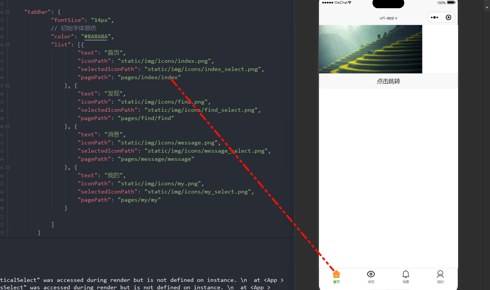
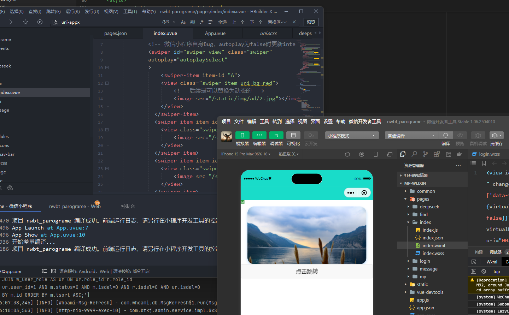

## uni-appx

[官方文档](https://doc.dcloud.net.cn/uni-app-x/)

之前用过uni-app的setup语法糖

### 问题

1. 目前已知的是自己会使用axios/uni.request去请求接口   

   但是咱们的后端是使用whoami架构 uni-appx中该如何使用？

   目前能想到的解决方案是  编写常规controller  在service使用 msgUtils去与数据库交互

2. 

## 项目注意点

根据以往的经验

### 如何设置底部导航栏？

1. 创建好项目后在我们的pages.json
2. 在底部添加tabBar
3. 添加list:

  

