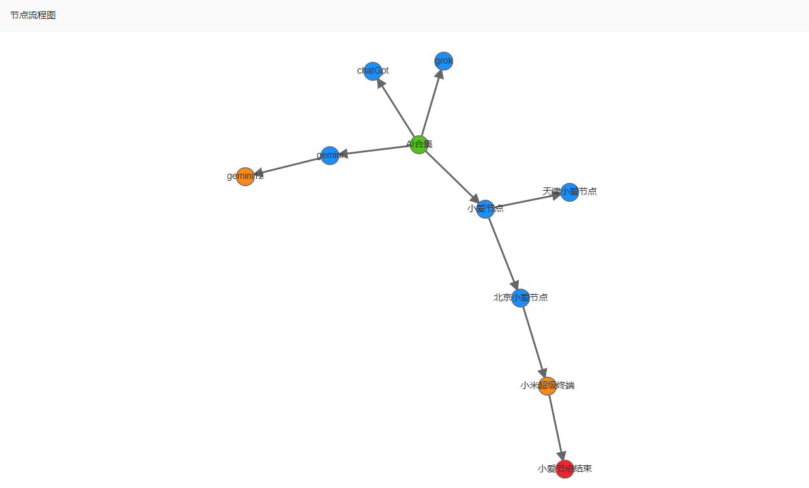

## 智能体练习

智能体开发
1).智能体表 w_agent
    id、名称、描述、所属功能
2).流程节点表 w_agent_node
    id、智能体id、名称、描述、类型、url、parent节点id


页面类似：


表的创建：
按照创建表的规范


智能体表   w_agent


流程节点表   w_agent_node


## 实现步骤

1. 添加相应的菜单   完成

2. 添加相应的页面  完成

3. 创建相应的表

   ```postgresql
   CREATE TABLE "public"."w_agent" (
       id int4 NOT NULL PRIMARY KEY,
       name VARCHAR(255) NOT NULL COMMENT '智能体名称',
       description TEXT COMMENT '智能体描述',
       function_type VARCHAR(100) COMMENT '所属功能类型',
       created_at TIMESTAMP DEFAULT CURRENT_TIMESTAMP,
       updated_at TIMESTAMP DEFAULT CURRENT_TIMESTAMP,
       isdel int2 DEFAULT 0 COMMENT '是否删除：0-未删除，1-已删除'
   );
   
   -- 流程节点表
   CREATE TABLE "public"."w_agent_node" (
       id int4 PRIMARY KEY,
       agent_id int4 NOT NULL,
       name VARCHAR(255) NOT NULL COMMENT '节点名称',
       description TEXT COMMENT '节点描述',
       type VARCHAR(50) NOT NULL COMMENT '节点类型',
       url VARCHAR(500) COMMENT '节点URL',
       parent_node_id INTEGER COMMENT '父节点ID',
       isdel int2 DEFAULT 0 COMMENT '是否删除：0-未删除，1-已删除',
       created_at TIMESTAMP DEFAULT CURRENT_TIMESTAMP,
       updated_at TIMESTAMP DEFAULT CURRENT_TIMESTAMP
   );
   ```

### 数据库终版

#### w_agent   智能体表

```sql
-- ----------------------------
-- Table structure for w_agent
-- ----------------------------
DROP TABLE IF EXISTS "public"."w_agent";
CREATE TABLE "public"."w_agent" (
  "id" int4 NOT NULL DEFAULT nextval('big_dataset_new_id_seq'::regclass),
  "agent_name" varchar(50) COLLATE "pg_catalog"."default" NOT NULL,
  "description" text COLLATE "pg_catalog"."default",
  "function_type" varchar(255) COLLATE "pg_catalog"."default",
  "status" int2 DEFAULT 0,
  "created_time" timestamp(6) DEFAULT CURRENT_TIMESTAMP,
  "altime" timestamp(6) DEFAULT CURRENT_TIMESTAMP,
  "isdel" int2 DEFAULT 0
)
;
COMMENT ON COLUMN "public"."w_agent"."agent_name" IS '智能体名称';
COMMENT ON COLUMN "public"."w_agent"."description" IS '描述';
COMMENT ON COLUMN "public"."w_agent"."function_type" IS '功能类型';
COMMENT ON COLUMN "public"."w_agent"."status" IS '状态';
COMMENT ON COLUMN "public"."w_agent"."created_time" IS '创建时间';
COMMENT ON COLUMN "public"."w_agent"."altime" IS '更新时间';

-- ----------------------------
-- Primary Key structure for table w_agent
-- ----------------------------
ALTER TABLE "public"."w_agent" ADD CONSTRAINT "w_agent_pkey" PRIMARY KEY ("id");

```

#### w_agent_node  智能体节点表

```sql
DROP TABLE IF EXISTS "public"."w_agent_node";
CREATE TABLE "public"."w_agent_node" (
  "id" int4 NOT NULL DEFAULT nextval('big_dataset_new_id_seq'::regclass),
  "agent_id" int4 NOT NULL,
  "node_name" varchar(50) COLLATE "pg_catalog"."default" NOT NULL,
  "node_dsc" text COLLATE "pg_catalog"."default",
  "node_type" varchar(50) COLLATE "pg_catalog"."default" NOT NULL,
  "url" varchar(255) COLLATE "pg_catalog"."default" NOT NULL,
  "parent_id" int4,
  "created_time" timestamp(6) DEFAULT CURRENT_TIMESTAMP,
  "altime" timestamp(6) DEFAULT CURRENT_TIMESTAMP,
  "isdel" int2 DEFAULT 0,
  "status" int2 DEFAULT 0
)
;
COMMENT ON COLUMN "public"."w_agent_node"."agent_id" IS '智能体id';
COMMENT ON COLUMN "public"."w_agent_node"."node_name" IS '节点名称';
COMMENT ON COLUMN "public"."w_agent_node"."node_dsc" IS '节点描述';
COMMENT ON COLUMN "public"."w_agent_node"."node_type" IS '节点类型(1-开始节点  2-处理节点 3-决策节点  4-结束节点 5-默认节点)';
COMMENT ON COLUMN "public"."w_agent_node"."url" IS 'url';
COMMENT ON COLUMN "public"."w_agent_node"."parent_id" IS '父节点id';
COMMENT ON COLUMN "public"."w_agent_node"."created_time" IS '创建时间';
COMMENT ON COLUMN "public"."w_agent_node"."altime" IS '更新时间';

-- ----------------------------
-- Primary Key structure for table w_agent_node
-- ----------------------------
ALTER TABLE "public"."w_agent_node" ADD CONSTRAINT "w_agent_node_pkey" PRIMARY KEY ("id");
```


## 目前效果：


智能体的搜索、添加、编辑、删除、添加节点功能没问题

查看对应智能体的节点列表使用layuitable 存在一丢小问题

- 使用layuitable的原因是如果节点很多的话，使用selectjson 很难写那些分页
- 但是貌似不能请求接口的时候就携带参数，，，，，，如果需要该如何实现？或者说有什么好的替代方案吗？
- 点击完提交之后没有关闭模态框(bug)


## 明天待做

1. **如何批量删除 也就是拿到对应的id数组  然后慢慢删除**

2. **完成节点的编辑和删除操作**

3. 是否考虑需要新起一个页面用于单独节点的展示

   因为一个节点可能是很多个节点的父节点  考虑使用treeTable

4. 解决所有留下的bug   最后给李总看一下最后的效果

5. 节点都编辑完成后，生成画流程图插件https://g6.antv.antgroup.com/examples


### 早上完成

crud功能全部完善

下午 简单测试有无bug    干插件问题 

最后完成了  中途遇到了大大小小的问题   也算是看看最终的效果吧：

### 下午实现


## 效果：

### 智能体


### 节点列表


### G6流程图



累了，歇会

## 总代码

### agent.xml

```xml
<?xml version="1.0" encoding="utf-8"?>
<Root>
    <msgs>

<!--        智能体查询-->
        <msg id="w_agent.getList" type="layuitable"
             v="ag.id, ag.agent_name,ag.description,ag.function_type,ag.status,ag.created_time,ag.altime %16 w_agent AS ag %16 isdel = 0">
            <where idx="laywhere">
                <p key="agentName">and agent_name like '%{0}%'</p>
            </where>
        </msg>

<!--        智能体添加  暂且把权限去除-->
        <msg id="w_agent.add" type="insertjson" v="w_agent%16#0#" perms="">
            <where idx="columns">
                <p key="agent_name" format="String">agent_name</p>
                <p key="description" format="text">description</p>
                <p key="function_type" format="String">function_type</p>
            </where>
        </msg>

<!--        回显-->
        <msg id="w_agent.selectById" type="selectjson" v="select agent_name,description,function_type from w_agent where isdel = 0 #0#" perms="">
            <where idx="0">
                <p key="id">and id = {0}</p>
            </where>
        </msg>

        <msg id="w_agent.update" type="updatejson" v="w_agent%16#0#%16#1#" perms="">
            <where idx="columns">
                <p key="agent_name" format="String">agent_name</p>
                <p key="description" format="text">description</p>
                <p key="function_type" format="String">function_type</p>
                <p key="status" format="int">status</p>
                <p key="isdel" format="int">isdel</p>
            </where>
            <where idx="1">
                <p key="id">id = {0}</p>
                <p key="ids" join="," prefix="id in(" suffix=")">{0}</p>
            </where>
        </msg>

<!--        为智能体添加节点-->
        <msg id="w_agent_node.add" type="insertjson" v="w_agent_node%16#0#" perms="">
            <where idx="columns">
                <p key="agent_id" format="int">agent_id</p>
                <p key="node_name" format="String">node_name</p>
                <p key="node_type" format="String">node_type</p>
                <p key="node_dsc" format="text">node_dsc</p>
                <p key="url" format="String">url</p>
                <p key="status" format="int">status</p>
                <p key="parent_id" format="int">parent_id</p>
            </where>
        </msg>

<!--        节点回显-->
        <msg id="w_agent_node.selectById" type="selectjson"
             v="select agent_id,node_name,node_type,node_dsc,url,status,parent_id from w_agent_node where isdel = 0 #0#" perms="">
            <where idx="0">
                <p key="id"> and id = {0}</p>
            </where>
        </msg>

<!--        更新-->
        <msg id="w_agent_node.update" type="updatejson" v="w_agent_node%16#0#%16#1#" perms="">
            <where idx="columns">
                <p key="agent_id" format="int">agent_id</p>
                <p key="node_name" format="String">node_name</p>
                <p key="node_type" format="String">node_type</p>
                <p key="node_dsc" format="text">node_dsc</p>
                <p key="url" format="String">url</p>
                <p key="status" format="int">status</p>
                <p key="parent_id" format="int">parent_id</p>
                <p key="isdel" format="int">isdel</p>
            </where>
            <where idx="1">
                <p key="id">id = {0}</p>
                <p key="ids" join="," prefix="id in(" suffix=")">{0}</p>
            </where>
        </msg>

<!--        节点列表 用layuitable  方便分页 -->
        <msg id="w_agent_node.selectByAgentId" type="layuitable"
             v="an.id, an.agent_id, an.node_name, an.node_type, an.node_dsc, an.url, an.status, an.parent_id, an.created_time, an.altime %16 w_agent_node AS an %16 isdel = 0">
            <where idx="laywhere">
                <p key="agent_id">and  agent_id = {0}</p>
                <p key="node_name">and node_name like '%{0}%'</p>
            </where>
        </msg>
    </msgs>
</Root>
```

### agent_manage.html

```html
<!DOCTYPE html>
<html lang="en">
<head>
    <meta charset="UTF-8">
    <title>agent</title>
    <meta name="renderer" content="webkit">
    <meta http-equiv="X-UA-Compatible" content="IE=edge,chrome=1">
    <meta name="viewport"
          content="width=device-width, initial-scale=1.0, minimum-scale=1.0, maximum-scale=1.0, user-scalable=0">
    <link rel="stylesheet" href="../../css/big_dataset.css" media="all">
    <link rel="stylesheet" type="text/css" href="../../layui-btkj/css/layui.css" media="all">
</head>
<body>
<div id="LAY_app">
    <div class="layui-layout">
        <div class="layui-row layui-col-space16">
            <div class="layui-col-md2">
                <input type="text" name="" id="agentName" placeholder="请输入智能体名" class="layui-input searchVal" maxlength="50" />

            </div>
            <div class="layui-col-md4">
                <button type="button" class="layui-btn search" id="searchAgent" value="搜索">
                    <i class="layui-icon layui-icon-search"></i>搜索
                </button>
                <button type="button" class="layui-btn layui-bg-blue" lay-perm="" id="addAgent" >
                  <i class="layui-icon layui-icon-add-1" lay-perm=""></i>添加
                </button>
                <button type="button" class="layui-btn layui-bg-red delbtn" id="delAgentsBtn" lay-perm="">
                  <i class="layui-icon layui-icon-delete" lay-perm=""></i>批量删除
                </button>
                <button type="button" class="layui-btn" id="importBtn" lay-perm="">
                  <i class="layui-icon layui-icon-add-1" lay-perm=""></i>导入
                </button>
            </div>
        </div>
        <div id="laytable">
            <table class="layui-hide" id="agentTable" lay-filter="agentTable"></table>
        </div>
    </div>
</div>

<script type="text/html" id="statusTpl">
    <input type="checkbox" name="status" value="{{ d.id }}" lay-skin="switch" lay-text="正常|停用"
           lay-filter="status-enable" {{ d.status == 0 ? 'checked' : '' }} >
</script>


<script type="text/html" id="agent_handle">
    <div class="action-buttons">
        <a class="action-btn edit-btn" lay-event="edit" lay-perm="">
            编辑
        </a>
        <a class="action-btn delete-btn" lay-event="del" lay-perm="">
            删除
        </a>
        <a class="action-btn add-node-btn" lay-event="addNode" lay-perm="">
            添加节点
        </a>
        <a class="action-btn find-btn" lay-event="nodeList" lay-perm="">
            节点列表
        </a>
    </div>
</script>

<script data-main="../../js/agent/agent_manage" src='../../sys/require.min.js'></script>
</body>

<style lang="scss">

    /* 操作按钮样式 */
    .action-buttons {
        display: flex;
        gap: 8px;
        align-items: center;
    }

    .action-btn {
        display: inline-flex;
        align-items: center;
        gap: 5px;
        padding: 0 12px;
        border-radius: 20px;
        font-size: 0.85rem;
        font-weight: 500;
        text-decoration: none;
        transition: all 0.2s ease;
        border: 1px solid transparent;
    }

    .edit-btn {
        background: linear-gradient(135deg, #4facfe 0%, #00f2fe 100%);
        color: white;
    }

    .edit-btn:hover {
        transform: translateY(-1px);
        box-shadow: 0 5px 15px rgba(79, 172, 254, 0.4);
        cursor: pointer;
    }

    .delete-btn {
        background: linear-gradient(135deg, #ff6b6b 0%, #ee5a24 100%);
        color: white;
    }

    .delete-btn:hover {
        transform: translateY(-1px);
        box-shadow: 0 5px 15px rgba(255, 107, 107, 0.4);
        cursor: pointer;
    }
    .add-node-btn {
        background: linear-gradient(135deg, #00fff2 0%, #00c9ff 100%);
        color: white;
    }
    .add-node-btn:hover {
        transform: translateY(-1px);
        box-shadow: 0 5px 15px rgba(0, 201, 255, 0.4);
        cursor: pointer;
    }

    .find-btn {
        background: linear-gradient(135deg, #ffa500 0%, #ff8c00 100%);
        color: white;
    }
    .find-btn:hover {
        transform: translateY(-1px);
        box-shadow: 0 5px 15px rgba(255, 165, 0, 0.4);
        cursor: pointer;
    }
</style>
</html>
```

#### agent_manage.js

```js
require.config({
    paths: {
        jquery: '../../sys/jquery',
        system: '../../sys/system',
        layui: "../../layui-btkj/layui",
        config: "../../js/layui_config"
    },
    shim: {
        "system": {
            deps: ["jquery"]
        },
        "layui": {
            deps: ["jquery", "system"]
        },
        "config": {
            deps: ["layui"]
        }
    },
    waitSeconds: 0
});

var objdata = {

};

require(["jquery", "system", "layui"], function () {
    layui.use(['table', 'form','layer'], function () {
        var table = layui.table;
        var form = layui.form;
        let layer = jQuery.getparent().layer;

        // 初始化
        initAgentTable();

        // 搜索
        $("#searchAgent").click(function () {
            var search = $("#agentName").val(); // 拿到输入框的值

            // 重新加载表格  同时在where中添加swhere属性用于添加别的条件
            objdata.objwhere = {}
            objdata.objwhere.agentName = [search];  // 因为请求的接口数据类型为数组 故需要添加[]

            // 重新加载table
            layui.table.reload('agentTable', {
                where: {
                    swhere: $.msgwhere(objdata.objwhere), // 后端的laywhere接收 数据格式为json
                    fields: 'id',
                    types:'asc'
                },
                page: {
                    curr: 1
                }

            })
        })

        // 智能体添加
        $("#addAgent").click((e) => {

            layer.open({
                type: 2,
                title: "添加",
                shadeClose: false,
                area: ['500px', '600px'],
                content: 'html/agent/agent_add_edit.html?v=' + Arg("v") + '&type=' + "add" + '&mid=' + Arg("mid"),
                success: function (layero, index) {
                },
                btn: ["保存", "取消"],
                yes: function (index, layero) {     //或者使用btn1
                    let w = layero.find('iframe')[0].contentWindow;
                    w.$("#saveOK").trigger("click", function () {  //提交按钮

                        setTimeout(function (){
                            table.reload('agentTable');
                        }, 500)

                        layer.close(index);        //"btnok" 被点击后，关闭当前的模态窗口。
                    });
                },
                no: function (index, layero) {
                    table.reload('agentTable');
                    layer.close(index);        //"editOK" 被点击后，关闭当前的模态窗口。
                }
            });
        });

        // 批量删除
        $("#delAgentsBtn").click(() => {
            let delList = [];
            let checkStatus = table.checkStatus('agentTable');
            checkStatus.data.forEach(function (item) {
                delList.push(item.id);
            });
            if(delList.length === 0){
                layer.msg("请选择要删除的项");
            }
            layer.confirm('请确认是否删除选中数据?', function (index) {
                layer.close(index);
                $.sm((re, err) => {
                    if (err) {
                        layer.msg(err);
                    } else {
                        layer.msg("删除成功！");
                        table.reload('agentTable');
                    }
                }, ["w_agent.update", JSON.stringify({
                    isdel: "1"
                }), $.msgwhere({ids: $.msgpJoin(delList)})])
            });
        })


    });
    function initAgentTable() {
        let table = layui.table;
        let layer = jQuery.getparent().layer;
        table.render({
            elem: '#agentTable',
            url: $.layurl + '?' + $.getSmStr(['w_agent.getList']), // 此处为静态模拟数据，实际使用时需换成真实接口
            height: 'full-' + ($("#laytable").offset().top + 30), // 最大高度减去其他容器已占有的高度差
            page: true,
            where: {
                fields: 'id',  // 排序字段
                types: 'asc'
            },
            cols: [[
                {type: 'checkbox'},
                {field: 'id', width: 80, title: 'ID', sort: true},
                {field: 'agent_name', width: 100, title: '智能体名称'},
                {field: 'description', width: 80, title: '描述'},
                {field: 'function_type', title: '所属功能', width: 200},
                { field: 'status', title: '状态', width: 100, templet: "#statusTpl"},
                { field: 'created_time', title: '创建时间', width: 200},
                { field: 'altime', title: '更新时间', width: 200},
                {fixed: 'right', title: '操作', width: 320, minWidth: 280, templet:'#agent_handle'}
            ]],

        });

        // 触发单元格工具事件
        table.on('tool(agentTable)', function (obj) {
            let data = obj.data; // 获得当前行数据
            let agentId = data.id;

            switch (obj.event){
                case 'edit':
                    editFunc(agentId);
                    break;
                case 'del':
                    delFunc(data,agentId);
                    break;
                case 'addNode':
                    addNodeFunc(agentId);
                    break;
                case 'nodeList':
                    nodeListFunc(agentId);
                    break;
            }
        });

        function editFunc(agentId) {
            jQuery.getparent().layer.open({
                type: 2,
                title: "修改智能体",
                shadeClose: false,
                area: ['500px', '600px'],
                content: 'html/agent/agent_add_edit.html?v=' + Arg("v") + '&type=' + "update" + '&mid=' + Arg("mid") + "&id=" + agentId,
                success: function (layero, index) {
                },
                btn: ["保存", "取消"],
                yes: function (index, layero) {     //或者使用btn1
                    let w = layero.find('iframe')[0].contentWindow;
                    w.$("#saveOK").trigger("click", function () {//提交按钮
                        layer.close(index)
                        table.reload('agentTable');
                    });
                },
                no: function (index, layero) {
                    layer.close(index);        //"editOK" 被点击后，关闭当前的模态窗口。
                    table.reload('agentTable');
                }
            });
        }

        function delFunc(data,agentId){
            layer.confirm('真的删除智能体' + data.agent_name + '吗？', function (index) {
                layer.close(index);
                // 向服务端发送删除指令
                $.sm((re, err) => {
                    if (re) {
                        layer.msg("删除成功！");
                    } else {
                        layer.msg(err);
                    }
                    table.reload('agentTable');
                }, ["w_agent.update", JSON.stringify({
                    isdel: "1"
                }), $.msgwhere({id: [agentId]})]);
            });
        }

        // 为只能体添加节点
        function addNodeFunc(agentId){
            jQuery.getparent().layer.open({
                type: 2,
                title: "添加智能体节点",
                shadeClose: false,
                area: ['500px', '600px'],
                content: 'html/agent/node_add_edit.html?v=' + Arg("v") + '&type=' + "add" + '&mid=' + Arg("mid") + "&id=" + agentId,
                success: function (layero, index) {
                },
                btn: ["保存", "取消"],
                yes: function (index, layero) {     //或者使用btn1
                    let w = layero.find('iframe')[0].contentWindow;
                    w.$("#saveOK").trigger("click", function () {//提交按钮
                        layer.close(index)
                        table.reload('agentTable');
                    });
                },
                no: function (index, layero) {
                    layer.close(index);        //"editOK" 被点击后，关闭当前的模态窗口。
                    table.reload('agentTable');
                }
            });
        }

        // 查看智能体的节点列表
        function nodeListFunc(agentId){
            jQuery.getparent().layer.open({
                type: 2,
                title: "智能体节点列表",
                shadeClose: false,
                area: ['1200px', '600px'],
                content: 'html/agent/node_list.html?v=' + Arg("v") + '&type=' + "add" + '&mid=' + Arg("mid") + "&id=" + agentId
            });
        }

    }
})
```

### agent_add_edit.html

```html
<!DOCTYPE html>
<html lang="en">
<head>
    <meta charset="UTF-8">
    <title>智能体添加</title>
    <meta name="renderer" content="webkit">
    <meta http-equiv="X-UA-Compatible" content="IE=edge,chrome=1">
    <meta name="viewport"
          content="width=device-width, initial-scale=1.0, minimum-scale=1.0, maximum-scale=1.0, user-scalable=0">
    <link type="text/css" rel="stylesheet" href="../../css/reset.css"/>
    <link rel="stylesheet" href="../../layui-btkj/css/layui.css" media="all">
    <link rel="stylesheet" href="../../css/layui_ext.css" media="all">
    <link rel="stylesheet" href="../../css/commonstyle-layui-btkj.css">
    <style>
        em {
            color: red;
        }
    </style>
</head>
<body>
<div id="editLayer4" style="width: 480px;margin-top: 50px">
    <form class="layui-form" id="addForm" lay-filter="formOk">

        <div class="layui-form-item" id="agent_name">
            <label class="layui-form-label"><em>* </em>智能体名称</label>
            <div class="layui-input-block">
                <input type="text" name="agent_name" required lay-verify="required" placeholder="请输入智能体名称"
                       maxlength="50"
                       class="layui-input agent_name"/>
            </div>
        </div>
        <div class="layui-form-item layui-form-text" id="description">
            <label class="layui-form-label">智能体描述</label>
            <div class="layui-input-block">
                <input type="text" name="description" required lay-verify="required" placeholder="请输入智能体描述"
                       maxlength="100"
                       class="layui-input description"/>
            </div>
        </div>
        <div class="layui-form-item" id="function_type">
            <label class="layui-form-label">所属功能</label>
            <div class="layui-input-block">
                <textarea name="function_type" lay-verify="required|function_type" placeholder="请输入智能体所属功能"
                          class="layui-textarea function_type"></textarea>
            </div>
        </div>
        <div style="display: none;">
            <div class="layui-input-block">
                <a id="saveOK" class="layui-btn" lay-submit="lay-submit">提交</a>
            </div>
        </div>
    </form>
</div>

<script data-main="../../js/agent/agent_add_edit.js" src='../../sys/require.min.js'></script>
</body>
</html>
```

#### agent_add_edit.js

```javascript
/**
 * 作者：gongxi
 * 时间：2025-08-07
 */
require.config({
    paths: {
        jquery: '../../sys/jquery',
        system: '../../sys/system',
        layui: "../../layui-btkj/layui",
        layuicommon: "../../sys/layuicommon",
    },
    shim: {
        "system": {
            deps: ["jquery"]
        },
        "layui": {
            deps: ["jquery", "system"]
        },
        "layuicommon": {
            deps: ["jquery", "layui"]
        }
    },
    waitSeconds: 0
});

require(["jquery", "system", 'layui', 'layuicommon'], function () {
    layui.use(['form'], function () {
        let form = layui.form;
        let agent_name = null;
        form.render();
        form.verify({
            agent_name: (value) => {
                if(value !== ""){
                    agent_name = value;
                }
                return '请输入智能体名称';
            },
            description: (value) => {
                if (value) {
                    try {
                        JSON.parse(value);
                    } catch (e) {
                        return '参数必须是有效的 JSON 格式';
                    }
                }
            }
        });

        // 心学到的东西  如果再次之前需要先获取其他数据  此时可以使用异步操作
        if (Arg("type") === "update"  && Arg("id") !== "") {
            $.sm((re, err) => {
                if (err) {
                    layer.msg(err);
                } else {
                    console.log(re);
                    let data = re[0];
                    form.val('formOk', {
                        "agent_name": data.agent_name,
                        "description": data.description,
                        "function_type": data.function_type,
                    });
                }
            }, ["w_agent.selectById", $.msgwhere({id: [Arg("id")]})]);
        }

        form.render();

        $("#saveOK").click(function (event, callback) {
            form.submit('formOk', function (data) {
                if (Arg("type") === "add") {
                    addFn(data.field);
                } else if (Arg("type") === "update") {
                    updateFn(data.field);
                }
                return false;
            });
        });
    });

    function addFn(data) {
        console.log(data);
        $.sm((re, err) => {
            if (err) {
                layer.msg(err);
            } else {
                layer.msg("添加数据集成功！");
            }
        }, ["w_agent.add", JSON.stringify(data)]);
    }

    function updateFn(data) {
        console.log(data);
        $.sm((re, err) => {
            if (err) {
                layer.msg(err);
            } else {
                layer.msg("修改智能体成功");
            }
        }, ["w_agent.update", JSON.stringify({
            agent_name: data.agent_name,
            description: data.description,
            function_type: data.function_type
        }), $.msgwhere({id: [Arg("id")]})]);
    }
});

```

### node_list.html

```html
<!DOCTYPE html>
<html lang="en">
<head>
    <meta charset="UTF-8">
    <title>agent</title>
    <meta name="renderer" content="webkit">
    <meta http-equiv="X-UA-Compatible" content="IE=edge,chrome=1">
    <meta name="viewport"
          content="width=device-width, initial-scale=1.0, minimum-scale=1.0, maximum-scale=1.0, user-scalable=0">
    <link rel="stylesheet" href="../../css/big_dataset.css" media="all">
    <link rel="stylesheet" type="text/css" href="../../layui-btkj/css/layui.css" media="all">
</head>
<body>
<div id="LAY_app">
    <div class="layui-layout">
        <div class="layui-row layui-col-space16">
            <div class="layui-col-md2">
                <input type="text" name="" id="nodeName" placeholder="请输入节点名" class="layui-input searchVal" maxlength="50" />

            </div>
            <div class="layui-col-md4">
                <button type="button" class="layui-btn search" id="searchNode" value="搜索">
                    <i class="layui-icon layui-icon-search"></i>搜索
                </button>
                <button type="button" class="layui-btn layui-bg-red delbtn" id="delNodeBatchBtn" lay-perm="">
                    <i class="layui-icon layui-icon-delete" lay-perm=""></i>批量删除
                </button>
                <button type="button" class="layui-btn layui-bg-blue" lay-perm="" id="nodeRelation">
                    <i class="layui-icon " lay-perm=""></i>节点流程图
                </button>
            </div>
        </div>
        <div id="laytable">
            <table class="layui-hide" id="nodeTable" lay-filter="nodeTable"></table>
        </div>
    </div>
</div>

<script type="text/html" id="statusTpl">
    <input type="checkbox" name="status" value="{{ d.id }}" lay-skin="switch" lay-text="正常|停用"
           lay-filter="status-enable" {{ d.status == 0 ? 'checked' : '' }} >
</script>

<script type="text/html" id="node_typeTpl">
    <!-- 根据拿到的id去显示不同颜色的tag，拿到的数字有 1  2  3  4  5-->
    {{# if(d.node_type == 1){ }}
    <span class="layui-badge" style="background-color: #28a745;">开始节点</span>
    {{# } else if(d.node_type == 2){ }}
    <span class="layui-badge" style="background-color: #007bff;">处理节点</span>
    {{# } else if(d.node_type == 3){ }}
    <span class="layui-badge" style="background-color: #fd7e14;">决策节点</span>
    {{# } else if(d.node_type == 4){ }}
    <span class="layui-badge" style="background-color: #dc3545;">结束节点</span>
    {{# } else if(d.node_type == 5){ }}
    <span class="layui-badge" style="background-color: #722ED1;">默认节点</span>
    {{# } else { }}
    <span class="layui-badge" style="background-color: #868e96;">未知类型</span>
    {{# } }}
</script>


<script type="text/html" id="node_handle">
    <div class="action-buttons">
        <a class="action-btn edit-btn" lay-event="edit" lay-perm="">
            编辑
        </a>
        <a class="action-btn delete-btn" lay-event="del" lay-perm="">
            删除
        </a>
    </div>
</script>


<script data-main="../../js/agent/node_list" src='../../sys/require.min.js'></script>
</body>

<style lang="scss">

    /* 操作按钮样式 */
    .action-buttons {
        display: flex;
        gap: 8px;
        align-items: center;
    }

    .action-btn {
        display: inline-flex;
        align-items: center;
        gap: 5px;
        padding: 0 12px;
        border-radius: 20px;
        font-size: 0.85rem;
        font-weight: 500;
        text-decoration: none;
        transition: all 0.2s ease;
        border: 1px solid transparent;
    }

    .edit-btn {
        background: linear-gradient(135deg, #4facfe 0%, #00f2fe 100%);
        color: white;
    }

    .edit-btn:hover {
        transform: translateY(-1px);
        box-shadow: 0 5px 15px rgba(79, 172, 254, 0.4);
        cursor: pointer;
    }

    .delete-btn {
        background: linear-gradient(135deg, #ff6b6b 0%, #ee5a24 100%);
        color: white;
    }

    .delete-btn:hover {
        transform: translateY(-1px);
        box-shadow: 0 5px 15px rgba(255, 107, 107, 0.4);
        cursor: pointer;
    }
</style>
</html>
```

#### node_list.js

```js
/**
 * 作者：gongxi
 * 时间：2025-08-07
 * 更新：添加节点关系图功能
 */
require.config({
    paths: {
        jquery: '../../sys/jquery',
        system: '../../sys/system',
        layui: "../../layui-btkj/layui",
        layuicommon: "../../sys/layuicommon",
        // 添加 AntV G6 依赖
        g6: "https://gw.alipayobjects.com/os/lib/antv/g6/4.8.20/dist/g6.min"
    },
    shim: {
        "system": {
            deps: ["jquery"]
        },
        "layui": {
            deps: ["jquery", "system"]
        },
        "layuicommon": {
            deps: ["jquery", "layui"]
        },
        "g6": {
            deps: ["jquery"]
        }
    },
    waitSeconds: 0
});

objdata = {
    nodelist: {},
    nodeRelationData: null // 存储关系图数据
};

require(["jquery", "system", "layui", "g6"], function () {
    layui.use(['table', 'form','layer'], function () {
        var agentId = Arg("id");
        let layer = jQuery.getparent().layer;

        initNodeTable(agentId);

        // searchNode 按钮点击
        $("#searchNode").click(function () {
            var search = $("#nodeName").val();
            objwhere.node_name = [search];

            layui.table.reload('nodeTable', {
                where: {
                    swhere: $.msgwhere(objwhere),
                    fields: 'id',
                    types: 'asc'
                },
                page: {
                    curr: 1
                }
            });
        })

        // 批量删除
        $("#delNodeBatchBtn").click(function () {
            let delList = [];
            let checkStatus = table.checkStatus('nodeTable');
            checkStatus.data.forEach((item) => {
                delList.push(item.id);
            });
            if(delList.length === 0){
                layer.msg("请选择要删除的项");
            }
            layer.confirm('请确认是否删除选中数据?', function (index) {
                layer.close(index);
                $.sm((re, err) => {
                    if (err) {
                        layer.msg(err);
                    } else {
                        layer.msg("删除成功！");
                        table.reload('nodeTable');
                    }
                }, ["w_agent_node.update", JSON.stringify({
                    isdel: "1"
                }), $.msgwhere({id: delList})]);
            })
        })
    })

    function initNodeTable(id) {

        let table = layui.table;
        let isFirstLoad = true;

        objwhere = {};
        objwhere.agent_id = [id];

        table.render({
            elem: '#nodeTable',
            url: encodeURI($.layurl + "?" + $.getSmStr(["w_agent_node.selectByAgentId"])),
            width: 'full-120',
            page: true,
            where: {
                fields: 'id',
                types: 'asc'
            },
            cols: [[
                {type: 'checkbox'},
                {field: 'id', width: 80, title: 'ID', sort: true},
                {field: 'node_name', width: 100, title: '节点名称'},
                {field: 'node_type', width: 90, title: '节点类型', templet: "#node_typeTpl"},
                {field: 'node_dsc', title: '节点描述', width: 200},
                { field: 'parent_id', title: '父节点', width: 100},
                { field: 'url', title: 'url', width: 100},
                { field: 'status', title: '状态', width: 100, templet: "#statusTpl"},
                { field: 'created_time', title: '创建时间', width: 200},
                { field: 'altime', title: '更新时间', width: 200},
                {fixed: 'right', title: '操作', width: 180, minWidth: 120, templet:'#node_handle'}
            ]],
            even: true, // 开启隔行背景
            limits: [10, 30, 50, 80, 120],
            limit: 10, // 默认每页显示数量

            done: function(res, curr, count) {
                if (isFirstLoad) {
                    isFirstLoad = false;

                    layui.table.reload('nodeTable', {
                        where: {
                            swhere: $.msgwhere(objwhere),
                            fields: 'id',
                            types: 'asc'
                        },
                        page: {
                            curr: 1
                        }
                    });
                } else {
                    /* TODO 1: 保存重新加载后的节点数据到 objdata.nodelist
                        存在的缺点  由于获取的是当前的数据 节点也只会展示当前数据的流程
                     */
                    objdata.nodelist = res.data || [];

                    // 同时准备关系图数据
                    objdata.nodeRelationData = prepareRelationData(objdata.nodelist);
                }

                table.on('tool(nodeTable)', function (obj) {
                    let nodeId = obj.data.id;
                    switch (obj.event){
                        case 'edit':{
                            nodeEdit(nodeId)
                            break;
                        }
                        case 'del':{
                            nodeDel(obj.data,nodeId)
                            break;
                        }
                    }
                })
            }
        });
    }

    function nodeEdit(nodeId) {
        var table = layui.table;
        var layer = jQuery.getparent().layer;
        jQuery.getparent().layer.open({
            type: 2,
            title: "编辑节点",
            shadeClose: false,
            area: ['500px', '600px'],
            content: 'html/agent/node_add_edit.html?v=' + Arg("v") + '&type=' + "update" + '&mid=' + Arg("mid") + "&id=" + nodeId,
            success: function (layero, index) {
            },
            btn: ["保存", "取消"],
            yes: function (index, layero) {
                let w = layero.find('iframe')[0].contentWindow;
                w.$("#saveOK").trigger("click", function () {
                    layer.close(index)
                    table.reload('nodeTable');
                });
            },
            no: function (index, layero) {
                layer.close(index);
                table.reload('nodeTable');
            }
        });
    }

    function nodeDel(data,nodeId) {
        var table = layui.table;
        layer.confirm('真的删除智能体节点--' + data.node_name + '吗？', function (index) {
            layer.close(index);
            $.sm((re, err) => {
                if (re) {
                    layer.msg("删除成功！");
                } else {
                    layer.msg(err);
                }
                table.reload('nodeTable');
            }, ["w_agent_node.update", JSON.stringify({
                isdel: "1"
            }), $.msgwhere({id: [nodeId]})]);
        });
    }


    // 准备关系图数据的函数
    function prepareRelationData(nodeList) {
        if (!nodeList || nodeList.length === 0) {
            return { nodes: [], edges: [] };
        }

        const nodes = [];
        const edges = [];
        const nodeMap = new Map();

        // 创建节点映射
        nodeList.forEach(node => {
            nodeMap.set(node.id, node);
        });

        // 生成节点数据
        nodeList.forEach(node => {
            nodes.push({
                id: node.id.toString(),
                label: node.node_name || `节点${node.id}`,
                type: 'circle',
                size: 20, // 减小节点大小
                style: {
                    fill: getNodeColor(node.node_type),
                    stroke: '#666',
                    lineWidth: 1
                },
                labelCfg: {
                    style: {
                        fill: '#333',
                        fontSize: 10,
                        fontWeight: 'normal'
                    }
                },
                // 存储完整的节点信息用于显示详情
                nodeData: node
            });
        });

        // 生成边数据（基于parent_id关系）
        nodeList.forEach(node => {
            if (node.parent_id && node.parent_id !== '0' && nodeMap.has(parseInt(node.parent_id))) {
                edges.push({
                    source: node.parent_id.toString(),
                    target: node.id.toString(),
                    type: 'line',
                    style: {
                        stroke: '#666',
                        lineWidth: 2,
                        endArrow: {
                            path: 'M 0,0 L 8,4 L 8,-4 Z',
                            fill: '#666'
                        }
                    }
                });
            }
        });

        return { nodes, edges };
    }

    // 根据节点类型返回不同颜色
    function getNodeColor(nodeType) {
        const colors = {
            '1': '#52c41a',     // 绿色 - 开始节点
            '2': '#1890ff',   // 蓝色 - 处理节点
            '3': '#fa8c16',  // 橙色 - 决策节点
            '4': '#f5222d',       // 红色 - 结束节点
            '5': '#722ed1'    // 紫色 - 默认
        };
        return colors[nodeType] || colors['5'];
    }


    // TODO 2: 节点关系图按钮点击事件
    $("#nodeRelation").click(function () {

        if (!objdata.nodeRelationData || objdata.nodeRelationData.nodes.length === 0) {
            layer.msg('暂无节点数据，无法生成关系图');
            return;
        }

        // 动态加载 G6 库并创建关系图
        require(['g6'], function(G6) {
            createNodeRelationGraph(G6, objdata.nodeRelationData);
        });
    });

    // 创建节点关系图的函数
    function createNodeRelationGraph(G6, data) {
        const layer = jQuery.getparent().layer;

        // 创建弹窗显示关系图
        const layerIndex = layer.open({
            type: 1,
            title: '节点流程图',
            area: ['80%', '80%'],
            content: '<div id="nodeGraphContainer" style="width: 100%; height: 100%;"></div>',
            success: function(layero, index) {
                const container = layero.find('#nodeGraphContainer')[0];

                // 创建 G6 图实例
                const graph = new G6.Graph({
                    container: container,
                    width: container.clientWidth,
                    height: container.clientHeight,
                    modes: {
                        default: [
                            'drag-canvas',   // 拖拽画布
                            'zoom-canvas',  // 缩放画布
                            'drag-node'  // 拖拽节点
                        ]
                    },
                    defaultNode: {
                        type: 'circle',
                        size: 30, // 减小默认节点大小
                        style: {
                            fill: '#5B8FF9',
                            stroke: '#5B8FF9',
                            lineWidth: 1
                        },
                        labelCfg: {
                            style: {
                                fill: '#333',
                                fontSize: 10
                            }
                        }
                    },
                    defaultEdge: {
                        type: 'polyline',
                        style: {
                            stroke: '#e2e2e2',
                            lineWidth: 1
                        }
                    },
                    layout: {
                        type: 'force',  // 使用力导图布局
                        preventOverlap: true,
                        linkDistance: 80, // 减小连接距离
                        nodeStrength: -100, // 调整节点斥力
                        edgeStrength: 0.3,
                        collideStrength: 0.8,
                        alpha: 0.8,
                        alphaDecay: 0.028,
                        alphaMin: 0.01,
                        forceSimulation: null,
                        center: [container.clientWidth / 2, container.clientHeight / 2] // 设置布局中心点
                    },
                    fitView: true, // 自动适应视口
                    fitViewPadding: [20, 20, 20, 20] // 设置边距
                });

                // 绑定节点点击事件
                graph.on('node:click', (e) => {
                    const nodeData = e.item.getModel().nodeData;
                    showNodeDetail(nodeData);
                });

                // 渲染数据
                graph.data(data);
                graph.render();

                // 延迟执行自适应画布，确保布局完成
                setTimeout(() => {
                    graph.fitView(20); // 添加20px的边距
                    graph.fitCenter(); // 确保图形在画布中心
                }, 500);

                // 窗口大小改变时重新调整
                window.addEventListener('resize', () => {
                    if (!graph || graph.destroyed) return;
                    if (!container || !container.scrollWidth || !container.scrollHeight) return;
                    graph.changeSize(container.scrollWidth, container.scrollHeight);
                });
            },
            end: function() {
                // 清理资源
                if (window.nodeGraph && !window.nodeGraph.destroyed) {
                    window.nodeGraph.destroy();
                    window.nodeGraph = null;
                }
            }
        });
    }

    // 显示节点详情
    function showNodeDetail(nodeData) {
        const layer = jQuery.getparent().layer;

        const content = `
            <div style="padding: 20px;">
                <table class="layui-table" lay-size="sm">
                    <tr><td><strong>节点ID：</strong></td><td>${nodeData.id}</td></tr>
                    <tr><td><strong>节点名称：</strong></td><td>${nodeData.node_name || '未命名'}</td></tr>
                    <tr><td><strong>节点类型：</strong></td><td>${nodeData.node_type || '未知'}</td></tr>
                    <tr><td><strong>节点描述：</strong></td><td>${nodeData.node_dsc || '无描述'}</td></tr>
                    <tr><td><strong>父节点：</strong></td><td>${nodeData.parent_id || '无'}</td></tr>
                    <tr><td><strong>URL：</strong></td><td>${nodeData.url || '无'}</td></tr>
                    <tr><td><strong>状态：</strong></td><td>${nodeData.status === 0 ?'正常':'停用'}</td></tr>
                    <tr><td><strong>创建时间：</strong></td><td>${nodeData.created_time || '未知'}</td></tr>
                    <tr><td><strong>更新时间：</strong></td><td>${nodeData.altime || '未知'}</td></tr>
                </table>
            </div>
        `;

        layer.open({
            type: 1,
            title: '节点详情',
            area: ['500px', '400px'],
            content: content,
            btn: ['编辑', '关闭'],
            yes: function(index) {
                layer.close(index);
                nodeEdit(nodeData.id);
            }
        });
    }
});
```

### node_add_edit.html

```html
<!DOCTYPE html>
<html lang="en">
<head>
    <meta charset="UTF-8">
    <title>智能体节点添加</title>
    <meta name="renderer" content="webkit">
    <meta http-equiv="X-UA-Compatible" content="IE=edge,chrome=1">
    <meta name="viewport"
          content="width=device-width, initial-scale=1.0, minimum-scale=1.0, maximum-scale=1.0, user-scalable=0">
    <link type="text/css" rel="stylesheet" href="../../css/reset.css"/>
    <link rel="stylesheet" href="../../layui-btkj/css/layui.css" media="all">
    <link rel="stylesheet" href="../../css/layui_ext.css" media="all">
    <link rel="stylesheet" href="../../css/commonstyle-layui-btkj.css">
    <style>
        em {
            color: red;
        }
    </style>
</head>
<body>
<div id="editLayer4" style="width: 480px;margin-top: 50px">
    <form class="layui-form" id="addForm" lay-filter="formOk">

        <div class="layui-form-item" id="node_name">
            <label class="layui-form-label"><em>* </em>节点名称</label>
            <div class="layui-input-block">
                <input type="text" name="node_name" required lay-verify="required" placeholder="请输入节点名称"
                       maxlength="50"
                       class="layui-input node_name"/>
            </div>
        </div>
        <div class="layui-form-item layui-form-text" id="node_dsc">
            <label class="layui-form-label"><em>* </em>节点描述</label>
            <div class="layui-input-block">
                <input type="text" name="node_dsc" required lay-verify="required" placeholder="请输入节点描述"
                       maxlength="100"
                       class="layui-input node_dsc"/>
            </div>
        </div>
        <!--            TODO  需要将其换为挑选框-->
        <div class="layui-form-item" id="node_type">
            <label class="layui-form-label"><em>* </em>节点类型</label>
            <div class="layui-input-block">
                <input name="node_type" lay-verify="required|node_type" placeholder="请选择节点类型"
                       class="layui-input node_type" readonly style="cursor: pointer;" />
                <button type="button" id="nodeTypeSelect" style="position: absolute; top: 0; left: 0; width: 100%; height: 100%; opacity: 0; cursor: pointer; z-index: 1;"></button>
            </div>
        </div>

        <div class="layui-form-item" id="url">
            <label class="layui-form-label"><em>* </em>url</label>
            <div class="layui-input-block">
                <textarea name="url" lay-verify="required|url" placeholder="请输入节点URL"
                          class="layui-textarea url"></textarea>
            </div>
        </div>
        <div class="layui-form-item" id="parent_id">
            <label class="layui-form-label">父节点 ID</label>
            <div class="layui-input-block">
                <input type="text"  name="parent_id" lay-verify="parent_id" placeholder="请输入父节点ID"
                          class="layui-input parent_id" />
            </div>
        </div>
        <div style="display: none;">
            <div class="layui-input-block">
                <a id="saveOK" class="layui-btn" lay-submit="lay-submit">提交</a>
            </div>
        </div>
    </form>
</div>

<script data-main="../../js/agent/node_add_edit.js" src='../../sys/require.min.js'></script>
</body>
</html>
```

#### node_add_edit.js

```js
/**
 * 作者：gongxi
 * 时间：2025-08-07
 */
require.config({
    paths: {
        jquery: '../../sys/jquery',
        system: '../../sys/system',
        layui: "../../layui-btkj/layui",
        layuicommon: "../../sys/layuicommon",
    },
    shim: {
        "system": {
            deps: ["jquery"]
        },
        "layui": {
            deps: ["jquery", "system"]
        },
        "layuicommon": {
            deps: ["jquery", "layui"]
        }
    },
    waitSeconds: 0
});

require(["jquery", "system", 'layui', 'layuicommon'], function () {
    layui.use(['form'], function () {
        let form = layui.form;
        let agent_name = null;
        form.render();
        form.verify({
            agent_name: (value) => {
                if(value !== ""){
                    agent_name = value;
                }
                return '请输入智能体名称';
            },
            description: (value) => {
                if (value) {
                    try {
                        JSON.parse(value);
                    } catch (e) {
                        return '参数必须是有效的 JSON 格式';
                    }
                }
            }
        });

        // 心学到的东西  如果再次之前需要先获取其他数据  此时可以使用异步操作
        if (Arg("type") === "update"  && Arg("id") !== "") {
            $.sm((re, err) => {
                if (err) {
                    layer.msg(err);
                } else {
                    console.log(re);
                    let data = re[0];
                    form.val('formOk', {
                        "agent_name": data.agent_name,
                        "description": data.description,
                        "function_type": data.function_type,
                    });
                }
            }, ["w_agent.selectById", $.msgwhere({id: [Arg("id")]})]);
        }

        form.render();

        $("#saveOK").click(function (event, callback) {
            form.submit('formOk', function (data) {
                if (Arg("type") === "add") {
                    addFn(data.field);
                } else if (Arg("type") === "update") {
                    updateFn(data.field);
                }
                return false;
            });
        });
    });

    function addFn(data) {
        console.log(data);
        $.sm((re, err) => {
            if (err) {
                layer.msg(err);
            } else {
                layer.msg("添加数据集成功！");
            }
        }, ["w_agent.add", JSON.stringify(data)]);
    }

    function updateFn(data) {
        console.log(data);
        $.sm((re, err) => {
            if (err) {
                layer.msg(err);
            } else {
                layer.msg("修改智能体成功");
            }
        }, ["w_agent.update", JSON.stringify({
            agent_name: data.agent_name,
            description: data.description,
            function_type: data.function_type
        }), $.msgwhere({id: [Arg("id")]})]);
    }
});
```


