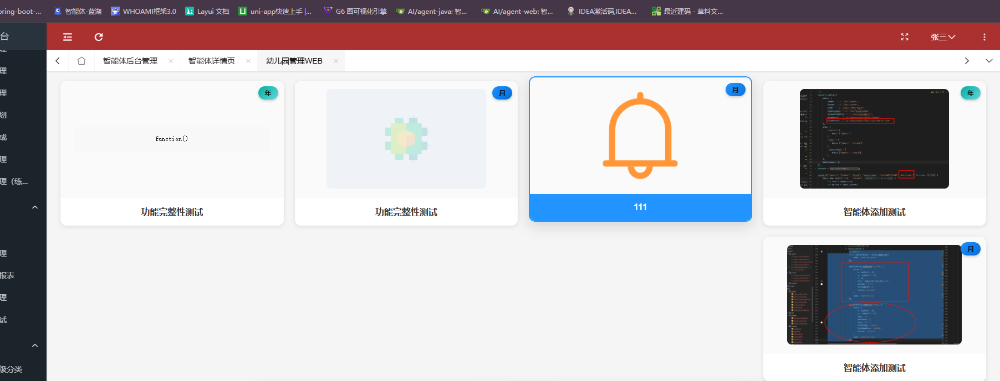
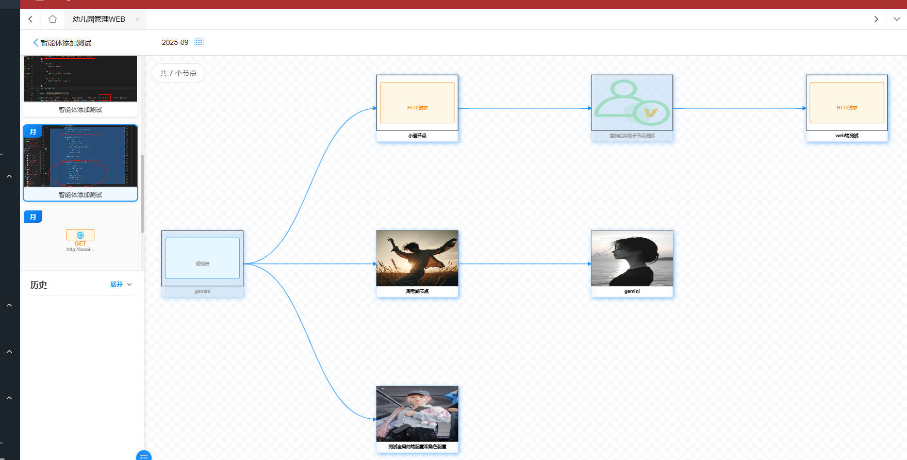
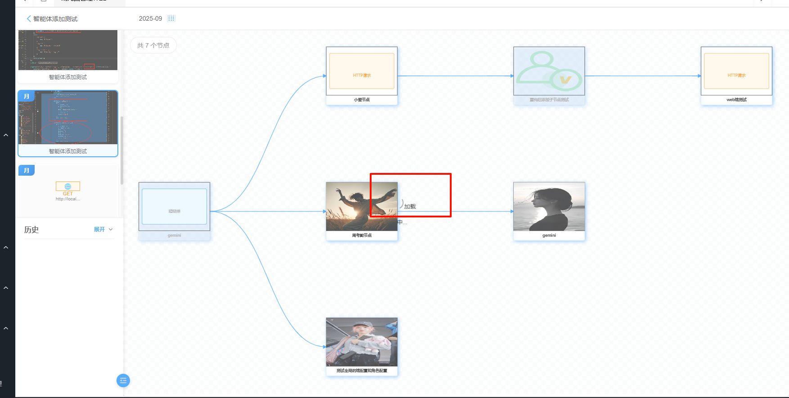
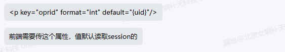
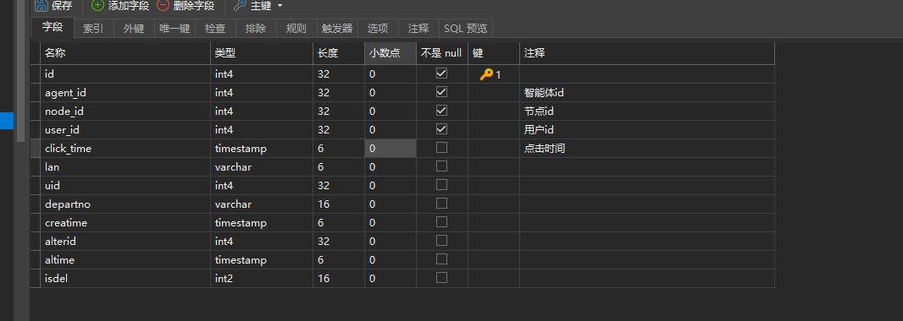
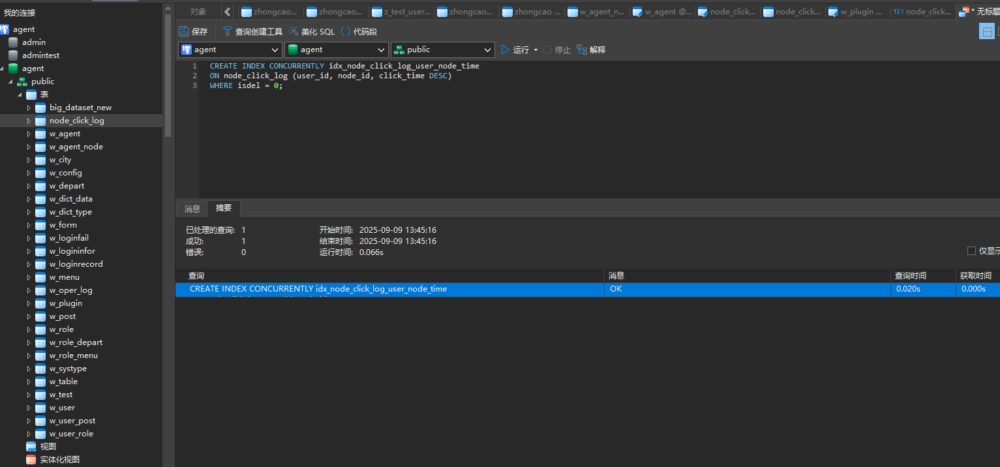
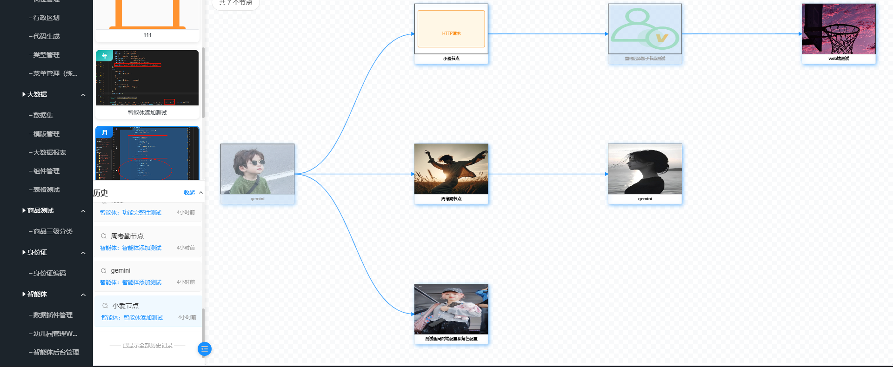
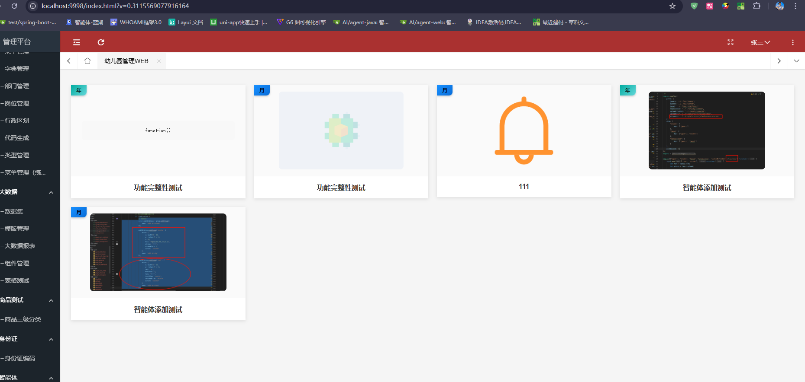

## 页面


场景：之前我们完成了幼儿园管理的智能体列表展示，然后通过点击智能体跳转到智能体详情页，显示对应的智能体的节点等

但是按照原型中的效果，在智能体列表页，在点击了对应的智能体后，本页面的内容替换为agent_detail.html中的内容，点击页面中的返回可以实现返回到原始的列表页面，这才是理想想过，这样一来就需要去除路由了

### 效果

点击智能体后动态加载了对应的详情页面


### bug修复

#### 页面渲染智能体列表的时候，单列表的占比有问题

鼠标移动到某个智能体，下一个智能体会被挤到别的地方去：

reason:
这个问题是由于悬浮时的 `transform: translateY(-8px)` 会改变元素的位置，影响到其他元素的布局。解决方案是使用绝对定位或者减少位移量：

#### 点击返回按钮没有返回和动态的加载相应的智能体列表页

上面我们虽然动态的实现了点击智能体加载详情，但是点击返回按钮是没有效果的,修改其中的方法


### 代码

#### agent_list.js

```js
/*
* 作者: 龚喜
* 幼儿园管理端的跳转页面
* 智能体列表页
* 创建时间: 2025-09-03
* 重构: 2025-09-08 简化页面跳转逻辑
* */

require.config({
    paths: {
        jquery: '../../sys/jquery',
        system: '../../sys/system',
        layui: "../../layui-btkj/layui",
        layuicommon: "../../sys/layuicommon",
    },
    shim: {
        "system": {
            deps: ["jquery"]
        },
        "layui": {
            deps: ["jquery", "system"]
        },
        "layuicommon": {
            deps: ["jquery", "layui"]
        }
    },
    waitSeconds: 0
});

objdata = {
    // 适用端
    applicable: {
        applicable_end: ['家长端'],
        applicable_role: ['家长'],
    },

    // 智能体搜索
    agent_name: '测试',

    // 智能体列表数据
    agentListData: []
};

require(["jquery", "system", "layui"], function () {
    layui.use(['table', 'form', 'layer'], function () {
        initList();
    });

    /**
     * 初始化智能体列表
     */
    function initList() {
        let data = objdata.applicable;

        $.sm(function (re, err) {
            if (err) {
                layer.msg(err);
                renderEmptyState('加载失败，请稍后重试');
            } else {
                objdata.agentListData = re || [];
                renderAgentList(objdata.agentListData);
            }
        }, ["w_agent_plugin.getList", $.msgwhere(data)]);
    }

    /**
     * 渲染智能体列表
     */
    function renderAgentList(listData) {
        const container = $('#agentContainer');

        // 如果数据为空，显示暂无数据
        if (!listData || listData.length === 0) {
            renderEmptyState('暂无智能体数据', '暂时还没有可用的智能体，请稍后再试');
            return;
        }

        let html = '';

        listData.forEach(function(item) {
            const timeGranularity = item.time_granularity || '日';
            const agentName = item.agent_name || '智能体名称';
            const bgClass = getBackgroundClass(timeGranularity);
            const contentHtml = generateContentHtml(item);

            html += `
                <div class="layui-col-xs12 layui-col-sm6 layui-col-md4 layui-col-lg3">
                    <div class="agent-list" data-id="${item.id}" data-time-granularity="${timeGranularity}">
                        <div class="agent_bg ${bgClass}">${timeGranularity}</div>
                        <div class="agent-listdiv">
                            ${contentHtml}
                        </div>
                        <div class="agent-btn">
                            ${agentName}
                        </div>
                    </div>
                </div>
            `;
        });

        container.html(html);

        // 绑定点击事件
        bindEvents();
    }

    /**
     * 渲染空状态
     */
    function renderEmptyState(title, description) {
        const container = $('#agentContainer');
        const emptyHtml = `
            <div class="layui-col-xs12">
                <div class="empty-state">
                    <div class="empty-icon">📋</div>
                    <div class="empty-text">${title}</div>
                    <div class="empty-desc">${description || ''}</div>
                    <div class="empty-actions">
                        <button class="layui-btn layui-btn-primary" onclick="refreshList()">
                            <i class="layui-icon layui-icon-refresh"></i> 刷新
                        </button>
                    </div>
                </div>
            </div>
        `;
        container.html(emptyHtml);
    }

    /**
     * 根据时间粒度获取背景样式类
     */
    function getBackgroundClass(timeGranularity) {
        switch(timeGranularity) {
            case '日':
                return 'daybg';
            case '月':
                return 'mouthbg';
            case '年':
                return 'yearbg';
            default:
                return 'daybg';
        }
    }

    /**
     * 生成内容HTML
     */
    function generateContentHtml(item) {
        // 如果pld为0，显示logo图片
        if (item.pld === 0) {
            if (item.logo) {
                const logoUrl = ossPrefix + item.logo;
                return ``;
            } else {
                return ``;
            }
        } else {
            // pld不为0时，显示content内容
            return generateContentDisplay(item.content, item.plugin_type);
        }
    }

    /**
     * 生成content内容显示
     */
    function generateContentDisplay(content, pluginType) {
        if (!content) {
            return ``;
        }

        // 判断是否为链接
        if (isUrl(content)) {
            return `
                <div class="content-display">
                    <a href="${content}" target="_blank" rel="noopener">
                        链接内容</span>'">
                    </a>
                </div>
            `;
        }

        // 判断是否为代码块
        if (pluginType === 'code' || isCodeContent(content)) {
            const displayText = content.length > 50 ? content.substring(0, 50) + '...' : content;
            return `
                <div class="content-display code-display">
                    <pre><code>${escapeHtml(displayText)}</code></pre>
                </div>
            `;
        }

        // 普通文本内容
        const displayText = content.length > 60 ? content.substring(0, 60) + '...' : content;
        return `
            <div class="content-display text-display">
                <span>${escapeHtml(displayText)}</span>
            </div>
        `;
    }

    /**
     * 判断是否为URL
     */
    function isUrl(str) {
        try {
            new URL(str);
            return true;
        } catch {
            return /^https?:\/\/.+/.test(str);
        }
    }

    /**
     * 判断是否为代码内容
     */
    function isCodeContent(content) {
        const codePatterns = [
            /function\s*\(/,
            /\{[\s\S]*\}/,
            /class\s+\w+/,
            /import\s+.*from/,
            /console\./,
            /document\./,
            /var\s+\w+\s*=/,
            /let\s+\w+\s*=/,
            /const\s+\w+\s*=/
        ];

        return codePatterns.some(pattern => pattern.test(content));
    }

    /**
     * HTML转义
     */
    function escapeHtml(text) {
        const div = document.createElement('div');
        div.textContent = text;
        return div.innerHTML;
    }

    /**
     * 绑定事件
     */
    function bindEvents() {
        // 智能体点击事件 - 直接跳转到详情页
        $('.agent-list').off('click').on('click', function() {
            const agentId = $(this).data('id');
            const agentData = objdata.agentListData.find(item => item.id === agentId);

            if (agentData) {
                handleAgentClick(agentData);
            } else {
                layer.msg('智能体数据不存在');
            }
        });

        // 悬浮效果
        $('.agent-list').off('mouseenter mouseleave')
            .on('mouseenter', function() {
                $(this).addClass('agent-hover');
            })
            .on('mouseleave', function() {
                $(this).removeClass('agent-hover');
            });
    }

    /**
     * 处理智能体点击事件 - 跳转到详情页
     */
    function handleAgentClick(agentData) {

        // 显示加载动画
        const loadingIndex = layui.layer.load(2, {
            shade: [0.3, '#ffffff'],
            content: '正在加载...'
        });

        // 延迟跳转，让用户看到反馈
        setTimeout(function() {
            layui.layer.close(loadingIndex);

            // 跳转到详情页，传递agent_id参数
            window.location.href = `agent_detail.html?agent_id=${agentData.id}`;
        }, 500);
    }

    /**
     * 刷新列表
     */
    window.refreshList = function() {
        const loadingIndex = layui.layer.load(1, {shade: [0.2, '#000']});

        // 延迟一下再刷新，给用户反馈
        setTimeout(function() {
            layui.layer.close(loadingIndex);
            initList();
        }, 500);
    };

    // 暴露全局管理对象
    window.agentListManager = {
        refreshList: function() {
            refreshList();
        },
        getListData: function() {
            return objdata.agentListData;
        },
        renderList: renderAgentList,
        reload: function() {
            window.location.reload();
        }
    };
});
```

#### agent_detail.js

```js
/*
* 作者: 龚喜
* 幼儿园管理端WEB 的智能体详情页
* 创建时间: 2025-09-03
* 重构: 2025-09-08 简化页面跳转逻辑
* */

require.config({
    paths: {
        jquery: '../../sys/jquery',
        system: '../../sys/system',
        layui: "../../layui-btkj/layui",
        layuicommon: "../../sys/layuicommon",
    },
    shim: {
        "system": {
            deps: ["jquery"]
        },
        "layui": {
            deps: ["jquery", "system"]
        },
        "layuicommon": {
            deps: ["jquery", "layui"]
        }
    },
    waitSeconds: 0
});

objdata = {
    // 适用端
    applicable: {
        applicable_end: ['幼儿园管理WEB'],
        applicable_role: ['系统管理员']
    },

    // 智能体搜索
    agent_name: '测试',

    // URL传递的agent_id
    agent_id: null,

    // 当前选中的智能体
    currentAgent: null,

    // 左侧面板状态
    leftPanelCollapsed: false,

    // 历史记录展开状态
    historyExpanded: false,

    // 当前选择的时间
    currentDate: new Date(),

    // layui组件实例
    laydate: null,

    // 智能体列表数据
    agentListData: []
};

require(["jquery", "system", "layui"], function () {
    layui.use(['table', 'form', 'layer', 'laydate'], function () {
        // 保存laydate实例
        objdata.laydate = layui.laydate;

        // 初始化页面
        initPage();
    });

    /**
     * 初始化页面
     */
    function initPage() {
        // 获取URL参数中的agent_id
        objdata.agent_id = Arg('agent_id');

        if (!objdata.agent_id) {
            layer.msg('缺少智能体参数，即将返回列表页', {time: 2000});
            setTimeout(function() {
                goBackToList();
            }, 2000);
            return;
        }

        // 初始化智能体列表和详情
        initAgentList();

        // 初始化事件监听器
        initEventListeners();

        // 初始化历史记录功能
        initNodeHistory();
    }

    /**
     * 初始化智能体列表
     */
    function initAgentList() {
        let data = objdata.applicable;

        $.sm(function (re, err) {
            if (err) {
                layer.msg('获取智能体数据失败: ' + err);
                renderAgentListError();
            } else {
                objdata.agentListData = re || [];

                // 渲染左侧智能体列表
                renderAgentList(objdata.agentListData);

                // 自动选中指定的智能体
                if (objdata.agent_id) {
                    autoSelectAgent(objdata.agent_id);
                }
            }
        }, ["w_agent_plugin.getList", $.msgwhere(data)]);
    }

    /**
     * 渲染智能体列表
     */
    function renderAgentList(agentListData) {
        const container = $('#agentListContainer');
        container.empty();

        if (!agentListData || agentListData.length === 0) {
            container.append('<div class="no-agents">暂无智能体数据</div>');
            return;
        }

        agentListData.forEach((item, index) => {
            const timeGranularity = item.time_granularity || '日';
            const agentName = item.agent_name || '智能体名称';
            const bgClass = getBackgroundClass(timeGranularity);
            const contentHtml = generateContentHtml(item);

            const agentHtml = `
                <div class="agent-list widdiv" data-agent-id="${item.id}" data-index="${index}">
                    <div class="agent_bg ${bgClass}">${timeGranularity}</div>
                    <div class="agent-listdiv">${contentHtml}</div> 
                    <div class="agent-btn">${agentName}</div>
                </div>
            `;

            container.append(agentHtml);
        });

        // 绑定智能体点击事件
        bindAgentClickEvents();
    }

    /**
     * 渲染智能体列表错误状态
     */
    function renderAgentListError() {
        const container = $('#agentListContainer');
        const errorHtml = `
            <div class="error-state">
                <div class="error-icon">❌</div>
                <div class="error-text">加载失败</div>
                <div class="error-actions">
                    <button class="layui-btn layui-btn-sm" onclick="initAgentList()">重试</button>
                    <button class="layui-btn layui-btn-primary layui-btn-sm" onclick="goBackToList()">返回列表</button>
                </div>
            </div>
        `;
        container.html(errorHtml);
    }

    /**
     * 绑定智能体点击事件
     */
    function bindAgentClickEvents() {
        $('.agent-list').off('click').on('click', function() {
            const agentIndex = $(this).data('index');
            const agentData = objdata.agentListData[agentIndex];

            if (agentData) {
                selectAgent(agentData, $(this));

                // 更新URL参数，但不刷新页面
                updateUrlParameter('agent_id', agentData.id);
            }
        });
    }

    /**
     * 自动选中指定ID的智能体
     */
    function autoSelectAgent(agentId) {
        // 查找对应的智能体数据
        const targetAgent = objdata.agentListData.find(agent => agent.id == agentId);

        if (targetAgent) {
            // 查找对应的DOM元素
            const targetElement = $(`.agent-list[data-agent-id="${agentId}"]`);

            if (targetElement.length > 0) {
                // 自动选中该智能体
                selectAgent(targetAgent, targetElement);

                // 滚动到选中的智能体位置
                setTimeout(function() {
                    targetElement[0].scrollIntoView({
                        behavior: 'smooth',
                        block: 'center'
                    });
                }, 300);
            } else {
                layer.msg(`未找到指定的智能体 (ID: ${agentId})`);
            }
        } else {
            layer.msg(`未找到指定的智能体 (ID: ${agentId})`);
        }
    }

    /**
     * 选择智能体
     */
    function selectAgent(agent, element) {
        // 更新选中状态
        $('.agent-list').removeClass('active');
        element.addClass('active');

        // 保存当前选中的智能体
        objdata.currentAgent = agent;
        objdata.agent_id = agent.id;

        // 渲染右侧内容
        renderAgentContent(agent);
    }

    /**
     * 渲染智能体内容
     */
    function renderAgentContent(agent) {
        const header = $('#detailHeader');
        const contentArea = $('#contentArea');
        const placeholder = $('#contentPlaceholder');

        // 隐藏占位符
        placeholder.hide();

        // 清除之前的内容
        $('.header-content').remove();
        $('.node-content').remove();

        // 显示头部
        const headerHtml = generateHeaderHtml(agent);
        header.append(headerHtml);

        // 初始化时间选择器
        initTimeSelector(agent);

        // 加载节点图表
        const nodeGraphHtml = `
            <div class="node-content">           
                <iframe 
                    id="nodeGraphFrame" 
                    src="../../html/agent-web/node_graph_web.html?agent_id=${agent.id}" 
                    frameborder="0" 
                    style="width: 100%; height: 810px; border: none; border-radius: 8px;">
                </iframe>       
            </div>
        `;

        contentArea.append(nodeGraphHtml);
    }

    /**
     * 生成头部HTML
     */
    function generateHeaderHtml(agent) {
        const timeDisplay = getTimeDisplay(agent.time_granularity);

        return `
            <div class="header-content">
                <div class="header-left">
                    <i class="layui-icon layui-icon-left" style="font-size: 20px; color: #1E9FFF; cursor: pointer" onclick="goBackToList()"></i> 
                    <div class="agent_name">${agent.agent_name}</div>
                </div>
                <div class="header-right" id="timeSelector">
                    <div class="header-right-time" id="timeContent">
                        ${timeDisplay}
                    </div>
                    <i class="layui-icon layui-icon-date" style="font-size: 20px; color: #1E9FFF; margin-left: 5px;"></i> 
                </div>
            </div>
        `;
    }

    /**
     * 根据时间维度获取当前时间显示
     */
    function getTimeDisplay(timeGranularity) {
        const now = objdata.currentDate;

        switch(timeGranularity) {
            case '日':
                return formatDate(now, 'yyyy-MM-dd');
            case '月':
                return formatDate(now, 'yyyy-MM');
            case '年':
                return formatDate(now, 'yyyy');
            default:
                return formatDate(now, 'yyyy-MM-dd');
        }
    }

    /**
     * 初始化时间选择器
     */
    function initTimeSelector(agent) {
        const timeGranularity = agent.time_granularity || '日';

        // 移除之前的点击事件
        $('#timeSelector').off('click');

        // 配置laydate参数
        let dateConfig = {
            elem: '#timeSelector',
            trigger: 'click',
            value: getTimeDisplay(timeGranularity),
            show: false,
            done: function(value) {
                objdata.currentDate = new Date(value);
                $('#timeContent').text(value);

                // 重新加载节点图表数据
                reloadNodeGraph(agent.id, value, timeGranularity);
            }
        };

        // 根据时间维度配置不同的选择器
        switch(timeGranularity) {
            case '日':
                dateConfig.type = 'date';
                dateConfig.format = 'yyyy-MM-dd';
                break;
            case '月':
                dateConfig.type = 'month';
                dateConfig.format = 'yyyy-MM';
                break;
            case '年':
                dateConfig.type = 'year';
                dateConfig.format = 'yyyy';
                break;
            default:
                dateConfig.type = 'date';
                dateConfig.format = 'yyyy-MM-dd';
        }

        // 渲染laydate
        const laydateInstance = objdata.laydate.render(dateConfig);
        $('#timeSelector').data('laydate-instance', laydateInstance);
    }

    /**
     * 重新加载节点图表
     */
    function reloadNodeGraph(agentId, selectedTime, timeGranularity) {
        const iframe = $('#nodeGraphFrame');
        if (iframe.length > 0) {
            const newSrc = `../../html/agent-web/node_graph_web.html?agent_id=${agentId}&selected_time=${encodeURIComponent(selectedTime)}&time_granularity=${encodeURIComponent(timeGranularity)}`;
            iframe.attr('src', newSrc);
        }
    }

    /**
     * 返回列表页
     */
    window.goBackToList = function() {
        // 显示加载动画
        const loadingIndex = layui.layer.load(1, {
            shade: [0.3, '#ffffff'],
            content: '加载中...'
        });

        // 延迟跳转，给用户反馈
        setTimeout(function() {
            layui.layer.close(loadingIndex);
            window.location.href = 'agent_list.html';
        }, 300);
    };

    /**
     * 更新URL参数
     */
    function updateUrlParameter(key, value) {
        try {
            const url = new URL(window.location);
            url.searchParams.set(key, value);
            window.history.replaceState({}, document.title, url.toString());
        } catch (error) {
            console.error('更新URL参数失败:', error);
        }
    }

    /**
     * 格式化日期
     */
    function formatDate(date, format) {
        if (!date) return '';

        const year = date.getFullYear();
        const month = String(date.getMonth() + 1).padStart(2, '0');
        const day = String(date.getDate()).padStart(2, '0');

        return format
            .replace('yyyy', year)
            .replace('MM', month)
            .replace('dd', day);
    }

    /**
     * 根据时间粒度获取背景样式类
     */
    function getBackgroundClass(timeGranularity) {
        switch(timeGranularity) {
            case '日':
                return 'daybg';
            case '月':
                return 'mouthbg';
            case '年':
                return 'yearbg';
            default:
                return 'daybg';
        }
    }

    /**
     * 生成内容HTML
     */
    function generateContentHtml(item) {
        var isPluginLogo = item.logo && item.logo.toString().match(/^\d+$/);

        if (!isPluginLogo && item.logo !== 0) {
            if (item.logo) {
                const logoUrl = ossPrefix + item.logo;
                return ``;
            } else {
                return ``;
            }
        } else if (item.logo === 0) {
            return ``;
        } else {
            return generatePluginContentDisplay(item);
        }
    }

    /**
     * 根据plugin_type生成不同的内容显示
     */
    function generatePluginContentDisplay(item) {
        switch (item.plugin_type) {
            case 'superlink':
                return generateSuperlinkDisplay(item);
            case 'http':
                return generateHttpDisplay(item);
            case 'code':
                return generateCodeDisplay(item);
            case 'function':
                return generateFunctionDisplay(item);
            default:
                return generateDefaultDisplay(item);
        }
    }

    function generateSuperlinkDisplay(item) {
        const linkText = item.url || item.content || '超链接';
        const displayText = linkText.length > 15 ? linkText.substring(0, 15) + '...' : linkText;

        return `
            <div class="content-display superlink-display">
                <div class="plugin-icon" style="background: #e6f7ff; color: #1890ff; border: 1px solid #1890ff;">🔗</div>
                <div class="plugin-text" style="color: #1890ff;">${escapeHtml(displayText)}</div>
            </div>
        `;
    }

    function generateHttpDisplay(item) {
        const method = item.http_method || 'GET';
        const apiUrl = item.api_url || item.content || 'HTTP请求';
        const displayText = apiUrl.length > 12 ? apiUrl.substring(0, 12) + '...' : apiUrl;

        return `
            <div class="content-display http-display">
                <div class="plugin-icon" style="background: #fff7e6; color: #fa8c16; border: 1px solid #fa8c16;">🌐</div>
                <div class="plugin-method" style="color: #fa8c16; font-weight: bold; font-size: 11px;">${method}</div>
                <div class="plugin-text" style="color: #666; font-size: 10px;">${escapeHtml(displayText)}</div>
            </div>
        `;
    }

    function generateCodeDisplay(item) {
        const language = item.code_language || item.language || 'Code';
        const codeText = item.content || '代码执行';
        const displayText = codeText.length > 10 ? codeText.substring(0, 10) + '...' : codeText;

        return `
            <div class="content-display code-display">
                <div class="plugin-icon" style="background: #f6ffed; color: #52c41a; border: 1px solid #52c41a; font-family: monospace;">&lt;/&gt;</div>
                <div class="plugin-method" style="color: #52c41a; font-weight: bold; font-size: 10px;">${language.toUpperCase()}</div>
                <div class="plugin-text" style="color: #666; font-size: 9px; font-family: monospace;">${escapeHtml(displayText)}</div>
            </div>
        `;
    }

    function generateFunctionDisplay(item) {
        const funcName = item.function_name || item.func_name || 'Function';
        const funcDesc = item.content || item.description || '函数调用';
        const displayText = funcDesc.length > 10 ? funcDesc.substring(0, 10) + '...' : funcDesc;

        return `
            <div class="content-display function-display">
                <div class="plugin-icon" style="background: #f9f0ff; color: #722ed1; border: 1px solid #722ed1; font-family: serif;">ƒ</div>
                <div class="plugin-method" style="color: #722ed1; font-weight: bold; font-size: 10px;">${escapeHtml(funcName)}</div>
                <div class="plugin-text" style="color: #666; font-size: 9px;">${escapeHtml(displayText)}</div>
            </div>
        `;
    }

    function generateDefaultDisplay(item) {
        const content = item.content || '无内容';
        const displayText = content.length > 30 ? content.substring(0, 30) + '...' : content;

        return `
            <div class="content-display">
                <span>${escapeHtml(displayText)}</span>
            </div>
        `;
    }

    /**
     * HTML转义
     */
    function escapeHtml(text) {
        if (!text) return '';
        const div = document.createElement('div');
        div.textContent = text;
        return div.innerHTML;
    }

    /**
     * 初始化历史记录功能
     */
    function initNodeHistory() {
        console.log('历史记录功能待开发');
    }

    /**
     * 初始化事件监听器
     */
    function initEventListeners() {
        // 历史记录展开/收起
        $('#expandBtn').off('click').on('click', function() {
            const btn = $(this);
            const content = $('#historyContent');

            objdata.historyExpanded = !objdata.historyExpanded;

            if (objdata.historyExpanded) {
                content.addClass('show');
                btn.addClass('expanded');
                btn.html('收起 ');
            } else {
                content.removeClass('show');
                btn.removeClass('expanded');
                btn.html('展开 ');
            }
        });

        // 左侧面板收缩/展开
        $('#collapseBtn').off('click').on('click', function() {
            const leftPanel = $('#leftPanel');

            objdata.leftPanelCollapsed = !objdata.leftPanelCollapsed;

            if (objdata.leftPanelCollapsed) {
                leftPanel.addClass('collapsed');
            } else {
                leftPanel.removeClass('collapsed');
            }
        });

        // 窗口大小改变时重新计算布局
        $(window).off('resize.agentDetail').on('resize.agentDetail', function() {
            if ($(window).width() <= 768) {
                $('#leftPanel').removeClass('collapsed');
                objdata.leftPanelCollapsed = false;
            }
        });
    }

    // 暴露全局管理对象
    window.agentDetailManager = {
        getCurrentAgent: function() {
            return objdata.currentAgent;
        },
        getAgentId: function() {
            return objdata.agent_id;
        },
        refreshAgent: function() {
            if (objdata.agent_id) {
                window.location.reload();
            }
        },
        goBack: goBackToList
    };
});
```

### 最后的效果


进入后：



点击返回:



## 节点点击的历史记录


存储用户点击过那些节点，需要存储的就是   **智能体的id   节点id   用户id  点击时间**

### 遇到的疑问

用户id  问飞哥之后objdata中拿到，但是这个端的貌似拿不到

通过询问李总之后  在消息中使用  {uid}  会自动替换用户的id



去查看源码，发现有两个疑问，oprid 替换session的时候是从request中的sessionMap中拿到uid，但是在debug的时候发现，request的sessionMap中就没有uid这个字段，导致了后续拿到的uid一直为null


而将oprid赋值为''  的时候会报错


上面的uid替换为ukey之后成功了，也可以替换为id  
查询的时候在条件部分添加where user_id = {ukey}

### 设计表

w_node_click_log  节点点击日志表


## 查询历史节点点击记录

### 数据查询优化

#### 1、未分页情况

```sql
SELECT DISTINCT ON (ncl.node_id)
       ag.id AS agid, 
       ag.agent_name, 
       no.id AS noid, 
       no.node_name, 
       no.url, 
       ncl.id,
       ncl.click_time
FROM node_click_log AS ncl
LEFT JOIN w_agent AS ag ON ag.id = ncl.agent_id
LEFT JOIN w_agent_node AS no ON no.id = ncl.node_id
WHERE ncl.isdel = 0 AND ncl.user_id = {ukey}
ORDER BY ncl.node_id, ncl.click_time DESC
LIMIT 10
```

#### 2、分页后使用系统架构

```xml
<msg id="node_click_log.queryClickRecord" type="selectjson"
    v=" SELECT DISTINCT ON (ncl.node_id)
           ag.id AS agid,
           ag.agent_name,
           no.id AS noid,
           no.node_name,
           no.url,
           ncl.id,
           ncl.click_time
        FROM node_click_log AS ncl
        LEFT JOIN w_agent AS ag ON ag.id = ncl.agent_id
        LEFT JOIN w_agent_node AS no ON no.id = ncl.node_id
        WHERE ncl.isdel = 0 AND ncl.user_id = {ukey} #0#
        ORDER BY ncl.node_id, ncl.click_time DESC
        LIMIT #1# OFFSET #2# " perms="">
    <where idx="0">
        <p key="node_name">  and no.node_name like '%{node_name}%'</p>
    </where>
</msg>
```

上面的版本虽然实现了，但是，只是分组后组内的数据拿到了最新的一条，外层的数据是没有排序的，那么就需要修改一下，而且**使用DISTINCT ON 会全表扫描，在数据量很大的时候会出现接口响应很慢，而且极大的消耗资源**

#### 3、相关子查询

```xml
<msg id="node_click_log.queryClickRecord" type="selectjson"
     v="SELECT ag.id AS agid,ag.agent_name,no.id AS noid,no.node_name,no.url,ncl.id,ncl.click_time
          FROM node_click_log AS ncl
          LEFT JOIN w_agent AS ag ON ag.id = ncl.agent_id
          LEFT JOIN w_agent_node AS no ON no.id = ncl.node_id
          WHERE ncl.isdel = 0
               AND ncl.user_id = {ukey} #0#
               AND ncl.click_time = (
                    SELECT MAX(click_time)
                    FROM node_click_log ncl2
                    WHERE ncl2.node_id = ncl.node_id
                        AND ncl2.isdel = 0
                        AND ncl2.user_id = {ukey}
               )
          ORDER BY ncl.click_time DESC
          LIMIT #1# OFFSET #2#" perms="">
    <where idx="0">
        <p key="node_name">  and no.node_name like '%{node_name}%'</p>
    </where>
</msg>
```

上面使用了[相关子查询](https://www.ibm.com/docs/zh/i/7.6.0?topic=subqueries-correlated)，数据量大的情况也会造成接口响应很慢的情况，**第二个查询依赖第一个查询的数据，虽然避免了全表扫描，但是还是很慢呢！！！**


#### 4、窗口函数+索引

##### [🌏窗口函数](https://help.aliyun.com/zh/sls/window-functions#section-6dk-2dm-t9u)

说明: 普通的聚合函数只能用来计算一行内的结果或把所有行聚合成一行结果，而窗口函数支持为每一行生成一个结果，窗口函数包含分区、排序和框架三个核心元素


此处使用到的  **ROW_NUMBER() 函数：**

该函数用于窗口分区内值的排名，每个值拥有唯一的序号

```xml
<msg id="node_click_log.queryClickRecord" type="selectjson"
     v="SELECT ag.id AS agid,ag.agent_name, no.id AS noid,no.node_name,no.url,ncl.id,ncl.click_time
          FROM (
               SELECT *,
                    ROW_NUMBER() OVER (PARTITION BY node_id ORDER BY click_time DESC) as rn
               FROM node_click_log
               WHERE isdel = 0 AND user_id = {ukey}
          ) ncl
          LEFT JOIN w_agent ag ON ag.id = ncl.agent_id
          LEFT JOIN w_agent_node no ON no.id = ncl.node_id
          WHERE ncl.rn = 1 #0#
          ORDER BY ncl.click_time DESC
          LIMIT #1# OFFSET #2#" perms="">
    <where idx="0">
        <p key="node_name">  and no.node_name like '%{node_name}%'</p>
    </where>
</msg>
```

##### 📕索引添加

创建复合索引
`CONCURRENTLY` 用于在 PostgreSQL 中以非阻塞方式创建索引，允许在后台构建索引的同时，数据库仍能进行DML（插入、更新、删除）操作。这个过程分三个阶段，涉及两次全表扫描，并通过MVCC 机制处理数据并发性，但可能需要等待写事务提交才能完成。使用 `CONCURRENTLY` 创建索引的注意事项包括：避免长事务、确保数据库没有其他长事务占用资源，以及注意潜在的等待锁问题和分阶段的构建过程。

```sql
CREATE INDEX CONCURRENTLY idx_node_click_log_user_node_time 
ON node_click_log (user_id, node_id, click_time DESC) 
WHERE isdel = 0;
```



为什么使用 **CREATE INDEX CONCURRENTLY**？
在线操作:标准的 CREATE INDEX 命令会锁定表，阻止写操作直到索引构建完成。CONCURRENTLY 选项则允许在不锁表的情况下创建索引，因此不会影响应用程序的可用性。
CONCURRENTLY 创建索引的步骤和过程:CREATE INDEX CONCURRENTLY 分为几个阶段来处理并发性：

1. 第一阶段(建立定义):
    PostgreSQL 获取一个MVCC 快照，并等待所有在它之后启动的写事务完成。
    创建索引的定义，但此时索引是无效的。
2. 第二阶段(构建索引数据):
    PostgreSQL 获取另一个MVCC 快照，对表进行第二次全表扫描。
    扫描过程中插入的数据会填充到索引中。
    在扫描完成后，它会等待所有早于这个新快照的事务都提交。
3. 第三阶段(生效和验证):
    索引被标记为有效，可以供其他查询使用。
    在此过程中，新插入的数据将被索引自动维护和维护。
4. 使用 CONCURRENTLY 的注意事项:
    长事务:
    确保数据库中没有长事务。如果存在长事务，它们会阻止 CONCURRENTLY 索引的构建，直到这些事务结束。
    等待锁:
    尽管它允许并发写操作，但在不同阶段，它可能仍然需要等待其他事务的锁，导致阻塞。
    两次扫描:
    CONCURRENTLY 需要两次全表扫描来处理并发数据，并分为三个独立的事务阶段，这会比不使用 CONCURRENTLY 慢一些。
    分阶段过程:
    理解索引的创建是分阶段的，每个阶段都涉及等待，这有助于识别和排除性能问题。


### 历史记录展示

#### 前端请求接口

需要注意的是，前面的消息中我们使用了#1#  和  #2# 去占位的，在前端的  $.sm(function(re,err){})  中填充数据的时候需要注意 msgwhere后面的两个参数分别对应的就是   上面  #1# 和 #2# 中的内容

```js
$.sm(function (re, err) {
    // 添加0.8秒延迟，让用户看到加载效果
    setTimeout(function() {
        objdata.historyLoading = false;
        hideHistoryLoading();
        if (err) {
            layer.msg('获取历史记录失败: ' + err);
            return;
        }
        // 处理返回的数据
        processHistoryData(re || [], isLoadMore);
    }, 800);

}, ["node_click_log.queryClickRecord", $.msgwhere(objwhere), pageSize, offset]);
```


其他的就是动态加载，一次先获取10条数据，当滑动到底部的时候再去请求接口，当上一个数组与下一个数组一致时就不再请求接口，因为当达到最后的数据的时候，哪怕页码持续增加，得到的数据都是一致的，那么就没必要再次请求接口了，提示数据到底了就完事了。否则就往存储的历史记录的数组中追加相应的数据即可

## 效果




## 页面修复

### 样式修复

在智能体列表页，会出现一种情况
当鼠标移动到第二个列表的时候


下面的智能体会被挤到别的地方


### 跳转连接

链接很长的时候给截断了！！！！


## 代码优化

生成G6图表的地方，代码冗余量比较大   而且颜色没有配置好


### node_graph_web.js

```js
/**
 * 作者：gongxi
 * 时间：2025-09-11
 * 智能体节点图表 - 优化代码，减少冗余 ，降低耦合
 */

require.config({
    paths: {
        jquery: '../../sys/jquery',
        system: '../../sys/system',
        layui: "../../layui-btkj/layui",
        layuicommon: "../../sys/layuicommon",
        g6: "../../plugin/antv/g6/g6.min"
    },
    shim: {
        "system": {
            deps: ["jquery"]
        },
        "layui": {
            deps: ["jquery", "system"]
        },
        "layuicommon": {
            deps: ["jquery", "layui"]
        },
        "g6": {
            deps: ["jquery"]
        }
    },
    waitSeconds: 0
});

var objdata = {
    // 智能体ID
    agent_id: null,

    // 节点数据存储
    allNodeData: [],
    nodeRelationDataHTML: null,

    // 图表实例
    currentGraph: null,

    // 页面状态
    isLoading: false,
    isInitialized: false,

    // 拖拽状态控制
    isDragging: false,
    dragStartTime: 0,

    // 点击过的节点记录
    clickedNodes: new Set(),

    // 适用端配置（与agent_detail保持一致）
    applicable: {
        applicable_end: ['幼儿园管理WEB'],
        applicable_role: ['系统管理员']
    }
};

// 插件类型配置 - 集中管理颜色和样式
const PLUGIN_TYPES = {
    superlink: {
        name: '超链接',
        bgColor: '#e6f7ff',
        borderColor: '#1890ff',  // 节点对应内容的边框色
        textColor: '#1890ff'  // 节点对应内容的文字色
    },
    http: {
        name: 'HTTP请求',
        bgColor: '#fff7e6',
        borderColor: '#fa8c16',
        textColor: '#fa8c16'
    },
    code: {
        name: '代码执行',
        bgColor: '#f6ffed',
        borderColor: '#52c41a',
        textColor: '#52c41a'
    },
    function: {
        name: '函数调用',
        bgColor: '#f9f0ff',
        borderColor: '#722ed1',
        textColor: '#722ed1'
    },
    default: {
        name: '默认内容',
        bgColor: 'transparent',
        borderColor: 'transparent',
        textColor: '#666'
    }
};

// 默认图片路径配置，既没有logo 也没有插件的情况下使用，避免大空白
const DEFAULT_LOGO_PATH = '../../images/agentimg/agentimg.jpg';

require(["jquery", "system", "layui"], function () {
    layui.use(['layer'], function () {
        // 初始化页面
        initNodeGraph();
        initEventListeners();
    });
});

/**
 * 初始化节点图表 - 主入口函数
 */
function initNodeGraph() {
    // 获取URL参数中的agent_id
    const agentId = Arg("agent_id") || Arg("id");

    if (!agentId) {
        showEmptyState('缺少必要参数：agent_id');
        return;
    }

    objdata.agent_id = agentId;

    // 加载节点数据
    loadNodeData();
}

/**
 * 加载节点数据 - 统一数据加载方式
 */
function loadNodeData() {
    showLoading();

    let data = {
        "agent_id": [objdata.agent_id]
    };

    $.sm(function (re, err) {
        if (err) {
            hideLoading();
            layer.msg(err);
            showEmptyState('加载节点数据失败，请重试');
        } else {
            objdata.allNodeData = re || [];
            // 准备关系数据并渲染图表
            prepareAndRenderGraph();
        }
    }, ["w_agent_node_plugin.getList", $.msgwhere(data)]);
}

/**
 * 准备数据并渲染图表
 */
function prepareAndRenderGraph() {
    // 准备节点关系数据
    objdata.nodeRelationDataHTML = prepareRelationDataHTML(objdata.allNodeData);

    hideLoading();

    if (!objdata.nodeRelationDataHTML || objdata.nodeRelationDataHTML.nodes.length === 0) {
        showEmptyState('该智能体暂无节点数据');
        return;
    }

    // 动态加载 G6 库并创建关系图
    require(['g6'], function(G6) {
        createNodeRelationGraph(G6, objdata.nodeRelationDataHTML);
        hideEmptyState();
        updateNodeCount();
        objdata.isInitialized = true;
    });
}

/**
 * 准备节点关系数据
 */
function prepareRelationDataHTML(nodeList) {
    if (!nodeList || nodeList.length === 0) {
        return { nodes: [], edges: [] };
    }

    const nodes = [];
    const edges = [];
    const nodeMap = new Map();

    // 创建节点映射
    nodeList.forEach(node => {
        nodeMap.set(node.id, node);
    });

    // 生成节点数据 - 使用与智能体列表相同的展示逻辑
    nodeList.forEach(node => {
        const nodeName = node.node_name || `节点${node.id}`;

        nodes.push({
            id: node.id.toString(),
            label: nodeName,
            type: 'custom-node',
            size: [220, 180], // 增加高度以容纳logo
            style: {
                fill: 'transparent',
                stroke: 'transparent'
            },
            nodeData: node,
        });
    });

    // 生成边数据（基于parent_id关系）
    nodeList.forEach(node => {
        if (node.parent_id && node.parent_id !== '0' && nodeMap.has(parseInt(node.parent_id))) {
            edges.push({
                source: node.parent_id.toString(),
                target: node.id.toString(),
                type: 'cubic-horizontal', // 改为折线 ，更适合流程图 经过查看太丑了 还是用贝塞尔曲线
                style: {
                    stroke: '#1890ff',
                    lineWidth: 2,
                    strokeOpacity: 0.8,
                    endArrow: {
                        path: 'M 0,0 L 8,4 L 8,-4 Z',  // 箭头
                        fill: '#1890ff',
                        strokeOpacity: 1
                    }
                }
            });
        }
    });

    return { nodes, edges };
}

/**
 * 检查用户是否有权限访问节点
 */
function checkNodePermission(nodeData) {
    // 如果节点没有权限配置，默认允许访问
    if (!nodeData.applicable_end && !nodeData.applicable_role) {
        return true;
    }

    let hasEndPermission = true;
    let hasRolePermission = true;

    // 检查端权限
    if (nodeData.applicable_end) {
        const nodeEnds = nodeData.applicable_end.split(',').map(item => item.trim());
        hasEndPermission = nodeEnds.some(end => objdata.applicable.applicable_end.includes(end));
    }

    // 检查角色权限
    if (nodeData.applicable_role) {
        const nodeRoles = nodeData.applicable_role.split(',').map(item => item.trim());
        hasRolePermission = nodeRoles.some(role => objdata.applicable.applicable_role.includes(role));
    }

    return hasEndPermission && hasRolePermission;
}

/**
 * 获取插件类型配置
 */
function getPluginTypeConfig(pluginType) {
    return PLUGIN_TYPES[pluginType] || PLUGIN_TYPES.default;
}

/**
 * 判断是否应该显示logo图片
 */
function shouldShowLogo(nodeData) {
    // 如果pld为0且logo为空或0，显示默认图片
    if (nodeData.pld === 0 &&  nodeData.logo === '') {
        return { showLogo: true, logoPath: DEFAULT_LOGO_PATH };
    }

    // 如果logo不是纯数字，显示自定义logo
    if (nodeData.logo && !nodeData.logo.toString().match(/^\d+$/)) {
        return { showLogo: true, logoPath: ossPrefix + nodeData.logo };
    }

    return { showLogo: false, logoPath: null };
}

/**
 * 渲染插件内容区域
 */
function renderPluginContent(group, nodeData, contentY, width, height, titleHeight, isDisabled) {
    const contentHeight = height - titleHeight;
    const pluginConfig = getPluginTypeConfig(nodeData.plugin_type);

    // 检查是否需要显示logo
    const logoInfo = shouldShowLogo(nodeData);

    if (logoInfo.showLogo) {
        // 显示logo图片
        group.addShape('image', {
            attrs: {
                x: -width / 2,
                y: contentY,
                width: width,
                height: contentHeight,
                img: logoInfo.logoPath,
                cursor: !isDisabled ? 'pointer' : 'not-allowed',
                radius: 8,
                opacity: isDisabled ? 0.6 : 1
            },
            name: 'logo-image'
        });
        return;
    }

    // 根据插件类型渲染不同内容
    if (nodeData.plugin_type && nodeData.plugin_type !== 'default') {
        // 渲染插件类型的背景框
        group.addShape('rect', {
            attrs: {
                x: -width / 2 + 10,
                y: contentY + 20,
                width: width - 20,
                height: contentHeight - 40,
                fill: pluginConfig.bgColor,
                stroke: pluginConfig.borderColor,
                strokeWidth: 1,
                radius: 4,
                cursor: !isDisabled ? 'pointer' : 'not-allowed'
            },
            name: 'plugin-bg'
        });

        // 渲染插件类型文本
        group.addShape('text', {
            attrs: {
                x: 0,
                y: contentY + contentHeight / 2 + 15,
                text: pluginConfig.name,
                fontSize: 12,
                fill: isDisabled ? '#999' : pluginConfig.textColor,
                textAlign: 'center',
                textBaseline: 'middle',
                cursor: !isDisabled ? 'pointer' : 'not-allowed'
            },
            name: 'plugin-text'
        });
    } else {  // default的情况以及以外的情况 理论上不存在
        // 默认内容渲染
        let displayText = '';
        if (nodeData.pld === 0) {
            displayText = '默认内容';
        } else {
            displayText = nodeData.content ?
                (nodeData.content.length > 25 ? nodeData.content.substring(0, 25) + '...' : nodeData.content) :
                '无内容';
        }

        group.addShape('text', {
            attrs: {
                x: 0,
                y: contentY + contentHeight / 2,
                text: displayText,
                fontSize: 11,
                fill: isDisabled ? '#999' : pluginConfig.textColor,
                textAlign: 'center',
                textBaseline: 'middle',
                cursor: 'pointer',
            },
            name: 'content-text'
        });
    }
}

function  renderNodeTitle(group, cfg, width, height, titleHeight,strokeColor, hasPermission, isDisabled){
    // 节点名称
    group.addShape('rect', {
        attrs: {
            x: -width / 2,
            y: height / 2 - titleHeight,
            width: width,
            height: titleHeight,
            cursor: hasPermission && !isDisabled ? 'pointer' : 'not-allowed',
            stroke: strokeColor,
            opacity: isDisabled || !hasPermission ? 0.6 : 1
        },
        name: 'name-bg'
    });

    group.addShape('text', {
        attrs: {
            x: 0,
            y: height / 2 - titleHeight / 2,
            text: cfg.label,
            fontSize: 12,
            fontWeight: 'bold',
            fill: isDisabled || !hasPermission ? '#999' : '#0a0a0a',
            textAlign: 'center',
            textBaseline: 'middle',
            cursor: hasPermission && !isDisabled ? 'pointer' : 'not-allowed'
        },
        name: 'name-text'
    });
}

/**
 * 创建节点关系图 - 优化版本
 */
function createNodeRelationGraph(G6, data) {
    const container = $('#nodeGraphContainer');

    // 销毁现有图表实例
    if (objdata.currentGraph && !objdata.currentGraph.destroyed) {
        objdata.currentGraph.destroy();
    }

    // 注册自定义节点 - 优化后的版本
    G6.registerNode('custom-node', {
        draw(cfg, group) {
            const nodeData = cfg.nodeData;
            const size = cfg.size || [220, 180];
            const width = size[0];
            const height = size[1];

            // 节点状态
            const isDisabled = nodeData.status !== 0;
            const hasPermission = checkNodePermission(nodeData);
            const isClicked = objdata.clickedNodes.has(nodeData.id.toString());

            // 创建主容器
            const shadowColor = isClicked ? 'rgba(82, 196, 26, 0.8)' : 'rgba(24, 144, 255, 0.6)';// 点击时阴影颜色
            const strokeColor = isDisabled || !hasPermission ?  '#e8e8e8': '#12ecb2'; // 边框

            const mainRect = group.addShape('rect', {
                attrs: {
                    x: -width / 2,
                    y: -height / 2,
                    width: width,
                    height: height,
                    fill: isDisabled || !hasPermission ? '#f5f5f5' : '#fff',
                    stroke: strokeColor,
                    strokeWidth: 1,
                    cursor: hasPermission && !isDisabled ? 'pointer' : 'not-allowed',
                    shadowColor: shadowColor,
                    shadowBlur: 8,
                    shadowOffsetX: 2,
                    shadowOffsetY: 2,
                    radius: 4,
                    opacity: isDisabled || !hasPermission ? 0.8 : 1  // 透明度
                },
                name: 'main-rect'
            });

            // 内容区域
            const contentY = -height / 2;
            const titleHeight = 30;

            group.addShape('rect', {
                attrs: {
                    x: -width / 2,
                    y: contentY,
                    width: width,
                    height: height - titleHeight,
                    strokeWidth: 1,
                    cursor: hasPermission && !isDisabled ? 'pointer' : 'not-allowed',
                    textAlign: 'center',
                },
                name: 'content-bg'
            });

            // 渲染插件内容
            renderPluginContent(group, nodeData, contentY, width, height, titleHeight, isDisabled || !hasPermission);
            // 渲染节点名称
            renderNodeTitle(group, cfg, width, height, titleHeight, strokeColor,hasPermission, isDisabled);

            // 如果没有权限，添加锁定图标
            if (!hasPermission) {
                group.addShape('text', {
                    attrs: {
                        x: width / 2 - 10,
                        y: -height / 2 + 10,
                        text: '🔒',
                        fontSize: 26,
                        textAlign: 'center',
                        textBaseline: 'middle',
                    },
                    name: 'lock-icon'
                });
            }

            return mainRect;
        }
    });

    // 创建 G6 图实例
    const graph = new G6.Graph({
        container: container[0],
        width: container[0].clientWidth || 800,
        height: container[0].clientHeight || 600,
        renderer: 'canvas',
        pixelRatio: window.devicePixelRatio || 2,
        modes: {
            default: [
                'drag-canvas',
                'zoom-canvas',
                'drag-node'
            ]
        },
        defaultNode: {
            type: 'html-node',
            size: [220, 120]
        },
        defaultEdge: {
            type: 'polyline',
            style: {
                stroke: '#1890ff',
                lineWidth: 2,
                strokeOpacity: 0.8,
                endArrow: {
                    path: 'M 0,0 L 8,4 L 8,-4 Z',
                    fill: '#1890ff'
                }
            }
        },
        layout: {
            type: 'dagre',
            rankdir: 'LR', //TB 从上到下  LR 从左到右
            align: 'DL',
            nodesep: 80,
            ranksep: 120
        },
        fitView: true,
        fitViewPadding: [30, 30, 30, 30]
    });

    // 存储图表实例
    objdata.currentGraph = graph;

    // 绑定节点点击事件
    graph.on('node:click', function(e) {
        // 避免拖拽时触发点击
        if (objdata.isDragging) return;

        const nodeModel = e.item.getModel();
        const nodeData = nodeModel.nodeData;

        // 检查权限
        const hasPermission = checkNodePermission(nodeData);
        if (!hasPermission) {
            layer.msg('您没有权限访问此节点');
            return;
        }

        // 检查节点状态
        if (nodeData.status !== 0) {
            layer.msg('该节点暂不可用');
            return;
        }
        selectedNode(nodeData, e.item);
    });

    // 绑定拖拽事件
    graph.on('node:dragstart', function() {
        objdata.isDragging = true;
        objdata.dragStartTime = Date.now();
    });

    graph.on('node:dragend', function() {
        // 延迟重置拖拽状态，避免点击事件误触发
        setTimeout(() => {
            objdata.isDragging = false;
        }, 100);
    });

    // 渲染数据
    graph.data(data);
    graph.render();

    // 延迟执行自适应画布
    setTimeout(() => {
        if (graph && !graph.destroyed) {
            graph.fitView(30);
        }
    }, 300);

    // 响应式处理
    initGraphResize(graph);
}

/**
 * 选择节点
 */
function selectedNode(nodeData, nodeItem) {
    // 记录节点被点击过
    objdata.clickedNodes.add(nodeData.id.toString());

    // 更新选中状态（如果需要的话）
    if (objdata.currentGraph) {
        // 重置所有节点样式
        objdata.currentGraph.getNodes().forEach(node => {
            objdata.currentGraph.updateItem(node, {
                style: {
                    stroke: '#e8e8e8',
                    strokeWidth: 1
                }
            });
        });

        // 高亮选中节点
        objdata.currentGraph.updateItem(nodeItem, {
            style: {
                stroke: '#1890ff',
                strokeWidth: 3
            }
        });

        // 重新渲染以更新节点的阴影颜色
        setTimeout(() => {
            objdata.currentGraph.refresh();
        }, 100);
    }
    // TODO 存储点击日志
    saveNodeClickLog(nodeData);

    // 跳转处理根据不同类型节点进行不同操作
    handleNodeAction(nodeData);

    // 可以在这里添加更多的节点选择逻辑
    showNodeDetails(nodeData);
}

function saveNodeClickLog(nodeData) {
    // 该如何拿到用户id  TODO
    $.sm(function (re,err){
        if(err){
            console.log(err);
        }else{
            console.log(re);
        }
    }, ["node_click_log.add",JSON.stringify({
        agent_id:nodeData.agent_id,
        node_id:nodeData.id,
        oprid: "",
    })])

}

/**
 * 根据节点类型处理不同的操作
 */
function handleNodeAction(nodeData) {
    switch (nodeData.plugin_type) {
        case 'superlink': // 超链接 - 跳转到URL
            if (nodeData.url) {
                // window.open(nodeData.url, '_blank');
            } else {
                layer.msg('该超链接节点暂无URL配置');
            }
            break;

        case 'http': // HTTP请求 - 可以显示详情或执行请求
            if (nodeData.api_url || nodeData.url) {
                const url = nodeData.api_url || nodeData.url;
                layer.confirm('是否要访问此HTTP接口？<br>' + url, {
                    icon: 3,
                    title: 'HTTP请求'
                }, function(index) {
                    // window.open(url, '_blank');
                    layer.close(index);
                });
            } else {
                // showNodeDetails(nodeData);
            }
            break;

        case 'code': // 代码 - 显示代码详情
            if (nodeData.url) {
                // window.open(nodeData.url, '_blank');
            } else {
                showCodeDetails(nodeData);
            }
            break;

        case 'function': // 函数 - 执行函数或显示详情
            if (nodeData.url) {
                // window.open(nodeData.url, '_blank');
            } else {
                showFunctionDetails(nodeData);
            }
            break;

        default: // 默认类型 - 如果有URL就跳转，否则显示详情
            if (nodeData.url) {
                // window.open(nodeData.url, '_blank');
            } else {
                layer.msg('该节点暂无配置操作');
            }
            break;
    }
}

/**
 * 显示节点详情 - 可扩展功能后续看业务需不需要
 */
function showNodeDetails(nodeData) {
    // 可以在这里实现节点详情弹窗等功能
    // console.log('节点详情:', nodeData);
}
/**
 * 显示代码详情
 */
function showCodeDetails(nodeData) {
    const content = `
        <div style="padding: 15px;">
            <h4>代码节点详情</h4>
            <p><strong>节点名称：</strong>${nodeData.node_name || '未命名'}</p>
            <p><strong>编程语言：</strong>${nodeData.language || nodeData.code_language || '未指定'}</p>
            <p><strong>代码内容：</strong></p>
            <div style="background: #f5f5f5; padding: 10px; border-radius: 4px; font-family: monospace; max-height: 200px; overflow-y: auto;">
                ${nodeData.content || '无代码内容'}
            </div>
        </div>
    `;

    layer.open({
        type: 1,
        title: '代码节点',
        area: ['600px', '400px'],
        content: content
    });
}

/**
 * 显示函数详情
 */
function showFunctionDetails(nodeData) {
    const content = `
        <div style="padding: 15px;">
            <h4>函数节点详情</h4>
            <p><strong>节点名称：</strong>${nodeData.node_name || '未命名'}</p>
            <p><strong>函数名称：</strong>${nodeData.function_name || nodeData.func_name || '未指定'}</p>
            <p><strong>函数描述：</strong></p>
            <div style="background: #f5f5f5; padding: 10px; border-radius: 4px; max-height: 200px; overflow-y: auto;">
                ${nodeData.content || nodeData.description || '无函数描述'}
            </div>
        </div>
    `;

    layer.open({
        type: 1,
        title: '函数节点',
        area: ['500px', '350px'],
        content: content
    });
}


/**
 * 图表响应式处理
 */
function initGraphResize(graph) {
    const resizeHandler = () => {
        if (!graph || graph.destroyed) return;

        const container = $('#nodeGraphContainer')[0];
        if (!container || !container.clientWidth || !container.clientHeight) return;

        graph.changeSize(container.clientWidth, container.clientHeight);
        graph.fitView(30);
    };

    window.addEventListener('resize', resizeHandler);

    // 页面卸载时清理
    $(window).on('beforeunload', function() {
        window.removeEventListener('resize', resizeHandler);
        if (graph && !graph.destroyed) {
            graph.destroy();
        }
    });
}

/**
 * 初始化事件监听器
 */
function initEventListeners() {
    // 窗口大小改变时重新计算布局
    $(window).on('resize', function() {
        if (objdata.currentGraph && !objdata.currentGraph.destroyed) {
            const container = $('#nodeGraphContainer')[0];
            if (container) {
                objdata.currentGraph.changeSize(container.clientWidth, container.clientHeight);
                objdata.currentGraph.fitView(30);
            }
        }
    });
}

/**
 * 页面状态管理函数
 */

function showLoading() {
    objdata.isLoading = true;
    $('#loadingOverlay').show();
}

function hideLoading() {
    objdata.isLoading = false;
    $('#loadingOverlay').hide();
}

function showEmptyState(message = '暂无节点数据') {
    $('#emptyState').show();
    $('#emptyState .empty-text').text(message);
    updateNodeCount();
}

function hideEmptyState() {
    $('#emptyState').hide();
}

function updateNodeCount() {
    const count = objdata.allNodeData ? objdata.allNodeData.length : 0;
    $('#nodeCount').text(`共 ${count} 个节点`);
}
```


