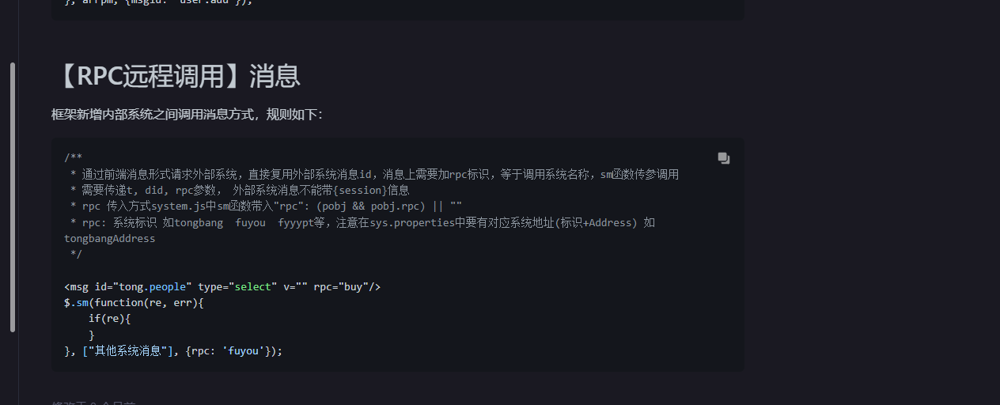

## 插件类型

在系统管理中配置好对应的插件字典，请求接口去获取对应的字典

再去请求接口
`w_dict_data.getPluginTypeDict`

## 适用端和适用角色

如果配置需要修改的文件 agent_add_edit.js     node_add_edit.js  这两个文件主要设计到了

目前来说，这部分是写死的，然后需要考虑的问题是：

### 需要考虑的问题

1. 如何远程调用别的系统？

   文档中好像有rpc去远程调用别的系统的消息  
   

2. 调用后得到的数据如何完美的适配当前全局配置的数据结构？

## RPC远程调用

