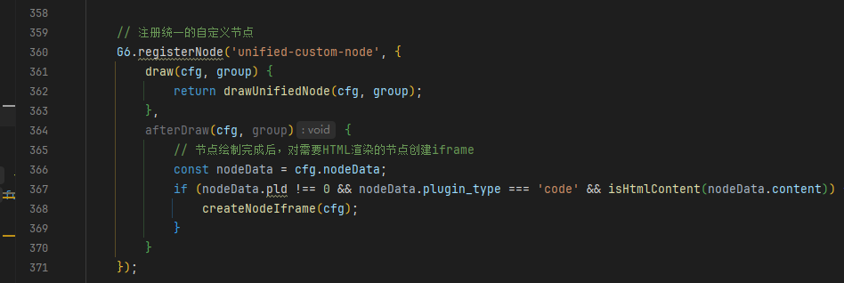

需要重构为5版本的话

就需要修改两个文件   `node_graph.js`    和  `node_graph_web.js` 

**重要说明：插件开发，只需要能够渲染出node中的content** 具体的数据，原型中的具体数据会由别的系统的开发人员去开发，给到我相应的html 整体的代码， 然后我去添加到content即可

>
> 不使用overlay，而是直接渲染html,当前的4.x版本无法满足，需要使用5.x版本，但是5版本的API变化太大，针对该文件主要的差距就是注册节点和addData，准备数据是一致的，然后graph.addShape是F6的方式，因此理论上不受影响，在创建节点的时候，需要根据nodeData.pld 是否为0 为0 表示没有关联插件，那么就可以走自定义的节点也就是custom-node, 反之是关联着插件的，还需要判断plugin_type是否为code，满足则需要将节点的type设置为5版本的html ,然后根据html类型的节点去渲染nodeData中的content，因为content的内容存储的就是html，该如何重构，换一种思路，如果插件类型为code类型，能不能使用iframe去潜入一个content

## 后台管理端

## 幼儿园管理端

先重构一下管理端的，昨天开会谈到了可以使用iframe直接将内嵌到节点里面，
之前执迷于使用HTML类型的节点去渲染相应的html,也就导致了遇到很多问题，配合着官方的文档去使用相应的API
会经常报一个错误，t is not a function   但是min.js中的又不可能修改，关键也是看不懂
所以考虑使用iframe沙箱去实现：

效果：

### 存在的问题

使用iframe去实现了之后，content的内容并没有完全覆盖节点标题之上的空间，原本的节点的点击边框颜色发生改变

当点击的时候出来了在画布上显示了多个iframe

这里面有几个需要优化的地方：**1，code类型的插件节点使用的也是自定义节点，那么就可以合并统一使用，只是针对不同的plugin_type去渲染就行。2. 存在bug,初始化渲染iframe的时候没问题，但是当点击后，画布上会出现多个渲染iframe，对于渲染iframe的区域的点击可以先不做处理。3. 渲染的content应该完整的显示在框里，而不是放大后才能显示完整内容**

#### 都是用自定义节点去渲染，而不是最开始就区分

draw(cfg,group)  用其渲染含有封面的普通内容

## 适用角色 --->   适用职务