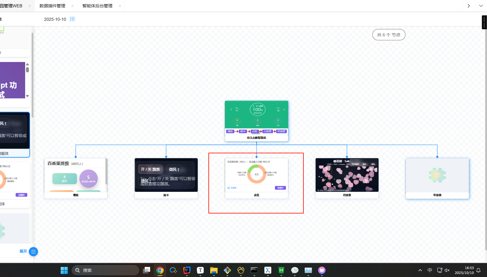

前面使用iframe去渲染出来了相应的内容

但是没有规范，导致样式很丑陋

需要设计一个规范来满足pc端和H5端节点的显示效果：


# 节点HTML内容规范

## 一、尺寸规范

### 1.1 节点尺寸定义

- **H5模式**: 180px × 140px (标题高度25px)
- **Web模式**: 280px × 180px (标题高度30px)

### 1.2 内容区域可用尺寸

- **H5模式内容区**: 180px × 115px (140 - 25)
- **Web模式内容区**: 280px × 150px (180 - 30)

### 1.3 缩放适配

由于iframe使用了 `transform: scale(0.8)` 缩放，实际渲染尺寸需要考虑：

- **渲染宽度**: 125% (1 / 0.8)
- **渲染高度**: 125%

因此，实际HTML容器尺寸应为：

- **H5模式**: 225px × 144px (180×1.25 × 115×1.25)
- **Web模式**: 350px × 188px (280×1.25 × 150×1.25)

------

## 二、HTML模板规范

### 2.1 完整HTML模板 (自带 `<!DOCTYPE>` 和 `<html>`)

```html
<!DOCTYPE html>
<html lang="zh-CN">
<head>
    <meta charset="UTF-8">
    <meta name="viewport" content="width=device-width, initial-scale=1.0">
    <title>节点内容</title>
    <style>
        * {
            margin: 0;
            padding: 0;
            box-sizing: border-box;
        }
        
        body {
            width: 350px;          /* Web模式宽度 */
            min-width: 225px;      /* H5模式最小宽度 */
            height: 188px;         /* Web模式高度 */
            min-height: 144px;     /* H5模式最小高度 */
            font-family: -apple-system, BlinkMacSystemFont, "Segoe UI", Arial, sans-serif;
            font-size: 12px;
            line-height: 1.5;
            color: #333;
            overflow: auto;
            padding: 8px;
        }
        
        /* 响应式适配 */
        @media (max-width: 225px) {
            body {
                width: 225px;
                height: 144px;
                font-size: 10px;
                padding: 6px;
            }
        }
        
        /* 图片适配 */
        img {
            max-width: 100%;
            height: auto;
            display: block;
        }
        
        /* 标题样式 */
        h1, h2, h3, h4, h5, h6 {
            font-size: 14px;
            margin-bottom: 8px;
            font-weight: 600;
        }
        
        /* 段落样式 */
        p {
            margin-bottom: 8px;
        }
        
        /* 列表样式 */
        ul, ol {
            padding-left: 20px;
            margin-bottom: 8px;
        }
        
        li {
            margin-bottom: 4px;
        }
    </style>
</head>
<body>
    <!-- 在此处放置您的内容 -->
    <h2>示例标题</h2>
    <p>这是一段示例文本内容，展示如何在节点中显示信息。</p>
    <ul>
        <li>列表项 1</li>
        <li>列表项 2</li>
        <li>列表项 3</li>
    </ul>
</body>
</html>
```

### 2.2 片段HTML模板 (仅 `<body>` 内容)

当提供片段HTML时，系统会自动包装。你只需要提供body内容：

```html
<div style="padding: 8px;">
    <h2>示例标题</h2>
    <p>这是片段HTML内容。</p>
    <div style="background: #f0f0f0; padding: 8px; border-radius: 4px;">
        <strong>提示:</strong> 这种方式更简洁
    </div>
</div>
```

------

## 三、样式建议

### 3.1 字体大小建议

- **主标题**: 14px - 16px
- **副标题**: 12px - 14px
- **正文**: 11px - 12px
- **辅助文本**: 10px - 11px

### 3.2 间距建议

- **外边距**: 4px - 8px
- **内边距**: 6px - 12px
- **行高**: 1.4 - 1.6

### 3.3 颜色建议

- **主文本**: #333, #000
- **次要文本**: #666, #999
- **链接**: #1890ff
- **成功**: #52c41a
- **警告**: #fa8c16
- **错误**: #f5222d

### 3.4 布局建议

- 使用 Flexbox 或 Grid 进行布局
- 避免使用固定定位 (fixed)
- 内容超出时使用 `overflow: auto` 或 `overflow: hidden`

------

## 四、最佳实践示例

### 4.1 卡片式布局

```html
<!DOCTYPE html>
<html lang="zh-CN">
<head>
    <meta charset="UTF-8">
    <meta name="viewport" content="width=device-width, initial-scale=1.0">
    <style>
        * { margin: 0; padding: 0; box-sizing: border-box; }
        body {
            width: 350px;
            min-width: 225px;
            height: 188px;
            min-height: 144px;
            padding: 12px;
            font-family: Arial, sans-serif;
        }
        .card {
            background: linear-gradient(135deg, #667eea 0%, #764ba2 100%);
            border-radius: 8px;
            padding: 16px;
            color: white;
            height: 100%;
            display: flex;
            flex-direction: column;
            justify-content: space-between;
        }
        .card-title {
            font-size: 16px;
            font-weight: bold;
            margin-bottom: 8px;
        }
        .card-value {
            font-size: 24px;
            font-weight: bold;
        }
        .card-desc {
            font-size: 11px;
            opacity: 0.9;
        }
    </style>
</head>
<body>
    <div class="card">
        <div class="card-title">总销售额</div>
        <div class="card-value">¥126,560</div>
        <div class="card-desc">较上周增长 12.5%</div>
    </div>
</body>
</html>
```

### 4.2 数据展示布局

```html
<div style="padding: 12px; height: 100%;">
    <div style="display: flex; justify-content: space-between; margin-bottom: 12px;">
        <span style="color: #666; font-size: 11px;">当前状态</span>
        <span style="color: #52c41a; font-size: 11px; font-weight: bold;">● 正常运行</span>
    </div>
    <div style="background: #f5f5f5; border-radius: 6px; padding: 10px;">
        <div style="font-size: 20px; font-weight: bold; color: #333; margin-bottom: 4px;">1,234</div>
        <div style="font-size: 10px; color: #999;">活跃用户数</div>
    </div>
    <div style="margin-top: 12px; font-size: 10px; color: #666;">
        更新时间: 2025-10-10 14:30
    </div>
</div>
```

### 4.3 图表容器布局

```html
<div style="padding: 8px; height: 100%; display: flex; flex-direction: column;">
    <div style="font-size: 12px; font-weight: bold; margin-bottom: 8px; color: #333;">
        访问趋势
    </div>
    <div style="flex: 1; background: #fafafa; border-radius: 4px; padding: 8px;">
        <!-- 图表内容区域 -->
        <canvas id="myChart" style="width: 100%; height: 100%;"></canvas>
    </div>
</div>
```

------

## 五、注意事项

### 5.1 禁止使用的特性

- ❌ `localStorage` / `sessionStorage` (不支持)
- ❌ 固定定位 (`position: fixed`)
- ❌ 过大的图片或资源
- ❌ 外部资源 (除了 cdnjs.cloudflare.com)

### 5.2 推荐使用的特性

- ✅ 内联样式或 `<style>` 标签
- ✅ 响应式设计
- ✅ Flexbox / Grid 布局
- ✅ CSS渐变和动画
- ✅ SVG图形

### 5.3 性能优化

- 保持HTML结构简洁
- 避免复杂的CSS选择器
- 图片使用 Base64 或外部CDN
- 避免大量DOM操作

------

## 六、调试技巧

### 6.1 边界测试

```html
<!-- 添加边界线进行测试 -->
<body style="border: 2px solid red;">
    <!-- 内容 -->
</body>
```

### 6.2 尺寸检查

```html
<div style="position: absolute; top: 0; right: 0; background: rgba(0,0,0,0.7); color: white; padding: 4px; font-size: 10px;">
    350×188
</div>
```

------

## 七、快速参考

| 模式 | 节点尺寸 | 内容区  | HTML容器尺寸 |
| ---- | -------- | ------- | ------------ |
| H5   | 180×140  | 180×115 | 225×144      |
| Web  | 280×180  | 280×150 | 350×188      |

**缩放系数**: 0.8 (125%渲染)
 **最小尺寸**: 225px × 144px
 **推荐尺寸**: 350px × 188px

------

## 八、模板选择建议

- **完整HTML**: 需要自定义样式、引入外部库、复杂交互
- **片段HTML**: 简单内容展示、快速开发、系统自动包装

选择合适的模板类型，将内容放入 `<body>` 标签即可完成适配!


# 成功的适配

```html
<!DOCTYPE html>
<html lang="zh-CN">
<head>
    <meta charset="UTF-8">
    <meta name="viewport" content="width=device-width, initial-scale=1.0">
    <title>环形图数据展示</title>
    <style>
        * {
            margin: 0;
            padding: 0;
            box-sizing: border-box;
        }
        
        body {
            width: 100vw;
            height: 100vh;
            font-family: -apple-system, BlinkMacSystemFont, "Segoe UI", Arial, sans-serif;
            background: #fff;
            padding: 3.5vw;
            display: flex;
            flex-direction: column;
            overflow: hidden;
        }
        
        .header {
            font-size: 3.4vw;
            color: #333;
            margin-bottom: 2.8vh;
            font-weight: 500;
            line-height: 1.3;
        }
        
        .chart-container {
            flex: 1;
            display: flex;
            align-items: center;
            justify-content: center;
            position: relative;
            min-height: 0;
        }
        
        .donut-chart {
            position: relative;
            width: 34vw;
            height: 34vw;
            max-width: 63vh;
            max-height: 63vh;
        }
        
        .donut-svg {
            transform: rotate(-90deg);
            width: 100%;
            height: 100%;
        }
        
        .center-text {
            position: absolute;
            top: 50%;
            left: 50%;
            transform: translate(-50%, -50%);
            text-align: center;
            font-size: 4vw;
            color: #666;
            font-weight: 500;
        }
        
        .label {
            position: absolute;
            font-size: 2.8vw;
            color: #333;
            display: flex;
            flex-direction: column;
            align-items: center;
            text-align: center;
            line-height: 1.4;
        }
        
        .label-value {
            font-weight: 600;
            color: #333;
            margin-top: 0.5vh;
            font-size: 3vw;
        }
        
        .label-desc {
            color: #666;
            white-space: nowrap;
        }
        
        .label-left {
            left: -13.7vw;
            top: 50%;
            transform: translateY(-50%);
        }
        
        .label-right {
            right: -14.8vw;
            top: 50%;
            transform: translateY(-50%);
        }
        
        .footer {
            display: flex;
            justify-content: space-between;
            align-items: center;
            margin-top: 2.8vh;
            padding-top: 2.2vh;
            border-top: 1px solid #f0f0f0;
        }
        
        .link {
            display: flex;
            align-items: center;
            font-size: 3.1vw;
            color: #1890ff;
            text-decoration: none;
            cursor: pointer;
        }
        
        .link:hover {
            color: #40a9ff;
        }
        
        .link-icon {
            width: 4vw;
            height: 4vw;
            margin-right: 1.2vw;
        }
        
        .btn {
            background: #7c5cef;
            color: white;
            border: none;
            padding: 1.4vh 4vw;
            border-radius: 1.2vw;
            font-size: 3.1vw;
            cursor: pointer;
            transition: background 0.3s;
            white-space: nowrap;
        }
        
        .btn:hover {
            background: #6a4dd4;
        }
    </style>
</head>
<body>
    <div class="header">百香果项目（54人）：应出勤人次数 150人次</div>
    
    <div class="chart-container">
        <div class="donut-chart">
            <svg class="donut-svg" viewBox="0 0 120 120" preserveAspectRatio="xMidYMid meet">
                <!-- 背景圆环 -->
                <circle cx="60" cy="60" r="45" fill="none" stroke="#f0f0f0" stroke-width="18"/>
                
                <!-- 橙色部分 (实际出勤) - 80% -->
                <circle cx="60" cy="60" r="45" fill="none" stroke="#ffbb96" stroke-width="18"
                        stroke-dasharray="226 283" stroke-linecap="round"/>
                
                <!-- 绿色部分 (缺勤) - 45% -->
                <circle cx="60" cy="60" r="45" fill="none" stroke="#95de64" stroke-width="18"
                        stroke-dasharray="127 382" stroke-dashoffset="-226" stroke-linecap="round"/>
            </svg>
            
            <div class="center-text">9月</div>
            
            <!-- 左侧标签 -->
            <div class="label label-left">
                <span class="label-desc">缺勤人次数</span>
                <span class="label-value">43/45%</span>
            </div>
            
            <!-- 右侧标签 -->
            <div class="label label-right">
                <span class="label-desc">实际出勤人次数</span>
                <span class="label-value">98/80%</span>
            </div>
        </div>
    </div>
    
    <div class="footer">
        <a href="javascript:void(0);" class="link" onclick="alert('查看月报表')">
            <svg class="link-icon" viewBox="0 0 1024 1024" fill="currentColor">
                <path d="M832 128H640v64h146.752L521.344 457.344l45.312 45.312L832 237.248V384h64V128z"/>
                <path d="M768 832H192V256h352v-64H160a32 32 0 0 0-32 32v640a32 32 0 0 0 32 32h640a32 32 0 0 0 32-32V480h-64v352z"/>
            </svg>
            月报表
        </a>
        <button class="btn" onclick="alert('待提作功能')">待提作</button>
    </div>
</body>
</html>
```

## 效果

