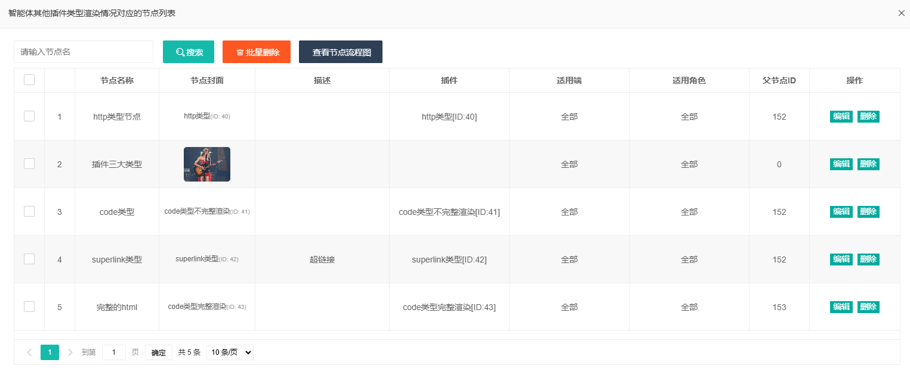

之前的样式都是在最初的没有原型的情况下设计和开发的，包含但不限于按钮样式，智能体管理、节点管理以及插件管理

## 样式修改

### 表格修改

#### 1、智能体表格修改

去除之前的花里花哨的效果，修改原有的表格样式，提高每一行的高度，让logo完整显示出来

#### 2、节点列表修改

#### 3、插件管理修改

## bug修复

### 时间维度

当添加智能体的时候，如果时间维度没有选择，那么就会出现保存不了，但是在需求中时间维度是可以不需要的

修复保存时候的关键代码

### 抽屉

现有的逻辑是如果未查到插件
