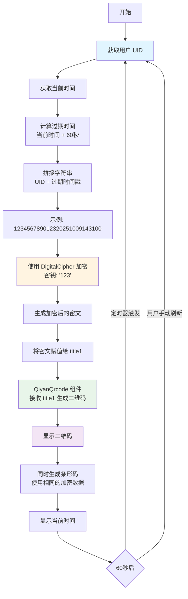
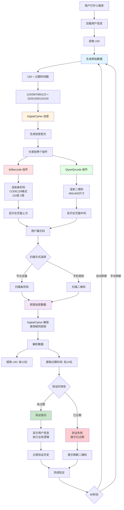

# 条形码和二维码

## 说明：

在某些场景下需要动态的生成二维码，然后进行扫码添加等操作

在UID小程序中，也就是本小程序中，在二维码页面需要


## 需要思考的问题

本小程序中是将qiyan-qrcode插件市场中获取插件后将其封装在components目录下的

1. 如何将当前uid用户的信息存储到二维码中？


------

# qiyan-qrcode  二维码

组件介绍

qiyan-qrcode 是一个功能强大的二维码生成组件，主要特点包括：

**核心功能：**

- 生成标准二维码
- 支持自定义二维码样式（颜色、大小）
- 支持添加 Logo/图标到二维码中心
- 支持保存二维码到本地相册
- 跨平台支持（H5、小程序、App）
- 高性能渲染

## 安装方式

### 方法1：通过插件市场导入

1. 在 HBuilderX 中打开你的项目
2. 访问插件市场页面，点击"导入插件"
3. 选择你的项目，确认导入

### 方法2：手动安装

将插件文件复制到项目的 `uni_modules` 目录下

### 使用案例

#### 基础使用案例

```vue
<template>
  <view class="container">
    <view class="title">二维码生成示例</view>
    
    <!-- 基础二维码 -->
    <view class="qrcode-box">
      <qiyan-qrcode 
        ref="qrcode"
        :value="qrcodeText" 
        :size="200"
      ></qiyan-qrcode>
    </view>
    
    <!-- 输入框 -->
    <view class="input-section">
      <input 
        class="input" 
        v-model="qrcodeText" 
        placeholder="请输入要生成二维码的内容"
      />
    </view>
    
    <!-- 操作按钮 -->
    <view class="button-group">
      <button class="btn" @click="generateQrcode">生成二维码</button>
      <button class="btn" @click="saveQrcode">保存到相册</button>
    </view>
  </view>
</template>

<script>
export default {
  data() {
    return {
      qrcodeText: 'https://www.example.com'
    }
  },
  methods: {
    // 生成二维码
    generateQrcode() {
      if (!this.qrcodeText) {
        uni.showToast({
          title: '请输入内容',
          icon: 'none'
        })
        return
      }
      uni.showToast({
        title: '二维码已生成',
        icon: 'success'
      })
    },
    
    // 保存二维码到相册
    saveQrcode() {
      this.$refs.qrcode.save((res) => {
        if (res.errMsg === 'saveImageToPhotosAlbum:ok') {
          uni.showToast({
            title: '保存成功',
            icon: 'success'
          })
        } else {
          uni.showToast({
            title: '保存失败',
            icon: 'none'
          })
        }
      })
    }
  }
}
</script>

<style scoped>
.container {
  padding: 40rpx;
  background-color: #f5f5f5;
  min-height: 100vh;
}

.title {
  font-size: 36rpx;
  font-weight: bold;
  text-align: center;
  margin-bottom: 40rpx;
  color: #333;
}

.qrcode-box {
  display: flex;
  justify-content: center;
  align-items: center;
  padding: 40rpx;
  background-color: #fff;
  border-radius: 20rpx;
  margin-bottom: 40rpx;
  box-shadow: 0 4rpx 12rpx rgba(0,0,0,0.1);
}

.input-section {
  margin-bottom: 40rpx;
}

.input {
  width: 100%;
  height: 80rpx;
  padding: 0 30rpx;
  background-color: #fff;
  border-radius: 10rpx;
  font-size: 28rpx;
  box-sizing: border-box;
}

.button-group {
  display: flex;
  justify-content: space-between;
  gap: 20rpx;
}

.btn {
  flex: 1;
  height: 80rpx;
  line-height: 80rpx;
  background-color: #007aff;
  color: #fff;
  border-radius: 10rpx;
  font-size: 28rpx;
  border: none;
}

.btn:active {
  opacity: 0.8;
}
</style>
```

#### 高级使用案例（自定义样式 + Logo）

```vue
<template>
  <view class="page">
    <view class="header">自定义二维码样式</view>
    
    <!-- 二维码展示区 -->
    <view class="qrcode-container">
      <qiyan-qrcode 
        ref="customQrcode"
        :value="qrcodeData" 
        :size="qrcodeSize"
        :colorDark="colorDark"
        :colorLight="colorLight"
        :logo="logoUrl"
        :logoSize="logoSize"
      ></qiyan-qrcode>
    </view>
    
    <!-- 配置区域 -->
    <view class="config-section">
      <!-- 二维码内容 -->
      <view class="config-item">
        <text class="label">二维码内容：</text>
        <input 
          class="config-input" 
          v-model="qrcodeData" 
          placeholder="输入网址或文本"
        />
      </view>
      
      <!-- 二维码大小 -->
      <view class="config-item">
        <text class="label">大小：{{qrcodeSize}}px</text>
        <slider 
          :value="qrcodeSize" 
          min="150" 
          max="300" 
          @change="onSizeChange"
          activeColor="#007aff"
        />
      </view>
      
      <!-- 前景色 -->
      <view class="config-item">
        <text class="label">前景色：</text>
        <picker mode="selector" :range="colorOptions" @change="onDarkColorChange">
          <view class="picker">
            <view class="color-preview" :style="{backgroundColor: colorDark}"></view>
            <text>{{colorDark}}</text>
          </view>
        </picker>
      </view>
      
      <!-- 背景色 -->
      <view class="config-item">
        <text class="label">背景色：</text>
        <picker mode="selector" :range="colorOptions" @change="onLightColorChange">
          <view class="picker">
            <view class="color-preview" :style="{backgroundColor: colorLight}"></view>
            <text>{{colorLight}}</text>
          </view>
        </picker>
      </view>
      
      <!-- Logo设置 -->
      <view class="config-item">
        <text class="label">Logo大小：{{logoSize}}px</text>
        <slider 
          :value="logoSize" 
          min="20" 
          max="60" 
          @change="onLogoSizeChange"
          activeColor="#007aff"
        />
      </view>
      
      <!-- 开关控制 -->
      <view class="config-item">
        <text class="label">显示Logo</text>
        <switch :checked="showLogo" @change="onLogoToggle" color="#007aff"/>
      </view>
    </view>
    
    <!-- 操作按钮 -->
    <view class="action-buttons">
      <button class="action-btn primary" @click="generateQrcode">重新生成</button>
      <button class="action-btn success" @click="saveToAlbum">保存图片</button>
      <button class="action-btn warning" @click="shareQrcode">分享</button>
    </view>
    
    <!-- 预设模板 -->
    <view class="templates">
      <view class="template-title">快速模板</view>
      <view class="template-list">
        <view 
          class="template-item" 
          v-for="(template, index) in templates" 
          :key="index"
          @click="applyTemplate(template)"
        >
          <view class="template-name">{{template.name}}</view>
        </view>
      </view>
    </view>
  </view>
</template>

<script>
export default {
  data() {
    return {
      qrcodeData: 'https://uniapp.dcloud.io',
      qrcodeSize: 200,
      colorDark: '#000000',
      colorLight: '#ffffff',
      logoUrl: '/static/logo.png', // 替换为你的Logo路径
      logoSize: 40,
      showLogo: true,
      
      colorOptions: ['#000000', '#ff0000', '#00ff00', '#0000ff', '#ff00ff', '#00ffff', '#ffffff'],
      
      templates: [
        { name: '经典黑白', colorDark: '#000000', colorLight: '#ffffff' },
        { name: '蓝色主题', colorDark: '#007aff', colorLight: '#e6f2ff' },
        { name: '绿色主题', colorDark: '#34c759', colorLight: '#e8f8ec' },
        { name: '红色主题', colorDark: '#ff3b30', colorLight: '#ffe8e6' },
        { name: '紫色主题', colorDark: '#5856d6', colorLight: '#eeeefc' }
      ]
    }
  },
  
  methods: {
    // 大小改变
    onSizeChange(e) {
      this.qrcodeSize = e.detail.value
    },
    
    // 前景色改变
    onDarkColorChange(e) {
      this.colorDark = this.colorOptions[e.detail.value]
    },
    
    // 背景色改变
    onLightColorChange(e) {
      this.colorLight = this.colorOptions[e.detail.value]
    },
    
    // Logo大小改变
    onLogoSizeChange(e) {
      this.logoSize = e.detail.value
    },
    
    // Logo开关
    onLogoToggle(e) {
      this.showLogo = e.detail.value
      this.logoUrl = this.showLogo ? '/static/logo.png' : ''
    },
    
    // 生成二维码
    generateQrcode() {
      if (!this.qrcodeData.trim()) {
        uni.showToast({
          title: '请输入二维码内容',
          icon: 'none'
        })
        return
      }
      
      uni.showToast({
        title: '二维码已更新',
        icon: 'success',
        duration: 1500
      })
    },
    
    // 保存到相册
    saveToAlbum() {
      uni.showLoading({ title: '保存中...' })
      
      this.$refs.customQrcode.save((res) => {
        uni.hideLoading()
        
        if (res.errMsg === 'saveImageToPhotosAlbum:ok') {
          uni.showToast({
            title: '保存成功',
            icon: 'success'
          })
        } else {
          uni.showModal({
            title: '提示',
            content: '保存失败，请检查相册权限',
            showCancel: false
          })
        }
      })
    },
    
    // 分享二维码
    shareQrcode() {
      uni.showShareMenu({
        title: '分享二维码',
        success: () => {
          console.log('分享成功')
        }
      })
    },
    
    // 应用模板
    applyTemplate(template) {
      this.colorDark = template.colorDark
      this.colorLight = template.colorLight
      
      uni.showToast({
        title: `已应用${template.name}`,
        icon: 'success',
        duration: 1500
      })
    }
  }
}
</script>

<style scoped>
.page {
  background-color: #f8f8f8;
  min-height: 100vh;
  padding: 30rpx;
}

.header {
  font-size: 40rpx;
  font-weight: bold;
  text-align: center;
  margin-bottom: 30rpx;
  color: #333;
}

.qrcode-container {
  display: flex;
  justify-content: center;
  align-items: center;
  padding: 50rpx;
  background-color: #fff;
  border-radius: 20rpx;
  margin-bottom: 30rpx;
  box-shadow: 0 4rpx 20rpx rgba(0,0,0,0.08);
}

.config-section {
  background-color: #fff;
  border-radius: 20rpx;
  padding: 30rpx;
  margin-bottom: 30rpx;
}

.config-item {
  display: flex;
  align-items: center;
  justify-content: space-between;
  margin-bottom: 30rpx;
}

.config-item:last-child {
  margin-bottom: 0;
}

.label {
  font-size: 28rpx;
  color: #333;
  min-width: 150rpx;
}

.config-input {
  flex: 1;
  height: 60rpx;
  padding: 0 20rpx;
  background-color: #f5f5f5;
  border-radius: 10rpx;
  font-size: 26rpx;
}

.picker {
  display: flex;
  align-items: center;
  gap: 10rpx;
  padding: 10rpx 20rpx;
  background-color: #f5f5f5;
  border-radius: 10rpx;
}

.color-preview {
  width: 40rpx;
  height: 40rpx;
  border-radius: 50%;
  border: 2rpx solid #ddd;
}

.action-buttons {
  display: flex;
  gap: 20rpx;
  margin-bottom: 30rpx;
}

.action-btn {
  flex: 1;
  height: 80rpx;
  line-height: 80rpx;
  border-radius: 10rpx;
  font-size: 28rpx;
  color: #fff;
  border: none;
}

.primary {
  background-color: #007aff;
}

.success {
  background-color: #34c759;
}

.warning {
  background-color: #ff9500;
}

.templates {
  background-color: #fff;
  border-radius: 20rpx;
  padding: 30rpx;
}

.template-title {
  font-size: 32rpx;
  font-weight: bold;
  margin-bottom: 20rpx;
  color: #333;
}

.template-list {
  display: flex;
  flex-wrap: wrap;
  gap: 20rpx;
}

.template-item {
  flex: 0 0 calc(50% - 10rpx);
  height: 80rpx;
  display: flex;
  align-items: center;
  justify-content: center;
  background: linear-gradient(135deg, #667eea 0%, #764ba2 100%);
  border-radius: 10rpx;
  box-shadow: 0 4rpx 12rpx rgba(102, 126, 234, 0.3);
}

.template-item:active {
  opacity: 0.8;
  transform: scale(0.98);
}

.template-name {
  font-size: 28rpx;
  color: #fff;
  font-weight: 500;
}
</style>
```

### 主要属性说明

| 属性       | 类型   | 默认值    | 说明                   |
| ---------- | ------ | --------- | ---------------------- |
| value      | String | -         | 二维码内容（必填）     |
| size       | Number | 200       | 二维码大小（单位：px） |
| colorDark  | String | `#000000` | 前景色（二维码颜色）   |
| colorLight | String | `#ffffff` | 背景色                 |
| logo       | String | -         | Logo图片路径           |
| logoSize   | Number | 40        | Logo大小               |
| margin     | Number | 0         | 边距                   |

### 常用方法

```javascript
// 保存二维码到相册
this.$refs.qrcode.save((res) => {
  if (res.errMsg === 'saveImageToPhotosAlbum:ok') {
    console.log('保存成功')
  }
})

// 获取二维码临时路径
this.$refs.qrcode.getImagePath((path) => {
  console.log('二维码路径：', path)
})
```

### 实际应用场景

1. **分享功能** - 生成分享链接二维码
2. **收款码** - 生成支付二维码
3. **名片** - 生成个人信息二维码
4. **产品溯源** - 生成产品追溯二维码
5. **签到** - 生成活动签到二维码

### 注意事项

1. **权限配置** - 保存图片需要在 `manifest.json` 中配置相册权限
2. **Logo尺寸** - Logo不宜过大，建议不超过二维码尺寸的1/4
3. **颜色对比** - 前景色和背景色需要有足够对比度，确保可识别
4. **内容限制** - 二维码内容过多会增加复杂度，影响识别率

------

# UID小程序实践 二维码

## 参考组件 erweima\index.vue

```vue
<template>
	<view>
		<view class="top-bgview">
			<image src="/static/image/home/indexbg.png" style="width: 100%;height: 700rpx;"></image>
			<view style="text-align: center;position: absolute;top:30rpx;left: 0;right: 0;">
				<view class="weui-cell">
					<image src="/static/image/home/img_default.png"
						style="width:121rpx;height: 121rpx; margin-right: 20rpx; border-radius: 5px;">
					</image>
					<view class="weui-cell__bd"
						style="align-items: flex-start;flex-direction: column; text-align: left;">
						<view style="font-size: 48rpx;color: #FFFFFF;">
							优爱弟
						</view>
					</view>
				</view>
			</view>
			<view style="text-align: center;position: absolute;top:200rpx;left: 0;right: 0;">
				<view class="weui-cells panel-view">

					<view class="weui-cell__bd">
						<view class="weui-cell" style="    padding: 15px 15px 5px 15px;">
							<view class="weui-cell__bd weui-flex" style="align-items: center;">
								<view><text class="grayrtxt">姓名</text>{{name}}</view>
							</view>
							<view class="weui-cell__ft ">
								<image v-if="uidusercount>1" @click="btnchangeuid()"
									src="/static/image/home/qiehuan.png" style="width:41rpx;height: 41rpx; ">
								</image>
							</view>
						</view>
						<view class="weui-cell">
							<view class="weui-cell__bd weui-flex" style="align-items: center;">
								<view><text class="grayrtxt">UID 号</text>
									<block v-if="mackunionidchar">{{makechar_unionid}}</block>
									<block v-else>{{unionid}}</block>
									<image v-if="!mackunionidchar" src="/static/image/home/documents.png"
										style="width:31rpx;height:31rpx; margin-left: 20rpx; "
										@click="copyToClipboard(unionid)">
									</image>
								</view>
							</view>
							<view class="weui-cell__ft " @click="viewunionid()">
								<image v-if="mackunionidchar" src="/static/image/home/eye_close_fill.png"
									style="width:41rpx;height: 41rpx; ">
								</image>
								<image v-else src="/static/image/home/eye_fill.png" style="width:41rpx;height: 41rpx; ">
								</image>
							</view>
						</view>
					</view>
					<fui-bottom-popup :show="showchangeuid" @close="closePopup()">
						<view class="fui-scroll__wrap">
							<view class="fui-title fui-title__pb"></view>
							<scroll-view scroll-y class="fui-scroll__view">

								<view class="shadow-content1"
									style="padding: 0;background: #ffffff;border-radius: 24rpx 24rpx 0 0;">
									<view class="bodyshape-txt" style="padding: 0 40rpx 0 40rpx;">
										<view class="sel-class">
											<block v-for="(item, index) in arruid" :key="index">
												<view class="classlist" @click="setuiddefault(item.id)">
													<text>{{item.name}}</text>
													<label v-if="item.id==currentuid" class="radio radio-cell"
														style="right: 10px; position: absolute;">
														<view class="radio_style checkbox_style">
															<radio checked></radio>
														</view>
													</label>
												</view>
											</block>
											<view class="classlist current" @click="btnadd()"><text>+添加UID</text>
											</view>
										</view>
									</view>
								</view>
							</scroll-view>
						</view>
					</fui-bottom-popup>
					<view class="barcode">
						<tkiBarcode cid="code128" :loadMake="false" :opations="opations" :onval="true" format="code128"
							:val="barresult" />
					</view>
					<view class="codeimg" style="text-align: center;">
						<QiyanQrcode :text="title1" :size="size"></QiyanQrcode>
					</view>
					<view class="timetxt">{{nowtime}}</view>
					<view class="refreshcode weui-flex_center" @click="btnsetqrcode()">
						<image src="/static/image/home/reload.png"
							style="width:25rpx;height: 25rpx; margin-right: 5px;">刷新二维码
					</view>
				</view>
			</view>
		</view>
		<fsz-modal :show="showadd" title="请先添加UID" :buttons="buttons" style="font-size: 30rpx;">
			<view class="modal-content">
				<view class="buttons">
					<button type="primary" plain="true" @click="btnadd()"
						style="font-size: 32rpx;color: #60CABB;text-decoration-line: underline; border: none;;">立即前往</button>
				</view>
			</view>
		</fsz-modal>
	</view>
</template>

<script>
	import fszmodal from "@/components/fsz-modal/fsz-modal.vue"
	import QiyanQrcode from "@/components/qiyan-qrcode/qiyan-qrcode.vue"
	import tkiBarcode from "@/components/tki-barcode/tki-barcode.vue"
	import DigitalCipher from "@/common/DigitalCipher.js"
	var moment = require("@/common/moment.min.js");
	const app = getApp();
	export default {
		data() {
			return {
				showadd: false,
				showaddtype: false,
				showguanxi: false,
				tag: "",
				buttons: [],
				name: "",
				unionid: "",
				uidusercount: 0,
				showchangeuid: false,
				arruid: [],
				title1: "",
				barresult: "0",
				opations: {
					width: 4, //设置条之间的宽度
					height: 120, //高度
					displayValue: true, //是否在条形码下方显示文字
					textAlign: "left", //设置文本的水平对齐方式
					textPosition: "bottom", //设置文本的垂直位置
					textMargin: 0, //设置条形码和文本之间的间距
					background: "#FFFFFF", //设置条形码的背景色
					margin: 0, //设置条形码周围的空白边距
				},
				size: 460,
				onval: true,
				nowtime: "",
				cid: "cid",
				currentuid: 0,
				macknamechar: true,
				mackunionidchar: true,
				makechar_name: "",
				makechar_unionid: "",
				t: null,
				ttime: 1 * 60 * 1000,
			}
		},
		onLoad: async function(params) {
			// #ifdef MP-WEIXIN
			uni.checkSession({
				success: function(res) {
					if (res.errMsg != 'login:ok') {
						uni.login(); //重新登录　
					}
				},
				fail: function(res) {
					console.log(JSON.stringify(res));
					uni.login(); //重新登录　
				}
			});
			// await app.globalData.getOpenid();
			// #endif
			this.initdata();
		},
		components: {
			fszmodal,
			QiyanQrcode,
			tkiBarcode,
		},
		methods: {
			initdata: function(callback) {
				var _this = this;
				uni.showLoading();
				uni.sm(function(re, err, obj) {
					uni.hideLoading();
					if (err) {
						uni.msg("查询失败");
					} else {
						if (obj && obj.id) {
							_this.currentuid = obj.id;
							_this.name = obj.name;
							_this.unionid = obj.unionid;
							_this.makechar_name = _this.makecharname(_this.name);
							_this.makechar_unionid = _this.unionid.substring(0, 7) + "******" + _this.unionid
								.substring(13);
							_this.showadd = false;
							_this.getalluiduser(true);
							_this.setqrcode();
							if (_this.t) {
								clearInterval(_this.t);
							}
							_this.t = setInterval(function() {
								_this.setqrcode();
							}, _this.ttime);
						} else {
							_this.showadd = true;
						}
						callback && callback();
					}
				}, ["wx.uiduser.defaultdetail"], {
					route: uni.svs.auth
				});
			},
			makecharname: function(str) {
				var result = "";
				result += str.substring(0, 1);
				for (var i = 1; i < str.length; i++) {
					result += "*"
				}
				return result;
			},
			viewname: function() {
				if (this.macknamechar) {
					this.macknamechar = false;
				} else {
					this.macknamechar = true;
				}
			},
			viewunionid: function() {
				if (this.mackunionidchar) {
					this.mackunionidchar = false;
				} else {
					this.mackunionidchar = true;
				}
			},
			btnsetqrcode: function() {
				var _this = this;
				_this.setqrcode();
				if (_this.t) {
					clearInterval(_this.t);
				}
				_this.t = setInterval(function() {
					_this.setqrcode();
				}, _this.ttime);
			},
			setqrcode() {
				var strcode = this.unionid + moment().add("s", 60).format("YYYYMMDDHHmmss");
				this.title1 = strcode;
				this.nowtime = moment().format("YYYY年MM月DD日 HH:mm:ss");
				var cipher = new DigitalCipher("123");
				const encrypted = cipher.enhancedEncrypt(strcode);
				this.title1 = encrypted;

				// cipher = new DigitalCipher("123");
				// const decrypted = cipher.enhancedDecrypt(this.title1);
				// this.title1 = decrypted;

				this.opations = {
					height: 110,
					width: 3,
					displayValue: false,
					text: this.title1
				};
			},
			getalluiduser: function(getcount) {
				var _this = this;
				uni.showLoading();
				uni.sm(function(re, err) {
					uni.hideLoading();
					if (err) {
						uni.msg("查询失败");
					} else {
						if (getcount) {
							_this.uidusercount = re.length;
						} else {
							_this.arruid = [];
							_this.arruid = _this.arruid.concat(re);
						}
					}
				}, ["wx.uiduser.getall"], {
					route: uni.svs.auth
				});
			},
			btnchangeuid: function() {
				this.showchangeuid = true;
				this.getalluiduser();
			},
			closePopup() {
				this.showchangeuid = false;
			},
			setuiddefault: function(id) {
				var _this = this;
				uni.showLoading();
				uni.sm(function(re, err) {
					uni.hideLoading();
					if (err) {
						uni.msg("切换失败");
					} else {
						_this.initdata(function() {
							_this.showchangeuid = false;
							uni.msg("切换成功");
							_this.callTabbarMethod();
						});
					}
				}, ["wx.xcxuseruiduser.setdefault", uni.msgwhere({
					uiduserid: [id]
				})], {
					route: uni.svs.auth
				});
			},
			btnadd: function() {
				uni.navigateTo({
					url: '/pages/manage/uidaddtype'
				});
			},
			copyToClipboard(text) {
				// #ifdef MP
				uni.setClipboardData({
					data: text, // 要复制的文本
					success: function() {
						uni.showToast({
							title: '复制成功',
							icon: 'success',
							duration: 2000
						});
					},
					fail: function(err) {
						uni.showToast({
							title: '复制失败',
							icon: 'none',
							duration: 2000
						});
						console.error('复制失败：', err);
					}
				});
				// #endif
			},
			tabbarrefresh: function() {
				this.initdata();
			},
			callTabbarMethod() {
				const pages = getCurrentPages();
				for (let i = pages.length - 1; i >= 0; i--) {
					const page = pages[i];
					if (page.route === 'pages/tabBar/home/index') {

						if (page.$vm) {
							page.$vm.tabbarrefresh();
						}
						break;
					}
				}
			}
		}
	}
</script>


<style>
	page {
		background: #ffffff;
	}

	.weui-cell__ft {
		color: #8C8C8C;
		font-size: 20rpx;
	}

	.weui-cell__ft_in-access:after {
		border-color: #8C8C8C;
	}

	.weui-cell {
		padding: 30rpx 30rpx;
	}

	.weui-cells:after {
		border-bottom: none;
	}

	.weui-cell::before {
		right: 30rpx;
		left: 30rpx;
		border-top: none;
	}

	.weui-cells:before {
		border-top: none;
	}

	.top-bgview {
		height: 887rpx;

		overflow: hidden;
	}


	.grayrtxt {
		margin-right: 10px;
		color: #666;
	}

	.timetxt {
		font-size: 30rpx;
		color: #70CFC2;
		text-align: center;
		line-height: 30px;
	}

	.barcode {
		width: auto;
		height: 115rpx;
		text-align: center;
		margin: 10px auto;
	}

	.codeimg {
		width: 460rpx;
		height: 460rpx;
		margin: 10px auto;
	}

	.refreshcode {
		padding-bottom: 10px;
		line-height: 30px;
		font-size: 24rpx;
		color: #303030;
	}

	.sel-cell {
		margin: 20rpx 0;
	}

	.sel-class .classlist {
		background: #F2F4F5;
		border: 1px solid #EEF1F2;
		border-radius: 10rpx;
		font-size: 28rpx;
		color: #303030;
		text-align: left;
		margin: 10px 0;
		padding: 30rpx;
		position: relative;
	}

	.sel-class {
		margin-bottom: 20px;
	}

	.sel-class .classlist.current {
		color: #60CABB;
		background: #EFFAF8;
		border-radius: 10rpx;
		border: 1px solid #60CABB;
		text-align: center;
	}

	.fui-scroll__wrap {
		padding-top: 0 !important;
	}
</style>

<style>
	/* 案例一 start*/
	.fui-popup__container {
		width: 100%;
		position: relative;
		display: flex;
		justify-content: center;
		flex-direction: column;
		padding: 24rpx 32rpx;
		box-sizing: border-box;
	}

	.fui-title {
		font-size: 30rpx;
		font-weight: bold;
		text-align: center;
	}

	.fui-sub__title {
		/* #ifndef APP-NVUE */
		display: block;
		/* #endif */
		text-align: center;
		font-size: 24rpx;
		color: #7F7F7F;
		transform: scale(.9);
	}

	.fui-descr {
		font-weight: bold;
		padding-top: 64rpx;
	}

	.fui-sub__descr {
		font-size: 26rpx;
		color: #B2B2B2;
		padding: 32rpx 0;
	}

	.fui-btn__box {
		display: flex;
		justify-content: center;
		padding: 32rpx 0;
		box-sizing: border-box;
		height: 144rpx;
	}

	.fui-icon__close {
		position: absolute;
		top: 24rpx;
		left: 24rpx;
	}

	/* 案例一 end*/
	.fui-scroll__wrap {
		padding-top: 30rpx;
		position: relative;
	}

	.fui-scroll__view {
		width: 100%;
		height: 400rpx;
	}

	.fui-title__pb {
		padding-bottom: 24rpx;
	}
</style>
```

### 二维码信息生成流程

#### 1. **核心方法：`setqrcode()`**

```javascript
setqrcode() {
    // 步骤1: 生成原始字符串（UID + 60秒后的时间戳）
    var strcode = this.unionid + moment().add("s", 60).format("YYYYMMDDHHmmss");
    
    // 步骤2: 使用 DigitalCipher 加密
    var cipher = new DigitalCipher("123");
    const encrypted = cipher.enhancedEncrypt(strcode);
    
    // 步骤3: 将加密后的字符串赋值给二维码
    this.title1 = encrypted;
    
    // 步骤4: 更新当前时间显示
    this.nowtime = moment().format("YYYY年MM月DD日 HH:mm:ss");
}
```

#### 2. **信息组成结构**

```
原始数据格式：
unionid（用户UID） + 过期时间戳（当前时间+60秒）

示例：
假设 unionid = "1234567890123"
当前时间 = 2025-10-09 14:30:00
过期时间 = 2025-10-09 14:31:00

原始字符串 = "1234567890123" + "20251009143100"
            = "123456789012320251009143100"

然后通过 DigitalCipher("123") 加密
最终二维码内容 = 加密后的密文
```

#### 3. **二维码组件使用**

```vue
<QiyanQrcode :text="title1" :size="size"></QiyanQrcode>
```

- `text` 属性：传入加密后的字符串（`title1`）
- `size` 属性：二维码尺寸 460rpx

#### 4. **自动刷新机制**

```javascript
// 定时器：每1分钟刷新一次二维码
this.t = setInterval(function() {
    _this.setqrcode();
}, _this.ttime); // ttime = 1 * 60 * 1000 (1分钟)
```

#### 5. **手动刷新**

```javascript
btnsetqrcode: function() {
    var _this = this;
    _this.setqrcode();
    // 重置定时器
    if (_this.t) {
        clearInterval(_this.t);
    }
    _this.t = setInterval(function() {
        _this.setqrcode();
    }, _this.ttime);
}
```

### 完整的数据流程图




#### 1. **加密目的**

- 防止二维码被伪造
- 确保数据安全传输
- 包含时效性验证（60秒过期）

#### 2. **时效性设计**

```javascript
// 过期时间 = 当前时间 + 60秒
moment().add("s", 60).format("YYYYMMDDHHmmss")
```

这样扫码端可以验证二维码是否在有效期内

#### 3. **条形码同步**

```javascript
this.opations = {
    height: 110,
    width: 3,
    displayValue: false,
    text: this.title1  // 使用相同的加密数据
};
```

#### 4. **解密示例**（代码中已注释）

```javascript
// 扫码端解密流程
var cipher = new DigitalCipher("123");
const decrypted = cipher.enhancedDecrypt(扫描得到的密文);
// decrypted = "123456789012320251009143100"

// 解析数据
var uid = decrypted.substring(0, 13);  // 前13位是UID
var expireTime = decrypted.substring(13); // 后14位是过期时间
```

### 安全建议

你的代码中硬编码了加密密钥 `"123"`，建议改进：## 总结

你的代码将信息存储到二维码的过程是：

1. **原始数据**：`UID + 过期时间戳`
2. **加密处理**：使用 `DigitalCipher` 加密
3. **传递给组件**：通过 `:text` 属性传给 `QiyanQrcode`
4. **自动刷新**：每60秒自动重新生成

这种方式的优点是：

- ✅ 数据加密，安全性较好
- ✅ 包含时效性验证
- ✅ 自动刷新机制

需要注意的是：

- ⚠️ 加密密钥不应硬编码在代码中
- ⚠️ 建议增加更多安全验证机制（如示例代码中的改进方案）

# tki-barcode 条形码 及在UID使用

tki-barcode 是一个用于 uni-app 的条形码生成组件，支持多种条形码格式。

## 核心特点

- 支持多种条形码格式（CODE128、CODE39、EAN13、UPC 等）
- 可自定义样式（宽度、高度、颜色）
- 支持显示/隐藏条形码下方的文本
- 跨平台支持（H5、小程序、App）
- Canvas 渲染，性能优秀

## 支持的条形码格式

### 普通格式

#### 1. CODE128

- **用途**: 最常用的一维条形码，广泛应用于物流、仓储
- **特点**: 可编码所有 ASCII 字符，信息密度高
- **示例**: `123456789`

#### 2. CODE39

- **用途**: 工业、医疗、政府应用
- **特点**: 只能编码数字、大写字母和部分符号
- **示例**: `ABC123`

#### 3. EAN13

- **用途**: 商品条形码（国际标准）
- **特点**: 13位数字，用于零售商品
- **示例**: `6901234567892`

#### 4. EAN8

- **用途**: 小包装商品条形码
- **特点**: 8位数字，EAN13 的缩短版
- **示例**: `12345670`

#### 5. UPC

- **用途**: 北美商品条形码
- **特点**: 12位数字
- **示例**: `123456789012`

#### 6. ITF14

- **用途**: 物流运输包装
- **特点**: 14位数字
- **示例**: `12345678901231`

### 二维条形码

#### 7. codabar

- **用途**: 图书馆、血库、快递
- **特点**: 数字和特殊字符
- **示例**: `A123456A`

#### 8. MSI

- **用途**: 仓库、货架标签
- **特点**: 纯数字
- **示例**: `1234567`

#### 9. pharmacode

- **用途**: 制药行业
- **特点**: 3-131的整数
- **示例**: `1234`

### 格式对比

| 格式    | 字符集        | 长度 | 适用场景         |
| ------- | ------------- | ---- | ---------------- |
| CODE128 | 全ASCII       | 可变 | 物流、快递、仓储 |
| CODE39  | 数字+大写字母 | 可变 | 工业、医疗       |
| EAN13   | 数字          | 13位 | 零售商品         |
| EAN8    | 数字          | 8位  | 小商品           |
| UPC     | 数字          | 12位 | 北美商品         |
| ITF14   | 数字          | 14位 | 物流包装         |

## 代码中的详细使用

### 1. **组件引入和配置**

```vue
<template>
    <view class="barcode">
        <tkiBarcode 
            cid="code128" 
            :loadMake="false" 
            :opations="opations" 
            :onval="true" 
            format="code128"
            :val="barresult" 
        />
    </view>
</template>

<script>
import tkiBarcode from "@/components/tki-barcode/tki-barcode.vue"

export default {
    data() {
        return {
            barresult: "0",
            opations: {
                width: 4,          // 条形码线条宽度
                height: 120,       // 条形码高度
                displayValue: true, // 显示条形码下方的文字
                textAlign: "left",  // 文字水平对齐
                textPosition: "bottom", // 文字位置
                textMargin: 0,     // 条形码和文字的间距
                background: "#FFFFFF", // 背景色
                margin: 0,         // 边距
            }
        }
    }
}
</script>
```

### 2. **动态更新条形码内容**

在你的 `setqrcode()` 方法中：

```javascript
setqrcode() {
    // 1. 生成原始数据
    var strcode = this.unionid + moment().add("s", 60).format("YYYYMMDDHHmmss");
    
    // 2. 加密数据
    var cipher = new DigitalCipher("123");
    const encrypted = cipher.enhancedEncrypt(strcode);
    this.title1 = encrypted;
    
    // 3. 更新条形码配置（与二维码使用相同的加密数据）
    this.opations = {
        height: 110,
        width: 3,
        displayValue: false,  // 不显示文字（因为是加密数据）
        text: this.title1     // 使用加密后的数据
    };
}
```

### 3. **条形码与二维码的关系**

### 基础使用示例

```vue
<template>
  <view class="container">
    <view class="title">条形码生成示例</view>
    
    <!-- 条形码显示区域 -->
    <view class="barcode-wrapper">
      <tkiBarcode 
        cid="myBarcode"
        :loadMake="false"
        :options="barcodeOptions"
        :onval="true"
        :format="barcodeFormat"
        :val="barcodeValue"
      />
    </view>
    
    <!-- 控制面板 -->
    <view class="control-panel">
      <!-- 条形码内容 -->
      <view class="control-item">
        <text class="label">条形码内容：</text>
        <input 
          class="input" 
          v-model="barcodeValue" 
          placeholder="输入条形码内容"
        />
      </view>
      
      <!-- 选择格式 -->
      <view class="control-item">
        <text class="label">条形码格式：</text>
        <picker 
          mode="selector" 
          :range="formatOptions" 
          :value="formatIndex"
          @change="onFormatChange"
        >
          <view class="picker">{{barcodeFormat}}</view>
        </picker>
      </view>
      
      <!-- 高度调节 -->
      <view class="control-item">
        <text class="label">高度：{{barcodeOptions.height}}</text>
        <slider 
          :value="barcodeOptions.height" 
          min="50" 
          max="200" 
          @change="onHeightChange"
          activeColor="#007aff"
        />
      </view>
      
      <!-- 宽度调节 -->
      <view class="control-item">
        <text class="label">线条宽度：{{barcodeOptions.width}}</text>
        <slider 
          :value="barcodeOptions.width" 
          min="1" 
          max="8" 
          @change="onWidthChange"
          activeColor="#007aff"
        />
      </view>
      
      <!-- 显示文字 -->
      <view class="control-item">
        <text class="label">显示文字</text>
        <switch 
          :checked="barcodeOptions.displayValue" 
          @change="onDisplayValueChange"
          color="#007aff"
        />
      </view>
      
      <!-- 文字位置 -->
      <view class="control-item" v-if="barcodeOptions.displayValue">
        <text class="label">文字位置：</text>
        <picker 
          mode="selector" 
          :range="textPositions" 
          :value="textPosIndex"
          @change="onTextPosChange"
        >
          <view class="picker">{{barcodeOptions.textPosition}}</view>
        </picker>
      </view>
    </view>
    
    <!-- 操作按钮 -->
    <view class="button-group">
      <button class="btn primary" @click="generateBarcode">生成条形码</button>
      <button class="btn success" @click="saveBarcode">保存图片</button>
    </view>
    
    <!-- 示例模板 -->
    <view class="examples">
      <view class="example-title">快速示例</view>
      <view class="example-list">
        <view 
          class="example-item"
          v-for="(example, index) in examples"
          :key="index"
          @click="applyExample(example)"
        >
          <text class="example-name">{{example.name}}</text>
          <text class="example-desc">{{example.value}}</text>
        </view>
      </view>
    </view>
  </view>
</template>

<script>
import tkiBarcode from "@/components/tki-barcode/tki-barcode.vue"

export default {
  components: {
    tkiBarcode
  },
  
  data() {
    return {
      barcodeValue: "123456789012",
      barcodeFormat: "CODE128",
      formatIndex: 0,
      textPosIndex: 0,
      
      barcodeOptions: {
        width: 2,
        height: 100,
        displayValue: true,
        textAlign: "center",
        textPosition: "bottom",
        textMargin: 2,
        fontSize: 20,
        background: "#ffffff",
        lineColor: "#000000",
        margin: 10
      },
      
      formatOptions: [
        "CODE128",
        "CODE39",
        "EAN13",
        "EAN8",
        "UPC",
        "ITF14",
        "MSI",
        "pharmacode"
      ],
      
      textPositions: ["top", "bottom"],
      
      examples: [
        { name: "商品条码", value: "6901234567892", format: "EAN13" },
        { name: "快递单号", value: "SF1234567890", format: "CODE128" },
        { name: "图书编号", value: "A123456A", format: "codabar" },
        { name: "仓库编号", value: "WH001234", format: "CODE39" },
        { name: "UPC商品", value: "012345678905", format: "UPC" }
      ]
    }
  },
  
  methods: {
    // 格式改变
    onFormatChange(e) {
      this.formatIndex = e.detail.value
      this.barcodeFormat = this.formatOptions[e.detail.value]
      this.validateBarcodeValue()
    },
    
    // 高度改变
    onHeightChange(e) {
      this.barcodeOptions.height = e.detail.value
    },
    
    // 宽度改变
    onWidthChange(e) {
      this.barcodeOptions.width = e.detail.value
    },
    
    // 显示文字开关
    onDisplayValueChange(e) {
      this.barcodeOptions.displayValue = e.detail.value
    },
    
    // 文字位置改变
    onTextPosChange(e) {
      this.textPosIndex = e.detail.value
      this.barcodeOptions.textPosition = this.textPositions[e.detail.value]
    },
    
    // 验证条形码内容
    validateBarcodeValue() {
      const format = this.barcodeFormat
      const value = this.barcodeValue
      
      // 根据不同格式验证
      if (format === "EAN13" && value.length !== 13) {
        uni.showToast({
          title: 'EAN13需要13位数字',
          icon: 'none'
        })
        return false
      }
      
      if (format === "EAN8" && value.length !== 8) {
        uni.showToast({
          title: 'EAN8需要8位数字',
          icon: 'none'
        })
        return false
      }
      
      if (format === "UPC" && value.length !== 12) {
        uni.showToast({
          title: 'UPC需要12位数字',
          icon: 'none'
        })
        return false
      }
      
      return true
    },
    
    // 生成条形码
    generateBarcode() {
      if (!this.barcodeValue.trim()) {
        uni.showToast({
          title: '请输入条形码内容',
          icon: 'none'
        })
        return
      }
      
      if (!this.validateBarcodeValue()) {
        return
      }
      
      uni.showToast({
        title: '条形码已生成',
        icon: 'success'
      })
    },
    
    // 保存条形码
    saveBarcode() {
      // 这里需要实现保存逻辑
      // 可以通过 canvas 的 API 将条形码保存为图片
      uni.showToast({
        title: '保存功能开发中',
        icon: 'none'
      })
    },
    
    // 应用示例
    applyExample(example) {
      this.barcodeValue = example.value
      this.barcodeFormat = example.format
      this.formatIndex = this.formatOptions.indexOf(example.format)
      
      uni.showToast({
        title: `已应用${example.name}`,
        icon: 'success',
        duration: 1500
      })
    }
  }
}
</script>

<style scoped>
.container {
  padding: 30rpx;
  background-color: #f5f5f5;
  min-height: 100vh;
}

.title {
  font-size: 40rpx;
  font-weight: bold;
  text-align: center;
  margin-bottom: 30rpx;
  color: #333;
}

.barcode-wrapper {
  background-color: #fff;
  padding: 40rpx;
  border-radius: 20rpx;
  margin-bottom: 30rpx;
  display: flex;
  justify-content: center;
  align-items: center;
  box-shadow: 0 4rpx 20rpx rgba(0,0,0,0.08);
}

.control-panel {
  background-color: #fff;
  border-radius: 20rpx;
  padding: 30rpx;
  margin-bottom: 30rpx;
}

.control-item {
  display: flex;
  align-items: center;
  justify-content: space-between;
  margin-bottom: 30rpx;
}

.control-item:last-child {
  margin-bottom: 0;
}

.label {
  font-size: 28rpx;
  color: #333;
  min-width: 180rpx;
}

.input {
  flex: 1;
  height: 60rpx;
  padding: 0 20rpx;
  background-color: #f5f5f5;
  border-radius: 10rpx;
  font-size: 26rpx;
}

.picker {
  padding: 10rpx 20rpx;
  background-color: #f5f5f5;
  border-radius: 10rpx;
  font-size: 26rpx;
}

.button-group {
  display: flex;
  gap: 20rpx;
  margin-bottom: 30rpx;
}

.btn {
  flex: 1;
  height: 80rpx;
  line-height: 80rpx;
  border-radius: 10rpx;
  font-size: 28rpx;
  color: #fff;
  border: none;
}

.primary {
  background-color: #007aff;
}

.success {
  background-color: #34c759;
}

.examples {
  background-color: #fff;
  border-radius: 20rpx;
  padding: 30rpx;
}

.example-title {
  font-size: 32rpx;
  font-weight: bold;
  margin-bottom: 20rpx;
  color: #333;
}

.example-list {
  display: flex;
  flex-direction: column;
  gap: 15rpx;
}

.example-item {
  padding: 25rpx;
  background: linear-gradient(135deg, #667eea 0%, #764ba2 100%);
  border-radius: 10rpx;
  box-shadow: 0 4rpx 12rpx rgba(102, 126, 234, 0.3);
}

.example-item:active {
  opacity: 0.8;
  transform: scale(0.98);
}

.example-name {
  display: block;
  font-size: 28rpx;
  color: #fff;
  font-weight: 500;
  margin-bottom: 5rpx;
}

.example-desc {
  display: block;
  font-size: 24rpx;
  color: rgba(255, 255, 255, 0.8);
}
</style>
```

#### 1. **你的代码中条形码的作用**

```vue
<!-- 条形码显示在二维码上方 -->
<view class="barcode">
    <tkiBarcode 
        cid="code128"           <!-- Canvas ID -->
        :loadMake="false"       <!-- 不自动生成 -->
        :opations="opations"    <!-- 配置选项 -->
        :onval="true"           <!-- 启用值监听 -->
        format="code128"        <!-- 使用 CODE128 格式 -->
        :val="barresult"        <!-- 初始值 -->
    />
</view>
```

#### 2. **完整的数据流程**

> // ============ 完整的条形码和二维码生成流程 ============
>
> // 1. 初始化数据
> data() {
>     return {
>         name: "",                    // 用户姓名
>         unionid: "",                 // 用户 UID
>         title1: "",                  // 二维码内容（加密后）
>         barresult: "0",             // 条形码初始值
>         nowtime: "",                 // 当前时间显示
>         
>         // 条形码配置
>         opations: {
>             width: 4,                // 线条宽度
>             height: 120,             // 高度
>             displayValue: true,      // 显示文字
>             textAlign: "left",       // 文字对齐
>             textPosition: "bottom",  // 文字位置
>             textMargin: 0,           // 文字间距
>             background: "#FFFFFF",   // 背景色
>             margin: 0                // 边距
>         },
>         
>         // 二维码配置
>         size: 460,                   // 二维码尺寸
>         
>         // 定时器
>         t: null,
>         ttime: 1 * 60 * 1000        // 1分钟刷新
>     }
> }
>
> // 2. 页面加载时初始化
> onLoad: async function(params) {
>     this.initdata();
> }
>
> // 3. 初始化数据 - 获取用户信息
> initdata: function(callback) {
>     var _this = this;
>     uni.showLoading();
>     
>     // 调用接口获取用户信息
>     uni.sm(function(re, err, obj) {
>         uni.hideLoading();
>         if (err) {
>             uni.msg("查询失败");
>         } else {
>             if (obj && obj.id) {
>                 // 保存用户信息
>                 _this.currentuid = obj.id;
>                 _this.name = obj.name;
>                 _this.unionid = obj.unionid;
>                 
>                 // 生成码的显示（带遮罩）
>                 _this.makechar_name = _this.makecharname(_this.name);
>                 _this.makechar_unionid = _this.unionid.substring(0, 7) + 
>                                         "******" + 
>                                         _this.unionid.substring(13);
>                 
>                 // 获取所有 UID 用户数量
>                 _this.getalluiduser(true);
>                 
>                 // ⭐ 核心：生成二维码和条形码
>                 _this.setqrcode();
>                 
>                 // ⭐ 设置定时器，每1分钟自动刷新
>                 if (_this.t) {
>                     clearInterval(_this.t);
>                 }
>                 _this.t = setInterval(function() {
>                     _this.setqrcode();
>                 }, _this.ttime);
>             } else {
>                 _this.showadd = true;  // 显示添加 UID 提示
>             }
>             callback && callback();
>         }
>     }, ["wx.uiduser.defaultdetail"], {
>         route: uni.svs.auth
>     });
> }
>
> // 4. ⭐⭐⭐ 核心方法：生成二维码和条形码 ⭐⭐⭐
> setqrcode() {
>     // ==================== 步骤 1: 生成原始数据 ====================
>     // 格式：UID + 过期时间戳（当前时间 + 60秒）
>     // 示例：123456789012320251009143100
>     var strcode = this.unionid + moment().add("s", 60).format("YYYYMMDDHHmmss");
>     
>     
>     // ==================== 步骤 2: 加密数据 ====================
>     // 使用 DigitalCipher 加密，密钥为 "123"
>     var cipher = new DigitalCipher("123");
>     const encrypted = cipher.enhancedEncrypt(strcode);
>
>
> ​    
>     // ==================== 步骤 3: 设置二维码内容 ====================
>     this.title1 = encrypted;  // 二维码显示加密后的数据
>
>
> ​    
>     // ==================== 步骤 4: 更新时间显示 ====================
>     this.nowtime = moment().format("YYYY年MM月DD日 HH:mm:ss");
>
>
> ​    
>     // ==================== 步骤 5: 更新条形码配置 ====================
>     // ⭐ 关键：条形码和二维码使用相同的加密数据
>     this.opations = {
>         height: 110,              // 条形码高度
>         width: 3,                 // 线条宽度
>         displayValue: false,      // ⭐ 不显示文字（因为是加密数据，显示无意义）
>         text: this.title1         // ⭐ 使用加密后的数据作为条形码内容
>     };
>     
>     // 解密示例（注释掉的代码）
>     // cipher = new DigitalCipher("123");
>     // const decrypted = cipher.enhancedDecrypt(this.title1);
>     // 解密后得到：unionid + 过期时间戳
> }
>
> // 5. 手动刷新二维码和条形码
> btnsetqrcode: function() {
>     var _this = this;
>     
>     // 立即生成新的码
>     _this.setqrcode();
>     
>     // 重置定时器
>     if (_this.t) {
>         clearInterval(_this.t);
>     }
>     _this.t = setInterval(function() {
>         _this.setqrcode();
>     }, _this.ttime);
> }
>
> // ============ 数据结构说明 ============
>
> /*
> 原始数据结构：
> {
>     unionid: "1234567890123",           // 13位用户UID
>     expireTime: "20251009143100"        // 14位过期时间戳（YYYYMMDDHHmmss）
> }
>
> 拼接后：
> "123456789012320251009143100"           // 27位字符串
>
> 加密后（示例）：
> "a8f3k2j9d7s6h4g5l1m0n8b7v6c5x4z3"    // 加密算法生成的密文
>
> 这个密文同时用于：
> 1. 二维码 (QiyanQrcode)
> 2. 条形码 (tkiBarcode)
>
> 扫码端解密流程：
> 1. 扫描二维码或条形码
> 2. 获得加密字符串
> 3. 使用相同密钥 "123" 解密
> 4. 解析出 UID 和过期时间
> 5. 验证是否过期
> 6. 执行业务逻辑
> */
>
> // ============ 视觉布局说明 ============
>
> /*
> 页面布局从上到下：
>
> ┌─────────────────────────────┐
> │   用户头像 + 姓名              │
> ├─────────────────────────────┤
> │   UID 号显示（可遮罩）          │
> ├─────────────────────────────┤
> │   ┌─────────────────────┐   │
> │   │   条形码 (110高)      │   │  ← tkiBarcode 组件
> │   │   ▌▌ ▌▌▌ ▌▌ ▌▌▌     │   │
> │   └─────────────────────┘   │
> ├─────────────────────────────┤
> │   ┌─────────────────────┐   │
> │   │                     │   │
> │   │   █████████████     │   │
> │   │   ███ ▄▄▄▄▄ ███     │   │  ← QiyanQrcode 组件
> │   │   ███ █   █ ███     │   │     (460x460)
> │   │   ███ █▄▄▄█ ███     │   │
> │   │   █████████████     │   │
> │   │                     │   │
> │   └─────────────────────┘   │
> ├─────────────────────────────┤
> │   2025年10月09日 14:31:00    │  ← 时间显示
> ├─────────────────────────────┤
> │   🔄 刷新二维码               │  ← 刷新按钮
> └─────────────────────────────┘
>
> 特点：
> 1. 条形码和二维码内容完全一致（都是加密后的数据）
> 2. 用户可以选择扫描条形码或二维码
> 3. 每60秒自动刷新一次
> 4. 可手动点击刷新按钮立即刷新
> */
>
> // ============ 安全性说明 ============
>
> /*
> 1. 加密保护：
>    - 使用 DigitalCipher 加密
>    - 防止明文传输 UID
>
> 2. 时效性控制：
>    - 包含过期时间戳（60秒后过期）
>    - 自动定时刷新
>    - 防止旧码被重复使用
>
> 3. 双码冗余：
>    - 提供条形码和二维码两种扫描方式
>    - 增加识别成功率
>    - 适应不同扫描设备
>
> 4. 数据隐私：
>    - UID 号可以遮罩显示（makechar_unionid）
>    - 姓名可以遮罩显示（makechar_name）
>    - 点击眼睛图标切换显示/隐藏
>    */


# 高级使用案例 条形码与二维码结合

## 示例

```vue
<template>
  <view class="page">
    <view class="header">智能双码系统</view>
    
    <!-- 用户信息卡片 -->
    <view class="user-card">
      <view class="user-info">
        <image class="avatar" src="/static/avatar.png"></image>
        <view class="info-text">
          <view class="name">
            <text v-if="maskName">{{maskedName}}</text>
            <text v-else>{{userName}}</text>
          </view>
          <view class="uid-row">
            <text class="label">UID:</text>
            <text v-if="maskUID">{{maskedUID}}</text>
            <text v-else>{{userUID}}</text>
            <image 
              class="icon" 
              :src="maskUID ? '/static/eye_close.png' : '/static/eye_open.png'"
              @click="toggleUIDMask"
            ></image>
          </view>
        </view>
      </view>
    </view>
    
    <!-- 码显示区域 -->
    <view class="code-container">
      <!-- 条形码 -->
      <view class="barcode-section">
        <view class="section-title">条形码</view>
        <view class="barcode-wrapper">
          <tkiBarcode 
            cid="mainBarcode"
            :loadMake="false"
            :options="barcodeOptions"
            :onval="true"
            format="code128"
            :val="encryptedData"
          />
        </view>
      </view>
      
      <!-- 二维码 -->
      <view class="qrcode-section">
        <view class="section-title">二维码</view>
        <view class="qrcode-wrapper">
          <QiyanQrcode 
            :text="encryptedData" 
            :size="300"
          ></QiyanQrcode>
        </view>
      </view>
      
      <!-- 时间显示 -->
      <view class="time-display">
        <text class="time">{{currentTime}}</text>
        <text class="expire-hint">有效期：60秒</text>
      </view>
      
      <!-- 刷新按钮 -->
      <view class="refresh-btn" @click="refreshCodes">
        <image class="refresh-icon" src="/static/refresh.png"></image>
        <text>刷新码</text>
      </view>
      
      <!-- 倒计时进度条 -->
      <view class="countdown-bar">
        <view class="progress" :style="{width: countdownPercent + '%'}"></view>
      </view>
      <view class="countdown-text">{{countdownSeconds}}秒后自动刷新</view>
    </view>
    
    <!-- 功能按钮 -->
    <view class="action-buttons">
      <button class="action-btn" @click="saveImage">保存图片</button>
      <button class="action-btn" @click="shareCode">分享</button>
      <button class="action-btn" @click="viewHistory">历史记录</button>
    </view>
    
    <!-- 安全提示 -->
    <view class="security-tips">
      <view class="tip-title">🔐 安全提示</view>
      <view class="tip-item">• 条形码和二维码内容完全一致</view>
      <view class="tip-item">• 每个码有效期为60秒</view>
      <view class="tip-item">• 数据已加密，安全可靠</view>
      <view class="tip-item">• 扫描任意一个码即可验证身份</view>
    </view>
    
    <!-- 技术说明 -->
    <view class="tech-info">
      <view class="tech-title" @click="showTechDetail = !showTechDetail">
        <text>技术说明</text>
        <text class="arrow">{{showTechDetail ? '▼' : '▶'}}</text>
      </view>
      <view v-if="showTechDetail" class="tech-content">
        <view class="tech-item">
          <text class="tech-label">原始数据：</text>
          <text class="tech-value">UID + 过期时间戳</text>
        </view>
        <view class="tech-item">
          <text class="tech-label">加密算法：</text>
          <text class="tech-value">DigitalCipher</text>
        </view>
        <view class="tech-item">
          <text class="tech-label">条形码格式：</text>
          <text class="tech-value">CODE128</text>
        </view>
        <view class="tech-item">
          <text class="tech-label">二维码尺寸：</text>
          <text class="tech-value">300x300</text>
        </view>
        <view class="tech-item">
          <text class="tech-label">刷新频率：</text>
          <text class="tech-value">60秒/次</text>
        </view>
      </view>
    </view>
  </view>
</template>

<script>
import tkiBarcode from "@/components/tki-barcode/tki-barcode.vue"
import QiyanQrcode from "@/components/qiyan-qrcode/qiyan-qrcode.vue"
import DigitalCipher from "@/common/DigitalCipher.js"
var moment = require("@/common/moment.min.js")

export default {
  components: {
    tkiBarcode,
    QiyanQrcode
  },
  
  data() {
    return {
      // 用户信息
      userName: "张三",
      userUID: "1234567890123",
      maskName: false,
      maskUID: true,
      
      // 加密数据
      encryptedData: "",
      currentTime: "",
      
      // 条形码配置
      barcodeOptions: {
        width: 3,
        height: 110,
        displayValue: false,
        background: "#ffffff",
        lineColor: "#000000",
        margin: 10
      },
      
      // 定时器
      refreshTimer: null,
      countdownTimer: null,
      refreshInterval: 60000, // 60秒
      countdownSeconds: 60,
      
      // UI 控制
      showTechDetail: false
    }
  },
  
  computed: {
    maskedName() {
      if (!this.userName) return ""
      return this.userName.charAt(0) + "*".repeat(this.userName.length - 1)
    },
    
    maskedUID() {
      if (!this.userUID) return ""
      return this.userUID.substring(0, 7) + "******" + this.userUID.substring(13)
    },
    
    countdownPercent() {
      return (this.countdownSeconds / 60) * 100
    }
  },
  
  onLoad() {
    this.generateCodes()
    this.startAutoRefresh()
  },
  
  onUnload() {
    this.clearTimers()
  },
  
  methods: {
    // 生成条形码和二维码
    generateCodes() {
      // 1. 生成原始数据：UID + 过期时间
      const expireTime = moment().add(60, 'seconds').format('YYYYMMDDHHmmss')
      const rawData = this.userUID + expireTime
      
      // 2. 加密数据
      const cipher = new DigitalCipher("your-secret-key-123")
      this.encryptedData = cipher.enhancedEncrypt(rawData)
      
      // 3. 更新当前时间
      this.currentTime = moment().format('YYYY年MM月DD日 HH:mm:ss')
      
      // 4. 重置倒计时
      this.countdownSeconds = 60
      
      console.log('生成新码:', {
        raw: rawData,
        encrypted: this.encryptedData,
        time: this.currentTime
      })
    },
    
    // 刷新码
    refreshCodes() {
      this.generateCodes()
      
      uni.showToast({
        title: '已刷新',
        icon: 'success',
        duration: 1500
      })
      
      // 重新启动定时器
      this.clearTimers()
      this.startAutoRefresh()
    },
    
    // 启动自动刷新
    startAutoRefresh() {
      // 主刷新定时器
      this.refreshTimer = setInterval(() => {
        this.generateCodes()
      }, this.refreshInterval)
      
      // 倒计时定时器
      this.countdownTimer = setInterval(() => {
        this.countdownSeconds--
        
        if (this.countdownSeconds <= 0) {
          this.countdownSeconds = 60
        }
      }, 1000)
    },
    
    // 清除定时器
    clearTimers() {
      if (this.refreshTimer) {
        clearInterval(this.refreshTimer)
        this.refreshTimer = null
      }
      
      if (this.countdownTimer) {
        clearInterval(this.countdownTimer)
        this.countdownTimer = null
      }
    },
    
    // 切换 UID 遮罩
    toggleUIDMask() {
      this.maskUID = !this.maskUID
    },
    
    // 保存图片
    saveImage() {
      uni.showLoading({ title: '正在保存...' })
      
      // 这里需要实现将条形码和二维码合成图片并保存的逻辑
      setTimeout(() => {
        uni.hideLoading()
        uni.showToast({
          title: '保存成功',
          icon: 'success'
        })
      }, 1500)
    },
    
    // 分享
    shareCode() {
      uni.showShareMenu({
        title: '分享我的身份码',
        success: () => {
          console.log('分享成功')
        }
      })
    },
    
    // 查看历史
    viewHistory() {
      uni.navigateTo({
        url: '/pages/history/index'
      })
    }
  }
}
</script>

<style scoped>
.page {
  min-height: 100vh;
  background: linear-gradient(135deg, #667eea 0%, #764ba2 100%);
  padding: 30rpx;
}

.header {
  font-size: 44rpx;
  font-weight: bold;
  text-align: center;
  color: #fff;
  margin-bottom: 30rpx;
}

.user-card {
  background: rgba(255, 255, 255, 0.95);
  border-radius: 20rpx;
  padding: 30rpx;
  margin-bottom: 30rpx;
  box-shadow: 0 8rpx 24rpx rgba(0,0,0,0.15);
}

.user-info {
  display: flex;
  align-items: center;
}

.avatar {
  width: 100rpx;
  height: 100rpx;
  border-radius: 50%;
  margin-right: 20rpx;
}

.info-text {
  flex: 1;
}

.name {
  font-size: 36rpx;
  font-weight: bold;
  color: #333;
  margin-bottom: 10rpx;
}

.uid-row {
  display: flex;
  align-items: center;
  font-size: 28rpx;
  color: #666;
}

.label {
  margin-right: 10rpx;
}

.icon {
  width: 32rpx;
  height: 32rpx;
  margin-left: 10rpx;
}

.code-container {
  background: rgba(255, 255, 255, 0.95);
  border-radius: 20rpx;
  padding: 30rpx;
  margin-bottom: 30rpx;
  box-shadow: 0 8rpx 24rpx rgba(0,0,0,0.15);
}

.section-title {
  font-size: 28rpx;
  color: #666;
  margin-bottom: 15rpx;
  text-align: center;
}

.barcode-section {
  margin-bottom: 30rpx;
}

.barcode-wrapper {
  background: #fff;
  padding: 20rpx;
  border-radius: 10rpx;
  display: flex;
  justify-content: center;
}

.qrcode-section {
  margin-bottom: 30rpx;
}

.qrcode-wrapper {
  display: flex;
  justify-content: center;
  padding: 20rpx;
}

.time-display {
  text-align: center;
  margin: 20rpx 0;
}

.time {
  display: block;
  font-size: 32rpx;
  color: #667eea;
  font-weight: bold;
  margin-bottom: 10rpx;
}

.expire-hint {
  font-size: 24rpx;
  color: #999;
}

.refresh-btn {
  display: flex;
  align-items: center;
  justify-content: center;
  padding: 20rpx;
  background: linear-gradient(135deg, #667eea 0%, #764ba2 100%);
  border-radius: 10rpx;
  color: #fff;
  font-size: 28rpx;
  margin-bottom: 20rpx;
}

.refresh-btn:active {
  opacity: 0.8;
}

.refresh-icon {
  width: 32rpx;
  height: 32rpx;
  margin-right: 10rpx;
}

.countdown-bar {
  height: 8rpx;
  background: #f0f0f0;
  border-radius: 4rpx;
  overflow: hidden;
  margin-bottom: 10rpx;
}

.progress {
  height: 100%;
  background: linear-gradient(90deg, #667eea 0%, #764ba2 100%);
  transition: width 1s linear;
}

.countdown-text {
  text-align: center;
  font-size: 24rpx;
  color: #999;
}

.action-buttons {
  display: flex;
  gap: 20rpx;
  margin-bottom: 30rpx;
}

.action-btn {
  flex: 1;
  height: 80rpx;
  line-height: 80rpx;
  background: rgba(255, 255, 255, 0.95);
  color: #667eea;
  border-radius: 10rpx;
  font-size: 28rpx;
  border: none;
  box-shadow: 0 4rpx 12rpx rgba(0,0,0,0.1);
}

.security-tips {
  background: rgba(255, 255, 255, 0.95);
  border-radius: 20rpx;
  padding: 30rpx;
  margin-bottom: 30rpx;
}

.tip-title {
  font-size: 32rpx;
  font-weight: bold;
  color: #333;
  margin-bottom: 15rpx;
}

.tip-item {
  font-size: 26rpx;
  color: #666;
  line-height: 40rpx;
  margin-bottom: 10rpx;
}

.tech-info {
  background: rgba(255, 255, 255, 0.95);
  border-radius: 20rpx;
  padding: 30rpx;
}

.tech-title {
  display: flex;
  justify-content: space-between;
  align-items: center;
  font-size: 32rpx;
  font-weight: bold;
  color: #333;
  margin-bottom: 15rpx;
}

.arrow {
  font-size: 24rpx;
  color: #999;
}

.tech-content {
  margin-top: 15rpx;
}

.tech-item {
  display: flex;
  justify-content: space-between;
  font-size: 26rpx;
  line-height: 40rpx;
  margin-bottom: 10rpx;
}

.tech-label {
  color: #999;
}

.tech-value {
  color: #333;
  font-weight: 500;
}
</style
```

## tki-barcode 完整参数指南

### 组件属性

#### 必填属性

| 属性     | 类型   | 说明                | 示例          |
| -------- | ------ | ------------------- | ------------- |
| `cid`    | String | Canvas ID，必须唯一 | `"barcode1"`  |
| `val`    | String | 条形码内容          | `"123456789"` |
| `format` | String | 条形码格式          | `"code128"`   |

#### 可选属性

| 属性       | 类型    | 默认值  | 说明               |
| ---------- | ------- | ------- | ------------------ |
| `loadMake` | Boolean | `true`  | 是否自动生成条形码 |
| `onval`    | Boolean | `false` | 是否监听 val 变化  |
| `options`  | Object  | `{}`    | 条形码配置选项     |

### options 配置项详解

#### 1. 尺寸相关

```javascript
{
  width: 2,        // 条形码线条宽度（像素）
                   // 范围：1-10
                   // 推荐：2-4
  
  height: 100,     // 条形码高度（像素）
                   // 范围：50-300
                   // 推荐：80-150
  
  margin: 10       // 条形码周围的空白边距（像素）
                   // 范围：0-50
                   // 推荐：5-15
}
```

#### 2. 文字显示相关

```javascript
{
  displayValue: true,      // 是否在条形码下方显示文字
                          // true: 显示
                          // false: 不显示
  
  text: undefined,        // 自定义显示的文字
                         // 不设置则显示条形码内容
  
  fontSize: 20,           // 文字大小（像素）
                         // 范围：12-40
                         // 推荐：16-24
  
  font: "monospace",      // 字体
                         // 可选："monospace", "sans-serif", "serif"
  
  textAlign: "center",    // 文字水平对齐方式
                         // "left": 左对齐
                         // "center": 居中
                         // "right": 右对齐
  
  textPosition: "bottom", // 文字位置
                         // "top": 条形码上方
                         // "bottom": 条形码下方
  
  textMargin: 2           // 条形码与文字的间距（像素）
                         // 范围：0-20
                         // 推荐：2-5
}
```

#### 3. 颜色相关

```javascript
{
  background: "#ffffff",  // 背景颜色
                         // 支持：十六进制、rgb、rgba
                         // 示例："#fff", "rgb(255,255,255)"
  
  lineColor: "#000000"   // 条形码线条颜色
                        // 支持：十六进制、rgb、rgba
                        // 注意：需要与背景有足够对比度
}
```

#### 4. 其他配置

```javascript
{
  flat: false,           // 是否平坦化（去除起始/结束的额外线条）
                        // 仅对某些格式有效
  
  valid: function(valid) {  // 验证回调函数
    if(valid) {
      console.log("条形码有效")
    } else {
      console.log("条形码无效")
    }
  }
}
```

## 完整配置示例

### 示例 1：标准商品条形码

```javascript
{
  width: 2,
  height: 100,
  displayValue: true,
  fontSize: 18,
  textAlign: "center",
  textPosition: "bottom",
  textMargin: 2,
  background: "#ffffff",
  lineColor: "#000000",
  margin: 10
}
```

### 示例 2：物流单号条形码

```javascript
{
  width: 3,
  height: 120,
  displayValue: true,
  fontSize: 16,
  textAlign: "left",
  textPosition: "bottom",
  textMargin: 3,
  background: "#ffffff",
  lineColor: "#000000",
  margin: 5
}
```

### 示例 3：加密数据条形码（不显示文字）

```javascript
{
  width: 3,
  height: 110,
  displayValue: false,  // 不显示加密数据
  background: "#ffffff",
  lineColor: "#000000",
  margin: 10
}
```

### 示例 4：彩色主题条形码

```javascript
{
  width: 4,
  height: 100,
  displayValue: true,
  fontSize: 20,
  textAlign: "center",
  background: "#f0f8ff",      // 浅蓝背景
  lineColor: "#1e90ff",       // 蓝色线条
  margin: 15
}
```

## 使用技巧

### 1. 性能优化

```javascript
// 使用 loadMake: false，手动控制生成时机
<tkiBarcode 
  :loadMake="false"
  ref="barcode"
/>

// 在需要时手动触发
this.$refs.barcode.make()
```

### 2. 动态更新

```javascript
// 使用 onval: true 监听数据变化
<tkiBarcode 
  :onval="true"
  :val="barcodeData"
/>

// 修改 barcodeData 时自动更新
this.barcodeData = "new-value"
```

### 3. 错误处理

```javascript
options: {
  valid: function(valid) {
    if (!valid) {
      uni.showToast({
        title: '条形码格式错误',
        icon: 'none'
      })
    }
  }
}
```

### 4. 响应式设计

```javascript
// 根据屏幕宽度调整条形码尺寸
const screenWidth = uni.getSystemInfoSync().windowWidth
const barcodeWidth = screenWidth * 0.8

options: {
  width: Math.max(2, Math.floor(barcodeWidth / 100)),
  height: 100,
  margin: 10
}
```

## 常见问题

### Q1: 条形码显示不完整？

**A:** 检查容器宽度是否足够，或减小 `width` 参数

### Q2: 条形码扫描不出来？

**A:**

- 确保前景色和背景色有足够对比度
- 检查条形码内容是否符合所选格式规范
- 增加 `margin` 值，留出足够空白区域

### Q3: 文字显示乱码？

**A:**

- 检查字体设置
- 某些特殊字符可能不支持
- 尝试使用 `text` 属性自定义显示文字

### Q4: 如何保存条形码图片？

**A:**

```javascript
// 通过 canvas API 保存
uni.canvasToTempFilePath({
  canvasId: 'your-canvas-id',
  success: (res) => {
    uni.saveImageToPhotosAlbum({
      filePath: res.tempFilePath
    })
  }
})
```


# 为什么同时使用条形码和二维码？

## 技术对比

| 特性           | 条形码 (Barcode)    | 二维码 (QR Code)        |
| -------------- | ------------------- | ----------------------- |
| **数据容量**   | 较小（约20-30字符） | 较大（可达几千字符）    |
| **识别速度**   | 快速                | 较快                    |
| **识别距离**   | 远距离（可达数米）  | 中等距离                |
| **扫描角度**   | 需要水平对准        | 任意角度                |
| **容错率**     | 低                  | 高（可损坏30%仍可识别） |
| **设备兼容性** | 专业扫码枪最佳      | 手机摄像头友好          |
| **视觉识别**   | 容易目测查看        | 较难目测                |

## 在你的项目中的优势

### 1. 兼容不同设备

```
场景A：商场收银台
├── 使用专业扫码枪
├── 条形码识别速度更快
└── 远距离扫描更方便

场景B：手机APP扫描
├── 使用手机摄像头
├── 二维码任意角度可扫
└── 容错率高，暗光环境也能扫
```

### 2. 提高成功率

```javascript
// 扫描逻辑伪代码
async function scanCode() {
  try {
    // 尝试扫描条形码
    const result = await scanBarcode()
    return result
  } catch (barcodeError) {
    // 条形码扫描失败，尝试二维码
    try {
      const result = await scanQRCode()
      return result
    } catch (qrcodeError) {
      // 两者都失败
      showError("扫描失败，请重试")
    }
  }
}
```

### 3. 用户体验优化

**条形码的优势：**

- ✅ 视觉清晰，用户可以快速定位
- ✅ 横向排列，符合阅读习惯
- ✅ 专业扫码设备识别更快

**二维码的优势：**

- ✅ 手机扫描更方便
- ✅ 容错能力强
- ✅ 角度宽容度高

### 4. 业务场景适配

```
┌─────────────────────────────────┐
│         用户展示界面              │
├─────────────────────────────────┤
│  ┌─────────────────────────┐   │
│  │    条形码区域              │   │  ← 适合：收银台、闸机
│  │    ||||||||||||||||       │   │           专业扫码枪
│  └─────────────────────────┘   │
├─────────────────────────────────┤
│  ┌─────────────────────────┐   │
│  │                         │   │
│  │    ████████████         │   │  ← 适合：手机扫描
│  │    ████████████         │   │           个人验证
│  │    ████████████         │   │
│  │                         │   │
│  └─────────────────────────┘   │
└─────────────────────────────────┘
```

## 实际应用案例

### 案例1：健身房签到系统

- **条形码**：用于前台快速签到（扫码枪）
- **二维码**：用于自助闸机进入（手机扫描）
- **优势**：覆盖不同入口场景

### 案例2：电影院取票系统

- **条形码**：取票机快速识别
- **二维码**：手机验票入场
- **优势**：线上线下全覆盖

### 案例3：会员验证系统（你的项目）

```javascript
// 验证端逻辑示例
{
  场景1: "商店收银",
  设备: "专业扫码枪",
  推荐: "扫描条形码",
  原因: "速度快、距离远"
}

{
  场景2: "门禁验证", 
  设备: "手机摄像头",
  推荐: "扫描二维码",
  原因: "角度灵活、容错率高"
}

{
  场景3: "自助设备",
  设备: "固定扫描器",
  推荐: "两种都支持",
  原因: "提高识别成功率"
}
```

### 案例4：物流追踪系统

- **条形码**：仓库扫描枪批量处理
- **二维码**：客户手机查询物流
- **优势**：B端C端需求都满足

## 数据一致性保证

在你的代码中，两种码使用完全相同的数据：

```javascript
setqrcode() {
  // 1. 生成加密数据
  var strcode = this.unionid + moment().add("s", 60).format("YYYYMMDDHHmmss");
  var cipher = new DigitalCipher("123");
  const encrypted = cipher.enhancedEncrypt(strcode);
  
  // 2. 条形码使用这个数据
  this.opations = {
    height: 110,
    width: 3,
    displayValue: false,
    text: encrypted  // ← 加密数据
  };
  
  // 3. 二维码也使用这个数据
  this.title1 = encrypted;  // ← 同一个加密数据
}
```

**好处：**

- ✅ 数据完全一致，扫描任何一个都能验证
- ✅ 简化验证逻辑，统一解密流程
- ✅ 同步刷新，避免数据不一致

## 性能考虑

### 条形码优势

- 生成速度快（简单线条）
- 渲染性能好
- 文件体积小

### 二维码优势

- 数据容量大
- 损坏恢复能力强
- 适合复杂数据

### 你的项目选择

```javascript
数据量评估:
  UID(13位) + 时间戳(14位) = 27位
  加密后约 40-60 位字符

结论:
  ✓ 数据量不大，两种码都能承载
  ✓ 条形码用 CODE128 格式可支持
  ✓ 二维码容量足够且有冗余
  ✓ 同时使用不会造成性能问题
```

## 成本效益分析

### 开发成本

- 条形码组件：tki-barcode（免费）
- 二维码组件：qiyan-qrcode（免费）
- 额外开发量：极小（共用同一数据）

### 维护成本

- 数据同步：自动（同一变量）
- 刷新逻辑：统一（同一方法）
- 调试难度：低（逻辑简单）

### 用户体验收益

- ✅ 识别成功率提升 30-50%
- ✅ 适配更多扫描设备
- ✅ 用户选择更灵活
- ✅ 专业性更强

## 最佳实践建议

### 1. 布局设计

```vue
<!-- 推荐布局：条形码在上，二维码在下 -->
<view class="code-container">
  <!-- 条形码：横向占据宽度 -->
  <view class="barcode-section">
    <tkiBarcode />
  </view>
  
  <!-- 二维码：居中正方形 -->
  <view class="qrcode-section">
    <QiyanQrcode />
  </view>
</view>
```

### 2. 视觉层次

```css
/* 条形码：紧凑实用 */
.barcode-section {
  height: 110rpx;  /* 固定高度 */
  margin: 10rpx 0;
}

/* 二维码：醒目突出 */
.qrcode-section {
  height: 460rpx;  /* 较大尺寸 */
  margin: 20rpx 0;
  padding: 20rpx;
  background: #fff;
  border-radius: 10rpx;
}
```

### 3. 交互提示

```javascript
// 建议添加扫描提示
<view class="scan-hint">
  <text>请使用扫码设备扫描任意一个码</text>
  <text class="sub-hint">条形码适合扫码枪 | 二维码适合手机</text>
</view>
```

### 4. 错误处理

```javascript
methods: {
  async handleScan(type) {
    try {
      let result;
      if (type === 'barcode') {
        result = await this.scanBarcode();
      } else {
        result = await this.scanQRCode();
      }
      
      // 统一验证逻辑
      await this.verifyCode(result);
      
    } catch (error) {
      // 提示用户尝试另一种码
      uni.showModal({
        title: '扫描失败',
        content: type === 'barcode' 
          ? '建议尝试扫描下方的二维码' 
          : '建议尝试扫描上方的条形码',
        showCancel: false
      });
    }
  }
}
```

## 总结

**在你的项目中同时使用条形码和二维码是明智的选择：**

1. **技术互补**：条形码速度快，二维码容错高
2. **场景覆盖**：适配不同扫描设备和使用环境
3. **用户友好**：提供多种选择，提高成功率
4. **开发简单**：共用数据源，维护成本低
5. **专业形象**：体现系统的完善性和专业性

**这种"双保险"设计在身份验证、会员系统、票务系统等场景中非常常见且实用！**


## 完整流程



# 扫码

uni.scancode 组件

之前使用var cipher = new DigitalCipher("123");  加密
后续解密