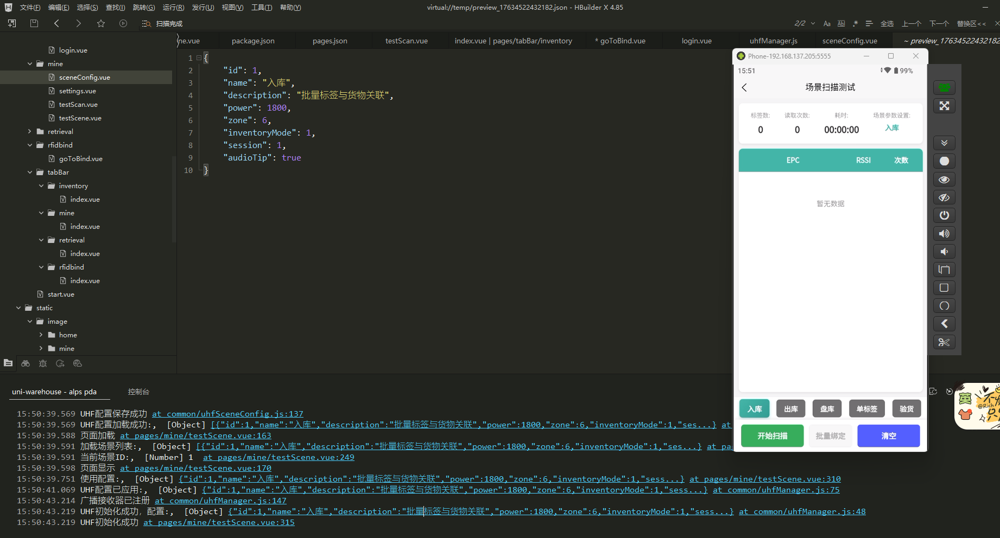
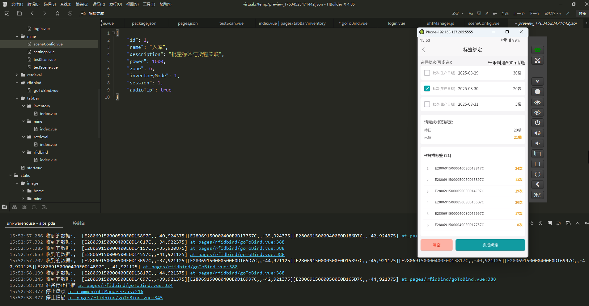

在00.Android开发文件夹中，谈到了开箱即用的封装好的插件

但是管理员修改的参数是要全局生效，而且持久化处理的

## 现有的代码优化

现在的优化场景是在场景参数配置哪部分

这里面存在一个小问题，就是本身 testScene.vue是由别的地方点击进到这个页面的，这就导致了加载很慢，得加载好才显示出来。这个才是其原有的uhfManager,我将testScene中修改了import uhfManager from '@/common/uhfManager.js';


只有管理员可以进入到页面


### 新的思考

1. 在别的页面加载使用，一样的初始化，不过是直接传递数值去使用对应场景的


## 最终效果

管理员登录进去之后，可以修改不同场景的uhf参数配置并存到localstorage中

别的页面只需要传递场景id就可以初始化对应场景的uhf配置

这样就可以灵活的设置好了


### uhf配置

`uhfManager.js`

```js
/**
 * UHF超高频模块管理器
 * 封装UHF设备的初始化、广播注册、扫描控制等功能
 */

const plugin = uni.requireNativePlugin('UniUHF');

class UHFManager {
	constructor() {
		this.isInitialized = false;
		this.isScanning = false;
		this.main = null;
		this.receiver = null;
		this.filter = null;
		this.onTagDataCallback = null;
		this.onKeyScanCallback = null;
		this.currentConfig = null;
	}

	/**
	 * 初始化UHF模块
	 * @param {Object} config - 配置参数
	 * @param {Number} config.power - 功率 (0-3300)
	 * @param {Number} config.zone - 区域代码 (6=中国)
	 * @param {Number} config.inventoryMode - 盘点模式 (0=单标签, 1=正常, 2=快速)
	 * @param {Number} config.session - Session (0=动态, 1=静态)
	 * @param {Boolean} config.audioTip - 是否开启提示音
	 * @returns {Boolean} 初始化是否成功
	 */
	init(config) {
		if (this.isInitialized) {
			console.warn('UHF已经初始化，跳过重复初始化');
			return true;
		}

		const result = plugin.initUHFManager();
		
		if (result === 1 || result === true) {
			this.isInitialized = true;
			this.currentConfig = config;
			
			// 应用配置
			this.applyConfig(config);
			
			// 注册广播接收器
			this.registerReceiver();
			
			console.log('UHF初始化成功，配置:', config);
			return true;
		} else {
			console.error('UHF初始化失败');
			return false;
		}
	}

	/**
	 * 应用UHF配置
	 * @param {Object} config - 配置参数
	 * @returns {Boolean} 是否应用成功
	 */
	applyConfig(config) {
		if (!this.isInitialized) {
			console.error('UHF未初始化，无法应用配置');
			return false;
		}

		try {
			plugin.setUHFPower(config.power || 3300);
			plugin.setUHFZone(config.zone || 6);
			plugin.setUHFInventoryMode(config.inventoryMode || 2);
			plugin.setUHFSession(config.session || 1);
			plugin.setAudioTip(config.audioTip !== false);
			
			this.currentConfig = config;
			console.log('UHF配置已应用:', config);
			return true;
		} catch (error) {
			console.error('应用UHF配置失败:', error);
			return false;
		}
	}

	/**
	 * 反初始化UHF模块
	 */
	uninit() {
		if (!this.isInitialized) return;

		// 先停止扫描
		this.stopScan();
		
		// 注销广播接收器
		this.unregisterReceiver();
		
		// 反初始化模块
		if (plugin) {
			plugin.uninitUHFManager();
			console.log('UHF已反初始化');
		}
		
		this.isInitialized = false;
		this.currentConfig = null;
	}

	/**
	 * 注册广播接收器
	 */
	registerReceiver() {
		// #ifdef APP-PLUS
		try {
			this.main = plus.android.runtimeMainActivity();
			
			const IntentFilter = plus.android.importClass('android.content.IntentFilter');
			this.filter = new IntentFilter();
			this.filter.addAction("com.pda.keycode.broacast"); // 按键广播
			this.filter.addAction("uni.pda.uhf.data");  // 标签广播
			
			const _this = this;
			this.receiver = plus.android.implements('io.dcloud.feature.internal.reflect.BroadcastReceiver', {
				onReceive: function(context, intent) {
					plus.android.importClass(intent);
					const action = intent.getAction();
					
					// 处理按键广播
					if (action === "com.pda.keycode.broacast") {
						const keycode = intent.getIntExtra("keycode", 0);
						const isKeyDown = intent.getBooleanExtra("isdown", false);
						
						// 手柄按键292
						if (keycode === 292) {
							if (_this.onKeyScanCallback) {
								_this.onKeyScanCallback(isKeyDown);
							}
						}
					}
					// 处理标签数据广播
					else if (action === "uni.pda.uhf.data") {
						const uhfdata = intent.getStringExtra("uhfdata");
						if (_this.onTagDataCallback) {
							_this.onTagDataCallback(uhfdata);
						}
					}
				}
			});
			
			this.main.registerReceiver(this.receiver, this.filter);
			console.log('广播接收器已注册');
		} catch (error) {
			console.error('注册广播接收器失败:', error);
		}
		// #endif
	}

	/**
	 * 注销广播接收器
	 */
	unregisterReceiver() {
		// #ifdef APP-PLUS
		try {
			if (this.main && this.receiver) {
				this.main.unregisterReceiver(this.receiver);
				this.receiver = null;
				this.filter = null;
				console.log('广播接收器已注销');
			}
		} catch (error) {
			console.error('注销广播接收器失败:', error);
		}
		// #endif
	}

	/**
	 * 开始扫描
	 * @returns {Boolean} 是否成功启动
	 */
	startScan() {
		if (!this.isInitialized) {
			console.error('UHF未初始化');
			return false;
		}

		if (this.isScanning) {
			console.warn('已经在扫描中');
			return true;
		}

		try {
			const result = plugin.startInventory();
			if (result) {
				this.isScanning = true;
				console.log('开始盘点');
				return true;
			} else {
				console.error('启动盘点失败');
				return false;
			}
		} catch (error) {
			console.error('启动扫描异常:', error);
			return false;
		}
	}

	/**
	 * 停止扫描
	 * @returns {Boolean} 是否成功停止
	 */
	stopScan() {
		if (!this.isScanning) {
			return true;
		}

		try {
			const result = plugin.stopInventory();
			if (result) {
				this.isScanning = false;
				console.log('停止盘点');
				return true;
			} else {
				console.error('停止盘点失败');
				return false;
			}
		} catch (error) {
			console.error('停止扫描异常:', error);
			return false;
		}
	}

	/**
	 * 设置标签数据回调
	 * @param {Function} callback - 回调函数 (uhfdata) => {}
	 */
	setOnTagDataCallback(callback) {
		this.onTagDataCallback = callback;
	}

	/**
	 * 设置按键扫描回调
	 * @param {Function} callback - 回调函数 (isKeyDown) => {}
	 */
	setOnKeyScanCallback(callback) {
		this.onKeyScanCallback = callback;
	}

	/**
	 * 获取当前配置
	 * @returns {Object} 当前配置
	 */
	getCurrentConfig() {
		return this.currentConfig;
	}

	/**
	 * 检查是否已初始化
	 * @returns {Boolean}
	 */
	isReady() {
		return this.isInitialized;
	}

	/**
	 * 检查是否正在扫描
	 * @returns {Boolean}
	 */
	isScanningNow() {
		return this.isScanning;
	}
}

// 导出单例
export default new UHFManager();
```

### 场景配置

`uhfSceneConfig.js`

```js
/**
 * UHF场景配置管理器 (优化版)
 * 提供不同场景下的UHF配置参数，支持持久化和距离计算
 */

// 功率与距离对照表（近似值，实际会受环境影响）
const POWER_DISTANCE_MAP = [
	{ power: 0,  distance: 0 },
	{ power: 500,  distance: 0.02 },
	{ power: 1000, distance: 0.1 },
	{ power: 1500, distance: 0.15 },
	{ power: 1800, distance: 0.18 },
	{ power: 2000, distance: 0.2 },
	{ power: 2200, distance: 0.22 },
	{ power: 2500, distance: 0.3 },
	{ power: 2800, distance: 0.4 },
	{ power: 3000, distance: 0.8 },
	{ power: 3300, distance: 1.0 }
];

/**
 * 配置参数说明:
 * @param {Number} id - 场景ID，唯一标识
 * @param {String} name - 场景名称
 * @param {String} description - 场景描述
 * @param {Number} power - 功率值，取值范围 0-3300，数值越大读取距离越远
 * @param {Number} zone - 区域代码，6代表中国
 * @param {Number} inventoryMode - 盘点模式
 * 						0 -- 普通模式
 * 						1 -- 新快速模式
 * 						2 -- 单标签模式（软件控制单标签）
 * 						3 -- E7读停模式
 * 						4 -- E7智能温控模式
 * 						5 -- 多标签模式（高密度标签）
 * @param {Number} session - Session模式，0=动态(适合移动标签)，1=静态(适合静止标签)
 * @param {Boolean} audioTip - 是否开启提示音
 */

// 预设场景配置
const PRESET_SCENES = [
	{
		id: 1,
		name: '入库',
		description: '批量标签与货物关联',
		power: 1800,
		zone: 6,
		inventoryMode: 1,  // 新快速模式
		session: 1,        // 静态Session
		audioTip: true
	},
	{
		id: 2,
		name: '出库',
		description: '验证标签并清零EPC',
		power: 2200,
		zone: 6,
		inventoryMode: 1,  // 新快速模式
		session: 1,        // 静态Session
		audioTip: true
	},
	{
		id: 3,
		name: '盘库',
		description: '适用于仓库盘点，大范围多标签扫描',
		power: 3300,
		zone: 6,
		inventoryMode: 5,  // 多标签模式（高密度）
		session: 0,        // 动态Session
		audioTip: true
	},
	{
		id: 4,
		name: '单标签',
		description: '精确定位单个标签',
		power: 500,
		zone: 6,
		inventoryMode: 2,  // 单标签模式
		session: 1,        // 静态Session
		audioTip: true
	},
	{
		id: 5,
		name: '验货',
		description: '货物验收检查',
		power: 2200,
		zone: 6,
		inventoryMode: 0,  // 普通模式
		session: 0,        // 动态Session
		audioTip: true
	}
];

const CONFIG_STORAGE_KEY = 'uhf_scene_configs_v2';
const CURRENT_SCENE_KEY = 'uhf_current_scene_id';

class UHFSceneConfig {
	constructor() {
		this.configs = [];
		this.currentSceneId = 1;
		this.loadConfigs();
	}

	/**
	 * 加载配置（从本地存储）
	 */
	loadConfigs() {
		try {
			const savedConfigs = uni.getStorageSync(CONFIG_STORAGE_KEY);
			const currentSceneId = uni.getStorageSync(CURRENT_SCENE_KEY);
			
			if (savedConfigs) {
				this.configs = JSON.parse(savedConfigs);
			} else {
				// 首次使用，使用预设配置
				this.configs = JSON.parse(JSON.stringify(PRESET_SCENES));
				this.saveConfigs();
			}
			
			if (currentSceneId) {
				this.currentSceneId = currentSceneId;
			}
			
			console.log('UHF配置加载成功:', this.configs);
		} catch (error) {
			console.error('加载UHF配置失败:', error);
			// 使用默认配置
			this.configs = JSON.parse(JSON.stringify(PRESET_SCENES));
		}
	}

	/**
	 * 保存配置到本地存储
	 */
	saveConfigs() {
		try {
			uni.setStorageSync(CONFIG_STORAGE_KEY, JSON.stringify(this.configs));
			console.log('UHF配置保存成功');
			return true;
		} catch (error) {
			console.error('保存UHF配置失败:', error);
			return false;
		}
	}

	/**
	 * 保存当前场景ID
	 */
	saveCurrentSceneId() {
		try {
			uni.setStorageSync(CURRENT_SCENE_KEY, this.currentSceneId);
			return true;
		} catch (error) {
			console.error('保存当前场景ID失败:', error);
			return false;
		}
	}

	/**
	 * 根据场景ID获取配置
	 * @param {Number} sceneId - 场景ID (1-5)，如果未提供则返回当前场景
	 * @returns {Object} 配置对象
	 */
	getConfig(sceneId) {
		// 如果未提供场景ID，使用当前场景ID
		if (!sceneId) {
			sceneId = this.currentSceneId;
		}
		
		const config = this.configs.find(item => item.id === sceneId);
		
		if (!config) {
			console.error(`场景ID ${sceneId} 不存在，使用默认场景1（入库）`);
			return JSON.parse(JSON.stringify(this.configs[0]));
		}
		
		// 返回配置的深拷贝，避免外部修改
		return JSON.parse(JSON.stringify(config));
	}

	/**
	 * 获取当前场景配置
	 * @returns {Object} 配置对象
	 */
	getCurrentConfig() {
		return this.getConfig(this.currentSceneId);
	}

	/**
	 * 设置场景配置
	 * @param {Number} sceneId - 场景ID
	 * @param {Object} config - 配置对象
	 * @returns {Boolean} 是否成功
	 */
	setConfig(sceneId, config) {
		const index = this.configs.findIndex(item => item.id === sceneId);
		
		if (index === -1) {
			console.error(`场景ID ${sceneId} 不存在`);
			return false;
		}
		
		// 更新配置，保留ID
		this.configs[index] = {
			...this.configs[index],
			...config,
			id: sceneId  // 确保ID不被修改
		};
		
		return this.saveConfigs();
	}

	/**
	 * 切换当前场景
	 * @param {Number} sceneId - 场景ID
	 * @returns {Boolean} 是否成功
	 */
	setCurrentScene(sceneId) {
		if (!this.isValidSceneId(sceneId)) {
			console.error('场景ID不存在:', sceneId);
			return false;
		}
		
		this.currentSceneId = sceneId;
		this.saveCurrentSceneId();
		console.log('切换场景:', sceneId);
		return true;
	}

	/**
	 * 获取当前场景ID
	 * @returns {Number}
	 */
	getCurrentSceneId() {
		return this.currentSceneId;
	}

	/**
	 * 获取所有场景列表
	 * @returns {Array} 场景列表
	 */
	getAllScenes() {
		return JSON.parse(JSON.stringify(this.configs));
	}

	/**
	 * 根据场景ID获取场景名称
	 * @param {Number} sceneId - 场景ID，如果未提供则使用当前场景
	 * @returns {String} 场景名称
	 */
	getSceneName(sceneId) {
		if (!sceneId) {
			sceneId = this.currentSceneId;
		}
		
		const config = this.configs.find(item => item.id === sceneId);
		return config ? config.name : '未知场景';
	}

	/**
	 * 验证场景ID是否有效
	 * @param {Number} sceneId - 场景ID
	 * @returns {Boolean}
	 */
	isValidSceneId(sceneId) {
		return this.configs.some(item => item.id === sceneId);
	}

	/**
	 * 重置场景配置为预设值
	 * @param {Number} sceneId - 场景ID
	 * @returns {Boolean} 是否成功
	 */
	resetConfig(sceneId) {
		const presetConfig = PRESET_SCENES.find(item => item.id === sceneId);
		
		if (!presetConfig) {
			console.error('预设配置不存在:', sceneId);
			return false;
		}
		
		return this.setConfig(sceneId, JSON.parse(JSON.stringify(presetConfig)));
	}

	/**
	 * 重置所有配置
	 * @returns {Boolean} 是否成功
	 */
	resetAllConfigs() {
		this.configs = JSON.parse(JSON.stringify(PRESET_SCENES));
		return this.saveConfigs();
	}

	/**
	 * 功率转距离（米）
	 * @param {Number} power - 功率值 (0-3300)
	 * @returns {String} 距离（米，保留1位小数）
	 */
	powerToDistance(power) {
		// 线性插值计算
		for (let i = 0; i < POWER_DISTANCE_MAP.length - 1; i++) {
			const current = POWER_DISTANCE_MAP[i];
			const next = POWER_DISTANCE_MAP[i + 1];
			
			if (power >= current.power && power <= next.power) {
				const ratio = (power - current.power) / (next.power - current.power);
				return (current.distance + (next.distance - current.distance) * ratio).toFixed(2);
			}
		}
		
		// 超出范围
		if (power < POWER_DISTANCE_MAP[0].power) {
			return POWER_DISTANCE_MAP[0].distance.toFixed(2);
		}
		return POWER_DISTANCE_MAP[POWER_DISTANCE_MAP.length - 1].distance.toFixed(2);
	}

	/**
	 * 距离转功率
	 * @param {Number} distance - 距离（米）
	 * @returns {Number} 功率值
	 */
	distanceToPower(distance) {
		// 线性插值计算
		for (let i = 0; i < POWER_DISTANCE_MAP.length - 1; i++) {
			const current = POWER_DISTANCE_MAP[i];
			const next = POWER_DISTANCE_MAP[i + 1];
			
			if (distance >= current.distance && distance <= next.distance) {
				const ratio = (distance - current.distance) / (next.distance - current.distance);
				return Math.round(current.power + (next.power - current.power) * ratio);
			}
		}
		
		// 超出范围
		if (distance < POWER_DISTANCE_MAP[0].distance) {
			return POWER_DISTANCE_MAP[0].power;
		}
		return POWER_DISTANCE_MAP[POWER_DISTANCE_MAP.length - 1].power;
	}

	/**
	 * 获取功率距离对照表
	 * @returns {Array}
	 */
	getPowerDistanceMap() {
		return JSON.parse(JSON.stringify(POWER_DISTANCE_MAP));
	}

	/**
	 * 获取最小功率值
	 * @returns {Number}
	 */
	getMinPower() {
		return POWER_DISTANCE_MAP[0].power;
	}

	/**
	 * 获取最大功率值
	 * @returns {Number}
	 */
	getMaxPower() {
		return POWER_DISTANCE_MAP[POWER_DISTANCE_MAP.length - 1].power;
	}

	/**
	 * 获取最小读取距离
	 * @returns {Number}
	 */
	getMinDistance() {
		return POWER_DISTANCE_MAP[0].distance;
	}

	/**
	 * 获取最大读取距离
	 * @returns {Number}
	 */
	getMaxDistance() {
		return POWER_DISTANCE_MAP[POWER_DISTANCE_MAP.length - 1].distance;
	}

	/**
	 * 获取盘点模式说明
	 * @param {Number} mode - 模式值
	 * @returns {String}
	 */
	getInventoryModeDesc(mode) {
		const modes = {
			0: '普通模式 - 标准盘点速度',
			1: '新快速模式 - 适合批量快速扫描',
			2: '单标签模式 - 精确查找单个标签',
			3: 'E7读停模式 - 读取后自动停止',
			4: 'E7智能温控模式 - 自动温度控制',
			5: '多标签模式 - 高密度标签环境'
		};
		return modes[mode] || '未知模式';
	}

	/**
	 * 获取Session说明
	 * @param {Number} session - Session值
	 * @returns {String}
	 */
	getSessionDesc(session) {
		const sessions = {
			0: 'Session 0 - 动态模式，适合移动标签',
			1: 'Session 1 - 静态模式，适合静止标签'
		};
		return sessions[session] || '未知Session';
	}

	/**
	 * 获取区域名称
	 * @param {Number} zone - 区域代码
	 * @returns {String}
	 */
	getZoneName(zone) {
		const zones = {
			1: '美国',
			2: '欧洲',
			4: '韩国',
			6: '中国',
			8: '日本'
		};
		return zones[zone] || '未知区域';
	}
}

// 导出单例
export default new UHFSceneConfig();
```

### 设置场景参数并测试效果页面

`SceneConfig.vue`

```vue
<template>
	<view class="config-page">
		<!-- 场景选择 -->
		<view class="section">
			<view class="section-title">场景选择</view>
			<view class="scene-list">
				<view 
					v-for="scene in sceneList" 
					:key="scene.id"
					class="scene-item"
					:class="{ 'scene-active': currentSceneId === scene.id }"
					@click="selectScene(scene.id)"
				>
					<view class="scene-name">{{ scene.name }}</view>
					<view class="scene-desc">{{ scene.description }}</view>
				</view>
			</view>
		</view>

		<!-- 配置参数 -->
		<view class="section">
			<view class="section-title">
				{{ currentConfig.name }}场景配置
				<text class="reset-btn" @click="resetCurrentConfig">恢复默认</text>
			</view>

			<!-- 功率/距离设置 -->
			<view class="config-item">
				<view class="config-label">
					<text class="label-text">读取距离</text>
					<text class="label-value">{{ readDistance }}米</text>
				</view>
				<slider 
					class="config-slider"
					:value="currentConfig.power" 
					:min="minPower" 
					:max="maxPower" 
					:step="powerStep"
					activeColor="#4dc3a6"
					backgroundColor="#e0e0e0"
					block-size="24"
					@change="onPowerChange"
				/>
				<view class="config-tips">
					<text>{{ minDistance }}m</text>
					<text class="power-value">功率: {{ currentConfig.power }}</text>
					<text>{{ maxDistance }}m</text>
				</view>
			</view>

			<!-- 区域设置 -->
			<view class="config-item">
				<view class="config-label">
					<text class="label-text">区域代码</text>
					<text class="label-value">{{ configManager.getZoneName(currentConfig.zone) }}</text>
				</view>
				<picker 
					mode="selector" 
					:range="zoneList" 
					range-key="name"
					:value="zoneIndex"
					@change="onZoneChange"
				>
					<view class="picker-view">
						<text>{{ configManager.getZoneName(currentConfig.zone) }}</text>
						<text class="picker-arrow">›</text>
					</view>
				</picker>
			</view>

			<!-- 盘点模式 -->
			<view class="config-item">
				<view class="config-label">
					<text class="label-text">盘点模式</text>
					<text class="label-value">{{ getModeName(currentConfig.inventoryMode) }}</text>
				</view>
				<picker 
					mode="selector" 
					:range="modeList" 
					range-key="name"
					:value="modeIndex"
					@change="onModeChange"
				>
					<view class="picker-view">
						<text>{{ getModeName(currentConfig.inventoryMode) }}</text>
						<text class="picker-arrow">›</text>
					</view>
				</picker>
				<view class="config-desc">{{ configManager.getInventoryModeDesc(currentConfig.inventoryMode) }}</view>
			</view>

			<!-- Session设置 -->
			<view class="config-item">
				<view class="config-label">
					<text class="label-text">Session模式</text>
					<text class="label-value">Session {{ currentConfig.session }}</text>
				</view>
				<picker 
					mode="selector" 
					:range="sessionList" 
					range-key="name"
					:value="sessionIndex"
					@change="onSessionChange"
				>
					<view class="picker-view">
						<text>Session {{ currentConfig.session }}</text>
						<text class="picker-arrow">›</text>
					</view>
				</picker>
				<view class="config-desc">{{ configManager.getSessionDesc(currentConfig.session) }}</view>
			</view>

			<!-- 提示音 -->
			<view class="config-item">
				<view class="config-label">
					<text class="label-text">提示音</text>
				</view>
				<switch 
					:checked="currentConfig.audioTip" 
					color="#4dc3a6"
					@change="onAudioTipChange"
				/>
			</view>
		</view>

		<!-- 功率距离对照表 -->
		<view class="section">
			<view class="section-title">功率距离对照表</view>
			<view class="reference-table">
				<view class="table-header">
					<text class="table-cell">功率</text>
					<text class="table-cell">约读距离</text>
				</view>
				<view 
					v-for="item in powerDistanceMap" 
					:key="item.power"
					class="table-row"
				>
					<text class="table-cell">{{ item.power }}</text>
					<text class="table-cell">{{ item.distance }}m</text>
				</view>
			</view>
			<view class="table-note">
				* 实际读取距离会受标签类型、环境干扰、天线方向等因素影响
			</view>
		</view>

		<!-- 底部按钮 -->
		<view class="button-container">
			<button class="btn btn-reset" @click="resetAllConfigs">重置所有配置</button>
			<button class="btn btn-save" @click="saveAndApply">保存并应用</button>
		</view>
	</view>
</template>

<script>
import uhfSceneConfig from '@/common/uhfSceneConfig';
import uhfManager from '@/common/uhfManager';

export default {
	data() {
		return {
			configManager: uhfSceneConfig,
			currentSceneId: 1,
			currentConfig: {},
			sceneList: [],
			
			// 从配置管理器获取的动态值
			minPower: 0,
			maxPower: 3300,
			minDistance: 0,
			maxDistance: 1.0,
			powerStep: 100, // 可以根据需要调整步长
			
			// 区域列表
			zoneList: [
				{ value: 1, name: '美国' },
				{ value: 2, name: '欧洲' },
				{ value: 4, name: '韩国' },
				{ value: 6, name: '中国' },
				{ value: 8, name: '日本' }
			],
			
			// 模式列表
			modeList: [
				{ value: 0, name: '普通模式' },
				{ value: 1, name: '新快速模式' },
				{ value: 2, name: '单标签模式' },
				{ value: 3, name: 'E7读停模式' },
				{ value: 4, name: 'E7智能温控' },
				{ value: 5, name: '多标签模式' }
			],
			
			// Session列表
			sessionList: [
				{ value: 0, name: 'Session 0' },
				{ value: 1, name: 'Session 1' }
			],
			
			powerDistanceMap: []
		}
	},
	
	computed: {
		readDistance() {
			return uhfSceneConfig.powerToDistance(this.currentConfig.power);
		},
		
		zoneIndex() {
			return this.zoneList.findIndex(item => item.value === this.currentConfig.zone);
		},
		
		modeIndex() {
			return this.modeList.findIndex(item => item.value === this.currentConfig.inventoryMode);
		},
		
		sessionIndex() {
			return this.sessionList.findIndex(item => item.value === this.currentConfig.session);
		}
	},
	
	onLoad() {
		this.loadConfig();
		this.loadPowerRange();
		this.powerDistanceMap = uhfSceneConfig.getPowerDistanceMap();
	},
	
	methods: {
		/**
		 * 加载配置
		 */
		loadConfig() {
			this.currentSceneId = uhfSceneConfig.getCurrentSceneId();
			this.currentConfig = JSON.parse(JSON.stringify(uhfSceneConfig.getCurrentConfig()));
			this.sceneList = uhfSceneConfig.getAllScenes();
		},
		
		/**
		 * 加载功率范围配置
		 */
		loadPowerRange() {
			this.minPower = uhfSceneConfig.getMinPower();
			this.maxPower = uhfSceneConfig.getMaxPower();
			this.minDistance = uhfSceneConfig.getMinDistance();
			this.maxDistance = uhfSceneConfig.getMaxDistance();
			
			console.log('功率范围:', {
				minPower: this.minPower,
				maxPower: this.maxPower,
				minDistance: this.minDistance,
				maxDistance: this.maxDistance
			});
		},
		
		/**
		 * 选择场景
		 */
		selectScene(sceneId) {
			this.currentSceneId = sceneId;
			this.currentConfig = JSON.parse(JSON.stringify(uhfSceneConfig.getConfig(sceneId)));
		},
		
		/**
		 * 功率改变
		 */
		onPowerChange(e) {
			this.currentConfig.power = e.detail.value;
		},
		
		/**
		 * 区域改变
		 */
		onZoneChange(e) {
			const index = e.detail.value;
			this.currentConfig.zone = this.zoneList[index].value;
		},
		
		/**
		 * 模式改变
		 */
		onModeChange(e) {
			const index = e.detail.value;
			this.currentConfig.inventoryMode = this.modeList[index].value;
		},
		
		/**
		 * Session改变
		 */
		onSessionChange(e) {
			const index = e.detail.value;
			this.currentConfig.session = this.sessionList[index].value;
		},
		
		/**
		 * 提示音改变
		 */
		onAudioTipChange(e) {
			this.currentConfig.audioTip = e.detail.value;
		},
		
		/**
		 * 获取模式名称
		 */
		getModeName(modeValue) {
			const mode = this.modeList.find(item => item.value === modeValue);
			return mode ? mode.name : '未知';
		},
		
		/**
		 * 重置当前场景配置
		 */
		resetCurrentConfig() {
			uni.showModal({
				title: '确认',
				content: '确定要恢复当前场景的默认配置吗?',
				success: (res) => {
					if (res.confirm) {
						uhfSceneConfig.resetConfig(this.currentSceneId);
						this.loadConfig();
						
						uni.showToast({
							title: '已恢复默认',
							icon: 'success'
						});
					}
				}
			});
		},
		
		/**
		 * 重置所有配置
		 */
		resetAllConfigs() {
			uni.showModal({
				title: '确认',
				content: '确定要重置所有场景的配置吗?',
				success: (res) => {
					if (res.confirm) {
						uhfSceneConfig.resetAllConfigs();
						this.loadConfig();
						
						uni.showToast({
							title: '所有配置已重置',
							icon: 'success'
						});
					}
				}
			});
		},
		
		/**
		 * 保存并应用配置
		 */
		saveAndApply() {
			// 保存配置
			const saveSuccess = uhfSceneConfig.setConfig(this.currentSceneId, this.currentConfig);
			
			if (!saveSuccess) {
				uni.showToast({
					title: '配置保存失败',
					icon: 'error'
				});
				return;
			}
			
			// 切换当前场景
			uhfSceneConfig.setCurrentScene(this.currentSceneId);
			
			// 如果UHF已初始化，重新应用配置
			if (uhfManager && uhfManager.isReady && uhfManager.isReady()) {
				uhfManager.applyConfig(this.currentConfig);
			}
			
			uni.showToast({
				title: '配置已保存',
				icon: 'success',
				duration: 2000
			});
			
			// 延迟返回
			setTimeout(() => {
				uni.navigateBack();
			}, 1500);
		}
	}
}
</script>

<style scoped>
.config-page {
	min-height: 100vh;
	background-color: #f5f5f5;
	padding-bottom: 120rpx;
}

/* 区块 */
.section {
	margin: 20rpx;
	background-color: #ffffff;
	border-radius: 16rpx;
	padding: 30rpx;
	box-shadow: 0 4rpx 12rpx rgba(0, 0, 0, 0.06);
}

.section-title {
	font-size: 32rpx;
	font-weight: bold;
	color: #333333;
	margin-bottom: 20rpx;
	display: flex;
	justify-content: space-between;
	align-items: center;
}

.reset-btn {
	font-size: 26rpx;
	color: #4dc3a6;
	font-weight: normal;
}

/* 场景列表 */
.scene-list {
	display: flex;
	flex-direction: column;
	gap: 16rpx;
}

.scene-item {
	padding: 24rpx;
	border-radius: 12rpx;
	background-color: #f8f8f8;
	border: 2rpx solid transparent;
	transition: all 0.3s;
}

.scene-item.scene-active {
	background-color: #e8f5f2;
	border-color: #4dc3a6;
}

.scene-name {
	font-size: 30rpx;
	font-weight: bold;
	color: #333333;
	margin-bottom: 8rpx;
}

.scene-desc {
	font-size: 24rpx;
	color: #999999;
}

/* 配置项 */
.config-item {
	margin-bottom: 32rpx;
}

.config-item:last-child {
	margin-bottom: 0;
}

.config-label {
	display: flex;
	justify-content: space-between;
	align-items: center;
	margin-bottom: 16rpx;
}

.label-text {
	font-size: 28rpx;
	color: #333333;
	font-weight: 500;
}

.label-value {
	font-size: 26rpx;
	color: #4dc3a6;
}

.config-slider {
	width: 100%;
	margin: 16rpx 0;
}

.config-tips {
	display: flex;
	justify-content: space-between;
	font-size: 22rpx;
	color: #999999;
	margin-top: 8rpx;
}

.power-value {
	color: #4dc3a6;
	font-weight: bold;
}

.picker-view {
	display: flex;
	justify-content: space-between;
	align-items: center;
	padding: 20rpx;
	background-color: #f8f8f8;
	border-radius: 8rpx;
	font-size: 28rpx;
	color: #333333;
}

.picker-arrow {
	font-size: 40rpx;
	color: #cccccc;
	font-weight: bold;
}

.config-desc {
	margin-top: 12rpx;
	font-size: 24rpx;
	color: #999999;
	line-height: 1.5;
}

/* 对照表 */
.reference-table {
	border: 1rpx solid #e0e0e0;
	border-radius: 8rpx;
	overflow: hidden;
}

.table-header {
	display: flex;
	background-color: #4dc3a6;
	padding: 20rpx;
}

.table-header .table-cell {
	flex: 1;
	text-align: center;
	font-size: 26rpx;
	font-weight: bold;
	color: #ffffff;
}

.table-row {
	display: flex;
	padding: 16rpx 20rpx;
	border-bottom: 1rpx solid #f0f0f0;
}

.table-row:last-child {
	border-bottom: none;
}

.table-cell {
	flex: 1;
	text-align: center;
	font-size: 26rpx;
	color: #666666;
}

.table-note {
	margin-top: 20rpx;
	font-size: 22rpx;
	color: #ff6b6b;
	line-height: 1.6;
}

/* 底部按钮 */
.button-container {
	position: fixed;
	bottom: 0;
	left: 0;
	right: 0;
	display: flex;
	padding: 20rpx;
	background-color: #ffffff;
	box-shadow: 0 -4rpx 12rpx rgba(0, 0, 0, 0.08);
}

.btn {
	flex: 1;
	height: 88rpx;
	line-height: 88rpx;
	margin: 0 10rpx;
	border-radius: 12rpx;
	font-size: 30rpx;
	font-weight: bold;
	border: none;
}

.btn-reset {
	background-color: #f0f0f0;
	color: #666666;
}

.btn-save {
	background-color: #4dc3a6;
	color: #ffffff;
}

.btn:active {
	opacity: 0.8;
}
</style>
```

## 最后的效果




管理员修改后的



